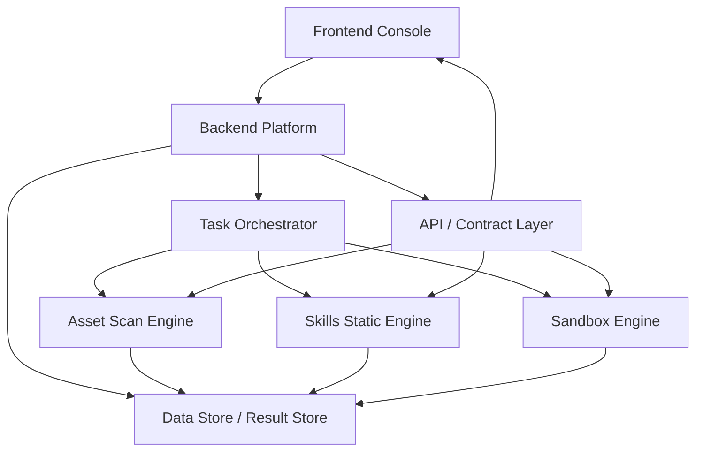

# 系统架构说明

## 1. 目标与设计原则

本项目面向 Agent 安全检测与管理场景，第一阶段目标是形成“平台统一编排 + 引擎独立执行 + 契约统一汇总”的工程基础。

核心设计原则如下：

- 平台后端负责任务、编排、聚合和对外 API，不承担具体检测实现。
- 三个检测引擎独立维护规则、运行逻辑和测试，降低不同能力线之间的耦合。
- 前后端与引擎之间通过统一数据结构和结果契约交互，契约收敛到 `shared`。
- 文档、样本、脚本、部署目录分层明确，便于 3 人团队并行推进。

## 2. 系统总体架构分层



建议按以下层次理解整体结构：

### 2.1 前端层

路径：`frontend/`

职责：

- 提供资产视图、任务列表、检测详情、告警看板、汇总报表等页面。
- 负责用户发起扫描任务、查看状态、筛选风险、追踪处置。
- 对接后端 API，不直接依赖各引擎内部实现。
- 第一版已落地统一后台壳子，包含固定侧边导航、顶部上下文栏、`Overview` 路由与结果路由占位页。
- 当前路由骨架包括：`/overview`、`/tasks`、`/tasks/:taskId`、`/results/assets`、`/results/static-analysis`、`/results/sandbox`。

前端只消费平台统一后的视图模型，不直接拼接不同引擎的原始数据格式。

### 2.2 后端平台层

路径：`backend/`

职责：

- 对外暴露统一 API。
- 维护任务生命周期，如创建、调度、取消、重试、归档。
- 作为引擎调用入口和结果汇总中心。
- 承担用户、权限、审计、报表聚合等平台能力。

后端应尽量保持“编排与聚合”定位，不把某个引擎的核心逻辑直接写进平台模块里。

### 2.3 引擎层

路径：`engines/asset-scan`、`engines/skills-static`、`engines/sandbox`

职责：

- `asset-scan`：发现 Agent 资产、识别指纹、补充暴露面和基础风险标签。
- `skills-static`：对 Skills 包、规则配置、脚本与依赖做静态检测。
- `sandbox`：监控 Agent 运行时行为，检测越权、敏感操作、异常调用，并触发阻断或告警。

三个引擎都应满足以下解耦要求：

- 可单独开发、测试和发布。
- 可通过统一契约与后端通信。
- 后端只依赖引擎输出结果，不依赖其内部规则实现。
- 后续如果某个引擎替换实现语言或部署方式，平台层不需要大改。

### 2.4 共享契约层

路径：`shared/`

职责：

- 存放公共类型定义，如 `Task`、`RiskLevel`、结果对象等。
- 存放接口契约定义，如任务请求、结果回传、状态枚举。
- 存放跨模块常量，如任务类型、规则分类、风险等级映射。
- 存放无业务耦合的工具函数，如时间格式化、ID 生成辅助、对象规范化函数。
- 第一版已落地的共享核心对象包括 `Task`、`BaseResult`、`RiskSummary`、`ApiResponse`。
- 第一版已落地的共享运行时能力包括：枚举守卫、任务与结果外壳规范化、任务类型到引擎类型的固定映射校验。

该层是前端、后端、引擎之间的公共语言层，应保持小而稳定。

### 2.5 数据层

逻辑位置：由后端统一访问，具体存储方案后续确定

职责：

- 存储任务元数据与执行状态。
- 存储资产扫描结果、静态分析结果、沙箱告警结果。
- 支持平台查询、过滤、统计与审计追踪。

第一阶段建议先按抽象能力设计，不急于绑定单一数据库实现。后续可按场景拆分为：

- 关系型数据库：任务、用户、配置、审计
- 文档或对象存储：原始结果、样本、报告
- 搜索或时序存储：告警检索、运行事件

### 2.6 部署层

路径：`deploy/`

职责：

- 管理 Docker、Compose、Kubernetes 等部署资产。
- 为本地联调、测试环境、生产环境逐步沉淀部署模板。
- 明确前端、后端、引擎、存储依赖之间的部署关系。

## 3. 模块关系说明

### 3.1 frontend 与 backend

- 前端只访问后端 API。
- 前端不直接访问引擎，也不消费引擎私有格式。
- 页面聚合逻辑尽量收敛到后端，前端以展示和交互为主。

### 3.2 backend 与 engines

- 后端向引擎下发任务。
- 引擎执行检测后回传结构化结果，或由后端主动拉取。
- 后端负责统一状态管理、结果归档和跨引擎汇总。

建议后续通过适配器模式实现引擎接入，如：

- `EngineClient` 接口
- `AssetScanEngineClient`
- `SkillsStaticEngineClient`
- `SandboxEngineClient`

这样平台在逻辑上依赖“能力接口”，而不是依赖某个具体进程或调用方式。

### 3.3 shared 在整体中的位置

- 为前端提供统一展示模型和枚举。
- 为后端提供任务、结果、告警等核心领域对象。
- 为引擎提供标准输入输出结构，减少重复定义。

如果某个类型仅在单个模块内部使用，不应放入 `shared`。

## 4. 三条核心业务流程

### 4.1 资产测绘与指纹识别流程

1. 用户在前端创建资产扫描任务。
2. 后端写入 `Task`，并调度 `asset-scan` 引擎执行。
3. 引擎采集目标信息，输出资产指纹、暴露面、识别标签和风险初判。
4. 后端归档结果，生成平台可查询的资产视图。
5. 前端展示资产清单、指纹详情和风险摘要。

### 4.2 Skills 静态安全检测流程

1. 用户上传或指定 Skills 包路径。
2. 后端创建静态分析任务并分发给 `skills-static` 引擎。
3. 引擎执行规则匹配、依赖分析、敏感能力识别和风险分级。
4. 后端汇总命中规则、风险等级和修复建议。
5. 前端展示分析报告，并支持与任务、资产维度关联查看。

### 4.3 动态沙箱监控与阻断流程

1. 用户或调度系统发起沙箱检测会话。
2. 后端创建任务并拉起或接入 `sandbox` 引擎会话。
3. 沙箱引擎采集运行时操作、外联行为、敏感资源访问等事件。
4. 策略模块识别越权或高危动作，生成 `SandboxAlert`，必要时执行阻断。
5. 后端统一保存告警与会话摘要，前端以告警流和会话详情方式展示。

## 5. 目录与工程骨架建议

### 5.1 backend 建议结构

```text
backend/src/
├─ common/      # 公共拦截器、异常、日志、工具
├─ config/      # 配置加载与环境变量管理
└─ modules/     # 按业务能力拆分模块
```

建议优先规划的模块包括：

- `task-center`
- `asset-management`
- `analysis-management`
- `sandbox-monitor`
- `reporting`

### 5.2 engines 建议结构

```text
engines/<engine-name>/
├─ src/         # 核心执行逻辑
├─ rules/       # 检测规则或策略
├─ policies/    # 仅 sandbox 使用，可放策略定义
└─ tests/       # 引擎自测
```

### 5.3 docs 建议结构

- `architecture.md`：总体架构说明
- `api-contract.md`：统一接口与数据结构草案
- `development-plan.md`：阶段计划与里程碑
- `adr/`：重要架构决策记录
- `meeting-notes/`：需求评审、周会、联调纪要
- `plans/`：专题方案、拆解计划、里程碑补充文档

## 6. 第一阶段落地建议

第一阶段不追求完整业务，而是优先打通工程链路：

1. 统一 `shared` 中的核心类型与结果结构。`REQ-01` 已完成第一版基线。
2. 后端完成最小任务中心与结果接收 API。
3. 至少一个引擎先以模拟执行方式完成结果回传。
4. 前端先完成统一后台 layout、Overview 页面与任务/结果页占位。
5. 在 `samples/` 中准备一批最小样本，供联调与测试复用。

当前工程基线暂定为：

- workspace 管理：`pnpm workspace`
- Node.js 基线：`22.17.0`
- TypeScript 约束：`strict: true`

以上基线用于平台骨架阶段的契约与测试落地，后续如果项目级工具链决策变化，应先更新 `metadata.md` 再统一调整。
## REQ-07 Backend Engine Adapter Baseline

当前 backend 在 `task-center` 内新增了一层稳定的引擎接入边界：

- `TaskCenterService` 继续负责任务创建、任务查询和仓储写入
- `TaskEngineService` 负责把 `Task` 转成未来引擎会消费的 dispatch ticket，并生成平台统一的初始 `BaseResult` 与 `RiskSummary`
- `EngineAdapterRegistry` 负责按 `task_type` 查找 adapter，避免平台主流程散落引擎分支判断
- 三个 adapter 目前都只保留占位职责，不承载真实引擎执行逻辑

当前 adapter 的稳定接口包括：

- `taskType`
- `engineType`
- `createDispatchPayload(task)`
- `createInitialDetails(task)`

后续真实引擎接入时，优先保持以下位置稳定：

- 对外 HTTP API 不变
- `Task`、`BaseResult`、`RiskSummary` 的平台壳子不变
- `TaskCenterService` 的任务中心职责不变
- 新的引擎提交、轮询、回调或结果回填逻辑优先落在 `TaskEngineService` 与 adapter 层，而不是直接写进 controller

## REQ-SKILLS-STATIC DTO Boundary Baseline

当前 `skills-static` 仍处于平台兼容骨架阶段，边界拆分如下：

- shared 负责声明 `skills-static` 与平台之间的稳定 DTO / result 类型
- backend `SkillsStaticTaskAdapter` 负责两段最小映射：
  - `Task.parameters` -> `analysis_parameters`
  - engine placeholder result -> `SkillsStaticResultDetails`
- public task-center API 保持不变，controller 路由不新增
- `BaseResult` 继续作为唯一统一结果外壳，`static_analysis` 只在 `details.rule_hits[]` 这一处收敛更强类型

当前明确不做：

- 真实 `skills-static` 扫描执行逻辑
- 上传 / zip / object storage / callback / retry 流程
- 新的平台级 `risk_score`、`projectId`、`assetId`、`tenantId` 约束

## REQ-ASSET-FINGERPRINT-002 Offline Matcher Baseline

当前 `asset_scan` adapter 在占位基线之上新增了一条仅用于 TDD 的离线路径：

- `AssetFingerprintService` 直接消费 `engines/asset-scan/rules/fingerprints.v1.yaml`
- 服务读取 `samples/assets/fingerprint-positive` 与 `samples/assets/fingerprint-negative` 下的 JSON 样本，按权重规则计算置信度
- `AssetScanTaskAdapter` 在收到 `parameters.sample_ref` 时，会把离线匹配结果映射为统一的 `AssetScanResultDetails`
- 对外 HTTP API 保持原路径不变，新增能力只体现在 `details` 的初始内容上

当前仍然明确不做：

- 不发起真实网络请求
- 不做后台异步执行或状态推进
- 不把样本驱动逻辑泄漏成 engine 私有结构之外的额外平台契约

## REQ-ASSET-PROBE-004 Phase G Minimal Live Probe

阶段 G 在保持离线样本路径可用的前提下，新增了最小真实探针执行通道：

- 新增 `AssetProbeService`，按 `engines/asset-scan/rules/probes.v1.yaml` 的 target 级探针配置执行最小 HTTP / WebSocket 采集
- `AssetScanTaskAdapter` 支持两条输入路径并存：
    - `sample_ref`：离线样本回放
    - `probe_mode=live + probe_target_id`：本地受控目标实时采集
- 在受控测试环境下，可通过 `probe_port_hint` 保持逻辑端口信号与真实识别规则一致
- live probe 采集结果会转成 matcher 可消费的 observation，再通过 `AssetFingerprintService` 统一产出 `AssetScanResultDetails`

为支持 live probe 的异步 I/O，任务创建链路已调整为异步：

- `TaskCenterController.createTask` -> async
- `TaskCenterService.createTask` -> async
- `TaskEngineService.createInitialArtifacts` -> async

该阶段仍遵守边界：

- 仅允许 localhost/测试容器/mock server 受控目标
- 不引入公网扫描与分布式调度
