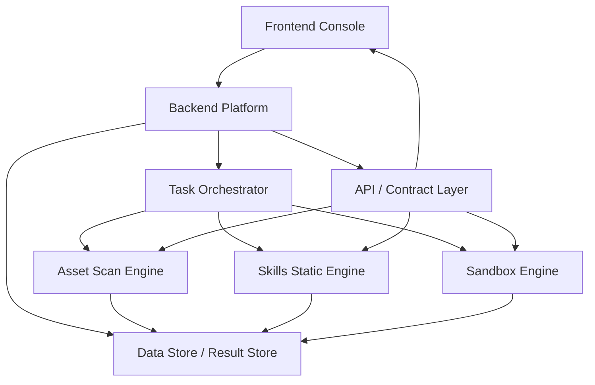

# 系统架构说明

## 1. 目标与设计原则

本项目面向 Agent 安全检测与管理场景，第一阶段目标是形成“平台统一编排 + 引擎独立执行 + 契约统一汇总”的工程基础。

核心设计原则如下：

- 平台后端负责任务、编排、聚合和对外 API，不承担具体检测实现。
- 三个检测引擎独立维护规则、运行逻辑和测试，降低不同能力线之间的耦合。
- 前后端与引擎之间通过统一数据结构和结果契约交互，契约收敛到 `shared`。
- 文档、样本、脚本、部署目录分层明确，便于 3 人团队并行推进。

## 2. 系统总体架构分层


```mermaid
flowchart TD
    A["Frontend Console"] --> B["Backend Platform"]
    B --> C["Task Orchestrator"]
    C --> D["Asset Scan Engine"]
    C --> E["Skills Static Engine"]
    C --> F["Sandbox Engine"]
    B --> G["Data Store / Result Store"]
    D --> G
    E --> G
    F --> G
    B --> H["API / Contract Layer"]
    H --> A
    H --> D
    H --> E
    H --> F
```

建议按以下层次理解整体结构：

### 2.1 前端层

路径：`frontend/`

职责：

- 提供资产视图、任务列表、检测详情、告警看板、汇总报表等页面。
- 负责用户发起扫描任务、查看状态、筛选风险、追踪处置。
- 对接后端 API，不直接依赖各引擎内部实现。
- 第一版已落地统一后台壳子，包含固定侧边导航、顶部上下文栏、`Overview` 路由与结果路由占位页。
- 当前路由骨架包括：`/overview`、`/tasks`、`/tasks/:taskId`、`/results/assets`、`/results/static-analysis`、`/results/sandbox`。

前端只消费平台统一后的视图模型，不直接拼接不同引擎的原始数据格式。

### 2.2 后端平台层

路径：`backend/`

职责：

- 对外暴露统一 API。
- 维护任务生命周期，如创建、调度、取消、重试、归档。
- 作为引擎调用入口和结果汇总中心。
- 承担用户、权限、审计、报表聚合等平台能力。

后端应尽量保持“编排与聚合”定位，不把某个引擎的核心逻辑直接写进平台模块里。

### 2.3 引擎层

路径：`engines/asset-scan`、`engines/skills-static`、`engines/sandbox`

职责：

- `asset-scan`：发现 Agent 资产、识别指纹、补充暴露面和基础风险标签。
- `skills-static`：对 Skills 包、规则配置、脚本与依赖做静态检测。
- `sandbox`：监控 Agent 运行时行为，检测越权、敏感操作、异常调用，并触发阻断或告警。

三个引擎都应满足以下解耦要求：

- 可单独开发、测试和发布。
- 可通过统一契约与后端通信。
- 后端只依赖引擎输出结果，不依赖其内部规则实现。
- 后续如果某个引擎替换实现语言或部署方式，平台层不需要大改。

### 2.4 共享契约层

路径：`shared/`

职责：

- 存放公共类型定义，如 `Task`、`RiskLevel`、结果对象等。
- 存放接口契约定义，如任务请求、结果回传、状态枚举。
- 存放跨模块常量，如任务类型、规则分类、风险等级映射。
- 存放无业务耦合的工具函数，如时间格式化、ID 生成辅助、对象规范化函数。
- 第一版已落地的共享核心对象包括 `Task`、`BaseResult`、`RiskSummary`、`ApiResponse`。
- 第一版已落地的共享运行时能力包括：枚举守卫、任务与结果外壳规范化、任务类型到引擎类型的固定映射校验。

该层是前端、后端、引擎之间的公共语言层，应保持小而稳定。

### 2.5 数据层

逻辑位置：由后端统一访问，具体存储方案后续确定

职责：

- 存储任务元数据与执行状态。
- 存储资产扫描结果、静态分析结果、沙箱告警结果。
- 支持平台查询、过滤、统计与审计追踪。

第一阶段建议先按抽象能力设计，不急于绑定单一数据库实现。后续可按场景拆分为：

- 关系型数据库：任务、用户、配置、审计
- 文档或对象存储：原始结果、样本、报告
- 搜索或时序存储：告警检索、运行事件

### 2.6 部署层

路径：`deploy/`

职责：

- 管理 Docker、Compose、Kubernetes 等部署资产。
- 为本地联调、测试环境、生产环境逐步沉淀部署模板。
- 明确前端、后端、引擎、存储依赖之间的部署关系。

## 3. 模块关系说明

### 3.1 frontend 与 backend

- 前端只访问后端 API。
- 前端不直接访问引擎，也不消费引擎私有格式。
- 页面聚合逻辑尽量收敛到后端，前端以展示和交互为主。

### 3.2 backend 与 engines

- 后端向引擎下发任务。
- 引擎执行检测后回传结构化结果，或由后端主动拉取。
- 后端负责统一状态管理、结果归档和跨引擎汇总。

当前 `asset-scan` 最小闭环已采用“backend 进程桥接 engine”模式：

- backend `AssetScanTaskAdapter` 只做编排与委托，不执行探针/打分业务逻辑。
- engine 通过 `engines/asset-scan/src/bridge/scan-task.ts` 接收 task payload（stdin JSON）并返回标准 `details`（stdout JSON）。
- 探针执行与规则打分逻辑落在 `engines/asset-scan/src/runtime/`，与 backend 平台职责分离。

建议后续通过适配器模式实现引擎接入，如：

- `EngineClient` 接口
- `AssetScanEngineClient`
- `SkillsStaticEngineClient`
- `SandboxEngineClient`

这样平台在逻辑上依赖“能力接口”，而不是依赖某个具体进程或调用方式。

### 3.3 shared 在整体中的位置

- 为前端提供统一展示模型和枚举。
- 为后端提供任务、结果、告警等核心领域对象。
- 为引擎提供标准输入输出结构，减少重复定义。

如果某个类型仅在单个模块内部使用，不应放入 `shared`。

## 4. 三条核心业务流程

### 4.1 资产测绘与指纹识别流程

1. 用户在前端创建资产扫描任务。
2. 后端写入 `Task`，并调度 `asset-scan` 引擎执行。
3. 引擎采集目标信息，输出资产指纹、暴露面、识别标签和风险初判。
4. 后端归档结果，生成平台可查询的资产视图。
5. 前端展示资产清单、指纹详情和风险摘要。

### 4.2 Skills 静态安全检测流程

1. 用户上传或指定 Skills 包路径。
2. 后端创建静态分析任务并分发给 `skills-static` 引擎。
3. 引擎执行规则匹配、依赖分析、敏感能力识别和风险分级。
4. 后端汇总命中规则、风险等级和修复建议。
5. 前端展示分析报告，并支持与任务、资产维度关联查看。

### 4.3 动态沙箱监控与阻断流程

1. 用户或调度系统发起沙箱检测会话。
2. 后端创建任务并拉起或接入 `sandbox` 引擎会话。
3. 沙箱引擎采集运行时操作、外联行为、敏感资源访问等事件。
4. 策略模块识别越权或高危动作，生成 `SandboxAlert`，必要时执行阻断。
5. 后端统一保存告警与会话摘要，前端以告警流和会话详情方式展示。

## 5. 目录与工程骨架建议

### 5.1 backend 建议结构

```text
backend/src/
├─ common/      # 公共拦截器、异常、日志、工具
├─ config/      # 配置加载与环境变量管理
└─ modules/     # 按业务能力拆分模块
```

建议优先规划的模块包括：

- `task-center`
- `asset-management`
- `analysis-management`
- `sandbox-monitor`
- `reporting`

### 5.2 engines 建议结构

```text
engines/<engine-name>/
├─ src/         # 核心执行逻辑
├─ rules/       # 检测规则或策略
├─ policies/    # 仅 sandbox 使用，可放策略定义
└─ tests/       # 引擎自测
```

### 5.3 docs 建议结构

- `architecture.md`：总体架构说明
- `api-contract.md`：统一接口与数据结构草案
- `development-plan.md`：阶段计划与里程碑
- `adr/`：重要架构决策记录
- `meeting-notes/`：需求评审、周会、联调纪要
- `plans/`：专题方案、拆解计划、里程碑补充文档

## 6. 第一阶段落地建议

第一阶段不追求完整业务，而是优先打通工程链路：

1. 统一 `shared` 中的核心类型与结果结构。`REQ-01` 已完成第一版基线。
2. 后端完成最小任务中心与结果接收 API。
3. 至少一个引擎先以模拟执行方式完成结果回传。
4. 前端先完成统一后台 layout、Overview 页面与任务/结果页占位。
5. 在 `samples/` 中准备一批最小样本，供联调与测试复用。

当前工程基线暂定为：

- workspace 管理：`pnpm workspace`
- Node.js 基线：`22.17.0`
- TypeScript 约束：`strict: true`

以上基线用于平台骨架阶段的契约与测试落地，后续如果项目级工具链决策变化，应先更新 `metadata.md` 再统一调整。
## REQ-07 Backend Engine Adapter Baseline

当前 backend 在 `task-center` 内新增了一层稳定的引擎接入边界：

- `TaskCenterService` 继续负责任务创建、任务查询和仓储写入
- `TaskEngineService` 负责把 `Task` 转成未来引擎会消费的 dispatch ticket，并生成平台统一的初始 `BaseResult` 与 `RiskSummary`
- `EngineAdapterRegistry` 负责按 `task_type` 查找 adapter，避免平台主流程散落引擎分支判断
- 三个 adapter 目前都只保留占位职责，不承载真实引擎执行逻辑

当前 adapter 的稳定接口包括：

- `taskType`
- `engineType`
- `createDispatchPayload(task)`
- `createInitialDetails(task)`

后续真实引擎接入时，优先保持以下位置稳定：

- 对外 HTTP API 不变
- `Task`、`BaseResult`、`RiskSummary` 的平台壳子不变
- `TaskCenterService` 的任务中心职责不变
- 新的引擎提交、轮询、回调或结果回填逻辑优先落在 `TaskEngineService` 与 adapter 层，而不是直接写进 controller

## REQ-SKILLS-STATIC DTO Boundary Baseline

当前 `skills-static` 仍处于平台兼容骨架阶段，边界拆分如下：

- shared 负责声明 `skills-static` 与平台之间的稳定 DTO / result 类型
- backend `SkillsStaticTaskAdapter` 负责两段最小映射：
  - `Task.parameters` -> `analysis_parameters`
  - engine placeholder result -> `SkillsStaticResultDetails`
- public task-center API 保持不变，controller 路由不新增
- `BaseResult` 继续作为唯一统一结果外壳，`static_analysis` 只在 `details.rule_hits[]` 这一处收敛更强类型

当前明确不做：

- 真实 `skills-static` 扫描执行逻辑
- 上传 / zip / object storage / callback / retry 流程
- 新的平台级 `risk_score`、`projectId`、`assetId`、`tenantId` 约束

## REQ-ASSET-FINGERPRINT-002 Offline Matcher Baseline

当前 `asset_scan` adapter 在占位基线之上新增了一条仅用于 TDD 的离线路径：

- `AssetFingerprintService` 直接消费 `engines/asset-scan/rules/fingerprints.v1.yaml`
- 服务读取 `samples/assets/fingerprint-positive` 与 `samples/assets/fingerprint-negative` 下的 JSON 样本，按权重规则计算置信度
- `AssetScanTaskAdapter` 在收到 `parameters.sample_ref` 时，会把离线匹配结果映射为统一的 `AssetScanResultDetails`
- 对外 HTTP API 保持原路径不变，新增能力只体现在 `details` 的初始内容上

当前仍然明确不做：

- 不发起真实网络请求
- 不做后台异步执行或状态推进
- 不把样本驱动逻辑泄漏成 engine 私有结构之外的额外平台契约

## REQ-ASSET-PROBE-004 Phase G Minimal Live Probe

阶段 G 在保持离线样本路径可用的前提下，新增了最小真实探针执行通道：

- 新增 `AssetProbeService`，按 `engines/asset-scan/rules/probes.v1.yaml` 的 target 级探针配置执行最小 HTTP / WebSocket 采集
- `AssetScanTaskAdapter` 支持两条输入路径并存：
    - `sample_ref`：离线样本回放
    - `probe_mode=live + probe_target_id`：本地受控目标实时采集
- 在受控测试环境下，可通过 `probe_port_hint` 保持逻辑端口信号与真实识别规则一致
- live probe 采集结果会转成 matcher 可消费的 observation，再通过 `AssetFingerprintService` 统一产出 `AssetScanResultDetails`

为支持 live probe 的异步 I/O，任务创建链路已调整为异步：

- `TaskCenterController.createTask` -> async
- `TaskCenterService.createTask` -> async
- `TaskEngineService.createInitialArtifacts` -> async

该阶段仍遵守边界：

- 仅允许 localhost/测试容器/mock server 受控目标
- 不引入公网扫描与分布式调度

## REQ-SKILLS-STATIC Mock Closed Loop

`skills_static` now has one additional backend-internal step beyond dispatch registration:

- `SkillsStaticEngineClient` returns a deterministic mock analysis result after it accepts a `static_analysis` dispatch ticket
- `TaskCenterService` keeps the existing orchestration boundary and performs a second repository save for the same `task_id`
- `TaskEngineService` converts that mock payload into the finished platform shells that already exist today: `Task`, `BaseResult`, and `RiskSummary`
- the read side stays unchanged: the existing task-center query routes expose the backfilled record

This is intentionally still a skeleton-stage integration:

- no new public API
- no engine-specific controller
- no real `skills-static` scan execution
- no retry, callback, upload, object-storage, or timeout-governance workflow

## REQ-SKILLS-STATIC Internal Core Objects

The backend now extracts the `skills_static` internal normalization and aggregation logic into dedicated core objects instead of leaving that behavior spread across one adapter file.

- `SkillsStaticEngineOutput` is the loose backend-internal input shell for raw analysis output from any future detection-library adapter
- `SkillsStaticResultNormalizer` converts that loose output into stable `SkillsStaticResultDetails`, strips `engine_private_*` fields and `risk_score`, and raises a structured internal error for malformed input
- `RiskSummaryDeriver` is the single backend runtime source of truth for deriving `risk_level` and severity counts from normalized `rule_hits`
- `SkillsStaticTaskAdapter` now stays focused on dispatch payload creation and initial placeholder details
- `TaskCenterService` catches malformed internal engine output and preserves the existing pending shell instead of widening the public contract or failing the task-center read shape

## REQ-SKILLS-STATIC Minimal Real Detection

`skills_static` now has one minimal real-tool path in addition to the existing mock provider:

- `SkillsStaticEngineClient` selects its provider from `SKILLS_STATIC_ENGINE_PROVIDER`
- `mock` remains the default provider and keeps the deterministic closed-loop behavior used by the current integration baseline
- `semgrep` is the single real provider for this stage and is executed through the local CLI, without any external service dependency
- `SemgrepRunner` is responsible only for invoking `semgrep scan` and reading JSON output
- `SemgrepOutputMapper` converts raw `semgrep` JSON into the existing `SkillsStaticEngineOutput` shell; it does not change the downstream normalizer contract
- `SkillsStaticResultNormalizer` and `RiskSummaryDeriver` stay unchanged and continue to define the normalized platform contract
- the public API remains unchanged: `POST /api/tasks` is still the only write entry, and the existing task/result/risk-summary reads remain the only public read path

This stage intentionally still does not include:

- multiple detection-library providers
- public API changes
- retry / timeout / callback / logging governance
- report rendering or evidence-display flows

## REQ-SKILLS-STATIC Standardized Risk Result

The platform now treats `skills_static` provider output as an internal staging format, not as the stable result contract itself.

- `mock` and `semgrep` must both converge into the same provider-agnostic standardized result before the task-center read path exposes the finished record
- the strong standardized fields are currently: `sample_name`, `language`, `rule_hits[].rule_id`, `rule_hits[].severity`, `rule_hits[].message`, `rule_hits[].file_path`, and paired valid `line_start` / `line_end`
- `RiskSummary` is part of the same strong contract and must stay derived only from normalized `rule_hits`
- `entry_files`, `files_scanned`, `sensitive_capabilities`, `dependency_summary`, and optional extension fields stay on a weaker contract for now: they must remain structurally valid and non-conflicting, but they are not yet required to have provider parity
- future providers should land in `raw output -> mapper -> SkillsStaticEngineOutput -> SkillsStaticResultNormalizer -> RiskSummaryDeriver`, without changing the public API or the platform orchestration path

## REQ-SKILLS-STATIC Minimal Runtime Governance

The real `skills_static` path now has one minimal runtime-governance layer on top of the existing provider and normalization flow.

- `SkillsStaticExecutionError` is the internal-only failure envelope for real-path failures; it carries a stable `phase + reason + provider` tuple instead of exposing arbitrary provider exceptions
- `SkillsStaticEngineClient` records the minimum diagnostic event set: `provider_selected`, `scan_started`, `scan_succeeded`, and `scan_failed`
- `SemgrepRunner` now owns the minimal timeout boundary for the real provider path and maps missing target/ruleset, binary startup failure, non-zero exit, invalid JSON, and timeout into stable runner failures
- `TaskCenterService` keeps the public write entry unchanged, but runtime failures no longer bubble out as raw provider exceptions after the initial save; instead the task-center path backfills stable failed `Task / BaseResult / RiskSummary` shells
- timeout and provider/runtime diagnostics remain backend-internal; raw stderr/stdout and arbitrary exception strings are intentionally not promoted into shared or public API contracts

## REQ-ASSET-SCAN-PORT-007 FOFA Workflow Script Layer

Repository-side FOFA workflow scripts are treated as a dev execution/support layer, not a backend platform API layer.

- `scripts/dev/intel/fofa-portscan-workflow.ts` coordinates the minimal `naabu -> nmap -> sample output` flow.
- `scripts/dev/intel/fofa-sample-export.ts` persists separated JSON sample artifacts.

Boundary rules for this layer:

- Scripts do not introduce new public HTTP endpoints.
- Scripts do not bypass backend task-center contracts.
- Script outputs are artifacts for evidence accumulation and replay, not frontend-facing API payloads.
- Tool responsibilities remain explicit: naabu for open ports, nmap for hit-port service evidence.

## REQ-T1-SUPERVISION-UI-009 Behavior Supervision Console

REQ-009 adds a read-only Track 1 behavior supervision console. The verified end-to-end flow is:

```text
normalized sandbox result
  -> task repository
  -> supervision projector
  -> shared safe read DTO
  -> supervision API
  -> React polling workbench
  -> sanitized evidence JSON
```

### Layer responsibilities

- `shared/types/supervision.ts` and `shared/contracts/supervision.ts` define the only DTO shapes the frontend may consume. Normalizers reject unknown fields, exact-key evidence exports, and any record whose `evidence_available` flag is not strictly `true`.
- `backend/src/modules/supervision/supervision-projector.ts` projects stored `SandboxRunResult` records field-by-field into safe view models. It never copies `BaseResult.summary`, decision `reason`, alert `title`/`reason`, blocked-record `reason`/`resource_ref`, or `metadata`. Malformed stored records raise a `DomainError` instead of returning a partial projection.
- `backend/src/modules/supervision/supervision.service.ts` validates filters, enforces the 100-row cap, aggregates counts over all matched sessions, and looks up detail/evidence by session ID.
- `backend/src/modules/supervision/supervision.controller.ts` exposes three GET routes wrapped in the standard `ApiResponse<T>` envelope.
- `frontend/src/services/supervision-service.ts` is the only frontend boundary that talks to the supervision API. It tracks three source states: `api`, `integration-error`, and `mock`.
- `frontend/src/hooks/useSupervisionPolling.ts` polls every three seconds while the page is visible and the selected session is not terminal. It aborts in-flight requests on unmount or session change, surfaces a `stale` freshness signal on failure, and keeps the last successful snapshot.
- `frontend/src/pages/SandboxAlertsPage.tsx` composes the overview header, filters, session list, and inspector. URL query state (`session_id`, `q`, `status`, `risk_level`, `action`, `scenario_id`, `tool_name`) is the single source of truth for filter and selection state.
- `frontend/src/components/supervision/SupervisionEventTimeline.tsx` and `SupervisionEventDetails.tsx` render the seven approved event types through an exhaustive discriminated switch. There is no generic object traversal, no `dangerouslySetInnerHTML`, and no raw content rendering.
- `frontend/src/components/task-detail/SandboxTaskSupervisionSection.tsx` loads the supervision detail by session ID and passes a safe DTO to the presentational `SandboxAlertSection`. The task detail page renders a deep link to `/results/sandbox?session_id=...` for investigation.

### Explicit non-goals

The following capabilities remain outside REQ-009 scope and must not be added without a new requirement:

- engine source imports from `shared/`, `backend/supervision`, or any `frontend/` module
- persistence (the console reads only from the in-memory task repository)
- streaming (no WebSocket, no SSE, no EventSource)
- approval / resume / acknowledge-write actions
- full report generation (no PDF, CSV, XLSX, or ZIP export)
- OpenClaw integration, cluster aggregation, or pagination

## REQ-T1-SANDBOX-CONTRACT-005 Track 1 Sandbox Supervision Contract

Track 1 sandbox supervision data is owned by the shared contract layer and kept separate from engine execution.

- `shared/types/sandbox.ts` is the cross-module source of truth for event enums, policy action constants, and typed behavior-event, policy-decision, alert, and blocked-record interfaces.
- `shared/contracts/sandbox.ts` strips private and raw values (raw model content, raw prompts, engine-private fields) and validates record-level constraints and collection-level invariants.
- Sandbox engines produce policy decisions as events, but shared code never chooses policy actions — it only validates that the resulting records are consistent.
- The canonical event stream (`events`) feeds replay, monitoring, backend normalization, UI rendering, and report aggregation.
- `satisfiesSandboxSupervisionContract` enforces that terminal `finished` and `blocked` sandbox results carry complete supervision collections and that cross-record references are consistent.
- Pending sandbox result shells remain valid without complete supervision data.
- Simulated-tool safety rejection (malformed or out-of-bounds targets) is not a sandbox policy decision and is handled inside `engines/sandbox/src/simulated-tools/`.

## REQ-T1-MOCK-TOOLS-004 Simulated Business Tool Boundary

Track 1 simulated business actions are owned by `engines/sandbox/src/simulated-tools/`.

- `contract.ts` defines strict engine-private request and result unions plus runtime request normalization.
- `state.ts` owns injected per-instance in-memory email, virtual-file, and mock-route state.
- `executor.ts` implements `send_email`, `read_file`, `write_file`, and `call_api` without host I/O or network access.
- Results preserve case, scenario, session, call, and evidence correlation for later monitoring-event wrapping.
- Safety rejection is limited to malformed or non-local targets and is not a sandbox policy decision.

This requirement does not change `shared/`, backend task orchestration, frontend behavior, or the public REST API. Typed policy actions and behavior-supervision events remain the responsibility of `REQ-T1-SANDBOX-CONTRACT-005`.

## REQ-T1-ATTACK-REPLAY-006 Controlled Attack Replay Data Flow

Track 1 controlled attack replay compiles fixed repository fixture files into normalized sandbox supervision results. The replay contract is engine-private metadata layered on the unchanged shared REQ-005 result contract. Policy outcomes are fixture oracles in REQ-006, not a policy evaluator.

```
fixed case fixtures
  -> replay loader and runtime validation
  -> deterministic event/result compiler
  -> shared sandbox normalization
  -> scenario coverage runner
  -> JSON stdout for later monitoring and reporting
```

### Module boundary

- **Replay core:** `engines/sandbox/src/replay/` — closed fixture/manifest loader, SHA-256 deterministic ID/evidence/timestamp primitives, case-to-result compiler, scenario runner, and atomic CLI entrypoint.
- **Entrypoints:** `samples/track1/attack-scripts/T1-SC-NNN/replay.ts` — three thin script bindings that each call `executeTrack1ReplayEntrypoint` with a fixed scenario ID.
- **Quality gates:** `engines/sandbox/tests/attack-replay-*.spec.ts` (engine), `tests/repository/track1-attack-replay.spec.ts` (repository safety scan), `tests/repository/root-test-entry.spec.ts` (permanent registration).

### Replay invariants

- Every run of the same script produces byte-for-byte identical stdout.
- All identifiers, hashes, timestamps, event sequences, and evidence references are derived from fixed inputs and a single replay epoch (`2026-06-28T00:00:00.000Z`).
- Raw fixture content (prompts, retrieved text, memory content, tool argument values) is never present in serialized output.
- No model, network, or simulated-tool execution occurs.
- The shared `BaseResult<SandboxRunResultDetails>` contract and `normalizeBaseResult` remain unchanged.

## REQ-T1-MONITOR-PLUGIN-007 Track 1 Model Call-Chain Monitor Plugin

`engines/sandbox/src/monitoring/` adds a reusable session-level middleware that wraps model and simulated-tool calls, obtains policy decisions through an injected `MonitorDecisionProvider`, intercepts unsafe execution, and produces complete normalized sandbox supervision results.

### Verified Flow

```text
controlled caller / future adapter
  -> MonitoredSession model boundary
  -> injected MonitorDecisionProvider
  -> MonitoredSession simulated-tool gate
  -> normalized shared sandbox result
  -> later backend/UI integration
```

### Module Structure

```text
engines/sandbox/src/monitoring/
  contract.ts        — engine-private types, normalizers, stable errors
  content-boundary.ts — SHA-256, canonical hashing, safe references, frozen snapshots
  session.ts         — MonitoredSession with invokeModel / invokeTool / finalize
  result-builder.ts  — terminal status/risk aggregation and normalizeBaseResult pass-through
  replay-adapter.ts  — deterministic fixture-to-monitor adapter for 9 Track 1 cases
  index.ts           — minimal supported export surface
```

### Key Boundary Decisions

- Monitor contracts remain engine-private. Shared REQ-005 contracts (`shared/types/sandbox.ts`, `shared/contracts/sandbox.ts`) are unchanged.
- REQ-006 replay remains a separate deterministic fixture compiler; the REQ-007 adapter runs the same fixtures through real monitor orchestration.
- Detection logic is injected through `MonitorDecisionProvider`. The REQ-007 monitor exercises the boundary; REQ-008 will provide the first real detection provider.
- Platform persistence, UI rendering, cluster trace aggregation, and OpenClaw integration remain deferred.
- Raw model content, tool arguments, tool output, and provider exceptions never appear in serialized results or session state.

### Controlled Demo

```powershell
node --experimental-strip-types samples/track1/monitor-plugin/demo.ts
```

Fixed entrypoint emits 9 byte-identical normalized results through the replay-to-monitor adapter. No arguments, no network, simulated only.

### Quality Gates

- `engines/sandbox/tests/attack-monitor-contract.spec.ts`
- `engines/sandbox/tests/attack-monitor-session.spec.ts`
- `engines/sandbox/tests/attack-monitor-replay-adapter.spec.ts`
- `engines/sandbox/tests/attack-monitor-demo.spec.ts`
- `tests/repository/track1-monitor-plugin.spec.ts` (safety scan + behavioral assertion)

All registered in `test:engine:sandbox` and `test:repo` package scripts.

## REQ-T1-BASE-FILTER-008 Track 1 Base-Model Detection And Filtering Prototype

`engines/sandbox/src/base-filter/` implements the first real `MonitorDecisionProvider` — a deterministic, rule-based filter around model and simulated-tool calls that evaluates a frozen declarative rule catalog and reduces all matches with `deny > ask > alert > allow`.

### Verified Flow

```text
controlled context
  -> RuleBasedDecisionProvider
  -> MonitoredSession
  -> normalized sandbox result
  -> deterministic evaluation report
```

### Module Structure

```text
engines/sandbox/src/base-filter/
  contract.ts           — filter rule, match, evaluation, report, and error contracts
  context-envelope.ts   — source-aware context composition, serialization, and parsing
  rule-catalog.ts       — frozen built-in rule catalog (9 rules)
  evaluator.ts          — text normalization, source extraction, complete rule evaluation
  provider.ts           — RuleBasedDecisionProvider implementing MonitorDecisionProvider
  replay-adapter.ts     — nine-case execution through real MonitoredSession
  evaluation.ts         — exact-action comparison, metrics, report normalization, demo
  index.ts              — minimal supported export surface
```

### Key Boundary Decisions

- The filter is engine-private and implements the unchanged `MonitorDecisionProvider` port from REQ-007.
- The context envelope preserves user, retrieval, and memory source boundaries without changing `MonitorDecisionInput`.
- The provider, catalog, and evaluator receive no `case_id`, `scenario_id`, `expected_action`, or fixture-path mapping.
- Direct jailbreaks decide at `model_output`; tool-bearing attacks decide at `tool_request`.
- All applicable rules are evaluated before reduction with `deny > ask > alert > allow`.
- Decisions, results, metrics, errors, and demo output contain no raw content or matched snippets.
- Existing REQ-007 monitor demo output remains byte-identical; shared, replay, and monitoring source are unchanged.

### Fixed Demo

```powershell
node --experimental-strip-types samples/track1/base-filter/demo.ts
```

Fixed entrypoint runs all nine cases through the real rule provider and emits one `Track1BaseFilterDemoReport` JSON object with exact metrics: total_cases=9, exact_action_accuracy=1, unsafe_case_recall=1, negative_control_false_positive_rate=0.

### Quality Gates

- `engines/sandbox/tests/base-filter-contract.spec.ts`
- `engines/sandbox/tests/base-filter-evaluator.spec.ts`
- `engines/sandbox/tests/base-filter-provider.spec.ts`
- `engines/sandbox/tests/base-filter-evaluation.spec.ts`
- `tests/repository/track1-base-filter.spec.ts` (anti-oracle scan + behavioral assertion)

All registered in `test:engine:sandbox` and `test:repo` package scripts.

### Next Consumer

`REQ-T1-SUPERVISION-UI-009` will present monitoring results to the platform UI.
