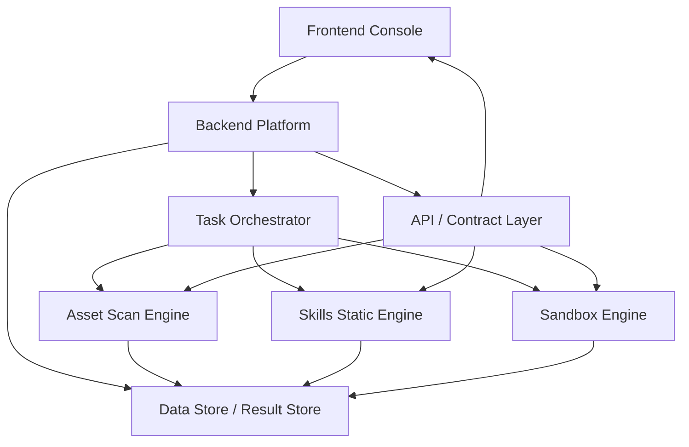

# 系统架构说明

## 1. 目标与设计原则

本项目面向 Agent 安全检测与管理场景，第一阶段目标是形成“平台统一编排 + 引擎独立执行 + 契约统一汇总”的工程基础。

核心设计原则如下：

- 平台后端负责任务、编排、聚合和对外 API，不承担具体检测实现。
- 三个检测引擎独立维护规则、运行逻辑和测试，降低不同能力线之间的耦合。
- 前后端与引擎之间通过统一数据结构和结果契约交互，契约收敛到 `shared`。
- 文档、样本、脚本、部署目录分层明确，便于 3 人团队并行推进。

## 2. 系统总体架构分层


```mermaid
flowchart TD
    A["Frontend Console"] --> B["Backend Platform"]
    B --> C["Task Orchestrator"]
    C --> D["Asset Scan Engine"]
    C --> E["Skills Static Engine"]
    C --> F["Sandbox Engine"]
    B --> G["Data Store / Result Store"]
    D --> G
    E --> G
    F --> G
    B --> H["API / Contract Layer"]
    H --> A
    H --> D
    H --> E
    H --> F
```

建议按以下层次理解整体结构：

### 2.1 前端层

路径：`frontend/`

职责：

- 提供资产视图、任务列表、检测详情、告警看板、汇总报表等页面。
- 负责用户发起扫描任务、查看状态、筛选风险、追踪处置。
- 对接后端 API，不直接依赖各引擎内部实现。
- 第一版已落地统一后台壳子，包含固定侧边导航、顶部上下文栏、`Overview` 路由与结果路由占位页。
- 当前路由骨架包括：`/overview`、`/tasks`、`/tasks/:taskId`、`/results/assets`、`/results/static-analysis`、`/results/sandbox`、`/review-demo`。

前端只消费平台统一后的视图模型，不直接拼接不同引擎的原始数据格式。

### 2.2 后端平台层

路径：`backend/`

职责：

- 对外暴露统一 API。
- 维护任务生命周期，如创建、调度、取消、重试、归档。
- 作为引擎调用入口和结果汇总中心。
- 承担用户、权限、审计、报表聚合等平台能力。

后端应尽量保持“编排与聚合”定位，不把某个引擎的核心逻辑直接写进平台模块里。

### 2.3 引擎层

路径：`engines/asset-scan`、`engines/skills-static`、`engines/sandbox`

职责：

- `asset-scan`：发现 Agent 资产、识别指纹、补充暴露面和基础风险标签。
- `skills-static`：对 Skills 包、规则配置、脚本与依赖做静态检测。
- `sandbox`：监控 Agent 运行时行为，检测越权、敏感操作、异常调用，并触发阻断或告警。

三个引擎都应满足以下解耦要求：

- 可单独开发、测试和发布。
- 可通过统一契约与后端通信。
- 后端只依赖引擎输出结果，不依赖其内部规则实现。
- 后续如果某个引擎替换实现语言或部署方式，平台层不需要大改。

### 2.4 共享契约层

路径：`shared/`

职责：

- 存放公共类型定义，如 `Task`、`RiskLevel`、结果对象等。
- 存放接口契约定义，如任务请求、结果回传、状态枚举。
- 存放跨模块常量，如任务类型、规则分类、风险等级映射。
- 存放无业务耦合的工具函数，如时间格式化、ID 生成辅助、对象规范化函数。
- 第一版已落地的共享核心对象包括 `Task`、`BaseResult`、`RiskSummary`、`ApiResponse`。
- 第一版已落地的共享运行时能力包括：枚举守卫、任务与结果外壳规范化、任务类型到引擎类型的固定映射校验。

该层是前端、后端、引擎之间的公共语言层，应保持小而稳定。

### 2.5 数据层

逻辑位置：由后端统一访问，具体存储方案后续确定

职责：

- 存储任务元数据与执行状态。
- 存储资产扫描结果、静态分析结果、沙箱告警结果。
- 支持平台查询、过滤、统计与审计追踪。

第一阶段建议先按抽象能力设计，不急于绑定单一数据库实现。后续可按场景拆分为：

- 关系型数据库：任务、用户、配置、审计
- 文档或对象存储：原始结果、样本、报告
- 搜索或时序存储：告警检索、运行事件

### 2.6 部署层

路径：`deploy/`

职责：

- 管理 Docker、Compose、Kubernetes 等部署资产。
- 为本地联调、测试环境、生产环境逐步沉淀部署模板。
- 明确前端、后端、引擎、存储依赖之间的部署关系。

## 3. 模块关系说明

### 3.1 frontend 与 backend

- 前端只访问后端 API。
- 前端不直接访问引擎，也不消费引擎私有格式。
- 页面聚合逻辑尽量收敛到后端，前端以展示和交互为主。

### 3.2 backend 与 engines

- 后端向引擎下发任务。
- 引擎执行检测后回传结构化结果，或由后端主动拉取。
- 后端负责统一状态管理、结果归档和跨引擎汇总。

当前 `asset-scan` 最小闭环已采用“backend 进程桥接 engine”模式：

- backend `AssetScanTaskAdapter` 只做编排与委托，不执行探针/打分业务逻辑。
- engine 通过 `engines/asset-scan/src/bridge/scan-task.ts` 接收 task payload（stdin JSON）并返回标准 `details`（stdout JSON）。
- 探针执行与规则打分逻辑落在 `engines/asset-scan/src/runtime/`，与 backend 平台职责分离。

建议后续通过适配器模式实现引擎接入，如：

- `EngineClient` 接口
- `AssetScanEngineClient`
- `SkillsStaticEngineClient`
- `SandboxEngineClient`

这样平台在逻辑上依赖“能力接口”，而不是依赖某个具体进程或调用方式。

### 3.3 shared 在整体中的位置

- 为前端提供统一展示模型和枚举。
- 为后端提供任务、结果、告警等核心领域对象。
- 为引擎提供标准输入输出结构，减少重复定义。

如果某个类型仅在单个模块内部使用，不应放入 `shared`。

## 4. 三条核心业务流程

### 4.1 资产测绘与指纹识别流程

1. 用户在前端创建资产扫描任务。
2. 后端写入 `Task`，并调度 `asset-scan` 引擎执行。
3. 引擎采集目标信息，输出资产指纹、暴露面、识别标签和风险初判。
4. 后端归档结果，生成平台可查询的资产视图。
5. 前端展示资产清单、指纹详情和风险摘要。

### 4.2 Skills 静态安全检测流程

1. 用户上传或指定 Skills 包路径。
2. 后端创建静态分析任务并分发给 `skills-static` 引擎。
3. 引擎执行规则匹配、依赖分析、敏感能力识别和风险分级。
4. 后端汇总命中规则、风险等级和修复建议。
5. 前端展示分析报告，并支持与任务、资产维度关联查看。

### 4.3 动态沙箱监控与阻断流程

1. 用户或调度系统发起沙箱检测会话。
2. 后端创建任务并拉起或接入 `sandbox` 引擎会话。
3. 沙箱引擎采集运行时操作、外联行为、敏感资源访问等事件。
4. 策略模块识别越权或高危动作，生成 `SandboxAlert`，必要时执行阻断。
5. 后端统一保存告警与会话摘要，前端以告警流和会话详情方式展示。

## 5. 目录与工程骨架建议

### 5.1 backend 建议结构

```text
backend/src/
├─ common/      # 公共拦截器、异常、日志、工具
├─ config/      # 配置加载与环境变量管理
└─ modules/     # 按业务能力拆分模块
```

建议优先规划的模块包括：

- `task-center`
- `asset-management`
- `analysis-management`
- `sandbox-monitor`
- `reporting`

### 5.2 engines 建议结构

```text
engines/<engine-name>/
├─ src/         # 核心执行逻辑
├─ rules/       # 检测规则或策略
├─ policies/    # 仅 sandbox 使用，可放策略定义
└─ tests/       # 引擎自测
```

### 5.3 docs 建议结构

- `architecture.md`：总体架构说明
- `api-contract.md`：统一接口与数据结构草案
- `development-plan.md`：阶段计划与里程碑
- `adr/`：重要架构决策记录
- `meeting-notes/`：需求评审、周会、联调纪要
- `plans/`：专题方案、拆解计划、里程碑补充文档

## 6. 第一阶段落地建议

第一阶段不追求完整业务，而是优先打通工程链路：

1. 统一 `shared` 中的核心类型与结果结构。`REQ-01` 已完成第一版基线。
2. 后端完成最小任务中心与结果接收 API。
3. 至少一个引擎先以模拟执行方式完成结果回传。
4. 前端先完成统一后台 layout、Overview 页面与任务/结果页占位。
5. 在 `samples/` 中准备一批最小样本，供联调与测试复用。

当前工程基线暂定为：

- workspace 管理：`pnpm workspace`
- Node.js 基线：`22.19.0`
- TypeScript 约束：`strict: true`

以上基线用于平台骨架阶段的契约与测试落地，后续如果项目级工具链决策变化，应先更新 `metadata.md` 再统一调整。

## GENERAL-003/004 Sandbox Security Module Boundary

GENERAL-003 的后端能力以可注入的 `SandboxSecurityModule` 作为唯一平台边界。
公共监听器只 dispatch evaluation 与 subject-scoped audit-read，内部监听器只
dispatch capability issue/revoke 与 audit purge；capability issue 在同一既有
route 上按精确 `schema_version` 分派 GENERAL-003 公共 v1 与 GENERAL-004
私有 enforcement-audit DTO；未注入模块时，已识别的沙箱路由
返回固定的通用错误，不构造隐式默认模块；既有 public/admin 路由使用
`INTERNAL_ERROR`，未组合的 enforcement route 保持 `NOT_FOUND`。
revoke 路由的 capability-id segment 由路由到 controller 原样传递，应用层不提前
decode。

P1-T3 固定了 controller、runtime、Engine gateway、capability/idempotency/audit
repository 与 SQLite database 的 type-only contracts。服务、仓储和数据库实现由
后续 Phase 各自拥有；本阶段不创建隐藏实现。单一 SQLite owner 通过
`SqliteSandboxSecurityDatabase` 暴露 transaction/read/checkpoint 生命周期，维护
timer 由 idempotency maintenance 拥有，模块 close 负责先取消维护再关闭数据库。

GENERAL-004 的私有 capability 分支使用独立的内部 scope/type union；后台固定
scope、全部 Engine stages、单一 profile 和当前 production composition，并在同一
SQLite transaction 内写入 capability 与私有 `capability_issued` event。GENERAL-003
public v1 authorizer/read surface 不接受该 scope；既有 revoke boundary 仅返回无
token 的私有记录并保持 legacy revoke audit semantics。

GENERAL-004 的 enforcement audit controller 只挂载到 internal listener 的
`POST /internal/sandbox/security/enforcement-events`。它使用同一个注入的
`SandboxSecurityModule` 和 SQLite owner，但通过独立的私有 repository、认证 grant
和 capacity-2 token bucket admission；public router 不识别该路径。请求先完成
严格 bearer/body admission，再由 shared normalizer 和 capability grant 检查，服务
只向 repository 写入 backend 注入 identity/server time 的 content-free candidate。
accepted/replayed ack 分别返回 201/200，存储错误和 conflict 使用既有 bounded HTTP
error envelope。

后端扩展 runtime 不能直接传入 GENERAL-002。`toSandboxSecurityEngineRuntime`
每次生成冻结的普通对象，且只包含 Engine 要求顺序的
`now`、`nextDecisionId`、`monotonicNowMs`、`scheduleTimeout` 四个可枚举键。

### GENERAL-003 SQLite 持久化边界（P3-T1）

P3-T1 将单节点持久化实现收敛在一个 `SqliteSandboxSecurityDatabase` owner
中。只有该 owner 持有 Node 22 `DatabaseSync`；调用方只能通过
`transaction(callback)`、`read(callback)` 和 `checkpointAndClose()` 使用数据库，
不能保留或传递 SQL handle。事务统一使用 `BEGIN IMMEDIATE`，拒绝嵌套事务，
并在 callback、提交或回滚后清理 owner 的事务状态。关闭由 owner 统一执行
`wal_checkpoint(TRUNCATE)` 后关闭，关闭后所有读写调用都会失败且关闭操作可重复。

数据库路径必须是绝对路径，父目录必须预先存在、是真实目录并且没有 group/other
权限（`0700` 或更严格）。主数据库和 `-wal`/`-shm` sidecar 必须位于该父目录，
拒绝符号链接、非普通文件和越界 sidecar；每次 WAL 创建和迁移前后都复核并设置
文件权限为 `0600`。启动顺序固定为校验路径、打开数据库、启用
`journal_mode=WAL`、`foreign_keys=ON` 与 `busy_timeout=5000`，再在
`BEGIN IMMEDIATE` 内执行固定 v1 migration、deployment-key metadata binding 和
`PRAGMA quick_check`。版本高于当前二进制、schema 不完整、绑定不匹配、权限检查或
迁移/完整性检查失败时会回滚并关闭数据库，不绑定监听器。

v1 migration 的表、catalog CHECK 约束和三个 retention/ordering indexes 固定在
`sqlite-migrations.ts`；migration 记录只允许版本 1，metadata 只允许
`deployment_key_id`。该边界只提供 schema/owner 生命周期，本阶段不实现 capability、
idempotency 或 audit repository；后续 adapter 通过同一 database port 组合。

### GENERAL-003 P6-T2 production composition and lifecycle

`loadSandboxSecurityConfiguration` 是 GENERAL-003 唯一的四变量规范化入口：
`SANDBOX_SECURITY_STORAGE_PATH` 必须是绝对路径，HMAC key 是 canonical、无填充
base64url 且解码为 32 字节，administrator bootstrap token 是 32 个随机字节的
canonical 无填充 base64url 表示，production mode 只能是
`rule_only | local | local_and_judge`。规范化
结果及其 credential copies 不进入日志；mode 在 process lifetime 内保持固定。

真实启动由 `startProductionServers` 负责 fail-before-bind。它先构造 Node runtime
port（UTC wall clock、monotonic clock、32-byte random copy、UUID v4 IDs、
cancel-once timeout/interval），然后按以下顺序组合：

1. HMAC service 与单一 audit projector；
2. SQLite owner 的 WAL、migration、deployment-key metadata 和 quick-check；
3. capability/idempotency/audit 三个 repository；
4. maintenance 的 in-progress recovery、startup cleanup 与一个 unref hourly timer；
5. production gateway。gateway 自己通过 GENERAL-001/002 两个公开 index 构造
   canonical fingerprint service 和 Engine，composition root 不深导入 Engine 内部；
6. services/controllers 与一个共享 `SandboxSecurityModule`，将 gateway 的
   `composition_binding` 原样传入 admission/audit graph；
7. public 与 internal listener bind。

传给 GENERAL-002 的 runtime 是 `toSandboxSecurityEngineRuntime(runtime)` 生成的
冻结四键投影（`now`、`nextDecisionId`、`monotonicNowMs`、`scheduleTimeout`），
不会泄漏 backend-only entropy、capability IDs 或 interval controls。SQLite owner 和
maintenance 由 module 唯一持有；module close 先取消 maintenance，再 checkpoint/close
数据库，即使第一步抛错也会继续第二步并聚合错误。

partial startup 同样遵循清理边界：public bind 成功而 internal bind 失败时先停止
public listener，再关闭 module/database；public bind 失败或 Engine/migration/recovery
失败时不留下任何 listener、timer 或数据库句柄。正常 shutdown 先停止两个 listener
接收并等待 in-flight handlers，最后执行 maintenance -> database 的 reverse order。

## GENERAL-004 OpenClaw Enforcement Runtime and Deployment

GENERAL-004 在独立的 `openclaw@2026.6.34` 运行时内强制四个最终 awaited barrier：
`before_agent_run`、`before_model_output_delivery`、`before_tool_execution` 和
`before_message_delivery`，各注册且仅注册一次。plugin handler 只返回固定的私有
`openclaw-security-hook-result.v1` envelope；patched host runner 独立校验自身
event/context correlation 与 `health.enforcement`，容忍 `audit: "degraded"`，只把
nested `barrier` 返回给发起调用点。envelope 非法、correlation 漂移或 enforcement
health 失败时选择固定 fail-closed `sandbox_security_evaluation_unavailable`，绝不放行。

authority 按 stage 重建：`user_input` 取当前 prompt；`model_output` 取当前 prompt
加精确 assistant projection；`tool_request` 取 prompt、匹配的 model output 与最终
tool request。composite system prompt、通用 history、workspace、memory、retrieval 与
猜测的 tool 目标都被排除。Engine `allow`/`alert` 继续；`ask` 替换为 review-required、
`deny` 替换为 policy-blocked，均无交互审批或 resume。user/model/outbound 失败下限为
`ask`，tool 失败下限为 `deny`；audit 失败只改变 `audit`，从不改变 host action。
每次 evaluation 由 plugin 注入的 `request:<UUIDv4>` 标识，fail-closed 签发。

进程内 GENERAL-002 production Engine 通过公开 index 组合，全局并发上限为四且无等待
队列，caller abort 固定 10000 ms，audit client deadline 固定 1000 ms 且无重试队列。
audit 与被选 host action 正交：使用 backend 注入的 identity/server time、replay-safe
event ID，且不含 raw/sanitized/hashed/provider 内容。

部署为 digest-pin 的隔离镜像（`deploy/sandbox-security/Dockerfile.openclaw`），
只构建 nested general-security 包及其公开 Engine/shared 构建输入，校验并应用经封存的
patch，然后以非 root（`node`）用户、只读根文件系统运行。启动时重新校验
package、patch 字节、patched-file 与四 barrier，再注册 hooks；build-time 校验不替代
startup 校验。pnpm 以符号链接方式将 `node_modules/openclaw` 指向 `.pnpm` store，patch
脚本按设计拒绝符号链接根，因此镜像在同一 `RUN` 层内 `readlink -f` 解析真实 store 目录
后再打 patch，避免 overlayfs 跨层 rename 的 `EXDEV`。

Compose（`deploy/sandbox-security/compose.openclaw-security.yml`）只定义
`openclaw-security` 一个服务：无 host port、无持久卷、三个 tmpfs 挂载
（`/run/openclaw-security`、`/tmp/openclaw`、`/workspace`，`mode=1777` 使非 root 用户
可创建各自的私有子目录），只读根、`cap_drop: ALL`、`no-new-privileges`，并绑定
CPU/内存/PID 上限。它挂到运营方提供的内部 audit 网络，GENERAL-003 backend 作为独立
服务以固定内部主机名 `sandbox-security-backend` 接入；GENERAL-004 不定义出站网络/防火墙
要求。四个不可变 plugin 值只在进程启动时以环境变量提供，镜像与配置中不含任何 token
字面量或默认值。正常关闭由 `SIGTERM` 触发，tmpfs 随容器移除而消失，重启无持久状态。

## REQ-07 Backend Engine Adapter Baseline

当前 backend 在 `task-center` 内新增了一层稳定的引擎接入边界：

- `TaskCenterService` 继续负责任务创建、任务查询和仓储写入
- `TaskEngineService` 负责把 `Task` 转成未来引擎会消费的 dispatch ticket，并生成平台统一的初始 `BaseResult` 与 `RiskSummary`
- `EngineAdapterRegistry` 负责按 `task_type` 查找 adapter，避免平台主流程散落引擎分支判断
- 三个 adapter 目前都只保留占位职责，不承载真实引擎执行逻辑

当前 adapter 的稳定接口包括：

- `taskType`
- `engineType`
- `createDispatchPayload(task)`
- `createInitialDetails(task)`

后续真实引擎接入时，优先保持以下位置稳定：

- 对外 HTTP API 不变
- `Task`、`BaseResult`、`RiskSummary` 的平台壳子不变
- `TaskCenterService` 的任务中心职责不变
- 新的引擎提交、轮询、回调或结果回填逻辑优先落在 `TaskEngineService` 与 adapter 层，而不是直接写进 controller

## REQ-SKILLS-STATIC DTO Boundary Baseline

当前 `skills-static` 仍处于平台兼容骨架阶段，边界拆分如下：

- shared 负责声明 `skills-static` 与平台之间的稳定 DTO / result 类型
- backend `SkillsStaticTaskAdapter` 负责两段最小映射：
  - `Task.parameters` -> `analysis_parameters`
  - engine placeholder result -> `SkillsStaticResultDetails`
- public task-center API 保持不变，controller 路由不新增
- `BaseResult` 继续作为唯一统一结果外壳，`static_analysis` 只在 `details.rule_hits[]` 这一处收敛更强类型

当前明确不做：

- 真实 `skills-static` 扫描执行逻辑
- 上传 / zip / object storage / callback / retry 流程
- 新的平台级 `risk_score`、`projectId`、`assetId`、`tenantId` 约束

## REQ-ASSET-FINGERPRINT-002 Offline Matcher Baseline

当前 `asset_scan` adapter 在占位基线之上新增了一条仅用于 TDD 的离线路径：

- `AssetFingerprintService` 直接消费 `engines/asset-scan/rules/fingerprints.v1.yaml`
- 服务读取 `samples/assets/fingerprint-positive` 与 `samples/assets/fingerprint-negative` 下的 JSON 样本，按权重规则计算置信度
- `AssetScanTaskAdapter` 在收到 `parameters.sample_ref` 时，会把离线匹配结果映射为统一的 `AssetScanResultDetails`
- 对外 HTTP API 保持原路径不变，新增能力只体现在 `details` 的初始内容上

当前仍然明确不做：

- 不发起真实网络请求
- 不做后台异步执行或状态推进
- 不把样本驱动逻辑泄漏成 engine 私有结构之外的额外平台契约

## REQ-ASSET-PROBE-004 Phase G Minimal Live Probe

阶段 G 在保持离线样本路径可用的前提下，新增了最小真实探针执行通道：

- 新增 `AssetProbeService`，按 `engines/asset-scan/rules/probes.v1.yaml` 的 target 级探针配置执行最小 HTTP / WebSocket 采集
- `AssetScanTaskAdapter` 支持两条输入路径并存：
    - `sample_ref`：离线样本回放
    - `probe_mode=live + probe_target_id`：本地受控目标实时采集
- 在受控测试环境下，可通过 `probe_port_hint` 保持逻辑端口信号与真实识别规则一致
- live probe 采集结果会转成 matcher 可消费的 observation，再通过 `AssetFingerprintService` 统一产出 `AssetScanResultDetails`

为支持 live probe 的异步 I/O，任务创建链路已调整为异步：

- `TaskCenterController.createTask` -> async
- `TaskCenterService.createTask` -> async
- `TaskEngineService.createInitialArtifacts` -> async

该阶段仍遵守边界：

- 仅允许 localhost/测试容器/mock server 受控目标
- 不引入公网扫描与分布式调度

## REQ-SKILLS-STATIC Mock Closed Loop

`skills_static` now has one additional backend-internal step beyond dispatch registration:

- `SkillsStaticEngineClient` returns a deterministic mock analysis result after it accepts a `static_analysis` dispatch ticket
- `TaskCenterService` keeps the existing orchestration boundary and performs a second repository save for the same `task_id`
- `TaskEngineService` converts that mock payload into the finished platform shells that already exist today: `Task`, `BaseResult`, and `RiskSummary`
- the read side stays unchanged: the existing task-center query routes expose the backfilled record

This is intentionally still a skeleton-stage integration:

- no new public API
- no engine-specific controller
- no real `skills-static` scan execution
- no retry, callback, upload, object-storage, or timeout-governance workflow

## REQ-SKILLS-STATIC Internal Core Objects

The backend now extracts the `skills_static` internal normalization and aggregation logic into dedicated core objects instead of leaving that behavior spread across one adapter file.

- `SkillsStaticEngineOutput` is the loose backend-internal input shell for raw analysis output from any future detection-library adapter
- `SkillsStaticResultNormalizer` converts that loose output into stable `SkillsStaticResultDetails`, strips `engine_private_*` fields and `risk_score`, and raises a structured internal error for malformed input
- `RiskSummaryDeriver` is the single backend runtime source of truth for deriving `risk_level` and severity counts from normalized `rule_hits`
- `SkillsStaticTaskAdapter` now stays focused on dispatch payload creation and initial placeholder details
- `TaskCenterService` catches malformed internal engine output and preserves the existing pending shell instead of widening the public contract or failing the task-center read shape

## REQ-SKILLS-STATIC Minimal Real Detection

`skills_static` now has one minimal real-tool path in addition to the existing mock provider:

- `SkillsStaticEngineClient` selects its provider from `SKILLS_STATIC_ENGINE_PROVIDER`
- `mock` remains the default provider and keeps the deterministic closed-loop behavior used by the current integration baseline
- `semgrep` is the single real provider for this stage and is executed through the local CLI, without any external service dependency
- `SemgrepRunner` is responsible only for invoking `semgrep scan` and reading JSON output
- `SemgrepOutputMapper` converts raw `semgrep` JSON into the existing `SkillsStaticEngineOutput` shell; it does not change the downstream normalizer contract
- `SkillsStaticResultNormalizer` and `RiskSummaryDeriver` stay unchanged and continue to define the normalized platform contract
- the public API remains unchanged: `POST /api/tasks` is still the only write entry, and the existing task/result/risk-summary reads remain the only public read path

This stage intentionally still does not include:

- multiple detection-library providers
- public API changes
- retry / timeout / callback / logging governance
- report rendering or evidence-display flows

## REQ-SKILLS-STATIC Standardized Risk Result

The platform now treats `skills_static` provider output as an internal staging format, not as the stable result contract itself.

- `mock` and `semgrep` must both converge into the same provider-agnostic standardized result before the task-center read path exposes the finished record
- the strong standardized fields are currently: `sample_name`, `language`, `rule_hits[].rule_id`, `rule_hits[].severity`, `rule_hits[].message`, `rule_hits[].file_path`, and paired valid `line_start` / `line_end`
- `RiskSummary` is part of the same strong contract and must stay derived only from normalized `rule_hits`
- `entry_files`, `files_scanned`, `sensitive_capabilities`, `dependency_summary`, and optional extension fields stay on a weaker contract for now: they must remain structurally valid and non-conflicting, but they are not yet required to have provider parity
- future providers should land in `raw output -> mapper -> SkillsStaticEngineOutput -> SkillsStaticResultNormalizer -> RiskSummaryDeriver`, without changing the public API or the platform orchestration path

## REQ-SKILLS-STATIC Minimal Runtime Governance

The real `skills_static` path now has one minimal runtime-governance layer on top of the existing provider and normalization flow.

- `SkillsStaticExecutionError` is the internal-only failure envelope for real-path failures; it carries a stable `phase + reason + provider` tuple instead of exposing arbitrary provider exceptions
- `SkillsStaticEngineClient` records the minimum diagnostic event set: `provider_selected`, `scan_started`, `scan_succeeded`, and `scan_failed`
- `SemgrepRunner` now owns the minimal timeout boundary for the real provider path and maps missing target/ruleset, binary startup failure, non-zero exit, invalid JSON, and timeout into stable runner failures
- `TaskCenterService` keeps the public write entry unchanged, but runtime failures no longer bubble out as raw provider exceptions after the initial save; instead the task-center path backfills stable failed `Task / BaseResult / RiskSummary` shells
- timeout and provider/runtime diagnostics remain backend-internal; raw stderr/stdout and arbitrary exception strings are intentionally not promoted into shared or public API contracts

## REQ-ASSET-SCAN-PORT-007 FOFA Workflow Script Layer

Repository-side FOFA workflow scripts are treated as a dev execution/support layer, not a backend platform API layer.

- `scripts/dev/intel/fofa-portscan-workflow.ts` coordinates the minimal `naabu -> nmap -> sample output` flow.
- `scripts/dev/intel/fofa-sample-export.ts` persists separated JSON sample artifacts.

Boundary rules for this layer:

- Scripts do not introduce new public HTTP endpoints.
- Scripts do not bypass backend task-center contracts.
- Script outputs are artifacts for evidence accumulation and replay, not frontend-facing API payloads.
- Tool responsibilities remain explicit: naabu for open ports, nmap for hit-port service evidence.

## REQ-T1-SUPERVISION-UI-009 Behavior Supervision Console

REQ-009 adds a read-only Track 1 behavior supervision console. The verified end-to-end flow is:

```text
normalized sandbox result
  -> task repository
  -> supervision projector
  -> shared safe read DTO
  -> supervision API
  -> React polling workbench
  -> sanitized evidence JSON
```

### Layer responsibilities

- `shared/types/supervision.ts` and `shared/contracts/supervision.ts` define the only DTO shapes the frontend may consume. Normalizers reject unknown fields, exact-key evidence exports, and any record whose `evidence_available` flag is not strictly `true`.
- `backend/src/modules/supervision/supervision-projector.ts` projects stored `SandboxRunResult` records field-by-field into safe view models. It never copies `BaseResult.summary`, decision `reason`, alert `title`/`reason`, blocked-record `reason`/`resource_ref`, or `metadata`. Malformed stored records raise a `DomainError` instead of returning a partial projection.
- `backend/src/modules/supervision/supervision.service.ts` validates filters, enforces the 100-row cap, aggregates counts over all matched sessions, and looks up detail/evidence by session ID.
- `backend/src/modules/supervision/supervision.controller.ts` exposes three GET routes wrapped in the standard `ApiResponse<T>` envelope.
- `frontend/src/services/supervision-service.ts` is the only frontend boundary that talks to the supervision API. It tracks three source states: `api`, `integration-error`, and `mock`.
- `frontend/src/hooks/useSupervisionPolling.ts` polls every three seconds while the page is visible and the selected session is not terminal. It aborts in-flight requests on unmount or session change, surfaces a `stale` freshness signal on failure, and keeps the last successful snapshot.
- `frontend/src/pages/SandboxAlertsPage.tsx` composes the overview header, filters, session list, and inspector. URL query state (`session_id`, `q`, `status`, `risk_level`, `action`, `scenario_id`, `tool_name`) is the single source of truth for filter and selection state. The top-level `SandboxAlertsPage` always calls the same hooks (`useSearchParams` + one `useEffect` for campaign_id cleanup) regardless of mode, then delegates to `SandboxAlertsPageCampaign` or `SandboxAlertsPageSession` subcomponents — satisfying React's Rules of Hooks when the `campaign_id` URL param changes without a remount.
- `frontend/src/components/supervision/SupervisionEventTimeline.tsx` and `SupervisionEventDetails.tsx` render the seven approved event types through an exhaustive discriminated switch. There is no generic object traversal, no `dangerouslySetInnerHTML`, and no raw content rendering.
- `frontend/src/components/task-detail/SandboxTaskSupervisionSection.tsx` loads the supervision detail by session ID and passes a safe DTO to the presentational `SandboxAlertSection`. The task detail page renders a deep link to `/results/sandbox?session_id=...` for investigation.

### Explicit non-goals

The following capabilities remain outside REQ-009 scope and must not be added without a new requirement:

- engine source imports from `shared/`, `backend/supervision`, or any `frontend/` module
- persistence (the console reads only from the in-memory task repository)
- streaming (no WebSocket, no SSE, no EventSource)
- approval / resume / acknowledge-write actions
- full report generation (no PDF, CSV, XLSX, or ZIP export)
- OpenClaw integration, cluster aggregation, or pagination

## REQ-T1-DEMO-010 Track 1 Campaign Ingest and Supervision Backend

REQ-T1-DEMO-010 adds a split-listener backend for Track 1 campaign supervision. The internal listener accepts authenticated ingest writes; the public listener serves read-only projections. Both listeners share the same in-memory repositories but never share routes.

### Listener and repository assignment

- `backend/src/runtime-dependencies.ts` is the single composition root. It creates one `InMemoryTaskRepository` and one `InMemoryCampaignRepository`. Both repositories are passed to the public `AppModule` and the internal `InternalAppModule` so writes from ingest are immediately visible to public reads.
- `backend/src/app.module.ts` (public listener) owns the `SupervisionModule`, which in turn owns the `SupervisionController` (session reads), `CampaignSupervisionController` (campaign reads), and the shared `InMemoryCampaignRepository`.
- `backend/src/internal-app.module.ts` (internal listener) owns the `CampaignIngestController` and `CampaignIngestService`, which reference the same `InMemoryCampaignRepository` instance via constructor injection.
- `backend/src/common/http/router.ts` (public router) recognizes `/api/supervision/campaigns`, `/api/supervision/campaigns/:campaignId`, and `/api/supervision/campaigns/:campaignId/evidence`. It never matches `/internal/*`.
- `backend/src/common/http/internal-router.ts` (internal router) recognizes `/internal/health` and the four campaign ingest write routes only.

### Ingest lifecycle

- `backend/src/modules/supervision/campaign-ingest.service.ts` enforces the campaign lifecycle: start (idempotent on manifest hash), snapshot ingest (hash chain + sequence gap check + second-attempt-only-after-failure), finalize (requires 9 terminal cases; completed requires all passed), and evidence registration (only after completed finalize).
- `backend/src/modules/supervision/campaign-ingest-auth.ts` performs timing-safe bearer token comparison. Both supplied and expected tokens are SHA-256 hashed before `timingSafeEqual`.
- `backend/src/modules/supervision/campaign-ingest.controller.ts` wraps the service with auth and body limits. It never imports engine modules, model invocation, tool execution, or retry logic.
- `backend/src/common/http/limited-json-body.ts` enforces byte limits on raw request bodies before JSON parse: 256 KiB for lifecycle envelopes, 2 MiB for snapshots.

### Read projection

- `backend/src/modules/supervision/campaign-projector.ts` recomputes all campaign counters from stored attempts/results. It produces exactly 3 ordered agents and 9 ordered cases. Attempt summaries are content-free: they never carry `events`, `policy_decisions`, `alerts`, `blocked_records`, or `result`. Cross-agent case mismatches raise `CAMPAIGN_PROJECTION_INVALID`.
- `backend/src/modules/supervision/campaign-supervision.service.ts` mirrors the supervision service pattern: project all records, filter, sort by `updated_at` desc then `campaign_id` asc, cap at 50. Detail and evidence lookups throw `CAMPAIGN_NOT_FOUND` or `CAMPAIGN_EVIDENCE_NOT_READY` respectively.
- `backend/src/modules/supervision/campaign-supervision.controller.ts` exposes three GET routes wrapped in `ApiResponse<T>`. It validates query parameters via `normalizeCampaignQuery`, which rejects unknown keys, duplicate keys, empty enum values, and control characters.
- `backend/src/modules/supervision/dto/campaign-query.ts` is the query DTO. It accepts only `q`, `status`, `scenario_id`, and `agent_id`.

### Explicit non-goals

The following capabilities remain outside REQ-T1-DEMO-010 scope and must not be added without a new requirement:

- campaign execution, retry, or model/tool invocation from either controller
- persistence beyond the in-memory repositories
- pagination beyond the 50-row cap
- direct engine imports from the ingest or supervision controllers

## REQ-T1-SANDBOX-CONTRACT-005 Track 1 Sandbox Supervision Contract

Track 1 sandbox supervision data is owned by the shared contract layer and kept separate from engine execution.

- `shared/types/sandbox.ts` is the cross-module source of truth for event enums, policy action constants, and typed behavior-event, policy-decision, alert, and blocked-record interfaces.
- `shared/contracts/sandbox.ts` strips private and raw values (raw model content, raw prompts, engine-private fields) and validates record-level constraints and collection-level invariants.
- Sandbox engines produce policy decisions as events, but shared code never chooses policy actions — it only validates that the resulting records are consistent.
- The canonical event stream (`events`) feeds replay, monitoring, backend normalization, UI rendering, and report aggregation.
- `satisfiesSandboxSupervisionContract` enforces that terminal `finished` and `blocked` sandbox results carry complete supervision collections and that cross-record references are consistent.
- Pending sandbox result shells remain valid without complete supervision data.
- Simulated-tool safety rejection (malformed or out-of-bounds targets) is not a sandbox policy decision and is handled inside `engines/sandbox/src/simulated-tools/`.

## REQ-T1-MOCK-TOOLS-004 Simulated Business Tool Boundary

Track 1 simulated business actions are owned by `engines/sandbox/src/simulated-tools/`.

- `contract.ts` defines strict engine-private request and result unions plus runtime request normalization.
- `state.ts` owns injected per-instance in-memory email, virtual-file, and mock-route state.
- `executor.ts` implements `send_email`, `read_file`, `write_file`, and `call_api` without host I/O or network access.
- Results preserve case, scenario, session, call, and evidence correlation for later monitoring-event wrapping.
- Safety rejection is limited to malformed or non-local targets and is not a sandbox policy decision.

This requirement does not change `shared/`, backend task orchestration, frontend behavior, or the public REST API. Typed policy actions and behavior-supervision events remain the responsibility of `REQ-T1-SANDBOX-CONTRACT-005`.

## REQ-T1-ATTACK-REPLAY-006 Controlled Attack Replay Data Flow

Track 1 controlled attack replay compiles fixed repository fixture files into normalized sandbox supervision results. The replay contract is engine-private metadata layered on the unchanged shared REQ-005 result contract. Policy outcomes are fixture oracles in REQ-006, not a policy evaluator.

```
fixed case fixtures
  -> replay loader and runtime validation
  -> deterministic event/result compiler
  -> shared sandbox normalization
  -> scenario coverage runner
  -> JSON stdout for later monitoring and reporting
```

### Module boundary

- **Replay core:** `engines/sandbox/src/replay/` — closed fixture/manifest loader, SHA-256 deterministic ID/evidence/timestamp primitives, case-to-result compiler, scenario runner, and atomic CLI entrypoint.
- **Entrypoints:** `samples/track1/attack-scripts/T1-SC-NNN/replay.ts` — three thin script bindings that each call `executeTrack1ReplayEntrypoint` with a fixed scenario ID.
- **Quality gates:** `engines/sandbox/tests/attack-replay-*.spec.ts` (engine), `tests/repository/track1-attack-replay.spec.ts` (repository safety scan), `tests/repository/root-test-entry.spec.ts` (permanent registration).

### Replay invariants

- Every run of the same script produces byte-for-byte identical stdout.
- All identifiers, hashes, timestamps, event sequences, and evidence references are derived from fixed inputs and a single replay epoch (`2026-06-28T00:00:00.000Z`).
- Raw fixture content (prompts, retrieved text, memory content, tool argument values) is never present in serialized output.
- No model, network, or simulated-tool execution occurs.
- The shared `BaseResult<SandboxRunResultDetails>` contract and `normalizeBaseResult` remain unchanged.

## REQ-T1-MONITOR-PLUGIN-007 Track 1 Model Call-Chain Monitor Plugin

`engines/sandbox/src/monitoring/` adds a reusable session-level middleware that wraps model and simulated-tool calls, obtains policy decisions through an injected `MonitorDecisionProvider`, intercepts unsafe execution, and produces complete normalized sandbox supervision results.

### Verified Flow

```text
controlled caller / future adapter
  -> MonitoredSession model boundary
  -> injected MonitorDecisionProvider
  -> MonitoredSession simulated-tool gate
  -> normalized shared sandbox result
  -> later backend/UI integration
```

### Module Structure

```text
engines/sandbox/src/monitoring/
  contract.ts        — engine-private types, normalizers, stable errors
  content-boundary.ts — SHA-256, canonical hashing, safe references, frozen snapshots
  session.ts         — MonitoredSession with invokeModel / invokeTool / finalize
  result-builder.ts  — terminal status/risk aggregation and normalizeBaseResult pass-through
  replay-adapter.ts  — deterministic fixture-to-monitor adapter for 9 Track 1 cases
  index.ts           — minimal supported export surface
```

### Key Boundary Decisions

- Monitor contracts remain engine-private. Shared REQ-005 contracts (`shared/types/sandbox.ts`, `shared/contracts/sandbox.ts`) are unchanged.
- REQ-006 replay remains a separate deterministic fixture compiler; the REQ-007 adapter runs the same fixtures through real monitor orchestration.
- Detection logic is injected through `MonitorDecisionProvider`. The REQ-007 monitor exercises the boundary; REQ-008 will provide the first real detection provider.
- Platform persistence, UI rendering, cluster trace aggregation, and OpenClaw integration remain deferred.
- Raw model content, tool arguments, tool output, and provider exceptions never appear in serialized results or session state.

### Controlled Demo

```powershell
node --experimental-strip-types samples/track1/monitor-plugin/demo.ts
```

Fixed entrypoint emits 9 byte-identical normalized results through the replay-to-monitor adapter. No arguments, no network, simulated only.

### Quality Gates

- `engines/sandbox/tests/attack-monitor-contract.spec.ts`
- `engines/sandbox/tests/attack-monitor-session.spec.ts`
- `engines/sandbox/tests/attack-monitor-replay-adapter.spec.ts`
- `engines/sandbox/tests/attack-monitor-demo.spec.ts`
- `tests/repository/track1-monitor-plugin.spec.ts` (safety scan + behavioral assertion)

All registered in `test:engine:sandbox` and `test:repo` package scripts.

## REQ-T1-BASE-FILTER-008 Track 1 Base-Model Detection And Filtering Prototype

`engines/sandbox/src/base-filter/` implements the first real `MonitorDecisionProvider` — a deterministic, rule-based filter around model and simulated-tool calls that evaluates a frozen declarative rule catalog and reduces all matches with `deny > ask > alert > allow`.

### Verified Flow

```text
controlled context
  -> RuleBasedDecisionProvider
  -> MonitoredSession
  -> normalized sandbox result
  -> deterministic evaluation report
```

### Module Structure

```text
engines/sandbox/src/base-filter/
  contract.ts           — filter rule, match, evaluation, report, and error contracts
  context-envelope.ts   — source-aware context composition, serialization, and parsing
  rule-catalog.ts       — frozen built-in rule catalog (9 rules)
  evaluator.ts          — text normalization, source extraction, complete rule evaluation
  provider.ts           — RuleBasedDecisionProvider implementing MonitorDecisionProvider
  replay-adapter.ts     — nine-case execution through real MonitoredSession
  evaluation.ts         — exact-action comparison, metrics, report normalization, demo
  index.ts              — minimal supported export surface
```

### Key Boundary Decisions

- The filter is engine-private and implements the unchanged `MonitorDecisionProvider` port from REQ-007.
- The context envelope preserves user, retrieval, and memory source boundaries without changing `MonitorDecisionInput`.
- The provider, catalog, and evaluator receive no `case_id`, `scenario_id`, `expected_action`, or fixture-path mapping.
- Direct jailbreaks decide at `model_output`; tool-bearing attacks decide at `tool_request`.
- All applicable rules are evaluated before reduction with `deny > ask > alert > allow`.
- Decisions, results, metrics, errors, and demo output contain no raw content or matched snippets.
- Existing REQ-007 monitor demo output remains byte-identical; shared, replay, and monitoring source are unchanged.

### Fixed Demo

```powershell
node --experimental-strip-types samples/track1/base-filter/demo.ts
```

Fixed entrypoint runs all nine cases through the real rule provider and emits one `Track1BaseFilterDemoReport` JSON object with exact metrics: total_cases=9, exact_action_accuracy=1, unsafe_case_recall=1, negative_control_false_positive_rate=0.

### Quality Gates

- `engines/sandbox/tests/base-filter-contract.spec.ts`
- `engines/sandbox/tests/base-filter-evaluator.spec.ts`
- `engines/sandbox/tests/base-filter-provider.spec.ts`
- `engines/sandbox/tests/base-filter-evaluation.spec.ts`
- `tests/repository/track1-base-filter.spec.ts` (anti-oracle scan + behavioral assertion)

All registered in `test:engine:sandbox` and `test:repo` package scripts.

### Next Consumer

`REQ-T1-SUPERVISION-UI-009` will present monitoring results to the platform UI.

## REQ-T1-DEMO-010 Phase 3 OpenClaw Plugin and Native Monitor Hooks

Phase 3 adds the OpenClaw plugin integration layer that wires the engine-private split model observation adapter to the OpenClaw native hook surface and the Track 1 campaign ingest client.

### Engine-private split model observation

- `engines/sandbox/src/monitoring/observed-session.ts` exports `ObservedMonitoredSession`, which observes `llm_input`/`llm_output` pair events and evaluates the existing Track 1 policy through the unchanged `MonitorDecisionProvider` port.
- The adapter retains exactly one frozen pending raw input between a matched `llm_input` and `llm_output`. After `llm_output` resolves, durable state contains only refs, hashes, counters, events, and decisions.
- The two-phase tool lifecycle (`beforeTool`/`afterTool`) implements intercept-seal (deny/ask at tool stage) and failure-seal (provider throw, correlation mismatch, malformed input) as distinct terminal states.
- Memory observations (`observeMemoryWrite`/`observeMemoryRead`) emit refs and hashes only — never raw content.

### OpenClaw plugin manifest and tools

- `integrations/openclaw/openclaw.plugin.json` is a strict manifest with no unknown keys, exactly four tool contracts (`send_email`, `read_file`, `write_file`, `call_api`), and a closed `configSchema` with `writeOnly: true` for `ingestToken`.
- `integrations/openclaw/src/tool-adapters.ts` registers four campaign-local simulated tools. Each tool delegates only to a campaign-local `InMemorySimulatedToolState` and `SimulatedToolExecutor`. Safe JSON output contains stable status and safe refs only.
- `integrations/openclaw/package.json` pins `openclaw@2026.6.10` and `typebox@1.1.38`.

### Closed campaign context and authenticated ingest client

- `integrations/openclaw/src/campaign-context.ts` normalizes the plugin hook context and the model input envelope. It rejects correlation drift, extra keys, missing required keys, and oracle fields (`expected_outcome`, `expected_action`, `policy_action`, `report_metadata`, `attempt_outcome`). Normalized results are `Object.freeze`d.
- `integrations/openclaw/src/ingest-client.ts` validates a fixed ingest endpoint (`http://backend:3001/internal/track1/campaigns`), enforces `Bearer` token auth with `AbortController` timeout (5000 ms), accepts only 200/202, and validates ack correlation (campaign_id, attempt_id, sequence, snapshot_sha256). The token is never leaked in errors; backend body is never echoed.

### Typed native hook wiring and acknowledgement barrier

- `integrations/openclaw/src/plugin.ts` exports `registerTrack1Plugin` and `definePluginEntry`. It registers exactly seven native hooks: `session_start`, `llm_input`, `llm_output`, `before_tool_call` (with `{ priority: 100, timeoutMs: 10_000 }`), `after_tool_call`, `agent_end`, and `session_end`.
- Plugin session state is isolated by runtime `session_id` via a `Map<string, PluginSessionState>`. Session-oriented flows bind at `session_start`; the direct `openclaw agent` harness binds lazily from the timestamp-wrapped `llm_input` envelope because it emits no per-run `session_start`. Runtime-safe `session-<hex>` and canonical `session:<hex>` identities are cross-checked rather than treated as interchangeable arbitrary strings.
- `agent_end` is the direct CLI terminal boundary. A successful event finalizes the monitor result; a failed event emits a terminal failed result without retaining the provider error. Session-oriented flows continue to terminate through `session_end`.
- `before_tool_call` implements the acknowledgement barrier: for `allow`/`alert`, the snapshot must be ingested before the handler returns. Ingest failure converts `allow`/`alert` into `{ block: true, blockReason: "security_monitor_unavailable" }`.
- `deny`/`ask` never reach tool execution; they return `{ block: true, blockReason: "policy_denied" | "policy_ask_required" }`.
- Unknown tools are blocked with `tool_not_permitted` before touching the adapter.
- Raw hook event arguments are not retained; only frozen normalized snapshots are ingested. Hook errors are stable strings and contain no raw context, model, arguments, result, provider, or backend body.

### Startup capability probe and permanent gates

- `integrations/openclaw/src/runtime-probe.ts` exports `runTrack1PluginCapabilityProbe`. The probe result is a fixed-shape `Track1PluginProbeResult` with nine canonical keys: `schema_version`, `plugin_id`, `runtime_version`, `tool_names`, `hook_names`, `before_tool_blocked`, `after_tool_observed`, `correlation_ready`, `diagnostics`.
- The probe verifies static capabilities (exact tool set, exact hook set, no duplicates, runtime version) and dynamic capabilities (unknown tool blocks, after-tool observes a snapshot, every snapshot carries non-empty correlation).
- The fixed runtime command is `openclaw plugins inspect agent-security-track1 --runtime --json`.
- `tests/repository/track1-openclaw-plugin.spec.ts` permanently gates: `definePluginEntry` presence, typed `api.on("before_tool_call", ...)` usage, no legacy `registerHook`, exact manifest tool contracts, exact pinned dependency versions, no forbidden side-effect tokens in tool/plugin source, no oracle field reads in decision paths, root `test:integration:openclaw` script registers all Phase 3 specs, and root `test:repo` includes the openclaw plugin gate.

### Explicit non-goals

The following remain outside Phase 3 scope and belong to Phase 4:

- real Docker/OpenClaw runtime execution
- real model invocation or tool execution outside the simulated tool executor
- campaign orchestration, retry, or attempt lifecycle management
- frontend campaign UI
- report generation or evidence export

## REQ-T1-DEMO-010 Phase 4 Real OpenClaw Runtime Orchestration

Phase 4 adds the fixed-manifest campaign runner and the pinned Docker Compose
environment that can execute the real OpenClaw runtime without exposing
arbitrary commands, paths, tools, model fallbacks, or host-persisted
transcripts. Credentialed cloud-model execution remains a Phase 7 gate; Phase
4 delivers the orchestration, oracle-free prompt compilation, shell-free
process invocation, retry state machine, closed runtime configuration, and
Compose topology, all proven with an offline gate that makes zero cloud-model
requests.

### Strict environment and preflight

- `scripts/track1/environment.ts` exports `normalizeTrack1CloudModelConfig`,
  a pure normalizer over an injected environment snapshot (never reads
  `process.env` directly). It rejects a non-HTTPS base URL, embedded
  credentials, query/fragment/non-default-port/`..`-traversal base URLs, a
  malformed `provider/model-id` grammar, an empty API key, and an ingest
  token shorter than 32 bytes.
- `scripts/track1/preflight.ts` exports `runTrack1Preflight`, which runs
  Docker Compose v2, exact OpenClaw version/integrity, the real plugin
  capability probe, both backend health surfaces, and the manifest SHA-256
  check in that fixed order, stopping at the first failure. The returned
  `Track1PreflightResult` never contains the API key, ingest token, or any
  raw environment value.

### Hash-verified input-only prompt compiler

- `scripts/track1/case-prompt.ts` exports `compileTrack1CasePrompt`. It
  verifies the exact canonical case bytes against the manifest-pinned
  SHA-256, validates campaign/agent/session identifiers and
  agent/scenario/case correlation, and emits only an input-only
  `Track1ModelInputEnvelope` — `expected_outcome`, the policy oracle, and any
  report metadata never enter the compiled bytes. Output is canonical UTF-8
  JSON with one trailing LF, and the same input always produces
  byte-identical output.

### Shell-free OpenClaw command port

- `scripts/track1/openclaw-command.ts` exports `invokeOpenClawAgent`, which
  spawns exactly `openclaw agent --agent <id> --session-key <key>
  --message-file <path> --json` with `shell: false` and an allowlisted
  environment. Raw stdout/stderr are drained transiently, capped at 1 MiB,
  and never survive into the returned `SafeOpenClawInvocationResult` or any
  thrown error. Non-zero exit, signal termination, malformed JSON, oversized
  output, and protocol/session-key/agent mismatches all fail closed with
  stable error codes.

### Fixed three-agent/nine-case campaign state machine

- `scripts/track1/campaign-runner.ts` exports `runTrack1OpenClawCampaign`.
  It runs preflight, creates one campaign, then executes the three fixed
  agents in manifest order and each agent's three cases in case-ID order.
  Every attempt gets a fresh session key and session ID. The final action
  for each case comes exclusively from the injected `awaitAttempt` port's
  normalized observation — never from CLI-claimed text.
- Retry classification is closed: `provider_transport_failed`,
  `model_protocol_invalid`, `expected_tool_request_missing`, and
  `derived_action_mismatch` permit exactly one retry with a fresh attempt ID
  and session; every other reason (`preflight_failed`, `plugin_probe_failed`,
  `ingest_failed`, `correlation_invalid`, `real_side_effect_detected`,
  `content_boundary_violated`, `manifest_invalid`) is terminal. A second
  failed attempt is always terminal. Attempt 1 remains in the finalize
  envelope's attempt list even when attempt 2 succeeds.
- Progress events and the returned summary contain only safe IDs, ordinal
  counts, and fixed reason codes.

### Closed OpenClaw runtime configuration and pinned image

- `integrations/openclaw/config/agents.json5` fixes the three agent
  IDs/scenario assignments; `integrations/openclaw/config/openclaw.json5`
  allows only the four plugin tools, disables every built-in shell/process/
  filesystem-write/browser/node/messaging/network/MCP/channel capability,
  disables skills/marketplace/third-party plugins, points the workspace and
  session store at tmpfs paths, disables transcript persistence, and enables
  sensitive tool-log redaction.
- `deploy/track1/Dockerfile.openclaw` pins `node:22.19.0-bookworm-slim` by
  digest, installs the exact `openclaw@2026.6.10` package, and verifies
  `openclaw --version` at build time. No `ARG` accepts a credential.

### Compose topology

- `deploy/track1/compose.track1.yml` adds a `track1` profile with
  `openclaw-gateway`, `campaign-runner`, `backend`, and `frontend`. The
  backend publishes only the public `3000` port; the internal ingest port
  `3001` is `expose`-only. `openclaw-gateway` and `campaign-runner` publish
  no host port. OpenClaw workspace/session/message paths are tmpfs; all
  bind-mounted source is read-only. Three isolated networks
  (`track1-public`, `track1-ingest`, `track1-model-egress`) keep the
  frontend off the ingest network. Docker Compose alone cannot enforce
  hostname-level egress for the model endpoint; that requires deployment
  firewall policy in addition to the validated HTTPS URL.

### Ordinary offline runtime gate

- `scripts/track1/offline-runtime-gate.ts` exports
  `runTrack1OfflineRuntimeGate`, which builds the pinned image, verifies
  the exact OpenClaw version, inspects the real plugin runtime, and runs the
  dynamic capability probe — all without any agent/model invocation. Root
  `npm run test:track1:openclaw` runs the Phase 3 integration suite plus the
  full Phase 4 unit/repository suite.
- `scripts/track1/run-openclaw-campaign.ts` is the fixed, argument-free
  operator entrypoint (`npm run demo:track1:openclaw`). It runs the real
  preflight checks and, because the Phase 6 evidence pipeline is not yet
  wired, always exits non-zero with the fixed `track1_evidence_unavailable`
  code after a successful preflight.

### Explicit non-goals

The following remain outside Phase 4 scope and belong to later phases:

- credentialed real cloud-model campaign execution (Phase 7)
- evidence capture, report generation, and artifact manifest (Phase 6)
- campaign supervision UI (Phase 5, already delivered independently)

## REQ-T1-DEMO-010 Phase 5 Campaign Supervision UI

Phase 5 extends the existing `/results/sandbox` workbench with a read-only
campaign mode that renders one Track 1 campaign, its three agents, nine cases,
attempts, aggregate safety counts, and the existing safe session inspector.
Campaign mode is selected only by the normalized `campaign_id` URL parameter;
existing session-mode URLs and behavior remain backward compatible.

### Service and hook ownership

- `frontend/src/services/campaign-supervision-service.ts` owns the strict
  campaign read service. It reuses `requestApiDataWithStatus` (api-client) and
  the Phase 1 shared campaign normalizers
  (`normalizeTrack1CampaignSummary`/`Detail`/`EvidenceExport`). It does not
  duplicate campaign contract validation.
- Query order is exactly `q`, `status`, `scenario_id`, `agent_id`, mirroring
  the backend `CampaignQuery` DTO order so the two sides cannot drift.
  `serializeCampaignQuery` validates the key set at runtime and throws on
  unknown keys (exact-key normalizer), rather than silently ignoring them.
- The evidence endpoint inspects the HTTP status code and `error_code` field
  directly so a `409 CAMPAIGN_EVIDENCE_NOT_READY` is surfaced as the typed
  `not-ready` read state rather than collapsed into `unavailable`.
- `api-preferred` failure returns `integration-error` with `data: null` —
  never a mock fallback. Explicit `mock-only` mode returns sanitized fixtures
  tagged with `source: "mock"`.
- `frontend/src/hooks/useCampaignSupervisionPolling.ts` owns the race-safe
  polling state. It follows the accepted generation-guard + AbortController +
  visibility-listener + error-pause pattern from `useSupervisionPolling`.
  Effects depend on primitive `campaignId` and status values, not whole
  response objects. The `isHiddenRef` is initialized from
  `document.visibilityState` so a hidden-tab mount does not poll until
  visibility restores. A `terminalStatusRef` prevents polling on visibility
  restore for `completed`/`failed` campaigns.

### Reuse of the session inspector

Campaign mode does not introduce a parallel session detail path. The page
collects session IDs from the normalized campaign detail, selects a default
session (priority: `deny` > `ask` > `alert` > first), and fetches session
detail through the existing `getSupervisionSession` service. The existing
`SupervisionSessionInspector` remains the authority for session detail
rendering. The shared normalizer's `event.session_id !== summary.session_id`
consistency check is honored by all campaign fixtures and mocks.

### Header, agent groups, and evidence-state markers

- `frontend/src/components/supervision/CampaignOverviewHeader.tsx` renders the
  campaign summary, agent/case counts, and aggregate safety counts
  (alerts, blocks, asks, retries). The summary comes from the backend list
  endpoint (`Track1CampaignSummary`), fetched in parallel with the campaign
  detail — not derived from front-end `actual_action` values. It emits a
  `data-evidence-state` marker (`fresh-running` | `fresh-completed` | `stale`)
  that Phase 6 screenshot capture waits on.
- `frontend/src/components/supervision/CampaignAgentGroup.tsx` renders one
  fixed agent group with its three cases and attempt summaries. It implements
  roving tabindex keyboard navigation across attempt buttons.
- Agent order and case order come from normalized contracts, not local sorting
  by display labels.

### Responsive layout and keyboard navigation

- The campaign workbench uses a two-column grid at wide viewport and collapses
  to a single column at `max-width: 1100px` (the same breakpoint as session
  mode), ensuring 1024px compact desktop/tablet viewports do not overflow.
- At narrow viewport, only one panel is rendered at a time (`mobile-view-list`
  shows the agent list; `mobile-view-inspector` shows the inspector). A back
  button returns from inspector to list. Selecting a session switches to
  inspector view.
- `overflow-wrap: anywhere` prevents long safe IDs from causing horizontal
  overflow. No viewport-relative (`vw`) font sizes are used.

### Read-only boundary

Campaign mode is read-only. No start, retry, approve, reject, cancel,
acknowledge, policy edit, or artifact generation control exists. The
repository gate at `tests/repository/track1-campaign-ui.spec.ts` permanently
prohibits these command surfaces and raw narrative content field labels.

### Explicit non-goals

The following remain outside Phase 5 scope and belong to Phase 6:

- real 390/1024/1440 browser screenshots and visual acceptance
- end-to-end campaign orchestration across Docker/OpenClaw runtime
- report generation or evidence export UI

## REQ-SBX-GENERAL-001 Sandbox Security Core

The sandbox security core is engine-owned and exposes one construction entry
through `engines/sandbox/src/security/index.ts`:
`createSandboxSecurityEngine`. The platform-facing decision boundary is
`sandbox-security-decision.v1`; detector snapshots and Judge payloads remain
confined to sandbox-engine ports, while authority handles remain engine-private.

### Evaluation budget and authority

Evaluation entry starts a fixed `5000 ms` work budget. Normalization and
authority validation execute inside that budget. Scheme B uses a bounded
epilogue for final publication and semantic validation, and cannot extend the
normal evaluation budget. Trusted adapters construct authoritative requests;
caller-provided claims cannot select the source authority, stage, profile, or
tool observations.

GENERAL-002 controlled P6 live capture composes the same core through a
production-only `p6_local_hardware_compatibility_v8` execution profile. Its
entry budget is `360000ms`, its local slot is `60000ms`, its Judge slot is
`300000ms`, and
the rule slot remains `100ms`. Readiness and qualification/warmed prewarm are
`40000ms`. The entry budget is the closed sum of the two provider
slots, not retry capacity. The profile is not exported by the frozen core index
and is not selectable through request data, environment, CLI, ordinary
production, or P7 hermetic replay. All new P6 evidence and signed bindings
require this exact v8 record and reject v7 and older profiles.

### GENERAL-002 P6 retry amendment (2026-08-05)

The active P6 policy permits exactly one retry per provider slot, with at most
two sequential attempts. Retry is allowed only when the first attempt has the
exact `transport_error:connection_failed` outcome; no other failure is
retryable. This rule applies to qualification, local, and Judge provider
slots. Readiness is outside the captured slot contract and has no retry.

Every attempt is retained in an ordered v2 attempt sequence. The v2 capture,
cassette, replay, candidate, receipt, seal, and evidence bindings hash the
complete arrays, and P7 hermetic replay consumes the same sequence. A final
non-response, final failure, partial progress, or v1 artifact is fail-closed and
cannot be resumed, promoted, sealed, or used to generate formal evidence.
Fresh, disjoint capture and evidence roots are required for a new run.

### GENERAL-002 P6 complete-run acceptance amendment (2026-08-06)

For subsequent live rounds, a run that produces all `300` structurally valid
decision projections and complete provider outcomes proceeds through the P6
acceptance chain even if the model-quality metrics are below the frozen
benchmark thresholds. The live evaluator requires complete structural output
and no infrastructure codes. `accepted_metrics.numerators.decided` remains the
observed quality-coverage metric and may be below `300` when valid
`indeterminate` projections are present. It retains the actual quality result
in `accepted_metrics.accepted` and preserves its canonical hash; these fields
are not rewritten to make the run appear quality passing.

The fixed live sealer and P7 hermetic replay use this complete-run policy. They
continue to require all candidate, provider-attempt, tree, receipt, privacy,
and network-isolation bindings. The ordinary quality-gated sealer and validator
remain unchanged for their existing callers. Incomplete decisions, provider
failures, malformed attempts, and infrastructure failures remain fail-closed.

The production Ollama adapter binds
`sandbox-security-ollama-local-prompt.v2`. Its sole v2 addition requires every
candidate's `subject_refs` array to contain no duplicate references. The
complete prompt SHA-256 is
`e2632e29c2720f8f3c34436fe5daf6a7f251f5e912c3effeb21beccf56e4c196`;
capture and replay evidence claiming v1 fails closed. The response boundary
still independently rejects duplicates and never repairs provider output.

Production composition owns a closed `judge_screening_mode` that is not
selectable through request data, environment, or CLI. Ordinary `local` uses
`disabled`; `local_and_judge`, including P6 capture and P7 replay, uses
`seven_domain_v2`; the historical `five_domain_v1` value is rejected. Only
after the pinned Ollama response passes every existing
transport, digest, schema, and parser check does this mode create seven
low-confidence unresolved routing signals for prompt injection, jailbreak,
instruction override, privilege escalation, sensitive-data exposure, unsafe
side effects, and trust-boundary violations. Each signal binds all authoritative
content sources and the optional whole tool call. The deterministic sanitizer
then sends those obligations to
the existing Judge adapter; Judge findings and clearances remain authoritative.
Zero or more than eight combined subjects fails closed, so the router cannot
silently truncate or partially screen an evaluation.

Candidate decision projections preserve the shared GENERAL-001 action catalog
exactly: `allow`, `alert`, `ask`, and `deny`. The benchmark contract imports the
shared constant instead of maintaining a smaller local enum. Deprecated
`block` is rejected; acceptance metrics continue to depend only on verdict.

Canonical benchmark tree hashing separates aggregate evidence bounds from the
production request boundary. Each regular, non-symlink tree artifact is bounded
at `16 MiB`, while a whole tree remains bounded at `256 MiB`; production request
normalization retains its independent `512 KiB` limit. This permits a 300-input
aggregate cassette without relaxing any runtime request boundary.

The truth-aware live evaluator writes its aggregate report, then reduces every
incomplete or infrastructure-failed report to the bounded
`evaluation_not_accepted` stage code. A complete report may continue with a
quality-failed `accepted_metrics` payload under the fixed live complete-run
policy. Detailed threshold assertions remain an in-process invariant and
cannot expand the worker's cross-process error frame.

The public production construction is
`createSandboxSecurityProductionEngine`; the sealed benchmark runner is not
part of that production export graph. `npm run benchmark:sandbox-security:replay`
executes the replay under `unshare --net` with closed child permissions and no
Judge credentials. `npm run benchmark:sandbox-security:qualify:live` remains a
separate operator-only command and is excluded from `test:all`. The replay
requires a formally accepted signed P6 seal, so a manually accepted assessment
without `capture.json`, receipts, `seal.json`, and `receipt-chain.json` cannot
be promoted into replay evidence.

The reviewed P6 Judge binding profile pins only the approved protocol and
operator HTTPS-FQDN endpoint policy. The base URL, derived endpoint, requested
model, and credential come exclusively from the mode-`600` operator environment;
the resolved model comes only from the accepted provider response. None of
these channel-specific values is defaulted or stored in source-controlled
profile code, and the credential never enters a manifest, receipt, report, or
worker environment outside the capture worker.

The balanced profile is versioned as `sandbox-security-balanced.v1`. Local
detectors produce evidence, and the policy reducer owns the final action. The
external Judge runs only for nonempty routed obligations and receives only the
validated `SandboxSecuritySanitizedJudgePayload`: sanitized sources, an optional
sanitized tool request, and those routed obligations. It never receives the raw
detector snapshot. Monitor and Track1 adapters preserve their existing
compatibility ports without creating a second decision reducer.

### P6 sample-level candidate progress

P6 live capture also maintains a separate, content-free progress document at
`capture-bundle/capture-output/.candidate-package.json`. After each successful
sample, the permission-limited child emits one strict decision-projection frame
over stdout. The parent validates the frame, writes the complete cumulative
document through a same-directory temporary file with `fsync` and atomic
`rename`, and only then sends a private persistence acknowledgement to the
child. This keeps the serial evaluation order aligned with durable progress.

The running document uses
`sandbox-security-benchmark-candidate-progress.v1`; a failed run preserves the
completed projections and adds only a bounded failure code. The document never
contains fixture bodies, truth/oracle fields, raw provider output, credentials,
or provider prose. A complete formal staging envelope replaces the progress
document only after its hash, ordered decisions, and staging schema agree. The
materializer still rejects partial progress and publishes `candidate/` only
after a complete run; candidate, cassette, receipt, seal, evidence-root, and
P7 contracts do not consume the progress document. The persistence handshake
does not independently add retry, fallback, resume, or scheduling behavior;
the fixed retry policy is owned by the P6 composition layer.

### Master unique ownership structure

The canonical row-by-row ownership table remains in the
[`GENERAL-001` Master Plan](./superpowers/plans/2026-07-11-sandbox-security-core-001-master.md#production-file-unique-ownership-locked).
The implemented security tree follows the same phase ownership groups:

- P2: `engines/sandbox/src/security/canonical-json.ts`,
  `engines/sandbox/src/security/source-authority.ts`,
  `engines/sandbox/src/security/input-boundary.ts`,
  `engines/sandbox/src/security/locator.ts`, and
  `engines/sandbox/src/security/canonical-fingerprint.ts`
- P3: `engines/sandbox/src/security/detector-contract.ts`,
  `engines/sandbox/src/security/subject-scope.ts`,
  `engines/sandbox/src/security/detector-output-boundary.ts`,
  `engines/sandbox/src/security/sanitized-boundary.ts`,
  `engines/sandbox/src/security/policy-profiles.ts`, and
  `engines/sandbox/src/security/detector-registry.ts`
- P4: `engines/sandbox/src/security/finding-qualification.ts`,
  `engines/sandbox/src/security/escalation-state.ts`,
  `engines/sandbox/src/security/runtime-deadline.ts`,
  `engines/sandbox/src/security/run-ledger.ts`,
  `engines/sandbox/src/security/policy-reducer.ts`,
  `engines/sandbox/src/security/semantic-validator.ts`, and
  `engines/sandbox/src/security/engine.ts`
- P5: `engines/sandbox/src/security/adapters/monitor-decision-provider.ts`,
  `engines/sandbox/src/security/adapters/track1-rule-matches.ts`, and
  `engines/sandbox/src/security/index.ts`

These ownership rows document the existing implementation. They do not add a
public backend route or couple the platform to an engine-private detector.
## REQ-T1-DEMO-010 Report and Credentialed Acceptance

The Track 1 runtime has six Compose services:

1. `openclaw-gateway` runs the pinned OpenClaw runtime and native monitor
   plugin.
2. `campaign-runner` owns the fixed three-agent/nine-case state machine and
   one-retry limit.
3. `backend` exposes the public read listener and separate authenticated
   internal ingest listener.
4. `frontend` provides the read-only supervision console.
5. `evidence-capture` uses digest-pinned Playwright without model or ingest
   credentials.
6. `report-builder` runs without a network and renders the fixed Markdown
   input through the digest-pinned Pandoc/XeLaTeX image.

The runner records one running-state checkpoint after the first final case.
After terminal completion, the evidence pipeline independently projects all
campaign/session evidence, captures four final UI views, verifies all nine
fixture hashes, generates Markdown/PDF/campaign JSON, hashes the exact eight
artifacts, writes `manifest.json`, re-reads every byte, atomically publishes
the directory, and only then registers the manifest reference.

The credentialed E2E harness is a separate operational boundary. It cleans
ephemeral Compose state, builds images, verifies the plugin, runs the fixed
campaign, creates evidence, collects a content-free log summary, and always
stops the runtime. A second validator derives the 9/9 oracle result from the
immutable manifest and normalized decisions; it does not trust runner or
report success flags. Baseline promotion is allowlist-only and cannot
overwrite an existing accepted baseline.

Campaign persistence remains in memory. A process restart loses campaign and
session state, so the current design is suitable for controlled competition
runs, not durable production retention.

## REQ-T1-DEMO-010 Review Demo UI

`/review-demo` is a new top-level, all-Chinese route that guides an evaluator
through the five-minute tour defined in the versioned content catalog
(`samples/track1/review-demo/content.zh-CN.json`). It is a pure consumer: no
new backend route, DTO, or write path was introduced.

- Steps 1–2 (product boundary, runtime readiness) render catalog content
  only — no fetch.
- Step 3 reuses `useCampaignSupervisionPolling` and the existing
  `getCampaign`/`listCampaigns` service functions exactly as
  `SandboxAlertsPage` does. It renders live values for the five metric keys
  present on `Track1CampaignSummary` (`agent_count`, `case_count`,
  `retry_count`, `ask_count`, `blocked_count`) and a fixed neutral
  placeholder for the remaining six catalog metric keys
  (`attempt_count`, `deny_count`, `allow_count`, `intercepted_tool_count`,
  `executed_simulated_tool_count`, `real_side_effect_count`), which currently
  have no public API source — they only exist in the offline evidence
  package's `campaign.json`.
- Step 4 deep-links into the existing `/results/sandbox?campaign_id=...
  &agent_id=...` campaign workbench instead of building a second
  investigation UI.
- Step 5 checks evidence readiness through the existing
  `getCampaignEvidence` read (`ready` / `not-ready` / `unavailable`). No
  report artifact file (`security-risk-analysis.md/.pdf`, screenshots,
  `manifest.json`) is served or linked directly — no public route exists for
  that today.
- The page resolves which campaign to display once, at the page level
  (falling back to the most recently updated campaign via `listCampaigns`
  when no `campaign_id` URL param is present), so steps 3–5 share one
  resolved campaign rather than each re-resolving independently.
- Read-only: no start/retry/approve/reject/cancel/edit-policy command surface
  exists. The repository gate at
  `tests/repository/track1-review-demo-ui.spec.ts` permanently prohibits
  these command surfaces and any direct reference to a report artifact file
  path.

### Explicit non-goals

A report-artifact download/preview API and any second investigation UI
remain out of scope for this slice. Electron/executable packaging was out of
scope for this slice and is covered separately by
[REQ-T1-DEMO-011](#req-t1-demo-011-electron-desktop-package).

## REQ-T1-DEMO-011 Electron Desktop Package

`electron/` is a new pnpm workspace package that packages the `/review-demo`
tour (and the console it lives in) as a Windows desktop executable. It is an
orchestration shell around the existing backend and frontend — it introduces
no new backend route, DTO, or write path, and no new frontend page.

- **Embedded backend, not Docker.** `electron/src/main.mjs` spawns
  `backend/src/main.ts` as a plain Node child process
  (`ELECTRON_RUN_AS_NODE=1` + `--experimental-strip-types`, the same flags
  `deploy/track1/Dockerfile.backend` uses). The backend is in-memory with no
  database dependency (`backend/src/runtime-dependencies.ts`), so this is a
  faithful, unmodified reuse of the existing production entrypoint — Docker,
  OpenClaw, and the campaign-runner are not required to view the tour.
- **Random ingest token per launch.** The internal ingest token is generated
  via `crypto.randomBytes(24)` (48 hex chars) at each app start, always well
  over the `CampaignIngestController`'s 32-character minimum. It is never
  hardcoded and never leaves the local machine (the internal server binds to
  `127.0.0.1` only).
- **Auto-seeded demo campaign.** `electron/src/seed-demo-campaign.ts` builds
  a fixed 9-case campaign (matching `TRACK1_CASE_EXPECTED_ACTIONS`) using the
  same shared normalizers (`calculateTrack1SnapshotSha256`,
  `normalizeBaseResult`, `getTrack1CaseExpectedAction`) the real campaign
  runner and backend enforce, then posts start → 9 snapshots → finalize →
  evidence to the internal API. It runs once per launch as its own child
  process (so it works without type-stripping support in the Electron main
  process itself) and is idempotent — a 409 on the start call is treated as
  "already seeded" on relaunch.
- **Static + proxy server for the frontend build.** `electron/src/
  static-proxy-server.mjs` serves the built `frontend/dist` and proxies
  `/api/*` and `/health` to the embedded backend, mirroring
  `frontend/vite.config.mjs`'s dev-time proxy behavior so the built output
  needs no code changes to run outside the Vite dev server. Unknown
  extensionless paths fall back to `index.html` for client-side routing.
- **Window target.** The `BrowserWindow` loads `/review-demo` directly so
  the desktop app opens straight into the guided tour.
- **Packaging.** `electron/package.json`'s `build` block configures
  electron-builder for a Windows portable target; `electron` and
  `electron-builder` are pinned to exact versions (`43.0.0` / `26.15.3`).
  `npm run package:win` (inside `electron/`) builds the frontend, then runs
  `electron-builder --win portable`.

### Explicit non-goals

Auto-update, code signing, and non-Windows targets are out of scope for this
slice.
