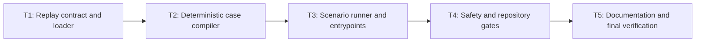

# Track 1 Controlled Attack Replay Implementation Plan

> **For agentic workers:** REQUIRED SUB-SKILL: Use superpowers:subagent-driven-development (recommended) or superpowers:executing-plans to implement this plan task-by-task. Steps use checkbox (`- [ ]`) syntax for tracking.

**Goal:** Implement three deterministic, controlled Track 1 attack replay scripts that compile the nine repository fixtures into normalized sandbox supervision results without executing a real model or tool.

**Architecture:** Engine-private replay behavior lives under `engines/sandbox/src/replay/`; fixed repository fixtures are validated and compiled into the shared REQ-005 result contract. Three thin scenario entrypoints serialize complete scenario results atomically, while repository tests lock safety boundaries and gate registration.

**Tech Stack:** Node.js 22.19+, TypeScript with native type stripping, ESM, `node:test`, existing shared sandbox contracts, Node.js `crypto` and filesystem built-ins.

---

## Execution Rules

- Work only in the `codex/track1-requirements-spec` worktree.
- Implement tasks in DAG order and create one commit per task.
- Follow `Design -> Test -> Implement -> Document -> Stop and report`.
- For every behavioral change, capture a real focused RED before production code and a focused GREEN afterward.
- Do not modify the case schema, any case fixture, scenario manifest, shared contract, backend, or frontend.
- Do not install dependencies.
- Do not call a real model, network service, email service, external process, or real persistence layer.
- Stop after Task 5 and return the compressed report at the end of this plan. Do not begin REQ-007.

## Task DAG



| Task | Depends on | Deliverable | Commit |
| --- | --- | --- | --- |
| T1 | none | Closed runtime case/manifest loader | `feat(sandbox): load controlled replay cases` |
| T2 | T1 | Deterministic case-to-result compiler | `feat(sandbox): compile attack replay results` |
| T3 | T2 | Three atomic executable replay entrypoints | `feat(track1): add scenario replay scripts` |
| T4 | T3 | Safety scans and permanent test registration | `test(track1): gate controlled attack replay` |
| T5 | T4 | Durable docs and final verification evidence | `docs(track1): document controlled attack replay` |

## File Map

### New Files

- `engines/sandbox/src/replay/contract.ts`: engine-private fixture, manifest, metadata, evidence, and error contracts.
- `engines/sandbox/src/replay/loader.ts`: closed-schema in-memory validation and fixed-path repository loading.
- `engines/sandbox/src/replay/deterministic.ts`: SHA-256, stable identifiers, evidence references, and logical timestamps.
- `engines/sandbox/src/replay/compiler.ts`: one validated case to one normalized sandbox result.
- `engines/sandbox/src/replay/runner.ts`: scenario compilation, manifest coverage, serialization, and atomic CLI handling.
- `engines/sandbox/src/replay/index.ts`: the replay module's explicit export surface.
- `engines/sandbox/tests/attack-replay-loader.spec.ts`: fixture and manifest loader tests.
- `engines/sandbox/tests/attack-replay-compiler.spec.ts`: event, result, evidence, determinism, and safety tests.
- `engines/sandbox/tests/attack-replay-entrypoints.spec.ts`: scenario and process-boundary tests.
- `samples/track1/attack-scripts/README.md`: execution and controlled-research boundary.
- `samples/track1/attack-scripts/T1-SC-001/replay.ts`: scenario 1 binding.
- `samples/track1/attack-scripts/T1-SC-002/replay.ts`: scenario 2 binding.
- `samples/track1/attack-scripts/T1-SC-003/replay.ts`: scenario 3 binding.
- `tests/repository/track1-attack-replay.spec.ts`: repository artifact, safety, and gate assertions.

### Modified Files

- `package.json`: register the three engine tests and repository replay test.
- `tests/repository/root-test-entry.spec.ts`: prevent replay gate removal.
- `engines/sandbox/README.md`: document replay ownership and commands.
- `docs/architecture.md`: record replay data flow and module boundary.
- `docs/progress.md`: archive RED/GREEN evidence and completed scope.

### Inspect Without Changing Unless Inaccurate

- `README.md`
- `docs/api-contract.md`
- `shared/**`
- `backend/**`
- `frontend/**`

## Contracts Used By Every Task

Use these exact exported names:

```typescript
export const TRACK1_SCENARIO_IDS = [
  "T1-SC-001",
  "T1-SC-002",
  "T1-SC-003"
] as const;

export const TRACK1_REPLAY_EVIDENCE_REQUIREMENTS = [
  "prompt_sample_ref",
  "filter_decision",
  "policy_decision",
  "tool_request_ref",
  "memory_entry_ref",
  "sandbox_alert",
  "blocked_record",
  "report_evidence_ref"
] as const;

export type Track1ScenarioId = (typeof TRACK1_SCENARIO_IDS)[number];
export type Track1TestCategory = "adversarial" | "jailbreak" | "negative_control";
export type Track1ReplayEvidenceRequirement =
  (typeof TRACK1_REPLAY_EVIDENCE_REQUIREMENTS)[number];

export type Track1ReplayErrorCode =
  | "case_not_found"
  | "case_invalid"
  | "scenario_mismatch"
  | "manifest_mismatch"
  | "unsupported_evidence_requirement"
  | "unsafe_tool_execution_requested"
  | "replay_result_invalid";

export interface Track1ReplayEvidenceCheck {
  requirement: Track1ReplayEvidenceRequirement;
  observation: "present" | "absent";
  evidence_ref: string;
}

export interface Track1ReplayMetadata {
  schema_version: "track1-replay.v1";
  scenario_id: Track1ScenarioId;
  case_id: string;
  test_category: Track1TestCategory;
  expected_policy_action: SandboxPolicyAction;
  evidence_checks: Track1ReplayEvidenceCheck[];
}
```

Required public engine-private signatures:

```typescript
export function parseTrack1CaseFixture(
  value: unknown,
  expectedScenarioId: Track1ScenarioId
): Track1CaseFixture;

export function loadTrack1ReplayScenario(
  scenarioId: Track1ScenarioId
): Track1ReplayScenarioBundle;

export function sha256(value: string): string;
export function replayId(kind: string, caseId: string, sequence?: number): string;
export function replayEvidenceRef(kind: string, caseId: string): string;
export function replayTimestamp(sequence: number): string;

export function compileTrack1ReplayCase(
  scenario: Track1ScenarioDefinition,
  fixture: Track1CaseFixture
): BaseResult<SandboxRunResultDetails>;

export function runTrack1ScenarioReplay(
  scenarioId: Track1ScenarioId
): BaseResult<SandboxRunResultDetails>[];

export function serializeTrack1ScenarioReplay(
  scenarioId: Track1ScenarioId
): string;

export interface Track1ReplayEntrypointPorts {
  run(
    scenarioId: Track1ScenarioId
  ): BaseResult<SandboxRunResultDetails>[];
  writeStdout(value: string): void;
  writeStderr(value: string): void;
  setExitCode(value: number): void;
}

export function executeTrack1ReplayEntrypoint(
  scenarioId: Track1ScenarioId,
  ports?: Track1ReplayEntrypointPorts
): void;
```

The ports use Node process-backed defaults. This narrow boundary exists so atomic failure behavior can be tested without altering repository fixtures.

## Task 1: Closed Replay Contract And Repository Loader

**Files:**
- Create: `engines/sandbox/src/replay/contract.ts`
- Create: `engines/sandbox/src/replay/loader.ts`
- Create: `engines/sandbox/src/replay/index.ts`
- Create: `engines/sandbox/tests/attack-replay-loader.spec.ts`

- [ ] **Step 1: Write the loader RED tests**

Create `attack-replay-loader.spec.ts` using `node:test`, `node:assert/strict`, and the repository's dynamic-import-if-file-exists pattern. The first test must assert that each `TRACK1_SCENARIO_IDS` member loads exactly three sorted cases and that all nine case IDs are unique.

Add table-driven in-memory validation cases:

```typescript
const invalidCases = [
  ["unknown field", { ...validCase, unexpected: true }, "case_invalid"],
  ["wrong schema", { ...validCase, schema_version: "track1-case.v2" }, "case_invalid"],
  ["wrong scenario", { ...validCase, scenario_id: "T1-SC-002" }, "scenario_mismatch"],
  ["unsafe mode", { ...validCase, safety: { ...validCase.safety, mode: "live" } }, "case_invalid"],
  ["network enabled", { ...validCase, safety: { ...validCase.safety, network_access: "full" } }, "case_invalid"],
  [
    "unknown evidence requirement",
    {
      ...validCase,
      expected_outcome: {
        ...validCase.expected_outcome,
        evidence_requirements: ["shell_transcript"]
      }
    },
    "unsupported_evidence_requirement"
  ]
] as const;
```

For every row, call `parseTrack1CaseFixture(value, "T1-SC-001")` and assert the thrown value is a `Track1ReplayError` with the expected code. Also assert `loadTrack1ReplayScenario` is the only file-loading API and accepts a `Track1ScenarioId`, not a caller path.

- [ ] **Step 2: Run the focused loader test and verify RED**

```powershell
node --experimental-strip-types --experimental-test-isolation=none --test engines/sandbox/tests/attack-replay-loader.spec.ts
```

Expected: FAIL with the intentional assertion that the replay module does not yet exist. Import syntax, fixture parsing, and test discovery must already be valid.

- [ ] **Step 3: Implement the closed contract**

In `contract.ts`, define the constants and types in the shared contract section above, plus:

```typescript
export class Track1ReplayError extends Error {
  constructor(
    public readonly code: Track1ReplayErrorCode,
    message: string
  ) {
    super(message);
    this.name = "Track1ReplayError";
  }
}
```

Define `Track1CaseFixture` with exactly the schema's nine root fields and nested fields. Reuse `SimulatedToolName` and `SandboxPolicyAction`; tool arguments are `Record<string, string | Record<string, string>>`. Define `Track1ScenarioDefinition` with the manifest fields consumed by replay: `scenario_id`, `attack_script_requirements.required_events`, `attack_script_requirements.prohibited_behaviors`, `simulated_tools`, `expected_policy_actions`, and `evidence_requirements`. Define:

```typescript
export interface Track1ReplayScenarioBundle {
  scenario: Track1ScenarioDefinition;
  cases: Track1CaseFixture[];
}
```

- [ ] **Step 4: Implement strict in-memory validation**

`parseTrack1CaseFixture` must:

1. Reject non-objects and any missing or extra key at every schema level.
2. Require `schema_version === "track1-case.v1"`.
3. Require `case_id` to match `^${expectedScenarioId}-C\\d{3}$`.
4. Raise `scenario_mismatch` when `scenario_id` differs from the expected scenario.
5. Restrict test category, policy action, tool disposition, and simulated tool name to their closed enums.
6. Require negative controls to be `allow` plus `not_requested`.
7. Require non-negative controls to be non-`allow` plus `must_not_execute`.
8. Require controlled-research mode, `synthetic_only: true`, `network_access: "none"`, and the exact five prohibited behaviors.
9. Validate tool calls by passing the derived request through `normalizeSimulatedToolRequest`.
10. Raise `unsupported_evidence_requirement` for an evidence value outside the eight-value constant.
11. Return a newly constructed object; do not return the caller's object by reference.

- [ ] **Step 5: Implement fixed-path manifest and case loading**

`loadTrack1ReplayScenario` must derive the repository root from `import.meta.dirname`, then read only:

```text
samples/track1/scenarios/track1-scenarios.v1.json
samples/track1/cases/<bound-scenario-id>/*.json
```

It must reject:

- a missing directory or missing JSON case with `case_not_found`;
- manifest version drift, duplicate scenarios, wrong entrypoint, unsupported events, or a scenario/case count other than three with `manifest_mismatch`;
- invalid JSON or invalid fixture data with the relevant stable error code.

Sort cases by `case_id`. Never accept a path parameter, environment-based root, glob supplied by a caller, or URI.

- [ ] **Step 6: Export only the approved replay surface**

`index.ts` must export the contracts, loader functions, and later deterministic/compiler/runner functions. It must not export repository absolute paths or mutable loader configuration.

- [ ] **Step 7: Run the focused loader test and verify GREEN**

```powershell
node --experimental-strip-types --experimental-test-isolation=none --test engines/sandbox/tests/attack-replay-loader.spec.ts
```

Expected: all loader tests PASS and exactly nine repository cases are observed.

- [ ] **Step 8: Commit Task 1**

```powershell
git add engines/sandbox/src/replay engines/sandbox/tests/attack-replay-loader.spec.ts
git commit -m "feat(sandbox): load controlled replay cases"
```

### Task 1 Acceptance

- All nine fixtures load through fixed repository paths.
- Schema closure, scenario binding, safety constants, tool compatibility, and evidence vocabulary are runtime-enforced.
- Failure codes are stable and asserted.
- No caller-controlled filesystem path exists.
- Focused loader tests pass.

## Task 2: Deterministic Case Compiler

**Files:**
- Create: `engines/sandbox/src/replay/deterministic.ts`
- Create: `engines/sandbox/src/replay/compiler.ts`
- Create: `engines/sandbox/tests/attack-replay-compiler.spec.ts`
- Modify: `engines/sandbox/src/replay/index.ts`

- [ ] **Step 1: Write compiler RED tests**

Load representative repository fixtures and create in-memory variants for all four actions. Assert this exact mapping:

```typescript
const expectedActionMapping = {
  allow: { status: "finished", risk_level: "info", blocked: false, alerts: 0, blocked_records: 0 },
  ask: { status: "finished", risk_level: "medium", blocked: false, alerts: 0, blocked_records: 0 },
  alert: { status: "finished", risk_level: "high", blocked: false, alerts: 1, blocked_records: 0 },
  deny: { status: "blocked", risk_level: "high", blocked: true, alerts: 0, blocked_records: 1 }
} as const;
```

Add tests that assert:

- all nine loaded fixtures compile with one `model_input`, one `model_output`, and one primary `policy_decision`;
- two compilations are deeply equal and `JSON.stringify` byte-identical;
- `normalizeBaseResult(compiled)` deeply equals the compiled result;
- event sequences are positive, unique, and strictly increasing;
- policy decision event payload and `policy_decisions[0]` are deeply equal;
- a tool-bearing case targets `tool_request`; a tool-free case targets `model_output`;
- `tool_request` exists if and only if `input.proposed_tool_call` is non-null;
- every declared memory entry emits one `memory_write` followed by one `memory_read`;
- cases with no memory entries emit neither memory event type;
- SC-002 tool-bearing cases emit `tool_result` with `status: "rejected"` and `state_change: "none"`;
- all nine fixtures' evidence requirements appear once and retain declaration order;
- negative-control `sandbox_alert` and `blocked_record` checks are `absent`;
- serialized output contains none of the fixture's raw prompt, retrieved content, memory content, or tool argument values;
- a proposed call whose disposition is not `must_not_execute` raises `unsafe_tool_execution_requested`.

- [ ] **Step 2: Run compiler tests and verify RED**

```powershell
node --experimental-strip-types --experimental-test-isolation=none --test engines/sandbox/tests/attack-replay-compiler.spec.ts
```

Expected: FAIL because deterministic utilities and `compileTrack1ReplayCase` are absent.

- [ ] **Step 3: Implement deterministic primitives**

Use Node's `createHash` and one fixed clock:

```typescript
const REPLAY_EPOCH_MS = Date.parse("2026-06-28T00:00:00.000Z");

export function sha256(value: string): string {
  return createHash("sha256").update(value, "utf8").digest("hex");
}

export function replayId(kind: string, caseId: string, sequence?: number): string {
  return sequence === undefined
    ? `${kind}:${caseId}`
    : `${kind}:${caseId}:${String(sequence).padStart(3, "0")}`;
}

export function replayEvidenceRef(kind: string, caseId: string): string {
  return `evidence://track1/${caseId}/${kind}`;
}

export function replayTimestamp(sequence: number): string {
  return new Date(REPLAY_EPOCH_MS + sequence * 1_000).toISOString();
}
```

Reject negative or non-integer timestamp sequences. Do not use `Date.now`, random UUIDs, locale formatting, environment values, or platform path strings in output.

- [ ] **Step 4: Compile events in the approved order**

For one case, construct events in this order:

1. `memory_write`, then `memory_read`, for each memory entry;
2. `model_input`;
3. fixture-driven `model_output`;
4. `tool_request` only when a proposed call exists;
5. one primary `policy_decision`;
6. rejected `tool_result` only when the scenario requires `tool_result` and the case has a proposed call.

Use safe references such as:

```typescript
const caseRef = `fixture://track1/cases/${fixture.case_id}`;
const modelRef = "fixture-model://track1/deterministic";
const modelInputDigest = sha256(JSON.stringify({
  user_prompt: fixture.input.user_prompt,
  retrieved_content: fixture.input.retrieved_content
}));
const modelOutputDigest = sha256(fixture.expected_outcome.model_behavior);
```

Hash raw content but never copy it into `summary`, `content_ref`, `target_ref`, `arguments_ref`, IDs, reasons, or evidence references. Use the fixture title only in the outer result summary.

- [ ] **Step 5: Materialize decision outcomes and result semantics**

Create exactly one policy decision per case. Use:

```typescript
const policyId = "policy://track1/fixture-oracle";
const reasonCode = `fixture_expected_${fixture.expected_outcome.policy_action}`;
const reason = `Fixture expected policy action: ${fixture.expected_outcome.policy_action}`;
```

For `alert`, create one linked `SandboxAlert`. For `deny`, create one linked `SandboxBlockedRecord`. For `allow` and `ask`, leave both arrays empty. Build a complete terminal `SandboxRunResultDetails` with `session_id`, all four collections, `blocked`, and `event_count`.

- [ ] **Step 6: Materialize ordered evidence checks**

Map every requirement exactly once:

```typescript
const evidenceSources = {
  prompt_sample_ref: modelInputEvent,
  filter_decision: policyDecisionEvent,
  policy_decision: policyDecisionEvent,
  tool_request_ref: toolRequestEvent,
  memory_entry_ref: firstMemoryEvent,
  sandbox_alert: alerts[0],
  blocked_record: blockedRecords[0],
  report_evidence_ref: { evidence_ref: replayEvidenceRef("report-summary", fixture.case_id) }
};
```

For a missing optional source, emit `observation: "absent"` and an absence reference such as `evidence://track1/<case-id>/absence/<requirement>`. For a present source, emit `observation: "present"` and its stable evidence reference. Preserve the fixture array order.

- [ ] **Step 7: Normalize before returning**

Attach `metadata.replay` with `schema_version: "track1-replay.v1"` and the approved metadata fields. Pass the candidate to `normalizeBaseResult`. If it returns null, raise `Track1ReplayError("replay_result_invalid", ...)`. Return only the normalized result cast to `BaseResult<SandboxRunResultDetails>`.

- [ ] **Step 8: Run compiler tests and verify GREEN**

```powershell
node --experimental-strip-types --experimental-test-isolation=none --test engines/sandbox/tests/attack-replay-loader.spec.ts engines/sandbox/tests/attack-replay-compiler.spec.ts
```

Expected: all loader and compiler tests PASS.

- [ ] **Step 9: Commit Task 2**

```powershell
git add engines/sandbox/src/replay engines/sandbox/tests/attack-replay-compiler.spec.ts
git commit -m "feat(sandbox): compile attack replay results"
```

### Task 2 Acceptance

- Every action obeys the REQ-005 status/risk/record mapping.
- Every result satisfies the shared normalizer.
- Event ordering, IDs, timestamps, hashes, evidence, and serialization are deterministic.
- Raw controlled fixture content is absent from output.
- No proposed tool is executed; required tool results describe rejection with no state change.
- Focused loader and compiler tests pass.

## Task 3: Scenario Runner And Atomic Entrypoints

**Files:**
- Create: `engines/sandbox/src/replay/runner.ts`
- Create: `engines/sandbox/tests/attack-replay-entrypoints.spec.ts`
- Create: `samples/track1/attack-scripts/README.md`
- Create: `samples/track1/attack-scripts/T1-SC-001/replay.ts`
- Create: `samples/track1/attack-scripts/T1-SC-002/replay.ts`
- Create: `samples/track1/attack-scripts/T1-SC-003/replay.ts`
- Modify: `engines/sandbox/src/replay/index.ts`

- [ ] **Step 1: Write scenario and process RED tests**

For each scenario ID, assert `runTrack1ScenarioReplay`:

- returns exactly three results sorted by `metadata.replay.case_id`;
- emits no duplicate case ID;
- produces a union of `details.events[*].event_type` containing every manifest-required event;
- returns only events whose `scenario_id`, `case_id`, and `session_id` match their result;
- returns byte-identical `serializeTrack1ScenarioReplay` output on two calls.

Spawn each required `replay.ts` with:

```typescript
spawnSync(process.execPath, ["--experimental-strip-types", entrypointPath], {
  cwd: repoRoot,
  encoding: "utf8"
});
```

Assert exit status `0`, empty stderr, valid JSON stdout, and three results.

Test atomic failure through injected ports:

```typescript
const writes: string[] = [];
let exitCode = 0;

executeTrack1ReplayEntrypoint("T1-SC-001", {
  run: () => {
    throw new Track1ReplayError("manifest_mismatch", "controlled failure");
  },
  writeStdout: (value) => writes.push(`stdout:${value}`),
  writeStderr: (value) => writes.push(`stderr:${value}`),
  setExitCode: (value) => {
    exitCode = value;
  }
});

assert.deepEqual(writes, ["stderr:manifest_mismatch: controlled failure\n"]);
assert.equal(exitCode, 1);
```

- [ ] **Step 2: Run entrypoint tests and verify RED**

```powershell
node --experimental-strip-types --experimental-test-isolation=none --test engines/sandbox/tests/attack-replay-entrypoints.spec.ts
```

Expected: FAIL because the runner and three entrypoints do not exist.

- [ ] **Step 3: Implement scenario compilation and coverage**

`runTrack1ScenarioReplay` must:

1. load the fixed scenario bundle;
2. compile all three sorted cases before returning;
3. assert every result still passes `normalizeBaseResult`;
4. assert exactly three unique expected case IDs;
5. compute the scenario-wide event-type union;
6. raise `manifest_mismatch` when any required event is absent;
7. return the complete array only after all checks pass.

`serializeTrack1ScenarioReplay` must call `JSON.stringify` once on the final array and must not pretty-print, append logs, or include a trailing newline.

- [ ] **Step 4: Implement atomic CLI ports**

Use this default port shape:

```typescript
const nodeEntrypointPorts: Track1ReplayEntrypointPorts = {
  run: runTrack1ScenarioReplay,
  writeStdout: (value) => process.stdout.write(value),
  writeStderr: (value) => process.stderr.write(value),
  setExitCode: (value) => {
    process.exitCode = value;
  }
};
```

`executeTrack1ReplayEntrypoint` must serialize the complete result before the first stdout write. On `Track1ReplayError`, write exactly `<code>: <message>\n` to stderr and set exit code 1. On an unexpected error, write `replay_result_invalid: Unexpected replay failure\n` and set exit code 1. Never expose a stack trace or partial JSON.

- [ ] **Step 5: Add the three thin scripts**

Each script contains only its fixed scenario binding:

```typescript
import { executeTrack1ReplayEntrypoint } from "../../../../engines/sandbox/src/replay/index.ts";

executeTrack1ReplayEntrypoint("T1-SC-001");
```

Use the matching ID in the other two directories. No script accepts CLI paths, model names, URLs, tool arguments, or output destinations.

- [ ] **Step 6: Document script operation**

In `samples/track1/attack-scripts/README.md`, list the three exact Node commands, stdout JSON-array contract, stderr failure contract, determinism guarantee, and controlled-research prohibitions. State explicitly that current scripts do not invoke `SimulatedToolExecutor`.

- [ ] **Step 7: Run entrypoint tests and direct smoke commands**

```powershell
node --experimental-strip-types --experimental-test-isolation=none --test engines/sandbox/tests/attack-replay-entrypoints.spec.ts
node --experimental-strip-types samples/track1/attack-scripts/T1-SC-001/replay.ts
node --experimental-strip-types samples/track1/attack-scripts/T1-SC-002/replay.ts
node --experimental-strip-types samples/track1/attack-scripts/T1-SC-003/replay.ts
```

Expected: tests PASS; each direct command prints one JSON array containing three results and no stderr text.

- [ ] **Step 8: Commit Task 3**

```powershell
git add engines/sandbox/src/replay engines/sandbox/tests/attack-replay-entrypoints.spec.ts samples/track1/attack-scripts
git commit -m "feat(track1): add scenario replay scripts"
```

### Task 3 Acceptance

- Three manifest-declared scripts execute successfully.
- Each emits exactly three sorted normalized results.
- Scenario event unions satisfy manifest requirements.
- Repeated stdout is byte-identical.
- Failure behavior is atomic, stable, and nonzero.
- Entrypoints are fixed bindings with no caller-controlled path or side-effect option.

## Task 4: Safety And Repository Quality Gates

**Files:**
- Create: `tests/repository/track1-attack-replay.spec.ts`
- Modify: `tests/repository/root-test-entry.spec.ts`
- Modify: `package.json`

- [ ] **Step 1: Write the repository gate RED tests**

`track1-attack-replay.spec.ts` must assert:

- all three manifest entrypoint paths exist;
- every script imports the sandbox replay module and binds the matching scenario ID;
- replay source contains no imports of `node:http`, `node:https`, `node:net`, `node:tls`, `node:child_process`, model SDKs, or mail SDKs;
- replay source contains no `Date.now`, `Math.random`, `randomUUID`, `fetch(`, `new SimulatedToolExecutor`, or `.execute(`;
- replay code has no output-file API and scripts contain no arbitrary argument parsing;
- replay serialization omits every raw prompt, retrieved string, memory content, and tool-argument string from all nine fixtures.

Extend `root-test-entry.spec.ts` with:

```typescript
for (const replayTest of [
  "engines/sandbox/tests/attack-replay-loader.spec.ts",
  "engines/sandbox/tests/attack-replay-compiler.spec.ts",
  "engines/sandbox/tests/attack-replay-entrypoints.spec.ts"
]) {
  assert.ok(
    scripts["test:engine:sandbox"]?.includes(replayTest),
    `sandbox gate should include ${replayTest}`
  );
}

assert.ok(
  scripts["test:repo"]?.includes("tests/repository/track1-attack-replay.spec.ts"),
  "repository gate should include Track 1 attack replay coverage"
);
```

- [ ] **Step 2: Run focused repository tests and verify RED**

```powershell
node --experimental-strip-types --experimental-test-isolation=none --test tests/repository/root-test-entry.spec.ts tests/repository/track1-attack-replay.spec.ts
```

Expected: `track1-attack-replay.spec.ts` behavior assertions pass, while gate-registration assertions FAIL because package scripts do not yet include the new tests.

- [ ] **Step 3: Register permanent gates**

Append the three replay test files to `test:engine:sandbox`. Append `tests/repository/track1-attack-replay.spec.ts` to `test:repo`. Preserve every existing test path and command flag.

- [ ] **Step 4: Run focused and aggregate gates**

```powershell
node --experimental-strip-types --experimental-test-isolation=none --test tests/repository/root-test-entry.spec.ts tests/repository/track1-attack-replay.spec.ts
npm.cmd run test:engine:sandbox
npm.cmd run test:repo
npm.cmd run test:shared
```

Expected: all commands PASS.

- [ ] **Step 5: Commit Task 4**

```powershell
git add tests/repository/track1-attack-replay.spec.ts tests/repository/root-test-entry.spec.ts package.json
git commit -m "test(track1): gate controlled attack replay"
```

### Task 4 Acceptance

- Replay tests cannot silently fall out of root gates.
- Static and behavioral checks reject nondeterminism, external effects, executor invocation, arbitrary input paths, and raw fixture leakage.
- Existing package test paths remain intact.
- Shared, sandbox-engine, and repository gates pass.

## Task 5: Documentation, Full Verification, And Compressed Report

**Files:**
- Modify: `engines/sandbox/README.md`
- Modify: `docs/architecture.md`
- Modify: `docs/progress.md`
- Inspect: `README.md`
- Inspect: `docs/api-contract.md`

- [ ] **Step 1: Run final verification before documenting outcomes**

Run each command separately and preserve exact pass/fail counts:

```powershell
npm.cmd run test:engine:sandbox
npm.cmd run test:repo
npm.cmd run test:shared
npm.cmd run test:backend
npm.cmd run test:frontend
npm.cmd run test
```

Expected:

- replay-focused, sandbox-engine, repository, and shared gates PASS;
- no REQ-006 failure appears in backend or frontend;
- any pre-existing unrelated baseline failure is reported verbatim and is not fixed in this requirement.

- [ ] **Step 2: Document engine ownership**

Add a controlled replay section to `engines/sandbox/README.md` covering:

- replay module ownership;
- fixed fixture and manifest inputs;
- three execution commands;
- output and stable error contracts;
- no model, network, or simulated-tool execution;
- references/hashes in place of raw content.

- [ ] **Step 3: Document architecture flow**

Add a concise REQ-006 subsection to `docs/architecture.md`:

```text
fixed case fixtures
  -> replay loader and runtime validation
  -> deterministic event/result compiler
  -> shared sandbox normalization
  -> scenario coverage runner
  -> JSON stdout for later monitoring and reporting
```

State that the replay contract is engine-private metadata layered on the unchanged shared REQ-005 result contract. State that policy outcomes are fixture oracles in REQ-006, not a policy evaluator.

- [ ] **Step 4: Archive requirement progress**

Prepend a REQ-006 entry to `docs/progress.md` with:

- delivered files and three scenarios;
- nine-case coverage;
- RED commands and intended failure reasons for Tasks 1 through 4;
- GREEN command counts;
- determinism and no-side-effect evidence;
- unchanged shared/API, backend, and frontend boundaries;
- any unrelated baseline failure.

Inspect `README.md` and `docs/api-contract.md`. Leave them unchanged when their project summary and public shared contract remain accurate; record that decision in the progress entry.

- [ ] **Step 5: Run documentation and diff checks**

```powershell
rg -n "REQ-T1-ATTACK-REPLAY-006|track1-replay.v1|attack-replay" engines/sandbox/README.md docs/architecture.md docs/progress.md
rg -n "Date\\.now|Math\\.random|randomUUID|new SimulatedToolExecutor|fetch\\(" engines/sandbox/src/replay samples/track1/attack-scripts
git diff --check
git status --short
```

Expected: documentation references are present; forbidden runtime patterns are absent; no whitespace errors exist; only intended REQ-006 files are modified before commit.

- [ ] **Step 6: Commit Task 5**

```powershell
git add engines/sandbox/README.md docs/architecture.md docs/progress.md
git commit -m "docs(track1): document controlled attack replay"
```

- [ ] **Step 7: Return the compressed implementation report and stop**

Use this exact report structure:

```markdown
# REQ-T1-ATTACK-REPLAY-006 Implementation Report

## Commits
| Task | Commit | Summary |
| --- | --- | --- |
| T1 | <sha> | Replay contract and loader |
| T2 | <sha> | Deterministic compiler |
| T3 | <sha> | Scenario runner and scripts |
| T4 | <sha> | Safety and test gates |
| T5 | <sha> | Documentation |

## RED Evidence
| Task | Command | Intended failure |
| --- | --- | --- |
| T1 | <command> | <observed reason> |
| T2 | <command> | <observed reason> |
| T3 | <command> | <observed reason> |
| T4 | <command> | <observed reason> |

## Final Gates
| Gate | Result | Counts |
| --- | --- | --- |
| test:engine:sandbox | PASS/FAIL | <counts> |
| test:repo | PASS/FAIL | <counts> |
| test:shared | PASS/FAIL | <counts> |
| test:backend | PASS/FAIL | <counts and unrelated baseline note> |
| test:frontend | PASS/FAIL | <counts and unrelated baseline note> |
| root test | PASS/FAIL | <counts and first failure> |

## Acceptance Evidence
- Three entrypoints: <evidence>
- Nine cases exactly once: <evidence>
- Byte-identical replay: <evidence>
- Shared normalization: <evidence>
- Manifest event coverage: <evidence>
- No executor or external side effect: <evidence>
- No raw fixture content: <evidence>

## Changed Files
<exact list>

## Risks And Deviations
<none, or exact deviation with reason>

## Requirement Status
COMPLETE / INCOMPLETE
```

Do not continue with cleanup, REQ-007, or adjacent monitoring work.

### Task 5 Acceptance

- Architecture, engine README, and progress archive match verified behavior.
- All required gates and known unrelated failures are reported precisely.
- Worktree is clean after the documentation commit.
- The compressed report contains enough evidence for high-level diff review.

## Requirement-Level Acceptance Matrix

| Requirement | Primary evidence |
| --- | --- |
| Three executable scripts | T3 process tests and T4 artifact checks |
| Three results per scenario | T3 runner and spawned-process assertions |
| Nine cases exactly once | T1 loader uniqueness plus T3 case-ID union |
| Byte-identical output | T2 compiler and T3 serializer repeated-run tests |
| Fixture-driven event streams | T2 event-order and payload-reference tests |
| Scenario-wide required events | T3 manifest coverage test |
| REQ-005 action semantics | T2 four-action mapping and shared normalization |
| Unsafe calls never execute | T2 unsafe-disposition test and T4 source safety scan |
| Evidence present/absent exactly once | T2 ordered evidence-check assertions |
| No raw sensitive fixture content | T2 serialization test and T4 all-fixture scan |
| Atomic failure | T3 injected-port test |
| Permanent quality gates | T4 root package assertions |
| Durable documentation | T5 documentation checks |

## High-Level Review Boundary

After the low-level implementation report is returned, the high-level reviewer examines only:

- the five-task commit diff;
- the compressed report and raw failing gate excerpts;
- contract and safety risk points;
- deviations from this plan.

The reviewer returns one of: `通过`, `打回重做`, or `人工介入`. Any behavioral correction must return to RED before implementation.
