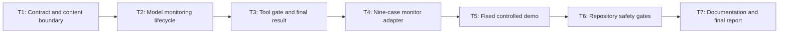

# Track 1 Model Call-Chain Monitor Plugin Implementation Plan

> **For agentic workers:** REQUIRED SUB-SKILLS: Use superpowers:executing-plans and superpowers:test-driven-development. Execute only the task explicitly assigned by the user, return its evidence, and do not continue automatically.

**Goal:** Implement a reusable sandbox-engine monitor that wraps model and simulated-tool calls, applies injected policy decisions, intercepts unsafe execution, and emits deterministic normalized supervision results for all nine Track 1 cases.

**Architecture:** An engine-private `MonitoredSession` owns safe event state and lifecycle control. Raw model/tool values exist only in method-local callback snapshots; the session retains hashes, references, decisions, and fixed summaries. A replay adapter injects deterministic runtime ports and fixture decisions, while a fixed demo and repository gates prove the boundary without changing shared contracts or REQ-006 output.

**Tech Stack:** Node.js 22.19+, TypeScript ESM with native type stripping, `node:test`, existing shared sandbox/result normalizers, existing simulated-tool executor, existing Track 1 replay loader, Node.js `crypto`.

---

## Execution Rules

- Work only in the `codex/track1-requirements-spec` worktree.
- Read `metadata.md`, `docs/sprint-current.md`, the approved design, and the files named by the assigned task before editing.
- Follow `Design -> Test -> Implement -> Document -> Stop and report`.
- Every production behavior requires an observed focused RED before its minimal GREEN implementation.
- A missing module must be converted into an intentional assertion failure with the repository's `importModuleIfExists` pattern; an uncaught import error is not valid RED evidence.
- Run tasks in DAG order. Create exactly one commit for each completed task.
- Stop after the assigned task and return its changed files, RED evidence, GREEN evidence, risks, and commit SHA.
- Do not install dependencies.
- Do not change `shared/**`, `backend/**`, `frontend/**`, case fixtures, scenario manifests, or existing REQ-006 replay source/scripts.
- Do not call a real model, network service, email service, host filesystem tool, or external process from monitoring runtime or demo code.
- Do not implement REQ-008 detection rules, OpenClaw integration, persistence, API routes, UI, cluster aggregation, or approval resumption.
- If a shared contract change appears necessary, stop and return `人工介入` with the exact incompatibility.

## Canonical Inputs

- Requirement: `docs/sprint-current.md`
- Approved design: `docs/superpowers/specs/2026-06-28-track1-monitor-plugin-design.md`
- Existing sandbox contract: `shared/types/sandbox.ts`
- Existing result contract: `shared/types/result.ts`
- Shared normalization: `shared/contracts/sandbox.ts`, `shared/contracts/result.ts`
- Simulated tools: `engines/sandbox/src/simulated-tools/`
- Track 1 replay source: `engines/sandbox/src/replay/`

The approved design is authoritative. This plan narrows implementation order and evidence; it does not widen the requirement.

## Task DAG



| Task | Depends on | Deliverable | Commit |
| --- | --- | --- | --- |
| T1 | none | Closed monitor contracts, safe hashes/references, defensive snapshots | `feat(sandbox): add monitor contracts and content boundary` |
| T2 | T1 | Model callback middleware, decisions, lifecycle, fail-closed behavior | `feat(sandbox): monitor model call lifecycle` |
| T3 | T2 | Simulated-tool execution gate and normalized terminal results | `feat(sandbox): gate monitored tool execution` |
| T4 | T3 | Deterministic replay-to-monitor adapter for nine cases | `feat(track1): adapt attack cases to monitor sessions` |
| T5 | T4 | Fixed no-argument nine-case monitor demo | `feat(track1): add controlled monitor demo` |
| T6 | T5 | Permanent engine/repository gates and static safety checks | `test(track1): gate model call-chain monitor` |
| T7 | T6 | Durable docs, full verification, compressed report | `docs(track1): document model call-chain monitor` |

## Planned File Map

### New Files

- `engines/sandbox/src/monitoring/contract.ts`
- `engines/sandbox/src/monitoring/content-boundary.ts`
- `engines/sandbox/src/monitoring/session.ts`
- `engines/sandbox/src/monitoring/result-builder.ts`
- `engines/sandbox/src/monitoring/replay-adapter.ts`
- `engines/sandbox/src/monitoring/index.ts`
- `engines/sandbox/tests/attack-monitor-contract.spec.ts`
- `engines/sandbox/tests/attack-monitor-session.spec.ts`
- `engines/sandbox/tests/attack-monitor-replay-adapter.spec.ts`
- `engines/sandbox/tests/attack-monitor-demo.spec.ts`
- `samples/track1/monitor-plugin/demo.ts`
- `samples/track1/monitor-plugin/README.md`
- `tests/repository/track1-monitor-plugin.spec.ts`

### Modified Files

- `package.json`
- `tests/repository/root-test-entry.spec.ts`
- `engines/sandbox/README.md`
- `docs/architecture.md`
- `docs/progress.md`

### Inspect Without Changing Unless Inaccurate

- `README.md`
- `docs/api-contract.md`

### Must Remain Unchanged

- `shared/**`
- `backend/**`
- `frontend/**`
- `samples/track1/cases/**`
- `samples/track1/scenarios/**`
- `samples/track1/attack-scripts/**`
- `engines/sandbox/src/replay/**`

## Required Export Surface

`engines/sandbox/src/monitoring/index.ts` is the only supported import surface for monitor consumers. Export these exact names:

```typescript
export const TRACK1_MONITOR_SCHEMA_VERSION = "track1-monitor.v1";
export const MONITOR_FAIL_CLOSED_PROPOSAL: Readonly<MonitorDecisionProposal>;

export type MonitorDecisionStage = "model_output" | "tool_request";
export type MonitorLifecycleState = "open" | "sealed" | "finalized";

export interface MonitorSessionContext {
  task_id: string;
  session_id: string;
  model_ref: string;
  scenario_id?: string;
  case_id?: string;
}

export interface MonitorRuntimePorts {
  now(): string;
  nextId(kind: string): string;
}

export interface MonitorModelRequest {
  content: string;
  content_ref: string;
}

export interface MonitorModelResponse {
  content: string;
  content_ref: string;
}

export interface MonitoredModelOutcome {
  response: MonitorModelResponse;
  decision: SandboxPolicyDecision;
  can_continue: boolean;
}

export type MonitorModelNext = (
  request: MonitorModelRequest
) => MonitorModelResponse | Promise<MonitorModelResponse>;

export interface MonitorToolDecisionContext {
  model_input: MonitorModelRequest;
  model_output: MonitorModelResponse;
}

export type MonitorToolNext = (
  request: SimulatedToolRequest
) => SimulatedToolResult | Promise<SimulatedToolResult>;

export type MonitoredToolOutcome =
  | {
      disposition: "executed";
      action: "allow" | "alert";
      decision: SandboxPolicyDecision;
      result: SimulatedToolResult;
    }
  | {
      disposition: "intercepted";
      action: "deny" | "ask";
      decision: SandboxPolicyDecision;
      result: SandboxToolResultPayload;
    };

export interface MonitorDecisionInput {
  stage: MonitorDecisionStage;
  session: Readonly<MonitorSessionContext>;
  subject_event_id: string;
  model_input: Readonly<MonitorModelRequest>;
  model_output: Readonly<MonitorModelResponse>;
  tool_request?: Readonly<SimulatedToolRequest>;
}

export interface MonitorDecisionProposal {
  policy_id: string;
  action: SandboxPolicyAction;
  reason_code: string;
  reason: string;
  evidence_refs: string[];
}

export interface MonitorDecisionProvider {
  decide(
    input: Readonly<MonitorDecisionInput>
  ): MonitorDecisionProposal | Promise<MonitorDecisionProposal>;
}

export interface Track1MonitorMetadata {
  schema_version: "track1-monitor.v1";
  model_call_count: number;
  tool_call_count: number;
  decision_count: number;
  executed_tool_count: number;
  intercepted_tool_count: number;
  provider_failure_count: number;
}
```

Required class and adapter signatures:

```typescript
export class MonitoredSession {
  constructor(
    context: unknown,
    decisionProvider: MonitorDecisionProvider,
    runtimePorts?: MonitorRuntimePorts
  );

  invokeModel(
    request: unknown,
    next: MonitorModelNext
  ): Promise<MonitoredModelOutcome>;

  invokeTool(
    request: unknown,
    context: MonitorToolDecisionContext,
    next: MonitorToolNext
  ): Promise<MonitoredToolOutcome>;

  finalize(): BaseResult<SandboxRunResultDetails>;
}

export function runTrack1MonitorScenario(
  scenarioId: Track1ScenarioId
): Promise<BaseResult<SandboxRunResultDetails>[]>;

export function runAllTrack1MonitorCases():
  Promise<BaseResult<SandboxRunResultDetails>[]>;

export function serializeTrack1MonitorDemo(): Promise<string>;

export interface Track1MonitorDemoPorts {
  run(): Promise<BaseResult<SandboxRunResultDetails>[]>;
  writeStdout(value: string): void;
  writeStderr(value: string): void;
  setExitCode(value: number): void;
}

export function executeTrack1MonitorDemo(
  ports: Track1MonitorDemoPorts
): Promise<void>;
```

Required error taxonomy:

```typescript
export type Track1MonitorErrorCode =
  | "monitor_context_invalid"
  | "monitor_model_request_invalid"
  | "monitor_model_response_invalid"
  | "monitor_tool_request_invalid"
  | "monitor_decision_invalid"
  | "monitor_model_failed"
  | "monitor_tool_failed"
  | "monitor_state_invalid"
  | "monitor_session_empty"
  | "monitor_result_invalid";

export class Track1MonitorError extends Error {
  readonly code: Track1MonitorErrorCode;
}
```

Errors expose only a stable code and fixed safe message. They never interpolate caller values, callback values, provider output, or raw exceptions.

| Code | Fixed message |
| --- | --- |
| `monitor_context_invalid` | `Monitor context is invalid` |
| `monitor_model_request_invalid` | `Monitor model request is invalid` |
| `monitor_model_response_invalid` | `Monitor model response is invalid` |
| `monitor_tool_request_invalid` | `Monitor tool request is invalid` |
| `monitor_decision_invalid` | `Monitor decision provider is invalid` |
| `monitor_model_failed` | `Monitored model callback failed` |
| `monitor_tool_failed` | `Monitored tool callback failed` |
| `monitor_state_invalid` | `Monitor session state is invalid` |
| `monitor_session_empty` | `Monitor session has no model call` |
| `monitor_result_invalid` | `Monitor result is invalid` |

## Fixed Semantics

### Safe References

- Model events retain caller-provided `content_ref` only after it passes a strict safe-reference validator.
- Model events retain `sha256(content)` and fixed summaries only.
- Tool `target_ref` is `simulated-target://<tool-name>/<canonical-arguments-sha256>`.
- Tool `arguments_ref` is `sha256://<canonical-arguments-sha256>`.
- Tool `result_ref` is `simulated-result://<call-id>/<canonical-result-sha256>`.
- Provider policy/evidence references must pass the same safe-reference validator.
- Safe references reject whitespace, query strings, fragments, control characters, and missing URI schemes.

### Counters

- `model_call_count` increments when a valid model request emits `model_input`, including callback failure.
- `tool_call_count` increments when a valid correlated request emits `tool_request`.
- `decision_count` equals the number of materialized policy decisions.
- `executed_tool_count` increments immediately before an allow/alert tool callback is invoked, including callback failure.
- `intercepted_tool_count` increments for deny, ask, and fail-closed tool paths.
- `provider_failure_count` increments for provider throw/rejection, mutation error, or invalid/unsafe provider output.

### Result Summary

Use fixed summaries only:

| Terminal state | Summary |
| --- | --- |
| failed | `Monitored sandbox session failed` |
| blocked | `Monitored sandbox session blocked` |
| finished | `Monitored sandbox session completed` |

### Decision And Record Materialization

- A decision targets the model-output or tool-request event that caused it.
- A `policy_decision` event contains a value deeply equal to its materialized decision.
- Alert records use fixed `risk_level: "high"`, category `monitor_policy_alert`, and title `Monitor policy alert`.
- Blocked records and alerts use the decision's safe reason/evidence, generated IDs/timestamps, and the same subject.
- `allow` creates no alert or blocked record.
- `ask` creates no blocked record.
- Invalid provider output is not thrown to the caller; it becomes the fixed fail-closed deny below.

```typescript
{
  policy_id: "policy://track1/monitor-fail-closed",
  action: "deny",
  reason_code: "decision_provider_failed",
  reason: "Decision provider failed closed",
  evidence_refs: ["evidence://track1/monitor/provider-failure"]
}
```

### Lifecycle

- Sessions begin `open`.
- `allow` and `alert` remain open.
- `ask`, `deny`, provider failure, model callback failure, and tool callback failure seal the session.
- A valid operation may run only while open and while no other operation is active.
- Rejected concurrent/post-seal/post-finalize calls do not append events or change counters.
- `finalize` rejects an empty session, normalizes the complete result, caches it, and returns the same object identity on later calls.
- Model/tool callback failure is rethrown as a safe monitor error; the caller may then finalize the sealed failed session.

## Task 1: Contract And Content Boundary

**Files:**
- Create: `engines/sandbox/src/monitoring/contract.ts`
- Create: `engines/sandbox/src/monitoring/content-boundary.ts`
- Create: `engines/sandbox/src/monitoring/index.ts`
- Create: `engines/sandbox/tests/attack-monitor-contract.spec.ts`

- [ ] **Step 1: Write the first contract RED**

Use `existsSync` plus dynamic import. Assert that the monitoring module exists and exports `normalizeMonitorSessionContext`, `normalizeMonitorDecisionProposal`, `canonicalizeMonitorValue`, and `createFrozenMonitorSnapshot`.

Run:

```powershell
node --experimental-strip-types --experimental-test-isolation=none --test engines/sandbox/tests/attack-monitor-contract.spec.ts
```

Expected RED: an assertion such as `monitoring module should exist`; no uncaught module-resolution error.

- [ ] **Step 2: Add closed monitor contracts and stable errors**

Implement the required interfaces, constants, and `Track1MonitorError`. Add closed normalizers:

```typescript
export function normalizeMonitorSessionContext(
  value: unknown
): MonitorSessionContext | null;

export function normalizeMonitorModelRequest(
  value: unknown
): MonitorModelRequest | null;

export function normalizeMonitorModelResponse(
  value: unknown
): MonitorModelResponse | null;

export function normalizeMonitorDecisionProposal(
  value: unknown
): MonitorDecisionProposal | null;

export function normalizeMonitorRuntimePorts(
  value: unknown
): MonitorRuntimePorts | null;
```

Rules:

- Require exact keys for serialized-shaped inputs.
- Require non-empty trimmed strings.
- Require `task_id` and `session_id` to match `^[A-Za-z0-9][A-Za-z0-9._:-]{0,127}$`.
- Require `model_ref`, `content_ref`, `policy_id`, and evidence entries to be safe references.
- If `case_id` exists, require `scenario_id`; require the case ID to begin with `<scenario_id>-`.
- Accept only `allow`, `deny`, `ask`, and `alert`.
- Require at least one unique non-empty evidence reference.
- Return new objects and arrays; never return caller-owned input.
- Keep `reason_code` token-shaped and `reason` non-empty.

- [ ] **Step 3: Extend the test with malformed and defensive-copy cases, verify RED, then GREEN**

Table-test:

- missing/extra context fields;
- blank IDs and unsafe references;
- case without scenario and mismatched case prefix;
- model request/response with extra keys or unsafe refs;
- proposal with missing/extra keys, unsupported action, blank field, empty/duplicate evidence, or unsafe reference;
- runtime ports missing either function;
- mutation of a normalized value does not change the caller value and vice versa.

Expected RED before each implementation slice: the relevant normalizer accepts an invalid value or fails to return a defensive copy. Expected GREEN: all contract rows pass.

- [ ] **Step 4: Add canonical hashing and frozen snapshots under RED**

Add tests first for:

```typescript
export function sha256MonitorValue(value: string): string;
export function canonicalizeMonitorValue(value: unknown): string;
export function createFrozenMonitorSnapshot<T>(value: T): Readonly<T>;
export function createToolArgumentsRef(request: SimulatedToolRequest): string;
export function createToolTargetRef(request: SimulatedToolRequest): string;
export function createToolResultRef(result: SimulatedToolResult): string;
export function containsMonitorSensitiveValue(
  value: unknown,
  sensitiveValues: readonly string[]
): boolean;
```

Assertions:

- Canonical serialization recursively sorts object keys and preserves array order.
- Equivalent nested arguments produce the same digest/reference.
- Different nested values produce different digests.
- Snapshots recursively copy and freeze nested arrays/objects.
- Attempted provider-style nested mutation throws and leaves the source unchanged.
- Sensitive-value scanning catches raw model strings and nested tool strings in a proposal-shaped value.
- Safe refs contain the digest, not recipient/path/content/body/API response values.
- Cyclic, non-plain, `undefined`, function, bigint, and non-finite numeric input is rejected with a fixed safe error.

Implement with `node:crypto`; do not reuse REQ-006 helpers by changing replay ownership. Do not retain a global cache of raw values.

- [ ] **Step 5: Add strict engine-private simulated-result normalization**

Test first, then implement:

```typescript
export function normalizeMonitorToolResult(
  value: unknown,
  expectedRequest: SimulatedToolRequest
): SimulatedToolResult | null;
```

It must:

- enforce status-specific exact keys;
- enforce matching call/session/scenario/case/tool correlation;
- validate evidence shape, `simulated: true`, allowed state-change value, a safe evidence reference, and a non-empty ephemeral target value;
- validate each tool's success-output shape;
- validate the two existing rejection codes;
- recursively copy API bodies and all returned structures.

- [ ] **Step 6: Run Task 1 GREEN and regression checks**

```powershell
node --experimental-strip-types --experimental-test-isolation=none --test engines/sandbox/tests/attack-monitor-contract.spec.ts
npm.cmd run test:shared
npm.cmd run test:engine:sandbox
```

Expected: focused contract, shared, and existing sandbox tests PASS.

- [ ] **Step 7: Commit Task 1 and stop**

```powershell
git add engines/sandbox/src/monitoring engines/sandbox/tests/attack-monitor-contract.spec.ts
git commit -m "feat(sandbox): add monitor contracts and content boundary"
```

### Task 1 Acceptance

- Every engine-private boundary is runtime-normalized and closed.
- Tool callback results are correlation-checked and defensively copied.
- Canonical digests are deterministic for nested values.
- Provider snapshots are recursively frozen and disconnected from executor-owned data.
- Raw values cannot appear in generated safe references.
- Focused, shared, and existing sandbox gates pass.

## Task 2: Model Monitoring And Lifecycle

**Files:**
- Create: `engines/sandbox/src/monitoring/session.ts`
- Create: `engines/sandbox/src/monitoring/result-builder.ts`
- Create: `engines/sandbox/tests/attack-monitor-session.spec.ts`
- Modify: `engines/sandbox/src/monitoring/index.ts`

- [ ] **Step 1: Write the model allow-path RED**

Add deterministic runtime ports that return unique IDs and ISO timestamps. Add a fixed safe provider proposal. Assert:

- `MonitoredSession` is exported;
- malformed context/runtime ports fail with `monitor_context_invalid`;
- a missing/non-callable provider fails with `monitor_decision_invalid`;
- `invokeModel` calls `next` exactly once;
- callback receives a defensive normalized request;
- provider is called once with `stage: "model_output"`;
- `finalize()` returns event order `model_input`, `model_output`, `policy_decision`;
- the decision targets the model-output event;
- outcome is `action: "allow"` and `can_continue: true`;
- event summaries are exactly `Monitored model input` and `Monitored model output`;
- event sources are `agent`, `model`, and `policy`, respectively;
- event payloads contain content refs and SHA-256 values but not raw content.

Run:

```powershell
node --experimental-strip-types --experimental-test-isolation=none --test engines/sandbox/tests/attack-monitor-session.spec.ts
```

Expected RED: `MonitoredSession` export assertion fails.

- [ ] **Step 2: Implement the minimal model allow path and result builder**

Use ECMAScript `#private` fields. Retain only:

- normalized session context;
- provider and runtime ports;
- safe events/decisions/records;
- counters;
- latest model content refs and hashes;
- lifecycle/failure flags;
- cached final result.

Do not store `MonitorModelRequest`, `MonitorModelResponse`, provider input snapshots, callback values, or exception objects in session fields.

Add `buildMonitorResult` in `result-builder.ts` and implement model-only `finalize()` under the same RED. The first candidate must already contain all four arrays, `blocked`, `event_count`, and `metadata.monitor`, then pass through `normalizeBaseResult`. Do not return an unnormalized intermediate result.

- [ ] **Step 3: Add all model actions under RED, then GREEN**

Table-test:

| Action | `can_continue` | Session | Alert | Blocked record |
| --- | --- | --- | --- | --- |
| allow | true | open | 0 | 0 |
| alert | true | open | 1 | 0 |
| ask | false | sealed | 0 | 0 |
| deny | false | sealed | 0 | 1 |

Finalize each session. Assert the alert/blocked record and decision share `subject_event_id` and `decision_id`. Assert only the `policy_decision` event carries the full decision.

- [ ] **Step 4: Add provider failure and provider-mutation RED, then GREEN**

Cover:

- synchronous throw;
- rejected promise;
- non-object output;
- extra/missing key;
- unsupported action;
- blank/unsafe fields;
- proposal reason or evidence that includes model input/output content;
- provider attempts to mutate nested input and does not catch the resulting error.

Every row must:

- return a synthetic deny outcome;
- increment `provider_failure_count`;
- seal the session;
- create one blocked record;
- contain no raw provider exception or echoed content in `JSON.stringify(session)`, the finalized result, or materialized records.

Do not throw `monitor_decision_invalid` for provider output failures. Reserve that code for invalid provider configuration at construction.

- [ ] **Step 5: Add callback, concurrency, and state RED, then GREEN**

Cover:

- malformed request -> `monitor_model_request_invalid`, no event;
- non-function callback -> `monitor_model_failed`, no callback;
- malformed callback response -> `monitor_model_response_invalid`, sealed;
- callback throw/rejection -> `monitor_model_failed`, sealed, raw error absent;
- second call while the first callback is pending -> `monitor_state_invalid`, no mutation from the rejected call;
- call after ask/deny/failure -> `monitor_state_invalid`, no mutation;
- two sequential allow/alert model calls preserve unique IDs and strict sequence.

Runtime-generated invalid/duplicate IDs or invalid timestamps must eventually fail safely as `monitor_result_invalid`, never leak the runtime-returned value.

- [ ] **Step 6: Add model-only finalization RED, then GREEN**

Assert:

- empty finalize throws `monitor_session_empty`;
- action aggregation is allow -> finished/info, alert -> finished/high, ask -> finished/medium, deny/fail-closed -> blocked/high;
- complete details contain session, ordered events, four arrays, blocked, and event count;
- every candidate deeply equals `normalizeBaseResult(candidate)`;
- `blocked === (blocked_records.length > 0)`;
- repeated finalize returns strict object identity;
- finalization while an operation is pending raises `monitor_state_invalid`;
- post-finalize operations raise `monitor_state_invalid` and do not mutate the cached result.
- construction without explicit runtime ports uses local ISO time/UUID defaults and still produces a normalized result.

- [ ] **Step 7: Prove the raw-content boundary**

Use unique sentinel strings in input, output, provider exception, and invalid provider proposal. After each method settles:

- assert sentinels are absent from `JSON.stringify(session)`;
- inspect all enumerable own values and safe records;
- assert sentinels are absent from `JSON.stringify(session.finalize())`;
- assert only the returned `outcome.response.content` contains model output;
- assert mutating caller request/response after return cannot change safe event hashes/references.

- [ ] **Step 8: Run Task 2 GREEN and regressions**

```powershell
node --experimental-strip-types --experimental-test-isolation=none --test engines/sandbox/tests/attack-monitor-contract.spec.ts engines/sandbox/tests/attack-monitor-session.spec.ts
npm.cmd run test:shared
npm.cmd run test:engine:sandbox
```

Expected: all commands PASS.

- [ ] **Step 9: Commit Task 2 and stop**

```powershell
git add engines/sandbox/src/monitoring engines/sandbox/tests/attack-monitor-session.spec.ts
git commit -m "feat(sandbox): monitor model call lifecycle"
```

### Task 2 Acceptance

- Model callbacks and providers run exactly once in the approved order.
- All four model-stage actions have the approved records and lifecycle.
- Provider failures and unsafe output fail closed.
- Callback failures and concurrent/invalid state calls are stable and side-effect-free.
- Raw model/provider values are absent from retained session state.
- Model-only finalization is complete, normalized, and idempotent.

## Task 3: Tool Execution Gate And Final Result

**Files:**
- Modify: `engines/sandbox/src/monitoring/result-builder.ts`
- Modify: `engines/sandbox/src/monitoring/session.ts`
- Modify: `engines/sandbox/src/monitoring/index.ts`
- Modify: `engines/sandbox/tests/attack-monitor-session.spec.ts`

- [ ] **Step 1: Write allow/alert tool RED tests**

Create a model allow round, then call `invokeTool` with a normalized `write_file` or `send_email` request and a real `SimulatedToolExecutor.execute` callback.

Assert for `allow` and `alert`:

- provider receives `stage: "tool_request"` and a recursively frozen snapshot;
- callback executes exactly once with a monitor-owned normalized request;
- provider mutation caught by the provider cannot change nested arguments seen by the callback;
- outcome disposition is `executed`;
- `tool_request`, `policy_decision`, `tool_result` are appended in that order;
- those event sources are `agent`, `policy`, and `tool`, respectively;
- safe tool-result status/state change matches executor evidence;
- raw write content, email body, read-file content, and API response body are absent from events and session serialization;
- alert executes and also creates one linked alert.

Expected RED: `invokeTool` is absent or the execution assertions fail.

- [ ] **Step 2: Implement validated allow/alert execution**

Before emitting an event:

- require an open, idle session with a successful latest model round;
- normalize the tool request;
- require the session context to contain scenario and case IDs before accepting a simulated-tool request;
- require request session/scenario/case correlation with the monitor context;
- normalize the supplied model input/output context;
- require both refs and both SHA-256 values to match the latest safe model state.

The provider receives one frozen defensive snapshot. The executor receives a separate normalized request copy. Normalize and correlation-check the callback result before returning a new caller-facing result copy.

- [ ] **Step 3: Write deny/ask/fail-closed RED tests, then GREEN**

For `deny`, `ask`, provider throw, invalid provider output, and provider mutation:

- callback count remains zero;
- outcome disposition is `intercepted`;
- emitted tool result is `status: "rejected"` and `state_change: "none"`;
- session seals;
- deny/fail-closed creates a blocked record;
- ask creates no blocked record;
- provider failures increment provider and interception counters;
- no simulated state changes.

- [ ] **Step 4: Write invalid and callback-failure RED tests, then GREEN**

Cover:

- tool before model -> `monitor_state_invalid`;
- malformed request -> `monitor_tool_request_invalid`;
- mismatched session/scenario/case -> `monitor_tool_request_invalid`;
- stale/mismatched model context -> `monitor_tool_request_invalid`;
- invalid callback result/correlation -> `monitor_tool_failed`;
- callback throw/rejection -> `monitor_tool_failed`;
- callback failure emits one safe `tool_result` with `status: "failed"` and `state_change: "none"`, then seals failed;
- repeated/concurrent tool invocation follows the same no-mutation lifecycle rule.

- [ ] **Step 5: Extend finalization tests for tool and failure histories**

Assert:

- complete details always contain session, four arrays, blocked, and event count;
- `event_count === events.length`;
- event IDs/sequences are unique and ordered;
- every event session and optional scenario/case match context;
- decision events and materialized decisions are 1:1 and deeply equal;
- every candidate deeply equals `normalizeBaseResult(candidate)`;
- post-finalize operations raise `monitor_state_invalid` with no mutation.

Cover this terminal matrix:

| Session history | Status | Risk |
| --- | --- | --- |
| callback/internal failure | failed | high |
| any deny | blocked | high |
| alert, no deny | finished | high |
| ask, no deny/alert | finished | medium |
| allow only | finished | info |

Assert `blocked === (blocked_records.length > 0)`.

- [ ] **Step 6: Extend `buildMonitorResult` for tool counters and failed histories**

Required engine-private function:

```typescript
export function buildMonitorResult(
  input: MonitorResultBuilderInput
): BaseResult<SandboxRunResultDetails>;
```

Build:

```typescript
{
  task_id: context.task_id,
  task_type: "sandbox_run",
  engine_type: "sandbox",
  status,
  risk_level,
  summary: fixedSummary,
  details: {
    session_id: context.session_id,
    events: [...events],
    policy_decisions: [...decisions],
    alerts: [...alerts],
    blocked_records: [...blockedRecords],
    blocked: blockedRecords.length > 0,
    event_count: events.length
  },
  created_at: firstTimestamp,
  updated_at: finalTimestamp,
  finished_at: finalTimestamp,
  metadata: {
    monitor: { ...metadata }
  }
}
```

Pass it through `normalizeBaseResult`; null raises `monitor_result_invalid`. Cache only the normalized output. Use copied arrays/objects so later caller mutation cannot alter session internals.

- [ ] **Step 7: Cover multiple sequential rounds**

Run at least:

```text
model allow -> tool allow -> model alert -> tool alert -> finalize
```

Assert four decisions and the twelve-event stream remain correctly ordered, the latest model context is required for the second tool, and counters equal actual operations. Assert the monitor emits no memory events.

- [ ] **Step 8: Run Task 3 GREEN and regressions**

```powershell
node --experimental-strip-types --experimental-test-isolation=none --test engines/sandbox/tests/attack-monitor-contract.spec.ts engines/sandbox/tests/attack-monitor-session.spec.ts
npm.cmd run test:shared
npm.cmd run test:engine:sandbox
```

Expected: all commands PASS.

- [ ] **Step 9: Commit Task 3 and stop**

```powershell
git add engines/sandbox/src/monitoring engines/sandbox/tests/attack-monitor-session.spec.ts
git commit -m "feat(sandbox): gate monitored tool execution"
```

### Task 3 Acceptance

- Allow/alert alone can invoke validated simulated tools.
- Deny/ask/fail-closed paths intercept before callback and state change.
- Invalid callbacks fail safely and preserve a usable failed terminal result.
- Multi-round ordering, correlation, counters, and lifecycle are proven.
- Finalization always returns a cached normalized complete result.

## Task 4: Nine-Case Replay-To-Monitor Adapter

**Files:**
- Create: `engines/sandbox/src/monitoring/replay-adapter.ts`
- Create: `engines/sandbox/tests/attack-monitor-replay-adapter.spec.ts`
- Modify: `engines/sandbox/src/monitoring/index.ts`

- [ ] **Step 1: Write adapter RED tests**

Assert `runTrack1MonitorScenario`:

- returns exactly three results for each fixed scenario;
- returns all nine case IDs exactly once across three scenarios;
- sorts results by case ID;
- preserves scenario/case/session correlation in every event;
- returns results deeply equal to `normalizeBaseResult(result)`;
- uses the fixture model behavior only as ephemeral callback output;
- makes tool-bearing cases decide `allow` at model stage and expected action at tool stage;
- makes tool-free cases decide expected action at model stage;
- never invokes the tool callback for current `must_not_execute` cases;
- includes one monitor metadata object with exact counter values.

For tool-free cases, require `model_call_count: 1`, `tool_call_count: 0`, `decision_count: 1`, and zero execution/interception/provider-failure counts. For tool-bearing cases, require `model_call_count: 1`, `tool_call_count: 1`, `decision_count: 2`, `executed_tool_count: 0`, `intercepted_tool_count: 1`, and `provider_failure_count: 0`.

Expected RED: adapter export is absent.

- [ ] **Step 2: Implement deterministic monitor runtime ports**

For each case, create fresh stateful ports using existing `replayId` and `replayTimestamp`. IDs and timestamps must derive only from the case ID and monotonically increasing local counters. Repeated complete adapter runs must be deeply and byte-for-byte equal.

Do not change or add exports to `engines/sandbox/src/replay/**`.

- [ ] **Step 3: Implement fixture model/provider routing**

For each loaded fixture:

1. Create one session bound to task/session/scenario/case/model refs.
2. Invoke the model with `fixture.input.user_prompt`.
3. Return `fixture.expected_outcome.model_behavior` from the fixture model callback.
4. At model-output stage, return `allow` when a proposed tool exists; otherwise return the fixture's expected action.
5. If a tool exists, derive a valid `SimulatedToolRequest` and invoke the monitor tool stage.
6. At tool-request stage, return the fixture's expected action.
7. Pass a sentinel callback that increments a count and throws `unsafe_tool_execution_requested` if called; current cases must leave the count at zero.
8. Finalize and normalize the session result.

Provider proposals use fixed safe policy/reason/evidence strings; they must not copy fixture prompt, model behavior, title, or tool argument values.

- [ ] **Step 4: Add determinism, leakage, and REQ-006 compatibility assertions**

Test:

- two `runAllTrack1MonitorCases()` results are deeply equal;
- `JSON.stringify` values are byte-identical;
- serialized monitor results contain none of each fixture's raw prompt, retrieved content, memory content, model behavior, or recursively collected tool argument strings;
- all current tool result events are rejected/no-state-change;
- `runTrack1ScenarioReplay` and `serializeTrack1ScenarioReplay` still produce their existing deterministic output.

Also run:

```powershell
git diff 998d23b -- engines/sandbox/src/replay samples/track1/attack-scripts samples/track1/cases samples/track1/scenarios
```

Expected: no output.

- [ ] **Step 5: Run Task 4 GREEN and regressions**

```powershell
node --experimental-strip-types --experimental-test-isolation=none --test engines/sandbox/tests/attack-monitor-replay-adapter.spec.ts
node --experimental-strip-types --experimental-test-isolation=none --test engines/sandbox/tests/attack-replay-loader.spec.ts engines/sandbox/tests/attack-replay-compiler.spec.ts engines/sandbox/tests/attack-replay-entrypoints.spec.ts
npm.cmd run test:shared
```

Expected: all commands PASS.

- [ ] **Step 6: Commit Task 4 and stop**

```powershell
git add engines/sandbox/src/monitoring engines/sandbox/tests/attack-monitor-replay-adapter.spec.ts
git commit -m "feat(track1): adapt attack cases to monitor sessions"
```

### Task 4 Acceptance

- All nine cases pass through the real monitor API exactly once.
- Policy routing occurs at the approved model/tool stage.
- Unsafe current tool cases never invoke a callback.
- Outputs are normalized, correlated, deterministic, and raw-content-free.
- REQ-006 source and behavior remain unchanged.

## Task 5: Fixed Controlled Demo

**Files:**
- Modify: `engines/sandbox/src/monitoring/replay-adapter.ts`
- Modify: `engines/sandbox/src/monitoring/index.ts`
- Create: `samples/track1/monitor-plugin/demo.ts`
- Create: `samples/track1/monitor-plugin/README.md`
- Create: `engines/sandbox/tests/attack-monitor-demo.spec.ts`

- [ ] **Step 1: Write process and port-boundary RED tests**

Spawn:

```powershell
node --experimental-strip-types samples/track1/monitor-plugin/demo.ts
```

Assert:

- exit code 0;
- empty stderr;
- stdout parses as one JSON array;
- array length is nine;
- every result passes `normalizeBaseResult`;
- case IDs are unique;
- repeated stdout is byte-identical.

Add injectable demo ports to the monitoring export surface:

```typescript
export interface Track1MonitorDemoPorts {
  run(): Promise<BaseResult<SandboxRunResultDetails>[]>;
  writeStdout(value: string): void;
  writeStderr(value: string): void;
  setExitCode(value: number): void;
}

export async function executeTrack1MonitorDemo(
  ports: Track1MonitorDemoPorts
): Promise<void>;
```

Failure test: injected `run` throws a sentinel error; stdout remains empty, stderr is exactly `monitor_result_invalid: Unexpected monitor demo failure\n`, and exit code is 1.

Expected RED: demo entrypoint is missing.

- [ ] **Step 2: Implement atomic demo execution**

- Await and validate all nine results before serializing.
- Call `JSON.stringify` once and write stdout once.
- On a known `Track1MonitorError`, write `<safe-code>: <safe-message>\n`.
- On any other error, write the fixed unexpected-failure line.
- Never print stack traces, partial JSON, progress logs, or fixture content.
- The engine-private helper knows only the injected ports and does not import or reference `process`.
- The thin `demo.ts` binds `runAllTrack1MonitorCases`, `process.stdout.write`, `process.stderr.write`, and `process.exitCode`, then invokes `await executeTrack1MonitorDemo(ports)`.
- The thin direct entrypoint performs no argument or environment parsing.

- [ ] **Step 3: Document controlled operation**

The sample README must include:

- the one exact command;
- nine-result stdout contract;
- stable stderr/nonzero failure contract;
- deterministic/no-argument behavior;
- simulated-only boundary;
- no real model/network/email/filesystem/API;
- no detection logic yet;
- references to REQ-007 design and REQ-008 provider boundary.

- [ ] **Step 4: Run Task 5 GREEN**

```powershell
node --experimental-strip-types --experimental-test-isolation=none --test engines/sandbox/tests/attack-monitor-demo.spec.ts
node --experimental-strip-types samples/track1/monitor-plugin/demo.ts
```

Expected: test PASS; direct command emits one nine-result JSON array and no stderr.

- [ ] **Step 5: Commit Task 5 and stop**

```powershell
git add engines/sandbox/src/monitoring samples/track1/monitor-plugin engines/sandbox/tests/attack-monitor-demo.spec.ts
git commit -m "feat(track1): add controlled monitor demo"
```

### Task 5 Acceptance

- One fixed no-argument entrypoint emits nine normalized results.
- Success output is atomic and byte-identical.
- Failure has no partial output or exception leakage.
- The demo cannot target a real service or arbitrary path.

## Task 6: Permanent Engine And Repository Gates

**Files:**
- Create: `tests/repository/track1-monitor-plugin.spec.ts`
- Modify: `tests/repository/root-test-entry.spec.ts`
- Modify: `package.json`

- [ ] **Step 1: Write repository safety tests**

Scan only:

```text
engines/sandbox/src/monitoring/**/*.ts
samples/track1/monitor-plugin/**/*.ts
```

Assert:

- no imports of `node:http`, `node:https`, `node:net`, `node:tls`, or `node:child_process`;
- no model/mail/network SDK imports;
- no `fetch(`, socket construction, shell execution, host filesystem read/write API, arbitrary output-file API, `process.argv`, or `process.env`;
- monitoring runtime contains no direct `console.*`, `process.stdout`, or `process.stderr` logging; injected write ports are allowed;
- demo output is limited to injected/process stdout/stderr ports;
- no credential/token/authorization constants;
- monitoring imports no backend or frontend module;

Add behavioral assertions that all nine demo results normalize and contain none of all fixture raw values.

- [ ] **Step 2: Add gate-registration RED**

Extend `root-test-entry.spec.ts`:

```typescript
for (const monitorTest of [
  "engines/sandbox/tests/attack-monitor-contract.spec.ts",
  "engines/sandbox/tests/attack-monitor-session.spec.ts",
  "engines/sandbox/tests/attack-monitor-replay-adapter.spec.ts",
  "engines/sandbox/tests/attack-monitor-demo.spec.ts"
]) {
  assert.ok(
    scripts["test:engine:sandbox"]?.includes(monitorTest),
    `sandbox gate should include ${monitorTest}`
  );
}

assert.ok(
  scripts["test:repo"]?.includes("tests/repository/track1-monitor-plugin.spec.ts"),
  "repository gate should include Track 1 monitor coverage"
);
```

Run:

```powershell
node --experimental-strip-types --experimental-test-isolation=none --test tests/repository/root-test-entry.spec.ts tests/repository/track1-monitor-plugin.spec.ts
```

Expected RED: registration assertions fail because `package.json` does not yet include monitor tests. Safety behavior should otherwise pass.

- [ ] **Step 3: Register gates without dropping existing paths**

- Append all four monitor tests to `test:engine:sandbox`.
- Append `tests/repository/track1-monitor-plugin.spec.ts` to `test:repo`.
- Preserve all existing flags, commands, and test paths.
- Do not add scripts that execute a real service or create output files.

- [ ] **Step 4: Run Task 6 GREEN**

```powershell
node --experimental-strip-types --experimental-test-isolation=none --test tests/repository/root-test-entry.spec.ts tests/repository/track1-monitor-plugin.spec.ts
npm.cmd run test:engine:sandbox
npm.cmd run test:repo
npm.cmd run test:shared
```

Expected: all commands PASS.

- [ ] **Step 5: Commit Task 6 and stop**

```powershell
git add tests/repository/track1-monitor-plugin.spec.ts tests/repository/root-test-entry.spec.ts package.json
git commit -m "test(track1): gate model call-chain monitor"
```

### Task 6 Acceptance

- Monitor tests cannot silently fall out of aggregate gates.
- Repository checks prohibit real effects, unsafe integration, arbitrary input/output, and raw-content leakage.
- Existing registrations remain intact.
- Sandbox, repository, and shared gates pass.

## Task 7: Documentation, Full Verification, And Report

**Files:**
- Modify: `engines/sandbox/README.md`
- Modify: `docs/architecture.md`
- Modify: `docs/progress.md`
- Inspect: `README.md`
- Inspect: `docs/api-contract.md`

This task is a documentation exception to full RED/GREEN. Do not include production code or test behavior changes.

- [ ] **Step 1: Run final verification before recording outcomes**

Run separately and record exact counts:

```powershell
npm.cmd run test:engine:sandbox
npm.cmd run test:repo
npm.cmd run test:shared
npm.cmd run test:backend
npm.cmd run test:frontend
npm.cmd run test
```

Expected:

- monitor-focused, sandbox, repository, shared, and frontend gates PASS;
- any pre-existing unrelated backend/root asset-scan baseline failure is quoted exactly and not fixed in REQ-007;
- no new failure is classified as unrelated without comparing it with the pre-REQ-007 baseline.

- [ ] **Step 2: Update sandbox README**

Document:

- monitoring module ownership and export surface;
- `invokeModel -> decision -> invokeTool -> decision -> finalize` flow;
- allow/alert execution versus deny/ask interception;
- provider fail-closed behavior;
- raw-content lifetime boundary;
- fixed demo command;
- REQ-008 provider extension point.

- [ ] **Step 3: Update architecture**

Add the verified flow:

```text
controlled caller / future adapter
  -> MonitoredSession model boundary
  -> injected MonitorDecisionProvider
  -> MonitoredSession simulated-tool gate
  -> normalized shared sandbox result
  -> later backend/UI integration
```

State explicitly:

- monitor contracts remain engine-private;
- shared REQ-005 contracts are unchanged;
- REQ-006 replay remains a separate deterministic fixture compiler;
- the REQ-007 adapter runs fixtures through real monitor orchestration;
- detection logic, platform persistence, UI, cluster trace, and OpenClaw remain deferred.

- [ ] **Step 4: Update progress and inspect public docs**

Prepend a REQ-007 entry to `docs/progress.md` containing:

- seven commits and changed-file summary;
- RED command/failure reason for Tasks 1 through 6;
- final gate counts;
- nine-case, determinism, interception, normalization, and leakage evidence;
- exact unrelated baseline failures;
- explicit statement that shared/API/backend/frontend behavior did not change.

Inspect `README.md` and `docs/api-contract.md`. Leave them unchanged if project summary and public contracts remain accurate; record that decision in progress.

- [ ] **Step 5: Run documentation and scope checks**

```powershell
rg -n "REQ-T1-MONITOR-PLUGIN-007|track1-monitor.v1|MonitoredSession|MonitorDecisionProvider" engines/sandbox/README.md docs/architecture.md docs/progress.md
git diff --check
git diff 998d23b -- shared backend frontend engines/sandbox/src/replay samples/track1/attack-scripts samples/track1/cases samples/track1/scenarios
git status --short
```

Expected:

- required documentation references exist;
- no whitespace errors;
- protected paths have no diff;
- only Task 7 documentation files remain modified.

- [ ] **Step 6: Commit Task 7**

```powershell
git add engines/sandbox/README.md docs/architecture.md docs/progress.md
git commit -m "docs(track1): document model call-chain monitor"
```

- [ ] **Step 7: Return the compressed implementation report and stop**

Use this exact structure:

```markdown
# REQ-T1-MONITOR-PLUGIN-007 Implementation Report

## Commits
| Task | Commit | Summary |
| --- | --- | --- |
| T1 | <sha> | Contract and content boundary |
| T2 | <sha> | Model monitoring lifecycle |
| T3 | <sha> | Tool gate and final result |
| T4 | <sha> | Nine-case monitor adapter |
| T5 | <sha> | Fixed controlled demo |
| T6 | <sha> | Repository safety gates |
| T7 | <sha> | Documentation |

## RED Evidence
| Task | Command | Intended failure | Observed excerpt |
| --- | --- | --- | --- |
| T1 | <command> | <reason> | <excerpt> |
| T2 | <command> | <reason> | <excerpt> |
| T3 | <command> | <reason> | <excerpt> |
| T4 | <command> | <reason> | <excerpt> |
| T5 | <command> | <reason> | <excerpt> |
| T6 | <command> | <reason> | <excerpt> |

## Final Gates
| Gate | Result | Counts / first failure |
| --- | --- | --- |
| test:engine:sandbox | PASS/FAIL | <value> |
| test:repo | PASS/FAIL | <value> |
| test:shared | PASS/FAIL | <value> |
| test:backend | PASS/FAIL | <value> |
| test:frontend | PASS/FAIL | <value> |
| root test | PASS/FAIL | <value> |

## Acceptance Evidence
- Four action semantics: <tests>
- Provider fail-closed: <tests>
- Tool interception before execution: <tests>
- Multi-round ordering and lifecycle: <tests>
- Shared result normalization: <tests>
- Nine cases exactly once: <tests>
- Byte-identical demo: <tests>
- No raw content or exception leakage: <tests>
- REQ-006 unchanged: <diff/test evidence>

## Changed Files
<exact list>

## Risks And Deviations
<none, or exact deviation and approval requirement>

## Requirement Status
COMPLETE / INCOMPLETE
```

Do not start REQ-008.

### Task 7 Acceptance

- Engine README, architecture, and progress match verified behavior.
- Full gates and known baseline failures are recorded precisely.
- Protected files and cross-module contracts remain unchanged.
- Worktree is clean after the documentation commit.
- The compressed report is sufficient for high-level diff/risk review.

## Requirement-Level Acceptance Matrix

| Requirement | Primary evidence |
| --- | --- |
| Session-level model/tool middleware | T2/T3 focused session tests |
| Provider at model-output and tool-request stages | T2/T3 provider-input assertions |
| Allow/alert execute | T3 real simulated-executor tests |
| Deny/ask intercept | T3 callback/state snapshot tests |
| Provider failure fails closed | T2/T3 failure tables |
| Ask/deny/failure seal session | T2/T3 lifecycle tests |
| Multi-round strict ordering | T3 sequential-round test |
| Complete normalized final result | T3 normalizer equality and idempotence |
| Raw values remain ephemeral | T1/T2/T3 sentinel tests and T6 all-fixture scan |
| Nine cases exactly once | T4 adapter union test |
| Current unsafe tools never execute | T4 sentinel callback count |
| Fixed deterministic demo | T5 process test |
| REQ-006 unchanged | T4/T6 baseline diff and replay regression tests |
| Permanent quality gates | T6 root registration assertions |
| Durable documentation | T7 documentation checks |

## High-Level Review Boundary

After implementation, the high-level reviewer examines only:

- the seven-task diff from this plan commit;
- the compressed report and raw excerpts for failed gates;
- contract, raw-content, interception, determinism, and lifecycle risk points;
- any deviation from the approved design or this task DAG.

The reviewer returns one of: `通过`, `打回重做`, or `人工介入`. Any behavioral correction must begin with a focused RED.
