# Track 1 Behavior Supervision Console Implementation Plan

> **For agentic workers:** REQUIRED SUB-SKILLS: Use
> `superpowers:executing-plans` and `superpowers:test-driven-development`.
> Execute only the task explicitly assigned by the user, return its evidence,
> and do not continue automatically.

**Goal:** Build a read-only Track 1 behavior supervision console with strict
shared read contracts, backend session projections, visibility-aware polling,
safe event investigation, task-detail deep links, and deterministic sanitized
JSON evidence download.

**Architecture:** A shared content-free supervision read model sits between
stored normalized sandbox results and the React UI. A dedicated backend module
projects repository records into summary/detail/evidence DTOs; the frontend
consumes only those DTOs, polls snapshots every three seconds while fresh and
visible, and renders explicit event-type views without producer narrative.

**Tech Stack:** Node.js 22.19+, TypeScript ESM with native type stripping,
`node:test`, React 19, Vitest 4, Testing Library, React Router 7, Ant Design 6,
existing platform HTTP shell and in-memory repository, no new dependency.

---

## Worker Handoff Prompt

Give the low-level LLM this prefix together with one task section:

```text
Execute only the assigned REQ-T1-SUPERVISION-UI-009 task in
E:\LQiu\Agent-security-platform\.worktrees\track1-requirements-spec.

Read AGENTS.md, metadata.md, docs/sprint-current.md,
docs/superpowers/specs/2026-06-29-track1-supervision-ui-design.md, and this
task section before editing.

Follow Design -> Test -> Implement -> Document -> Stop and report.
Write the specified test first, run it, and prove an intentional RED caused by
missing behavior. An import/environment error is not valid RED unless the task
explicitly starts with an existsSync assertion. Implement the smallest code
that turns that RED green. Run every listed regression gate. Stage only files
owned by this task and create exactly one commit with the specified message.
Do not modify or clean unrelated dirty files. Do not start the next task.

Return the compressed report format at the end of this plan.
```

## Global Execution Rules

- Work only in `codex/track1-requirements-spec`.
- The approved design is authoritative. This plan fixes order and test
  evidence; it does not widen scope.
- Run tasks in DAG order.
- Create exactly one commit per task.
- Stage explicit paths; never use `git add .`.
- Never install a dependency.
- Never import `engines/**` from shared, backend supervision, or frontend code.
- Never render or export `BaseResult.summary`, payload `summary`, decision
  `reason`, alert `title/reason`, blocked-record `reason/resource_ref`, or
  arbitrary metadata.
- Never use a generic recursive object renderer or `dangerouslySetInnerHTML`.
- Never implement approval/resume, alert acknowledgement, persistence,
  SSE/WebSocket, pagination, OpenClaw, cluster aggregation, PDF/CSV, or a full
  risk report.
- Keep existing REQ-006/007/008 engine code and deterministic demos unchanged.
- If a contract in the approved spec is impossible without widening scope,
  stop and return `人工介入` with the exact conflict.

## Preflight Baseline

Before Task 1, record these commands without changing files:

```powershell
git status --short
npm.cmd run test:shared
npm.cmd run test:repo
npm.cmd run test:engine:sandbox
npm.cmd run test:frontend
npm.cmd run test:backend
```

For `test:backend`, use a 120-second tool timeout. Record whether the known
pre-existing hang still occurs and the last completed test. Do not classify any
later failure as pre-existing without this evidence.

Expected current relevant baseline:

- shared, repository, sandbox engine, and frontend gates pass;
- backend may hang after the first asset-adapter tests;
- unrelated dirty REQ-008 files remain untouched.

## Canonical Inputs

- Active requirement: `docs/sprint-current.md`
- Approved design:
  `docs/superpowers/specs/2026-06-29-track1-supervision-ui-design.md`
- Shared sandbox source contract:
  `shared/types/sandbox.ts`, `shared/contracts/sandbox.ts`
- Shared result source contract:
  `shared/types/result.ts`, `shared/contracts/result.ts`
- Backend composition:
  `backend/src/app.module.ts`,
  `backend/src/modules/task-center/task-center.module.ts`
- Repository boundary:
  `backend/src/modules/task-center/repositories/task.repository.ts`
- Frontend API boundary:
  `frontend/src/services/api-client.ts`
- Existing sandbox UI:
  `frontend/src/pages/SandboxAlertsPage.tsx`,
  `frontend/src/components/task-detail/SandboxAlertSection.tsx`

## Task DAG

```mermaid
flowchart LR
  T1["T1: Shared overview contracts"] --> T2["T2: Safe detail and evidence contracts"]
  T2 --> T3["T3: Backend content-free projector"]
  T3 --> T4["T4: Query and supervision service"]
  T4 --> T5["T5: Controller and module"]
  T5 --> T6["T6: Public HTTP routes"]
  T6 --> T7["T7: Frontend service and mocks"]
  T7 --> T8["T8: Polling state machine"]
  T8 --> T9["T9: Global overview and session list"]
  T9 --> T10["T10: Timeline and event inspector"]
  T10 --> T11["T11: Evidence download"]
  T11 --> T12["T12: Task-detail integration"]
  T12 --> T13["T13: Repository and visual gates"]
  T13 --> T14["T14: Documentation and final verification"]
```



| Task | Depends on | Deliverable | Commit |
| --- | --- | --- | --- |
| T1 | none | Shared session-summary/counts/overview types and normalizers | `feat(shared): add supervision overview contracts` |
| T2 | T1 | Closed content-free event/detail/evidence types and normalizers | `feat(shared): add supervision evidence contracts` |
| T3 | T2 | Backend field-by-field projection with no producer narrative | `feat(backend): project safe supervision sessions` |
| T4 | T3 | Validated filters, counts, 100-row cap, detail/evidence lookup | `feat(backend): query supervision sessions` |
| T5 | T4 | Supervision controller and shared-repository module composition | `feat(backend): add supervision module` |
| T6 | T5 | Three public GET routes and API integration coverage | `feat(api): expose supervision read endpoints` |
| T7 | T6 | Frontend API service, safe mocks, source-state handling | `feat(frontend): add supervision data service` |
| T8 | T7 | Three-second polling, visibility, stale, abort, retry behavior | `feat(frontend): poll supervision snapshots` |
| T9 | T8 | Global counts, filters, list, deep-link/default selection | `feat(frontend): build supervision workbench` |
| T10 | T9 | Seven-event timeline, one-row expansion, correlated outcomes | `feat(frontend): inspect supervision timeline` |
| T11 | T10 | Validated deterministic evidence JSON download | `feat(frontend): download supervision evidence` |
| T12 | T11 | Safe compact task-detail summary and console deep link | `feat(frontend): link task detail to supervision` |
| T13 | T12 | Responsive/accessibility polish and permanent repository gates | `test(track1): gate supervision console` |
| T14 | T13 | API/architecture/progress docs and full verification report | `docs(track1): document supervision console` |

## Planned File Map

### New Files

- `tests/fixtures/track1-supervision.fixture.ts`
- `shared/types/supervision.ts`
- `shared/contracts/supervision.ts`
- `shared/tests/supervision-contract.spec.ts`
- `backend/src/modules/supervision/dto/supervision-query.ts`
- `backend/src/modules/supervision/supervision-projector.ts`
- `backend/src/modules/supervision/supervision.service.ts`
- `backend/src/modules/supervision/supervision.controller.ts`
- `backend/src/modules/supervision/supervision.module.ts`
- `backend/tests/supervision-projector.spec.ts`
- `backend/tests/supervision-service.spec.ts`
- `backend/tests/supervision-controller.spec.ts`
- `tests/integration/backend-supervision.api.spec.ts`
- `frontend/src/services/supervision-service.ts`
- `frontend/src/services/supervision-service.spec.ts`
- `frontend/src/mocks/supervision.ts`
- `frontend/src/hooks/useSupervisionPolling.ts`
- `frontend/src/hooks/use-supervision-polling.spec.tsx`
- `frontend/src/components/supervision/SupervisionOverviewHeader.tsx`
- `frontend/src/components/supervision/SupervisionFilters.tsx`
- `frontend/src/components/supervision/SupervisionSessionList.tsx`
- `frontend/src/components/supervision/SupervisionSessionInspector.tsx`
- `frontend/src/components/supervision/SupervisionEventTimeline.tsx`
- `frontend/src/components/supervision/SupervisionEventDetails.tsx`
- `frontend/src/components/supervision/supervision-event-details.spec.tsx`
- `frontend/src/components/task-detail/SandboxTaskSupervisionSection.tsx`
- `frontend/src/pages/sandbox-alerts.page.spec.tsx`
- `tests/repository/track1-supervision-ui.spec.ts`

### Modified Files

- `shared/index.ts`
- `shared/package.json`
- `package.json`
- `backend/src/common/http/router.ts`
- `backend/src/app.module.ts`
- `backend/src/main.ts`
- `frontend/src/pages/SandboxAlertsPage.tsx`
- `frontend/src/pages/TaskDetailPage.tsx`
- `frontend/src/components/task-detail/SandboxAlertSection.tsx`
- `frontend/src/pages/task-detail.page.spec.tsx`
- `frontend/src/styles/app.css`
- `tests/repository/root-test-entry.spec.ts`
- `docs/api-contract.md`
- `docs/architecture.md`
- `docs/progress.md`
- `README.md` only if the root usage entry is inaccurate after implementation

### Must Remain Unchanged

- `engines/**`
- `samples/track1/cases/**`
- `samples/track1/scenarios/**`
- `samples/track1/attack-scripts/**`
- `samples/track1/monitor-plugin/**`
- `samples/track1/base-filter/**`
- existing REQ-006/007/008 test and demo source

## Required Shared Export Surface

By the end of Task 2, `shared/index.ts` exports these exact values and types:

```typescript
export {
  SANDBOX_SUPERVISION_SCHEMA_VERSION,
  SANDBOX_SUPERVISION_EVIDENCE_SCHEMA_VERSION,
  normalizeSandboxSupervisionSessionSummary,
  normalizeSandboxSupervisionCounts,
  normalizeSandboxSupervisionOverview,
  normalizeSandboxSupervisionEventView,
  normalizeSandboxSupervisionDecisionView,
  normalizeSandboxSupervisionAlertView,
  normalizeSandboxSupervisionBlockedRecordView,
  normalizeSandboxSupervisionSessionDetail,
  normalizeSandboxSupervisionEvidenceExport
} from "./contracts/supervision.ts";

export type {
  SandboxSupervisionToolName,
  SandboxSupervisionStateChange,
  SandboxSupervisionSessionSummary,
  SandboxSupervisionCounts,
  SandboxSupervisionOverview,
  SandboxSupervisionEventView,
  SandboxSupervisionDecisionView,
  SandboxSupervisionAlertView,
  SandboxSupervisionBlockedRecordView,
  SandboxSupervisionSessionDetail,
  SandboxSupervisionEvidenceExport
} from "./types/supervision.ts";
```

## Canonical Test Fixture API

`tests/fixtures/track1-supervision.fixture.ts` is test-only. It exports:

```typescript
export const RAW_NARRATIVE_SENTINEL =
  "RAW_NARRATIVE_SENTINEL_REQ009";

export function makeSupervisionSummary(
  overrides: Partial<SandboxSupervisionSessionSummary> = {}
): SandboxSupervisionSessionSummary;

export function makeSupervisionOverview(
  overrides: Partial<SandboxSupervisionOverview> = {}
): SandboxSupervisionOverview;

export function makeSupervisionDetail(
  overrides: Partial<SandboxSupervisionSessionDetail> = {}
): SandboxSupervisionSessionDetail;

export function makeSupervisionEvidence(
  overrides: Partial<SandboxSupervisionEvidenceExport> = {}
): SandboxSupervisionEvidenceExport;

export function makeEventView(
  eventType: SandboxSupervisionEventView["event_type"]
): SandboxSupervisionEventView;

export function makeStoredSandboxRecord(input?: {
  taskId?: string;
  sessionId?: string;
  status?: TaskStatus;
  riskLevel?: RiskLevel;
  action?: SandboxPolicyAction;
  scenarioId?: string;
  caseId?: string;
  toolName?: SandboxSupervisionToolName;
  updatedAt?: string;
  producerNarrative?: string;
}): StoredTaskRecord;
```

The fixture uses only local deterministic values, legal timestamps, safe refs,
and the four approved tools. It performs no I/O.

---

### Task 1: Shared Overview Contracts

**Dependencies:** none

**Files:**

- Create: `tests/fixtures/track1-supervision.fixture.ts`
- Create: `shared/types/supervision.ts`
- Create: `shared/contracts/supervision.ts`
- Create: `shared/tests/supervision-contract.spec.ts`

- [ ] **Step 1: Write the overview contract RED**

Start the test with an explicit file-existence assertion, then conditionally
import the module so a missing file is an intentional assertion failure.

```typescript
import assert from "node:assert/strict";
import { existsSync } from "node:fs";
import { resolve } from "node:path";
import { test } from "node:test";
import { pathToFileURL } from "node:url";

import {
  makeSupervisionOverview,
  makeSupervisionSummary
} from "../../tests/fixtures/track1-supervision.fixture.ts";

const contractPath = resolve(
  import.meta.dirname,
  "../contracts/supervision.ts"
);

type ContractModule = {
  normalizeSandboxSupervisionSessionSummary?: (value: unknown) => unknown;
  normalizeSandboxSupervisionCounts?: (value: unknown) => unknown;
  normalizeSandboxSupervisionOverview?: (value: unknown) => unknown;
};

async function loadContract(): Promise<ContractModule | null> {
  if (!existsSync(contractPath)) return null;
  return import(pathToFileURL(contractPath).href);
}

test("REQ-T1-SUPERVISION-UI-009 overview contract module exists", () => {
  assert.equal(existsSync(contractPath), true);
});

test("REQ-T1-SUPERVISION-UI-009 normalizes closed session summaries", async () => {
  const module = await loadContract();
  const input = makeSupervisionSummary();
  const normalized =
    module?.normalizeSandboxSupervisionSessionSummary?.(input);

  assert.deepEqual(normalized, input);
  assert.notEqual(normalized, input);
});

test("REQ-T1-SUPERVISION-UI-009 rejects unsafe summary fields", async () => {
  const module = await loadContract();
  const valid = makeSupervisionSummary();

  assert.equal(
    module?.normalizeSandboxSupervisionSessionSummary?.({
      ...valid,
      raw_content: "must-not-pass"
    }),
    null
  );
  assert.equal(
    module?.normalizeSandboxSupervisionSessionSummary?.({
      ...valid,
      tool_names: ["shell_exec"]
    }),
    null
  );
  assert.equal(
    module?.normalizeSandboxSupervisionSessionSummary?.({
      ...valid,
      event_count: -1
    }),
    null
  );
});

test("REQ-T1-SUPERVISION-UI-009 normalizes overview counts and rows", async () => {
  const module = await loadContract();
  const input = makeSupervisionOverview();
  const normalized =
    module?.normalizeSandboxSupervisionOverview?.(input) as any;

  assert.deepEqual(normalized, input);
  assert.equal(normalized.sessions.length, input.returned_session_count);
});

test("REQ-T1-SUPERVISION-UI-009 rejects inconsistent overview metadata", async () => {
  const module = await loadContract();
  const valid = makeSupervisionOverview();

  assert.equal(
    module?.normalizeSandboxSupervisionOverview?.({
      ...valid,
      returned_session_count: 99
    }),
    null
  );
  assert.equal(
    module?.normalizeSandboxSupervisionOverview?.({
      ...valid,
      limit: 101
    }),
    null
  );
  assert.equal(
    module?.normalizeSandboxSupervisionOverview?.({
      ...valid,
      truncated: true,
      matched_session_count: valid.returned_session_count
    }),
    null
  );
});
```

Also add exact tests for:

- unsorted or duplicate `tool_names`;
- invalid task status/risk/action;
- non-boolean `blocked` or `evidence_available`;
- impossible timestamps and `+14:30` offset;
- counts with extra/missing keys;
- overview rows not sorted by `updated_at DESC, session_id ASC`;
- `returned_session_count > 100`;
- caller mutation after normalization does not change normalized arrays.

- [ ] **Step 2: Run the focused RED**

```powershell
node --experimental-strip-types --test shared/tests/supervision-contract.spec.ts
```

Expected RED: the explicit module-existence test fails because
`shared/contracts/supervision.ts` does not exist. No uncaught import error is
accepted.

- [ ] **Step 3: Implement overview types and normalizers**

Implement the exact summary/counts/overview fields from the approved spec.
Use small guards with these signatures:

```typescript
function isPlainObject(value: unknown): value is Record<string, unknown>;
function hasExactKeys(
  value: Record<string, unknown>,
  expected: readonly string[]
): boolean;
function isSafeId(value: unknown): value is string;
function isStrictIso8601(value: unknown): value is string;
function isNonNegativeInteger(value: unknown): value is number;

export function normalizeSandboxSupervisionSessionSummary(
  value: unknown
): SandboxSupervisionSessionSummary | null;

export function normalizeSandboxSupervisionCounts(
  value: unknown
): SandboxSupervisionCounts | null;

export function normalizeSandboxSupervisionOverview(
  value: unknown
): SandboxSupervisionOverview | null;
```

Do not accept optional extra keys. Copy all arrays. Enforce fixed `limit: 100`,
count/list agreement, sorted unique tool names, and deterministic row order.

- [ ] **Step 4: Run focused GREEN**

```powershell
node --experimental-strip-types --test shared/tests/supervision-contract.spec.ts
```

Expected: all Task 1 tests pass.

- [ ] **Step 5: Commit**

```powershell
git add -- tests/fixtures/track1-supervision.fixture.ts shared/types/supervision.ts shared/contracts/supervision.ts shared/tests/supervision-contract.spec.ts
git commit -m "feat(shared): add supervision overview contracts"
```

**Task 1 acceptance:**

- Overview DTOs have exact runtime-validated shapes.
- Legal timezone offsets and real calendar dates are enforced.
- The fixed 100-row boundary is contract-visible.
- No detail/evidence behavior is implemented yet.

---

### Task 2: Content-Free Detail And Evidence Contracts

**Dependencies:** Task 1

**Files:**

- Modify: `tests/fixtures/track1-supervision.fixture.ts`
- Modify: `shared/types/supervision.ts`
- Modify: `shared/contracts/supervision.ts`
- Modify: `shared/tests/supervision-contract.spec.ts`
- Modify: `shared/index.ts`

- [ ] **Step 1: Add detail/evidence RED tests**

Append tests using all seven public event variants:

```typescript
test("REQ-T1-SUPERVISION-UI-009 normalizes all seven safe event views", async () => {
  const module = await loadContract() as any;
  const detail = makeSupervisionDetail();

  const types = detail.events.map((event) => event.event_type);
  assert.deepEqual(types, [
    "model_input",
    "model_output",
    "tool_request",
    "tool_result",
    "policy_decision",
    "memory_write",
    "memory_read"
  ]);

  const normalized = module.normalizeSandboxSupervisionSessionDetail(detail);
  assert.deepEqual(normalized, detail);
  assert.notEqual(normalized.events, detail.events);
});

test("REQ-T1-SUPERVISION-UI-009 rejects producer narrative in public views", async () => {
  const module = await loadContract() as any;
  const detail = makeSupervisionDetail();
  const decision = detail.policy_decisions[0];

  assert.equal(
    module.normalizeSandboxSupervisionSessionDetail({
      ...detail,
      policy_decisions: [
        {
          ...decision,
          reason: RAW_NARRATIVE_SENTINEL
        }
      ]
    }),
    null
  );
});

test("REQ-T1-SUPERVISION-UI-009 enforces detail correlation and counts", async () => {
  const module = await loadContract() as any;
  const detail = makeSupervisionDetail();

  assert.equal(
    module.normalizeSandboxSupervisionSessionDetail({
      ...detail,
      events: detail.events.map((event, index) =>
        index === 0 ? { ...event, session_id: "session:other" } : event
      )
    }),
    null
  );
  assert.equal(
    module.normalizeSandboxSupervisionSessionDetail({
      ...detail,
      alerts: detail.alerts.map((alert) => ({
        ...alert,
        decision_id: "decision:missing"
      }))
    }),
    null
  );
});

test("REQ-T1-SUPERVISION-UI-009 evidence export is closed and defensive", async () => {
  const module = await loadContract() as any;
  const input = makeSupervisionEvidence();
  const normalized = module.normalizeSandboxSupervisionEvidenceExport(input);

  assert.deepEqual(normalized, input);
  assert.notEqual(normalized, input);
  assert.equal(JSON.stringify(normalized).includes("request_id"), false);
  assert.equal(JSON.stringify(normalized).includes("metadata"), false);
  assert.equal(
    JSON.stringify(normalized).includes(RAW_NARRATIVE_SENTINEL),
    false
  );
  assert.equal("reason" in normalized.session.policy_decisions[0], false);
});
```

Also add exact rejection tests for:

- model/memory payload `summary`;
- decision `reason`;
- alert `title` and `reason`;
- blocked `reason` and `resource_ref`;
- arbitrary payload keys;
- invalid SHA-256;
- unsafe/overlong refs;
- unsafe reason-code/category token;
- invalid tool or state-change value;
- event order/sequence mismatch;
- subject/decision correlation mismatch;
- summary counts not matching detail arrays;
- `evidence_available: false` paired with a valid evidence object;
- evidence schema mismatch.

- [ ] **Step 2: Run RED**

```powershell
node --experimental-strip-types --test shared/tests/supervision-contract.spec.ts
```

Expected RED: detail/evidence normalizer exports are absent.

- [ ] **Step 3: Implement closed public view contracts**

Implement the exact discriminated union and view-record types from the spec.
Project/public normalizers must never accept producer narrative keys.

Required signatures:

```typescript
export function normalizeSandboxSupervisionEventView(
  value: unknown
): SandboxSupervisionEventView | null;
export function normalizeSandboxSupervisionDecisionView(
  value: unknown
): SandboxSupervisionDecisionView | null;
export function normalizeSandboxSupervisionAlertView(
  value: unknown
): SandboxSupervisionAlertView | null;
export function normalizeSandboxSupervisionBlockedRecordView(
  value: unknown
): SandboxSupervisionBlockedRecordView | null;
export function normalizeSandboxSupervisionSessionDetail(
  value: unknown
): SandboxSupervisionSessionDetail | null;
export function normalizeSandboxSupervisionEvidenceExport(
  value: unknown
): SandboxSupervisionEvidenceExport | null;
```

Export the exact public surface. Permanent `test:shared` registration belongs
to Task 13 so that its repository-gate assertion has a genuine RED.

- [ ] **Step 4: Run GREEN and shared regression**

```powershell
node --experimental-strip-types --test shared/tests/supervision-contract.spec.ts
npm.cmd run test:shared
```

Expected: the focused new suite and the existing shared regression gate pass.

- [ ] **Step 5: Commit**

```powershell
git add -- tests/fixtures/track1-supervision.fixture.ts shared/types/supervision.ts shared/contracts/supervision.ts shared/tests/supervision-contract.spec.ts shared/index.ts
git commit -m "feat(shared): add supervision evidence contracts"
```

**Task 2 acceptance:**

- All seven event views are explicit.
- Producer narrative and arbitrary object fields are unrepresentable publicly.
- Evidence output is closed, deterministic, and defensive.
- The focused contract suite is green; Task 13 owns permanent registration.

---

### Task 3: Backend Content-Free Projector

**Dependencies:** Task 2

**Files:**

- Create: `backend/src/modules/supervision/supervision-projector.ts`
- Create: `backend/tests/supervision-projector.spec.ts`

- [ ] **Step 1: Write projector RED tests**

```typescript
import assert from "node:assert/strict";
import { existsSync } from "node:fs";
import { resolve } from "node:path";
import { test } from "node:test";
import { pathToFileURL } from "node:url";

import {
  RAW_NARRATIVE_SENTINEL,
  makeStoredSandboxRecord
} from "../../tests/fixtures/track1-supervision.fixture.ts";

const projectorPath = resolve(
  import.meta.dirname,
  "../src/modules/supervision/supervision-projector.ts"
);

async function loadProjector(): Promise<any> {
  if (!existsSync(projectorPath)) return null;
  return import(pathToFileURL(projectorPath).href);
}

test("REQ-T1-SUPERVISION-UI-009 projector module exists", () => {
  assert.equal(existsSync(projectorPath), true);
});

test("REQ-T1-SUPERVISION-UI-009 projects a normalized content-free session", async () => {
  const module = await loadProjector();
  const projected = module?.projectSupervisionRecord(
    makeStoredSandboxRecord({
      producerNarrative: RAW_NARRATIVE_SENTINEL
    })
  );

  assert.notEqual(projected, null);
  assert.equal(
    JSON.stringify(projected).includes(RAW_NARRATIVE_SENTINEL),
    false
  );
  assert.equal(projected.summary.highest_action, "deny");
  assert.equal("reason" in projected.detail.policy_decisions[0], false);
  assert.equal("title" in projected.detail.alerts[0], false);
});

test("REQ-T1-SUPERVISION-UI-009 projector rejects inconsistent records", async () => {
  const module = await loadProjector();
  const record = makeStoredSandboxRecord();

  assert.equal(
    module?.projectSupervisionRecord({
      ...record,
      task: { ...record.task, status: "running" }
    }),
    null
  );
  assert.equal(
    module?.projectSupervisionRecord({
      ...record,
      result: {
        ...record.result,
        details: {
          ...record.result.details,
          session_id: ""
        }
      }
    }),
    null
  );
});
```

Also add tests for:

- non-sandbox records return `null`;
- task/result ID, engine, and status mismatch return `null`;
- invalid source timestamps return `null`;
- scenario/case disagreement returns `null`;
- highest action is `deny > ask > alert > allow`;
- no-decision running session defaults to `allow`;
- tool names are approved, unique, sorted;
- events/outcomes are deterministically sorted;
- counts and `last_event_at` are derived, not trusted;
- `evidence_available` is false for incomplete running data;
- terminal complete data produces normalized evidence.

- [ ] **Step 2: Run RED**

```powershell
node --experimental-strip-types --test backend/tests/supervision-projector.spec.ts
```

Expected RED: explicit projector module-existence assertion fails.

- [ ] **Step 3: Implement the projector**

Required exports:

```typescript
export interface ProjectedSupervisionRecord {
  summary: SandboxSupervisionSessionSummary;
  detail: SandboxSupervisionSessionDetail;
  evidence: SandboxSupervisionEvidenceExport | null;
}

export function projectSupervisionRecord(
  record: StoredTaskRecord
): ProjectedSupervisionRecord | null;
```

Implementation order:

1. normalize task and result;
2. verify task/result correlation;
3. normalize shared source supervision collections;
4. derive safe view records field by field;
5. validate the completed public DTO through shared supervision normalizers;
6. return defensive public data.

Do not spread source events, payloads, decisions, alerts, blocked records,
details, results, or metadata into output objects.

- [ ] **Step 4: Run GREEN**

```powershell
node --experimental-strip-types --test backend/tests/supervision-projector.spec.ts
npm.cmd run test:shared
```

- [ ] **Step 5: Commit**

```powershell
git add -- backend/src/modules/supervision/supervision-projector.ts backend/tests/supervision-projector.spec.ts
git commit -m "feat(backend): project safe supervision sessions"
```

**Task 3 acceptance:**

- Arbitrary normalized producer narratives are absent from all projections.
- Projection is deterministic and independently testable.
- No engine import exists.

---

### Task 4: Query Normalization And Supervision Service

**Dependencies:** Task 3

**Files:**

- Create: `backend/src/modules/supervision/dto/supervision-query.ts`
- Create: `backend/src/modules/supervision/supervision.service.ts`
- Create: `backend/tests/supervision-service.spec.ts`

- [ ] **Step 1: Write service/query RED tests**

```typescript
test("REQ-T1-SUPERVISION-UI-009 validates closed list filters", async () => {
  const module = await loadServiceModule();
  const valid = new URLSearchParams(
    "q=session&status=blocked&risk_level=high&action=deny" +
      "&scenario_id=T1-SC-001&tool_name=send_email"
  );

  assert.deepEqual(module.normalizeSupervisionQuery(valid), {
    q: "session",
    status: "blocked",
    risk_level: "high",
    action: "deny",
    scenario_id: "T1-SC-001",
    tool_name: "send_email"
  });
  assert.throws(
    () => module.normalizeSupervisionQuery(
      new URLSearchParams("status=blocked&status=running")
    ),
    { code: "INVALID_SUPERVISION_QUERY" }
  );
  assert.throws(
    () => module.normalizeSupervisionQuery(
      new URLSearchParams("unknown=value")
    ),
    { code: "INVALID_SUPERVISION_QUERY" }
  );
});

test("REQ-T1-SUPERVISION-UI-009 counts are global while rows are filtered", () => {
  const repository = createRepositoryWithRecords([
    makeStoredSandboxRecord({
      sessionId: "session:block",
      action: "deny",
      status: "blocked"
    }),
    makeStoredSandboxRecord({
      sessionId: "session:ask",
      action: "ask",
      status: "finished"
    })
  ]);
  const service = new SupervisionService(repository);
  const overview = service.listSessions({ action: "ask" });

  assert.equal(overview.counts.observed_session_count, 2);
  assert.equal(overview.counts.blocked_session_count, 1);
  assert.deepEqual(
    overview.sessions.map((item) => item.session_id),
    ["session:ask"]
  );
});

test("REQ-T1-SUPERVISION-UI-009 applies the 100-row cap", () => {
  const repository = createRepositoryWithRecords(
    Array.from({ length: 101 }, (_, index) =>
      makeStoredSandboxRecord({
        taskId: `task:${index.toString().padStart(3, "0")}`,
        sessionId: `session:${index.toString().padStart(3, "0")}`,
        updatedAt: `2026-06-29T00:${Math.floor(index / 60)
          .toString()
          .padStart(2, "0")}:${(index % 60)
          .toString()
          .padStart(2, "0")}Z`
      })
    )
  );
  const overview = new SupervisionService(repository).listSessions({});

  assert.equal(overview.returned_session_count, 100);
  assert.equal(overview.matched_session_count, 101);
  assert.equal(overview.truncated, true);
});
```

Also add tests for:

- empty/over-128/control-character `q`;
- every enum filter;
- exact scenario/tool filter semantics;
- case-insensitive ID search;
- `updated_at DESC, session_id ASC` ordering;
- invalid projected records omitted;
- conflicting duplicate session IDs omitted from overview/counts;
- ambiguous detail/evidence lookup throws 409 domain error;
- unknown lookup throws 404;
- incomplete evidence throws 409;
- detail/evidence returned as defensive normalized copies.

- [ ] **Step 2: Run RED**

```powershell
node --experimental-strip-types --test backend/tests/supervision-service.spec.ts
```

Expected RED: query/service modules are absent.

- [ ] **Step 3: Implement query and service**

Required surface:

```typescript
export interface SupervisionQuery {
  q?: string;
  status?: TaskStatus;
  risk_level?: RiskLevel;
  action?: SandboxPolicyAction;
  scenario_id?: string;
  tool_name?: SandboxSupervisionToolName;
}

export function normalizeSupervisionQuery(
  searchParams: URLSearchParams
): SupervisionQuery;

export class SupervisionService {
  constructor(repository: TaskRepository);
  listSessions(query: SupervisionQuery): SandboxSupervisionOverview;
  getSessionDetail(sessionId: string): SandboxSupervisionSessionDetail;
  getSessionEvidence(sessionId: string): SandboxSupervisionEvidenceExport;
}
```

Use `DomainError` with the exact approved error codes/statuses. Counts use the
latest 100 unique observable sessions before filters; rows filter all unique
observable sessions before the 100-row cap.

- [ ] **Step 4: Run GREEN**

```powershell
node --experimental-strip-types --test backend/tests/supervision-projector.spec.ts backend/tests/supervision-service.spec.ts
```

- [ ] **Step 5: Commit**

```powershell
git add -- backend/src/modules/supervision/dto/supervision-query.ts backend/src/modules/supervision/supervision.service.ts backend/tests/supervision-service.spec.ts
git commit -m "feat(backend): query supervision sessions"
```

**Task 4 acceptance:**

- Query parsing is closed and deterministic.
- Counts, filter semantics, duplicate handling, and cap match the spec.
- Service returns only shared-normalized DTOs.

---

### Task 5: Supervision Controller And Module

**Dependencies:** Task 4

**Files:**

- Create: `backend/src/modules/supervision/supervision.controller.ts`
- Create: `backend/src/modules/supervision/supervision.module.ts`
- Create: `backend/tests/supervision-controller.spec.ts`

- [ ] **Step 1: Write controller/module RED**

```typescript
test("REQ-T1-SUPERVISION-UI-009 controller returns standard response shells", () => {
  const repository = createRepositoryWithRecords([
    makeStoredSandboxRecord({ sessionId: "session:001" })
  ]);
  const module = createSupervisionModule({ repository });

  const list = module.controller.listSessions(
    new URLSearchParams(),
    "req:list"
  );
  const detail = module.controller.getSessionDetail(
    "session:001",
    "req:detail"
  );
  const evidence = module.controller.getSessionEvidence(
    "session:001",
    "req:evidence"
  );

  assert.equal(list.success, true);
  assert.equal(list.request_id, "req:list");
  assert.equal(detail.data.summary.session_id, "session:001");
  assert.equal(
    evidence.data.schema_version,
    "track1-supervision-evidence.v1"
  );
});

test("REQ-T1-SUPERVISION-UI-009 module reuses the injected repository", () => {
  const repository = new InMemoryTaskRepository();
  const module = createSupervisionModule({ repository });

  repository.save(makeStoredSandboxRecord({ sessionId: "session:late" }));

  assert.equal(
    module.service.listSessions({}).sessions[0].session_id,
    "session:late"
  );
});
```

- [ ] **Step 2: Run RED**

```powershell
node --experimental-strip-types --test backend/tests/supervision-controller.spec.ts
```

Expected RED: controller/module exports are absent.

- [ ] **Step 3: Implement controller/module**

Required signatures:

```typescript
export class SupervisionController {
  constructor(service: SupervisionService);
  listSessions(
    searchParams: URLSearchParams,
    requestId: string
  ): ApiResponse<SandboxSupervisionOverview>;
  getSessionDetail(
    sessionId: string,
    requestId: string
  ): ApiResponse<SandboxSupervisionSessionDetail>;
  getSessionEvidence(
    sessionId: string,
    requestId: string
  ): ApiResponse<SandboxSupervisionEvidenceExport>;
}

export function createSupervisionModule(input: {
  repository: TaskRepository;
}): {
  controller: SupervisionController;
  service: SupervisionService;
};
```

Use fixed success messages. Do not catch and reword `DomainError` in the
controller.

- [ ] **Step 4: Run GREEN**

```powershell
node --experimental-strip-types --test backend/tests/supervision-controller.spec.ts
```

- [ ] **Step 5: Commit**

```powershell
git add -- backend/src/modules/supervision/supervision.controller.ts backend/src/modules/supervision/supervision.module.ts backend/tests/supervision-controller.spec.ts
git commit -m "feat(backend): add supervision module"
```

---

### Task 6: Public Supervision HTTP Routes

**Dependencies:** Task 5

**Files:**

- Modify: `backend/src/common/http/router.ts`
- Modify: `backend/src/app.module.ts`
- Modify: `backend/src/main.ts`
- Create: `tests/integration/backend-supervision.api.spec.ts`
- Modify: `package.json`

- [ ] **Step 1: Write route/API RED**

The integration test injects a seeded `AppModule`:

```typescript
test("REQ-T1-SUPERVISION-UI-009 exposes list detail and evidence GET routes", async (t) => {
  const app = createAppModule();
  app.taskCenterModule.repository.save(
    makeStoredSandboxRecord({ sessionId: "session:api:001" })
  );
  const server = createAppServer(app);
  const { baseUrl, close } = await startServer(server);
  t.after(close);

  for (const path of [
    "/api/supervision/sessions",
    "/api/supervision/sessions/session%3Aapi%3A001",
    "/api/supervision/sessions/session%3Aapi%3A001/evidence"
  ]) {
    const response = await fetch(`${baseUrl}${path}`);
    const body = await response.json() as any;
    assert.equal(response.status, 200);
    assert.equal(body.success, true);
    assert.equal(typeof body.request_id, "string");
  }
});

test("REQ-T1-SUPERVISION-UI-009 rejects invalid queries safely", async (t) => {
  const server = createAppServer(createAppModule());
  const { baseUrl, close } = await startServer(server);
  t.after(close);

  const response = await fetch(
    `${baseUrl}/api/supervision/sessions?unknown=value`
  );
  const body = await response.json() as any;

  assert.equal(response.status, 400);
  assert.equal(body.error_code, "INVALID_SUPERVISION_QUERY");
  assert.equal(JSON.stringify(body).includes("stack"), false);
});
```

Also test:

- query parameters reach the service;
- malformed encoded session ID returns 400, not 500;
- unknown session returns 404;
- duplicate session returns 409;
- incomplete evidence returns 409;
- each successful `data` passes its shared normalizer;
- response JSON excludes raw narrative sentinel;
- unsupported POST returns route-not-found behavior;
- existing task and health routes remain green.

- [ ] **Step 2: Run RED**

```powershell
node --experimental-strip-types --test tests/integration/backend-supervision.api.spec.ts
```

Expected RED: supervision paths return 404.

- [ ] **Step 3: Implement route composition**

Add route names:

```typescript
type RouteName =
  | ExistingRouteName
  | "listSupervisionSessions"
  | "getSupervisionSession"
  | "getSupervisionEvidence";
```

`AppModule` creates `supervisionModule` with
`taskCenterModule.repository`. `createAppServer` becomes backward-compatible
injection:

```typescript
export function createAppServer(
  appModule: AppModule = createAppModule()
): Server;
```

Pass `url.searchParams` only to the list controller. URL-decode the path
session exactly once and map malformed encoding to `INVALID_SUPERVISION_QUERY`.
Register projector/service/controller/API tests in `test:backend`.

- [ ] **Step 4: Run GREEN and backend gate**

```powershell
node --experimental-strip-types --test tests/integration/backend-supervision.api.spec.ts
npm.cmd run test:backend
```

If the preflight hang recurs after all new API tests pass, report the exact
same baseline point. Do not claim the full backend gate passed.

- [ ] **Step 5: Commit**

```powershell
git add -- backend/src/common/http/router.ts backend/src/app.module.ts backend/src/main.ts tests/integration/backend-supervision.api.spec.ts package.json
git commit -m "feat(api): expose supervision read endpoints"
```

**Checkpoint A: Shared + backend**

```powershell
npm.cmd run test:shared
node --experimental-strip-types --test backend/tests/supervision-projector.spec.ts backend/tests/supervision-service.spec.ts backend/tests/supervision-controller.spec.ts tests/integration/backend-supervision.api.spec.ts
npm.cmd run test:repo
```

Do not begin frontend work until these focused gates are green.

---

### Task 7: Frontend Supervision Service And Safe Mocks

**Dependencies:** Task 6

**Files:**

- Create: `frontend/src/mocks/supervision.ts`
- Create: `frontend/src/services/supervision-service.ts`
- Create: `frontend/src/services/supervision-service.spec.ts`

- [ ] **Step 1: Write service RED**

Define these test-local helpers rather than relying on an implicit response
mock:

```typescript
function makeApiResponse<T>(data: T): ApiResponse<T> {
  return {
    success: true,
    message: "ok",
    data,
    error_code: null,
    request_id: "req_supervision_service_test"
  };
}

function jsonResponse(payload: unknown): Response {
  return {
    ok: true,
    json: async () => payload
  } as Response;
}
```

```typescript
test("REQ-T1-SUPERVISION-UI-009 service normalizes overview and detail", async () => {
  const fetchImpl = vi.fn()
    .mockResolvedValueOnce(jsonResponse(makeApiResponse(makeSupervisionOverview())))
    .mockResolvedValueOnce(jsonResponse(makeApiResponse(makeSupervisionDetail())));

  const overview = await listSupervisionSessions({}, { fetchImpl });
  const detail = await getSupervisionSession(
    "session:T1-SC-001-C001",
    { fetchImpl }
  );

  expect(overview.source).toBe("api");
  expect(overview.data?.schema_version).toBe("track1-supervision-ui.v1");
  expect(detail.data?.summary.session_id).toBe("session:T1-SC-001-C001");
});

test("REQ-T1-SUPERVISION-UI-009 service exposes invalid and unavailable states", async () => {
  const invalidFetch = vi.fn().mockResolvedValue(
    jsonResponse(makeApiResponse({ unsafe: true }))
  );
  const unavailableFetch = vi.fn().mockRejectedValue(new Error("offline"));

  await expect(
    listSupervisionSessions({}, { fetchImpl: invalidFetch })
  ).resolves.toMatchObject({ source: "integration-error" });
  await expect(
    listSupervisionSessions({}, { fetchImpl: unavailableFetch })
  ).resolves.toMatchObject({ source: "mock" });
});

test("REQ-T1-SUPERVISION-UI-009 serializes filters in stable order", async () => {
  const fetchImpl = vi.fn().mockResolvedValue(
    jsonResponse(makeApiResponse(makeSupervisionOverview()))
  );

  await listSupervisionSessions(
    {
      tool_name: "send_email",
      action: "deny",
      q: "session"
    },
    { fetchImpl }
  );

  expect(fetchImpl).toHaveBeenCalledWith(
    "/api/supervision/sessions?q=session&action=deny&tool_name=send_email",
    expect.any(Object)
  );
});
```

Also test:

- unknown/empty frontend filters are omitted;
- session IDs are encoded;
- mock-only mode never calls fetch;
- mock overview/detail/evidence pass shared normalizers;
- mocks cover four actions, three task states, three scenarios, seven event
  types, alert, and block;
- invalid detail does not partially pass through;
- no mock/object serialization contains `reason`, `title`, `raw_content`, or
  `metadata`.

- [ ] **Step 2: Run RED**

```powershell
npm.cmd run test --prefix frontend -- supervision-service.spec.ts
```

Expected RED: service/mock modules are absent.

- [ ] **Step 3: Implement service and mocks**

Required API:

```typescript
export interface SupervisionRequestOptions extends ApiClientOptions {}

export interface SupervisionDataResult<T> {
  data: T;
  source: "api" | "integration-error" | "mock";
}

export async function listSupervisionSessions(
  query: SupervisionQuery,
  options?: SupervisionRequestOptions
): Promise<SupervisionDataResult<SandboxSupervisionOverview>>;

export async function getSupervisionSession(
  sessionId: string,
  options?: SupervisionRequestOptions
): Promise<SupervisionDataResult<SandboxSupervisionSessionDetail> | null>;

export async function getSupervisionEvidence(
  sessionId: string,
  options?: SupervisionRequestOptions
): Promise<SupervisionDataResult<SandboxSupervisionEvidenceExport> | null>;
```

Use shared normalizers after the API envelope. Build fixed DTO mocks directly;
do not import engine fixtures.

- [ ] **Step 4: Run GREEN**

```powershell
npm.cmd run test --prefix frontend -- supervision-service.spec.ts
```

- [ ] **Step 5: Commit**

```powershell
git add -- frontend/src/mocks/supervision.ts frontend/src/services/supervision-service.ts frontend/src/services/supervision-service.spec.ts
git commit -m "feat(frontend): add supervision data service"
```

---

### Task 8: Visibility-Aware Polling State Machine

**Dependencies:** Task 7

**Files:**

- Create: `frontend/src/hooks/useSupervisionPolling.ts`
- Create: `frontend/src/hooks/use-supervision-polling.spec.tsx`

- [ ] **Step 1: Write polling RED with fake timers**

Use explicit deferred and visibility helpers in the test file:

```typescript
function createDeferred<T>() {
  let resolve!: (value: T) => void;
  let reject!: (reason?: unknown) => void;
  const promise = new Promise<T>((resolvePromise, rejectPromise) => {
    resolve = resolvePromise;
    reject = rejectPromise;
  });
  return { promise, resolve, reject };
}

function makeOverviewResult(): SupervisionDataResult<
  SandboxSupervisionOverview
> {
  return {
    data: makeSupervisionOverview(),
    source: "api"
  };
}

function setDocumentVisibility(value: DocumentVisibilityState): void {
  Object.defineProperty(document, "visibilityState", {
    configurable: true,
    value
  });
}
```

```typescript
describe("REQ-T1-SUPERVISION-UI-009 polling", () => {
  beforeEach(() => {
    vi.useFakeTimers();
    Object.defineProperty(document, "visibilityState", {
      configurable: true,
      value: "visible"
    });
  });

  afterEach(() => {
    vi.useRealTimers();
    vi.restoreAllMocks();
  });

  test("polls fresh overview every 3000ms without overlap", async () => {
    const deferred = createDeferred<
      SupervisionDataResult<SandboxSupervisionOverview>
    >();
    const loadOverview = vi.fn()
      .mockResolvedValueOnce(makeOverviewResult())
      .mockReturnValueOnce(deferred.promise);

    renderHook(() => useSupervisionPolling({ loadOverview }));
    await act(async () => Promise.resolve());
    await act(async () => vi.advanceTimersByTimeAsync(3000));
    await act(async () => vi.advanceTimersByTimeAsync(3000));

    expect(loadOverview).toHaveBeenCalledTimes(2);
    deferred.resolve(makeOverviewResult());
  });

  test("pauses while hidden and refreshes immediately when visible", async () => {
    const loadOverview = vi.fn().mockResolvedValue(makeOverviewResult());
    renderHook(() => useSupervisionPolling({ loadOverview }));
    await act(async () => Promise.resolve());

    setDocumentVisibility("hidden");
    document.dispatchEvent(new Event("visibilitychange"));
    await act(async () => vi.advanceTimersByTimeAsync(6000));
    expect(loadOverview).toHaveBeenCalledTimes(1);

    setDocumentVisibility("visible");
    document.dispatchEvent(new Event("visibilitychange"));
    await act(async () => Promise.resolve());
    expect(loadOverview).toHaveBeenCalledTimes(2);
  });

  test("keeps the last snapshot stale and waits for manual retry", async () => {
    const loadOverview = vi.fn()
      .mockResolvedValueOnce(makeOverviewResult())
      .mockRejectedValueOnce(new Error("offline"))
      .mockResolvedValueOnce(makeOverviewResult());
    const { result } = renderHook(() =>
      useSupervisionPolling({ loadOverview })
    );

    await act(async () => Promise.resolve());
    await act(async () => vi.advanceTimersByTimeAsync(3000));
    expect(result.current.overview.freshness).toBe("stale");

    await act(async () => vi.advanceTimersByTimeAsync(6000));
    expect(loadOverview).toHaveBeenCalledTimes(2);

    await act(async () => result.current.retryOverview());
    expect(result.current.overview.freshness).toBe("fresh");
  });
});
```

Also test:

- detail polls only for `task_status === "running"`;
- terminal detail never schedules;
- stale detail pauses independently from fresh overview;
- selected-session change aborts prior request;
- late prior response cannot replace current detail;
- manual refresh aborts/replaces the current request;
- unmount clears timers and aborts requests;
- repeated visibility events do not duplicate timers;
- last-success timestamp changes only on valid success.

- [ ] **Step 2: Run RED**

```powershell
npm.cmd run test --prefix frontend -- use-supervision-polling.spec.tsx
```

Expected RED: hook export is absent.

- [ ] **Step 3: Implement the hook**

Required public shape:

```typescript
export type SupervisionFreshness = "fresh" | "stale";

export interface PollingResourceState<T> {
  data: T | null;
  loading: boolean;
  freshness: SupervisionFreshness;
  lastSuccessAt: string | null;
  error: "unavailable" | "invalid" | null;
}

export function useSupervisionPolling(input: {
  loadOverview(
    signal: AbortSignal
  ): Promise<SupervisionDataResult<SandboxSupervisionOverview>>;
  loadDetail?: (
    sessionId: string,
    signal: AbortSignal
  ) => Promise<
    SupervisionDataResult<SandboxSupervisionSessionDetail> | null
  >;
  selectedSessionId?: string | null;
  selectedTaskStatus?: TaskStatus | null;
  intervalMs?: 3000;
}): {
  overview: PollingResourceState<SandboxSupervisionOverview>;
  detail: PollingResourceState<SandboxSupervisionSessionDetail>;
  retryOverview(): Promise<void>;
  retryDetail(): Promise<void>;
  refreshNow(): Promise<void>;
};
```

Use refs/generation counters to prevent stale response writes. Do not expose
timer IDs or controllers.

- [ ] **Step 4: Run GREEN and frontend regression**

```powershell
npm.cmd run test --prefix frontend -- use-supervision-polling.spec.tsx
npm.cmd run test:frontend
```

- [ ] **Step 5: Commit**

```powershell
git add -- frontend/src/hooks/useSupervisionPolling.ts frontend/src/hooks/use-supervision-polling.spec.tsx
git commit -m "feat(frontend): poll supervision snapshots"
```

---

### Task 9: Global Overview, Filters, And Session List

**Dependencies:** Task 8

**Files:**

- Create: `frontend/src/components/supervision/SupervisionOverviewHeader.tsx`
- Create: `frontend/src/components/supervision/SupervisionFilters.tsx`
- Create: `frontend/src/components/supervision/SupervisionSessionList.tsx`
- Modify: `frontend/src/pages/SandboxAlertsPage.tsx`
- Create: `frontend/src/pages/sandbox-alerts.page.spec.tsx`

- [ ] **Step 1: Write workbench RED**

Create one deterministic route-aware mock in the page test. Later tasks extend
this same helper instead of introducing parallel fetch stubs:

```typescript
function mockSupervisionApi(input: {
  overview?: SandboxSupervisionOverview;
  detail?: SandboxSupervisionSessionDetail;
  evidence?: SandboxSupervisionEvidenceExport;
} = {}) {
  const overview = input.overview ?? makeSupervisionOverview();
  const detail = input.detail ?? makeSupervisionDetail();
  const evidence = input.evidence ?? makeSupervisionEvidence();
  const fetchMock = vi.fn(async (resource: string | URL) => {
    const path = String(resource);
    let data: unknown;

    if (path.endsWith("/evidence")) {
      data = evidence;
    } else if (/\/api\/supervision\/sessions\/[^?]+$/.test(path)) {
      data = detail;
    } else if (path.startsWith("/api/supervision/sessions")) {
      data = overview;
    } else {
      throw new Error(`Unexpected supervision request: ${path}`);
    }

    return {
      ok: true,
      json: async () => ({
        success: true,
        message: "ok",
        data,
        error_code: null,
        request_id: "req_supervision_page_test"
      })
    };
  });

  vi.stubGlobal("fetch", fetchMock);
  return fetchMock;
}

async function selectAntOption(label: string, option: string): Promise<void> {
  fireEvent.mouseDown(screen.getByRole("combobox", { name: label }));
  fireEvent.click(await screen.findByRole("option", { name: option }));
}
```

```typescript
test("REQ-T1-SUPERVISION-UI-009 renders global counts and session list", async () => {
  mockSupervisionApi();
  await renderAppAtRoute("/results/sandbox");

  expect(
    await screen.findByRole("heading", { name: "Behavior Supervision" })
  ).toBeInTheDocument();
  expect(screen.getByText("Running")).toBeInTheDocument();
  expect(screen.getByText("Awaiting confirmation")).toBeInTheDocument();
  expect(screen.getByText("Alerts")).toBeInTheDocument();
  expect(screen.getByText("Blocked")).toBeInTheDocument();
  expect(
    await screen.findByRole("listbox", { name: "Supervision sessions" })
  ).toBeInTheDocument();
});

test("REQ-T1-SUPERVISION-UI-009 sends all approved filters", async () => {
  const fetchMock = mockSupervisionApi();
  await renderAppAtRoute("/results/sandbox");

  fireEvent.change(screen.getByRole("searchbox", { name: "Session search" }), {
    target: { value: "session:001" }
  });
  await selectAntOption("Status", "Blocked");
  await selectAntOption("Risk", "High");
  await selectAntOption("Action", "Deny");
  await selectAntOption("Scenario", "T1-SC-001");
  await selectAntOption("Tool", "Send email");

  await waitFor(() => {
    expect(fetchMock).toHaveBeenCalledWith(
      expect.stringContaining(
        "q=session%3A001&status=blocked&risk_level=high" +
          "&action=deny&scenario_id=T1-SC-001&tool_name=send_email"
      ),
      expect.any(Object)
    );
  });
});

test("REQ-T1-SUPERVISION-UI-009 honors session deep links", async () => {
  mockSupervisionApi();
  await renderAppAtRoute(
    "/results/sandbox?session_id=session%3AT1-SC-002-C002"
  );

  expect(
    await screen.findByRole("option", {
      name: /session:T1-SC-002-C002/i
    })
  ).toHaveAttribute("aria-selected", "true");
});
```

Also test:

- default selection prefers most recent deny/ask/alert session;
- selected row remains after overview refresh;
- unknown known query values are removed from URL;
- deep-linked session outside filters remains inspectable with a label;
- clear filters command;
- initial loading, no sessions, filtered empty, mock, integration-error, stale
  states;
- stale state shows last success and retry;
- refresh icon has accessible name/tooltip;
- `ask` has no approval command.

- [ ] **Step 2: Run RED**

```powershell
npm.cmd run test --prefix frontend -- sandbox-alerts.page.spec.tsx
```

Expected RED: placeholder page does not expose the required workbench.

- [ ] **Step 3: Implement the overview workbench**

Use Ant Design `Statistic`, `Input.Search`, `Select`, `Button`, tags, and list
primitives. Keep the page dense and command-oriented. Use existing status,
risk, and data-source components. Keep filter values in URL query parameters.

The list uses stable row dimensions and `aria-selected`. Do not implement
timeline details in this task; render a stable inspector placeholder for the
selected session.

- [ ] **Step 4: Run GREEN**

```powershell
npm.cmd run test --prefix frontend -- sandbox-alerts.page.spec.tsx
npm.cmd run test:frontend
```

- [ ] **Step 5: Commit**

```powershell
git add -- frontend/src/components/supervision/SupervisionOverviewHeader.tsx frontend/src/components/supervision/SupervisionFilters.tsx frontend/src/components/supervision/SupervisionSessionList.tsx frontend/src/pages/SandboxAlertsPage.tsx frontend/src/pages/sandbox-alerts.page.spec.tsx
git commit -m "feat(frontend): build supervision workbench"
```

---

### Task 10: Timeline And Safe Event Inspector

**Dependencies:** Task 9

**Files:**

- Create: `frontend/src/components/supervision/SupervisionSessionInspector.tsx`
- Create: `frontend/src/components/supervision/SupervisionEventTimeline.tsx`
- Create: `frontend/src/components/supervision/SupervisionEventDetails.tsx`
- Create: `frontend/src/components/supervision/supervision-event-details.spec.tsx`
- Modify: `frontend/src/pages/SandboxAlertsPage.tsx`

- [ ] **Step 1: Write seven-event renderer RED**

```typescript
test.each([
  ["model_input", "Model input"],
  ["model_output", "Model output"],
  ["tool_request", "Tool request"],
  ["tool_result", "Tool result"],
  ["policy_decision", "Policy decision"],
  ["memory_write", "Memory write"],
  ["memory_read", "Memory read"]
] as const)(
  "REQ-T1-SUPERVISION-UI-009 renders %s through a typed safe view",
  (eventType, label) => {
    render(
      <SupervisionEventDetails
        event={makeEventView(eventType)}
        decisions={[]}
        alerts={[]}
        blockedRecords={[]}
      />
    );
    expect(screen.getByText(label)).toBeInTheDocument();
  }
);

test("REQ-T1-SUPERVISION-UI-009 never renders producer narrative", () => {
  const event = {
    ...makeEventView("policy_decision"),
    payload: {
      ...makeEventView("policy_decision").payload,
      reason_code: "base_filter_no_match"
    }
  };

  render(
    <SupervisionEventDetails
      event={event}
      decisions={[]}
      alerts={[]}
      blockedRecords={[]}
    />
  );

  expect(screen.queryByText(RAW_NARRATIVE_SENTINEL)).not.toBeInTheDocument();
  expect(screen.getByText("base filter no match")).toBeInTheDocument();
});

test("REQ-T1-SUPERVISION-UI-009 correlates outcomes to subject events", () => {
  const detail = makeSupervisionDetail();
  const subject = detail.events.find(
    (event) => event.event_id === detail.policy_decisions[0].subject_event_id
  )!;

  render(
    <SupervisionEventDetails
      event={subject}
      decisions={detail.policy_decisions}
      alerts={detail.alerts}
      blockedRecords={detail.blocked_records}
    />
  );

  expect(screen.getByText(/deny/i)).toBeInTheDocument();
  expect(screen.getByText(/blocked/i)).toBeInTheDocument();
});
```

Keep the expansion-state test in the same component suite:

```typescript
test("REQ-T1-SUPERVISION-UI-009 expands at most one timeline event", async () => {
  render(<SupervisionEventTimeline detail={makeSupervisionDetail()} />);

  const first = screen.getByRole("button", { name: /event 1/i });
  const second = screen.getByRole("button", { name: /event 2/i });

  fireEvent.click(first);
  expect(first).toHaveAttribute("aria-expanded", "true");
  fireEvent.click(second);
  expect(first).toHaveAttribute("aria-expanded", "false");
  expect(second).toHaveAttribute("aria-expanded", "true");
});
```

Also test:

- event rows ordered by sequence;
- inspector header/counts/status/action/scenario/case;
- refs rendered as text, never anchors;
- copy buttons use full ref and accessible names;
- reason/category labels derive only from validated tokens;
- alert and blocked views contain no title/reason/resource-ref fields;
- polling refresh preserves expanded event when still present;
- missing expanded event closes safely;
- long refs remain inside their detail cell.

- [ ] **Step 2: Run RED**

```powershell
npm.cmd run test --prefix frontend -- supervision-event-details.spec.tsx sandbox-alerts.page.spec.tsx
```

Expected RED: inspector/timeline/detail components are absent.

- [ ] **Step 3: Implement explicit renderers**

Use a TypeScript exhaustive switch:

```typescript
export function SupervisionEventDetails(props: Props) {
  switch (props.event.event_type) {
    case "model_input":
    case "model_output":
      return <ModelEventDetails event={props.event} />;
    case "tool_request":
      return <ToolRequestDetails event={props.event} />;
    case "tool_result":
      return <ToolResultDetails event={props.event} />;
    case "policy_decision":
      return <PolicyDecisionDetails event={props.event} />;
    case "memory_write":
    case "memory_read":
      return <MemoryEventDetails event={props.event} />;
  }
}
```

No generic object traversal is permitted. Outcome correlation uses indexed
maps keyed by `subject_event_id`/`decision_id`.

- [ ] **Step 4: Run GREEN**

```powershell
npm.cmd run test --prefix frontend -- supervision-event-details.spec.tsx sandbox-alerts.page.spec.tsx
npm.cmd run test:frontend
```

- [ ] **Step 5: Commit**

```powershell
git add -- frontend/src/components/supervision/SupervisionSessionInspector.tsx frontend/src/components/supervision/SupervisionEventTimeline.tsx frontend/src/components/supervision/SupervisionEventDetails.tsx frontend/src/components/supervision/supervision-event-details.spec.tsx frontend/src/pages/SandboxAlertsPage.tsx
git commit -m "feat(frontend): inspect supervision timeline"
```

---

### Task 11: Deterministic Evidence Download

**Dependencies:** Task 10

**Files:**

- Modify: `frontend/src/services/supervision-service.ts`
- Modify: `frontend/src/services/supervision-service.spec.ts`
- Modify: `frontend/src/components/supervision/SupervisionSessionInspector.tsx`
- Modify: `frontend/src/pages/sandbox-alerts.page.spec.tsx`

- [ ] **Step 1: Write evidence RED**

```typescript
test("REQ-T1-SUPERVISION-UI-009 builds deterministic evidence bytes", () => {
  const evidence = makeSupervisionEvidence();
  const first = serializeSupervisionEvidence(evidence);
  const second = serializeSupervisionEvidence(evidence);

  expect(first).toBe(second);
  expect(first.endsWith("\n")).toBe(true);
  expect(first).not.toContain("\"request_id\":");
  expect(first).not.toContain("\"metadata\":");
  expect(first).not.toContain("\"reason\":");
});

test("REQ-T1-SUPERVISION-UI-009 sanitizes evidence filenames", () => {
  expect(buildSupervisionEvidenceFilename("session:T1/unsafe?value")).toBe(
    "supervision-session_T1_unsafe_value.json"
  );
});

test("REQ-T1-SUPERVISION-UI-009 downloads only normalized evidence data", async () => {
  const createObjectURL = vi
    .spyOn(URL, "createObjectURL")
    .mockReturnValue("blob:evidence");
  const revokeObjectURL = vi
    .spyOn(URL, "revokeObjectURL")
    .mockImplementation(() => undefined);
  mockSupervisionApi({ evidence: makeSupervisionEvidence() });

  await renderAppAtRoute("/results/sandbox");
  fireEvent.click(
    await screen.findByRole("button", { name: "Download evidence" })
  );

  await waitFor(() => expect(createObjectURL).toHaveBeenCalledTimes(1));
  expect(revokeObjectURL).toHaveBeenCalledWith("blob:evidence");
});
```

Also test:

- download disabled when `evidence_available === false`;
- invalid evidence response creates no Blob;
- failed download leaves page usable and shows safe notification;
- unchanged evidence serializes byte-identically;
- object URL revoked in success and cleanup paths.

- [ ] **Step 2: Run RED**

```powershell
npm.cmd run test --prefix frontend -- supervision-service.spec.ts sandbox-alerts.page.spec.tsx
```

Expected RED: serializer/filename/download behavior is absent.

- [ ] **Step 3: Implement evidence command**

Required helpers:

```typescript
export function serializeSupervisionEvidence(
  value: SandboxSupervisionEvidenceExport
): string;

export function buildSupervisionEvidenceFilename(
  sessionId: string
): string;

export async function downloadSupervisionEvidence(
  sessionId: string,
  options?: SupervisionRequestOptions
): Promise<"downloaded" | "unavailable" | "invalid">;
```

Normalize before serializing, use `JSON.stringify(normalized, null, 2) + "\n"`,
download only `ApiResponse.data`, and revoke the object URL.

- [ ] **Step 4: Run GREEN**

```powershell
npm.cmd run test --prefix frontend -- supervision-service.spec.ts sandbox-alerts.page.spec.tsx
```

- [ ] **Step 5: Commit**

```powershell
git add -- frontend/src/services/supervision-service.ts frontend/src/services/supervision-service.spec.ts frontend/src/components/supervision/SupervisionSessionInspector.tsx frontend/src/pages/sandbox-alerts.page.spec.tsx
git commit -m "feat(frontend): download supervision evidence"
```

---

### Task 12: Safe Task-Detail Integration

**Dependencies:** Task 11

**Files:**

- Create: `frontend/src/components/task-detail/SandboxTaskSupervisionSection.tsx`
- Modify: `frontend/src/components/task-detail/SandboxAlertSection.tsx`
- Modify: `frontend/src/pages/TaskDetailPage.tsx`
- Modify: `frontend/src/pages/task-detail.page.spec.tsx`

- [ ] **Step 1: Write task-detail RED**

Extend the existing `mockTaskDetailFetch` input with
`supervisionDetails?: Record<string, SandboxSupervisionSessionDetail>` and
`supervisionUnavailable?: boolean`. Handle
`/api/supervision/sessions/:sessionId` before the existing task-route matches,
using the same `createSuccessResponse` shell. Then add this one test helper:

```typescript
function mockSandboxTaskDetail(input: {
  producerNarrative?: string;
  unavailable?: boolean;
} = {}): void {
  const stored = makeStoredSandboxRecord({
    taskId: "task_sandbox_001",
    status: "blocked",
    producerNarrative: input.producerNarrative
  });
  const detail = makeSupervisionDetail();

  mockTaskDetailFetch({
    results: {
      ...RESULT_FIXTURES,
      task_sandbox_001: stored.result
    },
    supervisionDetails: {
      [detail.summary.session_id]: detail
    },
    supervisionUnavailable: input.unavailable
  });
}
```

```typescript
test("REQ-T1-SUPERVISION-UI-009 task detail uses safe supervision projection", async () => {
  mockSandboxTaskDetail({
    producerNarrative: RAW_NARRATIVE_SENTINEL
  });

  await renderAppAtRoute("/tasks/task_sandbox_001");

  expect(
    await screen.findByRole("heading", { name: "Supervision summary" })
  ).toBeInTheDocument();
  expect(screen.queryByText(RAW_NARRATIVE_SENTINEL)).not.toBeInTheDocument();
  expect(screen.getByText(/highest action/i)).toBeInTheDocument();
});

test("REQ-T1-SUPERVISION-UI-009 task detail deep-links the session", async () => {
  mockSandboxTaskDetail();
  await renderAppAtRoute("/tasks/task_sandbox_001");

  expect(
    await screen.findByRole("link", {
      name: "Investigate in supervision console"
    })
  ).toHaveAttribute(
    "href",
    "/results/sandbox?session_id=session%3AT1-SC-001-C001"
  );
});

test("REQ-T1-SUPERVISION-UI-009 task detail handles unavailable projection", async () => {
  mockSandboxTaskDetail({ unavailable: true });
  await renderAppAtRoute("/tasks/task_sandbox_001");

  expect(
    await screen.findByText("Supervision detail is unavailable")
  ).toBeInTheDocument();
  expect(
    screen.getByRole("link", {
      name: "Investigate in supervision console"
    })
  ).toBeInTheDocument();
});
```

- [ ] **Step 2: Run RED**

```powershell
npm.cmd run test --prefix frontend -- task-detail.page.spec.tsx
```

Expected RED: task detail still renders the placeholder sandbox section.

- [ ] **Step 3: Implement compact integration**

`SandboxTaskSupervisionSection` extracts only a normalized `session_id`, loads
the supervision detail endpoint, and passes safe DTO data to the presentational
`SandboxAlertSection`.

The presentational section displays only:

- session state;
- highest action;
- event/alert/blocked counts;
- latest alert category or decision reason code;
- deep link.

It never reads source decision/alert/blocked narrative fields.

- [ ] **Step 4: Run GREEN and frontend gate**

```powershell
npm.cmd run test --prefix frontend -- task-detail.page.spec.tsx
npm.cmd run test:frontend
npm.cmd run build --prefix frontend
```

- [ ] **Step 5: Commit**

```powershell
git add -- frontend/src/components/task-detail/SandboxTaskSupervisionSection.tsx frontend/src/components/task-detail/SandboxAlertSection.tsx frontend/src/pages/TaskDetailPage.tsx frontend/src/pages/task-detail.page.spec.tsx
git commit -m "feat(frontend): link task detail to supervision"
```

**Checkpoint B: Complete user flow**

```powershell
npm.cmd run test:shared
npm.cmd run test:repo
npm.cmd run test:frontend
npm.cmd run build --prefix frontend
```

Manually verify:

1. `/results/sandbox` selects a session and expands an event.
2. filters update URL and list.
3. stale data retains the last snapshot.
4. task detail deep-links to the selected session.
5. evidence downloads as sanitized JSON.

---

### Task 13: Responsive, Accessibility, And Repository Gates

**Dependencies:** Task 12

**Files:**

- Modify: `frontend/src/styles/app.css`
- Create: `tests/repository/track1-supervision-ui.spec.ts`
- Modify: `tests/repository/root-test-entry.spec.ts`
- Modify: `shared/package.json`
- Modify: `package.json`

- [ ] **Step 1: Add repository safety RED**

Use a closed source-file list so the static gate cannot silently skip a new
renderer:

```typescript
import assert from "node:assert/strict";
import { readFileSync } from "node:fs";
import { resolve } from "node:path";
import { test } from "node:test";

const repoRoot = resolve(import.meta.dirname, "../..");
const packagePath = resolve(repoRoot, "package.json");
const sharedPackagePath = resolve(repoRoot, "shared/package.json");
const supervisionFrontendFiles = [
  "frontend/src/services/supervision-service.ts",
  "frontend/src/hooks/useSupervisionPolling.ts",
  "frontend/src/pages/SandboxAlertsPage.tsx",
  "frontend/src/components/supervision/SupervisionOverviewHeader.tsx",
  "frontend/src/components/supervision/SupervisionFilters.tsx",
  "frontend/src/components/supervision/SupervisionSessionList.tsx",
  "frontend/src/components/supervision/SupervisionSessionInspector.tsx",
  "frontend/src/components/supervision/SupervisionEventTimeline.tsx",
  "frontend/src/components/supervision/SupervisionEventDetails.tsx",
  "frontend/src/components/task-detail/SandboxTaskSupervisionSection.tsx",
  "frontend/src/components/task-detail/SandboxAlertSection.tsx"
].map((path) => resolve(repoRoot, path));
const supervisionSources = supervisionFrontendFiles.map((file) =>
  readFileSync(file, "utf8")
);
```

```typescript
test("REQ-T1-SUPERVISION-UI-009 frontend never imports engine modules", () => {
  for (const file of supervisionFrontendFiles) {
    const source = readFileSync(file, "utf8");
    assert.doesNotMatch(source, /from\s+["'][^"']*engines\//);
  }
});

test("REQ-T1-SUPERVISION-UI-009 has no raw or generic rendering path", () => {
  for (const file of supervisionFrontendFiles) {
    const source = readFileSync(file, "utf8");
    assert.doesNotMatch(source, /dangerouslySetInnerHTML/);
    assert.doesNotMatch(source, /Object\.entries\([^)]*(payload|event|detail)/);
    assert.doesNotMatch(source, /\b(raw_content|model_content|tool_arguments)\b/);
  }
});

test("REQ-T1-SUPERVISION-UI-009 remains read-only and polling-only", () => {
  const source = supervisionSources.join("\n");
  assert.doesNotMatch(source, /\b(WebSocket|EventSource)\b/);
  assert.doesNotMatch(source, /\b(approve|resume|acknowledgeAlert)\b/);
  assert.doesNotMatch(source, /\b(pdf|csv|xlsx|zip)\b/i);
});

test("REQ-T1-SUPERVISION-UI-009 is registered in canonical gates", () => {
  const pkg = JSON.parse(readFileSync(packagePath, "utf8"));
  const sharedPkg = JSON.parse(readFileSync(sharedPackagePath, "utf8"));
  assert.match(pkg.scripts["test:repo"], /track1-supervision-ui\.spec\.ts/);
  assert.match(pkg.scripts["test:shared"], /supervision-contract\.spec\.ts/);
  assert.match(pkg.scripts["test:backend"], /backend-supervision\.api\.spec\.ts/);
  assert.match(
    sharedPkg.scripts.test,
    /tests\/supervision-contract\.spec\.ts/
  );
});

test("REQ-T1-SUPERVISION-UI-009 declares stable responsive workbench tracks", () => {
  const css = readFileSync(
    resolve(repoRoot, "frontend/src/styles/app.css"),
    "utf8"
  );
  assert.match(
    css,
    /\.supervision-workbench\s*\{[^}]*grid-template-columns:/s
  );
  assert.match(
    css,
    /@media\s*\(max-width:\s*900px\)[\s\S]*?\.supervision-workbench\s*\{[^}]*grid-template-columns:\s*1fr/s
  );
});
```

The focused tests from Tasks 9-11 must already assert:

- list rows expose selected state;
- event toggles expose expanded state;
- refresh/download/copy/back controls have accessible names;
- status has visible text;
- no feature-explanation placeholder copy remains.

- [ ] **Step 2: Run RED**

```powershell
node --experimental-strip-types --test tests/repository/track1-supervision-ui.spec.ts
```

Expected RED: repository test is not registered and responsive styles are not
complete.

- [ ] **Step 3: Implement restrained responsive styles**

Required stable layout:

```css
.supervision-workbench {
  display: grid;
  grid-template-columns: minmax(320px, 0.8fr) minmax(520px, 1.2fr);
  min-height: 560px;
}

.supervision-summary-tile,
.supervision-session-row,
.supervision-event-row {
  border-radius: 6px;
}

@media (max-width: 900px) {
  .supervision-workbench {
    grid-template-columns: 1fr;
  }
}
```

No nested cards, hero, decorative gradient/orb, viewport-scaled fonts, or
negative letter spacing. Keep long refs constrained.

Register repository/shared/backend tests in canonical root scripts, register
the shared suite in `shared/package.json`, and add both root-entry assertions.

- [ ] **Step 4: Run automated gates**

```powershell
node --experimental-strip-types --test tests/repository/track1-supervision-ui.spec.ts
npm.cmd run test:repo
npm.cmd run test:shared
npm.cmd run test:frontend
npm.cmd run build --prefix frontend
```

- [ ] **Step 5: Run browser visual verification**

Start backend and frontend using the spec commands. Verify:

- `1440x900`;
- `1024x768`;
- `390x844`.

For each viewport capture:

- session list and inspector framing;
- filter wrapping;
- expanded event with a long ref;
- stale state;
- mobile list -> inspector -> back flow.

Reject any overlap, horizontal page scroll, clipped control text, layout shift,
or inaccessible icon.

- [ ] **Step 6: Commit**

```powershell
git add -- frontend/src/styles/app.css tests/repository/track1-supervision-ui.spec.ts tests/repository/root-test-entry.spec.ts shared/package.json package.json
git commit -m "test(track1): gate supervision console"
```

**Task 13 acceptance:**

- Permanent static safety and registration gates exist.
- Three approved viewports are verified.
- UI remains dense, restrained, responsive, and accessible.

---

### Task 14: Documentation And Final Verification

**Dependencies:** Task 13

**Files:**

- Modify: `docs/api-contract.md`
- Modify: `docs/architecture.md`
- Modify: `docs/progress.md`
- Inspect and modify only if inaccurate: `README.md`
- Inspect without changing unless inaccurate:
  `docs/sprint-current.md`,
  `docs/superpowers/specs/2026-06-29-track1-supervision-ui-design.md`

This task is documentation/verification and is exempt from introducing a new
RED. It may not contain business logic.

- [ ] **Step 1: Document exact public API contracts**

Add:

- three GET routes;
- query fields and validation;
- 100-row limit/count semantics;
- shared DTO names;
- safe error codes;
- evidence wrapper/download behavior.

- [ ] **Step 2: Document architecture**

Add the verified flow:

```text
normalized sandbox result
  -> task repository
  -> supervision projector
  -> shared safe read DTO
  -> supervision API
  -> React polling workbench
  -> sanitized evidence JSON
```

State explicitly that engine source, persistence, streaming, approval, and
full report generation remain outside REQ-009.

- [ ] **Step 3: Update progress from observed evidence**

Record:

- all commits T1-T14;
- test counts from actual command output;
- browser viewport evidence;
- evidence-byte determinism;
- no-raw/static-scan evidence;
- exact backend baseline/hang status;
- status `COMPLETE` only if required gates meet the spec;
- next blocker `REQ-T1-DEMO-010`.

- [ ] **Step 4: Run final gates**

```powershell
npm.cmd run test:shared
npm.cmd run test:repo
npm.cmd run test:engine:sandbox
npm.cmd run test:frontend
npm.cmd run build --prefix frontend
npm.cmd run test:backend
npm.cmd run test
git diff --check
git status --short
```

Use a 300-second tool timeout for backend/full gates. Report timeouts exactly.
Do not call a timeout a pass.

- [ ] **Step 5: Confirm protected paths**

```powershell
git diff --name-only HEAD~14..HEAD -- engines samples/track1/cases samples/track1/scenarios samples/track1/attack-scripts samples/track1/monitor-plugin samples/track1/base-filter
```

Expected: no output.

- [ ] **Step 6: Commit**

```powershell
git add -- docs/api-contract.md docs/architecture.md docs/progress.md
git commit -m "docs(track1): document supervision console"
```

If `README.md` was genuinely inaccurate and changed, stage it explicitly too.

## Final Acceptance Matrix

| Spec criterion | Owning task/test evidence |
| --- | --- |
| Strict overview/read contracts | T1 shared contract suite |
| Content-free detail/evidence | T2 shared contract suite |
| Field-by-field safe projection | T3 projector suite |
| Filters, counts, cap, duplicate handling | T4 service suite |
| Shared repository module | T5 controller/module suite |
| Three public GET routes | T6 API integration suite |
| API/mock/source states | T7 frontend service suite |
| Polling/visibility/stale/abort | T8 fake-timer hook suite |
| Counts/filters/list/deep links | T9 page suite |
| Seven events and correlations | T10 renderer/page suites |
| Deterministic JSON evidence | T11 service/page suites |
| Safe task-detail integration | T12 task-detail suite |
| Responsive/accessibility/safety gates | T13 repo + browser evidence |
| Durable docs and complete gates | T14 final report |

## Required Compressed Implementation Report

After Task 14, return exactly this structure:

```markdown
# REQ-T1-SUPERVISION-UI-009 Implementation Report

## Commits
| Task | Commit | Description |
| --- | --- | --- |
| T1 | <sha> | <subject> |
...
| T14 | <sha> | <subject> |

## RED Evidence
| Task | Command | Intended failure |
| --- | --- | --- |
| T1 | ... | ... |

## GREEN Gates
| Gate | Result |
| --- | --- |
| shared focused | N/N pass |
| backend focused | N/N pass |
| frontend focused | N/N pass |
| test:shared | N/N pass |
| test:repo | N/N pass |
| test:engine:sandbox | N/N pass |
| test:frontend | N/N pass |
| frontend build | pass |
| test:backend | pass or exact timeout/failure |
| npm test | pass or exact timeout/failure |
| git diff --check | clean |

## Browser Verification
| Viewport | Result | Evidence |
| --- | --- | --- |
| 1440x900 | pass/fail | <what was checked> |
| 1024x768 | pass/fail | <what was checked> |
| 390x844 | pass/fail | <what was checked> |

## Content Boundary
- producer narrative absent: <evidence>
- no engine frontend import: <evidence>
- deterministic evidence bytes: <evidence>
- protected paths unchanged: <evidence>

## Modified Files
- <grouped file list>

## Residual Risks
- <only observed risks; write "None" if none>

## Requirement Status
COMPLETE | BLOCKED
```

Every value must come from observed test/diff/browser output. Do not estimate
counts, hide timeouts, or claim a protected path is unchanged without running
the command.

## Stop Condition

Stop after Task 14 and return the compressed report. Do not begin
`REQ-T1-DEMO-010`, OpenClaw integration, cluster aggregation, full report
generation, or adjacent cleanup.
