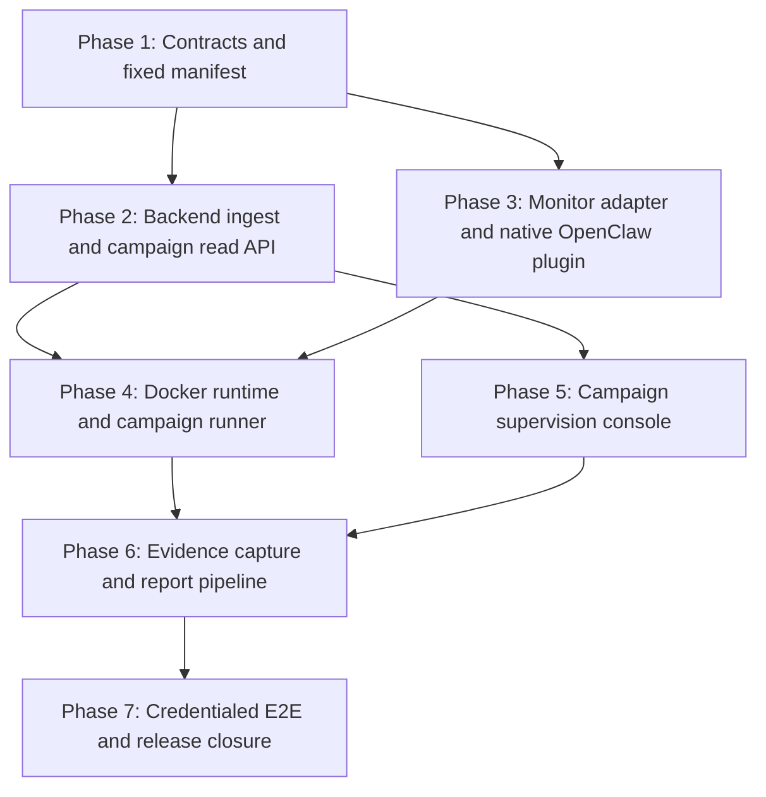

# REQ-T1-DEMO-010 Master Implementation Plan

> **For agentic workers:** REQUIRED SUB-SKILL: Use
> `superpowers:executing-plans` and `superpowers:test-driven-development`.
> Execute only the task explicitly assigned by the user, return its evidence,
> and do not continue automatically.

**Goal:** Deliver a real OpenClaw 2026.6.10 three-agent, nine-case security
campaign with fail-closed monitoring, campaign supervision UI, and a
reproducible Track 1 report evidence pack.

**Architecture:** A native OpenClaw plugin runs the existing sandbox monitor,
rule filter, and simulated tools in process. It sends only normalized snapshots
to a Docker-internal backend listener; public campaign read DTOs feed the
existing supervision console and deterministic report pipeline.

**Tech Stack:** Node.js 22.19+, TypeScript ESM, `node:test`, React 19,
Vitest 4, Testing Library, Ant Design 6, OpenClaw 2026.6.10, Docker Compose v2,
Playwright-based evidence capture, pinned Pandoc/LaTeX report container.

---

## Canonical Inputs

- Active requirement: `docs/sprint-current.md`
- Approved specification:
  `docs/superpowers/specs/2026-06-30-track1-openclaw-demo-design.md`
- Repository rules: `AGENTS.md`, `metadata.md`
- Scenario catalog:
  `samples/track1/scenarios/track1-scenarios.v1.json`
- Fixed cases: `samples/track1/cases/T1-SC-*/`
- Existing sandbox contracts: `shared/types/sandbox.ts`,
  `shared/contracts/sandbox.ts`
- Existing monitor: `engines/sandbox/src/monitoring/`
- Existing filter: `engines/sandbox/src/base-filter/`
- Existing simulated tools: `engines/sandbox/src/simulated-tools/`
- Existing supervision module: `backend/src/modules/supervision/`
- Existing console: `frontend/src/pages/SandboxAlertsPage.tsx`

## Global Worker Handoff Prompt

Give the low-level LLM this prefix together with exactly one task section:

```text
Execute only the assigned REQ-T1-DEMO-010 task in
E:\LQiu\Agent-security-platform\.worktrees\track1-requirements-spec.

Read AGENTS.md, metadata.md, docs/sprint-current.md,
docs/superpowers/specs/2026-06-30-track1-openclaw-demo-design.md,
docs/superpowers/plans/2026-06-30-track1-demo-010-master.md, the assigned phase
plan, and the assigned task before editing.

Follow Design -> Test -> Implement -> Document -> Stop and report.
Write the specified test first and run it. A valid RED must fail because the
required behavior is missing; import, syntax, dependency, Docker, credential,
or environment failures are not valid RED unless the task explicitly tests
that boundary. Implement only enough production code to make the assigned tests
green. Run every task gate listed in the plan.

Do not change a contract owned by an earlier phase. Do not modify or clean
unrelated dirty files. Stage only explicit task-owned paths, create exactly one
commit with the specified message, then stop. Never start the next task or
phase. Return the compressed report format from the end of the phase plan.
```

## Global TDD Rules

1. No production change before its listed RED is observed.
2. Tests that pass before implementation must be strengthened until they fail
   for the intended missing behavior.
3. A dependency-install failure, missing credential, unavailable Docker daemon,
   or malformed test fixture is not a behavioral RED.
4. Every content-boundary test injects a unique sentinel and asserts that the
   sentinel is absent from serialized output, logs, errors, screenshots, and
   report evidence outside the canonical fixture appendix.
5. Exact-key normalizers reject unknown fields. Tests must include at least one
   unknown-field case per new public or internal DTO.
6. Fail-closed paths must assert both the error/result and the absence of the
   simulated side effect.
7. Tests must not use case IDs or expected actions inside policy logic.
8. No test may skip based on a missing cloud credential except the root
   credentialed gate wrapper; explicitly invoking the credentialed gate without
   credentials must fail with a stable preflight code.
9. One task owns one commit. Never use `git add .`.
10. After every phase, stop for high-level LLM diff/report/risk review.

## Preflight Baseline

Before Phase 1 Task 1, record:

```powershell
git status --short
npm.cmd run test:shared
npm.cmd run test:repo
npm.cmd run test:engine:sandbox
npm.cmd run test:backend
npm.cmd run test:frontend
npm.cmd run build --prefix frontend
```

Expected baseline:

- shared, repository, sandbox, and frontend gates pass;
- backend may retain the already documented unrelated asset-scan expectation
  failure, but it must be reproduced on the parent commit before waiver;
- dirty REQ-008 files and untracked historical plan files remain untouched;
- no OpenClaw integration package or campaign contract exists yet.

## Phase DAG



## Phase Documents

| Phase | Tasks | Plan | Primary deliverable | Review gate |
| --- | ---: | --- | --- | --- |
| 1 | 5 | `2026-06-30-track1-demo-010-phase-1-contracts.md` | fixed manifest, IDs, read/ingest contracts | shared and repository gates |
| 2 | 8 | `2026-06-30-track1-demo-010-phase-2-backend.md` | authenticated ingest, repositories, campaign read API | backend and integration gates |
| 3 | 6 | `2026-06-30-track1-demo-010-phase-3-openclaw-plugin.md` | observation adapter, four tools, native hooks, runtime probe | sandbox and plugin gates |
| 4 | 8 | `2026-06-30-track1-demo-010-phase-4-runtime-orchestration.md` | oracle-free prompts, pinned Docker runtime, fixed runner, retry state machine | offline OpenClaw gate |
| 5 | 6 | `2026-06-30-track1-demo-010-phase-5-campaign-ui.md` | campaign mode in `/results/sandbox` | frontend, build, visual gates |
| 6 | 7 | `2026-06-30-track1-demo-010-phase-6-report-evidence.md` | screenshot, manifest, Markdown, deterministic PDF pipeline | evidence/report fixture gates |
| 7 | 6 | `2026-06-30-track1-demo-010-phase-7-credentialed-e2e.md` | real 9-case run, committed baseline pack, final docs | credentialed E2E and full repository gates |

Total: 46 individually assignable tasks. P7-T4 is an approved operational run
without a code commit; every other behavior task has an explicit RED and GREEN.

## Phase Ownership

### Phase 1

Owns:

- `samples/track1/openclaw/`
- `shared/types/campaign-*.ts`
- `shared/contracts/campaign-*.ts`
- `shared/tests/campaign-*.spec.ts`
- workspace registration and manifest repository gate

Must not modify:

- backend, frontend, sandbox engine production behavior

### Phase 2

Owns:

- backend campaign repository, ingest normalizer/service/listener
- campaign projector/service/controller
- public campaign read API and backend integration tests

Must not modify:

- OpenClaw plugin, sandbox policy behavior, frontend UI

### Phase 3

Owns:

- sandbox observation adapter
- `integrations/openclaw/` plugin package, tools, hooks, ingest client
- plugin and runtime-probe tests

Must not modify:

- backend contracts established by Phase 2
- campaign runner, Docker Compose, frontend

### Phase 4

Owns:

- `deploy/track1/`
- campaign CLI/preflight/retry orchestration
- root offline OpenClaw scripts and Docker repository gates

Must not modify:

- plugin policy semantics or backend contracts

### Phase 5

Owns:

- frontend campaign service, polling, components, route state, styling
- frontend campaign fixtures/tests

Must not modify:

- engine, plugin, ingest, or report generation

### Phase 6

Owns:

- screenshot capture
- evidence manifest and report builders
- report container and fixture-based deterministic tests

Must not create:

- a claimed real baseline pack; that requires Phase 7

### Phase 7

Owns:

- credentialed E2E harness
- real sanitized baseline artifacts
- final repository scans and documentation closure

Must not change:

- contracts or runtime behavior merely to make a nondeterministic real run pass

## Parallelism Rules

- Phase 2 and Phase 3 may start in parallel only after Phase 1 is accepted.
- Phase 5 may start after Phase 2 public campaign DTO/API acceptance, while
  Phase 4 continues.
- Phase 4 requires accepted Phase 2 ingest and Phase 3 plugin surfaces.
- Phase 6 requires Phase 4 runner artifact conventions and Phase 5 stable UI
  readiness markers.
- Phase 7 is strictly sequential and starts only after Phases 1-6 are accepted.
- Inside a phase, branching paths in that phase's task DAG are the explicit
  authorization for parallel work once every incoming dependency is accepted.
  A phase may impose a stricter sequential rule; the Phase 7 rule above
  overrides its branching task diagram.
- Before dispatching parallel tasks, their declared writable file sets must be
  disjoint. Any overlap requires an added dependency edge or exclusive file
  ownership in the phase plan.
- Parallel tasks use isolated worktrees or branches. Their commits are
  integrated, reviewed, and reported serially in listed task order; shared
  phase-exit registration and documentation changes are never merged
  concurrently.

## Phase Completion Contract

Each phase report must include:

1. commits in task order;
2. files changed per task;
3. exact RED command and intended failure;
4. exact GREEN command and pass count;
5. full phase gate results;
6. known unrelated failures with parent-baseline evidence;
7. content-boundary sentinel result;
8. deviations from the plan;
9. risks requiring high-level review;
10. phase status: `COMPLETE_PENDING_REVIEW`.

A downstream phase remains blocked until the user or high-level reviewer
approves every incoming dependency shown in the phase DAG. Numeric phase order
alone does not block the explicitly authorized Phase 2/Phase 3 or Phase 4/Phase
5 branches.

## Cross-Phase Definition of Done

Every task:

- has an intentional RED and a GREEN;
- changes at most five primary source/test files unless the task explicitly
  lists a mechanical registration file;
- preserves earlier contracts;
- adds no unapproved dependency or execution surface;
- uses explicit-path staging and one commit;
- leaves its focused gate green.

Every phase:

- passes focused tests and relevant regression gates;
- updates durable docs only when behavior is implemented;
- has no secret, raw-runtime-content, real-side-effect, or arbitrary-path leak;
- records exact test counts and commands;
- stops for review.

REQ-010:

- meets every success criterion in the approved specification;
- includes a real OpenClaw/cloud-model evidence pack only after the
  credentialed Phase 7 gate;
- stops after final reporting.

## Global Regression Gates

Run after every phase:

```powershell
npm.cmd run test:repo
npm.cmd run test:shared
npm.cmd run test:engine:sandbox
```

Add when the phase touches the subsystem:

```powershell
npm.cmd run test:backend
npm.cmd run test:frontend
npm.cmd run build --prefix frontend
npm.cmd run test:track1:openclaw
```

Run only in Phase 7 with approved credentials:

```powershell
npm.cmd run test:track1:openclaw:e2e
```

## Human Intervention Gates

Stop and request human intervention when:

- the pinned `openclaw@2026.6.10` package or documented typed hook surface is
  unavailable;
- Docker is unavailable after dependency/configuration tasks are complete;
- the cloud model endpoint or credentials are absent before Phase 7;
- a real runtime hook does not provide the correlation required by the spec;
- any case requires a real tool or external target;
- a contract change would invalidate an accepted earlier phase;
- an unrelated dirty change overlaps a task-owned file and cannot be preserved;
- a credentialed run differs from the oracle after the allowed retry.

Do not substitute a compatibility adapter, fake model, hidden retry, weakened
oracle, or manually edited evidence pack.

## Compressed Worker Report Template

```text
TASK: P<phase>-T<task> <title>
STATUS: COMPLETE_PENDING_REVIEW | BLOCKED
COMMIT: <sha> <message>

FILES:
- <path>: <change>

RED:
- command: <exact command>
- observed: <intended missing-behavior failure>

GREEN:
- command: <exact command>
- result: <pass count>

REGRESSION:
- <gate>: <result>

BOUNDARY:
- raw-content sentinel: absent
- secrets: absent
- real side effects: none

DEVIATIONS:
- none | <exact deviation>

RISKS:
- none | <exact risk>

NEXT:
- stop; do not start another task
```

## Plan Review Checklist

- [ ] Every specification section maps to one phase.
- [ ] Every phase has an independent testable deliverable.
- [ ] Every task has exact files, test code, RED command, GREEN command, and
      commit message.
- [ ] No task is larger than five primary files.
- [ ] Contracts are defined before producers and consumers.
- [ ] Cloud credentials are needed only in Phase 7.
- [ ] Real OpenClaw runtime inspection occurs before the credentialed run.
- [ ] Report fixtures cannot be mistaken for real baseline evidence.
- [ ] Every phase stops for review.
