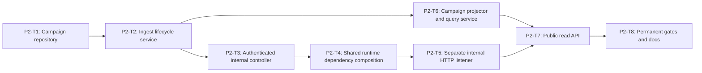

# Phase 2 Backend Campaign Ingest and Read API Implementation Plan

> **For agentic workers:** REQUIRED SUB-SKILL: Use
> `superpowers:executing-plans` and `superpowers:test-driven-development`.
> Execute only the task explicitly assigned by the user, return its evidence,
> and do not continue automatically.

**Goal:** Add an authenticated Docker-internal campaign ingest boundary and
strict read-only campaign supervision API without exposing execution commands
or changing existing session APIs.

**Architecture:** A separate in-memory campaign repository stores lifecycle,
associations, snapshot heads, and safe artifact references while the existing
task repository stores normalized sandbox records. A dedicated internal
listener on port 3001 handles ingest; the existing public listener exposes only
campaign reads on port 3000.

**Tech Stack:** Node.js 22.19+ HTTP server, TypeScript ESM, `node:test`,
existing `DomainError`, existing task repository and supervision projector,
Phase 1 shared campaign contracts.

---

## Phase Entry Gate

Phase 1 must be accepted. Run:

```powershell
npm.cmd run test:shared
npm.cmd run test:repo
git status --short
```

Expected: campaign read/ingest contracts and manifest gates are green.

## Task DAG



| Task | Deliverable | Commit |
| --- | --- | --- |
| P2-T1 | defensive in-memory campaign repository | `feat(backend): store Track 1 campaigns` |
| P2-T2 | start/snapshot/finalize/evidence state machine | `feat(backend): ingest campaign snapshots` |
| P2-T3 | token-authenticated internal controller | `feat(backend): add campaign ingest controller` |
| P2-T4 | one shared task/campaign repository composition root | `refactor(backend): share campaign runtime dependencies` |
| P2-T5 | physically separate internal listener and integration tests | `feat(backend): expose internal campaign listener` |
| P2-T6 | content-free campaign projection and query | `feat(backend): project campaign supervision views` |
| P2-T7 | three public GET routes and backward-compatible routing | `feat(api): expose campaign supervision reads` |
| P2-T8 | root/backend registrations, repository checks, and docs | `test(backend): gate campaign supervision APIs` |

## Shared Backend Test Fixture

Create in P2-T1:

```text
backend/tests/fixtures/track1-campaign.fixture.ts
```

It must export:

```ts
makeStoredCampaignRecord()
makeCampaignStartEnvelope()
makeCampaignSnapshot(sequence, previousHash)
makeCampaignFinalizeEnvelope()
makeCampaignEvidenceRegistration()
```

Factories must return fresh objects and use a real normalized sandbox result
from existing test fixtures. No `as unknown as` cast is allowed.

## P2-T1: Defensive Campaign Repository

**Files:**

- Create: `backend/src/modules/supervision/repositories/campaign.repository.ts`
- Create: `backend/src/modules/supervision/repositories/in-memory-campaign.repository.ts`
- Create: `backend/tests/campaign-repository.spec.ts`
- Create: `backend/tests/fixtures/track1-campaign.fixture.ts`

### Acceptance

- `save`, `findById`, and `list` use defensive copies.
- Campaign IDs are unique.
- List order is repository insertion-independent.
- Attempt and snapshot arrays cannot be mutated through returned values.

- [ ] **Step 1: Write repository RED**

```ts
import assert from "node:assert/strict";
import test from "node:test";

import { InMemoryCampaignRepository } from
  "../src/modules/supervision/repositories/in-memory-campaign.repository.ts";
import { makeStoredCampaignRecord } from
  "./fixtures/track1-campaign.fixture.ts";

test("REQ-T1-DEMO-010 campaign repository returns defensive copies", () => {
  const repository = new InMemoryCampaignRepository();
  const source = makeStoredCampaignRecord();
  repository.save(source);

  const first = repository.findById(source.campaign.campaign_id);
  assert.ok(first);
  first.attempts.length = 0;
  first.campaign.status = "failed";

  const second = repository.findById(source.campaign.campaign_id);
  assert.ok(second);
  assert.equal(second.campaign.status, "created");
  assert.equal(second.attempts.length, source.attempts.length);
});

test("REQ-T1-DEMO-010 campaign repository rejects duplicate creation", () => {
  const repository = new InMemoryCampaignRepository();
  const source = makeStoredCampaignRecord();
  repository.create(source);
  assert.throws(
    () => repository.create(source),
    /CAMPAIGN_ALREADY_EXISTS/
  );
});

test("REQ-T1-DEMO-010 campaign repository lists newest update first", () => {
  const repository = new InMemoryCampaignRepository();
  const older = makeStoredCampaignRecord({
    campaignId: "campaign:t1:00000000000000000000000000000001",
    updatedAt: "2026-06-30T00:00:01.000Z"
  });
  const newer = makeStoredCampaignRecord({
    campaignId: "campaign:t1:00000000000000000000000000000002",
    updatedAt: "2026-06-30T00:00:02.000Z"
  });
  repository.create(newer);
  repository.create(older);
  assert.deepEqual(
    repository.list().map((record) => record.campaign.campaign_id),
    [newer.campaign.campaign_id, older.campaign.campaign_id]
  );
});
```

- [ ] **Step 2: Verify RED**

```powershell
node --experimental-strip-types --test backend/tests/campaign-repository.spec.ts
```

Expected: FAIL because repository files do not exist.

- [ ] **Step 3: Implement repository contract**

```ts
export interface CampaignRepository {
  create(record: StoredCampaignRecord): StoredCampaignRecord;
  save(record: StoredCampaignRecord): StoredCampaignRecord;
  findById(campaignId: string): StoredCampaignRecord | null;
  list(): StoredCampaignRecord[];
}
```

Define `StoredCampaignRecord` in the same file with exact safe fields:

```ts
export interface StoredCampaignRecord {
  campaign: {
    start: Track1CampaignStartEnvelope;
    status: Track1CampaignStatus;
    updated_at: string;
    completed_at?: string;
  };
  snapshots: readonly Track1CampaignSnapshotEnvelope[];
  attempts: readonly StoredCampaignAttempt[];
  evidence: Track1CampaignEvidenceRegistration | null;
}
```

`StoredCampaignAttempt` contains only fixed association IDs, attempt/session
IDs, status, snapshot head, and normalized terminal result. It has no raw
content field and no caller-supplied aggregate counter.

Use one private `cloneStoredCampaignRecord` helper that copies every nested
array/object and freezes no caller-owned input. Do not serialize through JSON,
because that can silently coerce unsupported values.

- [ ] **Step 4: Verify GREEN**

Run the focused repository test. Expected: 3 tests pass.

- [ ] **Step 5: Commit**

```powershell
git add backend/src/modules/supervision/repositories backend/tests/campaign-repository.spec.ts backend/tests/fixtures/track1-campaign.fixture.ts
git commit -m "feat(backend): store Track 1 campaigns"
```

## P2-T2: Ingest Lifecycle Service

**Files:**

- Create: `backend/src/modules/supervision/campaign-ingest.service.ts`
- Create: `backend/tests/campaign-ingest.service.spec.ts`
- Modify: `backend/src/modules/supervision/repositories/campaign.repository.ts`
- Modify: `backend/tests/fixtures/track1-campaign.fixture.ts`

### Acceptance

- Start accepts only the fixed manifest hash and OpenClaw `2026.6.10`.
- Snapshot sequence is strictly increasing and hash chained within each
  `attempt_id`; duplicate delivery is byte-identically idempotent.
- Conflicting duplicate snapshots are rejected atomically.
- Finalize requires 3 agents, 9 final cases, exact derived actions, and valid
  session evidence.
- Evidence registration is append-only after completion.

- [ ] **Step 1: Write lifecycle RED**

```ts
test("REQ-T1-DEMO-010 starts only one fixed campaign", () => {
  const service = makeService();
  const started = service.startCampaign(makeCampaignStartEnvelope());
  assert.equal(started.status, "created");
  assert.throws(
    () => service.startCampaign(makeCampaignStartEnvelope()),
    /CAMPAIGN_ALREADY_EXISTS/
  );
});

test("REQ-T1-DEMO-010 accepts byte-identical snapshot retry only", () => {
  const service = makeStartedService();
  const first = makeCampaignSnapshot(1, null);
  const accepted = service.ingestSnapshot(first);
  const duplicate = service.ingestSnapshot(first);
  assert.deepEqual(duplicate, accepted);

  assert.throws(
    () => service.ingestSnapshot({
      ...first,
      observed_at: "2026-06-30T00:00:02.000Z"
    }),
    /CAMPAIGN_SNAPSHOT_CONFLICT/
  );
});

test("REQ-T1-DEMO-010 rejects gap and broken hash chain atomically", () => {
  const service = makeStartedService();
  const first = makeCampaignSnapshot(1, null);
  service.ingestSnapshot(first);
  const before = service.getStoredCampaign(first.campaign_id);

  assert.throws(
    () => service.ingestSnapshot(
      makeCampaignSnapshot(3, first.snapshot_sha256)
    ),
    /CAMPAIGN_SEQUENCE_INVALID/
  );
  assert.deepEqual(service.getStoredCampaign(first.campaign_id), before);
});

test("REQ-T1-DEMO-010 does not finalize fewer than nine cases", () => {
  const service = makeStartedService();
  ingestOneTerminalCase(service);
  assert.throws(
    () => service.finalizeCampaign(makeCampaignFinalizeEnvelope()),
    /CAMPAIGN_INCOMPLETE/
  );
});

test("REQ-T1-DEMO-010 registers evidence only after completion", () => {
  const service = makeStartedService();
  assert.throws(
    () => service.registerEvidence(makeCampaignEvidenceRegistration()),
    /CAMPAIGN_NOT_COMPLETED/
  );
});
```

The actual test file must also include:

- cross-agent case assignment rejection;
- attempt index 3 rejection through shared normalizer;
- terminal-attempt mutation rejection;
- derived action mismatch rejection;
- second-attempt preservation;
- evidence re-registration conflict;
- raw-content sentinel absence in stored records.

- [ ] **Step 2: Verify RED**

Run the focused service spec. Expected: FAIL because service does not exist.

- [ ] **Step 3: Implement lifecycle methods**

Required public surface:

```ts
export class CampaignIngestService {
  startCampaign(input: Track1CampaignStartEnvelope): Track1CampaignSummary;
  ingestSnapshot(input: Track1CampaignSnapshotEnvelope):
    Track1CampaignAttemptSummary;
  finalizeCampaign(input: Track1CampaignFinalizeEnvelope):
    Track1CampaignSummary;
  registerEvidence(input: Track1CampaignEvidenceRegistration):
    Track1CampaignSummary;
}
```

Implementation order:

1. normalize input;
2. load current record;
3. validate transition and associations;
4. derive a complete replacement record without mutating current state;
5. save once;
6. return a projected defensive copy.

Never save before every invariant has passed.

- [ ] **Step 4: Verify GREEN**

```powershell
node --experimental-strip-types --test backend/tests/campaign-ingest.service.spec.ts
npm.cmd run test:shared
```

- [ ] **Step 5: Commit**

```powershell
git add backend/src/modules/supervision/campaign-ingest.service.ts backend/src/modules/supervision/repositories/campaign.repository.ts backend/tests/campaign-ingest.service.spec.ts backend/tests/fixtures/track1-campaign.fixture.ts
git commit -m "feat(backend): ingest campaign snapshots"
```

## P2-T3: Authenticated Internal Controller

**Files:**

- Create: `backend/src/modules/supervision/campaign-ingest.controller.ts`
- Create: `backend/src/modules/supervision/campaign-ingest-auth.ts`
- Create: `backend/tests/campaign-ingest.controller.spec.ts`

### Acceptance

- Bearer token is required.
- Token comparison hashes both values then uses `timingSafeEqual`.
- Invalid/missing auth uses one fixed 401 body.
- Controller never echoes input or arbitrary errors.
- Body limits use UTF-8 bytes.

- [ ] **Step 1: Write auth/controller RED**

```ts
test("REQ-T1-DEMO-010 internal ingest requires a bearer token", () => {
  const controller = makeController("a".repeat(32));
  assert.throws(
    () => controller.startCampaign(undefined, makeCampaignStartEnvelope()),
    (error: unknown) =>
      error instanceof DomainError &&
      error.code === "CAMPAIGN_INGEST_UNAUTHORIZED" &&
      error.httpStatus === 401
  );
});

test("REQ-T1-DEMO-010 invalid token response never contains the token", () => {
  const sentinel = "INGEST_TOKEN_SENTINEL_1234567890";
  const controller = makeController("a".repeat(32));
  let message = "";
  try {
    controller.startCampaign(`Bearer ${sentinel}`, makeCampaignStartEnvelope());
  } catch (error) {
    message = JSON.stringify(error);
  }
  assert.ok(!message.includes(sentinel));
});

test("REQ-T1-DEMO-010 controller delegates normalized start and snapshot", () => {
  const { controller, serviceCalls } = makeRecordingController();
  controller.startCampaign(
    `Bearer ${"a".repeat(32)}`,
    makeCampaignStartEnvelope()
  );
  controller.ingestSnapshot(
    `Bearer ${"a".repeat(32)}`,
    makeCampaignSnapshot(1, null)
  );
  assert.deepEqual(serviceCalls, ["start", "snapshot"]);
});
```

- [ ] **Step 2: Verify RED**

Expected: controller/auth modules missing.

- [ ] **Step 3: Implement safe authentication**

```ts
export function authorizeCampaignIngest(
  authorization: string | undefined,
  expectedToken: string
): void {
  const supplied = authorization?.startsWith("Bearer ")
    ? authorization.slice("Bearer ".length)
    : "";
  const suppliedHash = createHash("sha256").update(supplied).digest();
  const expectedHash = createHash("sha256").update(expectedToken).digest();
  if (!timingSafeEqual(suppliedHash, expectedHash)) {
    throw new DomainError(
      "Campaign ingest authorization failed",
      "CAMPAIGN_INGEST_UNAUTHORIZED",
      401
    );
  }
}
```

Validate configured token length at controller construction. Never log either
token.

- [ ] **Step 4: Verify GREEN and commit**

```powershell
node --experimental-strip-types --test backend/tests/campaign-ingest.controller.spec.ts
git add backend/src/modules/supervision/campaign-ingest.controller.ts backend/src/modules/supervision/campaign-ingest-auth.ts backend/tests/campaign-ingest.controller.spec.ts
git commit -m "feat(backend): add campaign ingest controller"
```

## P2-T4: Shared Runtime Dependency Composition

**Files:**

- Create: `backend/src/runtime-dependencies.ts`
- Create: `backend/tests/runtime-dependencies.spec.ts`
- Modify: `backend/src/app.module.ts`
- Modify: `backend/src/modules/task-center/task-center.module.ts`
- Modify: `backend/src/modules/supervision/supervision.module.ts`

### Acceptance

- One composition root creates exactly one task repository and one campaign
  repository.
- TaskCenter receives only the task repository.
- Supervision receives both repositories.
- Two app modules given the same dependency object observe the same records.
- Default app creation still creates isolated repositories per app instance.
- Existing task/session behavior is unchanged.

- [ ] **Step 1: Write dependency-composition RED**

```ts
test("REQ-T1-DEMO-010 public and internal modules share one dependency object", () => {
  const dependencies = createRuntimeDependencies();
  const taskCenter = createTaskCenterModule({
    repository: dependencies.taskRepository
  });
  const publicSupervision = createSupervisionModule(dependencies);
  const internalSupervision = createSupervisionModule(dependencies);

  assert.equal(
    taskCenter.repository,
    dependencies.taskRepository
  );
  assert.equal(
    publicSupervision.campaignRepository,
    dependencies.campaignRepository
  );
  assert.equal(
    internalSupervision.campaignRepository,
    dependencies.campaignRepository
  );
});

test("REQ-T1-DEMO-010 default app instances do not share global repositories", () => {
  const first = createAppModule();
  const second = createAppModule();
  assert.notEqual(
    first.taskCenterModule.repository,
    second.taskCenterModule.repository
  );
  assert.notEqual(
    first.supervisionModule.campaignRepository,
    second.supervisionModule.campaignRepository
  );
});
```

- [ ] **Step 2: Prove RED**

```powershell
node --experimental-strip-types --test backend/tests/runtime-dependencies.spec.ts
```

Expected failure: runtime dependency composition does not exist.

- [ ] **Step 3: Implement shared composition**

`runtime-dependencies.ts` creates exactly one `InMemoryTaskRepository` and one
`InMemoryCampaignRepository`. `TaskCenterModule` accepts only the injected task
repository. `SupervisionModule` accepts both repositories and constructs the
campaign ingest/query services. `AppModule` and the minimal internal module
receive the same dependency object. Do not make TaskCenter own the campaign
repository.

- [ ] **Step 4: Prove GREEN and regressions**

```powershell
node --experimental-strip-types --test backend/tests/runtime-dependencies.spec.ts
npm.cmd run test:backend
```

- [ ] **Step 5: Commit P2-T4**

```powershell
git add backend/src/runtime-dependencies.ts backend/tests/runtime-dependencies.spec.ts backend/src/app.module.ts backend/src/modules/task-center/task-center.module.ts backend/src/modules/supervision/supervision.module.ts
git commit -m "refactor(backend): share campaign runtime dependencies"
```

## P2-T5: Separate Internal HTTP Listener

**Files:**

- Create: `backend/src/internal-app.module.ts`
- Create: `backend/src/common/http/limited-json-body.ts`
- Create: `backend/src/common/http/internal-router.ts`
- Create: `tests/integration/backend-campaign-ingest.api.spec.ts`
- Modify: `backend/src/main.ts`

### Acceptance

- Public router returns 404 for `/internal/track1/*`.
- Internal app exposes only four ingest routes plus health.
- Public and internal listeners share repositories/services in one process.
- Oversized, malformed, unauthorized, and wrong-content-type requests fail
  before service mutation.

- [ ] **Step 1: Write dual-listener integration RED**

```ts
test("REQ-T1-DEMO-010 public listener cannot reach internal ingest", async () => {
  const harness = await startDualServerHarness();
  const response = await fetch(
    `${harness.publicUrl}/internal/track1/campaigns`,
    { method: "POST", body: "{}" }
  );
  assert.equal(response.status, 404);
  await harness.close();
});

test("REQ-T1-DEMO-010 internal listener rejects unauthorized start", async () => {
  const harness = await startDualServerHarness();
  const response = await fetch(
    `${harness.internalUrl}/internal/track1/campaigns`,
    {
      method: "POST",
      headers: { "content-type": "application/json" },
      body: JSON.stringify(makeCampaignStartEnvelope())
    }
  );
  assert.equal(response.status, 401);
  assert.equal(harness.campaignRepository.list().length, 0);
  await harness.close();
});

test("REQ-T1-DEMO-010 internal listener accepts an authorized start", async () => {
  const harness = await startDualServerHarness();
  const response = await fetch(
    `${harness.internalUrl}/internal/track1/campaigns`,
    {
      method: "POST",
      headers: {
        authorization: `Bearer ${"a".repeat(32)}`,
        "content-type": "application/json"
      },
      body: JSON.stringify(makeCampaignStartEnvelope())
    }
  );
  assert.equal(response.status, 201);
  assert.equal(harness.campaignRepository.list().length, 1);
  await harness.close();
});
```

Add exact tests for 2 MiB snapshot plus one byte, 256 KiB lifecycle plus one
byte, malformed JSON, wrong content type, unknown internal route, and fixed
safe error bodies.

- [ ] **Step 2: Verify RED**

Expected: dual-server harness/internal app missing.

- [ ] **Step 3: Implement internal app and shared composition**

`main.ts` creates one runtime dependency object and passes it to both
`AppModule` and `InternalAppModule`. Do not create another repository inside
either HTTP app.

`internal-router.ts` recognizes only health plus the four exact internal
campaign routes. The public `router.ts` continues to return no match for every
`/internal/track1/*` path.

`limited-json-body.ts` counts incoming `Buffer.byteLength` and destroys parsing
with a stable 413 `CAMPAIGN_INGEST_BODY_TOO_LARGE` error before JSON parse.

- [ ] **Step 4: Verify GREEN**

```powershell
node --experimental-strip-types --test tests/integration/backend-campaign-ingest.api.spec.ts
npm.cmd run test:backend
```

- [ ] **Step 5: Commit**

```powershell
git add backend/src/internal-app.module.ts backend/src/common/http/limited-json-body.ts backend/src/common/http/internal-router.ts backend/src/main.ts tests/integration/backend-campaign-ingest.api.spec.ts
git commit -m "feat(backend): expose internal campaign listener"
```

## P2-T6: Campaign Projector and Query Service

**Files:**

- Create: `backend/src/modules/supervision/campaign-projector.ts`
- Create: `backend/src/modules/supervision/campaign-supervision.service.ts`
- Create: `backend/tests/campaign-projector.spec.ts`
- Create: `backend/tests/campaign-supervision.service.spec.ts`
- Create: `backend/src/modules/supervision/dto/campaign-query.ts`

### Acceptance

- Projection recomputes all metrics from attempts/results.
- Exactly three ordered agents and nine ordered cases.
- Search/filter/list cap contract is enforced.
- Detail reuses existing session IDs without copying session raw content.
- Evidence is unavailable until safe manifest registration.

- [ ] **Step 1: Write projector RED**

```ts
test("REQ-T1-DEMO-010 projector recomputes campaign counters", () => {
  const stored = makeCompletedStoredCampaign();
  const projected = projectTrack1Campaign(stored);
  assert.equal(projected.passed_case_count, 9);
  assert.equal(
    projected.blocked_count,
    stored.attempts.filter((attempt) =>
      attempt.result.details.blocked_records.length > 0
    ).length
  );
  assert.equal(
    projected.alert_count,
    stored.attempts.reduce(
      (total, attempt) => total + attempt.result.details.alerts.length,
      0
    )
  );
});

test("REQ-T1-DEMO-010 projector rejects a cross-agent case", () => {
  const stored = makeCompletedStoredCampaign();
  stored.attempts[0].agent_id = "agent:track1:memory-poison";
  assert.throws(
    () => projectTrack1Campaign(stored),
    /CAMPAIGN_PROJECTION_INVALID/
  );
});
```

- [ ] **Step 2: Write service RED**

```ts
test("REQ-T1-DEMO-010 campaign list filters then caps at fifty", () => {
  const service = makeServiceWithCampaigns(60);
  const result = service.listCampaigns({
    status: "completed",
    scenario_id: "T1-SC-001"
  });
  assert.ok(result.length <= 50);
  assert.ok(result.every((item) => item.status === "completed"));
});

test("REQ-T1-DEMO-010 evidence stays unavailable before registration", () => {
  const service = makeServiceWithCompletedCampaign({ evidence: false });
  assert.throws(
    () => service.getCampaignEvidence(FIXED_CAMPAIGN_ID),
    /CAMPAIGN_EVIDENCE_NOT_READY/
  );
});
```

- [ ] **Step 3: Verify RED**

Run both focused specs. Expected: projector/service modules missing.

- [ ] **Step 4: Implement field-by-field projection and query**

`campaign-query.ts` accepts only:

```ts
interface CampaignQuery {
  q?: string;
  status?: Track1CampaignStatus;
  scenario_id?: Track1ScenarioId;
  agent_id?: Track1CampaignAgentId;
}
```

Reject duplicate query keys, unknown keys, empty-but-present enum values, and
control characters. List sorting is `updated_at desc`, then `campaign_id asc`.

- [ ] **Step 5: Verify GREEN and commit**

```powershell
node --experimental-strip-types --test backend/tests/campaign-projector.spec.ts backend/tests/campaign-supervision.service.spec.ts
git add backend/src/modules/supervision/campaign-projector.ts backend/src/modules/supervision/campaign-supervision.service.ts backend/src/modules/supervision/dto/campaign-query.ts backend/tests/campaign-projector.spec.ts backend/tests/campaign-supervision.service.spec.ts
git commit -m "feat(backend): project campaign supervision views"
```

## P2-T7: Public Read API

**Files:**

- Create: `backend/src/modules/supervision/campaign-supervision.controller.ts`
- Modify: `backend/src/modules/supervision/supervision.module.ts`
- Modify: `backend/src/common/http/router.ts`
- Modify: `backend/src/app.module.ts`
- Modify: `tests/integration/backend-supervision.api.spec.ts`

### Acceptance

- Three public GET routes use standard `ApiResponse<T>`.
- Existing session routes remain byte-compatible.
- Internal routes remain absent from public router.
- Existing session API response bytes remain unchanged for fixed fixtures.

- [ ] **Step 1: Write public API RED**

```ts
test("REQ-T1-DEMO-010 exposes campaign list detail and evidence reads", async () => {
  const harness = await startBackendWithCompletedCampaignAndEvidence();
  const list = await fetchJson(`${harness.url}/api/supervision/campaigns`);
  const detail = await fetchJson(
    `${harness.url}/api/supervision/campaigns/${encodeURIComponent(FIXED_CAMPAIGN_ID)}`
  );
  const evidence = await fetchJson(
    `${harness.url}/api/supervision/campaigns/${encodeURIComponent(FIXED_CAMPAIGN_ID)}/evidence`
  );
  assert.equal(list.response.status, 200);
  assert.equal(detail.response.status, 200);
  assert.equal(evidence.response.status, 200);
  assert.ok(normalizeTrack1CampaignDetail(detail.body.data));
  assert.ok(normalizeTrack1CampaignEvidenceExport(evidence.body.data));
  await harness.close();
});

test("REQ-T1-DEMO-010 rejects unknown campaign query keys", async () => {
  const harness = await startBackendHarness();
  const response = await fetch(
    `${harness.url}/api/supervision/campaigns?raw_prompt=sentinel`
  );
  assert.equal(response.status, 400);
  await harness.close();
});
```

- [ ] **Step 2: Verify RED**

Run the integration spec. Expected: new routes return 404.

- [ ] **Step 3: Implement controller/module/routes**

Route precedence must place:

```text
/api/supervision/campaigns/:campaignId/evidence
/api/supervision/campaigns/:campaignId
/api/supervision/campaigns
```

without shadowing existing `/api/supervision/sessions` routes.

- [ ] **Step 4: Verify focused API and backward compatibility**

```powershell
node --experimental-strip-types --test tests/integration/backend-supervision.api.spec.ts
```

- [ ] **Step 5: Commit**

```powershell
git add backend/src/modules/supervision/campaign-supervision.controller.ts backend/src/modules/supervision/supervision.module.ts backend/src/common/http/router.ts backend/src/app.module.ts tests/integration/backend-supervision.api.spec.ts
git commit -m "feat(api): expose campaign supervision reads"
```

## P2-T8: Permanent Gates and Documentation

**Files:**

- Create: `tests/repository/track1-campaign-backend.spec.ts`
- Modify: `package.json`
- Modify: `docs/api-contract.md`
- Modify: `docs/architecture.md`
- Modify: `docs/progress.md`

### Acceptance

- Every Phase 2 unit/integration test is registered in `test:backend`.
- Repository gate proves public/internal listener separation, exact four
  internal write routes, and exact three public read routes.
- Repository gate rejects any campaign execution/retry/model/tool command in
  either controller.
- API docs contain body limits, auth, lifecycle, read DTOs, query order, and
  safe errors.
- Architecture docs assign repositories and listeners to the correct modules.
- Progress records actual counts and
  `PHASE_2_COMPLETE_PENDING_REVIEW`.

- [ ] **Step 1: Write repository registration RED**

```ts
test("REQ-T1-DEMO-010 backend campaign tests and listener boundaries are permanent", () => {
  const rootPackage = JSON.parse(readText("package.json"));
  for (const name of [
    "campaign-repository.spec",
    "campaign-ingest.service.spec",
    "campaign-ingest.controller.spec",
    "runtime-dependencies.spec",
    "campaign-projector.spec",
    "campaign-supervision.service.spec",
    "backend-campaign-ingest.api.spec",
    "backend-supervision.api.spec"
  ]) {
    assert.match(rootPackage.scripts["test:backend"], new RegExp(name));
  }

  const publicRouter = readText("backend/src/common/http/router.ts");
  const internalRouter = readText("backend/src/common/http/internal-router.ts");
  assert.equal(publicRouter.includes("/internal/track1"), false);
  assert.equal((internalRouter.match(/campaigns/g) ?? []).length > 0, true);
});
```

Add AST/text assertions that ingest controllers have no launch, retry,
OpenClaw, model, or tool invocation imports.

- [ ] **Step 2: Prove RED**

```powershell
node --experimental-strip-types --test tests/repository/track1-campaign-backend.spec.ts
```

- [ ] **Step 3: Register tests and update docs**

Append all new tests without removing existing scripts. Document actual
contracts only after focused tests are green.

- [ ] **Step 4: Run Phase 2 gate**

```powershell
npm.cmd run test:backend
npm.cmd run test:shared
npm.cmd run test:repo
npm.cmd run test:engine:sandbox
git diff --check
```

- [ ] **Step 5: Commit**

```powershell
git add tests/repository/track1-campaign-backend.spec.ts package.json docs/api-contract.md docs/architecture.md docs/progress.md
git commit -m "test(backend): gate campaign supervision APIs"
```

## Phase 2 Review Checklist

- [ ] Public listener returns 404 for every internal route.
- [ ] Internal listener cannot execute model/tool/campaign retry commands.
- [ ] Token and sentinels never appear in errors.
- [ ] Snapshot conflicts are atomic.
- [ ] Metrics are derived, not caller supplied.
- [ ] Existing session API tests remain green.
- [ ] Backend/full relevant gates pass.

## Phase 2 Worker Report Addendum

```text
PHASE: 2 Backend ingest and campaign read API
INTERNAL:
- listener separation: verified
- auth tests: <actual count>
- snapshot lifecycle tests: <actual count>
PUBLIC:
- list/detail/evidence: verified
- existing session routes: unchanged
ATOMICITY:
- malformed snapshot writes: 0
- conflicting duplicate writes: 0
STATUS: PHASE_2_COMPLETE_PENDING_REVIEW
```
