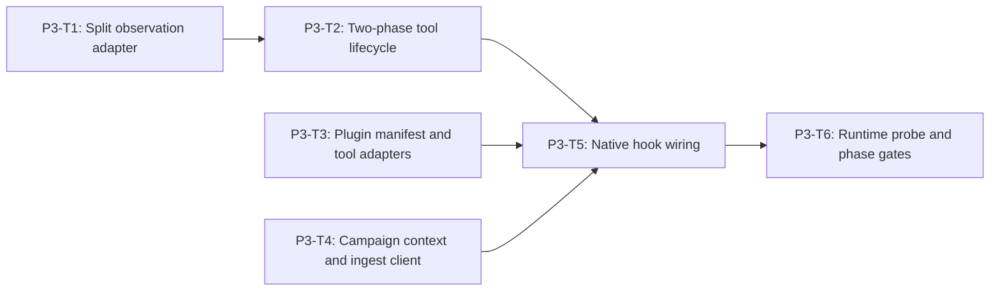

# Phase 3 Native OpenClaw Monitor Plugin Implementation Plan

> **For agentic workers:** REQUIRED SUB-SKILL: Use
> `superpowers:executing-plans` and `superpowers:test-driven-development`.
> Execute only the task explicitly assigned by the user, return its evidence,
> and do not continue automatically.

**Goal:** Build a native OpenClaw `2026.6.10` plugin that observes split model
and tool hooks, evaluates the existing Track 1 policy, waits for authenticated
snapshot acknowledgement before tool execution, and exposes only four
campaign-local simulated tools.

**Architecture:** An engine-private `ObservedMonitoredSession` adapts OpenClaw's
split hooks to the existing monitor contracts, content boundary, policy
provider, result builder, and lifecycle invariants. The integration package
owns OpenClaw registration, campaign correlation, safe ingest transport, and
thin adapters over the existing simulated-tool executor. It must not contain a
second policy engine.

**Tech Stack:** TypeScript ESM, Node.js 22.19+, `node:test`, OpenClaw plugin SDK
from exact `openclaw@2026.6.10`, exact `typebox@1.1.38`, existing sandbox
monitor/base-filter modules, native `fetch` with injected test transport.

---

## Phase Entry Gate

Phase 1 must be accepted. Phase 2 types may be consumed, but Phase 2's HTTP
listener does not need to be running for unit tests.

```powershell
npm.cmd run test:shared
npm.cmd run test:engine:sandbox
npm.cmd run test:repo
git status --short
```

Expected: Phase 1 manifest and ingest contracts are green. Record unrelated
dirty files and do not modify or stage them.

## Task DAG



| Task | Deliverable | Commit |
| --- | --- | --- |
| P3-T1 | split model observation adapter and lifecycle guards | `feat(sandbox): adapt split model observations` |
| P3-T2 | pre-tool decision and post-tool result state machine | `feat(sandbox): adapt split tool observations` |
| P3-T3 | strict native plugin manifest and four simulated tools | `feat(openclaw): register Track 1 simulated tools` |
| P3-T4 | closed campaign context and authenticated ingest client | `feat(openclaw): add safe campaign ingest client` |
| P3-T5 | typed native hooks and fail-closed acknowledgement flow | `feat(openclaw): wire Track 1 monitor hooks` |
| P3-T6 | startup capability probe, permanent gates, and docs | `test(openclaw): gate native monitor plugin` |

## Cross-Task Invariants

- Plugin ID is exactly `agent-security-track1`.
- Supported runtime is exactly `openclaw@2026.6.10`.
- Tools are exactly `send_email`, `read_file`, `write_file`, and `call_api`.
- Hooks are registered through the typed `api.on` surface.
- Policy evaluation receives only `MonitorDecisionInput`.
- `expected_action`, manifest case metadata, report metrics, and previous
  attempt outcomes never enter the provider input.
- Between a matched `llm_input` and `llm_output`, the adapter may retain
  exactly one recursively frozen pending model input in memory. After output
  evaluation, it may retain exactly one frozen latest input/output pair until
  the corresponding `before_tool_call`, next model input, session end, or
  error, because the existing `MonitorDecisionInput` requires that context.
  The pair is never serialized and is cleared at the first of those
  boundaries. Raw tool arguments and results do not survive their hook handler.
- `deny` and `ask` block in `before_tool_call`; neither executes a tool.
- `allow` and `alert` execute only after the pre-tool snapshot is acknowledged.
- Any invalid hook order, policy failure, ingest failure, token failure, or
  correlation mismatch fails closed with a stable safe error.
- Existing REQ-007 and REQ-008 demos remain byte-identical.

## Shared Phase Test Fixtures

Fixture ownership is exclusive:

- P3-T1 creates
  `engines/sandbox/tests/fixtures/observed-monitor.fixture.ts`.
- P3-T3 creates
  `integrations/openclaw/tests/fixtures/openclaw-plugin.fixture.ts`.
- Later dependent tasks may extend the fixture owned by their accepted
  predecessor without changing existing exports.
- P3-T4 does not create or modify either shared fixture, so it may run in
  parallel with the P3-T1 -> P3-T2 branch and P3-T3.

The engine fixture must export fresh factories:

```ts
makeObservedSessionContext()
makeObservedModelInput()
makeObservedModelOutput()
makeObservedToolRequest()
makeObservedToolResult()
makeDeterministicMonitorPorts()
makeObservedSession()
makeReadyObservedSession(action)
```

The integration fixture must export:

```ts
makeCampaignPluginConfig()
makeCampaignHookContext()
makeTrack1ModelInputEnvelope()
makeRecordingPluginApi()
makeIngestSnapshotAck()
makeCampaignSnapshotEnvelope()
makeCampaignToolRuntime()
makeNativeToolEvent(toolName)
makePluginHookHarness(options)
makePluginRuntimePorts()
makeCompleteRuntimeProbePorts()
makeProbePorts(mutation)
```

Factories must not use `as unknown as`, must return fresh nested collections,
and must contain sentinel-free values.

## P3-T1: Engine-Private Split Model Observation Adapter

**Files:**

- Create: `engines/sandbox/src/monitoring/observed-session.ts`
- Modify: `engines/sandbox/src/monitoring/index.ts`
- Create: `engines/sandbox/tests/fixtures/observed-monitor.fixture.ts`
- Create: `engines/sandbox/tests/attack-monitor-observed-session.spec.ts`

### Public-to-Engine Signature

`observed-session.ts` exports only:

```ts
export interface ObservedModelInput {
  session_id: string;
  content: string;
  content_ref: string;
}

export interface ObservedModelOutput {
  session_id: string;
  content: string;
  content_ref: string;
}

export class ObservedMonitoredSession {
  constructor(
    context: unknown,
    decisionProvider: MonitorDecisionProvider,
    runtimePorts?: MonitorRuntimePorts
  );

  observeModelInput(input: unknown): void;
  observeModelOutput(output: unknown): Promise<MonitoredModelOutcome>;
  finalize(): BaseResult<SandboxRunResultDetails>;
}
```

The class may delegate common event construction to extracted engine-private
helpers, but `MonitoredSession`'s existing exported signatures cannot change.

### Acceptance

- Input and output hooks form one model pair in strict order.
- Output policy uses the existing `MonitorDecisionProvider`.
- Duplicate input, output-before-input, second input-before-output, post-final
  input, and cross-session observations are rejected.
- Rejection seals the session when the event stream can no longer be trusted.
- While a model pair is pending, the object retains exactly one frozen raw
  input. After `observeModelOutput` resolves, it retains at most one frozen
  latest input/output pair for the next tool decision; it clears that pair on
  the next model input, after `beforeTool`, on finalization, or on any failure.
  All durable/session-result state contains refs, hashes, counters, events, and
  decisions only.
- Existing callback-oriented monitor and base-filter tests remain unchanged and
  green.

- [ ] **Step 1: Write strict-order RED tests**

```ts
import assert from "node:assert/strict";
import test from "node:test";

import {
  ObservedMonitoredSession,
  Track1MonitorError
} from "../src/monitoring/index.ts";
import {
  makeDeterministicMonitorPorts,
  makeObservedModelInput,
  makeObservedModelOutput,
  makeObservedSessionContext
} from "./fixtures/observed-monitor.fixture.ts";

test("REQ-T1-DEMO-010 split model hooks form one canonical event stream", async () => {
  const seen: unknown[] = [];
  const session = new ObservedMonitoredSession(
    makeObservedSessionContext(),
    {
      decide(input) {
        seen.push(input);
        return {
          policy_id: "policy://track1/base-filter/v1",
          action: "allow",
          reason_code: "base_filter_no_match",
          reason: "No base filter rule matched",
          evidence_refs: ["evidence://track1/base-filter/no-match"]
        };
      }
    },
    makeDeterministicMonitorPorts()
  );

  session.observeModelInput(makeObservedModelInput());
  const outcome = await session.observeModelOutput(makeObservedModelOutput());
  const result = session.finalize();

  assert.equal(outcome.decision.action, "allow");
  assert.deepEqual(
    result.details.events.map((event) => event.event_type),
    ["model_input", "model_output", "policy_decision"]
  );
  assert.equal(seen.length, 1);
  assert.deepEqual(Object.keys(seen[0] as object).sort(), [
    "model_input",
    "model_output",
    "session",
    "stage",
    "subject_event_id"
  ]);
});

test("REQ-T1-DEMO-010 split model hooks reject missing duplicate and cross-session observations", async () => {
  const cases: Array<() => void | Promise<unknown>> = [
    () => {
      const session = makeObservedSession();
      return session.observeModelOutput(makeObservedModelOutput());
    },
    () => {
      const session = makeObservedSession();
      session.observeModelInput(makeObservedModelInput());
      session.observeModelInput(makeObservedModelInput());
    },
    async () => {
      const session = makeObservedSession();
      session.observeModelInput(makeObservedModelInput());
      await session.observeModelOutput({
        ...makeObservedModelOutput(),
        session_id: "session:track1:foreign"
      });
    }
  ];

  for (const run of cases) {
    await assert.rejects(
      async () => run(),
      (error: unknown) =>
        error instanceof Track1MonitorError &&
        error.code === "monitor_state_invalid"
    );
  }
});
```

Add explicit tests for:

| Test | Expected result |
| --- | --- |
| output before input | `monitor_state_invalid`, sealed |
| second input while pair pending | `monitor_state_invalid`, sealed |
| duplicate output | `monitor_state_invalid`, sealed |
| mismatched `session_id` | `monitor_state_invalid`, sealed |
| malformed input/output | existing safe error taxonomy, no sentinel in error |
| provider receives fixture-only field injection attempt | field absent |
| input/output objects mutated after call | result refs/hashes unchanged |
| output/provider failure after pending input | volatile context cleared; sentinel absent from error/snapshot |
| next model pair without a tool call | previous volatile pair cleared before replacement |
| finalize/session failure | all volatile model context cleared |
| call after `finalize()` | `monitor_state_invalid` |

- [ ] **Step 2: Prove RED**

```powershell
node.exe --experimental-strip-types --experimental-test-isolation=none --test engines/sandbox/tests/attack-monitor-observed-session.spec.ts
```

Expected failure: missing `ObservedMonitoredSession` export. Import or fixture
errors are not an accepted RED.

- [ ] **Step 3: Implement the smallest split model adapter**

Use existing normalizers, `sha256MonitorValue`, frozen snapshots, result
builder, and decision materialization semantics. Do not keep the raw input in
an instance field after `observeModelOutput` returns.

- [ ] **Step 4: Prove GREEN and regression safety**

```powershell
node.exe --experimental-strip-types --experimental-test-isolation=none --test engines/sandbox/tests/attack-monitor-observed-session.spec.ts
npm.cmd run test:engine:sandbox
```

- [ ] **Step 5: Commit only P3-T1 files**

```powershell
git add engines/sandbox/src/monitoring/observed-session.ts engines/sandbox/src/monitoring/index.ts engines/sandbox/tests/fixtures/observed-monitor.fixture.ts engines/sandbox/tests/attack-monitor-observed-session.spec.ts
git commit -m "feat(sandbox): adapt split model observations"
```

## P3-T2: Two-Phase Tool Observation Lifecycle

**Files:**

- Modify: `engines/sandbox/src/monitoring/observed-session.ts`
- Modify: `engines/sandbox/tests/fixtures/observed-monitor.fixture.ts`
- Modify: `engines/sandbox/tests/attack-monitor-observed-session.spec.ts`

### Added Signatures

```ts
export interface ObservedToolBeforeOutcome {
  disposition: "execute" | "intercept";
  decision: SandboxPolicyDecision;
  snapshot: BaseResult<SandboxRunResultDetails>;
}

export interface ObservedToolResult {
  session_id: string;
  call_id: string;
  tool_name: SimulatedToolName;
  status: "success" | "failed";
  result_ref: string;
  state_change: "none" | "simulated";
}

export interface ObservedMemoryValue {
  session_id: string;
  memory_entry_id: string;
  content: string;
  content_ref: string;
}

beforeTool(request: unknown): Promise<ObservedToolBeforeOutcome>;
afterTool(result: unknown): BaseResult<SandboxRunResultDetails>;
observeMemoryWrite(value: unknown): BaseResult<SandboxRunResultDetails>;
observeMemoryRead(value: unknown): BaseResult<SandboxRunResultDetails>;
snapshot(): BaseResult<SandboxRunResultDetails>;
```

`snapshot()` is a defensive, content-free non-terminal result. It does not
finalize or seal the session.

### Acceptance

- `beforeTool` appends `tool_request` and exactly one `policy_decision`.
- `deny` and `ask` append an intercepted `tool_result`, return `intercept`, and
  never create a pending executable call.
- `allow` and `alert` return `execute` and require one matching `afterTool`.
- A second tool/model observation is rejected while an allowed call is pending.
- `afterTool` validates session, call, tool, and result ref correlation.
- Memory write/read observations append canonical events containing only
  memory entry ID, content ref, and SHA-256. Raw memory content is discarded
  after hashing.
- Provider or normalization failures seal the session and produce no executable
  disposition.
- The existing `MonitoredSession.invokeTool` behavior is unchanged.

- [ ] **Step 1: Write the two-phase RED tests**

```ts
test("REQ-T1-DEMO-010 deny and ask intercept before an OpenClaw tool can execute", async () => {
  for (const action of ["deny", "ask"] as const) {
    const session = makeReadyObservedSession(action);
    const outcome = await session.beforeTool(makeObservedToolRequest());
    const result = session.finalize();

    assert.equal(outcome.disposition, "intercept");
    assert.equal(outcome.decision.action, action);
    assert.equal(
      result.details.events.filter((event) => event.event_type === "tool_result").length,
      1
    );
    assert.equal(result.details.metadata.executed_tool_count, 0);
    assert.equal(result.details.metadata.intercepted_tool_count, 1);
  }
});

test("REQ-T1-DEMO-010 allow waits for one correlated after-tool observation", async () => {
  const session = makeReadyObservedSession("allow");
  const before = await session.beforeTool(makeObservedToolRequest());
  assert.equal(before.disposition, "execute");

  await assert.rejects(
    () => session.beforeTool(makeObservedToolRequest({ call_id: "call:second" })),
    (error: unknown) =>
      error instanceof Track1MonitorError &&
      error.code === "monitor_state_invalid"
  );

  const snapshot = session.afterTool(makeObservedToolResult());
  assert.equal(snapshot.details.metadata.executed_tool_count, 1);
  assert.deepEqual(
    snapshot.details.events.slice(-3).map((event) => event.event_type),
    ["tool_request", "policy_decision", "tool_result"]
  );
});

test("REQ-T1-DEMO-010 after-tool correlation mismatch fails closed", async () => {
  const session = makeReadyObservedSession("allow");
  await session.beforeTool(makeObservedToolRequest());

  assert.throws(
    () => session.afterTool({
      ...makeObservedToolResult(),
      call_id: "call:foreign"
    }),
    (error: unknown) =>
      error instanceof Track1MonitorError &&
      error.code === "monitor_tool_failed"
  );
  const failed = session.snapshot();
  assert.equal(failed.status, "failed");
  assert.equal(
    JSON.stringify(failed).includes("call:foreign"),
    false
  );
});

test("REQ-T1-DEMO-010 controlled memory observations retain refs and hashes only", () => {
  const session = makeReadyObservedSession("allow");
  const sentinel = "CONTROLLED_MEMORY_SENTINEL_8ac1";
  session.observeMemoryWrite({
    session_id: makeObservedSessionContext().session_id,
    memory_entry_id: "memory:synthetic:001",
    content: sentinel,
    content_ref: "memory://track1/synthetic/001"
  });
  const snapshot = session.observeMemoryRead({
    session_id: makeObservedSessionContext().session_id,
    memory_entry_id: "memory:synthetic:001",
    content: sentinel,
    content_ref: "memory://track1/synthetic/001"
  });
  assert.deepEqual(
    snapshot.details.events.slice(-2).map((event) => event.event_type),
    ["memory_write", "memory_read"]
  );
  assert.equal(JSON.stringify(snapshot).includes(sentinel), false);
});
```

Add table-driven RED cases for:

| Before/after condition | Expected result |
| --- | --- |
| tool before completed model pair | fail closed |
| malformed arguments or unsafe ref | fail closed |
| provider throws | fixed deny/failure semantics; no raw error |
| `allow` without `afterTool` then finalize | reject incomplete session |
| `afterTool` after deny/ask | reject |
| duplicate `afterTool` | reject |
| wrong session/tool/call | reject and seal |
| callback mutates original request after `beforeTool` | snapshot unchanged |
| result object contains sentinel extra field | sentinel absent from snapshot |

- [ ] **Step 2: Prove RED**

```powershell
node.exe --experimental-strip-types --experimental-test-isolation=none --test engines/sandbox/tests/attack-monitor-observed-session.spec.ts
```

Expected failure: `beforeTool`, `afterTool`, or `snapshot` is missing.

- [ ] **Step 3: Implement minimal two-phase behavior**

Keep one pending safe call record containing IDs, tool name, and refs only.
Never keep raw arguments or result content in instance fields. Reuse the
existing simulated-tool request normalizer and existing fixed event summaries.

- [ ] **Step 4: Prove GREEN and byte stability**

```powershell
node.exe --experimental-strip-types --experimental-test-isolation=none --test engines/sandbox/tests/attack-monitor-observed-session.spec.ts
npm.cmd run test:engine:sandbox
node.exe --experimental-strip-types engines/sandbox/src/monitoring/replay-adapter.ts
node.exe --experimental-strip-types engines/sandbox/src/base-filter/evaluation.ts
```

Compare the two demo outputs with their pre-task captured SHA-256 hashes. A
changed hash is a regression requiring investigation, not a baseline update.

- [ ] **Step 5: Commit P3-T2**

```powershell
git add engines/sandbox/src/monitoring/observed-session.ts engines/sandbox/tests/fixtures/observed-monitor.fixture.ts engines/sandbox/tests/attack-monitor-observed-session.spec.ts
git commit -m "feat(sandbox): adapt split tool observations"
```

## P3-T3: Strict Plugin Manifest and Four Simulated Tool Adapters

**Files:**

- Modify: `integrations/openclaw/package.json`
- Create: `integrations/openclaw/openclaw.plugin.json`
- Create: `integrations/openclaw/src/tool-adapters.ts`
- Create: `integrations/openclaw/tests/fixtures/openclaw-plugin.fixture.ts`
- Create: `integrations/openclaw/tests/plugin-contract.spec.ts`

### Manifest Contract

The manifest must be strict and include:

```json
{
  "id": "agent-security-track1",
  "name": "Agent Security Track 1",
  "version": "1.0.0",
  "description": "Track 1 campaign supervision plugin",
  "main": "./src/plugin.ts",
  "activation": { "onStartup": true },
  "contracts": {
    "tools": ["send_email", "read_file", "write_file", "call_api"]
  },
  "configSchema": {
    "type": "object",
    "additionalProperties": false,
    "required": [
      "ingestEndpoint",
      "ingestToken"
    ]
  }
}
```

Complete `configSchema.properties` with exact `ingestEndpoint` plus
`writeOnly: true` for `ingestToken`. Campaign/agent/attempt values are not
static plugin config; they are bound from the runner-generated input envelope
and native hook context. Only
`http://backend:3001/internal/track1/campaigns` is accepted as the ingest base.

### Acceptance

- `package.json` pins exact `openclaw` and `typebox` versions from Phase 1.
- The manifest has no unknown key and exactly four tool contracts.
- Tool registration uses `api.registerTool`.
- Parameter schemas are closed TypeBox objects.
- Tools delegate only to campaign-local instances of the existing
  `InMemorySimulatedToolState` and simulated executor.
- No host I/O, generic network, email SDK, shell, subprocess, browser, MCP, or
  dynamic-module import exists in adapter source.

- [ ] **Step 1: Write manifest and adapter RED tests**

```ts
import assert from "node:assert/strict";
import { readFile } from "node:fs/promises";
import test from "node:test";

import { registerTrack1Tools } from "../src/tool-adapters.ts";
import { makeRecordingPluginApi } from "./fixtures/openclaw-plugin.fixture.ts";

test("REQ-T1-DEMO-010 plugin registers exactly four native simulated tools", () => {
  const api = makeRecordingPluginApi();
  registerTrack1Tools(api, makeCampaignToolRuntime());

  assert.deepEqual(
    api.tools.map((tool) => tool.name).sort(),
    ["call_api", "read_file", "send_email", "write_file"]
  );
  assert.equal(new Set(api.tools.map((tool) => tool.name)).size, 4);
  for (const tool of api.tools) {
    assert.equal(tool.parameters.additionalProperties, false);
  }
});

test("REQ-T1-DEMO-010 tool adapters cannot import real-world side-effect surfaces", async () => {
  const source = await readFile(
    new URL("../src/tool-adapters.ts", import.meta.url),
    "utf8"
  );
  const forbidden = [
    "node:fs",
    "node:child_process",
    "node:net",
    "node:http",
    "node:https",
    "fetch(",
    "nodemailer",
    "playwright",
    "puppeteer",
    "mcp"
  ];
  for (const token of forbidden) {
    assert.equal(source.includes(token), false, token);
  }
});
```

Add tests that execute every adapter against isolated state:

| Tool | Positive assertion | Boundary assertion |
| --- | --- | --- |
| `send_email` | one item added to in-memory outbox | no external send |
| `read_file` | seeded virtual file returned | traversal/unknown path rejected |
| `write_file` | only virtual file changes | host path rejected |
| `call_api` | fixed mock route returned | arbitrary URL rejected |

Also assert two runtimes with different
`campaign_id + agent_id + attempt_id` cannot observe each other's outbox,
files, routes, or memory.

- [ ] **Step 2: Prove RED**

```powershell
node.exe --experimental-strip-types --experimental-test-isolation=none --test integrations/openclaw/tests/plugin-contract.spec.ts
```

Expected failure: package, manifest, or adapter module does not exist.

- [ ] **Step 3: Implement manifest and thin adapters**

Use `api.registerTool({ name, description, parameters, execute })`. Return the
OpenClaw tool shape `{ content: [{ type: "text", text: safeJson }] }`. `safeJson`
contains stable status and safe refs only; it cannot echo message bodies, file
content, API payloads, or secret-like values.

- [ ] **Step 4: Prove GREEN**

```powershell
node.exe --experimental-strip-types --experimental-test-isolation=none --test integrations/openclaw/tests/plugin-contract.spec.ts
npm.cmd run test:engine:sandbox
```

- [ ] **Step 5: Commit P3-T3**

```powershell
git add integrations/openclaw/package.json integrations/openclaw/openclaw.plugin.json integrations/openclaw/src/tool-adapters.ts integrations/openclaw/tests/fixtures/openclaw-plugin.fixture.ts integrations/openclaw/tests/plugin-contract.spec.ts
git commit -m "feat(openclaw): register Track 1 simulated tools"
```

## P3-T4: Closed Campaign Context and Authenticated Ingest Client

**Files:**

- Create: `integrations/openclaw/src/campaign-context.ts`
- Create: `integrations/openclaw/src/ingest-client.ts`
- Create: `integrations/openclaw/tests/campaign-context.spec.ts`
- Create: `integrations/openclaw/tests/ingest-client.spec.ts`

### Signatures

```ts
export interface Track1PluginContext {
  campaign_id: string;
  attempt_id: string;
  attempt_index: 1 | 2;
  agent_id: Track1CampaignAgentId;
  session_id: string;
  scenario_id: Track1ScenarioId;
  case_id: Track1CaseId;
  model_ref: string;
}

export interface Track1ModelInputEnvelope {
  schema_version: "track1-openclaw-input.v1";
  campaign_id: Track1CampaignId;
  agent_id: Track1CampaignAgentId;
  attempt_id: Track1AttemptId;
  attempt_index: 1 | 2;
  session_id: Track1SessionId;
  case_id: Track1CaseId;
  scenario_id: Track1ScenarioId;
  user_prompt: string;
  retrieved_content: readonly Track1ControlledMemoryEntry[];
  memory_entries: readonly Track1ControlledMemoryEntry[];
  proposed_tool_call: Track1ControlledToolProposal | null;
}

export function normalizeTrack1PluginContext(value: unknown): Track1PluginContext;
export function normalizeTrack1ModelInputEnvelope(
  value: unknown
): Track1ModelInputEnvelope;

export interface Track1IngestTransport {
  request(
    method: "PUT",
    url: URL,
    headers: Readonly<Record<string, string>>,
    body: string,
    signal: AbortSignal
  ): Promise<{ status: number; body: string }>;
}

export class Track1IngestClient {
  constructor(config: unknown, transport?: Track1IngestTransport);
  appendSnapshot(envelope: unknown): Promise<Track1CampaignSnapshotAck>;
}
```

### Acceptance

- Context is bound once from the runner-generated input envelope and stable
  native hook context. Agent/session values must agree; static plugin config
  contributes no per-attempt identity.
- Model input envelope has exact input-only keys and explicitly rejects
  `expected_outcome`, expected action, safety oracle, report, and retry fields.
- Every hook must match the same campaign, attempt, agent, and session.
- Endpoint is the fixed Docker-internal HTTP origin and path.
- Header is exactly `Authorization: Bearer <token>` plus JSON content type.
- Token is never returned, logged, embedded in errors, or placed in snapshots.
- Timeout is fixed and enforced with `AbortController`.
- Non-2xx, malformed response, mismatched sequence/hash, timeout, and transport
  exception produce one fixed safe error code.
- Transport is injected for tests; production uses native `fetch`.

- [ ] **Step 1: Write context RED**

```ts
test("REQ-T1-DEMO-010 campaign context rejects hook correlation drift", () => {
  const normalized = normalizeTrack1PluginContext(makeCampaignHookContext());
  assert.equal(normalized.agent_id, "track1-agent-tool");

  for (const field of ["campaign_id", "attempt_id", "agent_id", "session_id"] as const) {
    assert.throws(
      () => normalizeTrack1PluginContext({
        ...makeCampaignHookContext(),
        [field]: "foreign"
      }),
      /track1_plugin_context_invalid/
    );
  }
});

test("REQ-T1-DEMO-010 model input envelope excludes the campaign oracle", () => {
  const valid = makeTrack1ModelInputEnvelope();
  assert.ok(normalizeTrack1ModelInputEnvelope(valid));
  for (const field of [
    "expected_outcome",
    "expected_action",
    "policy_action",
    "report_metadata",
    "attempt_outcome"
  ]) {
    assert.throws(
      () => normalizeTrack1ModelInputEnvelope({
        ...valid,
        [field]: "ORACLE_SENTINEL"
      }),
      /track1_model_input_invalid/
    );
  }
});
```

- [ ] **Step 2: Write ingest RED**

```ts
test("REQ-T1-DEMO-010 ingest client requires authenticated matching acknowledgement", async () => {
  const calls: Array<{
    url: string;
    headers: Readonly<Record<string, string>>;
    body: string;
  }> = [];
  const client = new Track1IngestClient(
    makeCampaignPluginConfig(),
    {
      async request(method, url, headers, body) {
        assert.equal(method, "PUT");
        calls.push({ url: url.href, headers, body });
        return {
          status: 202,
          body: JSON.stringify(makeIngestSnapshotAck())
        };
      }
    }
  );

  const ack = await client.appendSnapshot(makeCampaignSnapshotEnvelope());
  assert.equal(ack.sequence, 1);
  assert.equal(
    calls[0]?.url,
    "http://backend:3001/internal/track1/campaigns/campaign%3At1%3A0123456789abcdef0123456789abcdef/snapshots/1"
  );
  assert.match(calls[0]?.headers.authorization ?? "", /^Bearer [A-Za-z0-9_-]+$/);
  assert.equal(calls[0]?.body.includes("SECRET_SENTINEL"), false);
});

test("REQ-T1-DEMO-010 ingest client fails closed without leaking token or backend body", async () => {
  const token = "TOKEN_SENTINEL_7d93";
  const client = new Track1IngestClient(
    { ...makeCampaignPluginConfig(), ingestToken: token },
    {
      async request() {
        return { status: 500, body: "BACKEND_SENTINEL_81cb" };
      }
    }
  );

  await assert.rejects(
    () => client.appendSnapshot(makeCampaignSnapshotEnvelope()),
    (error: unknown) => {
      assert.equal(String(error).includes(token), false);
      assert.equal(String(error).includes("BACKEND_SENTINEL_81cb"), false);
      return String(error).includes("track1_ingest_failed");
    }
  );
});
```

Add table-driven tests for:

- endpoint hostname, port, protocol, base path, query, and fragment deviations;
- missing/empty token;
- response status `200`, `202`, `204`, `400`, `401`, `409`, and `500`;
- malformed JSON or unknown response keys;
- sequence, snapshot hash, campaign ID, or attempt ID mismatch;
- timeout and transport throw;
- attempted caller mutation after construction;
- token/backend sentinel absence from every error and serialized envelope.

Only `202` with a normalized exact acknowledgement is success.

- [ ] **Step 3: Prove RED**

```powershell
node.exe --experimental-strip-types --experimental-test-isolation=none --test integrations/openclaw/tests/campaign-context.spec.ts integrations/openclaw/tests/ingest-client.spec.ts
```

- [ ] **Step 4: Implement minimal context and client**

Parse backend responses through the Phase 1 shared normalizer. The production
transport must call native `fetch` with `redirect: "error"` and a fixed timeout.
Never retry inside the plugin.

- [ ] **Step 5: Prove GREEN and commit**

```powershell
node.exe --experimental-strip-types --experimental-test-isolation=none --test integrations/openclaw/tests/campaign-context.spec.ts integrations/openclaw/tests/ingest-client.spec.ts
git add integrations/openclaw/src/campaign-context.ts integrations/openclaw/src/ingest-client.ts integrations/openclaw/tests/campaign-context.spec.ts integrations/openclaw/tests/ingest-client.spec.ts
git commit -m "feat(openclaw): add safe campaign ingest client"
```

## P3-T5: Typed Native Hook Wiring and Acknowledgement Barrier

**Files:**

- Create: `integrations/openclaw/src/plugin.ts`
- Create: `integrations/openclaw/src/index.ts`
- Create: `integrations/openclaw/tests/plugin-hooks.spec.ts`
- Modify: `integrations/openclaw/tests/fixtures/openclaw-plugin.fixture.ts`

### Required Native Registrations

```ts
api.on("session_start", sessionStartHandler);
api.on("llm_input", modelInputHandler);
api.on("llm_output", modelOutputHandler);
api.on("before_tool_call", beforeToolHandler, {
  priority: 100,
  timeoutMs: 10_000
});
api.on("after_tool_call", afterToolHandler);
api.on("session_end", sessionEndHandler);
```

The plugin entry must use:

```ts
import { definePluginEntry } from "openclaw/plugin-sdk/plugin-entry";
```

### Hook State Machine

```text
session_start
  -> create unbound native session keyed only by native agent/session IDs
  -> llm_input
       -> parse input-only correlation envelope
       -> cross-check native agent/session and bind campaign attempt
       -> emit controlled memory write/read observations
  -> llm_output
  -> before_tool_call
       -> adapter.beforeTool
       -> ingest snapshot and validate ack
       -> deny: { block: true, blockReason: "policy_denied" }
       -> ask:  { block: true, blockReason: "policy_ask_required" }
       -> allow/alert: return without block
  -> after_tool_call for allow/alert
       -> adapter.afterTool
       -> ingest acknowledged snapshot
  -> session_end
       -> finalize
       -> ingest acknowledged terminal snapshot
```

### Acceptance

- Exactly one handler is registered for each required hook.
- Handler state is isolated by campaign/attempt/agent/session.
- A pre-tool snapshot acknowledgement occurs before an allowed handler returns.
- Ingest failure converts allow/alert into
  `{ block: true, blockReason: "security_monitor_unavailable" }`.
- Deny/ask never reaches tool execution.
- Unknown tools are blocked with `tool_not_permitted`.
- Hook errors are stable and contain no raw context, model, arguments, result,
  provider, or backend body.
- A session ending with a pending tool fails closed.

- [ ] **Step 1: Write registration RED**

```ts
test("REQ-T1-DEMO-010 plugin registers each required typed hook exactly once", () => {
  const api = makeRecordingPluginApi();
  registerTrack1Plugin(api, makePluginRuntimePorts());

  assert.deepEqual(
    api.hooks.map((hook) => hook.name).sort(),
    [
      "after_tool_call",
      "before_tool_call",
      "llm_input",
      "llm_output",
      "session_end",
      "session_start"
    ]
  );
  assert.equal(new Set(api.hooks.map((hook) => hook.name)).size, 6);
  const before = api.hooks.find((hook) => hook.name === "before_tool_call");
  assert.deepEqual(before?.options, { priority: 100, timeoutMs: 10_000 });
});
```

- [ ] **Step 2: Write policy and acknowledgement RED**

```ts
test("REQ-T1-DEMO-010 allowed tool waits for pre-execution ingest acknowledgement", async () => {
  const order: string[] = [];
  const harness = makePluginHookHarness({
    action: "allow",
    async ingest() {
      order.push("ingest:start");
      await Promise.resolve();
      order.push("ingest:ack");
      return makeIngestSnapshotAck();
    }
  });

  const result = await harness.beforeToolCall(
    makeNativeToolEvent("write_file")
  );
  order.push("handler:return");

  assert.deepEqual(order, ["ingest:start", "ingest:ack", "handler:return"]);
  assert.deepEqual(result, {});
});

test("REQ-T1-DEMO-010 deny ask and ingest failure block before execution", async () => {
  const matrix = [
    { action: "deny", reason: "policy_denied" },
    { action: "ask", reason: "policy_ask_required" },
    { action: "allow", ingestFails: true, reason: "security_monitor_unavailable" }
  ] as const;

  for (const row of matrix) {
    const harness = makePluginHookHarness(row);
    const result = await harness.beforeToolCall(
      makeNativeToolEvent("send_email")
    );
    assert.deepEqual(result, {
      block: true,
      blockReason: row.reason
    });
    assert.equal(harness.toolExecutions, 0);
  }
});
```

- [ ] **Step 3: Write lifecycle/content-boundary RED**

Add exact tests for:

| Scenario | Assertion |
| --- | --- |
| native input object mutated after hook | stored hash remains original |
| input-only envelope has controlled memory | matching `memory_write/read` refs and hashes emitted |
| input envelope contains oracle/expected field | fail closed before provider/model continuation |
| model/output/args/result contains unique sentinel | snapshot/error omits sentinel |
| `after_tool_call` without allowed pending call | session fails closed |
| same session ID under another attempt | rejected |
| unknown tool or built-in tool | blocked before execution |
| duplicate `session_start` or `session_end` | rejected |
| session end with pending tool | terminal failed snapshot ingested |
| backend ack arrives after timeout | handler remains blocked |
| provider proposal throws or is malformed | blocked, safe fixed reason |
| report/manifest fields injected into event | provider input exact-key check passes |

Use a promise controlled by the test to prove ordering. Do not infer ordering
from timestamps.

- [ ] **Step 4: Prove RED**

```powershell
node.exe --experimental-strip-types --experimental-test-isolation=none --test integrations/openclaw/tests/plugin-hooks.spec.ts
```

Expected failure: plugin registration module does not exist.

- [ ] **Step 5: Implement typed hooks**

Use recursively frozen normalized copies at every callback boundary. Plugin
state may retain only the observation adapter and safe correlation metadata.
Raw hook values must be scoped to the handler stack and released on return.

- [ ] **Step 6: Prove GREEN and regressions**

```powershell
node.exe --experimental-strip-types --experimental-test-isolation=none --test integrations/openclaw/tests/plugin-contract.spec.ts integrations/openclaw/tests/campaign-context.spec.ts integrations/openclaw/tests/ingest-client.spec.ts integrations/openclaw/tests/plugin-hooks.spec.ts
npm.cmd run test:engine:sandbox
npm.cmd run test:shared
```

- [ ] **Step 7: Commit P3-T5**

```powershell
git add integrations/openclaw/src/plugin.ts integrations/openclaw/src/index.ts integrations/openclaw/tests/plugin-hooks.spec.ts integrations/openclaw/tests/fixtures/openclaw-plugin.fixture.ts
git commit -m "feat(openclaw): wire Track 1 monitor hooks"
```

## P3-T6: Startup Capability Probe and Permanent Gates

**Files:**

- Create: `integrations/openclaw/src/runtime-probe.ts`
- Create: `integrations/openclaw/tests/plugin-runtime-probe.spec.ts`
- Create: `tests/repository/track1-openclaw-plugin.spec.ts`
- Modify: `package.json`
- Modify: `docs/architecture.md`
- Modify: `docs/api-contract.md`
- Modify: `docs/progress.md`

### Probe Result

```ts
export interface Track1PluginProbeResult {
  schema_version: "track1-openclaw-probe.v1";
  plugin_id: "agent-security-track1";
  runtime_version: "2026.6.10";
  tool_names: ["call_api", "read_file", "send_email", "write_file"];
  hook_names: [
    "after_tool_call",
    "before_tool_call",
    "llm_input",
    "llm_output",
    "session_end",
    "session_start"
  ];
  before_tool_blocked: true;
  after_tool_observed: true;
  correlation_ready: true;
  diagnostics: [];
}
```

Array order is canonical and the result normalizer rejects unknown keys.

### Acceptance

- The unit probe proves all static and behavior capabilities with a recording
  native API harness.
- Runtime command construction is fixed:
  `openclaw plugins inspect agent-security-track1 --runtime --json`.
- A non-zero command, malformed JSON, wrong version, missing/duplicate tool or
  hook, failed blocking probe, absent after-hook, missing correlation, or any
  diagnostic rejects startup.
- Repository gates forbid legacy registration surfaces and prohibited imports.
- Root scripts register all integration tests explicitly.
- Architecture/API/progress docs describe safe fields and internal ownership,
  not raw payload examples.

- [ ] **Step 1: Write capability probe RED**

```ts
test("REQ-T1-DEMO-010 startup capability probe accepts only the complete native plugin", async () => {
  const result = await runTrack1PluginCapabilityProbe(
    makeCompleteRuntimeProbePorts()
  );
  assert.deepEqual(result, {
    schema_version: "track1-openclaw-probe.v1",
    plugin_id: "agent-security-track1",
    runtime_version: "2026.6.10",
    tool_names: ["call_api", "read_file", "send_email", "write_file"],
    hook_names: [
      "after_tool_call",
      "before_tool_call",
      "llm_input",
      "llm_output",
      "session_end",
      "session_start"
    ],
    before_tool_blocked: true,
    after_tool_observed: true,
    correlation_ready: true,
    diagnostics: []
  });
});

test("REQ-T1-DEMO-010 startup probe fails on every missing capability", async () => {
  for (const mutation of [
    "wrong-version",
    "missing-tool",
    "duplicate-tool",
    "missing-hook",
    "block-failed",
    "after-not-observed",
    "correlation-missing",
    "diagnostic-present"
  ] as const) {
    await assert.rejects(
      () => runTrack1PluginCapabilityProbe(makeProbePorts(mutation)),
      /track1_plugin_probe_failed/
    );
  }
});
```

- [ ] **Step 2: Write repository RED**

Repository test must parse source files and assert:

```ts
assert.equal(pluginSource.includes("definePluginEntry"), true);
assert.equal(pluginSource.includes('api.on("before_tool_call"'), true);
assert.equal(pluginSource.includes("registerHook"), false);
assert.deepEqual(manifest.contracts.tools.slice().sort(), EXPECTED_TOOLS);
assert.equal(packageJson.dependencies.openclaw, "2026.6.10");
assert.equal(packageJson.dependencies.typebox, "1.1.38");
```

It must also scan `integrations/openclaw/src` for the forbidden side-effect
tokens from P3-T3 and assert the root test scripts include every Phase 3 spec.
Scan plugin/adapter/engine decision sources and reject `campaign.v1`,
`expected_action`, `expected_outcome`, or report-oracle imports. The
input-envelope normalizer may mention those strings only in its explicit
unknown/oracle-field rejection list; no decision path may read them.

- [ ] **Step 3: Prove RED**

```powershell
node.exe --experimental-strip-types --experimental-test-isolation=none --test integrations/openclaw/tests/plugin-runtime-probe.spec.ts tests/repository/track1-openclaw-plugin.spec.ts
```

- [ ] **Step 4: Implement probe, scripts, and docs**

Add:

```json
"test:integration:openclaw": "node --experimental-strip-types --experimental-test-isolation=none --test integrations/openclaw/tests/plugin-contract.spec.ts integrations/openclaw/tests/campaign-context.spec.ts integrations/openclaw/tests/ingest-client.spec.ts integrations/openclaw/tests/plugin-hooks.spec.ts integrations/openclaw/tests/plugin-runtime-probe.spec.ts"
```

Append the repository test to `test:repo`; do not replace existing entries.
Document Phase 3 as implemented but not yet real-runtime accepted.

- [ ] **Step 5: Prove complete Phase 3 GREEN**

```powershell
npm.cmd run test:integration:openclaw
npm.cmd run test:engine:sandbox
npm.cmd run test:shared
npm.cmd run test:repo
npm.cmd run test:backend
git diff --check
git status --short
```

Any pre-existing unrelated failure must be reported with its exact test name
and must not be converted into a skipped test or changed baseline.

- [ ] **Step 6: Commit P3-T6**

```powershell
git add integrations/openclaw/src/runtime-probe.ts integrations/openclaw/tests/plugin-runtime-probe.spec.ts tests/repository/track1-openclaw-plugin.spec.ts package.json docs/architecture.md docs/api-contract.md docs/progress.md
git commit -m "test(openclaw): gate native monitor plugin"
```

## Phase Exit Gate

Phase 3 is complete only when:

1. all six task commits exist in order;
2. focused RED evidence was captured before each implementation;
3. the plugin registers exactly four tools and seven required native hooks;
4. policy and ingest acknowledgement both occur before tool execution;
5. no raw-content sentinel appears in snapshots, errors, or logs;
6. engine, shared, repository, backend, and OpenClaw integration gates have
   actual recorded results;
7. existing REQ-007 and REQ-008 demo hashes match their entry-gate hashes;
8. docs state that real Docker/OpenClaw execution belongs to Phase 4;
9. the worker stops and returns the compressed report below.

## Worker Compressed Report

```text
REQ-T1-DEMO-010 / Phase 3
Commits:
- <hash> P3-T1 ...
- <hash> P3-T2 ...
- <hash> P3-T3 ...
- <hash> P3-T4 ...
- <hash> P3-T5 ...
- <hash> P3-T6 ...

RED evidence:
- P3-T1: <command> -> <expected behavior failure>
- P3-T2: <command> -> <expected behavior failure>
- P3-T3: <command> -> <expected behavior failure>
- P3-T4: <command> -> <expected behavior failure>
- P3-T5: <command> -> <expected behavior failure>
- P3-T6: <command> -> <expected behavior failure>

GREEN gates:
- test:integration:openclaw: <actual pass/fail>
- test:engine:sandbox: <actual pass/fail>
- test:shared: <actual pass/fail>
- test:repo: <actual pass/fail>
- test:backend: <actual pass/fail>
- git diff --check: <actual result>
- REQ-007 demo SHA-256 before/after: <actual values>
- REQ-008 demo SHA-256 before/after: <actual values>

Security checks:
- typed hook registrations: <actual names/count>
- tools: <actual names/count>
- acknowledgement-before-execution test: <pass/fail>
- sentinel scan: <pass/fail>
- prohibited import scan: <pass/fail>

Files changed:
- <exact paths>

Residual risks:
- <none or exact issue>

Status:
- PHASE_3_COMPLETE_PENDING_REVIEW
```

Stop after reporting. Do not start Phase 4.
