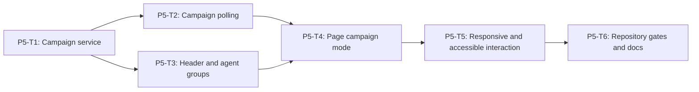

# Phase 5 Campaign Supervision UI Implementation Plan

> **For agentic workers:** REQUIRED SUB-SKILL: Use
> `superpowers:executing-plans`, `superpowers:test-driven-development`, and
> `react-best-practices`. Execute only the task explicitly assigned by the
> user, return its evidence, and do not continue automatically.

**Goal:** Extend the existing `/results/sandbox` workbench with a read-only
campaign mode that shows one Track 1 campaign, its three agents, nine cases,
attempts, aggregate safety counts, and the existing safe session inspector.

**Architecture:** Campaign mode is selected only by the normalized
`campaign_id` URL parameter. A dedicated service and polling hook consume the
Phase 1 read contracts and Phase 2 public API. Small presentational components
render the campaign header and fixed agent groups; the existing session
inspector and narrow one-panel navigation remain the authority for session
detail. Existing non-campaign behavior must not change.

**Tech Stack:** React 19.2, TypeScript, React Router 7, Ant Design 6, Vitest,
Testing Library, existing supervision page/components/polling patterns, Phase 1
shared campaign normalizers.

---

## Phase Entry Gate

Phases 1 and 2 must be accepted. REQ-009 session mode must be green:

```powershell
npm.cmd run test:shared
npm.cmd run test:backend
npm.cmd run test:frontend
npm.cmd run test:repo
git status --short
```

Record unrelated dirty files. In particular, do not overwrite user changes in
`SandboxAlertsPage.tsx`, its tests, or `app.css`; read and integrate with them.

## Task DAG



| Task | Deliverable | Commit |
| --- | --- | --- |
| P5-T1 | strict campaign read service with no fabricated API success | `feat(frontend): add campaign supervision service` |
| P5-T2 | race-safe campaign polling state | `feat(frontend): poll campaign supervision detail` |
| P5-T3 | compact overview header and fixed agent groups | `feat(frontend): render campaign supervision groups` |
| P5-T4 | URL-driven campaign mode using existing inspector | `feat(frontend): add campaign mode to sandbox results` |
| P5-T5 | narrow layout, keyboard, stale, and evidence markers | `fix(frontend): harden campaign supervision interaction` |
| P5-T6 | permanent gates, production build, and docs | `test(frontend): gate campaign supervision mode` |

## Cross-Task Invariants

- `/results/sandbox` remains the only supervision route.
- Existing session-mode URLs and behavior remain backward compatible.
- Campaign mode is read-only: no start, retry, approve, reject, cancel,
  acknowledge, policy edit, or artifact generation control exists.
- API data is normalized before rendering.
- Campaign API failures never masquerade as successful real campaign data.
- No component renders raw prompt, model output, tool arguments/results, memory
  values, credentials, provider bodies, or arbitrary exception text.
- Agent order and case order come from normalized contracts, not local sorting
  by display labels.
- Polling pauses on stale failure and resumes only on explicit retry.
- Global `matchMedia`/visibility listeners are not duplicated.
- Effects depend on primitive IDs/statuses, not whole response objects.
- Independent campaign/session reads may use `Promise.all`; dependent reads
  must not be started with an invalid session ID.

## Shared Frontend Fixture

Create in P5-T1:

```text
frontend/src/mocks/campaign-supervision.ts
```

This is a sanitized test/development fixture only. Export:

```ts
makeCampaignSummary()
makeCampaignDetail()
makeCampaignEvidence()
makeCampaignAgentSummary(agentId)
makeCampaignCaseSummary(caseId)
makeCampaignAttemptSummary(caseId, attemptIndex)
```

Every factory returns fresh collections, exact-key valid contracts, fixed
timestamps, three agents, nine cases, and no raw content. Campaign production
service functions may use these factories only in explicit `mock-only` mode;
`api-preferred` failure returns an integration state, not mock campaign data.

## P5-T1: Strict Campaign Read Service

**Files:**

- Create: `frontend/src/services/campaign-supervision-service.ts`
- Create: `frontend/src/services/campaign-supervision-service.spec.ts`
- Create: `frontend/src/mocks/campaign-supervision.ts`

### Signatures

```ts
export interface CampaignQuery {
  q?: string;
  status?: Track1CampaignStatus;
  scenario_id?: Track1ScenarioId;
  agent_id?: Track1CampaignAgentId;
}

export interface CampaignDataResult<T> {
  data: T | null;
  source: "api" | "integration-error" | "mock";
  error: "unavailable" | "invalid" | "not-ready" | null;
}

export function serializeCampaignQuery(query: CampaignQuery): string;
export function listCampaigns(...): Promise<
  CampaignDataResult<readonly Track1CampaignSummary[]>
>;
export function getCampaign(...): Promise<CampaignDataResult<Track1CampaignDetail>>;
export function getCampaignEvidence(...): Promise<CampaignDataResult<Track1CampaignEvidenceExport>>;
```

### Acceptance

- Query order is exactly `q`, `status`, `scenario_id`, `agent_id`.
- Unknown keys are not representable through the public type and are rejected
  by a runtime query normalizer.
- IDs are encoded as one path segment.
- Success data passes exact shared normalizers.
- Malformed `200` is `integration-error/invalid` with `data: null`.
- Network/5xx/404 is `integration-error/unavailable`.
- Evidence `409 CAMPAIGN_EVIDENCE_NOT_READY` is
  `integration-error/not-ready`.
- Explicit `mock-only` returns fixtures and is visibly tagged `mock`.
- No `api-preferred` failure falls back to mock campaign data.

- [ ] **Step 1: Write query and endpoint RED**

```ts
import { describe, expect, test, vi } from "vitest";

import {
  getCampaign,
  getCampaignEvidence,
  serializeCampaignQuery
} from "./campaign-supervision-service";
import { makeCampaignDetail } from "../mocks/campaign-supervision";

describe("REQ-T1-DEMO-010 campaign supervision service", () => {
  test("serializes only supported filters in canonical order", () => {
    expect(serializeCampaignQuery({
      agent_id: "agent:track1:tool-hijack",
      scenario_id: "T1-SC-002",
      status: "running",
      q: "campaign"
    })).toBe(
      "?q=campaign&status=running&scenario_id=T1-SC-002&agent_id=agent%3Atrack1%3Atool-hijack"
    );
  });

  test("normalizes campaign detail from the encoded read endpoint", async () => {
    const fetchImpl = vi.fn(async () =>
      new Response(JSON.stringify({
        code: "OK",
        message: "success",
        data: makeCampaignDetail()
      }), { status: 200 })
    );
    const result = await getCampaign("campaign:t1:0123456789abcdef0123456789abcdef", {
      fetchImpl
    });
    expect(String(fetchImpl.mock.calls[0]?.[0])).toContain(
      "/api/supervision/campaigns/campaign%3At1%3A0123456789abcdef0123456789abcdef"
    );
    expect(result.source).toBe("api");
    expect(result.data?.agents).toHaveLength(3);
  });
});
```

- [ ] **Step 2: Write failure-boundary RED**

```ts
test("REQ-T1-DEMO-010 API failure never becomes mock campaign success", async () => {
  const fetchImpl = vi.fn(async () => new Response("down", { status: 503 }));
  const result = await getCampaign(
    "campaign:t1:0123456789abcdef0123456789abcdef",
    { fetchImpl }
  );
  expect(result).toEqual({
    data: null,
    source: "integration-error",
    error: "unavailable"
  });
});

test("REQ-T1-DEMO-010 evidence not-ready remains a typed read state", async () => {
  const fetchImpl = vi.fn(async () =>
    new Response(JSON.stringify({
      code: "CAMPAIGN_EVIDENCE_NOT_READY",
      message: "Campaign evidence is not ready",
      data: null
    }), { status: 409 })
  );
  const result = await getCampaignEvidence(
    "campaign:t1:0123456789abcdef0123456789abcdef",
    { fetchImpl }
  );
  expect(result.error).toBe("not-ready");
  expect(result.data).toBeNull();
});
```

Add tests for malformed API envelope, extra contract keys, 404, abort, unsafe
campaign ID, empty query values, explicit mock mode, defensive fixture copies,
and raw-content sentinel rejection.

- [ ] **Step 3: Prove RED**

```powershell
npm.cmd run test --prefix frontend -- --run src/services/campaign-supervision-service.spec.ts
```

Expected failure: campaign service module does not exist.

- [ ] **Step 4: Implement the minimal service**

Reuse `requestApiDataWithStatus` and shared normalizers. Do not duplicate
campaign contract validation in the frontend.

- [ ] **Step 5: Prove GREEN and commit**

```powershell
npm.cmd run test --prefix frontend -- --run src/services/campaign-supervision-service.spec.ts
git add frontend/src/services/campaign-supervision-service.ts frontend/src/services/campaign-supervision-service.spec.ts frontend/src/mocks/campaign-supervision.ts
git commit -m "feat(frontend): add campaign supervision service"
```

## P5-T2: Race-Safe Campaign Polling

**Files:**

- Create: `frontend/src/hooks/useCampaignSupervisionPolling.ts`
- Create: `frontend/src/hooks/use-campaign-supervision-polling.spec.tsx`

### Signature

```ts
export function useCampaignSupervisionPolling(input: {
  campaignId: string | null;
  loadCampaign(
    campaignId: string,
    signal: AbortSignal
  ): Promise<CampaignDataResult<Track1CampaignDetail>>;
  intervalMs?: 3000;
}): {
  campaign: CampaignPollingState;
  retry(): Promise<void>;
  refreshNow(): Promise<void>;
};
```

`CampaignPollingState` follows existing loading/fresh/stale/last-success/error
semantics and adds `source`.

### Acceptance

- Initial campaign loads immediately.
- `created`, `validating`, `running`, and `collecting` poll every 3 seconds.
- `completed` and `failed` stop polling.
- Hidden document pauses; visibility restore resumes only if not stale.
- Failure keeps last successful data, marks stale, and pauses.
- Explicit retry clears pause and attempts immediately.
- Campaign ID change aborts prior request and resets state.
- Late response for campaign A cannot overwrite campaign B.
- Unmount aborts and creates no post-unmount state update.
- One hook instance owns one visibility listener.

- [ ] **Step 1: Write lifecycle RED**

```tsx
test("REQ-T1-DEMO-010 running campaign polls and completed campaign stops", async () => {
  vi.useFakeTimers();
  const loadCampaign = vi
    .fn()
    .mockResolvedValueOnce(apiCampaign(makeCampaignDetail({ status: "running" })))
    .mockResolvedValueOnce(apiCampaign(makeCampaignDetail({ status: "completed" })));

  const { result } = renderHook(() =>
    useCampaignSupervisionPolling({
      campaignId: CAMPAIGN_ID,
      loadCampaign
    })
  );

  await act(async () => vi.runOnlyPendingTimersAsync());
  expect(loadCampaign).toHaveBeenCalledTimes(1);
  await act(async () => vi.advanceTimersByTimeAsync(3000));
  expect(loadCampaign).toHaveBeenCalledTimes(2);
  await act(async () => vi.advanceTimersByTimeAsync(6000));
  expect(loadCampaign).toHaveBeenCalledTimes(2);
  expect(result.current.campaign.data?.summary.status).toBe("completed");
});
```

- [ ] **Step 2: Write stale/race RED**

```tsx
test("REQ-T1-DEMO-010 stale campaign pauses until explicit retry", async () => {
  vi.useFakeTimers();
  const loadCampaign = vi
    .fn()
    .mockResolvedValueOnce(apiCampaign(makeCampaignDetail({ status: "running" })))
    .mockRejectedValueOnce(new Error("BACKEND_SENTINEL"))
    .mockResolvedValueOnce(apiCampaign(makeCampaignDetail({ status: "running" })));
  const { result } = renderHook(() =>
    useCampaignSupervisionPolling({ campaignId: CAMPAIGN_ID, loadCampaign })
  );

  await act(async () => vi.runOnlyPendingTimersAsync());
  await act(async () => vi.advanceTimersByTimeAsync(3000));
  expect(result.current.campaign.freshness).toBe("stale");
  await act(async () => vi.advanceTimersByTimeAsync(9000));
  expect(loadCampaign).toHaveBeenCalledTimes(2);
  await act(async () => result.current.retry());
  expect(loadCampaign).toHaveBeenCalledTimes(3);
});

test("REQ-T1-DEMO-010 late campaign A response cannot overwrite campaign B", async () => {
  const deferredA = createDeferred<CampaignDataResult<Track1CampaignDetail>>();
  const loadCampaign = vi.fn((id: string) =>
    id === CAMPAIGN_A
      ? deferredA.promise
      : Promise.resolve(apiCampaign(makeCampaignDetail({ campaign_id: CAMPAIGN_B })))
  );
  const { result, rerender } = renderHook(
    ({ id }) => useCampaignSupervisionPolling({ campaignId: id, loadCampaign }),
    { initialProps: { id: CAMPAIGN_A } }
  );
  rerender({ id: CAMPAIGN_B });
  await waitFor(() =>
    expect(result.current.campaign.data?.summary.campaign_id).toBe(CAMPAIGN_B)
  );
  deferredA.resolve(apiCampaign(makeCampaignDetail({ campaign_id: CAMPAIGN_A })));
  await act(async () => deferredA.promise);
  expect(result.current.campaign.data?.summary.campaign_id).toBe(CAMPAIGN_B);
});
```

Add tests for hidden/visible state, stale visibility restore, abort, ID reset,
failed terminal state, invalid response, and listener cleanup.

- [ ] **Step 3: Prove RED**

```powershell
npm.cmd run test --prefix frontend -- --run src/hooks/use-campaign-supervision-polling.spec.tsx
```

- [ ] **Step 4: Implement minimal hook**

Follow the accepted generation/abort/error-pause pattern from
`useSupervisionPolling`. Depend on primitive `campaignId` and status values.
Do not add an external data library for one hook.

- [ ] **Step 5: Prove GREEN and commit**

```powershell
npm.cmd run test --prefix frontend -- --run src/hooks/use-campaign-supervision-polling.spec.tsx
git add frontend/src/hooks/useCampaignSupervisionPolling.ts frontend/src/hooks/use-campaign-supervision-polling.spec.tsx
git commit -m "feat(frontend): poll campaign supervision detail"
```

## P5-T3: Campaign Overview Header and Fixed Agent Groups

**Files:**

- Create: `frontend/src/components/supervision/CampaignOverviewHeader.tsx`
- Create: `frontend/src/components/supervision/CampaignAgentGroup.tsx`
- Create: `frontend/src/components/supervision/campaign-components.spec.tsx`
- Modify: `frontend/src/styles/app.css`

### Component Signatures

```tsx
<CampaignOverviewHeader
  summary={detail.summary}
  source={source}
  freshness={freshness}
  onRetry={retry}
/>

<CampaignAgentGroup
  agent={agent}
  selectedSessionId={sessionId}
  onSelectSession={selectSession}
/>
```

### Acceptance

- Header displays status, `passed/9`, completed cases, alert, block, ask, and
  retry counts in a compact band.
- `data-evidence-state` is:
  - `fresh-running` for fresh non-terminal campaign;
  - `fresh-completed` for fresh completed campaign;
  - `stale` otherwise.
- Three agent groups render in fixed contract order.
- Each group renders exactly three case rows and one or two attempt entries.
- Attempt entry shows index, safe status/reason, final marker, action, and
  session selection affordance.
- No nested cards; sections are unframed bands/list groups.
- Session controls have stable dimensions, keyboard focus, selected state, and
  meaningful accessible names.
- Long safe IDs wrap without resizing controls or horizontal overflow.

- [ ] **Step 1: Write header RED**

```tsx
test("REQ-T1-DEMO-010 campaign header shows progress and aggregate counts", () => {
  render(
    <CampaignOverviewHeader
      summary={makeCampaignSummary({
        status: "running",
        passed_case_count: 4,
        alert_count: 2,
        blocked_count: 3,
        ask_count: 1,
        retry_count: 1
      })}
      source="api"
      freshness="fresh"
      onRetry={vi.fn()}
    />
  );
  expect(screen.getByText("4 / 9")).toBeInTheDocument();
  expect(screen.getByText("2", { selector: "[data-count='alerts']" })).toBeInTheDocument();
  expect(screen.getByText("3", { selector: "[data-count='blocked']" })).toBeInTheDocument();
  expect(screen.getByText("1", { selector: "[data-count='asks']" })).toBeInTheDocument();
  expect(screen.getByText("1", { selector: "[data-count='retries']" })).toBeInTheDocument();
  expect(screen.getByTestId("campaign-overview")).toHaveAttribute(
    "data-evidence-state",
    "fresh-running"
  );
});
```

- [ ] **Step 2: Write grouping/keyboard RED**

```tsx
test("REQ-T1-DEMO-010 agent group renders three cases and selectable attempts", () => {
  const onSelectSession = vi.fn();
  render(
    <CampaignAgentGroup
      agent={makeCampaignAgentSummary("agent:track1:tool-hijack")}
      selectedSessionId={null}
      onSelectSession={onSelectSession}
    />
  );
  expect(screen.getAllByRole("listitem", { name: /T1-SC-002-C00[1-3]/ })).toHaveLength(3);
  const attempt = screen.getByRole("button", {
    name: /Inspect T1-SC-002-C001 attempt 1/
  });
  fireEvent.keyDown(attempt, { key: "Enter" });
  expect(onSelectSession).toHaveBeenCalledWith(expect.stringMatching(/^session:/));
});
```

Add tests for two-attempt disclosure, selected attempt, all four actions,
failed case, evidence marker states, stale retry button, API source tag, no
command labels, exact order, and no raw sentinel.

- [ ] **Step 3: Prove RED**

```powershell
npm.cmd run test --prefix frontend -- --run src/components/supervision/campaign-components.spec.tsx
```

- [ ] **Step 4: Implement components and scoped styles**

Use existing `StatusTag`, `RiskTag`, `DataSourceTag`, Ant Design icons, and
compact typography. Do not add a marketing hero, decorative gradients, nested
cards, or explanatory feature text.

- [ ] **Step 5: Prove GREEN and commit**

```powershell
npm.cmd run test --prefix frontend -- --run src/components/supervision/campaign-components.spec.tsx
git add frontend/src/components/supervision/CampaignOverviewHeader.tsx frontend/src/components/supervision/CampaignAgentGroup.tsx frontend/src/components/supervision/campaign-components.spec.tsx frontend/src/styles/app.css
git commit -m "feat(frontend): render campaign supervision groups"
```

## P5-T4: URL-Driven Campaign Mode with Existing Inspector

**Files:**

- Modify: `frontend/src/pages/SandboxAlertsPage.tsx`
- Modify: `frontend/src/pages/sandbox-alerts.page.spec.tsx`
- Modify: `frontend/src/styles/app.css`

### URL Rules

```text
/results/sandbox
  ?campaign_id=campaign:t1:<32-lowercase-hex>
  &agent_id=<one-fixed-agent-id>
  &session_id=<safe-session-id>
```

- `campaign_id` absent: existing REQ-009 session mode.
- Valid `campaign_id`: campaign mode.
- Invalid campaign or agent ID is ignored and removed through canonical URL
  replacement; it is not sent to the API.
- Selecting an agent keeps campaign ID and removes a session that does not
  belong to that agent.
- Selecting a session sets its agent ID and preserves existing safe filters.

### Acceptance

- Campaign mode loads campaign detail and selected session detail.
- Initial default is first final attempt in first fixed agent/case order.
- Existing `SupervisionSessionInspector` and event timeline are reused.
- A selected deep-linked session remains selected if present in the campaign.
- Session outside the campaign is rejected without a detail request.
- Campaign switch resets agent/session and stale-real-data tracking.
- Existing no-campaign page tests remain green.
- Wide layout shows header, groups, and inspector together.

- [ ] **Step 1: Write mode and deep-link RED**

```tsx
test("REQ-T1-DEMO-010 campaign URL renders three agents nine cases and existing inspector", async () => {
  mockCampaignApi({ detail: makeCampaignDetail() });
  renderAppAtRoute(
    `/results/sandbox?campaign_id=${encodeURIComponent(CAMPAIGN_ID)}` 
  );

  expect(await screen.findByTestId("campaign-overview")).toBeInTheDocument();
  expect(screen.getAllByRole("group", { name: /agent:/ })).toHaveLength(3);
  expect(screen.getAllByRole("listitem", { name: /T1-SC-00[1-3]-C00[1-3]/ })).toHaveLength(9);
  expect(await screen.findByTestId("supervision-session-inspector")).toBeInTheDocument();
});

test("REQ-T1-DEMO-010 campaign deep link preserves campaign agent and session", async () => {
  const sessionId = "session:track1:tool-hijack:case-2:attempt-1";
  mockCampaignApi({ detail: makeCampaignDetail(), sessionId });
  renderAppAtRoute(
    `/results/sandbox?campaign_id=${encodeURIComponent(CAMPAIGN_ID)}` +
    `&agent_id=${encodeURIComponent("agent:track1:tool-hijack")}` +
    `&session_id=${encodeURIComponent(sessionId)}`
  );
  expect(await screen.findByText(sessionId)).toBeInTheDocument();
  expect(window.location.search).toContain(`campaign_id=${encodeURIComponent(CAMPAIGN_ID)}`);
  expect(window.location.search).toContain(`agent_id=${encodeURIComponent("agent:track1:tool-hijack")}`);
  expect(window.location.search).toContain(`session_id=${encodeURIComponent(sessionId)}`);
});
```

- [ ] **Step 2: Write boundary/regression RED**

```tsx
test("REQ-T1-DEMO-010 session outside campaign is never requested", async () => {
  const fetchMock = mockCampaignApi({ detail: makeCampaignDetail() });
  renderAppAtRoute(
    `/results/sandbox?campaign_id=${encodeURIComponent(CAMPAIGN_ID)}` +
    "&session_id=session%3Aforeign"
  );
  expect(await screen.findByText("Session is not part of this campaign.")).toBeInTheDocument();
  expect(
    fetchMock.mock.calls.some(([url]) => String(url).includes("session%3Aforeign"))
  ).toBe(false);
});

test("REQ-T1-DEMO-010 session mode remains active without campaign_id", async () => {
  mockSupervisionApi();
  renderAppAtRoute("/results/sandbox");
  expect(await screen.findByTestId("supervision-overview")).toBeInTheDocument();
  expect(screen.queryByTestId("campaign-overview")).not.toBeInTheDocument();
});
```

Add tests for invalid URL normalization, campaign switch race, default
selection, two-attempt selection, stale campaign keeping last data, failed
campaign, evidence-not-ready, and absence of all prohibited command labels.

- [ ] **Step 3: Prove RED**

```powershell
npm.cmd run test --prefix frontend -- --run src/pages/sandbox-alerts.page.spec.tsx
```

Confirm RED is caused by missing campaign mode, not by disturbing existing
REQ-009 mocks.

- [ ] **Step 4: Implement campaign branch**

Keep campaign parsing and selection helpers outside the component. Do not make
campaign and session fetches sequential when both valid IDs are already known.
Use primitive dependency values and generation guards for late responses.

- [ ] **Step 5: Prove GREEN and commit**

```powershell
npm.cmd run test --prefix frontend -- --run src/pages/sandbox-alerts.page.spec.tsx
git add frontend/src/pages/SandboxAlertsPage.tsx frontend/src/pages/sandbox-alerts.page.spec.tsx frontend/src/styles/app.css
git commit -m "feat(frontend): add campaign mode to sandbox results"
```

## P5-T5: Responsive, Keyboard, Stale, and Evidence-Capture Hardening

**Files:**

- Modify: `frontend/src/pages/SandboxAlertsPage.tsx`
- Modify: `frontend/src/pages/sandbox-alerts.page.spec.tsx`
- Modify: `frontend/src/components/supervision/CampaignAgentGroup.tsx`
- Modify: `frontend/src/components/supervision/campaign-components.spec.tsx`
- Modify: `frontend/src/styles/app.css`

### Acceptance

- At more than 1100px, group list and inspector coexist.
- At 1100px or less, only the active panel exists in the DOM.
- Mobile back button returns to groups and preserves all three URL IDs.
- Agent groups and attempt entries support roving tabindex with
  ArrowUp/Down, Home/End, Enter, and Space.
- Focus remains valid after polling refresh.
- Stale campaign shows prior data and explicit retry; visibility restore does
  not bypass stale pause.
- Running and final screenshots can wait on stable
  `data-evidence-state` values.
- 390, 1024, and 1440 layouts have no horizontal overflow.
- CSS overrides match or exceed Ant Design layout specificity.
- Text wraps with `min-width: 0` and `overflow-wrap: anywhere`; buttons retain
  stable dimensions.

- [ ] **Step 1: Write narrow DOM RED**

```tsx
test("REQ-T1-DEMO-010 narrow campaign mode renders one active panel at a time", async () => {
  installMatchMedia("(max-width: 1100px)", true);
  mockCampaignApi({ detail: makeCampaignDetail() });
  renderAppAtRoute(`/results/sandbox?campaign_id=${encodeURIComponent(CAMPAIGN_ID)}`);

  expect(await screen.findByTestId("campaign-agent-list")).toBeInTheDocument();
  expect(screen.queryByTestId("supervision-session-inspector")).not.toBeInTheDocument();

  fireEvent.click(screen.getByRole("button", {
    name: /Inspect T1-SC-001-C001 attempt 1/
  }));
  expect(await screen.findByTestId("supervision-session-inspector")).toBeInTheDocument();
  expect(screen.queryByTestId("campaign-agent-list")).not.toBeInTheDocument();

  fireEvent.click(screen.getByRole("button", { name: "Back to campaign cases" }));
  expect(screen.getByTestId("campaign-agent-list")).toBeInTheDocument();
});
```

- [ ] **Step 2: Write keyboard/freshness RED**

```tsx
test("REQ-T1-DEMO-010 attempt list supports roving keyboard selection", async () => {
  renderCampaignAgentGroup();
  const first = screen.getByRole("button", { name: /C001 attempt 1/ });
  const second = screen.getByRole("button", { name: /C002 attempt 1/ });
  first.focus();
  fireEvent.keyDown(first, { key: "ArrowDown" });
  expect(second).toHaveFocus();
  fireEvent.keyDown(second, { key: "Enter" });
  expect(onSelectSession).toHaveBeenCalledWith(second.dataset.sessionId);
});

test("REQ-T1-DEMO-010 stale campaign cannot satisfy evidence-ready marker", async () => {
  mockCampaignApi({
    sequence: [
      makeCampaignDetail({ status: "running" }),
      new Response("down", { status: 503 })
    ]
  });
  renderCampaignRoute();
  expect(await screen.findByTestId("campaign-overview")).toHaveAttribute(
    "data-evidence-state",
    "fresh-running"
  );
  await advanceCampaignPoll();
  expect(screen.getByTestId("campaign-overview")).toHaveAttribute(
    "data-evidence-state",
    "stale"
  );
  expect(screen.getByRole("button", { name: "Retry campaign data" })).toBeInTheDocument();
});
```

- [ ] **Step 3: Add static layout RED**

Repository/UI test must assert:

```ts
expect(css).toContain(
  ".console-shell.ant-layout-has-sider > .console-main.ant-layout"
);
expect(css).toMatch(/@media \(max-width: 1100px\)/);
expect(css).toMatch(/overflow-wrap:\s*anywhere/);
expect(css).not.toMatch(/font-size:\s*[^;]*vw/);
```

Add runtime DOM assertions for width classes and no hidden duplicate panel.
Real pixel/overflow verification belongs to Phase 6 screenshot capture.

- [ ] **Step 4: Prove RED**

```powershell
npm.cmd run test --prefix frontend -- --run src/pages/sandbox-alerts.page.spec.tsx src/components/supervision/campaign-components.spec.tsx
```

- [ ] **Step 5: Implement minimal responsive/keyboard behavior**

Extend the existing single `matchMedia` hook rather than adding listeners per
agent group. Preserve active item by stable session ID across refreshes.

- [ ] **Step 6: Prove GREEN and commit**

```powershell
npm.cmd run test --prefix frontend -- --run src/pages/sandbox-alerts.page.spec.tsx src/components/supervision/campaign-components.spec.tsx
npm.cmd run build --prefix frontend
git add frontend/src/pages/SandboxAlertsPage.tsx frontend/src/pages/sandbox-alerts.page.spec.tsx frontend/src/components/supervision/CampaignAgentGroup.tsx frontend/src/components/supervision/campaign-components.spec.tsx frontend/src/styles/app.css
git commit -m "fix(frontend): harden campaign supervision interaction"
```

## P5-T6: Permanent Gates, Build, and Documentation

**Files:**

- Create: `tests/repository/track1-campaign-ui.spec.ts`
- Modify: `package.json`
- Modify: `docs/architecture.md`
- Modify: `docs/api-contract.md`
- Modify: `docs/progress.md`

### Acceptance

- Repository gate asserts campaign contracts/services/hooks/components/page
  tests are registered.
- Gate scans the page/components for prohibited command surfaces and
  raw-content field labels.
- Gate asserts evidence-state markers and breakpoint rules exist.
- Root frontend gate remains the standard command.
- Architecture documents campaign/service ownership and reuse of session
  inspector.
- API docs list query order, stale semantics, and evidence-not-ready state.
- Progress records actual test/build counts, not planned counts.

- [ ] **Step 1: Write repository RED**

```ts
test("REQ-T1-DEMO-010 repository gates read-only campaign supervision mode", async () => {
  const page = await readFile("frontend/src/pages/SandboxAlertsPage.tsx", "utf8");
  const header = await readFile(
    "frontend/src/components/supervision/CampaignOverviewHeader.tsx",
    "utf8"
  );
  assert.equal(page.includes("useCampaignSupervisionPolling"), true);
  assert.equal(header.includes("data-evidence-state"), true);
  for (const command of [
    "Start campaign",
    "Retry attack",
    "Approve",
    "Reject",
    "Cancel campaign",
    "Edit policy",
    "Acknowledge"
  ]) {
    assert.equal(`${page}\n${header}`.includes(command), false, command);
  }
});
```

Also assert exact service endpoints, explicit test registration, shared
normalizer imports, and no campaign `api-preferred` mock fallback.

- [ ] **Step 2: Prove RED**

```powershell
node.exe --experimental-strip-types --experimental-test-isolation=none --test tests/repository/track1-campaign-ui.spec.ts
```

- [ ] **Step 3: Implement gate registration and docs**

Append the new repository spec to `test:repo`. Update docs after behavior is
green. Do not claim screenshots or browser visual acceptance; those are Phase
6.

- [ ] **Step 4: Run complete Phase 5 GREEN**

```powershell
npm.cmd run test:frontend
npm.cmd run build --prefix frontend
npm.cmd run test:shared
npm.cmd run test:backend
npm.cmd run test:repo
npm.cmd run test:engine:sandbox
git diff --check
git status --short
```

- [ ] **Step 5: Commit P5-T6**

```powershell
git add tests/repository/track1-campaign-ui.spec.ts package.json docs/architecture.md docs/api-contract.md docs/progress.md
git commit -m "test(frontend): gate campaign supervision mode"
```

## Phase Exit Gate

Phase 5 is complete only when:

1. all six task commits exist in order;
2. every behavior task has genuine RED evidence before implementation;
3. campaign mode renders 3 agents, 9 cases, attempts, counts, and existing
   inspector from normalized API data;
4. no campaign API failure becomes mock success;
5. URL deep links, late-response race, stale pause/retry, and polling stop are
   tested;
6. keyboard and one-panel narrow behavior are tested;
7. existing REQ-009 session-mode tests remain green;
8. production frontend build passes;
9. docs record actual gates and Phase 6 visual capture remains pending;
10. worker stops and reports.

## Worker Compressed Report

```text
REQ-T1-DEMO-010 / Phase 5
Commits:
- <hash> P5-T1 ...
- <hash> P5-T2 ...
- <hash> P5-T3 ...
- <hash> P5-T4 ...
- <hash> P5-T5 ...
- <hash> P5-T6 ...

RED evidence:
- P5-T1: <command> -> <expected behavior failure>
- P5-T2: <command> -> <expected behavior failure>
- P5-T3: <command> -> <expected behavior failure>
- P5-T4: <command> -> <expected behavior failure>
- P5-T5: <command> -> <expected behavior failure>
- P5-T6: <command> -> <expected behavior failure>

GREEN gates:
- test:frontend: <actual pass/fail>
- frontend build: <actual pass/fail>
- test:shared: <actual pass/fail>
- test:backend: <actual pass/fail>
- test:repo: <actual pass/fail>
- test:engine:sandbox: <actual pass/fail>
- git diff --check: <actual result>

UI checks:
- agents/cases/attempts rendered: <actual counts>
- URL/deep-link tests: <pass/fail>
- stale/race tests: <pass/fail>
- narrow DOM/keyboard tests: <pass/fail>
- prohibited commands/raw fields: <pass/fail>

Files changed:
- <exact paths>

Residual risks:
- real 390/1024/1440 browser screenshots remain Phase 6

Status:
- PHASE_5_COMPLETE_PENDING_REVIEW
```

Stop after reporting. Do not start Phase 6.
