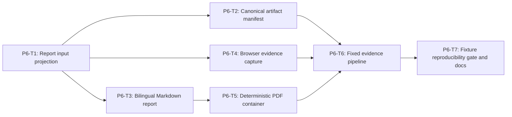

# Phase 6 Security Report and Evidence Pipeline Implementation Plan

> **For agentic workers:** REQUIRED SUB-SKILL: Use
> `superpowers:executing-plans` and `superpowers:test-driven-development`.
> Execute only the task explicitly assigned by the user, return its evidence,
> and do not continue automatically.

**Goal:** Generate a normalized Track 1 evidence pack containing a bilingual
security-risk report, deterministic PDF, safe campaign JSON, five verified UI
screenshots, and a canonical artifact manifest without admitting runtime raw
content or caller-forged metrics.

**Architecture:** A strict report-input projector independently normalizes
campaign detail, all attempts, all session evidence, and the immutable case
manifest. Metrics and the expected/actual matrix are derived from those
records. Screenshot, Markdown, PDF, and manifest builders are separate
deterministic stages coordinated by one fixed-output pipeline. Phase 6 proves
the pipeline with sanitized fixtures; only Phase 7 may create and commit the
accepted real baseline.

**Tech Stack:** TypeScript ESM, Node.js 22.19+, `node:test`, canonical JSON and
SHA-256, Playwright with exact version and digest-pinned browser image, Pandoc
and XeLaTeX in a digest-pinned report image, Docker Compose, existing frontend
and campaign/session read contracts.

---

## Phase Entry Gate

Phases 1, 2, 4, and 5 must be accepted:

```powershell
npm.cmd run test:track1:openclaw
npm.cmd run test:shared
npm.cmd run test:backend
npm.cmd run test:frontend
npm.cmd run build --prefix frontend
npm.cmd run test:repo
git status --short
```

Do not use or overwrite `docs/track1/evidence/openclaw-baseline/` in this
phase. Fixture artifacts must be written to a test temporary directory and
deleted by the test harness.

## Task DAG



| Task | Deliverable | Commit |
| --- | --- | --- |
| P6-T1 | closed report input and independently derived metrics | `feat(track1): derive security report evidence` |
| P6-T2 | canonical artifact inventory and manifest normalizer | `feat(track1): build canonical evidence manifest` |
| P6-T3 | fixed 18-section bilingual Markdown generator | `feat(track1): generate security risk report` |
| P6-T4 | five screenshot capture plus 3-viewport assertions | `feat(track1): capture campaign UI evidence` |
| P6-T5 | digest-pinned deterministic Chinese-capable PDF build | `build(track1): add deterministic report image` |
| P6-T6 | fixed output pipeline and evidence registration | `feat(track1): assemble Track 1 evidence pack` |
| P6-T7 | two-run reproducibility/content gate and docs | `test(track1): gate security evidence pipeline` |

## Cross-Task Invariants

- Only normalized completed campaigns can receive a passing evidence pack.
- Failed/incomplete campaigns may produce a diagnostic safe manifest only;
  they cannot overwrite accepted outputs or register evidence.
- Caller-provided counters, action matrices, pass/fail flags, artifact hashes,
  byte lengths, and media types are ignored and recomputed.
- Runtime prompt/output/tool/memory/provider/credential content is forbidden
  in every artifact and build log.
- Full text is allowed only for the nine canonical fixture files in the report
  appendix, after their committed SHA-256 values match the manifest.
- Artifact paths are relative POSIX paths under one fixed campaign directory.
- All JSON uses canonical key ordering and one final LF.
- All timestamps come from normalized campaign evidence, never the build clock.
- Screenshots must be fresh API data; mock, stale, loading, fallback, and error
  states fail capture.
- No task in this phase commits generated fixture artifacts or a fake baseline.

## Shared Evidence Test Fixture

Create in P6-T1:

```text
tests/track1/fixtures/report-evidence.fixture.ts
```

Export fresh factories:

```ts
makeCompletedCampaignReportSource()
makeRunningCampaignReportSource()
makeFailedCampaignReportSource()
makeNineSessionEvidenceExports()
makeExpectedActionMatrix()
makeArtifactBytes(path)
makeReportBuildPorts()
makeCompletedReportModel()
makeCompleteArtifactByteMap()
makeCanonicalFixturePort(options)
makeCompletedCampaignCaptureInput()
makeRecordingBrowserPort(options)
makePdfBuildInput()
makeRecordingPdfBuilderPort()
makeRealContainerPdfPort()
makeFailingPdfPort(sentinel)
makeRuntimeContentMutations()
```

The completed source has exactly 3 agents, 9 cases, 9 final attempts, optional
audited first attempts, correct final actions, real calendar timestamps, and
safe refs only. A separate `RUNTIME_SENTINELS` constant contains unique raw
content/token/provider strings used only to prove rejection.

## P6-T1: Closed Report Input and Derived Metrics

**Files:**

- Create: `scripts/track1/report/report-model.ts`
- Create: `scripts/track1/report/report-projector.ts`
- Create: `tests/track1/fixtures/report-evidence.fixture.ts`
- Create: `tests/track1/report-projector.spec.ts`

### Signatures

```ts
export interface Track1ReportSource {
  campaign: Track1CampaignDetail;
  sessions: Track1CampaignSessionEvidenceBundle[];
  campaign_manifest: Track1CampaignManifest;
  openclaw: Track1OpenClawBuildEvidence;
}

export interface Track1ReportModel {
  schema_version: "track1-security-report.v1";
  campaign: Track1ReportCampaign;
  environment: Track1ReportEnvironment;
  metrics: Track1ReportMetrics;
  cases: readonly Track1ReportCase[];
  scenarios: readonly Track1ReportScenario[];
  fixture_appendix: readonly Track1FixtureAppendixEntry[];
}

export function projectTrack1ReportModel(source: unknown): Track1ReportModel;
```

### Derived Metrics

At minimum:

```ts
interface Track1ReportMetrics {
  agent_count: 3;
  case_count: 9;
  final_pass_count: number;
  final_fail_count: number;
  retry_count: number;
  attempt_count: number;
  allow_count: number;
  deny_count: number;
  ask_count: number;
  alert_count: number;
  blocked_count: number;
  intercepted_tool_count: number;
  executed_simulated_tool_count: number;
  real_side_effect_count: 0;
}
```

### Acceptance

- Source and every nested record have exact keys and defensive copies.
- Campaign/case/agent/attempt/session/scenario correlation is exact.
- Every final result action is derived from policy decisions.
- Deny, alert, blocked, event, and tool counters are derived from normalized
  records.
- Expected actions come only from the independently loaded immutable manifest.
- Case pass/fail is derived from expected versus actual action.
- Report projection rejects incomplete 3/9 coverage, duplicate/missing final
  attempts, invalid retries, status mismatch, and real side-effect evidence.
- Runtime sentinels and content-bearing keys are rejected recursively.
- Fixture appendix entry contains a canonical fixture path/hash, not content;
  content is loaded and verified only during Markdown generation.

- [ ] **Step 1: Write successful derivation RED**

```ts
import assert from "node:assert/strict";
import test from "node:test";

import { projectTrack1ReportModel } from
  "../../scripts/track1/report/report-projector.ts";
import {
  makeCompletedCampaignReportSource
} from "./fixtures/report-evidence.fixture.ts";

test("REQ-T1-DEMO-010 report model derives all metrics from normalized evidence", () => {
  const source = makeCompletedCampaignReportSource();
  const model = projectTrack1ReportModel({
    ...source,
    metrics: {
      final_pass_count: 0,
      retry_count: 99,
      blocked_count: 0
    }
  });

  assert.equal(model.metrics.agent_count, 3);
  assert.equal(model.metrics.case_count, 9);
  assert.equal(model.metrics.final_pass_count, 9);
  assert.equal(model.metrics.final_fail_count, 0);
  assert.equal(model.metrics.retry_count, 1);
  assert.equal(model.metrics.real_side_effect_count, 0);
  assert.deepEqual(
    model.cases.map((row) => row.case_id),
    [
      "T1-SC-001-C001",
      "T1-SC-001-C002",
      "T1-SC-001-C003",
      "T1-SC-002-C001",
      "T1-SC-002-C002",
      "T1-SC-002-C003",
      "T1-SC-003-C001",
      "T1-SC-003-C002",
      "T1-SC-003-C003"
    ]
  );
});
```

- [ ] **Step 2: Write closed-oracle/content RED**

```ts
test("REQ-T1-DEMO-010 report projector does not trust caller action or pass claims", () => {
  const source = makeCompletedCampaignReportSource();
  const first = source.campaign.agents[0].cases[0];
  first.final_action = "allow";
  first.passed = true;

  const model = projectTrack1ReportModel(source);
  assert.equal(model.cases[0]?.actual_action, "deny");
  assert.equal(model.cases[0]?.passed, true);
});

test("REQ-T1-DEMO-010 report projector rejects runtime content at every source branch", () => {
  for (const mutation of makeRuntimeContentMutations()) {
    assert.throws(
      () => projectTrack1ReportModel(mutation),
      /track1_report_source_invalid/
    );
  }
});
```

The first test must inject claims through an untyped object boundary while
keeping the underlying normalized session evidence unchanged. The projector
must ignore unknown top-level claims and derive actual action from decisions;
if the source contract rejects unknown keys instead, assert rejection. Do not
cast production values to bypass the normalizer.

Add table-driven tests for:

| Mutation | Expected |
| --- | --- |
| 2 agents or 8 cases | reject |
| duplicate/missing case | reject |
| two final attempts | reject |
| hidden failed attempt 1 | reject |
| retry index 3 | reject |
| foreign policy/decision/session | reject |
| deny without blocked record | reject |
| alert without alert record | reject |
| un-intercepted expected dangerous tool | reject |
| expected action injected into provider evidence | reject |
| real side-effect detector non-zero | reject |
| forged counter/summary/action | ignore/rederive or reject |
| invalid calendar timestamp | reject |
| input object mutated after projection | model unchanged |

- [ ] **Step 3: Prove RED**

```powershell
node.exe --experimental-strip-types --experimental-test-isolation=none --test tests/track1/report-projector.spec.ts
```

Expected failure: report projector module does not exist.

- [ ] **Step 4: Implement minimal strict projector**

Use shared campaign/session/base-result normalizers and explicit reducers. Do
not parse IDs to infer policy outcomes. Return recursively frozen defensive
data.

- [ ] **Step 5: Prove GREEN and commit**

```powershell
node.exe --experimental-strip-types --experimental-test-isolation=none --test tests/track1/report-projector.spec.ts
git add scripts/track1/report/report-model.ts scripts/track1/report/report-projector.ts tests/track1/fixtures/report-evidence.fixture.ts tests/track1/report-projector.spec.ts
git commit -m "feat(track1): derive security report evidence"
```

## P6-T2: Canonical Artifact Inventory and Manifest

**Files:**

- Create: `scripts/track1/report/canonical-json.ts`
- Create: `scripts/track1/report/evidence-manifest.ts`
- Create: `tests/track1/evidence-manifest.spec.ts`

### Manifest Signature

```ts
export interface Track1EvidenceManifest {
  schema_version: "track1-evidence-manifest.v1";
  campaign_id: string;
  campaign_manifest_sha256: string;
  completed_at: string;
  openclaw: {
    version: "2026.6.10";
    package_integrity: string;
  };
  model_ref: string;
  coverage: {
    agent_count: 3;
    case_count: 9;
    attempt_count: number;
    retry_count: number;
  };
  action_matrix: readonly Track1EvidenceActionRow[];
  artifacts: readonly Track1ArtifactEntry[];
  generator: {
    schema_version: "track1-report-builder.v1";
    source_date_epoch: number;
  };
}
```

Artifact list contains exactly:

```text
security-risk-analysis.md
security-risk-analysis.pdf
campaign.json
screenshots/campaign-running.png
screenshots/campaign-overview.png
screenshots/scenario-1-prompt-injection.png
screenshots/scenario-2-tool-hijack.png
screenshots/scenario-3-memory-poisoning.png
```

`manifest.json` is not self-listed. Its externally computed SHA-256 is used in
the Phase 2 evidence-registration envelope.

### Acceptance

- Artifact path, media type, byte length, and SHA-256 are computed from bytes.
- Paths are exact, relative, slash-normalized, duplicate-free, and traversal
  free.
- Artifact order is the fixed list above.
- Action matrix and coverage are re-derived from `Track1ReportModel`.
- Manifest is canonical JSON with stable key ordering and final LF.
- Unknown fields, missing artifacts, extra artifacts, wrong PNG/PDF magic,
  empty files, unsafe refs, or invalid hashes are rejected.
- Credentials/provider/raw content are absent recursively.

- [ ] **Step 1: Write canonical manifest RED**

```ts
test("REQ-T1-DEMO-010 evidence manifest hashes exact artifact bytes in fixed order", () => {
  const artifacts = makeCompleteArtifactByteMap();
  const result = buildTrack1EvidenceManifest(
    makeCompletedReportModel(),
    artifacts
  );

  assert.deepEqual(
    result.manifest.artifacts.map((entry) => entry.path),
    EXPECTED_ARTIFACT_PATHS
  );
  for (const entry of result.manifest.artifacts) {
    const bytes = artifacts.get(entry.path);
    assert.ok(bytes);
    assert.equal(entry.byte_length, bytes.byteLength);
    assert.equal(entry.sha256, sha256(bytes));
  }
  assert.equal(
    result.manifest_sha256,
    sha256(Buffer.from(result.canonical_json, "utf8"))
  );
});
```

- [ ] **Step 2: Write tamper/path RED**

```ts
test("REQ-T1-DEMO-010 manifest rejects missing extra and unsafe artifacts", () => {
  for (const artifacts of [
    withoutArtifact(makeCompleteArtifactByteMap(), "campaign.json"),
    withArtifact(makeCompleteArtifactByteMap(), "extra.txt", Buffer.from("x")),
    renamedArtifact(
      makeCompleteArtifactByteMap(),
      "campaign.json",
      "../campaign.json"
    )
  ]) {
    assert.throws(
      () => buildTrack1EvidenceManifest(makeCompletedReportModel(), artifacts),
      /track1_evidence_manifest_invalid/
    );
  }
});
```

Add tests for byte mutation, artifact map mutation after build, wrong magic,
zero length, Unicode/path separators, duplicate key canonicalization, real
calendar timestamp, package integrity grammar, and sentinel scan.

- [ ] **Step 3: Prove RED**

```powershell
node.exe --experimental-strip-types --experimental-test-isolation=none --test tests/track1/evidence-manifest.spec.ts
```

- [ ] **Step 4: Implement canonical serializer and manifest**

Canonical JSON supports only normalized JSON values, sorts object keys by
Unicode code point, preserves array order, rejects non-finite numbers, and
emits one LF.

- [ ] **Step 5: Prove GREEN and commit**

```powershell
node.exe --experimental-strip-types --experimental-test-isolation=none --test tests/track1/evidence-manifest.spec.ts
git add scripts/track1/report/canonical-json.ts scripts/track1/report/evidence-manifest.ts tests/track1/evidence-manifest.spec.ts
git commit -m "feat(track1): build canonical evidence manifest"
```

## P6-T3: Fixed 18-Section Bilingual Markdown Report

**Files:**

- Create: `docs/track1/security-risk-analysis-template.md`
- Create: `scripts/track1/report/markdown-report.ts`
- Create: `tests/track1/markdown-report.spec.ts`

### Required Section Order

1. Chinese abstract
2. English abstract
3. Scope, authorization, and safe research boundary
4. System architecture and OpenClaw integration
5. Threat model
6. Methodology and campaign environment
7. Scenario 1: prompt injection and jailbreak
8. Scenario 2: tool-call hijacking
9. Scenario 3: context and memory poisoning
10. Nine-case expected/actual action matrix
11. Per-scenario findings and screenshots
12. Retry and failure analysis
13. Behavior-supervision prototype evaluation
14. Base-filter evaluation
15. Limitations and residual risks
16. Reproduction commands
17. Artifact manifest references
18. Appendix: all nine canonical fixture cases and attack scripts

The generated document may use bilingual headings where useful, but the
section IDs and order are fixed.

### Acceptance

- Report is primarily Chinese and includes a concise English abstract.
- It identifies real OpenClaw version, model ref, three agents, nine cases,
  plugin hooks/tools, internal ingest, and read-only UI.
- Each scenario includes attack mechanism, cases, observed action, impact,
  control behavior, residual risk, and screenshot reference.
- Matrix has exactly nine sorted rows and derives expected/actual/pass.
- Retry section discloses every first and second attempt.
- Report states simulated tools have no real side effects.
- Reproduction commands are the fixed commands from the spec, with no secrets.
- Appendix loads the nine canonical fixture files only after path/hash
  verification and includes their associated attack script refs.
- Template values are escaped for Markdown tables/HTML.
- Runtime sentinels cannot enter the report outside or inside the appendix.
- Same model and fixture bytes produce byte-identical UTF-8 Markdown.

- [ ] **Step 1: Write structure RED**

```ts
test("REQ-T1-DEMO-010 report contains all required sections in fixed order", async () => {
  const markdown = await buildTrack1MarkdownReport(
    makeCompletedReportModel(),
    makeCanonicalFixturePort()
  );
  const headings = markdown
    .split("\n")
    .filter((line) => /^## \d+\./.test(line));

  assert.equal(headings.length, 18);
  for (let index = 1; index < headings.length; index += 1) {
    assert.ok(markdown.indexOf(headings[index - 1]) < markdown.indexOf(headings[index]));
  }
  assert.match(markdown, /中文摘要/);
  assert.match(markdown, /English Abstract/);
  assert.equal((markdown.match(/\| T1-SC-00[1-3]-C00[1-3] \|/g) ?? []).length, 9);
});
```

- [ ] **Step 2: Write fixture/content RED**

```ts
test("REQ-T1-DEMO-010 appendix contains only hash-verified canonical fixture content", async () => {
  const fixturePort = makeCanonicalFixturePort();
  const markdown = await buildTrack1MarkdownReport(
    makeCompletedReportModel(),
    fixturePort
  );
  assert.deepEqual(fixturePort.readPaths, EXPECTED_CANONICAL_CASE_PATHS);
  for (const fixture of fixturePort.fixtures) {
    assert.equal(markdown.includes(fixture.controlled_content), true);
  }
});

test("REQ-T1-DEMO-010 fixture hash mismatch stops report generation", async () => {
  await assert.rejects(
    () => buildTrack1MarkdownReport(
      makeCompletedReportModel(),
      makeCanonicalFixturePort({ tamperCase: "T1-SC-002-C002" })
    ),
    /track1_fixture_hash_mismatch/
  );
});
```

Add tests for exact image refs, retry disclosure, no secret/model sentinel,
Markdown escaping, no current date, failed/incomplete campaign rejection,
commands without keys, all attack script refs, and byte-identical second run.

- [ ] **Step 3: Prove RED**

```powershell
node.exe --experimental-strip-types --experimental-test-isolation=none --test tests/track1/markdown-report.spec.ts
```

- [ ] **Step 4: Implement fixed template renderer**

Do not introduce a general-purpose template expression evaluator. Use explicit
section builders and escaped values. Keep the template as stable prose/heading
source and the TypeScript builder as the only data interpolation boundary.

- [ ] **Step 5: Prove GREEN and commit**

```powershell
node.exe --experimental-strip-types --experimental-test-isolation=none --test tests/track1/markdown-report.spec.ts
git add docs/track1/security-risk-analysis-template.md scripts/track1/report/markdown-report.ts tests/track1/markdown-report.spec.ts
git commit -m "feat(track1): generate security risk report"
```

## P6-T4: Five Verified Browser Screenshots and Viewport Checks

**Files:**

- Create: `scripts/track1/capture-openclaw-evidence.ts`
- Create: `tests/track1/evidence-capture.spec.ts`
- Create: `deploy/track1/Dockerfile.evidence`
- Modify: `deploy/track1/compose.track1.yml`

### Capture Set

```ts
const CAPTURES = [
  {
    path: "screenshots/campaign-running.png",
    state: "fresh-running",
    route: "?campaign_id=<id>"
  },
  {
    path: "screenshots/campaign-overview.png",
    state: "fresh-completed",
    route: "?campaign_id=<id>"
  },
  {
    path: "screenshots/scenario-1-prompt-injection.png",
    state: "fresh-completed",
    agent: "agent:track1:prompt-injection",
    session: deriveRepresentativeSession("T1-SC-001")
  },
  {
    path: "screenshots/scenario-2-tool-hijack.png",
    state: "fresh-completed",
    agent: "agent:track1:tool-hijack",
    session: deriveRepresentativeSession("T1-SC-002")
  },
  {
    path: "screenshots/scenario-3-memory-poisoning.png",
    state: "fresh-completed",
    agent: "agent:track1:memory-poison",
    session: deriveRepresentativeSession("T1-SC-003")
  }
] as const;
```

Representative sessions are derived deterministically as the final attempt of
the first case in each scenario. They are not user input.

### Browser Settings

```text
browser: Chromium from exact Playwright package/image
locale: zh-CN
timezone: Asia/Shanghai
color scheme: light
reduced motion: reduce
screenshot viewport: 1440 x 1000
overflow verification: 390 x 844, 1024 x 900, 1440 x 1000
device scale factor: 1
animations: disabled
```

### Acceptance

- Browser image uses an immutable digest matching the exact Playwright package.
- Capture waits on `data-evidence-state`, campaign ID, selected agent/session,
  fonts, and network idle with a bounded timeout; no fixed sleep is the
  readiness mechanism.
- Mock/stale/loading/fallback/error/empty banners fail capture.
- Every required panel is non-empty and has a non-zero bounding box.
- `scrollWidth <= clientWidth` at 390, 1024, and 1440 for document and primary
  panels.
- Console error, page error, failed API request, unexpected external request,
  or raw sentinel fails capture.
- PNG names and order are fixed; bytes are returned for manifest hashing.

- [ ] **Step 1: Write capture-plan RED**

```ts
test("REQ-T1-DEMO-010 evidence capture emits exactly five fixed screenshots", async () => {
  const browser = makeRecordingBrowserPort();
  const result = await captureTrack1CampaignEvidence(
    makeCompletedCampaignCaptureInput(),
    browser
  );

  assert.deepEqual(
    result.map((capture) => capture.path),
    [
      "screenshots/campaign-running.png",
      "screenshots/campaign-overview.png",
      "screenshots/scenario-1-prompt-injection.png",
      "screenshots/scenario-2-tool-hijack.png",
      "screenshots/scenario-3-memory-poisoning.png"
    ]
  );
  assert.deepEqual(browser.overflowViewports, [
    [390, 844],
    [1024, 900],
    [1440, 1000]
  ]);
});
```

- [ ] **Step 2: Write readiness/security RED**

```ts
test("REQ-T1-DEMO-010 capture rejects non-fresh or leaking UI states", async () => {
  for (const mutation of [
    "stale",
    "mock",
    "loading",
    "fallback",
    "error",
    "horizontal-overflow",
    "console-error",
    "failed-api",
    "raw-sentinel"
  ] as const) {
    await assert.rejects(
      () => captureTrack1CampaignEvidence(
        makeCompletedCampaignCaptureInput(),
        makeRecordingBrowserPort({ mutation })
      ),
      /track1_capture_failed/
    );
  }
});
```

Add tests for wrong campaign/session marker, blank screenshot, duplicate path,
timeout, unexpected origin, and browser result mutation.

- [ ] **Step 3: Prove RED**

```powershell
node.exe --experimental-strip-types --experimental-test-isolation=none --test tests/track1/evidence-capture.spec.ts
```

- [ ] **Step 4: Resolve exact browser image digest**

Use the exact Playwright version committed to the integration/report package:

```powershell
docker buildx imagetools inspect mcr.microsoft.com/playwright:v1.60.0-noble
```

Record the returned manifest-list digest in `Dockerfile.evidence`. If that tag
is unavailable, stop and amend the dependency/image pair together; never use a
tag-only or mismatched browser.

- [ ] **Step 5: Implement capture and Compose service**

The production browser port uses Playwright. Unit tests use the injected port.
The `evidence-capture` service has no model API key, ingest token, or host port.

- [ ] **Step 6: Prove GREEN and commit**

```powershell
node.exe --experimental-strip-types --experimental-test-isolation=none --test tests/track1/evidence-capture.spec.ts
docker build -f deploy/track1/Dockerfile.evidence -t agent-security-track1-evidence:1.60.0 .
git add scripts/track1/capture-openclaw-evidence.ts tests/track1/evidence-capture.spec.ts deploy/track1/Dockerfile.evidence deploy/track1/compose.track1.yml
git commit -m "feat(track1): capture campaign UI evidence"
```

## P6-T5: Digest-Pinned Deterministic PDF Builder

**Files:**

- Create: `deploy/track1/Dockerfile.report`
- Create: `scripts/track1/report/pdf-builder.ts`
- Create: `tests/track1/pdf-builder.spec.ts`
- Modify: `deploy/track1/compose.track1.yml`

### PDF Build Contract

```ts
export interface Track1PdfBuildInput {
  markdown: Uint8Array;
  completed_at: string;
  screenshot_files: ReadonlyMap<string, Uint8Array>;
}

export interface Track1PdfBuilderPort {
  render(input: Readonly<Track1PdfContainerInput>): Promise<Uint8Array>;
}

export function buildTrack1Pdf(
  input: unknown,
  port: Track1PdfBuilderPort
): Promise<Uint8Array>;
```

### Acceptance

- Report base image is the official fixed
  `pandoc/latex:3.10.0.0-ubuntu` tag plus immutable digest.
- Exact Pandoc, XeLaTeX, and fixed CJK font versions are recorded by the image.
- Image contains no network client use at runtime.
- Build environment fixes `SOURCE_DATE_EPOCH`, `TZ=UTC`, `LANG=C.UTF-8`,
  locale, font config, PDF title/author/creator, and completion timestamp.
- Input directory is read-only; output is one fixed file in tmpfs.
- Builder accepts bytes and fixed screenshot map, not arbitrary host paths or
  command flags.
- Output starts with `%PDF-`, has non-zero pages, contains Chinese and English
  text when extracted, and has no build-clock metadata.
- Same input rendered twice by the same pinned image is byte-identical.
- Container stderr and engine diagnostics are reduced to safe fixed errors.

- [ ] **Step 1: Write command/input RED**

```ts
test("REQ-T1-DEMO-010 PDF builder passes only fixed deterministic container input", async () => {
  const port = makeRecordingPdfBuilderPort();
  const bytes = await buildTrack1Pdf(makePdfBuildInput(), port);

  assert.equal(Buffer.from(bytes).subarray(0, 5).toString("ascii"), "%PDF-");
  assert.deepEqual(Object.keys(port.inputs[0] ?? {}).sort(), [
    "completed_at",
    "markdown_sha256",
    "source_date_epoch",
    "screenshots"
  ]);
  assert.equal(port.inputs[0]?.source_date_epoch, FIXED_COMPLETION_EPOCH);
});
```

- [ ] **Step 2: Write deterministic/error RED**

```ts
test("REQ-T1-DEMO-010 pinned PDF image is byte deterministic", async () => {
  const input = makePdfBuildInput();
  const first = await buildTrack1Pdf(input, makeRealContainerPdfPort());
  const second = await buildTrack1Pdf(input, makeRealContainerPdfPort());
  assert.deepEqual(first, second);
});

test("REQ-T1-DEMO-010 PDF errors cannot leak engine input or stderr", async () => {
  const sentinel = "PDF_ENGINE_SENTINEL_4fd2";
  await assert.rejects(
    () => buildTrack1Pdf(
      makePdfBuildInput(),
      makeFailingPdfPort(sentinel)
    ),
    (error: unknown) => {
      assert.equal(String(error).includes(sentinel), false);
      return String(error).includes("track1_pdf_build_failed");
    }
  );
});
```

Keep real-container determinism test behind the explicit Phase 6 evidence gate
if normal unit tests cannot require Docker. The injected-port test stays in the
ordinary unit gate.

- [ ] **Step 3: Prove unit RED**

```powershell
node.exe --experimental-strip-types --experimental-test-isolation=none --test tests/track1/pdf-builder.spec.ts
```

- [ ] **Step 4: Resolve exact report image digest and record tool versions**

Resolve the immutable digest for the approved full four-part image tag:

```powershell
docker buildx imagetools inspect pandoc/latex:3.10.0.0-ubuntu
```

Commit `pandoc/latex:3.10.0.0-ubuntu@sha256:<resolved-64-hex-digest>` in the
Dockerfile. The digest is copied from the command output and the repository
test validates its grammar. Reject a tag-only base, `latest`, package-manager
upgrade, or unpinned font download. If this exact image lacks deterministic
Chinese rendering with its fixed TeX Live 2026 toolchain, stop and report; do
not silently switch images or host tools. A different image requires an
approved spec amendment.

- [ ] **Step 5: Implement image and builder**

Use fixed Pandoc arguments stored inside the image. The TypeScript layer cannot
append arbitrary flags. Normalize PDF metadata/ID inside the same pinned image
if the selected engine emits variable IDs.

- [ ] **Step 6: Prove real deterministic GREEN**

```powershell
docker build -f deploy/track1/Dockerfile.report -t agent-security-track1-report:1 .
node.exe --experimental-strip-types --experimental-test-isolation=none --test tests/track1/pdf-builder.spec.ts
```

- [ ] **Step 7: Commit P6-T5**

```powershell
git add deploy/track1/Dockerfile.report scripts/track1/report/pdf-builder.ts tests/track1/pdf-builder.spec.ts deploy/track1/compose.track1.yml
git commit -m "build(track1): add deterministic report image"
```

## P6-T6: Fixed Evidence Pipeline and Backend Registration

**Files:**

- Create: `scripts/track1/build-security-risk-report.ts`
- Create: `scripts/track1/report/evidence-pipeline.ts`
- Create: `tests/track1/evidence-pipeline.spec.ts`
- Modify: `scripts/track1/campaign-runner.ts`

### Pipeline Order

```text
normalize completed campaign source
  -> capture running screenshot at first accepted-case checkpoint
  -> after completion capture final overview and three scenarios
  -> generate Markdown
  -> generate PDF
  -> canonicalize safe campaign.json
  -> hash exact artifact bytes and write manifest.json
  -> re-read and validate every file
  -> register manifest hash and safe artifact refs with backend
  -> return safe artifact reference
```

The running screenshot checkpoint is a runner port introduced here. If capture
fails, the campaign continues to its terminal result but evidence acceptance
fails and no evidence is registered.

### CLI

```text
npm run report:track1 -- --campaign-id campaign:t1:<32-lowercase-hex>
```

This is the only accepted argument shape. Output root is always
`artifacts/track1/<campaign-id>/`.

### Acceptance

- CLI rejects missing, duplicate, extra, malformed, or positional arguments.
- Output path is derived only from normalized campaign ID.
- Existing accepted output is never partially overwritten; write to sibling
  temp directory, validate, then atomic rename.
- File modes and names are fixed.
- Registration occurs only after local re-read/hash/normalization succeeds.
- Backend receives only manifest hash and safe artifact refs.
- Registration failure leaves valid local artifacts but exits non-zero.
- Failed/incomplete campaign cannot run a passing pipeline.
- Fixed safe stdout contains campaign ID, status, and artifact ref only.

- [ ] **Step 1: Write pipeline order RED**

```ts
test("REQ-T1-DEMO-010 evidence pipeline validates before registration", async () => {
  const ports = makeReportBuildPorts();
  const result = await buildTrack1EvidencePack(
    { campaign_id: CAMPAIGN_ID },
    ports
  );

  assert.deepEqual(ports.calls, [
    "load-source",
    "project-report",
    "capture-running",
    "capture-final",
    "build-markdown",
    "build-pdf",
    "write-campaign-json",
    "build-manifest",
    "write-temp-files",
    "reread-validate",
    "atomic-publish",
    "register-evidence"
  ]);
  assert.equal(result.artifact_ref, `artifact://track1/${CAMPAIGN_ID}`);
});
```

- [ ] **Step 2: Write no-registration/atomic RED**

```ts
test("REQ-T1-DEMO-010 any artifact validation failure prevents registration", async () => {
  for (const failure of [
    "capture",
    "markdown",
    "pdf",
    "manifest",
    "reread"
  ] as const) {
    const ports = makeReportBuildPorts({ failure });
    await assert.rejects(
      () => buildTrack1EvidencePack({ campaign_id: CAMPAIGN_ID }, ports),
      /track1_evidence_build_failed/
    );
    assert.equal(ports.registrationInputs.length, 0);
    assert.equal(ports.publishedDirectories.length, 0);
  }
});

test("REQ-T1-DEMO-010 registration failure keeps validated local artifacts but fails command", async () => {
  const ports = makeReportBuildPorts({ failure: "registration" });
  await assert.rejects(
    () => buildTrack1EvidencePack({ campaign_id: CAMPAIGN_ID }, ports),
    /track1_evidence_registration_failed/
  );
  assert.equal(ports.publishedDirectories.length, 1);
  assert.equal(ports.registrationInputs.length, 1);
});
```

Add tests for CLI grammar, symlink/traversal, existing destination, write
failure, file mutation between hash and reread, failed campaign, missing
running capture, unexpected file, registration payload exact keys, and
stdout/stderr sentinel absence.

- [ ] **Step 3: Prove RED**

```powershell
node.exe --experimental-strip-types --experimental-test-isolation=none --test tests/track1/evidence-pipeline.spec.ts
```

- [ ] **Step 4: Implement pipeline and runner checkpoint**

The runner receives an injected `captureRunningCheckpoint` port. It executes
once after the first accepted final case and before the second case starts.
Do not import Playwright, filesystem, or report code into the campaign state
machine.

- [ ] **Step 5: Prove GREEN and commit**

```powershell
node.exe --experimental-strip-types --experimental-test-isolation=none --test tests/track1/evidence-pipeline.spec.ts tests/track1/openclaw-campaign-runner.spec.ts
git add scripts/track1/build-security-risk-report.ts scripts/track1/report/evidence-pipeline.ts tests/track1/evidence-pipeline.spec.ts scripts/track1/campaign-runner.ts tests/track1/openclaw-campaign-runner.spec.ts
git commit -m "feat(track1): assemble Track 1 evidence pack"
```

## P6-T7: Fixture Reproducibility Gate, Repository Rules, and Docs

**Files:**

- Create: `tests/track1/report-fixture-e2e.spec.ts`
- Create: `tests/repository/track1-evidence-pack.spec.ts`
- Modify: `package.json`
- Modify: `docs/architecture.md`
- Modify: `docs/api-contract.md`
- Modify: `docs/progress.md`
- Modify: `README.md`

### Acceptance

- Fixture E2E builds complete artifacts twice in separate temp roots.
- Markdown, PDF, campaign JSON, all PNGs, and manifest are byte-identical.
- Every manifest hash/length/media type matches bytes.
- PDF is readable and includes Chinese/English markers.
- PNGs are nonblank and have expected dimensions.
- Recursive content scan finds no runtime sentinel or content-bearing JSON key.
- Repository gate checks image digests, exact dependency versions, fixed
  artifact names, report sections, screenshot count, and baseline exclusion.
- Root scripts expose unit, Docker evidence, and report commands separately.
- Docs state fixture evidence is not competition evidence and Phase 7 remains
  pending.

- [ ] **Step 1: Write fixture E2E RED**

```ts
test("REQ-T1-DEMO-010 fixture evidence pack is byte-identical across two builds", async () => {
  const first = await buildFixtureEvidencePack(createTempRoot("first"));
  const second = await buildFixtureEvidencePack(createTempRoot("second"));

  assert.deepEqual(first.relativePaths, second.relativePaths);
  for (const path of first.relativePaths) {
    assert.deepEqual(first.bytes(path), second.bytes(path), path);
  }
  assert.equal(first.manifest.coverage.agent_count, 3);
  assert.equal(first.manifest.coverage.case_count, 9);
  assert.equal(first.manifest.action_matrix.length, 9);
});

test("REQ-T1-DEMO-010 fixture evidence pack contains no runtime sentinel", async () => {
  const pack = await buildFixtureEvidencePack(createTempRoot("content-scan"));
  for (const [path, bytes] of pack.files) {
    for (const sentinel of RUNTIME_SENTINELS) {
      assert.equal(Buffer.from(bytes).includes(Buffer.from(sentinel)), false, path);
    }
  }
});
```

- [ ] **Step 2: Write repository RED**

Assert:

- browser/report `FROM` lines include 64-hex digests;
- Playwright package and image versions match;
- manifest expected paths equal committed code;
- report heading source has exactly 18 section IDs;
- capture code has exactly five output names;
- `docs/track1/evidence/openclaw-baseline` does not contain fixture-generated
  files from this phase;
- artifact directory and OpenClaw state are ignored;
- all test files are registered.

- [ ] **Step 3: Prove RED**

```powershell
node.exe --experimental-strip-types --experimental-test-isolation=none --test tests/track1/report-fixture-e2e.spec.ts tests/repository/track1-evidence-pack.spec.ts
```

- [ ] **Step 4: Register scripts and docs**

Add:

```json
"report:track1": "node --experimental-strip-types scripts/track1/build-security-risk-report.ts",
"test:track1:report:unit": "node --experimental-strip-types --experimental-test-isolation=none --test tests/track1/report-projector.spec.ts tests/track1/evidence-manifest.spec.ts tests/track1/markdown-report.spec.ts tests/track1/evidence-capture.spec.ts tests/track1/pdf-builder.spec.ts tests/track1/evidence-pipeline.spec.ts",
"test:track1:report": "npm run test:track1:report:unit && node --experimental-strip-types --experimental-test-isolation=none --test tests/track1/report-fixture-e2e.spec.ts"
```

Append repository test to `test:repo`. Keep Docker-dependent fixture E2E out of
the default unit script if current CI does not guarantee Docker; Phase 6
acceptance still requires it to be run explicitly.

- [ ] **Step 5: Run complete Phase 6 GREEN**

```powershell
npm.cmd run test:track1:report
npm.cmd run test:track1:openclaw
npm.cmd run test:repo
npm.cmd run test:shared
npm.cmd run test:engine:sandbox
npm.cmd run test:backend
npm.cmd run test:frontend
npm.cmd run build --prefix frontend
git diff --check
git status --short
```

Inspect the fixture report and all five fixture screenshots. Verify PDF text
extraction and PNG dimensions/nonblank pixels using deterministic test tools.

- [ ] **Step 6: Commit P6-T7**

```powershell
git add tests/track1/report-fixture-e2e.spec.ts tests/repository/track1-evidence-pack.spec.ts package.json docs/architecture.md docs/api-contract.md docs/progress.md README.md
git commit -m "test(track1): gate security evidence pipeline"
```

## Phase Exit Gate

Phase 6 is complete only when:

1. all seven task commits exist in order;
2. every behavior task has genuine RED evidence before implementation;
3. fixture pack contains exact 3-agent/9-case metrics, 18 report sections,
   bilingual abstracts, five screenshots, PDF, campaign JSON, and manifest;
4. every metric/hash/length/action is independently derived;
5. fixture appendix hashes match all nine committed cases;
6. 390/1024/1440 browser overflow and fresh-state checks pass;
7. two complete builds are byte-identical;
8. runtime sentinel scan and prohibited-key scan pass;
9. no fixture artifact is committed as the accepted baseline;
10. worker stops and reports.

## Worker Compressed Report

```text
REQ-T1-DEMO-010 / Phase 6
Commits:
- <hash> P6-T1 ...
- <hash> P6-T2 ...
- <hash> P6-T3 ...
- <hash> P6-T4 ...
- <hash> P6-T5 ...
- <hash> P6-T6 ...
- <hash> P6-T7 ...

RED evidence:
- P6-T1: <command> -> <expected behavior failure>
- P6-T2: <command> -> <expected behavior failure>
- P6-T3: <command> -> <expected behavior failure>
- P6-T4: <command> -> <expected behavior failure>
- P6-T5: <command> -> <expected behavior failure>
- P6-T6: <command> -> <expected behavior failure>
- P6-T7: <command> -> <expected behavior failure>

GREEN gates:
- test:track1:report: <actual pass/fail>
- test:track1:openclaw: <actual pass/fail>
- test:repo: <actual pass/fail>
- test:shared: <actual pass/fail>
- test:engine:sandbox: <actual pass/fail>
- test:backend: <actual pass/fail>
- test:frontend/build: <actual pass/fail>
- git diff --check: <actual result>

Evidence checks:
- 18 sections: <pass/fail>
- 3 agents / 9 cases / attempts: <actual>
- five PNG dimensions/nonblank: <actual>
- PDF pages/text/determinism: <actual>
- two-build byte comparison: <pass/fail>
- manifest hash/length validation: <pass/fail>
- runtime sentinel/prohibited-key scan: <pass/fail>
- accepted baseline modified: <must be no>

Files changed:
- <exact paths>

Residual risks:
- real cloud-model evidence and accepted baseline remain Phase 7

Status:
- PHASE_6_COMPLETE_PENDING_REVIEW
```

Stop after reporting. Do not start Phase 7.
