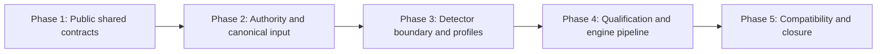

# REQ-SBX-GENERAL-001 Master Implementation Plan

> **For agentic workers:** REQUIRED SUB-SKILL: Use
> `superpowers:subagent-driven-development` (recommended) or
> `superpowers:executing-plans`, plus `superpowers:test-driven-development`.
> Execute only the task explicitly assigned by the user, return its evidence,
> and do not continue automatically.

**Goal:** Implement strict general-purpose sandbox security contracts and a
deterministic in-process evaluation core for authoritative user-input,
model-output, and tool-request observations.

**Architecture:** Trusted adapters submit an unvalidated engine-private input
envelope. `SandboxSecurityEngine.evaluate()` starts the total monotonic budget
immediately, then runs engine-internal shared normalization and authority
validation, mints a private branded evaluation request, and continues
projection, detection, qualification, and reduction. Raw-local detectors and a
type-isolated sanitized-external Judge emit exact-key candidates; immutable
profiles qualify evidence; a separate reducer produces content-free, fail-closed
decisions. Track 1 behavior remains unchanged behind compatibility adapters and
a **balanced-only** test-only regression harness.

**Tech Stack:** Node.js `>=22.19.0` on **WSL Linux**, TypeScript ESM with native
type stripping for runtime tests, real TypeScript compiler typecheck via
frontend `typescript@6.0.2` JS entry, `node:test`, `node:assert/strict`,
`node:crypto`, RFC 8785/JCS in-repository, `AbortController`, no new production
dependency.

---

## WSL Execution Environment

Execute only in **WSL/Linux**, never Windows PowerShell.

### Repository root

```bash
REPO_ROOT="$(git rev-parse --show-toplevel)"
cd "$REPO_ROOT"
pwd
git rev-parse --show-toplevel
git branch --show-current
git status --short
```

Do not hardcode `E:\...` or assume a single `/mnt/e/...` path.

### Linux toolchain with hard fail conditions

```bash
uname -a
command -v node
command -v npm
command -v git
node -p 'process.platform'
node --version
npm --version
test -f ./frontend/node_modules/typescript/bin/tsc

# Hard fail if not Linux Node
test "$(node -p 'process.platform')" = "linux"

# Reject Windows interop executables for node/npm/git
for cmd in node npm git; do
  path="$(command -v "$cmd")"
  case "$path" in
    *.exe|*.cmd|*.bat|/mnt/c/*|/mnt/d/*)
      echo "Windows interop path not allowed for $cmd: $path" >&2
      exit 1
      ;;
  esac
done
```

Notes:

- Reject `*.exe`, `*.cmd`, `*.bat`, and `/mnt/c/*` / `/mnt/d/*` interop paths.
- Do **not** reject ordinary Linux tools merely because the repo lives under
  `/mnt/e/<repo>`.
- If platform is not `linux` or interop is detected: stop and report.

### TypeScript compiler

```bash
test -f ./frontend/node_modules/typescript/bin/tsc

node ./frontend/node_modules/typescript/bin/tsc \
  --noEmit \
  -p shared/tsconfig.json

node ./frontend/node_modules/typescript/bin/tsc \
  --noEmit \
  -p engines/sandbox/tsconfig.json
```

Missing tsc entry: stop; do not `npm install`/`npm ci`; do not treat as RED;
do not modify lockfile.

### Dependency / mount / CRLF rules

- Agent does not install or repair dependencies.
- `/mnt/*` slowness must not change the 5000 ms product budget or loosen tests.
- Exit gates run `git diff --check`, `git diff --summary`, `git status --short`.
- Never modify global `core.autocrlf`, `core.filemode`, WSL mounts, or repo
  line-ending policy. Whole-file CRLF/file-mode noise: stop and report.

## Canonical Inputs

- Specs: `docs/superpowers/specs/2026-07-10-sandbox-general-security-design.md`,
  `docs/superpowers/specs/2026-07-10-sandbox-security-core-spec.md`
- Rules: `AGENTS.md`, `metadata.md`
- Shared index pattern: `shared/index.ts` (historical package; GENERAL-001 is
  additive explicit exports only)
- Sprint format: `docs/sprint-current.md` uses `## Requirement ID` and status
  fields (current value still `REQ-T1-DEMO-010` until user switches)
- TypeScript: `tsconfig.base.json`, `shared/tsconfig.json` (includes
  `tests/**/*.ts`), frontend `typescript@6.0.2` at
  `frontend/node_modules/typescript/bin/tsc`
- Track 1: `engines/sandbox/src/base-filter/evaluator.ts`, monitor contracts

Implementation must not start until the user switches active sprint to
`REQ-SBX-GENERAL-001`. This plan review does not change the active sprint.

## Core evaluate / authority model (locked)

```text
Trusted adapter constructs:
  SandboxSecurityEvaluationRequestInput {
    submission: unknown;
    authoritative_context: unknown;
  }
  // ordinary exact-key object; NOT validated; NOT branded

engine.evaluate(input, callerSignal?):
  1. monotonic total deadline START (5000 ms budget)
  2. engine-internal normalizeSandboxSecurityEvaluationRequest(input)
     - shared request structural normalization
     - authoritative context validation + JCS equality
     - brand mint -> SandboxSecurityEvaluationRequest (private)
  3. recheck deadline
  4. projection / hashing / detectors / qualification / reduction
  5. return content-free decision; retain no raw snapshot
```

Rules:

- **No pre-normalized branded request** is accepted by `evaluate()`.
- **No double full authority normalization** outside that internal path for the
  same evaluation.
- `SandboxSecurityEvaluationRequest` is **engine-internal only** (branded);
  never adapter-facing export; never constructed by adapters.
- `normalizeSandboxSecurityEvaluationRequest` is **engine-internal only**; not
  in trusted adapter-facing export allowlist C.
- Fingerprint service reuses the **same internal normalizer** and JCS path
  inside its own call (budget ownership for fingerprint is separate from
  evaluate; fingerprint is not an evaluate path).
- Optional: adapters may construct the input object literally; no required
  public factory for the input envelope.

## Global Worker Handoff Prompt

```text
Execute only the assigned REQ-SBX-GENERAL-001 task in the current WSL worktree.

REPO_ROOT="$(git rev-parse --show-toplevel)"; cd "$REPO_ROOT"
test "$(node -p 'process.platform')" = "linux"
test -f ./frontend/node_modules/typescript/bin/tsc

Read AGENTS.md, metadata.md, docs/sprint-current.md, both approved 2026-07-10
sandbox specs, the master plan, the assigned phase plan, and the assigned task.

Follow Design -> Test -> Implement -> Document -> Stop and report.
Use bash only. npm run ..., never npm.cmd. Typecheck only via:
  node ./frontend/node_modules/typescript/bin/tsc --noEmit -p <tsconfig>
Never strip-types as typecheck. Never Windows node/npm/git. Never auto-install.
Never hardcode Windows paths.

evaluate() receives SandboxSecurityEvaluationRequestInput only; budget starts
before internal normalizeSandboxSecurityEvaluationRequest. Never export branded
SandboxSecurityEvaluationRequest or the internal normalizer from security/index.

Implement only the assigned behavior. Stage only task-owned paths. One commit.
Stop and return the phase report format.
```

## Global TDD Rules

1. No production behavior before listed RED.
2. Strengthen tests that pass before implementation.
3. Untrusted object tests cover unknown/inherited/accessor/prototype.
4. Fail-closed tests assert action/verdict and zero downstream effects.
5. Raw-content tests inject unique sentinels across returned surfaces.
6. Behavior tests do not load external data files; repo/static/test-only harness
   may read fixed versioned fixtures; never into generic production core.
7. Shared normalizers structural only; semantics in engine.
8. Routed optional detector is runtime-required before availability check.
9. One task, one commit; never `git add .`.
10. Stop after every task/phase for review.
11. Empty `test("name", () => {})` inventories must be filled before RED.
12. Typecheck via Node+JS tsc entry only; probes not imported by Node tests.
13. Typecheck green is not RED for probe tasks.
14. No dependency install; no CRLF/file-mode config surgery.
15. P5-T4 only closes exports; never renames APIs frozen by earlier tasks.

## Master Baseline Gate

```bash
REPO_ROOT="$(git rev-parse --show-toplevel)"
cd "$REPO_ROOT"
pwd
git rev-parse --show-toplevel
git branch --show-current
git status --short

uname -a
command -v node
command -v npm
command -v git
node -p 'process.platform'
node --version
npm --version
test -f ./frontend/node_modules/typescript/bin/tsc
test "$(node -p 'process.platform')" = "linux"
for cmd in node npm git; do
  path="$(command -v "$cmd")"
  case "$path" in
    *.exe|*.cmd|*.bat|/mnt/c/*|/mnt/d/*)
      echo "Windows interop path not allowed for $cmd: $path" >&2
      exit 1
      ;;
  esac
done

npm run test:shared
npm run test:engine:sandbox
npm run test:repo
```

## TypeScript / sandbox tsconfig (locked)

Focused sandbox config created in **P1-T4**:

```json
{
  "extends": "../../tsconfig.base.json",
  "compilerOptions": {
    "rootDir": "../../",
    "types": ["node"],
    "outDir": "./dist",
    "noEmit": true,
    "allowImportingTsExtensions": true
  },
  "include": [
    "src/security/**/*.ts",
    "tests/sandbox-security-*.spec.ts",
    "tests/fixtures/security-*.ts",
    "tests/helpers/track1-security-regression-harness.ts",
    "tests/types/**/*.ts"
  ],
  "exclude": ["node_modules", "dist"]
}
```

**Phase 1 typecheck anchor** (P1-T4 owns):

```text
engines/sandbox/tests/types/sandbox-security-typecheck-anchor.ts
```

```ts
export {};
```

- ensures focused sandbox tsconfig has inputs before security sources exist;
- no `@ts-expect-error`;
- not imported by Node tests;
- does **not** replace P3-T2 detector isolation probe;
- P3-T2 still REDs when formal probe file is missing.

Probe validity: real assignability/property access only; no `as any`/`as never`;
no `keyof T & "x"` never-intersections; every `@ts-expect-error` must be used.

## Phase DAG



```text
Phase 1: types -> request normalizer -> finding/run/decision -> exports/anchor/typecheck
Phase 2: JCS -> internal authority normalizer -> projection -> locators -> fingerprint
Phase 3: detector ports -> compile-time isolation probe -> raw boundary -> sanitizer
         -> profiles -> registry
Phase 4: qualification -> escalation -> deadline primitives -> reducer -> semantic
         -> full engine (evaluate-entry budget)
Phase 5: monitor adapter -> Track1 adapter (0.80) -> balanced test-only harness
         -> exact export close -> docs
```

| Phase | Tasks | Review gate |
| --- | ---: | --- |
| 1 | 4 | shared + repo + typecheck (+ anchor) |
| 2 | 5 | focused + shared + repo + typecheck |
| 3 | 6 | detector/profile + typecheck |
| 4 | 6 | engine core + shared + repo + typecheck |
| 5 | 5 | shared + sandbox + repo + typecheck |

**Total: 26** RED-first tasks.

## Spec Coverage Matrix

| Area | Owners |
| --- | --- |
| Public structural contracts A/B | P1-T1–T3 |
| Shared exports, sandbox tsconfig, typecheck anchor | P1-T4, P5-T4 |
| JCS sole canonicalization | P2-T1 |
| Engine-internal authority normalizer + branded request | P2-T2 |
| Projection / 512 KiB / hashes | P2-T3 |
| Locators | P2-T4 |
| Fingerprint service factory + ports | P2-T5 |
| Detector ports + GENERAL-002-facing result types | P3-T1 |
| Compile-time isolation (true missing-file RED) | P3-T2 |
| Raw/sanitized boundaries | P3-T3, P3-T4 |
| `resolveSandboxSecurityProfile` | P3-T5 |
| `createSandboxSecurityDetectorRegistry` | P3-T6 |
| Qualification / escalation | P4-T1, P4-T2 |
| Deadline primitives + `SandboxSecurityRuntimePorts` | P4-T3 |
| Reducer / semantic validator | P4-T4, P4-T5 |
| `createSandboxSecurityEngine` + evaluate-entry budget | P4-T6 |
| Monitor factory | P5-T1 |
| Track1 adapter factory + confidence 0.80 | P5-T2 |
| Balanced test-only harness | P5-T3 |
| Exact engine export close + anti-oracle | P5-T4 |
| Final docs + sprint status | P5-T5 |

## Phase Ownership

### Phase 1

Owns shared public types/contracts/tests/probes, additive `shared/index.ts`
exports for A/B, focused `engines/sandbox/tsconfig.json`, and typecheck anchor.

### Phase 2

Owns JCS, **engine-internal** authority normalizer, projection, locators,
fingerprint service. Does not export branded request or normalizer from final
index (temporary deep imports closed by P5-T4).

### Phase 3

Owns detector contracts (including GENERAL-002-facing types listed in D),
test-only isolation probe (P3-T2 does not edit production contracts), profiles
(`resolveSandboxSecurityProfile`), registry factory.

### Phase 4

Owns qualification, escalation, deadline primitives, reducer, semantic
validator, engine factory. `evaluate` takes input envelope; budget starts first.

### Phase 5

Owns monitor/Track1 adapter factories, balanced test-only harness, exact export
closure, docs. P5-T4 renames nothing frozen earlier.

## Fixed decisions

### Authority equality

```text
text/plain: exact UTF-8 / normalized string equality
application/json: P2-T1 JCS canonical-byte equality only
```

### Deadline split

- P4-T3: primitives only (no evaluate-entry claims).
- P4-T6: total budget from evaluate entry; internal normalization included.

### Track 1 confidence

```text
catalog match -> 0.80; no match -> no_match; never 0.60/1.00 from adapter
```

### Track 1 compatibility harness profile (locked)

```text
profile: sandbox-security-balanced.v1
rule detector: createTrack1RuleMatchDetectorAdapter
local: not registered
Judge: not registered
confidence: 0.80 on catalog match
```

Reason:

```text
legacy alert -> generic low  -> balanced alert
legacy ask   -> generic medium -> balanced ask
legacy deny  -> generic high -> balanced deny
```

Strict would elevate low/medium and break nine-case action compatibility.
Profile is fixed in test-only harness only; not a production default override.

### Production directory rules

**Generic core may exist under** `engines/sandbox/src/security/**` (authority,
canonicalization, detectors, profiles, reducer, pipeline, engine, semantic
validator, adapters).

**Adapters subdirectory allowlist only:**

```text
engines/sandbox/src/security/adapters/
  - monitor-decision-provider.ts
  - track1-rule-matches.ts
```

**Whole production security tree anti-oracle:**

```text
No regression harness, case loader, expected-action map, fixture path,
case manifest, report oracle, or test-only compatibility data under
engines/sandbox/src/security/**
```

Test-only harness path:

```text
engines/sandbox/tests/helpers/track1-security-regression-harness.ts
```

## Exact export allowlist (locked)

### A. Shared public runtime exports (GENERAL-001 modules only)

```ts
SANDBOX_SECURITY_STAGES
SANDBOX_SECURITY_CLAIMED_SOURCE_TYPES
SANDBOX_SECURITY_RISK_CATEGORIES
SANDBOX_SECURITY_POLICY_PROFILE_IDS
SANDBOX_SECURITY_SEVERITIES
SANDBOX_SECURITY_VERDICTS
SANDBOX_SECURITY_ACTIONS
SANDBOX_SECURITY_MAX_TEXT_BYTES
SANDBOX_SECURITY_MAX_REQUEST_BYTES
SANDBOX_SECURITY_MAX_CONTENT_ITEMS
SANDBOX_SECURITY_MAX_JSON_DEPTH
SANDBOX_SECURITY_MAX_JSON_NODES
normalizeSandboxSecurityRequest
normalizeSandboxSecurityFinding
normalizeSandboxDetectorRun
normalizeSandboxSecurityDecision
```

Reason codes, run obligations/status/skip/error closed sets are **types and/or
module-internal validation constants** unless listed in A. They are not extra
runtime public exports.

### B. Shared public type exports

```ts
SandboxSecurityStage
SandboxSecurityClaimedSourceType
SandboxSecurityPolicyProfileId
SandboxSecurityRiskCategory
SandboxSecuritySeverity
SandboxSecurityVerdict
SandboxSecurityAction
SandboxSecurityJsonValue
SandboxSecuritySubmittedContentItem
SandboxSecurityToolRequest
SandboxSecurityRequest
SandboxSecurityContentLocator
SandboxSecurityToolLocator
SandboxSecurityFindingSubjectRef
SandboxSecurityFinding
SandboxDetectorRunObligation
SandboxDetectorRunStatus
SandboxDetectorSkipReason
SandboxDetectorRunErrorCode
SandboxDetectorRun
SandboxSecurityDecision
```

### Shared package index policy

`shared/index.ts` is historical. Repository tests must **not** require
`shared/index.ts` exports === A/B only.

Instead:

1. A/B GENERAL-001 symbols are all re-exported from `shared/index.ts`;
2. `shared/types/sandbox-security.ts` export set ⊆ A∪B-related types/runtime;
3. `shared/contracts/sandbox-security.ts` export set ⊆ listed normalizers (+
   any necessary internal helpers not re-exported from package index);
4. pre-existing shared exports remain;
5. no engine-private symbols from shared.

P1-T4 uses explicit named exports for GENERAL-001 symbols (not bare
`export *` of sandbox-security if that would over-export).

### C. Trusted adapter-facing Engine runtime exports

```ts
createSandboxSecurityEngine
createSandboxSecurityCanonicalFingerprintService
createSandboxSecurityMonitorDecisionAdapter
createTrack1RuleMatchDetectorAdapter
resolveSandboxSecurityProfile
createSandboxSecurityDetectorRegistry
```

**Not exported:** `normalizeSandboxSecurityEvaluationRequest` (engine-internal).

### D. Trusted adapter-facing Engine type exports

```ts
// evaluate input envelope (unvalidated)
SandboxSecurityEvaluationRequestInput
SandboxSecurityAuthoritativeEvaluationContextInput
AuthenticatedSourceObservationInput
AuthenticatedToolObservationInput

// engine surface
SandboxSecurityEngine
SandboxSecurityRuntimePorts

// fingerprint
SandboxSecurityCanonicalFingerprintPort
SandboxSecurityCanonicalFingerprintService

// registry / detector ports (GENERAL-002 needs these without deep imports)
SandboxSecurityDetectorRegistry
RawLocalDetector
SandboxSecuritySanitizer
SanitizedExternalDetector
SandboxSecurityRiskCandidate
SandboxSecurityCategoryClearance
SandboxSecurityRawDetectorResult
SandboxSecurityExternalDetectorResult
SandboxSecuritySanitizedJudgePayload
SandboxSecurityCandidateSubjectRef
SandboxSecurityExternalCandidateSubjectRef
```

**Not exported (never):** branded `SandboxSecurityEvaluationRequest`, private
brand symbol, raw snapshot concrete types beyond port signatures, private
source/call handles, canonical projection bytes, ordinary content hashes,
qualification records, escalation mutable state, token registry internals,
semantic-validator internals, fixtures, harness.

### E. Never-export patterns (repository scan)

```ts
normalizeSandboxSecurityEvaluationRequest  // value export from index
SandboxSecurityEvaluationRequest           // branded type export from index
__authorityBrand|AuthorityBrand|brandSymbol
RawDetectorSnapshot|canonicalBytes|CanonicalProjection
QualificationRecord|EscalationState|TokenRegistry
SemanticValidator|semantic-validator
track1-security-regression-harness|regressionHarness
tests/
```

### Owning-task API freeze

| API | First owner |
| --- | --- |
| A/B shared exports | P1-T1–T4 |
| typecheck anchor | P1-T4 |
| JCS helpers | P2-T1 |
| internal `normalizeSandboxSecurityEvaluationRequest` | P2-T2 |
| `SandboxSecurityEvaluationRequestInput` | P2-T2 |
| fingerprint port/service + `createSandboxSecurityCanonicalFingerprintService` | P2-T5 |
| detector ports + D detector result types | P3-T1 |
| `resolveSandboxSecurityProfile` | P3-T5 |
| `createSandboxSecurityDetectorRegistry` / `SandboxSecurityDetectorRegistry` | P3-T6 |
| `SandboxSecurityRuntimePorts` | P4-T3 |
| `SandboxSecurityEngine` / `createSandboxSecurityEngine` / evaluate signature | P4-T6 |
| monitor/Track1 factories | P5-T1 / P5-T2 |

P5-T4 only verifies final index allowlist; **no renames**.

## Cross-Phase Contract Freeze

- Phase 1 freezes public A/B names and field grammars.
- Phase 2 freezes JCS, internal authority normalizer, input envelope type.
- Phase 3 freezes slots/thresholds/detector-facing types in D.
- Phase 4 freezes evaluate signature and budget integration.
- Phase 5 freezes balanced harness profile and final index allowlists.
- Earlier defect: stop and rework owning phase; no silent patching.
- Temporary deep imports closed by P5-T4.

## Required Evidence Per Task

```text
Task:
Commit:
Files changed:
WSL process.platform (+ interop check):
Node version:
TypeScript entry present:
RED command / valid failure:
GREEN command and counts:
Typecheck (if required):
Broader gates:
git diff --check / --summary:
Sentinel/content-boundary:
Unrelated dirty files left:
Status:
```

## Requirement Exit Gate

```bash
REPO_ROOT="$(git rev-parse --show-toplevel)"
cd "$REPO_ROOT"
test "$(node -p 'process.platform')" = "linux"
test -f ./frontend/node_modules/typescript/bin/tsc

npm run test:shared
npm run test:engine:sandbox
npm run test:repo

node ./frontend/node_modules/typescript/bin/tsc --noEmit -p shared/tsconfig.json
node ./frontend/node_modules/typescript/bin/tsc --noEmit -p engines/sandbox/tsconfig.json

git diff --check
git diff --summary
git status --short
```

Acceptance includes: evaluate-entry budget includes internal authority
normalization; branded request not exported; balanced nine-case harness;
exact engine allowlist C/D; shared A/B additive; no production oracle; Track1
confidence 0.80; Linux-only toolchain; docs final markers present.

## Master Plan Review Checklist

- [ ] Sprint switched by user before implementation
- [ ] WSL hard fail for non-linux / Windows interop
- [ ] Phase 1 typecheck anchor present
- [ ] evaluate receives input envelope; budget starts before internal normalize
- [ ] branded EvaluationRequest not exported
- [ ] internal normalizer not in C
- [ ] GENERAL-002 detector-facing types in D
- [ ] Track1 harness balanced.v1 only
- [ ] adapters/ allowlist only; generic core unrestricted
- [ ] shared export tests do not freeze whole shared/index history
- [ ] P5 docs RED uses final markers only
- [ ] API names frozen at owning tasks
- [ ] P3-T2 missing formal probe RED still valid with anchor present
- [ ] No GENERAL-002–005 production behavior
