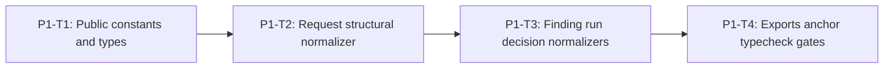

# Phase 1 Public Shared Contracts Implementation Plan

> **For agentic workers:** REQUIRED SUB-SKILL: Use
> `superpowers:subagent-driven-development` or `superpowers:executing-plans`,
> plus `superpowers:test-driven-development`. Execute only the assigned task.
>
> This phase plan is self-contained. Do not consult older plan revisions.
>
> **APPROVED:** The user reapproved both canonical Specs and the complete plan
> set on `2026-07-13`. Execute only in the exact Master DAG order.

**Goal:** Add strict, versioned, content-free public submission and decision
contracts whose shared normalizers validate structure without importing engine
profiles or policy logic.

**Architecture:** Runtime constants and TypeScript types live in
`shared/types/sandbox-security.ts`. P1-T2 owns the request normalizer in
`shared/contracts/sandbox-security-request.ts`; P1-T3 owns the stable public
contract module `shared/contracts/sandbox-security.ts`, which implements the
other three normalizers and exactly re-exports the request normalizer. Engine-
only authority, profiles, qualification, and reduction are deliberately absent.

Boundary lock for later phases: shared exports only the exact public
`SandboxSecurityFinding`. `SandboxSecurityDraftFinding`,
`SandboxSecurityAcceptedSubjectEntity`, `SandboxSecurityPublicSubjectTokenMap`,
`materializeSandboxSecurityPublicSubjectTokens`, and
`publishSandboxSecurityFindings` are Engine-internal P4-T1 symbols and must not
be added to shared types, contracts, or normalizers. A DraftFinding is never
passed to `normalizeSandboxSecurityFinding`.

**Tech Stack:** TypeScript ESM on WSL Linux, `node:test`, real typecheck via
`node ./frontend/node_modules/typescript/bin/tsc --noEmit`, no dependency
changes.

**New-module RED rule:** A raw module-load, export-link, syntax, or environment
error is not valid RED. For an absent planned production module, tests narrowly
catch only that exact path, substitute a test-local type-compatible inert
fallback, and run the same real input/output assertion used after
implementation. File/export existence is not the behavior; every other load
error is rethrown.

**Production file unique ownership (this phase):**

| Production file | Sole owner |
| --- | --- |
| `shared/types/sandbox-security.ts` | P1-T1 |
| `shared/contracts/sandbox-security-request.ts` | P1-T2 |
| `shared/contracts/sandbox-security.ts` | P1-T3 |
| `shared/index.ts` | P1-T4 (GENERAL-001 additions only) |
| `engines/sandbox/tsconfig.json` | P1-T4 |

No production file is created or modified by a second task. Later defects stop
and return to the owning task.

---

## Phase Entry Gate

```bash
REPO_ROOT="$(git rev-parse --show-toplevel)"
cd "$REPO_ROOT"
pwd
git rev-parse --show-toplevel
git branch --show-current
git status --short

uname -a
command -v node
command -v npm
command -v git
node -p 'process.platform'
node --version
npm --version
test -f ./frontend/node_modules/typescript/bin/tsc
test "$(node -p 'process.platform')" = "linux"
for cmd in node npm git; do
  path="$(command -v "$cmd")"
  case "$path" in
    *.exe|*.cmd|*.bat|/mnt/c/*|/mnt/d/*)
      echo "Windows interop path not allowed for $cmd: $path" >&2
      exit 1
      ;;
  esac
done

npm run test:shared
npm run test:repo
```

Expected: linux platform; Node `>=22.19.0`; active sprint
`REQ-SBX-GENERAL-001`; gates green; no dependency install.

## Task DAG



## P1-T1: Public Constants and Types

### Goal / Acceptance

Export Master allowlist A runtime constants that live in types, and Master
allowlist B types (including `SandboxSecurityReasonCode`). No engine import.
No raw-content fields on findings/runs/decisions.

### Files

- Create: `shared/types/sandbox-security.ts`
- Create: `shared/tests/sandbox-security-contract.spec.ts`

### Dependencies / frozen inputs

- Approved Spec public type shapes for request/finding/run/decision.
- Master A/B allowlists.

Revised run catalogs are exact: skip reasons are
`optional_not_configured | optional_not_selected | routing_not_selected |
risk_short_circuit | evaluation_terminated`. A `skipped` status is not resolved
or unresolved by status alone; resolution is `obligation + skip_reason`.
`profile_required|runtime_required + evaluation_terminated` is unresolved
required evidence; `optional_not_selected` with
`optional_not_configured|optional_not_selected|routing_not_selected` is resolved;
`optional_not_selected + evaluation_terminated` has no independent effect;
`risk_short_circuit` is resolved by risk only with a validated short-circuit
finding. markFailed error_code subset is SandboxDetectorFailedRunErrorCode
(excludes timeout/invalid/leak; those use markTimeout/markInvalidResult);
detector run error codes do not contain Engine-level
`evaluation_budget_exhausted`.

### Step 1: Exact RED test inventory

```ts
test("REQ-SBX-GENERAL-001 exports closed public security constants", () => {
  assert.deepEqual(SANDBOX_SECURITY_STAGES, [
    "user_input", "model_output", "tool_request"
  ]);
  assert.equal(SANDBOX_SECURITY_CLAIMED_SOURCE_TYPES.length, 6);
  assert.equal(SANDBOX_SECURITY_RISK_CATEGORIES.length, 9);
  assert.deepEqual(SANDBOX_SECURITY_POLICY_PROFILE_IDS, [
    "sandbox-security-balanced.v1",
    "sandbox-security-strict.v1"
  ]);
  assert.deepEqual(SANDBOX_SECURITY_SEVERITIES, [
    "low", "medium", "high", "critical"
  ]);
  assert.deepEqual(SANDBOX_SECURITY_VERDICTS, [
    "no_detected_risk", "risk_detected", "indeterminate"
  ]);
  assert.deepEqual(SANDBOX_SECURITY_ACTIONS, [
    "allow", "alert", "ask", "deny"
  ]);
  assert.equal(SANDBOX_SECURITY_MAX_TEXT_BYTES, 128 * 1024);
  assert.equal(SANDBOX_SECURITY_MAX_REQUEST_BYTES, 512 * 1024);
  assert.equal(SANDBOX_SECURITY_MAX_CONTENT_ITEMS, 64);
  assert.equal(SANDBOX_SECURITY_MAX_JSON_DEPTH, 12);
  assert.equal(SANDBOX_SECURITY_MAX_JSON_NODES, 4096);
});

test("REQ-SBX-GENERAL-001 exports SandboxSecurityReasonCode closed catalog", () => {
  // type-level existence is enforced by compile-time import in GREEN;
  // runtime: reason tokens used by findings equal nine category codes
  const expected = [
    "sandbox_security_prompt_injection",
    "sandbox_security_jailbreak",
    "sandbox_security_instruction_override",
    "sandbox_security_privilege_escalation",
    "sandbox_security_sensitive_data_exposure",
    "sandbox_security_tool_hijacking",
    "sandbox_security_unsafe_side_effect",
    "sandbox_security_memory_poisoning",
    "sandbox_security_trust_boundary_violation"
  ];
  // module-internal validation may hold the array; public type must exist
  assert.equal(expected.length, 9);
});
```

### Step 2: RED command

```bash
node --experimental-strip-types --test shared/tests/sandbox-security-contract.spec.ts
```

### Expected RED failure and why valid

When the exact module is absent, the guarded loader supplies test-local empty
catalogs and zero limits. The unchanged catalog/value assertions then fail on
their expected values. A raw `ERR_MODULE_NOT_FOUND`, export-link, syntax, or
environment error is invalid RED.

### Step 3: Implementation boundary

Implement only:

```text
shared/types/sandbox-security.ts:
  - A runtime constants listed above
  - B types including SandboxSecurityReasonCode
  - SandboxSecurityJsonValue, request/content/tool shapes
  - finding/run/decision structural types
  - locator and subject-ref unions
```

Do **not**:

- implement normalizers (P1-T2/T3);
- export engine authority types;
- add reason-code runtime array to public A unless already listed (keep arrays
  module-internal if used for validation);
- import engine modules.

### Step 4: GREEN command and expected result

```bash
node --experimental-strip-types --test shared/tests/sandbox-security-contract.spec.ts
```

Expected: all P1-T1 tests pass.

### Step 5: Broader gates

None beyond focused shared contract tests for this task.

### Step 6: Exact git add paths + commit

```bash
git add shared/types/sandbox-security.ts \
  shared/tests/sandbox-security-contract.spec.ts
git commit -m "feat(shared): add sandbox security public types"
```

### Stop/report

Stop after commit; return task evidence.

---

## P1-T2: Request Structural Normalizer

### Goal / Acceptance

Exact request/content/tool shapes; field grammars; provenance; stage/source/tool
matrix; limits; defensive copies; no trust derivation.

### Files

- Create: `shared/contracts/sandbox-security-request.ts`
- Modify: `shared/tests/sandbox-security-contract.spec.ts`

### Dependencies / frozen inputs

- P1-T1 types and constants.
- Spec field grammars and stage matrices.

### Step 1: Exact RED test inventory

```ts
test("REQ-SBX-GENERAL-001 request_id accepts valid grammar at max length", () => {});
test("REQ-SBX-GENERAL-001 request_id rejects empty leading separator and over-length", () => {});
test("REQ-SBX-GENERAL-001 source_id accepts valid grammar at max length", () => {});
test("REQ-SBX-GENERAL-001 source_id rejects empty leading separator and over-length", () => {});
test("REQ-SBX-GENERAL-001 call_id accepts valid grammar at max length", () => {});
test("REQ-SBX-GENERAL-001 call_id rejects empty leading separator and over-length", () => {});
test("REQ-SBX-GENERAL-001 tool_name accepts valid grammar at max length", () => {});
test("REQ-SBX-GENERAL-001 tool_name rejects leading digit empty and over-length", () => {});
test("REQ-SBX-GENERAL-001 target rejects C0 C1 CR LF and NUL", () => {});
test("REQ-SBX-GENERAL-001 provenance_ref accepts allowed schemes at max length", () => {});
test("REQ-SBX-GENERAL-001 provenance_ref rejects query fragment userinfo and encoding", () => {});
test("REQ-SBX-GENERAL-001 schema_version accepts only sandbox-security-request.v1", () => {});
test("REQ-SBX-GENERAL-001 policy_profile_id accepts only built-in public IDs", () => {});
test("REQ-SBX-GENERAL-001 claimed_source_type rejects unknown values", () => {});
test("REQ-SBX-GENERAL-001 normalizes an exact user-input request", () => {});
test("REQ-SBX-GENERAL-001 rejects caller trust and unknown request keys", () => {});
test("REQ-SBX-GENERAL-001 rejects inherited and accessor request fields", () => {});
test("REQ-SBX-GENERAL-001 enforces the three stage source matrices", () => {});
test("REQ-SBX-GENERAL-001 rejects duplicate source IDs and malformed provenance", () => {});
test("REQ-SBX-GENERAL-001 enforces text item depth node and count boundaries", () => {});
test("REQ-SBX-GENERAL-001 rejects lone surrogate in text values", () => {});
test("REQ-SBX-GENERAL-001 rejects non-finite numbers sparse arrays and cycles in JSON", () => {});
test("REQ-SBX-GENERAL-001 rejects prototype pollution keys in JSON objects", () => {});
```

### Step 2: RED command

```bash
node --experimental-strip-types --test shared/tests/sandbox-security-contract.spec.ts
```

### Expected RED failure and why valid

When the exact module is absent, the guarded loader supplies a test-local
normalizer that returns `null`. The unchanged valid-fixture assertions then
fail on the required normalized value. Raw import, syntax, export-link, and
environment errors are invalid RED.

### Step 3: Implementation boundary

```ts
export function normalizeSandboxSecurityRequest(
  value: unknown
): SandboxSecurityRequest | null;
```

Implements exact-key structural validation only. Does not derive trust, select
profiles, or import engine modules.

Must not modify earlier-phase files beyond the listed test file.

### Step 4: GREEN command and expected result

```bash
node --experimental-strip-types --test shared/tests/sandbox-security-contract.spec.ts
```

All P1-T1 + P1-T2 tests pass.

### Step 5: Broader gates

None.

### Step 6: Exact git add paths + commit

```bash
git add shared/contracts/sandbox-security-request.ts \
  shared/tests/sandbox-security-contract.spec.ts
git commit -m "feat(shared): normalize sandbox security requests"
```

### Stop/report

Stop after commit.

---

## P1-T3: Finding, Run, and Decision Structural Normalizers

### Goal / Acceptance

Structural normalizers for findings, detector runs, and decisions. Content-free
fields only. No engine semantic reduction.

### Files

- Create: `shared/contracts/sandbox-security.ts`
- Modify: `shared/tests/sandbox-security-contract.spec.ts`

### Dependencies / frozen inputs

- P1-T1 types including `SandboxSecurityReasonCode`.
- P1-T2 request normalizer module (must not be changed).

### Step 1: Exact RED test inventory

```ts
test("REQ-SBX-GENERAL-001 source_token and call_token accept public grammar at max length", () => {});
test("REQ-SBX-GENERAL-001 source_token and call_token reject illegal characters and over-length", () => {});
test("REQ-SBX-GENERAL-001 finding_id accepts engine public grammar at max length", () => {});
test("REQ-SBX-GENERAL-001 finding_id rejects illegal characters and over-length", () => {});
test("REQ-SBX-GENERAL-001 evidence_ref accepts evidence grammar at max length", () => {});
test("REQ-SBX-GENERAL-001 evidence_ref rejects illegal characters and over-length", () => {});
test("REQ-SBX-GENERAL-001 evidence_ref accepts only finding ordinal or engine-0001 grammar", () => {});
test("REQ-SBX-GENERAL-001 detector_version accepts version grammar", () => {});
test("REQ-SBX-GENERAL-001 detector_id accepts detector URI grammar at max 128", () => {});
test("REQ-SBX-GENERAL-001 detector_id rejects illegal characters and over-length", () => {});
test("REQ-SBX-GENERAL-001 shared run detector_id is a string and has no Engine type dependency", () => {});
test("REQ-SBX-GENERAL-001 shared normalizer accepts all three built-in detector URI IDs", () => {});
test("REQ-SBX-GENERAL-001 shared normalizer accepts a syntactically valid unknown detector URI", () => {});
test("REQ-SBX-GENERAL-001 shared normalizer rejects malformed detector URI", () => {});
test("REQ-SBX-GENERAL-001 detector_id shared normalizer does not hard-code slot constants", () => {});
test("REQ-SBX-GENERAL-001 detector_id shared normalizer does not import profile manifests", () => {});
test("REQ-SBX-GENERAL-001 shared types do not import engines sandbox security modules", () => {});
test("REQ-SBX-GENERAL-001 reason_code accepts closed public reason tokens only", () => {});
test("REQ-SBX-GENERAL-001 reason_code type is SandboxSecurityReasonCode", () => {});
test("REQ-SBX-GENERAL-001 ISO timestamps accept real-calendar values and reject invalid dates", () => {});
test("REQ-SBX-GENERAL-001 subject refs accept 1 and 8 unique refs", () => {});
test("REQ-SBX-GENERAL-001 subject refs reject 0 and 9 refs", () => {});
test("REQ-SBX-GENERAL-001 content locator rejects malformed JSON pointer", () => {});
test("REQ-SBX-GENERAL-001 tool locator rejects component locator mismatch", () => {});
test("REQ-SBX-GENERAL-001 normalizes content and tool finding subjects", () => {});
test("REQ-SBX-GENERAL-001 rejects mixed subject union fields", () => {});
test("REQ-SBX-GENERAL-001 rejects caller IDs hashes and prose in findings", () => {});
test("REQ-SBX-GENERAL-001 normalizes every detector run branch", () => {});
test("REQ-SBX-GENERAL-001 run skip reasons equal the revised closed five-value set", () => {});
test("REQ-SBX-GENERAL-001 detector run errors exclude Engine-level budget exhaustion", () => {});
test("REQ-SBX-GENERAL-001 rejects illegal run branch fields", () => {});
test("REQ-SBX-GENERAL-001 structurally normalizes simulation and enforcement decisions", () => {});
test("REQ-SBX-GENERAL-001 does not perform engine semantic reduction", () => {});
```

### Step 2: RED command

```bash
node --experimental-strip-types --test shared/tests/sandbox-security-contract.spec.ts
```

### Expected RED failure and why valid

When the exact module is absent, the guarded loader supplies test-local
normalizers that return `null`. The unchanged valid finding/run/decision
assertions then fail behaviorally. Raw module-load, syntax, export-link, and
environment errors are invalid RED.

### Step 3: Implementation boundary

```ts
export function normalizeSandboxSecurityFinding(
  value: unknown
): SandboxSecurityFinding | null;

export function normalizeSandboxDetectorRun(
  value: unknown
): SandboxDetectorRun | null;

export function normalizeSandboxSecurityDecision(
  value: unknown
): SandboxSecurityDecision | null;

export { normalizeSandboxSecurityRequest }
  from "./sandbox-security-request.ts";
```

`reason_code` validated against closed `SandboxSecurityReasonCode` catalog.
Public shared `detector_id` on findings/runs is a plain `string` (not Engine
`SandboxSecurityDetectorSlotId`). Shared normalizers validate **grammar only**
against:

```regex
^detector://[A-Za-z0-9][A-Za-z0-9._-]{0,63}(?:/[A-Za-z0-9][A-Za-z0-9._-]{0,63}){1,7}$
```

(max 128 chars). They must not import profile manifests, hard-code the three
built-in slot constants, import `engines/**`, or depend on Engine types.
Syntactically valid unknown detector URIs normalize successfully. Engine
semantic validation (later phase) alone checks membership in selected
`profile.detector_slots`. There is no second shared closed-set authority.

The stable module exports exactly these four normalizers. It does not recompute
verdict/action/risk from findings and does not modify the P1-T2 request module.

Must not modify `shared/types/sandbox-security.ts` unless a type hole is found;
if so, stop and rework P1-T1.

### Step 4: GREEN command and expected result

```bash
node --experimental-strip-types --test shared/tests/sandbox-security-contract.spec.ts
```

All Phase 1 contract tests pass.

### Step 5: Broader gates

None.

### Step 6: Exact git add paths + commit

```bash
git add shared/contracts/sandbox-security.ts \
  shared/tests/sandbox-security-contract.spec.ts
git commit -m "feat(shared): normalize sandbox security decisions"
```

### Stop/report

Stop after commit.

---

## P1-T4: Exports, Typecheck Anchor, Permanent Shared Gates

### Goal / Acceptance

Additive shared package exports for A/B; focused sandbox tsconfig; typecheck
anchor; repository gates; public type probes.

### Files

- Modify: `shared/index.ts` (additive explicit GENERAL-001 exports only)
- Modify: `shared/package.json`
- Modify: `package.json`
- Modify: `tests/repository/root-test-entry.spec.ts`
- Create: `tests/repository/sandbox-security-core.spec.ts`
- Create: `shared/tests/types/sandbox-security-public-types.ts`
- Create: `engines/sandbox/tsconfig.json`
- Create: `engines/sandbox/tests/types/sandbox-security-typecheck-anchor.ts`
- Modify: `docs/progress.md`

### Dependencies / frozen inputs

- P1-T1–T3 complete.
- Master A/B allowlists.

### Focused sandbox tsconfig

```json
{
  "extends": "../../tsconfig.base.json",
  "compilerOptions": {
    "rootDir": "../../",
    "types": ["node"],
    "outDir": "./dist",
    "noEmit": true,
    "allowImportingTsExtensions": true
  },
  "include": [
    "src/security/**/*.ts",
    "tests/sandbox-security-*.spec.ts",
    "tests/fixtures/security-*.ts",
    "tests/helpers/track1-security-regression-harness.ts",
    "tests/types/**/*.ts"
  ],
  "exclude": ["node_modules", "dist"]
}
```

### Typecheck anchor

```ts
// engines/sandbox/tests/types/sandbox-security-typecheck-anchor.ts
export {};
```

### Shared index export style

```ts
export {
  SANDBOX_SECURITY_STAGES,
  SANDBOX_SECURITY_CLAIMED_SOURCE_TYPES,
  SANDBOX_SECURITY_RISK_CATEGORIES,
  SANDBOX_SECURITY_POLICY_PROFILE_IDS,
  SANDBOX_SECURITY_SEVERITIES,
  SANDBOX_SECURITY_VERDICTS,
  SANDBOX_SECURITY_ACTIONS,
  SANDBOX_SECURITY_MAX_TEXT_BYTES,
  SANDBOX_SECURITY_MAX_REQUEST_BYTES,
  SANDBOX_SECURITY_MAX_CONTENT_ITEMS,
  SANDBOX_SECURITY_MAX_JSON_DEPTH,
  SANDBOX_SECURITY_MAX_JSON_NODES
} from "./types/sandbox-security.ts";

export type {
  SandboxSecurityStage,
  SandboxSecurityClaimedSourceType,
  SandboxSecurityPolicyProfileId,
  SandboxSecurityRiskCategory,
  SandboxSecuritySeverity,
  SandboxSecurityVerdict,
  SandboxSecurityAction,
  SandboxSecurityReasonCode,
  SandboxSecurityJsonValue,
  SandboxSecuritySubmittedContentItem,
  SandboxSecurityToolRequest,
  SandboxSecurityRequest,
  SandboxSecurityContentLocator,
  SandboxSecurityToolLocator,
  SandboxSecurityFindingSubjectRef,
  SandboxSecurityFinding,
  SandboxDetectorRunObligation,
  SandboxDetectorRunStatus,
  SandboxDetectorSkipReason,
  SandboxDetectorRunErrorCode,
  SandboxDetectorRun,
  SandboxSecurityDecision
} from "./types/sandbox-security.ts";

export {
  normalizeSandboxSecurityRequest,
  normalizeSandboxSecurityFinding,
  normalizeSandboxDetectorRun,
  normalizeSandboxSecurityDecision
} from "./contracts/sandbox-security.ts";
```

Do not `export *` sandbox-security modules if that would add non-A/B symbols.
Do not remove historical shared exports.

### Shared export test scope

1. A/B symbols exist on package exports;
2. `shared/types/sandbox-security.ts` export set matches A∪B for that module;
3. `shared/contracts/sandbox-security.ts` exports the four normalizers only
   (plus non-exported internal helpers);
4. historical shared exports still present;
5. no engine-private symbols in shared.

### Phase 1 public type probes

```ts
declare const request: SandboxSecurityRequest;
declare const finding: SandboxSecurityFinding;
declare const decision: SandboxSecurityDecision;
declare const reason: SandboxSecurityReasonCode;
// @ts-expect-error public request exposes no authority brand
request.__authorityBrand;
// @ts-expect-error finding cannot declare raw content
finding.raw_content;
// @ts-expect-error decision cannot declare ordinary content hash
decision.content_hash;
// @ts-expect-error decision cannot declare provenance
decision.provenance_ref;
// reason_code field is SandboxSecurityReasonCode
const findingReason: SandboxSecurityReasonCode = finding.reason_code;
void reason;
void findingReason;
```

### Step 1: Exact RED test inventory

```ts
test("REQ-SBX-GENERAL-001 registers public contract gates", () => {});
test("REQ-SBX-GENERAL-001 keeps shared contracts engine independent", () => {});
test("REQ-SBX-GENERAL-001 sandbox tsconfig exists for typecheck", () => {});
test("REQ-SBX-GENERAL-001 sandbox typecheck anchor exists", () => {
  assert.equal(
    existsSync(
      "engines/sandbox/tests/types/sandbox-security-typecheck-anchor.ts"
    ),
    true
  );
});
test("REQ-SBX-GENERAL-001 shared type probe file exists", () => {});
test("REQ-SBX-GENERAL-001 shared tsconfig includes tests types probes", () => {});
test("REQ-SBX-GENERAL-001 shared package exports SandboxSecurityReasonCode type", () => {});
test("REQ-SBX-GENERAL-001 shared package exports all Master A runtime symbols", () => {});
test("REQ-SBX-GENERAL-001 shared package exports all Master B type symbols", () => {});
```

### Step 2: RED command

```bash
node --experimental-strip-types --test \
  tests/repository/sandbox-security-core.spec.ts \
  tests/repository/root-test-entry.spec.ts
```

### Expected RED failure and why valid

Repository/export/config/anchor existence assertions fail because files/exports
are missing. Correctly written `@ts-expect-error` probes typechecking green is
**not** RED.

### Step 3: Implementation boundary

Create tsconfig + anchor + probes; additive shared index exports; register tests.
Do not implement engine modules. Do not freeze whole historical `shared/index.ts`.

### Step 4: GREEN command and expected result

```bash
npm run test:shared
npm run test:repo
node ./frontend/node_modules/typescript/bin/tsc --noEmit -p shared/tsconfig.json
node ./frontend/node_modules/typescript/bin/tsc --noEmit -p engines/sandbox/tsconfig.json
```

All green.

### Step 5: Broader gates

```bash
git diff --check
git diff --summary
git status --short
```

### Step 6: Exact git add paths + commit

```bash
git add shared/index.ts shared/package.json package.json \
  tests/repository/root-test-entry.spec.ts \
  tests/repository/sandbox-security-core.spec.ts \
  shared/tests/types/sandbox-security-public-types.ts \
  engines/sandbox/tsconfig.json \
  engines/sandbox/tests/types/sandbox-security-typecheck-anchor.ts \
  docs/progress.md
git commit -m "test(sandbox): gate public security contracts"
```

### Stop/report

Stop for Phase 1 review.

---

## Phase 1 Exit Gate

```bash
REPO_ROOT="$(git rev-parse --show-toplevel)"
cd "$REPO_ROOT"
test "$(node -p 'process.platform')" = "linux"
test -f ./frontend/node_modules/typescript/bin/tsc
test -f ./shared/contracts/sandbox-security-request.ts
test -f ./shared/contracts/sandbox-security.ts

npm run test:shared
npm run test:repo
node ./frontend/node_modules/typescript/bin/tsc --noEmit -p shared/tsconfig.json
node ./frontend/node_modules/typescript/bin/tsc --noEmit -p engines/sandbox/tsconfig.json
git diff --check
git diff --summary
git status --short
```

## Phase 1 Report Format

```text
Phase: 1 Public Shared Contracts
WSL process.platform:
Task commits:
Typecheck anchor path:
A/B allowlist exactness (incl. SandboxSecurityReasonCode):
test:shared / test:repo:
typecheck shared / sandbox:
git diff --check / --summary:
Current status: PHASE_1_COMPLETE_PENDING_REVIEW
```
