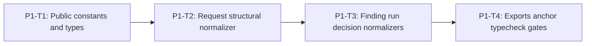

# Phase 1 Public Shared Contracts Implementation Plan

> **For agentic workers:** REQUIRED SUB-SKILL: Use
> `superpowers:subagent-driven-development` or `superpowers:executing-plans`,
> plus `superpowers:test-driven-development`. Execute only the assigned task.

**Goal:** Add strict, versioned, content-free public submission and decision
contracts whose shared normalizers validate structure without importing engine
profiles or policy logic.

**Architecture:** Runtime constants and TypeScript types live in
`shared/types/sandbox-security.ts`; exact-key defensive normalizers live in
`shared/contracts/sandbox-security.ts`. Engine-only authority, profiles,
qualification, and reduction are deliberately absent.

**Tech Stack:** TypeScript ESM on WSL Linux, `node:test`, real typecheck via
`node ./frontend/node_modules/typescript/bin/tsc --noEmit`, no dependency
changes.

---

## Phase Entry Gate

```bash
REPO_ROOT="$(git rev-parse --show-toplevel)"
cd "$REPO_ROOT"
pwd
git rev-parse --show-toplevel
git branch --show-current
git status --short

uname -a
command -v node
command -v npm
command -v git
node -p 'process.platform'
node --version
npm --version
test -f ./frontend/node_modules/typescript/bin/tsc
test "$(node -p 'process.platform')" = "linux"
for cmd in node npm git; do
  path="$(command -v "$cmd")"
  case "$path" in
    *.exe|*.cmd|*.bat|/mnt/c/*|/mnt/d/*)
      echo "Windows interop path not allowed for $cmd: $path" >&2
      exit 1
      ;;
  esac
done

npm run test:shared
npm run test:repo
```

Expected: linux platform; Node `>=22.19.0`; active sprint
`REQ-SBX-GENERAL-001`; gates green; no dependency install.

## Task DAG



## P1-T1: Public Constants and Types

**Files:**

- Create: `shared/types/sandbox-security.ts`
- Create: `shared/tests/sandbox-security-contract.spec.ts`

**Acceptance:**

```text
Runtime exports from this module (re-exported via shared/index in P1-T4)
are exactly Master allowlist A runtime constants that live in types:
  SANDBOX_SECURITY_STAGES
  SANDBOX_SECURITY_CLAIMED_SOURCE_TYPES
  SANDBOX_SECURITY_RISK_CATEGORIES
  SANDBOX_SECURITY_POLICY_PROFILE_IDS
  SANDBOX_SECURITY_SEVERITIES
  SANDBOX_SECURITY_VERDICTS
  SANDBOX_SECURITY_ACTIONS
  SANDBOX_SECURITY_MAX_TEXT_BYTES
  SANDBOX_SECURITY_MAX_REQUEST_BYTES
  SANDBOX_SECURITY_MAX_CONTENT_ITEMS
  SANDBOX_SECURITY_MAX_JSON_DEPTH
  SANDBOX_SECURITY_MAX_JSON_NODES

Type exports are exactly Master allowlist B.

Reason codes, detector run obligation/status/skip/error closed sets are
TypeScript types and/or module-internal validation constants only unless
listed in A. Do not invent extra public runtime arrays for them.

No engine import. No raw-content fields on findings/runs/decisions.
```

- [ ] **Step 1: RED**

```ts
test("REQ-SBX-GENERAL-001 exports closed public security constants", () => {
  assert.deepEqual(SANDBOX_SECURITY_STAGES, [
    "user_input", "model_output", "tool_request"
  ]);
  assert.equal(SANDBOX_SECURITY_CLAIMED_SOURCE_TYPES.length, 6);
  assert.equal(SANDBOX_SECURITY_RISK_CATEGORIES.length, 9);
});
```

```bash
node --experimental-strip-types --test shared/tests/sandbox-security-contract.spec.ts
```

Expected: `ERR_MODULE_NOT_FOUND`.

- [ ] **Step 2: Implement exact public types + A runtime constants**

- [ ] **Step 3: GREEN + commit**

```bash
node --experimental-strip-types --test shared/tests/sandbox-security-contract.spec.ts
git add shared/types/sandbox-security.ts shared/tests/sandbox-security-contract.spec.ts
git commit -m "feat(shared): add sandbox security public types"
```

## P1-T2: Request Structural Normalizer

**Files:**

- Create: `shared/contracts/sandbox-security.ts`
- Modify: `shared/tests/sandbox-security-contract.spec.ts`

**Acceptance:** Exact request/content/tool shapes; field grammars; provenance;
stage/source/tool matrix; limits; defensive copies; no trust derivation.

### Field-boundary RED inventory

```ts
test("REQ-SBX-GENERAL-001 request_id accepts valid grammar at max length", () => {});
test("REQ-SBX-GENERAL-001 request_id rejects empty leading separator and over-length", () => {});
test("REQ-SBX-GENERAL-001 source_id accepts valid grammar at max length", () => {});
test("REQ-SBX-GENERAL-001 source_id rejects empty leading separator and over-length", () => {});
test("REQ-SBX-GENERAL-001 call_id accepts valid grammar at max length", () => {});
test("REQ-SBX-GENERAL-001 call_id rejects empty leading separator and over-length", () => {});
test("REQ-SBX-GENERAL-001 tool_name accepts valid grammar at max length", () => {});
test("REQ-SBX-GENERAL-001 tool_name rejects leading digit empty and over-length", () => {});
test("REQ-SBX-GENERAL-001 target rejects C0 C1 CR LF and NUL", () => {});
test("REQ-SBX-GENERAL-001 provenance_ref accepts allowed schemes at max length", () => {});
test("REQ-SBX-GENERAL-001 provenance_ref rejects query fragment userinfo and encoding", () => {});
test("REQ-SBX-GENERAL-001 schema_version accepts only sandbox-security-request.v1", () => {});
test("REQ-SBX-GENERAL-001 policy_profile_id accepts only built-in public IDs", () => {});
test("REQ-SBX-GENERAL-001 claimed_source_type rejects unknown values", () => {});
test("REQ-SBX-GENERAL-001 normalizes an exact user-input request", () => {});
test("REQ-SBX-GENERAL-001 rejects caller trust and unknown request keys", () => {});
test("REQ-SBX-GENERAL-001 rejects inherited and accessor request fields", () => {});
test("REQ-SBX-GENERAL-001 enforces the three stage source matrices", () => {});
test("REQ-SBX-GENERAL-001 rejects duplicate source IDs and malformed provenance", () => {});
test("REQ-SBX-GENERAL-001 enforces text item depth node and count boundaries", () => {});
test("REQ-SBX-GENERAL-001 rejects lone surrogate in text values", () => {});
```

```ts
export function normalizeSandboxSecurityRequest(
  value: unknown
): SandboxSecurityRequest | null;
```

```bash
node --experimental-strip-types --test shared/tests/sandbox-security-contract.spec.ts
git add shared/contracts/sandbox-security.ts shared/tests/sandbox-security-contract.spec.ts
git commit -m "feat(shared): normalize sandbox security requests"
```

## P1-T3: Finding, Run, and Decision Structural Normalizers

**Files:** modify `shared/contracts/sandbox-security.ts` + contract tests.

### RED inventory

```ts
test("REQ-SBX-GENERAL-001 source_token and call_token accept public grammar at max length", () => {});
test("REQ-SBX-GENERAL-001 source_token and call_token reject illegal characters and over-length", () => {});
test("REQ-SBX-GENERAL-001 finding_id accepts engine public grammar at max length", () => {});
test("REQ-SBX-GENERAL-001 finding_id rejects illegal characters and over-length", () => {});
test("REQ-SBX-GENERAL-001 evidence_ref accepts evidence grammar at max length", () => {});
test("REQ-SBX-GENERAL-001 evidence_ref rejects illegal characters and over-length", () => {});
test("REQ-SBX-GENERAL-001 detector_version accepts version grammar", () => {});
test("REQ-SBX-GENERAL-001 reason_code accepts closed public reason tokens only", () => {});
test("REQ-SBX-GENERAL-001 ISO timestamps accept real-calendar values and reject invalid dates", () => {});
test("REQ-SBX-GENERAL-001 subject refs accept 1 and 8 unique refs", () => {});
test("REQ-SBX-GENERAL-001 subject refs reject 0 and 9 refs", () => {});
test("REQ-SBX-GENERAL-001 content locator rejects malformed JSON pointer", () => {});
test("REQ-SBX-GENERAL-001 tool locator rejects component locator mismatch", () => {});
test("REQ-SBX-GENERAL-001 normalizes content and tool finding subjects", () => {});
test("REQ-SBX-GENERAL-001 rejects mixed subject union fields", () => {});
test("REQ-SBX-GENERAL-001 rejects caller IDs hashes and prose in findings", () => {});
test("REQ-SBX-GENERAL-001 normalizes every detector run branch", () => {});
test("REQ-SBX-GENERAL-001 rejects illegal run branch fields", () => {});
test("REQ-SBX-GENERAL-001 structurally normalizes simulation and enforcement decisions", () => {});
test("REQ-SBX-GENERAL-001 does not perform engine semantic reduction", () => {});
```

```ts
normalizeSandboxSecurityFinding(value: unknown): SandboxSecurityFinding | null;
normalizeSandboxDetectorRun(value: unknown): SandboxDetectorRun | null;
normalizeSandboxSecurityDecision(value: unknown): SandboxSecurityDecision | null;
```

```bash
node --experimental-strip-types --test shared/tests/sandbox-security-contract.spec.ts
git add shared/contracts/sandbox-security.ts shared/tests/sandbox-security-contract.spec.ts
git commit -m "feat(shared): normalize sandbox security decisions"
```

## P1-T4: Exports, Typecheck Anchor, Permanent Shared Gates

**Files:**

- Modify: `shared/index.ts` (additive explicit GENERAL-001 exports only)
- Modify: `shared/package.json`
- Modify: `package.json`
- Modify: `tests/repository/root-test-entry.spec.ts`
- Create: `tests/repository/sandbox-security-core.spec.ts`
- Create: `shared/tests/types/sandbox-security-public-types.ts`
- Create: `engines/sandbox/tsconfig.json`
- Create: `engines/sandbox/tests/types/sandbox-security-typecheck-anchor.ts`
- Modify: `docs/progress.md`

### Focused sandbox tsconfig

```json
{
  "extends": "../../tsconfig.base.json",
  "compilerOptions": {
    "rootDir": "../../",
    "types": ["node"],
    "outDir": "./dist",
    "noEmit": true,
    "allowImportingTsExtensions": true
  },
  "include": [
    "src/security/**/*.ts",
    "tests/sandbox-security-*.spec.ts",
    "tests/fixtures/security-*.ts",
    "tests/helpers/track1-security-regression-harness.ts",
    "tests/types/**/*.ts"
  ],
  "exclude": ["node_modules", "dist"]
}
```

### Typecheck anchor (prevents TS18003 on empty include)

```ts
// engines/sandbox/tests/types/sandbox-security-typecheck-anchor.ts
export {};
```

- only ensures focused sandbox program has an input in Phase 1;
- no `@ts-expect-error`;
- not imported by Node tests;
- does not replace P3-T2 formal detector isolation probe.

### Shared index export style

```ts
export {
  SANDBOX_SECURITY_STAGES,
  SANDBOX_SECURITY_CLAIMED_SOURCE_TYPES,
  SANDBOX_SECURITY_RISK_CATEGORIES,
  SANDBOX_SECURITY_POLICY_PROFILE_IDS,
  SANDBOX_SECURITY_SEVERITIES,
  SANDBOX_SECURITY_VERDICTS,
  SANDBOX_SECURITY_ACTIONS,
  SANDBOX_SECURITY_MAX_TEXT_BYTES,
  SANDBOX_SECURITY_MAX_REQUEST_BYTES,
  SANDBOX_SECURITY_MAX_CONTENT_ITEMS,
  SANDBOX_SECURITY_MAX_JSON_DEPTH,
  SANDBOX_SECURITY_MAX_JSON_NODES
} from "./types/sandbox-security.ts";

export type {
  SandboxSecurityStage,
  SandboxSecurityClaimedSourceType,
  SandboxSecurityPolicyProfileId,
  SandboxSecurityRiskCategory,
  SandboxSecuritySeverity,
  SandboxSecurityVerdict,
  SandboxSecurityAction,
  SandboxSecurityJsonValue,
  SandboxSecuritySubmittedContentItem,
  SandboxSecurityToolRequest,
  SandboxSecurityRequest,
  SandboxSecurityContentLocator,
  SandboxSecurityToolLocator,
  SandboxSecurityFindingSubjectRef,
  SandboxSecurityFinding,
  SandboxDetectorRunObligation,
  SandboxDetectorRunStatus,
  SandboxDetectorSkipReason,
  SandboxDetectorRunErrorCode,
  SandboxDetectorRun,
  SandboxSecurityDecision
} from "./types/sandbox-security.ts";

export {
  normalizeSandboxSecurityRequest,
  normalizeSandboxSecurityFinding,
  normalizeSandboxDetectorRun,
  normalizeSandboxSecurityDecision
} from "./contracts/sandbox-security.ts";
```

Do not `export *` sandbox-security modules if that would add non-A/B symbols.
Do not remove historical shared exports.

### Shared export test scope (not whole package freeze)

Repository tests assert:

1. A/B symbols exist on package exports;
2. `shared/types/sandbox-security.ts` export set matches A∪B runtime/types for
   that module;
3. `shared/contracts/sandbox-security.ts` exports the four normalizers only
   (plus non-exported internal helpers);
4. historical shared exports still present;
5. no engine-private symbols in shared.

### Phase 1 public type probes

```ts
declare const request: SandboxSecurityRequest;
declare const finding: SandboxSecurityFinding;
declare const decision: SandboxSecurityDecision;
// @ts-expect-error public request exposes no authority brand
request.__authorityBrand;
// @ts-expect-error finding cannot declare raw content
finding.raw_content;
// @ts-expect-error decision cannot declare ordinary content hash
decision.content_hash;
// @ts-expect-error decision cannot declare provenance
decision.provenance_ref;
```

### RED (registration/config/anchor absence)

```ts
test("REQ-SBX-GENERAL-001 registers public contract gates", () => {});
test("REQ-SBX-GENERAL-001 keeps shared contracts engine independent", () => {});
test("REQ-SBX-GENERAL-001 sandbox tsconfig exists for typecheck", () => {});
test("REQ-SBX-GENERAL-001 sandbox typecheck anchor exists", () => {
  assert.equal(
    existsSync(
      "engines/sandbox/tests/types/sandbox-security-typecheck-anchor.ts"
    ),
    true
  );
});
test("REQ-SBX-GENERAL-001 shared type probe file exists", () => {});
test("REQ-SBX-GENERAL-001 shared tsconfig includes tests types probes", () => {});
```

```text
Expected RED:
- repository/export/config/anchor existence assertions fail.

NOT RED:
- correctly written @ts-expect-error probes typechecking green.
```

```bash
node --experimental-strip-types --test \
  tests/repository/sandbox-security-core.spec.ts \
  tests/repository/root-test-entry.spec.ts
```

### GREEN + phase gate

```bash
npm run test:shared
npm run test:repo

node ./frontend/node_modules/typescript/bin/tsc --noEmit -p shared/tsconfig.json
node ./frontend/node_modules/typescript/bin/tsc --noEmit -p engines/sandbox/tsconfig.json

git diff --check
git diff --summary
git status --short

git add shared/index.ts shared/package.json package.json \
  tests/repository/root-test-entry.spec.ts \
  tests/repository/sandbox-security-core.spec.ts \
  shared/tests/types/sandbox-security-public-types.ts \
  engines/sandbox/tsconfig.json \
  engines/sandbox/tests/types/sandbox-security-typecheck-anchor.ts \
  docs/progress.md
git commit -m "test(sandbox): gate public security contracts"
```

Stop for Phase 1 review.

## Phase 1 Exit Gate

```bash
REPO_ROOT="$(git rev-parse --show-toplevel)"
cd "$REPO_ROOT"
test "$(node -p 'process.platform')" = "linux"
test -f ./frontend/node_modules/typescript/bin/tsc

npm run test:shared
npm run test:repo
node ./frontend/node_modules/typescript/bin/tsc --noEmit -p shared/tsconfig.json
node ./frontend/node_modules/typescript/bin/tsc --noEmit -p engines/sandbox/tsconfig.json
git diff --check
git diff --summary
git status --short
```

## Phase 1 Report Format

```text
Phase: 1 Public Shared Contracts
WSL process.platform:
Task commits:
Typecheck anchor path:
A/B allowlist exactness:
test:shared / test:repo:
typecheck shared / sandbox:
git diff --check / --summary:
Current status: PHASE_1_COMPLETE_PENDING_REVIEW
```
