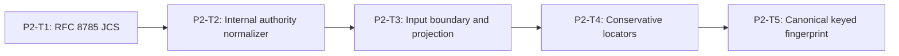

# Phase 2 Authority and Canonical Input Implementation Plan

> **For agentic workers:** REQUIRED SUB-SKILL: Use
> `superpowers:subagent-driven-development` or `superpowers:executing-plans`,
> plus `superpowers:test-driven-development`. Execute only the assigned task.

**Goal:** Convert a structurally valid public submission plus trusted adapter
observations into one authoritative, bounded, canonically fingerprinted engine
input without trusting caller stage/profile/content/tool claims.

**Architecture:** RFC 8785/JCS first. Engine-internal single-argument authority
normalizer validates the trusted input envelope and mints a **private branded**
`SandboxSecurityEvaluationRequest`. Trusted adapters never call this normalizer
for production evaluate paths; `evaluate()` does. Projection, locators, and
fingerprint reuse the same JCS path.

**Tech Stack:** TypeScript ESM on WSL Linux, `node:test`, `node:crypto`, no new
dependency.

---

## Phase Entry Gate

```bash
REPO_ROOT="$(git rev-parse --show-toplevel)"
cd "$REPO_ROOT"
pwd
git rev-parse --show-toplevel
git branch --show-current
git status --short

uname -a
command -v node
command -v npm
command -v git
node -p 'process.platform'
node --version
npm --version
test -f ./frontend/node_modules/typescript/bin/tsc
test "$(node -p 'process.platform')" = "linux"
for cmd in node npm git; do
  path="$(command -v "$cmd")"
  case "$path" in
    *.exe|*.cmd|*.bat|/mnt/c/*|/mnt/d/*)
      echo "Windows interop path not allowed for $cmd: $path" >&2
      exit 1
      ;;
  esac
done

node --experimental-strip-types --test shared/tests/sandbox-security-contract.spec.ts
npm run test:shared
node ./frontend/node_modules/typescript/bin/tsc --noEmit -p shared/tsconfig.json
```

## Task DAG



## P2-T1: RFC 8785 Canonical JSON

**Files:**

- Create: `engines/sandbox/src/security/canonical-json.ts`
- Create: `engines/sandbox/tests/sandbox-security-input.spec.ts`

**Locked exports (module; not final public index):**

```ts
canonicalizeSandboxSecurityJson(value: unknown): string;
sha256CanonicalJson(value: unknown): string;
sandboxSecurityJsonCanonicalEqual(left: unknown, right: unknown): boolean;
```

Frozen vectors RED as previously specified. Commit:
`feat(sandbox): add RFC 8785 canonical security JSON`.

## P2-T2: Engine-Internal Authoritative Evaluation Normalizer

**Files:**

- Create: `engines/sandbox/src/security/source-authority.ts`
- Create: `engines/sandbox/tests/sandbox-security-authority.spec.ts`

### Locked types / signature (engine-internal normalizer)

```ts
/** Trusted adapter-facing unvalidated envelope (exported later via index). */
export interface SandboxSecurityEvaluationRequestInput {
  submission: unknown;
  authoritative_context: unknown;
}

export type SandboxSecurityAuthoritativeEvaluationContextInput = /* exact Spec */;
export type AuthenticatedSourceObservationInput = /* exact Spec */;
export type AuthenticatedToolObservationInput = /* exact Spec */;

/**
 * Private branded validated request. NEVER exported from security/index.ts.
 * Only this module's normalizer may mint the brand.
 */
export type SandboxSecurityEvaluationRequest = {
  readonly submission: SandboxSecurityRequest;
  readonly authoritative_context: /* frozen authoritative */;
  readonly [/* unique symbol brand */]: true;
};

/**
 * ENGINE-INTERNAL only. Not in trusted adapter-facing export allowlist C.
 * Called from evaluate() after budget start, and from fingerprint service.
 */
export function normalizeSandboxSecurityEvaluationRequest(
  value: unknown
): Readonly<SandboxSecurityEvaluationRequest>;
```

Exact-key input shape for the normalizer:

```ts
{
  submission: unknown;
  authoritative_context: unknown;
}
```

### Authority equality

```text
text/plain: exact UTF-8 / normalized string equality
application/json: P2-T1 JCS only (no second equality path)
```

### What this task proves

- mismatch → stable authority error; no branded request returned;
- unknown keys rejected;
- JSON key-order invariance via JCS;
- unit tests may call the internal normalizer directly.

### What this task does not prove

- full evaluate-entry budget (P4-T6);
- detector zero-calls on engine path (P4-T6).

### RED inventory

```ts
test("REQ-SBX-GENERAL-001 accepts an exact simulation context", () => {});
test("REQ-SBX-GENERAL-001 accepts platform control only in enforcement", () => {});
test("REQ-SBX-GENERAL-001 rejects equal source ID with different value", () => {});
test("REQ-SBX-GENERAL-001 rejects stage profile and tool authority mismatch", () => {});
test("REQ-SBX-GENERAL-001 rejects reordered authoritative observations", () => {});
test("REQ-SBX-GENERAL-001 rejects invalid mode and authority pairs", () => {});
test("REQ-SBX-GENERAL-001 JSON authority equality uses engine JCS only", () => {});
test("REQ-SBX-GENERAL-001 authority mismatch produces no branded evaluation request", () => {});
test("REQ-SBX-GENERAL-001 rejects unknown keys on evaluation request envelope", () => {});
```

```ts
assert.throws(
  () =>
    normalizeSandboxSecurityEvaluationRequest({
      submission,
      authoritative_context
    }),
  (error: unknown) =>
    isSecurityError(error, "sandbox_security_authority_mismatch")
);
```

```bash
node --experimental-strip-types --test engines/sandbox/tests/sandbox-security-authority.spec.ts
git add engines/sandbox/src/security/source-authority.ts \
  engines/sandbox/tests/sandbox-security-authority.spec.ts
git commit -m "feat(sandbox): bind authoritative security context"
```

## P2-T3: Input Boundary and Canonical Projection

**Files:**

- Create: `engines/sandbox/src/security/input-boundary.ts`
- Modify: input + authority specs

```ts
prepareSandboxSecurityInput(
  request: Readonly<SandboxSecurityEvaluationRequest>
): Readonly<SandboxSecurityPreparedInput>;
```

Requires branded request. Projection REDs as before (authoritative-only, order,
exclude request_id, 512 KiB, NFKC, JCS reuse).

```bash
node --experimental-strip-types --test \
  engines/sandbox/tests/sandbox-security-input.spec.ts \
  engines/sandbox/tests/sandbox-security-authority.spec.ts
git commit -m "feat(sandbox): enforce canonical security input boundary"
```

## P2-T4: Conservative Locator Validation

**Files:** `locator.ts` + input specs. Locator RED matrix as before.

```bash
git commit -m "feat(sandbox): validate conservative security locators"
```

## P2-T5: Canonical Keyed Fingerprint Boundary

**Files:**

- Create: `engines/sandbox/src/security/canonical-fingerprint.ts`
- Modify: input specs + `docs/progress.md`

### Locked final adapter-facing names (owned here; exported in P5-T4)

```ts
export interface SandboxSecurityCanonicalFingerprintPort {
  fingerprintCanonicalBytes(canonicalBytes: Uint8Array): string;
}

export interface SandboxSecurityCanonicalFingerprintService {
  fingerprint(
    input: Readonly<SandboxSecurityEvaluationRequestInput>,
    port: SandboxSecurityCanonicalFingerprintPort
  ): string;
}

export function createSandboxSecurityCanonicalFingerprintService(
  /* optional deps if needed */
): SandboxSecurityCanonicalFingerprintService;
```

Service implementation:

1. calls **internal** `normalizeSandboxSecurityEvaluationRequest(input)`;
2. builds projection via P2-T3 helper / same JCS path;
3. passes ephemeral bytes to port;
4. returns only `hmac-sha256:<64hex>`;
5. does not return or retain canonical bytes after callback.

Internal helpers remain non-exported.

### RED

```ts
test("REQ-SBX-GENERAL-001 fingerprints the authoritative JCS projection", () => {});
test("REQ-SBX-GENERAL-001 fingerprint ignores correlation request ID", () => {});
test("REQ-SBX-GENERAL-001 rejects invalid and throwing fingerprint ports", () => {});
test("REQ-SBX-GENERAL-001 service does not expose canonical bytes after callback", () => {});
```

### Phase gate + commit

```bash
node --experimental-strip-types --test \
  engines/sandbox/tests/sandbox-security-authority.spec.ts \
  engines/sandbox/tests/sandbox-security-input.spec.ts
npm run test:shared
npm run test:repo
node ./frontend/node_modules/typescript/bin/tsc --noEmit -p shared/tsconfig.json
node ./frontend/node_modules/typescript/bin/tsc --noEmit -p engines/sandbox/tsconfig.json
git diff --check
git diff --summary
git status --short
git commit -m "feat(sandbox): add keyed canonical fingerprint boundary"
```

## Phase 2 Exit Gate

```bash
REPO_ROOT="$(git rev-parse --show-toplevel)"
cd "$REPO_ROOT"
test "$(node -p 'process.platform')" = "linux"
test -f ./frontend/node_modules/typescript/bin/tsc

node --experimental-strip-types --test \
  engines/sandbox/tests/sandbox-security-authority.spec.ts \
  engines/sandbox/tests/sandbox-security-input.spec.ts
npm run test:shared
npm run test:repo
node ./frontend/node_modules/typescript/bin/tsc --noEmit -p shared/tsconfig.json
node ./frontend/node_modules/typescript/bin/tsc --noEmit -p engines/sandbox/tsconfig.json
git diff --check
git diff --summary
git status --short
```

## Phase 2 Report Format

```text
Phase: 2 Authority and Canonical Input
Internal normalizer only (not public index):
Branded request not public:
Input envelope type locked:
JCS / projection / locator / fingerprint:
typecheck + repo gates:
Current status: PHASE_2_COMPLETE_PENDING_REVIEW
```
