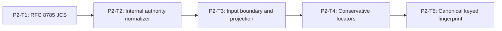

# Phase 2 Authority and Canonical Input Implementation Plan

> **For agentic workers:** REQUIRED SUB-SKILL: Use
> `superpowers:subagent-driven-development` or `superpowers:executing-plans`,
> plus `superpowers:test-driven-development`. Execute only the assigned task.
>
> This phase plan is self-contained. Do not consult older plan revisions.
>
> **BLOCKED:** Canonical Specs are `DRAFT_REVISED_PENDING_REAPPROVAL`.
> Do not execute until both are reapproved and the user changes active sprint.

**Goal:** Convert a structurally valid public submission plus trusted adapter
observations into one authoritative, bounded, canonically fingerprinted engine
input without trusting caller stage/profile/content/tool claims.

**Architecture:** RFC 8785/JCS first. Engine-internal single-argument authority
normalizer validates the approved `SandboxSecurityEvaluationRequest` envelope
and mints a **private branded** `NormalizedSandboxSecurityEvaluationRequest`.
Trusted adapters never call this normalizer for production evaluate paths;
`evaluate()` does. Projection, locators, and fingerprint reuse the same JCS
path.

**Tech Stack:** TypeScript ESM on WSL Linux, `node:test`, `node:crypto`, no new
dependency.

---

## Phase Entry Gate

```bash
REPO_ROOT="$(git rev-parse --show-toplevel)"
cd "$REPO_ROOT"
pwd
git rev-parse --show-toplevel
git branch --show-current
git status --short

uname -a
command -v node
command -v npm
command -v git
node -p 'process.platform'
node --version
npm --version
test -f ./frontend/node_modules/typescript/bin/tsc
test "$(node -p 'process.platform')" = "linux"
for cmd in node npm git; do
  path="$(command -v "$cmd")"
  case "$path" in
    *.exe|*.cmd|*.bat|/mnt/c/*|/mnt/d/*)
      echo "Windows interop path not allowed for $cmd: $path" >&2
      exit 1
      ;;
  esac
done

node --experimental-strip-types --test shared/tests/sandbox-security-contract.spec.ts
npm run test:shared
node ./frontend/node_modules/typescript/bin/tsc --noEmit -p shared/tsconfig.json
```

Expected: linux platform; Node `>=22.19.0`; Phase 1 shared contracts green; no
dependency install; no Windows interop paths for node/npm/git.

## Task DAG



Production file unique ownership (this phase):

| Production file | Sole owner |
| --- | --- |
| `engines/sandbox/src/security/canonical-json.ts` | P2-T1 |
| `engines/sandbox/src/security/source-authority.ts` | P2-T2 |
| `engines/sandbox/src/security/input-boundary.ts` | P2-T3 |
| `engines/sandbox/src/security/locator.ts` | P2-T4 |
| `engines/sandbox/src/security/canonical-fingerprint.ts` | P2-T5 |

Tests may be modified by later tasks when listed. Production sources: one Create
owner only; later tasks do not patch earlier production contracts (stop + rework
owner).

---

## P2-T1: RFC 8785 Canonical JSON

### Goal / Acceptance

Sole in-repository JCS implementation for security canonicalization. Frozen
vectors match Spec digests exactly. No new dependency. No authority, projection,
locator, or fingerprint behavior.

### Files

- Create: `engines/sandbox/src/security/canonical-json.ts`
- Create: `engines/sandbox/tests/sandbox-security-input.spec.ts`

### Dependencies / frozen inputs

- Phase 1 shared contracts complete and green at Phase Entry Gate.
- Spec RFC 8785 rules:
  1. reject non-finite numbers and lone surrogates;
  2. serialize finite numbers using ECMAScript `JSON.stringify` semantics,
     including `-0` as `0` and shortest round-trippable exponent form;
  3. escape strings as JSON, preserving Unicode code points and lowercase
     control escapes produced by ECMAScript;
  4. retain array order;
  5. sort object keys lexicographically by UTF-16 code units, including non-BMP
     surrogate pairs;
  6. emit no insignificant whitespace;
  7. encode the result as UTF-8.
- Fixed Spec vectors:
  - input `{"b":1,"a":-0}` → `{"a":0,"b":1}`
    SHA-256 `f4c1d8bd90d7ccd720aa5a69a67185fb9caf4f35926a4eacf53a86d0e70bdf88`
  - keys `a`, U+1F600, U+E000 in noncanonical order → `{"a":2,"😀":1,"":3}`
    SHA-256 `1a2ca2e262b24634fdefdb54f29503c59e9a41d86d83c34bee7043a658f53e50`
  - array U+000F, LF, U+00E9 → `["\u000f","\n","é"]`
    SHA-256 `7d550de21af7506682169e89f286fa0e9804b90ed455eda1aa188df70aa5fa88`

### Locked module exports (module-local; not final public index)

```ts
export function canonicalizeSandboxSecurityJson(value: unknown): string;
export function sha256CanonicalJson(value: unknown): string;
export function sandboxSecurityJsonCanonicalEqual(
  left: unknown,
  right: unknown
): boolean;
```

### Step 1: Exact RED test inventory

Fill every empty inventory body before the RED command. Do not leave empty
`test("name", () => {})` bodies.

```ts
test("REQ-SBX-GENERAL-001 JCS sorts object keys by UTF-16 code units", () => {
  // assert key order follows UTF-16 code units, not insertion order
});
test("REQ-SBX-GENERAL-001 JCS freezes vector b1 a-0 to a0 b1", () => {
  // input {"b":1,"a":-0} -> {"a":0,"b":1}
  // SHA-256: f4c1d8bd90d7ccd720aa5a69a67185fb9caf4f35926a4eacf53a86d0e70bdf88
});
test("REQ-SBX-GENERAL-001 JCS freezes emoji and U+E000 key order vector", () => {
  // keys a, U+1F600, U+E000 -> {"a":2,"😀":1,"":3}
  // SHA-256: 1a2ca2e262b24634fdefdb54f29503c59e9a41d86d83c34bee7043a658f53e50
});
test("REQ-SBX-GENERAL-001 JCS freezes control-char array vector", () => {
  // ["\u000f","\n","é"]
  // SHA-256: 7d550de21af7506682169e89f286fa0e9804b90ed455eda1aa188df70aa5fa88
});
test("REQ-SBX-GENERAL-001 JCS rejects non-finite numbers", () => {
  // NaN, Infinity, -Infinity must throw stable rejection
});
test("REQ-SBX-GENERAL-001 JCS rejects lone surrogates", () => {
  // unpaired high/low surrogates must throw stable rejection
});
test("REQ-SBX-GENERAL-001 JCS retains array order and drops insignificant whitespace", () => {
  // array order preserved; no spaces/newlines in output
});
test("REQ-SBX-GENERAL-001 canonical equality is byte-stable across key presentation order", () => {
  // sandboxSecurityJsonCanonicalEqual true for reordered object keys
});
test("REQ-SBX-GENERAL-001 sha256CanonicalJson returns lowercase 64 hex", () => {
  // /^[a-f0-9]{64}$/
});
```

### Step 2: RED command

```bash
node --experimental-strip-types --test engines/sandbox/tests/sandbox-security-input.spec.ts
```

### Expected RED failure and why valid

`ERR_MODULE_NOT_FOUND` for
`engines/sandbox/src/security/canonical-json.ts`, or assertion failures on
missing vector digests / missing exports. Not syntax, env, toolchain, or
Windows-interop errors.

### Step 3: Implementation boundary

Implement only RFC 8785 rules in `canonical-json.ts`.

Must implement:

```text
engines/sandbox/src/security/canonical-json.ts:
  - canonicalizeSandboxSecurityJson
  - sha256CanonicalJson
  - sandboxSecurityJsonCanonicalEqual
  - UTF-8 byte encoding of canonical text for digests
```

Must not:

- implement authority normalizer, projection, handles, trust, fingerprint, or
  engine evaluate;
- modify shared Phase 1 contracts;
- add production dependencies;
- create `source-authority.ts`, `input-boundary.ts`, `locator.ts`, or
  `canonical-fingerprint.ts`.

### Step 4: GREEN command and expected result

```bash
node --experimental-strip-types --test engines/sandbox/tests/sandbox-security-input.spec.ts
```

All P2-T1 tests pass with exact vector digests and lowercase 64-hex hashes.

### Step 5: Broader gates

None for this task.

### Step 6: Exact git add paths + commit

```bash
git add engines/sandbox/src/security/canonical-json.ts \
  engines/sandbox/tests/sandbox-security-input.spec.ts
git commit -m "feat(sandbox): add RFC 8785 canonical security JSON"
```

### Stop/report

Stop after commit. Return task evidence. Do not start P2-T2.

---

## P2-T2: Engine-Internal Authoritative Evaluation Normalizer

### Goal / Acceptance

Lock approved adapter-facing evaluation request types. Implement the
engine-internal normalizer that validates the exact-key envelope, shared request
structure, authoritative context, JCS equality, stage/profile/source/tool match,
and mints private branded `NormalizedSandboxSecurityEvaluationRequest`.

Never invent public `*Input` request type names. Never export brand or
normalizer from final `security/index.ts` (P5-T4 closes exports).

### Files

- Create: `engines/sandbox/src/security/source-authority.ts`
- Create: `engines/sandbox/tests/sandbox-security-authority.spec.ts`

### Dependencies / frozen inputs

- P2-T1 JCS helpers:
  - `canonicalizeSandboxSecurityJson`
  - `sha256CanonicalJson`
  - `sandboxSecurityJsonCanonicalEqual`
- Phase 1 `normalizeSandboxSecurityRequest` and public request types from
  `shared`.
- Spec authority match rules:
  - public `stage` equals authoritative `stage`;
  - public `policy_profile_id` equals authoritative `policy_profile_id`;
  - public content and authoritative sources have the same count and semantic
    order;
  - each pair has equal source ID, claimed/authoritative source type, media type,
    normalized value, and provenance;
  - tool absence/presence and every call ID, name, target, and normalized
    argument value are equal;
  - same source ID without equal value is insufficient;
  - mismatch → `sandbox_security_authority_mismatch` before hashing/detectors;
  - missing/duplicate/malformed/unauthorized observations →
    `sandbox_security_source_authority_invalid`.
- Authority equality:
  - `text/plain`: exact UTF-8 / normalized string equality;
  - `application/json`: P2-T1 JCS only (no second equality path).

### Locked types / signature

```ts
/** Approved Spec adapter-facing evaluation request (exported later via index D). */
export interface SandboxSecurityEvaluationRequest {
  submission: Readonly<SandboxSecurityRequest>;
  authoritative_context:
    Readonly<SandboxSecurityAuthoritativeEvaluationContext>;
}

export interface AuthenticatedSourceObservation {
  source_id: string;
  authority_kind:
    | "platform_control"
    | "integration_observation"
    | "simulation_observation";
  source_type: SandboxSecurityClaimedSourceType;
  media_type: "text/plain" | "application/json";
  value: string | SandboxSecurityJsonValue;
  provenance_ref: string;
}

export interface AuthenticatedToolObservation {
  authority_kind: "integration_observation" | "simulation_observation";
  call_id: string;
  tool_name: string;
  target?: string;
  arguments: SandboxSecurityJsonValue;
}

export interface SandboxSecurityAuthoritativeEvaluationContext {
  schema_version: "sandbox-security-authoritative-context.v1";
  evaluation_mode: "simulation" | "enforcement";
  stage: SandboxSecurityStage;
  policy_profile_id: SandboxSecurityPolicyProfileId;
  sources: readonly AuthenticatedSourceObservation[];
  tool_request?: Readonly<AuthenticatedToolObservation>;
}

declare const sandboxSecurityEvaluationRequestBrand: unique symbol;

/**
 * Private branded validated request. NEVER exported from security/index.ts.
 * Only this module's normalizer may mint the brand.
 */
export type NormalizedSandboxSecurityEvaluationRequest = {
  readonly submission: SandboxSecurityRequest;
  readonly authoritative_context: SandboxSecurityAuthoritativeEvaluationContext;
  readonly [sandboxSecurityEvaluationRequestBrand]: true;
};

/**
 * ENGINE-INTERNAL only. Not in trusted adapter-facing export allowlist C.
 * Called from evaluate() after budget start, and from fingerprint service.
 */
export function normalizeSandboxSecurityEvaluationRequest(
  value: unknown
): Readonly<NormalizedSandboxSecurityEvaluationRequest>;
```

Exact-key input shape for the normalizer (runtime `unknown`):

```ts
{
  submission: unknown;
  authoritative_context: unknown;
}
```

### Step 1: Exact RED test inventory

Fill every empty inventory body before the RED command.

```ts
test("REQ-SBX-GENERAL-001 accepts an exact simulation context", () => {
  // valid simulation_observation envelope mints branded request
});
test("REQ-SBX-GENERAL-001 accepts platform control only in enforcement", () => {
  // enforcement + platform_control accepted; simulation + platform_control rejected
});
test("REQ-SBX-GENERAL-001 rejects equal source ID with different value", () => {
  // same source_id, different value → sandbox_security_authority_mismatch
});
test("REQ-SBX-GENERAL-001 rejects stage profile and tool authority mismatch", () => {
  // stage/profile/tool field mismatch → sandbox_security_authority_mismatch
});
test("REQ-SBX-GENERAL-001 rejects reordered authoritative observations", () => {
  // same multiset different order → authority mismatch
});
test("REQ-SBX-GENERAL-001 rejects invalid mode and authority pairs", () => {
  // pairs outside Spec mode/authority table → source_authority_invalid
});
test("REQ-SBX-GENERAL-001 JSON authority equality uses engine JCS only", () => {
  // reordered JSON object keys equal under JCS; no second equality path
});
test("REQ-SBX-GENERAL-001 authority mismatch produces no normalized branded request", () => {
  // throw/error path yields no branded object
});
test("REQ-SBX-GENERAL-001 rejects unknown keys on evaluation request envelope", () => {
  // exact-key only: submission + authoritative_context
});
test("REQ-SBX-GENERAL-001 rejects missing authoritative schema_version", () => {
  // schema_version must be sandbox-security-authoritative-context.v1
});
test("REQ-SBX-GENERAL-001 rejects duplicate or malformed source observations", () => {
  // duplicate source_id / malformed fields → source_authority_invalid
});
test("REQ-SBX-GENERAL-001 rejects tool presence mismatch between submission and authority", () => {
  // tool present on one side only → authority_mismatch
});
test("REQ-SBX-GENERAL-001 mints only NormalizedSandboxSecurityEvaluationRequest brand", () => {
  // brand present only after successful normalize
});
test("REQ-SBX-GENERAL-001 defensive copy freezes submission and authoritative_context", () => {
  // recursive freeze / defensive copy; mutation of input does not mutate result
});
```

### Step 2: RED command

```bash
node --experimental-strip-types --test engines/sandbox/tests/sandbox-security-authority.spec.ts
```

### Expected RED failure and why valid

Module missing for `source-authority.ts`, or throws not-yet-implemented, or
mismatch fixtures not yet mapped to
`sandbox_security_authority_mismatch` /
`sandbox_security_source_authority_invalid`. Not env/toolchain errors.

### Step 3: Implementation boundary

Implement types + normalizer only in `source-authority.ts`.

Must:

- call shared `normalizeSandboxSecurityRequest` for structural submission
  validation;
- use P2-T1 JCS for JSON authority equality;
- mint only `NormalizedSandboxSecurityEvaluationRequest`;
- reject with stable content-free error codes on mismatch/invalid authority.

Must not:

- invent public `SandboxSecurityEvaluationInput` or other `*Input` request names;
- export normalizer or branded type from final index (P5-T4 closes);
- implement projection, handles, trust derivation for prepared input, fingerprint,
  or engine evaluate;
- modify Phase 1 shared files;
- modify `canonical-json.ts`;
- create `input-boundary.ts`, `locator.ts`, or `canonical-fingerprint.ts`.

### Step 4: GREEN command and expected result

```bash
node --experimental-strip-types --test engines/sandbox/tests/sandbox-security-authority.spec.ts
```

All authority tests pass. Mismatch throws stable authority error with no brand.

### Step 5: Broader gates

None for this task.

### Step 6: Exact git add paths + commit

```bash
git add engines/sandbox/src/security/source-authority.ts \
  engines/sandbox/tests/sandbox-security-authority.spec.ts
git commit -m "feat(sandbox): bind authoritative security context"
```

### Stop/report

Stop after commit. Return task evidence. Do not start P2-T3.

---

## P2-T3: Input Boundary and Canonical Projection

### Goal / Acceptance

Build authoritative-only projection and prepared input from the internal branded
request. Enforce 512 KiB projection bound before detectors. Exclude public
`request_id` from canonical projection. Mint evaluation-bound private handles.
Produce authority-bound content without trust. Ordinary hashes remain
engine-private; P3-T5 is the sole trust-derivation owner.

### Files

- Create: `engines/sandbox/src/security/input-boundary.ts`
- Modify: `engines/sandbox/tests/sandbox-security-input.spec.ts`

### Dependencies / frozen inputs

- P2-T2 `NormalizedSandboxSecurityEvaluationRequest` and authority types from
  `source-authority.ts`.
- P2-T1 JCS helpers from `canonical-json.ts`.
- Spec projection shape and 512 KiB bound.
- Revised Spec authority-bound content shape; P3-T5 trust ownership.

### Locked contracts (P2-T3 owns; Master-exact)

Phase 2 does not define or derive `SandboxSecurityTrustClass`.

Private handles (engine-internal brands; constructors never exported):

```ts
declare const sandboxSecuritySourceHandleBrand: unique symbol;
declare const sandboxSecurityCallHandleBrand: unique symbol;

export type SandboxSecuritySourceHandle =
  string & { readonly [sandboxSecuritySourceHandleBrand]: true };

export type SandboxSecurityCallHandle =
  string & { readonly [sandboxSecurityCallHandleBrand]: true };
```

Handle generation:

```text
evaluation_nonce = 128-bit cryptographically random lowercase hex
evaluation_nonce grammar = ^[a-f0-9]{32}$
source_handle = "hsrc:" + evaluation_nonce + ":" + four_digit_ordinal
source_handle grammar = ^hsrc:[a-f0-9]{32}:(000[1-9]|00[1-5][0-9]|006[0-4])$
call_handle = "hcall:" + evaluation_nonce + ":0000"
call_handle grammar = ^hcall:[a-f0-9]{32}:0000$
```

Source ordinals follow authoritative source semantic order from `0001` through
at most `0064`. Each prepare/evaluate mints a distinct nonce. Duplicate,
malformed, or cross-evaluation handles are invalid. Handles and constructors
remain Engine-internal.

Canonical projection (engine-private; JCS is key-order authority):

```ts
export interface SandboxSecurityCanonicalEvaluationProjection {
  schema_version: "sandbox-security-canonical-evaluation.v1";
  evaluation_mode: "simulation" | "enforcement";
  stage: SandboxSecurityStage;
  policy_profile_id: SandboxSecurityPolicyProfileId;
  sources: readonly AuthenticatedSourceObservation[];
  tool_request?: Readonly<AuthenticatedToolObservation>;
}
```

Normalized content / tool / prepared input:

```ts
export interface SandboxSecurityAuthorityBoundContent {
  readonly source_handle: SandboxSecuritySourceHandle;
  readonly source_id: string;
  readonly source_type: SandboxSecurityClaimedSourceType;
  readonly media_type: "text/plain" | "application/json";
  readonly authority_kind:
    | "platform_control"
    | "integration_observation"
    | "simulation_observation";
  readonly value: string | SandboxSecurityJsonValue;
  readonly provenance_ref: string;
  /** Frozen ordinary byte vector: integers 0..255 only; defensive copy. */
  readonly original_utf8_bytes: readonly number[];
  readonly original_value_sha256: string;
  readonly comparison_value: string | SandboxSecurityJsonValue;
}

export interface SandboxSecurityNormalizedToolRequest {
  readonly call_handle: SandboxSecurityCallHandle;
  readonly call_id: string;
  readonly authority_kind: "integration_observation" | "simulation_observation";
  readonly tool_name: string;
  readonly target?: string;
  readonly arguments: SandboxSecurityJsonValue;
  readonly arguments_jcs_sha256: string;
  readonly has_target: boolean;
}

export interface SandboxSecurityPreparedInput {
  readonly evaluation_nonce: string;
  readonly request_id: string;
  readonly evaluation_mode: "simulation" | "enforcement";
  readonly stage: SandboxSecurityStage;
  readonly policy_profile_id: SandboxSecurityPolicyProfileId;
  readonly contents: readonly SandboxSecurityAuthorityBoundContent[];
  readonly tool_request?: Readonly<SandboxSecurityNormalizedToolRequest>;
  readonly canonical_projection: Readonly<SandboxSecurityCanonicalEvaluationProjection>;
  readonly canonical_projection_sha256: string;
}

export function prepareSandboxSecurityInput(
  request: Readonly<NormalizedSandboxSecurityEvaluationRequest>
): Readonly<SandboxSecurityPreparedInput>;

/**
 * P2-T3 sole owner of ephemeral canonical encoding.
 * Returns a fresh Engine-owned Uint8Array each call.
 */
export function encodeSandboxSecurityCanonicalProjection(
  projection: Readonly<SandboxSecurityCanonicalEvaluationProjection>
): Uint8Array;
```

Byte ownership (locked):

```text
PreparedInput is recursively frozen.
Ephemeral Uint8Array values are not members of PreparedInput and are not
claimed to be frozen.
original_utf8_bytes: readonly number[] (0..255); defensive copy; recursively
  frozen ordinary array; used by byte-range locators; never public
encodeSandboxSecurityCanonicalProjection: fresh array per call; function-local
  ephemeral; not stored on PreparedInput; not on raw snapshot; not in registry;
  not returned to detectors; fingerprint port gets independent copy; drop after
  callback / evaluate settlement
```

Security boundaries:

```text
source_id / call_id: visible on prepared input for raw-local/sanitizer only;
  never on public findings/decisions (tokens later)
provenance_ref: raw-local/sanitizer only; never public decision/findings
value / original_utf8_bytes: raw-local + sanitizer only; never external Judge
comparison_value: detector-only NFKC/comparison view; never changes hashes
original_value_sha256 / arguments_jcs_sha256: engine-private ordinary hashes;
  never enter public findings, decisions, or durable audit
handles: evaluation-bound; never public; constructors/brands never exported
public request_id: correlation only; excluded from canonical projection
512 KiB: measure JCS projection bytes via encode helper; reject over 512 KiB
```

Never export from final `security/index.ts`: PreparedInput,
AuthorityBoundContent,
NormalizedTool, handle brands, `prepareSandboxSecurityInput`,
`encodeSandboxSecurityCanonicalProjection`.

### Step 1: Exact RED test inventory

Fill every empty inventory body before the RED command. RED inventory must cover
all projection rules, authority-bound no-trust shape, handle binding, 512 KiB,
freeze, and
no `request_id` in projection.

```ts
test("REQ-SBX-GENERAL-001 projection uses authoritative sources only", () => {
  // projection.sources === authoritative observations, not public claims alone
});
test("REQ-SBX-GENERAL-001 projection preserves authoritative observation order", () => {
  // semantic order preserved; reorder is different context
});
test("REQ-SBX-GENERAL-001 projection excludes correlation request_id", () => {
  // JCS projection object has no request_id field
});
test("REQ-SBX-GENERAL-001 projection includes source and call IDs", () => {
  // source_id and call_id remain in projection subjects
});
test("REQ-SBX-GENERAL-001 projection schema_version is sandbox-security-canonical-evaluation.v1", () => {
  // exact schema_version string
});
test("REQ-SBX-GENERAL-001 rejects projection larger than 512 KiB before detectors", () => {
  // SANDBOX_SECURITY_MAX_REQUEST_BYTES = 512 * 1024; over bound rejects
});
test("REQ-SBX-GENERAL-001 accepts projection at exactly 512 KiB boundary", () => {
  // equal-to-limit accepted; above rejected
});
test("REQ-SBX-GENERAL-001 projection reuses engine JCS path only", () => {
  // same digest as sha256CanonicalJson(projection)
});
test("REQ-SBX-GENERAL-001 NFKC does not change hash material", () => {
  // comparison_value may NFKC; original_value_sha256 uses original bytes only
});
test("REQ-SBX-GENERAL-001 prepareSandboxSecurityInput requires normalized branded request", () => {
  // unbranded / raw envelope rejected; only NormalizedSandboxSecurityEvaluationRequest
});
test("REQ-SBX-GENERAL-001 prepared input is recursively frozen defensive copy", () => {
  // Object.isFrozen deep; mutation of input does not mutate prepared
});
test("REQ-SBX-GENERAL-001 prepared input contains no mutable typed-array fields", () => {
  // no Uint8Array/ArrayBufferView fields on PreparedInput or AuthorityBoundContent
});
test("REQ-SBX-GENERAL-001 original byte vectors are frozen defensive arrays", () => {
  // original_utf8_bytes is readonly number[] 0..255; Object.isFrozen; copy-on-create
});
test("REQ-SBX-GENERAL-001 canonical projection encoder returns a fresh byte array per call", () => {
  // encodeSandboxSecurityCanonicalProjection(p) !== encodeSandboxSecurityCanonicalProjection(p)
});
test("REQ-SBX-GENERAL-001 mutating one encoded byte array cannot affect later encoding", () => {
  // mutate first encode result; second encode unchanged
});
test("REQ-SBX-GENERAL-001 text hashes use exact original UTF-8 bytes", () => {
  // original_utf8_bytes + original_value_sha256 for text/plain
});
test("REQ-SBX-GENERAL-001 JSON and tool argument hashes use JCS bytes", () => {
  // application/json content and arguments_jcs_sha256 use JCS
});
test("REQ-SBX-GENERAL-001 Phase 2 content is authority-bound without trust_class", () => {
  // prepared contents expose authority_kind and source_type but no trust_class
});
test("REQ-SBX-GENERAL-001 Phase 2 contains no independent trust mapping table", () => {
  // static scan: input-boundary.ts cannot derive SandboxSecurityTrustClass
});
test("REQ-SBX-GENERAL-001 evaluation nonce is lowercase 128-bit hex", () => {
  // grammar ^[a-f0-9]{32}$ and a fresh nonce per evaluation
});
test("REQ-SBX-GENERAL-001 source handle uses four-digit semantic ordinal", () => {
  // source_handle = hsrc:<32-lowercase-hex>:0001..0064
});
test("REQ-SBX-GENERAL-001 call handle uses 0000 ordinal", () => {
  // call_handle = hcall:<32-lowercase-hex>:0000
});
test("REQ-SBX-GENERAL-001 handles are evaluation-bound and unique per prepare", () => {
  // distinct evaluation_nonce across prepares; cross-evaluation reuse invalid
});
test("REQ-SBX-GENERAL-001 malformed handle cannot enter an engine registry", () => {
  // bad nonce/ordinal/prefix is rejected before detector execution
});
test("REQ-SBX-GENERAL-001 prepared input retains request_id for correlation only", () => {
  // prepared.request_id present; projection excludes it
});
test("REQ-SBX-GENERAL-001 ordinary hashes remain private fields on prepared input", () => {
  // original_value_sha256 / arguments_jcs_sha256 present on private types only
});
test("REQ-SBX-GENERAL-001 PreparedInput does not store canonical_projection_bytes", () => {
  // only projection object + sha256; encode helper produces ephemeral bytes
});
test("REQ-SBX-GENERAL-001 raw snapshot exposes no canonical projection bytes", () => {
  // any raw-snapshot-shaped view must not include projection bytes
});
test("REQ-SBX-GENERAL-001 tool has_target reflects optional target presence", () => {
  // has_target true only when target present
});
```

### Step 2: RED command

```bash
node --experimental-strip-types --test engines/sandbox/tests/sandbox-security-input.spec.ts
```

### Expected RED failure and why valid

Missing `input-boundary.ts`, or failing assertions for projection rules,
authority-bound/no-trust shape, handle binding, 512 KiB bound, freeze, or
`request_id` exclusion. Not
env/toolchain errors.

### Step 3: Implementation boundary

Implement projection + prepared input only in `input-boundary.ts`.

Must:

- accept only `Readonly<NormalizedSandboxSecurityEvaluationRequest>`;
- build projection from authoritative observations only;
- exclude public `request_id` from projection;
- measure JCS projection bytes and reject over 512 KiB before detectors;
- mint evaluation_nonce + `hsrc:` / `hcall:` handles;
- preserve authority data without deriving or storing trust_class;
- set text hashes from original UTF-8 byte vectors and JSON/tool hashes from JCS;
- store original_utf8_bytes as frozen readonly number[] (0..255), never Uint8Array;
- implement encodeSandboxSecurityCanonicalProjection as sole ephemeral encoder;
- set `comparison_value` without affecting hashes;
- recursively freeze defensive copies of PreparedInput (no typed-array members).

Must not:

- run detectors;
- implement locator validation (P2-T4);
- implement fingerprint service (P2-T5);
- modify `canonical-json.ts` or `source-authority.ts`;
- export PreparedInput types / handle brands / prepare / encode from final index;
- put ordinary hashes on public findings/decisions;
- store Uint8Array fields on PreparedInput or AuthorityBoundContent;
- put canonical projection bytes on a raw-snapshot-shaped structure.

If branded request shape is wrong, stop for P2-T2 rework. Do not silently patch
P2-T2 production contracts.

### Step 4: GREEN command and expected result

```bash
node --experimental-strip-types --test engines/sandbox/tests/sandbox-security-input.spec.ts
```

All P2-T1 + P2-T3 projection/authority/handle/bound tests pass.

### Step 5: Broader gates

None for this task.

### Step 6: Exact git add paths + commit

```bash
git add engines/sandbox/src/security/input-boundary.ts \
  engines/sandbox/tests/sandbox-security-input.spec.ts
git commit -m "feat(sandbox): enforce canonical security input boundary"
```

### Stop/report

Stop after commit. Return task evidence. Do not start P2-T4.

---

## P2-T4: Conservative Locator Validation

### Goal / Acceptance

Validate content and tool locators used by detector candidates. Unknown or
unsafe locators fail closed. `text_byte_range` only with proven exact half-open
original UTF-8 code-point-aligned mapping; otherwise fall back to
`whole_source`. Restricted RFC 6901 JSON pointers only. Tool pointers apply to
arguments only.

### Files

- Create: `engines/sandbox/src/security/locator.ts`
- Modify: `engines/sandbox/tests/sandbox-security-input.spec.ts`

### Dependencies / frozen inputs

- P2-T3 prepared input / normalized content and tool shapes:
  - `SandboxSecurityAuthorityBoundContent` with `original_utf8_bytes`, `media_type`,
    `value`
  - `SandboxSecurityNormalizedToolRequest` with `arguments`, `has_target`
- Spec locator unions and JSON pointer grammar:
  - content: `whole_source` | `text_byte_range` | `json_pointer`
  - tool: `whole_arguments` | `json_pointer`
  - pointer max 512 UTF-8 bytes;
  - every unescaped object token matches `^[A-Za-z0-9_.-]{1,64}$`;
  - array tokens are canonical decimal indexes with no leading zero except `0`;
  - illegal/over-long pointers fail closed for validation (or degrade per Spec
    rules under test assertions).

### Locked contracts

```ts
export type SandboxSecurityContentLocator =
  | { kind: "whole_source" }
  | { kind: "text_byte_range"; start_byte: number; end_byte: number }
  | { kind: "json_pointer"; pointer: string };

export type SandboxSecurityToolLocator =
  | { kind: "whole_arguments" }
  | { kind: "json_pointer"; pointer: string };

export function validateSandboxSecurityContentLocator(
  locator: unknown,
  content: Readonly<SandboxSecurityAuthorityBoundContent>
): SandboxSecurityContentLocator | null;

export function validateSandboxSecurityToolLocator(
  locator: unknown,
  tool: Readonly<SandboxSecurityNormalizedToolRequest>
): SandboxSecurityToolLocator | null;
```

Rules:

```text
whole_source: always valid content locator
text_byte_range: half-open [start_byte, end_byte); integers; 0 <= start < end <= byteLength;
  start/end must be code-point boundaries on original_utf8_bytes;
  split multi-byte code point → reject or whole_source per matrix tests
  unproven/ambiguous mapping → whole_source
json_pointer content: restricted RFC 6901; exact-key object; no extra keys
whole_arguments: always valid tool locator for arguments component
tool json_pointer: arguments only; never tool_name or target components
unknown kind / extra keys / negative / inverted ranges → null (fail closed)
```

### Step 1: Exact RED test inventory

Fill every empty inventory body before the RED command. Full locator RED matrix:

```ts
test("REQ-SBX-GENERAL-001 accepts whole_source content locator", () => {
  // { kind: "whole_source" } exact keys
});
test("REQ-SBX-GENERAL-001 accepts exact half-open code-point-aligned text_byte_range", () => {
  // proven [start,end) on original_utf8_bytes boundaries
});
test("REQ-SBX-GENERAL-001 rejects text_byte_range that splits multi-byte code points", () => {
  // e.g. mid-UTF-8 multi-byte sequence → null or whole_source per assert
});
test("REQ-SBX-GENERAL-001 falls back to whole_source when byte range mapping is unproven", () => {
  // ambiguous/one-to-many/many-to-one/untracked → whole_source
});
test("REQ-SBX-GENERAL-001 accepts restricted RFC 6901 json_pointer on content", () => {
  // valid object/array tokens under restricted grammar
});
test("REQ-SBX-GENERAL-001 rejects over-long json_pointer and illegal tokens", () => {
  // >512 bytes, illegal object tokens, bad escapes
});
test("REQ-SBX-GENERAL-001 rejects array tokens with leading zeros except zero", () => {
  // "01" invalid; "0" valid
});
test("REQ-SBX-GENERAL-001 accepts whole_arguments tool locator", () => {
  // { kind: "whole_arguments" }
});
test("REQ-SBX-GENERAL-001 accepts tool json_pointer on arguments only", () => {
  // pointer restricted to tool.arguments tree
});
test("REQ-SBX-GENERAL-001 rejects tool locator on tool_name or target components", () => {
  // tool_name/target are whole-field only; locator validators do not authorize them
});
test("REQ-SBX-GENERAL-001 rejects unknown locator kinds and extra keys", () => {
  // exact-key unions only
});
test("REQ-SBX-GENERAL-001 rejects negative and inverted byte ranges", () => {
  // start < 0, end < start, non-integers
});
test("REQ-SBX-GENERAL-001 rejects text_byte_range beyond original_utf8_bytes length", () => {
  // end > byteLength
});
test("REQ-SBX-GENERAL-001 rejects inherited and accessor locator fields", () => {
  // prototype/inherited/accessor pollution
});
test("REQ-SBX-GENERAL-001 rejects json_pointer on text/plain content when path is non-applicable", () => {
  // content media_type text/plain cannot host JSON pointer paths
});
```

### Step 2: RED command

```bash
node --experimental-strip-types --test engines/sandbox/tests/sandbox-security-input.spec.ts
```

### Expected RED failure and why valid

Missing `locator.ts` or failing matrix cases for split code points, illegal
pointers, extra keys, negative/inverted ranges. Not env/toolchain errors.

### Step 3: Implementation boundary

Implement locator validation only in `locator.ts`.

Must:

- validate exact-key content and tool locator unions;
- enforce half-open code-point-aligned `text_byte_range` against
  `original_utf8_bytes`;
- enforce restricted RFC 6901 pointer grammar and 512-byte max;
- fail closed with `null` for unknown/unsafe locators;
- fall back to `whole_source` when byte-range mapping is unproven.

Must not:

- change projection hash material;
- implement detector result normalization (Phase 3);
- modify `input-boundary.ts`, `source-authority.ts`, or `canonical-json.ts`;
- invent new locator kinds.

If prepared-input shape lacks required original-byte maps, stop for P2-T3 rework.
Do not silently patch P2-T3 production contracts.

### Step 4: GREEN command and expected result

```bash
node --experimental-strip-types --test engines/sandbox/tests/sandbox-security-input.spec.ts
```

Full locator matrix green. Prior P2-T1/P2-T3 tests remain green.

### Step 5: Broader gates

None for this task.

### Step 6: Exact git add paths + commit

```bash
git add engines/sandbox/src/security/locator.ts \
  engines/sandbox/tests/sandbox-security-input.spec.ts
git commit -m "feat(sandbox): validate conservative security locators"
```

### Stop/report

Stop after commit. Return task evidence. Do not start P2-T5.

---

## P2-T5: Canonical Keyed Fingerprint Boundary

### Goal / Acceptance

Fingerprint service accepts approved `SandboxSecurityEvaluationRequest`, reuses
the internal normalizer + JCS projection path, returns only
`hmac-sha256:<64hex>`, and never retains canonical bytes after the port callback.

### Files

- Create: `engines/sandbox/src/security/canonical-fingerprint.ts`
- Modify: `engines/sandbox/tests/sandbox-security-input.spec.ts`
- Modify: `docs/progress.md`

### Dependencies / frozen inputs

- P2-T2 internal normalizer:
  - `normalizeSandboxSecurityEvaluationRequest`
  - approved `SandboxSecurityEvaluationRequest`
- P2-T3 projection / prepared path:
  - same authoritative projection shape and JCS encoding as
    `prepareSandboxSecurityInput`
- P2-T1 JCS helpers
- Spec fingerprint port grammar: `^hmac-sha256:[a-f0-9]{64}$`
- Invalid/throwing port → `sandbox_security_internal_invalid`
- Authority mismatch rejects before port call (zero port invocations)

### Locked final adapter-facing names (owned here; exported in P5-T4)

```ts
export interface SandboxSecurityCanonicalFingerprintPort {
  fingerprintCanonicalBytes(canonicalBytes: Uint8Array): string;
}

export interface SandboxSecurityCanonicalFingerprintService {
  fingerprint(
    request: Readonly<SandboxSecurityEvaluationRequest>,
    port: SandboxSecurityCanonicalFingerprintPort
  ): string;
}

export function createSandboxSecurityCanonicalFingerprintService():
  SandboxSecurityCanonicalFingerprintService;
```

Service implementation sequence:

```text
1. call internal normalizeSandboxSecurityEvaluationRequest(request)
2. build authoritative projection via same path as P2-T3 / same JCS path
3. bytes = encodeSandboxSecurityCanonicalProjection(projection)  // fresh array
4. pass independent ephemeral bytes to port.fingerprintCanonicalBytes
5. validate port output matches ^hmac-sha256:[a-f0-9]{64}$
6. return only the keyed string
7. drop all references to the byte array after callback
```

### Step 1: Exact RED test inventory

Fill every empty inventory body before the RED command.

```ts
test("REQ-SBX-GENERAL-001 fingerprints the authoritative JCS projection", () => {
  // port receives bytes equal to JCS(projection); output returned
});
test("REQ-SBX-GENERAL-001 fingerprint ignores correlation request ID", () => {
  // different request_id same authority → same port bytes
});
test("REQ-SBX-GENERAL-001 rejects invalid and throwing fingerprint ports", () => {
  // invalid grammar / thrown error → sandbox_security_internal_invalid
});
test("REQ-SBX-GENERAL-001 service does not expose canonical bytes after callback", () => {
  // return value is string only; no retained bytes field on service
});
test("REQ-SBX-GENERAL-001 fingerprint rejects authority mismatch before port call", () => {
  // zero port invocations on authority_mismatch
});
test("REQ-SBX-GENERAL-001 fingerprint port output must match hmac-sha256 64hex grammar", () => {
  // ^hmac-sha256:[a-f0-9]{64}$ only
});
test("REQ-SBX-GENERAL-001 fingerprint accepts approved SandboxSecurityEvaluationRequest shape", () => {
  // submission + authoritative_context; not *Input names
});
test("REQ-SBX-GENERAL-001 fingerprint reuses internal normalizer not a second JCS implementation", () => {
  // same digest path as prepare/evaluate projection
});
test("REQ-SBX-GENERAL-001 fingerprint encoding is independent of PreparedInput fields", () => {
  // uses encodeSandboxSecurityCanonicalProjection; does not read stored bytes field
});
```

### Step 2: RED command

```bash
node --experimental-strip-types --test engines/sandbox/tests/sandbox-security-input.spec.ts
```

### Expected RED failure and why valid

Missing `canonical-fingerprint.ts`, or failing port grammar / no-byte-retention /
authority-before-port assertions. Not env/toolchain errors.

### Step 3: Implementation boundary

Implement fingerprint module only in `canonical-fingerprint.ts`.

Must:

- accept approved `SandboxSecurityEvaluationRequest`;
- call **internal** `normalizeSandboxSecurityEvaluationRequest`;
- reuse P2-T3 projection / P2-T1 JCS path (no second JCS implementation);
- pass ephemeral bytes to port;
- return only `hmac-sha256:<64hex>`;
- map invalid/throwing port to `sandbox_security_internal_invalid`;
- reject authority mismatch before port call.

Must not:

- implement evaluate budget ownership (P4-T6);
- export internal normalizer or branded request;
- invent public `*Input` request types;
- retain canonical bytes after callback;
- modify `source-authority.ts`, `input-boundary.ts`, `locator.ts`, or
  `canonical-json.ts`;
- duplicate JCS logic outside the engine JCS module.

### Step 4: GREEN command and expected result

```bash
node --experimental-strip-types --test \
  engines/sandbox/tests/sandbox-security-authority.spec.ts \
  engines/sandbox/tests/sandbox-security-input.spec.ts
```

Fingerprint tests pass. Authority and input suites remain green.

### Step 5: Broader gates

```bash
npm run test:shared
npm run test:repo
node ./frontend/node_modules/typescript/bin/tsc --noEmit -p shared/tsconfig.json
node ./frontend/node_modules/typescript/bin/tsc --noEmit -p engines/sandbox/tsconfig.json
git diff --check
git diff --summary
git status --short
```

### Step 6: Exact git add paths + commit

```bash
git add engines/sandbox/src/security/canonical-fingerprint.ts \
  engines/sandbox/tests/sandbox-security-input.spec.ts \
  docs/progress.md
git commit -m "feat(sandbox): add keyed canonical fingerprint boundary"
```

### Stop/report

Stop for Phase 2 review. Return phase evidence. Do not start Phase 3.

---

## Phase 2 Exit Gate

```bash
REPO_ROOT="$(git rev-parse --show-toplevel)"
cd "$REPO_ROOT"
test "$(node -p 'process.platform')" = "linux"
test -f ./frontend/node_modules/typescript/bin/tsc
for cmd in node npm git; do
  path="$(command -v "$cmd")"
  case "$path" in
    *.exe|*.cmd|*.bat|/mnt/c/*|/mnt/d/*)
      echo "Windows interop path not allowed for $cmd: $path" >&2
      exit 1
      ;;
  esac
done

node --experimental-strip-types --test \
  engines/sandbox/tests/sandbox-security-authority.spec.ts \
  engines/sandbox/tests/sandbox-security-input.spec.ts
npm run test:shared
npm run test:repo
node ./frontend/node_modules/typescript/bin/tsc --noEmit -p shared/tsconfig.json
node ./frontend/node_modules/typescript/bin/tsc --noEmit -p engines/sandbox/tsconfig.json
git diff --check
git diff --summary
git status --short
```

## Phase 2 Report Format

```text
Phase: 2 Authority and Canonical Input
WSL process.platform:
Approved SandboxSecurityEvaluationRequest locked:
Internal NormalizedSandboxSecurityEvaluationRequest not public:
Internal normalizer only (not public index):
JCS / projection / locator / fingerprint:
512 KiB projection bound:
Authority-bound content contains no trust_class (P3-T5 is sole owner):
Handle binding hsrc/hcall:
typecheck + repo gates:
git diff --check / --summary:
Current status: PHASE_2_COMPLETE_PENDING_REVIEW
```

(End of file)
