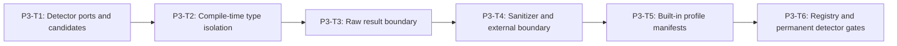

# Phase 3 Detector Boundary and Profiles Implementation Plan

> **For agentic workers:** REQUIRED SUB-SKILL: Use
> `superpowers:subagent-driven-development` or `superpowers:executing-plans`,
> plus `superpowers:test-driven-development`. Execute only the assigned task.

**Goal:** Define type-isolated detector/sanitizer ports and GENERAL-002-facing
result contracts, prove isolation with real compile-time probes, and ship
immutable v1 profile manifests with recording test implementations only.

**Architecture:** Raw-local vs sanitized-external type isolation. Exact output
normalization before qualification. Manifests own slots/thresholds/routes.

**Tech Stack:** TypeScript on WSL Linux, `node:test`,
`node ./frontend/node_modules/typescript/bin/tsc --noEmit`.

---

## Phase Entry Gate

```bash
REPO_ROOT="$(git rev-parse --show-toplevel)"
cd "$REPO_ROOT"
test "$(node -p 'process.platform')" = "linux"
test -f ./frontend/node_modules/typescript/bin/tsc
for cmd in node npm git; do
  path="$(command -v "$cmd")"
  case "$path" in *.exe|*.cmd|*.bat|/mnt/c/*|/mnt/d/*) exit 1;; esac
done

node --experimental-strip-types --test \
  engines/sandbox/tests/sandbox-security-authority.spec.ts \
  engines/sandbox/tests/sandbox-security-input.spec.ts
npm run test:shared
npm run test:repo
node ./frontend/node_modules/typescript/bin/tsc --noEmit -p shared/tsconfig.json
node ./frontend/node_modules/typescript/bin/tsc --noEmit -p engines/sandbox/tsconfig.json
```

## Task DAG



Recording fixtures: content-free evidence only; raw inspection inside callbacks.

## P3-T1: Detector Ports and Candidate Contracts

**Files:**

- Create: `engines/sandbox/src/security/detector-contract.ts`
- Create: `engines/sandbox/tests/sandbox-security-detector.spec.ts`
- Create: `engines/sandbox/tests/fixtures/security-detector.fixture.ts`

### Locked types owned here (subset later exported in Master D)

```ts
export interface RawLocalDetector { /* Spec */ }
export interface SandboxSecuritySanitizer { /* Spec */ }
export interface SanitizedExternalDetector { /* Spec */ }
export type SandboxSecurityCandidateSubjectRef = /* Spec */
export type SandboxSecurityExternalCandidateSubjectRef = /* Spec */
export interface SandboxSecurityRiskCandidate<TSubject = SandboxSecurityCandidateSubjectRef> { /* Spec */ }
export interface SandboxSecurityCategoryClearance<TSubject = SandboxSecurityCandidateSubjectRef> { /* Spec */ }
export interface SandboxSecurityRawDetectorResult { /* Spec */ }
export interface SandboxSecurityExternalDetectorResult { /* Spec */ }
export interface SandboxSecuritySanitizedJudgePayload { /* Spec */ }
```

GENERAL-002 must implement rule/local/sanitizer/Judge without deep-importing
this module; P5-T4 re-exports the types in D. Still never export raw snapshot
concrete types, private handles, or token registry.

### Runtime RED

```ts
test("REQ-SBX-GENERAL-001 recording raw detector receives frozen handles", async () => {});
test("REQ-SBX-GENERAL-001 recording external detector receives sanitized tokens only", async () => {});
test("REQ-SBX-GENERAL-001 candidate contracts contain no action identity evidence or prose", () => {});
test("REQ-SBX-GENERAL-001 exports every fixed detector output limit", () => {});
test("REQ-SBX-GENERAL-001 recording fixtures retain only content-free evidence", async () => {});
```

No `@ts-expect-error` in fixtures (P3-T2 owns probes).

```bash
git commit -m "feat(sandbox): define isolated security detector ports"
```

## P3-T2: Compile-Time Type Isolation Gate (true RED)

**Files:**

- Create: `engines/sandbox/tests/types/sandbox-security-detector-types.ts`
- Modify: `tests/repository/sandbox-security-core.spec.ts`

**Does not own** `detector-contract.ts`. Anchor file may already exist from
P1-T4; formal probe path below must still be absent for RED.

### Step 1: Repository RED before creating formal probe

```ts
test("REQ-SBX-GENERAL-001 detector type isolation probe exists", () => {
  assert.equal(
    existsSync(
      "engines/sandbox/tests/types/sandbox-security-detector-types.ts"
    ),
    true
  );
});
// anchor must already exist from Phase 1 and is NOT this file
test("REQ-SBX-GENERAL-001 typecheck anchor is not the isolation probe", () => {
  assert.notEqual(
    "sandbox-security-typecheck-anchor.ts",
    "sandbox-security-detector-types.ts"
  );
  assert.equal(
    existsSync(
      "engines/sandbox/tests/types/sandbox-security-typecheck-anchor.ts"
    ),
    true
  );
});
test("REQ-SBX-GENERAL-001 type probes are not registered in node test scripts", () => {});
test("REQ-SBX-GENERAL-001 sandbox tsconfig includes type probes", () => {});
```

```bash
node --experimental-strip-types --test tests/repository/sandbox-security-core.spec.ts
```

Expected: formal probe existence fails (anchor alone does not satisfy it).

### Step 3: Valid probes (no as never)

```ts
// external cannot take raw snapshot
// raw detector not assignable to SanitizedExternalDetector
// public finding subject not private candidate subject
// public request not branded evaluation request
// object literal cannot forge branded SandboxSecurityEvaluationRequest
// candidate cannot have action/detector_id/finding_id/evidence_ref
// raw candidate subject not external subject ref
// SandboxSecurityEvaluationRequestInput is not branded EvaluationRequest
```

If P3-T1 contracts cannot express an isolation intent: stop for P3-T1 rework.

### GREEN

```bash
node ./frontend/node_modules/typescript/bin/tsc --noEmit -p engines/sandbox/tsconfig.json
node ./frontend/node_modules/typescript/bin/tsc --noEmit -p shared/tsconfig.json
node --experimental-strip-types --test tests/repository/sandbox-security-core.spec.ts
git commit -m "test(sandbox): prove detector type isolation with tsc"
```

## P3-T3 / P3-T4: Raw + Sanitized boundaries

As prior plan inventories (matched/no_match, limits, sanitizer zero Judge calls,
token mapping). Commits:

- `feat(sandbox): close raw detector output boundary`
- `feat(sandbox): isolate sanitized external detector data`

## P3-T5: Immutable Built-In Profile Manifests

**Locked final name:**

```ts
export function resolveSandboxSecurityProfile(
  profileId: string
): Readonly</* balanced | strict manifest */>;
```

REDs: balanced/strict tables, freeze, unknown/duplicate slots, monotonicity,
reject caller profile objects. Thresholds `.80/.85/.80` and `.70/.75/.70`,
timeouts `100/1000/4000/5000`.

```bash
git commit -m "feat(sandbox): add immutable security policy profiles"
```

## P3-T6: Detector Registry and Permanent Phase Gates

**Locked final names:**

```ts
export interface SandboxSecurityDetectorRegistry { /* Spec */ }

export function createSandboxSecurityDetectorRegistry(
  input: /* exact construction input type; document in module */
): SandboxSecurityDetectorRegistry;
```

REDs: balanced rule-only ok; strict missing local fails; slot kind/access/stage;
slot identity injection. Repo scans forbid network/fs/process/model/console
under `src/security/`.

```bash
npm run test:shared
npm run test:repo
node --experimental-strip-types --test \
  engines/sandbox/tests/sandbox-security-detector.spec.ts \
  engines/sandbox/tests/sandbox-security-policy.spec.ts
node ./frontend/node_modules/typescript/bin/tsc --noEmit -p shared/tsconfig.json
node ./frontend/node_modules/typescript/bin/tsc --noEmit -p engines/sandbox/tsconfig.json
git diff --check
git diff --summary
git commit -m "test(sandbox): gate detector registry and profiles"
```

## Phase 3 Exit Gate

Same as phase gate above + full focused detector/policy suite.

## Phase 3 Report Format

```text
Phase: 3 Detector Boundary and Profiles
Formal probe missing-file RED preserved with anchor present:
GENERAL-002-facing types locked in detector-contract:
resolveSandboxSecurityProfile / createSandboxSecurityDetectorRegistry locked:
typecheck + repo:
Current status: PHASE_3_COMPLETE_PENDING_REVIEW
```
