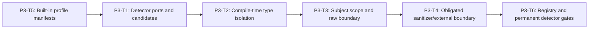

# Phase 3 Detector Boundary and Profiles Implementation Plan

> **For agentic workers:** REQUIRED SUB-SKILL: Use
> `superpowers:subagent-driven-development` or `superpowers:executing-plans`,
> plus `superpowers:test-driven-development`. Execute only the assigned task.
>
> This phase plan is self-contained. Do not consult older plan revisions.
>
> **BLOCKED:** Canonical Specs are `DRAFT_REVISED_PENDING_REAPPROVAL`.
> Do not execute until both are reapproved and the user changes active sprint.

**Goal:** Define type-isolated detector/sanitizer ports and GENERAL-002-facing
result contracts, prove isolation with real compile-time probes, close raw and
sanitized result boundaries with frozen registries, and ship immutable v1
profile manifests with profile-aware detector resolution.

**Architecture:** Raw-local vs sanitized-external type isolation. Exact output
normalization before qualification. Construction does not know profile; profile
resolution is separate. Manifests own slots/thresholds/routes. No
`detector-pipeline.ts`.

**Tech Stack:** TypeScript on WSL Linux, `node:test`,
`node ./frontend/node_modules/typescript/bin/tsc --noEmit`.

**Production file unique ownership (this phase):**

| Production file | Sole owner |
| --- | --- |
| `engines/sandbox/src/security/detector-contract.ts` | P3-T1 |
| `engines/sandbox/src/security/subject-scope.ts` | P3-T3 |
| `engines/sandbox/src/security/detector-output-boundary.ts` | P3-T3 |
| `engines/sandbox/src/security/sanitized-boundary.ts` | P3-T4 |
| `engines/sandbox/src/security/policy-profiles.ts` | P3-T5 |
| `engines/sandbox/src/security/detector-registry.ts` | P3-T6 |

No task creates or modifies another task's production file. No co-location. No
`detector-pipeline.ts`. Later tasks stop on earlier-contract defects.

---

## Phase Entry Gate

```bash
REPO_ROOT="$(git rev-parse --show-toplevel)"
cd "$REPO_ROOT"
pwd
git rev-parse --show-toplevel
git branch --show-current
git status --short

uname -a
command -v node
command -v npm
command -v git
node -p 'process.platform'
node --version
npm --version
test -f ./frontend/node_modules/typescript/bin/tsc
test "$(node -p 'process.platform')" = "linux"
for cmd in node npm git; do
  path="$(command -v "$cmd")"
  case "$path" in
    *.exe|*.cmd|*.bat|/mnt/c/*|/mnt/d/*)
      echo "Windows interop path not allowed for $cmd: $path" >&2
      exit 1
      ;;
  esac
done

node --experimental-strip-types --test \
  engines/sandbox/tests/sandbox-security-authority.spec.ts \
  engines/sandbox/tests/sandbox-security-input.spec.ts
npm run test:shared
npm run test:repo
node ./frontend/node_modules/typescript/bin/tsc --noEmit -p shared/tsconfig.json
node ./frontend/node_modules/typescript/bin/tsc --noEmit -p engines/sandbox/tsconfig.json
```

Expected: linux platform; Node `>=22.19.0`; Phase 2 gates green; no dependency
install; WSL tools only.

## Task DAG



```text
Execution order (locked): P3-T5 → P3-T1 → P3-T2 → P3-T3 → P3-T4 → P3-T6
Rationale: detector-contract.ts type-imports SandboxSecurityPolicyProfileManifest
from policy-profiles.ts; P3-T2 runs tsc --noEmit and requires that module to exist.
```

Recording fixtures: content-free evidence only; raw inspection inside callbacks.

---

## P3-T5: Immutable Built-In Profile Manifests

**Execution Step 1 of 6** (first Phase 3 production task)

### Goal / Acceptance

Create **only** `policy-profiles.ts`. Ship frozen balanced/strict manifests with
  Spec slot tables, thresholds, timeouts, normal work budget 5000 (+ bounded fail-closed epilogue at Engine), monotonic strict ≥
  balanced restrictiveness. Own the sole profile-based trust derivation and
  export `resolveSandboxSecurityProfile`.

### Files

- Create: `engines/sandbox/src/security/policy-profiles.ts`
- Create: `engines/sandbox/tests/sandbox-security-policy.spec.ts`

### Dependencies / frozen inputs

- Spec profile IDs, slot IDs, thresholds, routing rules, action matrix,
  profile trust rules, reason-code catalog.
- Shared profile ID union, reason-code type, severity, stage, action types.
- **No prior Phase 3 task required.** This is the first Phase 3 production task.

### Locked final name and shapes

```ts
import type {
  SandboxSecurityAuthorityBoundContent
} from "./input-boundary.ts";
import type {
  SandboxSecurityAction,
  SandboxSecurityClaimedSourceType,
  SandboxSecurityPolicyProfileId,
  SandboxSecurityReasonCode,
  SandboxSecuritySeverity,
  SandboxSecurityStage
} from "../../../../shared/types/sandbox-security.ts";

export type SandboxSecurityTrustClass =
  | "control"
  | "user_supplied"
  | "external_untrusted"
  | "generated_untrusted";

export interface SandboxSecurityNormalizedContent
  extends SandboxSecurityAuthorityBoundContent {
  readonly trust_class: SandboxSecurityTrustClass;
}

/**
 * Exact-key trust derivation row. Built-in manifests encode Spec fixed trust
 * table only. Unknown (mode, authority_kind, source_type) pairs are invalid
 * at authority validation — not free-form caller rules.
 */
export interface SandboxSecurityTrustRule {
  readonly evaluation_mode: "simulation" | "enforcement";
  readonly authority_kind:
    | "platform_control"
    | "integration_observation"
    | "simulation_observation";
  readonly source_types: readonly SandboxSecurityClaimedSourceType[];
  readonly trust_class: SandboxSecurityTrustClass;
}

/**
 * Exact-key stage action map used by reduceSandboxSecurityPolicy (P4-T4).
 * Keys are exact stages; values are allow|alert|ask|deny.
 */
export interface SandboxSecurityActionByStage {
  readonly user_input: SandboxSecurityAction;
  readonly model_output: SandboxSecurityAction;
  readonly tool_request: SandboxSecurityAction;
}

/**
 * Exact-key action matrix. Module-init validation requires every key present.
 * balanced and strict each ship one frozen instance.
 */
export interface SandboxSecurityActionMatrix {
  readonly accepted_critical: Readonly<SandboxSecurityActionByStage>;
  readonly accepted_high: Readonly<SandboxSecurityActionByStage>;
  readonly accepted_medium: Readonly<SandboxSecurityActionByStage>;
  readonly accepted_low: Readonly<SandboxSecurityActionByStage>;
  readonly no_finding_all_resolved: Readonly<SandboxSecurityActionByStage>;
  readonly unresolved_required: Readonly<SandboxSecurityActionByStage>;
}

export type SandboxSecurityRoutingRule =
  | "always"
  | "configured_after_no_short_circuit"
  | "unresolved_escalation_signal";

export type SandboxSecurityDetectorSlotId =
  | "detector://sandbox/security/rule/default/v1"
  | "detector://sandbox/security/local/default/v1"
  | "detector://sandbox/security/judge/default/v1";

export interface SandboxSecurityDetectorSlotManifest {
  slot_id: SandboxSecurityDetectorSlotId;
  detector_version: string;
  detector_kind: "rule" | "local_model" | "external_judge";
  supported_stages: readonly SandboxSecurityStage[];
  base_obligation: "profile_required" | "optional";
  content_access: "raw_local" | "sanitized_external";
  timeout_ms: number;
  qualification_threshold: number;
  routing_floor: number;
  routing_rule: SandboxSecurityRoutingRule;
  short_circuit_min_severity: SandboxSecuritySeverity | null;
}

export interface SandboxSecurityPolicyProfileManifest {
  profile_id: SandboxSecurityPolicyProfileId;
  normal_work_budget_ms: 5000;
  trust_rules: readonly SandboxSecurityTrustRule[];
  detector_slots: readonly SandboxSecurityDetectorSlotManifest[];
  action_matrix: Readonly<SandboxSecurityActionMatrix>;
  reason_codes: readonly SandboxSecurityReasonCode[];
}

export function resolveSandboxSecurityProfile(
  profileId: string
): Readonly<SandboxSecurityPolicyProfileManifest>;

export function deriveSandboxSecurityTrustClass(input: {
  readonly profile: Readonly<SandboxSecurityPolicyProfileManifest>;
  readonly evaluation_mode: "simulation" | "enforcement";
  readonly authority_kind:
    | "platform_control"
    | "integration_observation"
    | "simulation_observation";
  readonly source_type: SandboxSecurityClaimedSourceType;
}): SandboxSecurityTrustClass;
```


Master D exports (via P5-T4): `SandboxSecurityPolicyProfileManifest`,
`SandboxSecurityDetectorSlotManifest`, `SandboxSecurityDetectorSlotId`,
`SandboxSecurityTrustRule`, `SandboxSecurityActionMatrix`,
`SandboxSecurityTrustClass`, `SandboxSecurityActionByStage` so GENERAL-002
raw detectors can use snapshot.profile without deep imports.

Built-in values (exact Spec table):

```text
balanced rule: profile_required, raw_local, timeout 100, qualify 0.80,
  floor 0.50, always, short_circuit_min_severity high
balanced local: optional, raw_local, 1000, 0.85, 0.60,
  configured_after_no_short_circuit, short_circuit null
balanced Judge: optional, sanitized_external, 4000, 0.80, 0.60,
  unresolved_escalation_signal, short_circuit null
strict rule: profile_required, raw_local, 100, 0.70, 0.40, always,
  short_circuit_min_severity medium
strict local: profile_required, raw_local, 1000, 0.75, 0.50,
  configured_after_no_short_circuit, short_circuit null
strict Judge: optional, sanitized_external, 4000, 0.70, 0.50,
  unresolved_escalation_signal, short_circuit null
normal_work_budget_ms: 5000 both
slot IDs:
  detector://sandbox/security/rule/default/v1 version 1.0.0 kind rule
  detector://sandbox/security/local/default/v1 version 1.0.0 kind local_model
  detector://sandbox/security/judge/default/v1 version 1.0.0 kind external_judge
all slots support all three stages
```

Action matrix (Spec):

```text
accepted critical/high → deny (all profiles/stages)
accepted medium → balanced user/model ask; balanced tool deny;
  strict all stages deny
accepted low → balanced alert; strict user/model ask; strict tool deny
no finding all resolved → allow
unresolved required → user/model ask; tool deny
```

```text
Built-in action_matrix values (exact-key; both profiles share structure):

balanced:
  accepted_critical/high: all stages deny
  accepted_medium: user_input+model_output ask; tool_request deny
  accepted_low: all stages alert
  no_finding_all_resolved: all stages allow
  unresolved_required: user_input+model_output ask; tool_request deny

strict:
  accepted_critical/high: all stages deny
  accepted_medium: all stages deny
  accepted_low: user_input+model_output ask; tool_request deny
  no_finding_all_resolved: all stages allow
  unresolved_required: user_input+model_output ask; tool_request deny

Built-in trust_rules (exact Spec table; both profiles identical):
  { enforcement, platform_control, [system_instruction, developer_instruction], control }
  { enforcement, integration_observation, [user_input], user_supplied }
  { enforcement, integration_observation, [retrieved_content, memory_content], external_untrusted }
  { enforcement, integration_observation, [model_output], generated_untrusted }
  { simulation, simulation_observation, [system_instruction, developer_instruction], control }
  { simulation, simulation_observation, [user_input], user_supplied }
  { simulation, simulation_observation, [retrieved_content, memory_content], external_untrusted }
  { simulation, simulation_observation, [model_output], generated_untrusted }
Every other (mode, authority_kind, source_type) combination is invalid.
```

Manifests are exact-key validated at module initialization, recursively frozen,
selected only by built-in ID. Reject: unknown profile IDs, caller-supplied
profile objects, duplicate slot IDs, non-monotonic strict vs balanced settings.

### Step 1: Exact RED test inventory

```ts
test("REQ-SBX-GENERAL-001 resolves balanced v1 profile", () => {});
test("REQ-SBX-GENERAL-001 resolves strict v1 profile", () => {});
test("REQ-SBX-GENERAL-001 balanced thresholds are 0.80 0.85 0.80", () => {});
test("REQ-SBX-GENERAL-001 strict thresholds are 0.70 0.75 0.70", () => {});
test("REQ-SBX-GENERAL-001 slot timeouts are 100 1000 4000 and normal_work_budget_ms 5000", () => {});
test("REQ-SBX-GENERAL-001 profiles are recursively frozen", () => {});
test("REQ-SBX-GENERAL-001 rejects unknown profile IDs", () => {});
test("REQ-SBX-GENERAL-001 rejects caller-supplied profile objects", () => {});
test("REQ-SBX-GENERAL-001 rejects duplicate slot IDs at module init", () => {});
test("REQ-SBX-GENERAL-001 strict is never less restrictive than balanced", () => {});
test("REQ-SBX-GENERAL-001 reason_codes catalog matches SandboxSecurityReasonCode", () => {});
test("REQ-SBX-GENERAL-001 slot IDs bind fixed detector://sandbox/security paths", () => {});
test("REQ-SBX-GENERAL-001 balanced local and Judge are optional obligations", () => {});
test("REQ-SBX-GENERAL-001 strict local is profile_required", () => {});
test("REQ-SBX-GENERAL-001 resolveSandboxSecurityProfile is the only profile entry", () => {});
test("REQ-SBX-GENERAL-001 TrustRule and ActionMatrix exact shapes exist on profile", () => {});
test("REQ-SBX-GENERAL-001 balanced action_matrix matches Spec reduction table", () => {});
test("REQ-SBX-GENERAL-001 strict action_matrix matches Spec reduction table", () => {});
test("REQ-SBX-GENERAL-001 trust_rules encode Spec fixed trust table only", () => {});
test("REQ-SBX-GENERAL-001 deriveTrustClass uses selected profile trust_rules only", () => {});
test("REQ-SBX-GENERAL-001 deriveTrustClass rejects unknown combinations", () => {});
test("REQ-SBX-GENERAL-001 derived NormalizedContent extends authority-bound content", () => {});
test("REQ-SBX-GENERAL-001 no Phase 2 module derives trust_class", () => {});
```

### Step 2: RED command

```bash
node --experimental-strip-types --test engines/sandbox/tests/sandbox-security-policy.spec.ts
```

### Expected RED failure and why valid

Missing `policy-profiles.ts` or wrong thresholds/timeouts/slot IDs.

### Step 3: Implementation boundary

Implement manifests, `resolveSandboxSecurityProfile`,
`deriveSandboxSecurityTrustClass`, and the post-profile NormalizedContent type
only in `policy-profiles.ts`.

Do **not**:

- implement registry (P3-T6)
- implement reducer (P4-T4)
- accept caller profile objects
- create other production files

### Step 4: GREEN command and expected result

```bash
node --experimental-strip-types --test engines/sandbox/tests/sandbox-security-policy.spec.ts
```

Profile inventory green.

### Step 5: Broader gates

None.

### Step 6: Exact git add paths + commit

```bash
git add engines/sandbox/src/security/policy-profiles.ts \
  engines/sandbox/tests/sandbox-security-policy.spec.ts
git commit -m "feat(sandbox): add immutable security policy profiles"
```

### Stop/report

Stop after commit.

---

## P3-T1: Detector Ports and Candidate Contracts

**Execution Step 2 of 6** (requires P3-T5)

### Goal / Acceptance

Create **only** `detector-contract.ts` (plus detector.spec + fixtures). Lock
detector ports and GENERAL-002-facing types so later phases and GENERAL-002 use
final index exports for all detector contracts, with exactly one documented
deep-import exception (owned by P3-T4 / Master):
`sanitized-boundary.ts#deriveSandboxSecurityExternalTokenRegistry` for the
production sanitizer only. GENERAL-002 must not deep-import any other security
internal (token registry type, validator, normalizer, handle brands, etc.).

Owns ports and:

```ts
SandboxSecurityRawDetectorSnapshot {
  request_id, evaluation_mode, stage,
  profile (Readonly<SandboxSecurityPolicyProfileManifest>),
  contents (NormalizedContent[]), tool_request?,
  canonical_request_sha256
}
// no policy_profile_id field — use snapshot.profile.profile_id
```

Does **not** redefine `SandboxSecurityNormalizedContent` /
`SandboxSecurityNormalizedToolRequest` — imports content from
`policy-profiles.ts` and tool shape from `input-boundary.ts`. Does not create
`detector-pipeline.ts`. Does **not** create registries or normalizers.

### Files

- Create: `engines/sandbox/src/security/detector-contract.ts`
- Create: `engines/sandbox/tests/sandbox-security-detector.spec.ts`
- Create: `engines/sandbox/tests/fixtures/security-detector.fixture.ts`

### Dependencies / frozen inputs

- P3-T5 `policy-profiles.ts` provides profile-trusted
  `SandboxSecurityNormalizedContent`; P2 `input-boundary.ts` provides
  `SandboxSecurityNormalizedToolRequest`.
- Phase 2 locators exist as shared public types:
  `SandboxSecurityContentLocator`, `SandboxSecurityToolLocator`.
- Shared `SandboxSecurityReasonCode`, risk/severity/stage/profile unions.
- Spec detector ports and candidate/result shapes.
- **Prerequisite:** P3-T5 complete. `policy-profiles.ts` must already exist so
  `import type { SandboxSecurityPolicyProfileManifest } from "./policy-profiles.ts"`
  typechecks. Do not create or modify `policy-profiles.ts` in this task.
- Runtime P3-T1 tests may still assert snapshot field shape structurally.
- P3-T1 GREEN remains runtime detector.spec only; P3-T2 owns full
  `tsc --noEmit` isolation gate after this task.

### Locked types owned here (exported in Master D via P5-T4)

```ts
import type {
  SandboxSecurityNormalizedToolRequest
} from "./input-boundary.ts";
import type {
  SandboxSecurityNormalizedContent,
  SandboxSecurityPolicyProfileManifest
} from "./policy-profiles.ts";
import type {
  SandboxSecurityStage,
  SandboxSecurityPolicyProfileId,
  SandboxSecurityRiskCategory,
  SandboxSecuritySeverity,
  SandboxSecurityReasonCode,
  SandboxSecurityContentLocator,
  SandboxSecurityToolLocator,
  SandboxSecurityClaimedSourceType,
  SandboxSecurityJsonValue
} from "../../../../shared/types/sandbox-security.ts";

export interface SandboxSecurityRawDetectorSnapshot {
  // engine-private handles and frozen authoritative material for raw-local
  // and sanitizer only; no public constructor; adapters cannot forge
  // Engine creates this AFTER profile resolution; full frozen profile manifest
  readonly request_id: string;
  readonly evaluation_mode: "simulation" | "enforcement";
  readonly stage: SandboxSecurityStage;
  readonly profile: Readonly<SandboxSecurityPolicyProfileManifest>;
  readonly contents: readonly SandboxSecurityNormalizedContent[];
  readonly tool_request?: Readonly<SandboxSecurityNormalizedToolRequest>;
  readonly canonical_request_sha256: string;
}

export interface RawLocalDetector {
  detect(
    snapshot: Readonly<SandboxSecurityRawDetectorSnapshot>,
    signal: AbortSignal
  ): Promise<SandboxSecurityRawDetectorResult>;
}

export interface SandboxSecuritySanitizer {
  sanitize(
    snapshot: Readonly<SandboxSecurityRawDetectorSnapshot>,
    routed_obligations:
      readonly SandboxSecuritySanitizedJudgeObligation[],
    signal: AbortSignal
  ): Promise<SandboxSecuritySanitizedJudgePayload>;
}

export interface SanitizedExternalDetector {
  detect(
    payload: Readonly<SandboxSecuritySanitizedJudgePayload>,
    signal: AbortSignal
  ): Promise<SandboxSecurityExternalDetectorResult>;
}

export type SandboxSecurityCandidateSubjectRef =
  | {
      kind: "content_source";
      source_handle: string;
      locator: SandboxSecurityContentLocator;
    }
  | {
      kind: "tool_request";
      call_handle: string;
      component: "whole_call" | "tool_name" | "target";
    }
  | {
      kind: "tool_request";
      call_handle: string;
      component: "arguments";
      locator: SandboxSecurityToolLocator;
    };

export type SandboxSecurityExternalCandidateSubjectRef =
  | {
      kind: "content_source";
      source_token: string;
      locator: SandboxSecurityContentLocator;
    }
  | {
      kind: "tool_request";
      call_token: string;
      component: "whole_call" | "tool_name" | "target";
    }
  | {
      kind: "tool_request";
      call_token: string;
      component: "arguments";
      locator: SandboxSecurityToolLocator;
    };

export interface SandboxSecurityRiskCandidate<
  TSubjectRef extends object = SandboxSecurityCandidateSubjectRef
> {
  category: SandboxSecurityRiskCategory;
  severity: SandboxSecuritySeverity;
  confidence: number;
  reason_code: SandboxSecurityReasonCode;
  subject_refs: TSubjectRef[];
}

export interface SandboxSecurityCategoryClearance<
  TSubjectRef extends object = SandboxSecurityCandidateSubjectRef
> {
  category: SandboxSecurityRiskCategory;
  confidence: number;
  subject_refs: TSubjectRef[];
}

export interface SandboxSecurityRawDetectorResult {
  candidates: SandboxSecurityRiskCandidate[];
  clearances: SandboxSecurityCategoryClearance[];
}

export interface SandboxSecurityExternalRiskCandidate {
  readonly obligation_id: string;
  readonly category: SandboxSecurityRiskCategory;
  readonly severity: SandboxSecuritySeverity;
  readonly confidence: number;
  readonly reason_code: SandboxSecurityReasonCode;
  readonly subject_refs:
    readonly SandboxSecurityExternalCandidateSubjectRef[];
}

export interface SandboxSecurityExternalCategoryClearance {
  readonly obligation_id: string;
  readonly category: SandboxSecurityRiskCategory;
  readonly confidence: number;
  readonly subject_refs:
    readonly SandboxSecurityExternalCandidateSubjectRef[];
}

export interface SandboxSecurityExternalDetectorResult {
  readonly candidates: readonly SandboxSecurityExternalRiskCandidate[];
  readonly clearances: readonly SandboxSecurityExternalCategoryClearance[];
}

export interface SandboxSecuritySanitizedJudgeSource {
  source_token: string;
  source_type: SandboxSecurityClaimedSourceType;
  media_type: "text/plain" | "application/json";
  sanitized_value: string | SandboxSecurityJsonValue;
}

export interface SandboxSecuritySanitizedJudgeToolRequest {
  call_token: string;
  tool_name_token: string;
  sanitized_target?: string;
  sanitized_arguments: SandboxSecurityJsonValue;
}

export interface SandboxSecuritySanitizedJudgeObligation {
  readonly obligation_id: string;
  readonly category: SandboxSecurityRiskCategory;
  readonly subject_refs:
    readonly SandboxSecurityExternalCandidateSubjectRef[];
}

export interface SandboxSecuritySanitizedJudgePayload {
  schema_version: "sandbox-security-sanitized-judge.v1";
  request_token: string;
  stage: SandboxSecurityStage;
  policy_profile_id: SandboxSecurityPolicyProfileId;
  sources: SandboxSecuritySanitizedJudgeSource[];
  tool_request?: SandboxSecuritySanitizedJudgeToolRequest;
  routed_obligations:
    readonly SandboxSecuritySanitizedJudgeObligation[];
}
```

Fixed detector output limits (module constants; used by P3-T3/T4):

```ts
export const SANDBOX_SECURITY_MAX_CANDIDATES_PER_RESULT = 32;
export const SANDBOX_SECURITY_MAX_CLEARANCES_PER_RESULT = 32;
export const SANDBOX_SECURITY_MAX_SUBJECT_REFS_PER_ITEM = 8;
export const SANDBOX_SECURITY_MAX_DETECTOR_RESULT_BYTES = 64 * 1024;
export const SANDBOX_SECURITY_MAX_SANITIZED_PAYLOAD_BYTES = 256 * 1024;
export const SANDBOX_SECURITY_MAX_SANITIZED_JSON_DEPTH = 8;
export const SANDBOX_SECURITY_MAX_SANITIZED_JSON_NODES = 2048;
export const SANDBOX_SECURITY_MAX_JUDGE_RESPONSE_BYTES = 64 * 1024;
export const SANDBOX_SECURITY_MAX_SANITIZED_TOKENS = 67;
```

Still never export private handle constructors or token registry.

Recording fixtures in `security-detector.fixture.ts`:

- recording `RawLocalDetector` that captures frozen snapshot handles only
- recording `SanitizedExternalDetector` that captures sanitized tokens only
- recording `SandboxSecuritySanitizer` that maps handles to tokens
- content-free evidence helpers (no raw prose, no action identity)

### Step 1: Exact RED test inventory

```ts
test("REQ-SBX-GENERAL-001 recording raw detector receives frozen handles", async () => {});
test("REQ-SBX-GENERAL-001 recording external detector receives sanitized tokens only", async () => {});
test("REQ-SBX-GENERAL-001 candidate contracts contain no action identity evidence or prose", () => {});
test("REQ-SBX-GENERAL-001 exports every fixed detector output limit", () => {});
test("REQ-SBX-GENERAL-001 recording fixtures retain only content-free evidence", async () => {});
test("REQ-SBX-GENERAL-001 RawLocalDetector.detect requires SandboxSecurityRawDetectorSnapshot", () => {});
test("REQ-SBX-GENERAL-001 SanitizedExternalDetector.detect requires sanitized payload only", () => {});
test("REQ-SBX-GENERAL-001 sanitizer receives exact routed obligations before signal", () => {});
test("REQ-SBX-GENERAL-001 sanitized Judge payload requires routed_obligations", () => {});
test("REQ-SBX-GENERAL-001 sanitized tool payload exposes tool_name_token only", () => {});
test("REQ-SBX-GENERAL-001 external candidates and clearances require obligation_id", () => {});
test("REQ-SBX-GENERAL-001 risk candidate requires SandboxSecurityReasonCode", () => {});
test("REQ-SBX-GENERAL-001 SandboxSecurityRawDetectorSnapshot has exact locked fields", () => {});
test("REQ-SBX-GENERAL-001 RawDetectorSnapshot carries full frozen profile manifest not policy_profile_id", () => {});
test("REQ-SBX-GENERAL-001 RawDetectorSnapshot content trust comes from resolved profile", () => {});
test("REQ-SBX-GENERAL-001 RawDetectorSnapshot does not redefine NormalizedContent fields", () => {});
test("REQ-SBX-GENERAL-001 RawDetectorSnapshot exposes no canonical projection bytes", () => {});
test("REQ-SBX-GENERAL-001 detector-contract does not export detector-pipeline", () => {});
```

### Step 2: RED command

```bash
node --experimental-strip-types --test engines/sandbox/tests/sandbox-security-detector.spec.ts
```

### Expected RED failure and why valid

Missing `detector-contract.ts` / fixtures; type/runtime contracts not present.
`ERR_MODULE_NOT_FOUND` or assertion failure on missing exports. Not a
syntax/env error.

### Step 3: Implementation boundary

Define ports, result types, snapshot type, limits, recording fixtures in the
three listed files only.

Do **not**:

- create `detector-pipeline.ts`
- create `detector-output-boundary.ts`, `sanitized-boundary.ts`,
  or `detector-registry.ts`
- redefine profile-owned `SandboxSecurityNormalizedContent` or Phase-2-owned
  `SandboxSecurityNormalizedToolRequest`
- implement production rule/local/Judge detectors
- put `@ts-expect-error` probes in fixtures (P3-T2 owns probes)
- modify Phase 2 authority/input/locator modules

### Step 4: GREEN command and expected result

```bash
node --experimental-strip-types --test engines/sandbox/tests/sandbox-security-detector.spec.ts
```

Runtime contract tests pass.

### Step 5: Broader gates

None.

### Step 6: Exact git add paths + commit

```bash
git add engines/sandbox/src/security/detector-contract.ts \
  engines/sandbox/tests/sandbox-security-detector.spec.ts \
  engines/sandbox/tests/fixtures/security-detector.fixture.ts
git commit -m "feat(sandbox): define isolated security detector ports"
```

### Stop/report

Stop after commit. Return task evidence.

---

## P3-T2: Compile-Time Type Isolation Gate (true RED)

**Execution Step 3 of 6** (requires P3-T5 + P3-T1)

### Goal / Acceptance

Prove type isolation with real compile-time probes. Create **only** the formal
probe file and modify repository tests. Missing formal probe file must RED even
when Phase 1 typecheck anchor exists.

### Files

- Create: `engines/sandbox/tests/types/sandbox-security-detector-types.ts`
- Modify: `tests/repository/sandbox-security-core.spec.ts`

### Dependencies / frozen inputs

- **Prerequisite:** P3-T5 and P3-T1 complete. `policy-profiles.ts` and
  `detector-contract.ts` both exist so sandbox `tsc --noEmit` can resolve
  `snapshot.profile` imports without TS2307.
- P3-T1 `detector-contract.ts` complete (do not edit it here).
- P1-T4 typecheck anchor
  `engines/sandbox/tests/types/sandbox-security-typecheck-anchor.ts` may already
  exist with `export {}`.

### Step 1: Exact RED test inventory (before creating formal probe)

```ts
test("REQ-SBX-GENERAL-001 detector type isolation probe exists", () => {
  assert.equal(
    existsSync(
      "engines/sandbox/tests/types/sandbox-security-detector-types.ts"
    ),
    true
  );
});
test("REQ-SBX-GENERAL-001 typecheck anchor is not the isolation probe", () => {
  assert.notEqual(
    "sandbox-security-typecheck-anchor.ts",
    "sandbox-security-detector-types.ts"
  );
  assert.equal(
    existsSync(
      "engines/sandbox/tests/types/sandbox-security-typecheck-anchor.ts"
    ),
    true
  );
});
test("REQ-SBX-GENERAL-001 type probes are not registered in node test scripts", () => {});
test("REQ-SBX-GENERAL-001 sandbox tsconfig includes type probes", () => {});
test("REQ-SBX-GENERAL-001 repository forbids public export of NormalizedSandboxSecurityEvaluationRequest", () => {});
test("REQ-SBX-GENERAL-001 formal detector probe RED when missing even if anchor exists", () => {
  // existence of anchor alone must not satisfy formal probe path
  assert.equal(
    existsSync(
      "engines/sandbox/tests/types/sandbox-security-detector-types.ts"
    ),
    true
  );
});
```

### Step 2: RED command

```bash
node --experimental-strip-types --test tests/repository/sandbox-security-core.spec.ts
```

### Expected RED failure and why valid

Formal probe existence fails (anchor alone does not satisfy it). This is a true
RED even when `tsc --noEmit` is green on the anchor.

### Step 3: Implementation boundary — valid probes (no `as never`)

Create only the formal probe file and update repository tests. Do not edit
`detector-contract.ts`.

```ts
// engines/sandbox/tests/types/sandbox-security-detector-types.ts
// temporary deep imports until P5-T4 closes security/index.ts to Master C/D
// type modules must be correct; do not import everything from detector-contract

import type {
  RawLocalDetector,
  SanitizedExternalDetector,
  SandboxSecurityRawDetectorSnapshot,
  SandboxSecurityRiskCandidate,
  SandboxSecurityCandidateSubjectRef,
  SandboxSecurityExternalCandidateSubjectRef
} from "../../src/security/detector-contract.ts";

import type {
  SandboxSecurityEvaluationRequest
} from "../../src/security/source-authority.ts";

import type {
  SandboxSecurityFindingSubjectRef,
  SandboxSecurityRequest
} from "../../../../shared/types/sandbox-security.ts";

// probes must not import NormalizedSandboxSecurityEvaluationRequest

declare const publicRequest: SandboxSecurityRequest;
declare const snapshot: SandboxSecurityRawDetectorSnapshot;
declare const judge: SanitizedExternalDetector;
declare const raw: RawLocalDetector;
declare const evaluationRequest: SandboxSecurityEvaluationRequest;
declare const publicSubject: SandboxSecurityFindingSubjectRef;
declare const privateSubject: SandboxSecurityCandidateSubjectRef;

// @ts-expect-error ordinary public request is not complete evaluation request
const badEval: SandboxSecurityEvaluationRequest = publicRequest;

// @ts-expect-error external Judge only accepts sanitized payload
judge.detect(snapshot, new AbortController().signal);

// @ts-expect-error raw detector not assignable to SanitizedExternalDetector
const badJudge: SanitizedExternalDetector = raw;

// @ts-expect-error public subject is not private candidate subject
const badSubject: SandboxSecurityCandidateSubjectRef = publicSubject;

// action property is the diagnostic line — directive must sit on that line
const badCandidate: SandboxSecurityRiskCandidate = {
  category: "prompt_injection",
  severity: "high",
  confidence: 0.9,
  reason_code: "sandbox_security_prompt_injection",
  subject_refs: [],
  // @ts-expect-error candidate cannot declare action
  action: "deny"
};

// @ts-expect-error raw candidate subject is not external subject ref
const badExternal: SandboxSecurityExternalCandidateSubjectRef = privateSubject;

// prove approved evaluation request is not the internal branded type:
// do NOT import NormalizedSandboxSecurityEvaluationRequest from public index
// repository scan (runtime test) asserts that symbol is absent from exports
void evaluationRequest;
void badEval;
void badJudge;
void badSubject;
void badCandidate;
void badExternal;

// Probe rules (locked):
// - every @ts-expect-error is on the real diagnostic line and is consumed
// - no unused directive
// - no as any / as never / double assertion
// - no wrong module imports
// - tsc --noEmit must be GREEN
```

If P3-T1 contracts cannot express an isolation intent: stop for P3-T1 rework.
Do not edit `detector-contract.ts` in this task.

### Step 4: GREEN command and expected result

```bash
node ./frontend/node_modules/typescript/bin/tsc --noEmit -p engines/sandbox/tsconfig.json
node ./frontend/node_modules/typescript/bin/tsc --noEmit -p shared/tsconfig.json
node --experimental-strip-types --test tests/repository/sandbox-security-core.spec.ts
```

Probe file exists; tsc green; repository tests green.

### Step 5: Broader gates

None beyond typecheck.

### Step 6: Exact git add paths + commit

```bash
git add engines/sandbox/tests/types/sandbox-security-detector-types.ts \
  tests/repository/sandbox-security-core.spec.ts
git commit -m "test(sandbox): prove detector type isolation with tsc"
```

### Stop/report

Stop after commit.

---

## P3-T3: Canonical Subject Scope and Raw Detector Result Boundary

**Execution Step 4 of 6**

### Goal / Acceptance

Create `subject-scope.ts` and `detector-output-boundary.ts`. Owns the sole
canonical private subject identity helper,
`SandboxSecurityRawSubjectRegistry` (frozen arrays, **not** Map) and
`normalizeSandboxSecurityRawDetectorResult`. Normalize and bound raw-local
detector results before qualification. Exact-key only.

### Files

- Create: `engines/sandbox/src/security/subject-scope.ts`
- Create: `engines/sandbox/src/security/detector-output-boundary.ts`
- Modify: `engines/sandbox/tests/sandbox-security-detector.spec.ts`
- Modify: `engines/sandbox/tests/fixtures/security-detector.fixture.ts`

### Dependencies / frozen inputs

- P3-T1 ports/results/limits (do not edit `detector-contract.ts`).
- P2 handle brands and locators for subject validation.
- Shared reason-code / severity / category catalogs.
- P2 JCS helper for subject-key hashing.

### Locked contracts owned here

```ts
import type {
  SandboxSecuritySourceHandle,
  SandboxSecurityCallHandle
} from "./input-boundary.ts";
import type {
  SandboxSecurityJsonValue
} from "../../../../shared/types/sandbox-security.ts";
import type {
  SandboxSecurityRawDetectorResult
} from "./detector-contract.ts";

export interface SandboxSecurityRawContentSubject {
  readonly source_handle: SandboxSecuritySourceHandle;
  readonly media_type: "text/plain" | "application/json";
  readonly original_utf8_bytes: readonly number[];
  readonly value: string | SandboxSecurityJsonValue;
}

export interface SandboxSecurityRawToolSubject {
  readonly call_handle: SandboxSecurityCallHandle;
  readonly has_target: boolean;
  readonly arguments: SandboxSecurityJsonValue;
}

export interface SandboxSecurityRawSubjectRegistry {
  readonly evaluation_nonce: string;
  readonly content_subjects: readonly SandboxSecurityRawContentSubject[];
  readonly tool_subject?: Readonly<SandboxSecurityRawToolSubject>;
}

/** Unified private-handle result after boundary normalize. */
export interface SandboxSecurityNormalizedSlotResult {
  readonly candidates:
    readonly SandboxSecurityRiskCandidate<
      SandboxSecurityCandidateSubjectRef
    >[];
  readonly clearances:
    readonly SandboxSecurityCategoryClearance<
      SandboxSecurityCandidateSubjectRef
    >[];
}

export type SandboxSecurityNormalizedDetectorResult =
  | {
      status: "matched";
      result: Readonly<SandboxSecurityNormalizedSlotResult>;
    }
  | { status: "no_match" }
  | {
      status: "invalid_result";
      error_code: "detector_result_invalid" | "detector_content_leak";
    };

export function normalizeSandboxSecurityRawDetectorResult(
  value: unknown,
  registry: Readonly<SandboxSecurityRawSubjectRegistry>
): Readonly<SandboxSecurityNormalizedDetectorResult>;

export type SandboxSecurityCanonicalPrivateSubjectScope =
  | {
      readonly kind: "content_source";
      readonly source_handle: SandboxSecuritySourceHandle;
      readonly locator: SandboxSecurityContentLocator;
    }
  | {
      readonly kind: "tool_request";
      readonly call_handle: SandboxSecurityCallHandle;
      readonly component: "whole_call" | "tool_name" | "target";
    }
  | {
      readonly kind: "tool_request";
      readonly call_handle: SandboxSecurityCallHandle;
      readonly component: "arguments";
      readonly locator: SandboxSecurityToolLocator;
    };

export function canonicalizeSandboxSecurityPrivateSubjectScopes(
  refs: readonly SandboxSecurityCandidateSubjectRef[]
): readonly SandboxSecurityCanonicalPrivateSubjectScope[];

export function computeSandboxSecuritySubjectKey(input: {
  readonly category: SandboxSecurityRiskCategory;
  readonly subject_refs:
    readonly SandboxSecurityCandidateSubjectRef[];
}): string;
```

Status mapping and rejection rules:

```text
≥1 candidates/clearances → matched (even if all below qualification)
both empty → no_match
>32 candidates, >32 clearances, or >8 subject refs/item → invalid_result
empty or internally duplicate subject array → invalid_result
canonical result size > 64 KiB → invalid_result
same-slot candidate+clearance same scope → invalid_result
unknown handle → invalid_result
wrong-kind handle → invalid_result
cross-evaluation handle (nonce mismatch) → invalid_result
malformed nonce/handle grammar → invalid_result
source handle ordinal outside 0001..0064 → invalid_result
call handle ordinal other than 0000 → invalid_result
target component when has_target=false → invalid_result
invalid UTF-8 byte range locator → invalid_result
duplicate scope inside one item → invalid_result
candidate+clearance conflict same scope → invalid_result
unknown keys (detector_id, finding_id, action, prose) → invalid_result
confidence outside 0..1 or illegal severity → invalid_result
reason_code outside SandboxSecurityReasonCode → invalid_result
content leak sentinel in returned surface → detector_content_leak
```

Registry is frozen exact-key arrays. Not a Map. Engine-internal only; never
exported in Master C/D final allowlist.

### Step 1: Exact RED test inventory

```ts
test("REQ-SBX-GENERAL-001 raw result with candidates maps to matched", () => {});
test("REQ-SBX-GENERAL-001 raw empty candidates and clearances maps to no_match", () => {});
test("REQ-SBX-GENERAL-001 raw rejects more than 32 candidates", () => {});
test("REQ-SBX-GENERAL-001 raw rejects more than 32 clearances", () => {});
test("REQ-SBX-GENERAL-001 raw rejects more than 8 subject refs per item", () => {});
test("REQ-SBX-GENERAL-001 raw rejects empty subject_refs array", () => {});
test("REQ-SBX-GENERAL-001 raw rejects duplicate subject refs inside one item", () => {});
test("REQ-SBX-GENERAL-001 raw rejects canonical result larger than 64 KiB", () => {});
test("REQ-SBX-GENERAL-001 raw rejects same-scope candidate and clearance", () => {});
test("REQ-SBX-GENERAL-001 raw rejects unknown source handles", () => {});
test("REQ-SBX-GENERAL-001 raw rejects wrong-kind handles", () => {});
test("REQ-SBX-GENERAL-001 raw rejects cross-evaluation handles", () => {});
test("REQ-SBX-GENERAL-001 raw rejects malformed 128-bit nonce handles", () => {});
test("REQ-SBX-GENERAL-001 raw rejects source handle outside four-digit 0001 to 0064", () => {});
test("REQ-SBX-GENERAL-001 raw rejects call handle without 0000 ordinal", () => {});
test("REQ-SBX-GENERAL-001 raw rejects target subject when target absent", () => {});
test("REQ-SBX-GENERAL-001 raw rejects invalid UTF-8 byte range locator", () => {});
test("REQ-SBX-GENERAL-001 raw rejects invalid JSON pointer locator", () => {});
test("REQ-SBX-GENERAL-001 raw rejects duplicate scope inside one item", () => {});
test("REQ-SBX-GENERAL-001 raw rejects candidate and clearance conflict on same scope", () => {});
test("REQ-SBX-GENERAL-001 raw rejects unknown keys detector_id finding_id action prose", () => {});
test("REQ-SBX-GENERAL-001 raw rejects confidence outside 0..1 and illegal severity", () => {});
test("REQ-SBX-GENERAL-001 raw rejects reason_code outside SandboxSecurityReasonCode", () => {});
test("REQ-SBX-GENERAL-001 raw result boundary does not call Judge or sanitizer", () => {});
test("REQ-SBX-GENERAL-001 RawSubjectRegistry uses frozen arrays not Map", () => {});
test("REQ-SBX-GENERAL-001 raw registry original_utf8_bytes are frozen number arrays", () => {});
test("REQ-SBX-GENERAL-001 raw normalize yields NormalizedSlotResult private handles", () => {});
test("REQ-SBX-GENERAL-001 normalizeSandboxSecurityRawDetectorResult is engine-internal only", () => {});
test("REQ-SBX-GENERAL-001 canonical private scope preserves exact locator/component", () => {});
test("REQ-SBX-GENERAL-001 subject key includes category and excludes slot ID", () => {});
test("REQ-SBX-GENERAL-001 subject ref order does not change subject key", () => {});
test("REQ-SBX-GENERAL-001 subject scope helper rejects duplicates before hashing", () => {});
test("REQ-SBX-GENERAL-001 subject scope helpers are engine-internal and never exported", () => {});
```

### Step 2: RED command

```bash
node --experimental-strip-types --test engines/sandbox/tests/sandbox-security-detector.spec.ts
```

### Expected RED failure and why valid

Missing `detector-output-boundary.ts` / boundary normalizer or limit assertions
fail. Not env/import typos for unrelated modules.

### Step 3: Implementation boundary

Implement canonicalization/key computation only in `subject-scope.ts`; raw
normalization imports those helpers in `detector-output-boundary.ts`.

Do **not**:

- create or modify `sanitized-boundary.ts` (P3-T4)
- create `detector-pipeline.ts`
- qualify findings (P4-T1)
- reimplement subject identity in either boundary
- modify `detector-contract.ts` type names; stop for P3-T1 rework if ports lack
  fields
- export registry constructors publicly beyond module surface used by engine

### Step 4: GREEN command and expected result

```bash
node --experimental-strip-types --test engines/sandbox/tests/sandbox-security-detector.spec.ts
```

Raw boundary inventory green.

### Step 5: Broader gates

None.

### Step 6: Exact git add paths + commit

```bash
git add engines/sandbox/src/security/subject-scope.ts \
  engines/sandbox/src/security/detector-output-boundary.ts \
  engines/sandbox/tests/sandbox-security-detector.spec.ts \
  engines/sandbox/tests/fixtures/security-detector.fixture.ts
git commit -m "feat(sandbox): canonicalize subjects and close raw boundary"
```

### Stop/report

Stop after commit.

---

## P3-T4: Sanitizer and External Result Boundary

**Execution Step 5 of 6**

### Goal / Acceptance

Create **only** `sanitized-boundary.ts`. Does **not** modify
`detector-output-boundary.ts`. Does **not** create `detector-pipeline.ts`.

Owns `SandboxSecurityExternalTokenRegistry` (frozen arrays),
`normalizeSandboxSecurityExternalDetectorResult`, sanitizer payload bounds, and
obligation/token/scope validation with unit-proven zero Judge calls on sanitizer
failure or invalid payload.

### Files

- Create: `engines/sandbox/src/security/sanitized-boundary.ts`
- Modify: `engines/sandbox/tests/sandbox-security-detector.spec.ts`
- Modify: `engines/sandbox/tests/fixtures/security-detector.fixture.ts`

### Dependencies / frozen inputs

- P3-T1 sanitizer/external ports and payload shapes (do not edit
  `detector-contract.ts`).
- P3-T3 raw boundary complete (do not re-open or modify
  `detector-output-boundary.ts`).
- P3-T3 `subject-scope.ts` is the only subject identity implementation.
- P3-T1 limits for sanitized payload and Judge response bytes.

### Locked contracts owned here

```ts
import type {
  SandboxSecuritySourceHandle,
  SandboxSecurityCallHandle
} from "./input-boundary.ts";
import type {
  SandboxSecurityExternalDetectorResult,
  SandboxSecuritySanitizedJudgePayload,
  SandboxSecurityRawDetectorSnapshot
} from "./detector-contract.ts";

export interface SandboxSecurityExternalSourceTokenEntry {
  readonly source_token: string;
  readonly source_handle: SandboxSecuritySourceHandle;
  readonly media_type: "text/plain" | "application/json";
}

export interface SandboxSecurityExternalCallTokenEntry {
  readonly call_token: string;
  readonly tool_name_token: string;
  readonly call_handle: SandboxSecurityCallHandle;
  readonly has_target: boolean;
}

export interface SandboxSecurityExternalTokenRegistry {
  readonly evaluation_nonce: string;
  readonly request_token: string;
  readonly source_tokens: readonly SandboxSecurityExternalSourceTokenEntry[];
  readonly call_token?: Readonly<SandboxSecurityExternalCallTokenEntry>;
}

export type SandboxSecurityNormalizedExternalDetectorResult =
  | {
      status: "matched";
      result: Readonly<SandboxSecurityNormalizedSlotResult>;
      covered_obligation_ids: readonly string[];
    }
  | { status: "no_match" }
  | {
      status: "invalid_result";
      error_code: "detector_result_invalid" | "detector_content_leak";
    };

export function normalizeSandboxSecurityExternalDetectorResult(
  value: unknown,
  registry: Readonly<SandboxSecurityExternalTokenRegistry>,
  payload: Readonly<SandboxSecuritySanitizedJudgePayload>
): Readonly<SandboxSecurityNormalizedExternalDetectorResult>;
// maps source_token→source_handle and call_token→call_handle
// yields private-handle NormalizedSlotResult only

export function assertSanitizedJudgePayloadBounds(
  payload: Readonly<SandboxSecuritySanitizedJudgePayload>
): void;
// throws / returns invalid path when over byte/depth/node/token limits

/**
 * Pre-Judge validation. Engine MUST call this after sanitizer.sanitize and
 * BEFORE Judge.detect. Failure → external_redaction_failed; zero Judge calls.
 * assertSanitizedJudgePayloadBounds covers size/depth/nodes only; this
 * function also proves Engine-issued token registry equality.
 */
export function validateSandboxSecuritySanitizedJudgePayload(
  payload: unknown,
  registry: Readonly<SandboxSecurityExternalTokenRegistry>,
  snapshot: Readonly<SandboxSecurityRawDetectorSnapshot>,
  expected_obligations:
    readonly SandboxSecuritySanitizedJudgeObligation[]
): Readonly<SandboxSecuritySanitizedJudgePayload>;

/**
 * Sole deterministic Engine-issued token derivation.
 * Engine and recording sanitizer MUST call this with the same snapshot.
 * Sanitizer receives Engine obligations and does not freely choose tokens.
 */
export function deriveSandboxSecurityExternalTokenRegistry(
  snapshot: Readonly<SandboxSecurityRawDetectorSnapshot>
): Readonly<SandboxSecurityExternalTokenRegistry>;
```

Token and obligation lifecycle (locked):

```text
1. Engine derives ExternalTokenRegistry once via
   deriveSandboxSecurityExternalTokenRegistry(snapshot)
2. P4-T2 materializes obligations from unresolved signals using decision ID and
   this registry; obligation grammar/order is exact
3. Engine calls sanitizer.sanitize(snapshot, obligations, signal)
4. Engine calls validateSandboxSecuritySanitizedJudgePayload(
   payload, registry, snapshot, obligations)
   BEFORE any Judge.detect:
   - request_token exact match registry.request_token
   - every source_token / call_token is from registry; no free tokens
   - no duplicate tokens; no missing required payload subjects for snapshot stage
   - token kind correct (req/src/call)
   - stage and policy_profile_id match snapshot
   - target presence matches registry.call_token.has_target
   - no raw metadata (snapshot fields, provenance, hashes, credentials)
   - bounds (assertSanitizedJudgePayloadBounds rules) all satisfied
   Failure → external_redaction_failed; ZERO Judge calls
5. Judge receives only validated payload tokens plus nonempty routed_obligations
6. external result items must bind existing obligation_id and matching category;
   after token-to-private mapping, canonical result scope must exactly equal the
   canonical obligation scope via the P3-T3 helper
7. normalizeSandboxSecurityExternalDetectorResult maps tokens → private handles,
   reports covered obligation IDs, and reuses P3-T3 subject-scope helper
8. Qualification never sees external tokens
9. P4-T2 applies the normalized/qualified Judge outcome; omitted obligations
   remain unresolved
10. Public finding tokens minted later — never reuse etok:*

Token formula (sole Engine-issued derivation):
  evaluation_nonce is exact lowercase 128-bit hex: ^[a-f0-9]{32}$
  source handles must be hsrc:<nonce>:0001..0064
  call handle, when present, must be hcall:<nonce>:0000
  registry derivation rejects malformed, duplicate, and cross-evaluation handles
  request_token = "etok:req:" + evaluation_nonce
  source_token  = "etok:src:" + evaluation_nonce + ":" + four_digit_ordinal
  call_token    = "etok:call:" + evaluation_nonce + ":0000"
  tool_name_token = "etok:tool-name:" + evaluation_nonce + ":0000"
  max 67 tokens; never reused after evaluate settles

Who may call deriveSandboxSecurityExternalTokenRegistry:
  - Engine evaluate path (owner)
  - GENERAL-001 recording sanitizer fixture (same package tests)
  - GENERAL-002 production sanitizer ONLY via the sole approved deep-import
    exception: import { deriveSandboxSecurityExternalTokenRegistry } from
    "../sanitized-boundary.ts" (or same-tree relative path under
    engines/sandbox/src/security/**). NOT re-exported from public index C/D.
  - Sanitizer MUST NOT invent free tokens or copy a divergent formula
  - Repository export scans still forbid public index export of derive helper
Repository gate (locked):
  - only the GENERAL-002 production sanitizer module may deep-import
    deriveSandboxSecurityExternalTokenRegistry
  - that module may import ONLY that one symbol from sanitized-boundary.ts
  - must not import SandboxSecurityExternalTokenRegistry type for free minting,
    validateSandboxSecuritySanitizedJudgePayload,
    normalizeSandboxSecurityExternalDetectorResult,
    or any other internal helper
  - all other production modules must not use this exception
  - public index C/D never exports the derive helper
```

Partial coverage (omission only):

```text
returned category + canonical scope exactly equals obligation → validate/apply
subject-ref order may differ after canonical sorting
subset / superset / locator widening or narrowing → invalid_result
obligations covered by Judge result → may resolve in P4-T2
obligations not mentioned → remain unresolved
token/scope outside routed payload → invalid_result
unknown/stale/cross-evaluation/wrong-kind token → invalid_result
target-absent / oversize response → invalid_result
```

Do **not** reject legal partial coverage.

Payload must contain **no**: raw snapshot, raw source value, raw tool
name/target/arguments, ordinary content hash, provenance, credential, endpoint,
or provider metadata.

Recording fixture proves:

```text
sanitizer failure → zero Judge detect calls
invalid sanitized payload → zero Judge detect calls
external Judge never receives SandboxSecurityRawDetectorSnapshot
```

### Step 1: Exact RED test inventory

```ts
test("REQ-SBX-GENERAL-001 sanitizer maps source and call handles to external evaluation tokens", async () => {});
test("REQ-SBX-GENERAL-001 sanitized payload schema is sandbox-security-sanitized-judge.v1", async () => {});
test("REQ-SBX-GENERAL-001 sanitized payload uses tool_name_token and no parallel alias", async () => {});
test("REQ-SBX-GENERAL-001 Judge payload requires nonempty routed obligations", async () => {});
test("REQ-SBX-GENERAL-001 obligation ID uses decision-scoped four-digit grammar", () => {});
test("REQ-SBX-GENERAL-001 obligations sort by category and canonical tokenized scope", () => {});
test("REQ-SBX-GENERAL-001 obligation tokens exist in payload with matching kind", () => {});
test("REQ-SBX-GENERAL-001 payload rejects duplicate obligation identity and scope", () => {});
test("REQ-SBX-GENERAL-001 sanitized payload contains no raw snapshot fields", async () => {});
test("REQ-SBX-GENERAL-001 sanitized payload rejects over 256 KiB", async () => {});
test("REQ-SBX-GENERAL-001 sanitized payload enforces depth 8 and nodes 2048", async () => {});
test("REQ-SBX-GENERAL-001 sanitized payload enforces max 67 tokens", async () => {});
test("REQ-SBX-GENERAL-001 external result accepts token subjects only", () => {});
test("REQ-SBX-GENERAL-001 external result rejects private handle subjects", () => {});
test("REQ-SBX-GENERAL-001 external result applies same candidate clearance limits as raw", () => {});
test("REQ-SBX-GENERAL-001 external result rejects unknown keys and prose", () => {});
test("REQ-SBX-GENERAL-001 external result rejects unknown tokens", () => {});
test("REQ-SBX-GENERAL-001 external result rejects cross-evaluation tokens", () => {});
test("REQ-SBX-GENERAL-001 external result rejects wrong-kind tokens", () => {});
test("REQ-SBX-GENERAL-001 external result rejects target when has_target false", () => {});
test("REQ-SBX-GENERAL-001 external result rejects oversize Judge response over 64 KiB", () => {});
test("REQ-SBX-GENERAL-001 ExternalTokenRegistry uses frozen arrays not Map", () => {});
test("REQ-SBX-GENERAL-001 external result accepts valid partial coverage", () => {});
test("REQ-SBX-GENERAL-001 external result requires existing obligation ID", () => {});
test("REQ-SBX-GENERAL-001 external result category matches obligation category", () => {});
test("REQ-SBX-GENERAL-001 external risk scope exactly equals obligation scope", () => {});
test("REQ-SBX-GENERAL-001 external clearance scope exactly equals obligation scope", () => {});
test("REQ-SBX-GENERAL-001 external result rejects obligation scope subset", () => {});
test("REQ-SBX-GENERAL-001 external result rejects obligation scope superset", () => {});
test("REQ-SBX-GENERAL-001 subject order does not affect exact obligation coverage", () => {});
test("REQ-SBX-GENERAL-001 omitted obligation remains uncovered", () => {});
test("REQ-SBX-GENERAL-001 stale cross-evaluation obligation ID is invalid", () => {});
test("REQ-SBX-GENERAL-001 Judge cannot create an unrouted obligation", () => {});
test("REQ-SBX-GENERAL-001 external result rejects scope outside routed payload", () => {});
test("REQ-SBX-GENERAL-001 external normalize maps tokens to private handles", () => {});
test("REQ-SBX-GENERAL-001 external and raw normalize both yield NormalizedSlotResult", () => {});
test("REQ-SBX-GENERAL-001 deriveSandboxSecurityExternalTokenRegistry is deterministic", () => {});
test("REQ-SBX-GENERAL-001 external registry validates lowercase 128-bit nonce", () => {});
test("REQ-SBX-GENERAL-001 malformed handle cannot derive external token", () => {});
test("REQ-SBX-GENERAL-001 external registry rejects cross-evaluation handles", () => {});
test("REQ-SBX-GENERAL-001 external call token preserves 0000 handle ordinal", () => {});
test("REQ-SBX-GENERAL-001 sanitizer uses Engine-derived tokens not free choice", async () => {});
test("REQ-SBX-GENERAL-001 external evaluation tokens are not public finding tokens", () => {});
test("REQ-SBX-GENERAL-001 sanitizer failure causes zero Judge detect calls", async () => {});
test("REQ-SBX-GENERAL-001 invalid sanitized payload causes zero Judge detect calls", async () => {});
test("REQ-SBX-GENERAL-001 validateSandboxSecuritySanitizedJudgePayload rejects free tokens before Judge", () => {});
test("REQ-SBX-GENERAL-001 validateSandboxSecuritySanitizedJudgePayload requires registry match", () => {});
test("REQ-SBX-GENERAL-001 external Judge never receives SandboxSecurityRawDetectorSnapshot", async () => {});
test("REQ-SBX-GENERAL-001 sanitized-boundary does not modify detector-output-boundary", () => {});
test("REQ-SBX-GENERAL-001 sanitized-boundary does not create detector-pipeline", () => {});
```

### Step 2: RED command

```bash
node --experimental-strip-types --test engines/sandbox/tests/sandbox-security-detector.spec.ts
```

### Expected RED failure and why valid

Missing `sanitized-boundary.ts` / external normalizer / zero-Judge-call
assertions fail. Not env errors.

### Step 3: Implementation boundary

Implement only in `sanitized-boundary.ts`:

- external token registry types
- `deriveSandboxSecurityExternalTokenRegistry` (sole issuance)
- `normalizeSandboxSecurityExternalDetectorResult` (token→handle + partial coverage)
- exact obligation/category/scope validation using P3-T3 subject-scope helpers
- `assertSanitizedJudgePayloadBounds`
- `validateSandboxSecuritySanitizedJudgePayload`
- recording sanitizer that re-derives tokens from snapshot
- recording proof of zero Judge calls on sanitizer failure

Do **not**:

- modify `detector-output-boundary.ts`
- create `detector-pipeline.ts`
- implement full engine orchestration (P4-T6)
- modify raw boundary semantics from P3-T3
- compute subject_key locally or import any P4 module
- modify `detector-contract.ts`

### Step 4: GREEN command and expected result

```bash
node --experimental-strip-types --test engines/sandbox/tests/sandbox-security-detector.spec.ts
```

Sanitizer/external inventory green.

### Step 5: Broader gates

None.

### Step 6: Exact git add paths + commit

```bash
git add engines/sandbox/src/security/sanitized-boundary.ts \
  engines/sandbox/tests/sandbox-security-detector.spec.ts \
  engines/sandbox/tests/fixtures/security-detector.fixture.ts
git commit -m "feat(sandbox): isolate sanitized external detector data"
```

### Stop/report

Stop after commit.

---

## P3-T6: Detector Registry and Permanent Phase Gates

**Execution Step 6 of 6**

### Goal / Acceptance

Create **only** `detector-registry.ts`. Lock registry construction input and
factory. Construction does **not** know profile. Profile detector resolution is
separate, engine-internal, and **not** exported in Master C.

### Files

- Create: `engines/sandbox/src/security/detector-registry.ts`
- Modify: `engines/sandbox/tests/sandbox-security-detector.spec.ts`
- Modify: `engines/sandbox/tests/sandbox-security-policy.spec.ts`
- Modify: `tests/repository/sandbox-security-core.spec.ts`
- Modify: `docs/progress.md`

### Dependencies / frozen inputs

- P3-T5, P3-T1, P3-T3, P3-T4 complete (execution order after T4).
- P3-T1 ports (`RawLocalDetector`, `SanitizedExternalDetector`).
- P3-T5 profile manifests (`resolveSandboxSecurityProfile`, slot IDs).
- Do not edit `detector-contract.ts`, `detector-output-boundary.ts`,
  `sanitized-boundary.ts`, or `policy-profiles.ts`.

### Locked final names

```ts
import type {
  RawLocalDetector,
  SanitizedExternalDetector
} from "./detector-contract.ts";
import type {
  SandboxSecurityPolicyProfileManifest,
  SandboxSecurityDetectorSlotId
} from "./policy-profiles.ts";

export interface SandboxSecurityDetectorRegistryInput {
  readonly rule: RawLocalDetector;
  readonly local?: RawLocalDetector;
  readonly judge?: SanitizedExternalDetector;
}

export interface SandboxSecurityDetectorRegistry {
  readonly rule: RawLocalDetector;
  readonly local?: RawLocalDetector;
  readonly judge?: SanitizedExternalDetector;
}

export function createSandboxSecurityDetectorRegistry(
  input: Readonly<SandboxSecurityDetectorRegistryInput>
): SandboxSecurityDetectorRegistry;

export interface SandboxSecurityResolvedDetectorRegistry {
  readonly rule: RawLocalDetector;
  readonly local?: RawLocalDetector;
  readonly judge?: SanitizedExternalDetector;
  readonly required_slot_ids: readonly SandboxSecurityDetectorSlotId[];
}

// ENGINE-INTERNAL only — not exported in Master C
export function resolveSandboxSecurityDetectorsForProfile(
  registry: Readonly<SandboxSecurityDetectorRegistry>,
  profile: Readonly<SandboxSecurityPolicyProfileManifest>
): Readonly<SandboxSecurityResolvedDetectorRegistry>;
```

Construction rules:

```text
rule REQUIRED
exact keys only: rule | local | judge
does NOT check strict local at construction
does NOT know profile
no detector identity fields from detectors
freeze/capture implementations
unknown keys rejected
balanced rule-only constructs successfully
strict missing local still constructs successfully
```

Resolution rules (`resolveSandboxSecurityDetectorsForProfile`):

```text
balanced: rule required; local optional; Judge optional before routing
  → balanced rule-only OK
strict: rule + local required
  → missing local fails RESOLUTION (stable profile invalid), not construction
Judge absent before routing: OK
Judge may be absent at resolution time (resolution does not simulate routing)
Routed-absent-Judge fail-closed is Engine integration (P4-T6), not this task
slot identity from profile manifest only
stage/kind/access must match profile slot
```

Exported in Master C (later P5): `createSandboxSecurityDetectorRegistry`,
`resolveSandboxSecurityProfile` only.

**Not exported in Master C:** `resolveSandboxSecurityDetectorsForProfile`,
`SandboxSecurityResolvedDetectorRegistry`.

### Step 1: Exact RED test inventory (Master P3-T6 complete set)

```ts
// construction
test("REQ-SBX-GENERAL-001 SandboxSecurityDetectorRegistryInput requires rule", () => {});
test("REQ-SBX-GENERAL-001 balanced rule-only registry constructs", () => {});
test("REQ-SBX-GENERAL-001 createSandboxSecurityDetectorRegistry does not require local", () => {});
test("REQ-SBX-GENERAL-001 strict missing local still constructs registry", () => {});
test("REQ-SBX-GENERAL-001 registry rejects unknown construction keys", () => {});
test("REQ-SBX-GENERAL-001 optional Judge may be omitted at construction", () => {});
test("REQ-SBX-GENERAL-001 SandboxSecurityDetectorRegistryInput is the only construction input", () => {});
test("REQ-SBX-GENERAL-001 registry freezes and captures detector implementations", () => {});
test("REQ-SBX-GENERAL-001 registry rejects detector identity injection from detectors", () => {});

// profile resolution (engine-internal)
test("REQ-SBX-GENERAL-001 resolveSandboxSecurityDetectorsForProfile balanced rule-only OK", () => {});
test("REQ-SBX-GENERAL-001 resolveSandboxSecurityDetectorsForProfile strict missing local fails RESOLUTION", () => {});
test("REQ-SBX-GENERAL-001 resolveSandboxSecurityDetectorsForProfile does not fail construction", () => {});
test("REQ-SBX-GENERAL-001 resolveSandboxSecurityDetectorsForProfile binds fixed slot IDs for rule local judge", () => {});
test("REQ-SBX-GENERAL-001 resolveSandboxSecurityDetectorsForProfile rejects kind access stage mismatches", () => {});
test("REQ-SBX-GENERAL-001 resolveSandboxSecurityDetectorsForProfile absent Judge before routing is OK", () => {});
test("REQ-SBX-GENERAL-001 resolveSandboxSecurityDetectorsForProfile is engine-internal not Master C export", () => {});
// routed absent Judge → detector_unavailable is owned by P4-T6 Engine integration
// (profile resolver does not know whether escalation signals exist)

// permanent phase gates
test("REQ-SBX-GENERAL-001 production security tree has no network fs process model console", () => {});
test("REQ-SBX-GENERAL-001 production security tree has no detector-pipeline module", () => {});
test("REQ-SBX-GENERAL-001 detector-registry is sole owner of registry construction APIs", () => {});
test("REQ-SBX-GENERAL-001 phase 3 production files have unique ownership", () => {});
```

### Step 2: RED command

```bash
node --experimental-strip-types --test \
  engines/sandbox/tests/sandbox-security-detector.spec.ts \
  engines/sandbox/tests/sandbox-security-policy.spec.ts \
  tests/repository/sandbox-security-core.spec.ts
```

### Expected RED failure and why valid

Missing `detector-registry.ts` factory, missing resolution function, or
construction/resolution rules not enforced. Specifically: tests that expect
strict missing local to fail at **resolution** (not construction) must RED until
implemented correctly.

### Step 3: Implementation boundary

Implement only in `detector-registry.ts`:

- `SandboxSecurityDetectorRegistryInput` with **required** `rule`
- `createSandboxSecurityDetectorRegistry` (no strict local check)
- `SandboxSecurityResolvedDetectorRegistry`
- `resolveSandboxSecurityDetectorsForProfile` (engine-internal)

Do **not**:

- implement engine evaluate
- rename P3-T1/P3-T5 APIs
- modify `detector-contract.ts`, `detector-output-boundary.ts`,
  `sanitized-boundary.ts`, or `policy-profiles.ts`
- create `detector-pipeline.ts`
- export `resolveSandboxSecurityDetectorsForProfile` from a public index

Repository scans forbid network/fs/process/model/console under
`engines/sandbox/src/security/`.

### Step 4: GREEN command and expected result

```bash
node --experimental-strip-types --test \
  engines/sandbox/tests/sandbox-security-detector.spec.ts \
  engines/sandbox/tests/sandbox-security-policy.spec.ts \
  tests/repository/sandbox-security-core.spec.ts
```

Registry inventory green. Construction ≠ resolution proven.

### Step 5: Broader gates

```bash
npm run test:shared
npm run test:repo
node ./frontend/node_modules/typescript/bin/tsc --noEmit -p shared/tsconfig.json
node ./frontend/node_modules/typescript/bin/tsc --noEmit -p engines/sandbox/tsconfig.json
git diff --check
git diff --summary
git status --short
```

### Step 6: Exact git add paths + commit

```bash
git add engines/sandbox/src/security/detector-registry.ts \
  engines/sandbox/tests/sandbox-security-detector.spec.ts \
  engines/sandbox/tests/sandbox-security-policy.spec.ts \
  tests/repository/sandbox-security-core.spec.ts \
  docs/progress.md
git commit -m "test(sandbox): gate detector registry and profiles"
```

### Stop/report

Stop for Phase 3 review. Do not start Phase 4.

---

## Phase 3 Exit Gate

```bash
REPO_ROOT="$(git rev-parse --show-toplevel)"
cd "$REPO_ROOT"
test "$(node -p 'process.platform')" = "linux"
test -f ./frontend/node_modules/typescript/bin/tsc
test -f ./engines/sandbox/src/security/subject-scope.ts
for cmd in node npm git; do
  path="$(command -v "$cmd")"
  case "$path" in *.exe|*.cmd|*.bat|/mnt/c/*|/mnt/d/*) exit 1;; esac
done

node --experimental-strip-types --test \
  engines/sandbox/tests/sandbox-security-detector.spec.ts \
  engines/sandbox/tests/sandbox-security-policy.spec.ts
npm run test:shared
npm run test:repo
node ./frontend/node_modules/typescript/bin/tsc --noEmit -p shared/tsconfig.json
node ./frontend/node_modules/typescript/bin/tsc --noEmit -p engines/sandbox/tsconfig.json
git diff --check
git diff --summary
git status --short
```

## Phase 3 Report Format

```text
Phase: 3 Detector Boundary and Profiles
WSL process.platform:
Formal probe missing-file RED preserved with anchor present:
GENERAL-002-facing types locked (incl. RawDetectorSnapshot + RegistryInput):
RawSubjectRegistry frozen arrays (not Map):
subject-scope.ts sole subject_key implementation:
ExternalTokenRegistry frozen arrays (not Map):
Judge routed obligations + obligation-bound external results:
Judge result scopes require exact canonical obligation equality:
resolveSandboxSecurityProfile locked:
createSandboxSecurityDetectorRegistry (rule required; no strict local check):
resolveSandboxSecurityDetectorsForProfile engine-internal not in C:
balanced rule-only OK / strict missing local fails RESOLUTION:
routed absent Judge tested at Engine (P4-T6), not profile resolver:
No detector-pipeline.ts:
Unique production ownership P3-T1..T6:
typecheck + repo:
P3-T5 executed before P3-T1/T2 typecheck:
TrustRule + ActionMatrix exact shapes:
profile is sole trust derivation authority:
validateSandboxSecuritySanitizedJudgePayload pre-Judge:
Current status: PHASE_3_COMPLETE_PENDING_REVIEW
```

(End of file)
