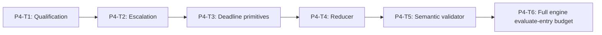

# Phase 4 Qualification and Engine Policy Implementation Plan

> **For agentic workers:** REQUIRED SUB-SKILL: Use
> `superpowers:subagent-driven-development` or `superpowers:executing-plans`,
> plus `superpowers:test-driven-development`. Execute only the assigned task.

**Goal:** Turn normalized detector outputs into deterministic qualified
findings, escalation-only Judge obligations, fail-closed policy decisions, and
a complete bounded `SandboxSecurityEngine` whose total budget starts at
`evaluate()` entry **before** internal authority normalization.

**Architecture:** Pure modules for qualification, escalation, deadline
primitives, reduction, and semantic validation. Engine composes them; accepts
unvalidated `SandboxSecurityEvaluationRequestInput`; never accepts pre-branded
requests.

**Tech Stack:** TypeScript on WSL Linux, injected monotonic scheduler, recording
ports, real tsc typecheck.

---

## Phase Entry Gate

```bash
REPO_ROOT="$(git rev-parse --show-toplevel)"
cd "$REPO_ROOT"
test "$(node -p 'process.platform')" = "linux"
test -f ./frontend/node_modules/typescript/bin/tsc
for cmd in node npm git; do
  path="$(command -v "$cmd")"
  case "$path" in *.exe|*.cmd|*.bat|/mnt/c/*|/mnt/d/*) exit 1;; esac
done

node --experimental-strip-types --test \
  engines/sandbox/tests/sandbox-security-detector.spec.ts \
  engines/sandbox/tests/sandbox-security-policy.spec.ts
npm run test:shared
npm run test:repo
node ./frontend/node_modules/typescript/bin/tsc --noEmit -p shared/tsconfig.json
node ./frontend/node_modules/typescript/bin/tsc --noEmit -p engines/sandbox/tsconfig.json
```

## Task DAG



## Deadline ownership

- **P4-T3:** primitives only (remaining budget, min(slot, remaining), abort,
  generation token, late result, cancellation, anomalies, pure run summaries).
- **P4-T6:** total budget from evaluate entry; includes internal
  normalization/authority/JCS/hash/sanitizer; post-sync recheck; no double
  external pre-normalize path.

Synchronous semantic: no claim to interrupt in-progress sync work; recheck after
each sync stage; fail closed if exhausted before detectors.

## P4-T1 / P4-T2

Qualification + escalation inventories as previously specified. Confidence
values for rule candidates remain `0.60|0.80|1.00` at qualification boundary
(Track1 adapter only emits 0.80).

Commits:

- `feat(sandbox): qualify deterministic security findings`
- `feat(sandbox): route escalation-only Judge evidence`

## P4-T3: Deadline Runtime Primitives

**Locked type:**

```ts
export interface SandboxSecurityRuntimePorts {
  now(): string;
  nextDecisionId(): string;
  monotonicNowMs(): number;
  scheduleTimeout(delayMs: number, callback: () => void): () => void;
}
```

Primitive REDs only (no evaluate-entry claims). Injected clocks; no real sleeps.

```bash
git commit -m "feat(sandbox): enforce detector deadlines and cancellation"
```

## P4-T4 / P4-T5

Reducer matrix + semantic forgery inventories as previously specified.

Commits:

- `feat(sandbox): reduce stage-aware security policy`
- `feat(sandbox): validate security decision semantics`

## P4-T6: Full Engine Orchestration and Evaluate-Entry Budget

**Files:**

- Create: `engines/sandbox/src/security/engine.ts`
- Create: `engines/sandbox/src/security/index.ts` (temporary; closed in P5-T4)
- Modify: engine specs + progress

### Locked final API (owned here)

```ts
export interface SandboxSecurityEngine {
  evaluate(
    input: Readonly<SandboxSecurityEvaluationRequestInput>,
    callerSignal?: AbortSignal
  ): Promise<Readonly<SandboxSecurityDecision>>;
}

export function createSandboxSecurityEngine(deps: {
  registry: SandboxSecurityDetectorRegistry;
  sanitizer?: SandboxSecuritySanitizer;
  runtime: SandboxSecurityRuntimePorts;
  /* profile id resolution via resolveSandboxSecurityProfile */
}): SandboxSecurityEngine;
```

### evaluate algorithm (locked)

```text
1. monotonic total deadline START
2. engine-internal normalizeSandboxSecurityEvaluationRequest(input)
3. recheck deadline
4. prepare input / JCS / hashes (recheck)
5. resolve profile + registry
6. run detectors with remaining budget
7. qualify / escalate / reduce / semantic validate
8. freeze decision; drop raw snapshot
```

No dual full normalization. Adapters must not pre-call the internal normalizer
for evaluate.

### Budget + integration REDs

```ts
test("REQ-SBX-GENERAL-001 evaluate starts budget before request normalization", async () => {});
test("REQ-SBX-GENERAL-001 authority normalization occurs inside evaluate", async () => {});
test("REQ-SBX-GENERAL-001 shared normalization consumes total budget", async () => {});
test("REQ-SBX-GENERAL-001 authority validation consumes total budget", async () => {});
test("REQ-SBX-GENERAL-001 JCS and canonical hashing consume total budget", async () => {});
test("REQ-SBX-GENERAL-001 sanitizer consumes Judge slot and total budget", async () => {});
test("REQ-SBX-GENERAL-001 budget exhausted during normalization prevents all detector calls", async () => {});
test("REQ-SBX-GENERAL-001 exhausted deadline after sync stages skips detectors", async () => {});
test("REQ-SBX-GENERAL-001 detectors receive only remaining budget", async () => {});
test("REQ-SBX-GENERAL-001 total budget exhaustion returns fail-closed decision", async () => {});
test("REQ-SBX-GENERAL-001 authority mismatch causes zero detector calls", async () => {});
```

### Combination REDs

```ts
test("REQ-SBX-GENERAL-001 high-risk rule short-circuits local and Judge", async () => {});
test("REQ-SBX-GENERAL-001 low-confidence evidence routes sanitizer and Judge risk", async () => {});
test("REQ-SBX-GENERAL-001 Judge clearance resolves one escalation signal", async () => {});
test("REQ-SBX-GENERAL-001 Judge no-match leaves signal unresolved and fails closed", async () => {});
test("REQ-SBX-GENERAL-001 sanitizer failure causes zero Judge calls", async () => {});
test("REQ-SBX-GENERAL-001 simulation evaluation remains labelled simulation", async () => {});
test("REQ-SBX-GENERAL-001 enforcement evaluation remains labelled enforcement", async () => {});
test("REQ-SBX-GENERAL-001 accepted finding plus timeout uses the stricter action", async () => {});
test("REQ-SBX-GENERAL-001 engine materializes tool name target and argument findings", async () => {});
```

### E2E + raw-retention REDs

```ts
test("REQ-SBX-GENERAL-001 evaluates authoritative user input end to end", async () => {});
test("REQ-SBX-GENERAL-001 evaluates model output and tool subjects", async () => {});
test("REQ-SBX-GENERAL-001 balanced rule-only no-match allows", async () => {});
test("REQ-SBX-GENERAL-001 strict executes required local detector", async () => {});
test("REQ-SBX-GENERAL-001 routed failure asks user-model and denies tool", async () => {});
test("REQ-SBX-GENERAL-001 serialized decision error and runs contain no sentinel", async () => {});
test("REQ-SBX-GENERAL-001 engine retains no raw snapshot after settlement", async () => {});
```

Strengthened raw-retention: property names, static scan, dual-eval sentinel,
recording fixtures, returned surfaces, non-physical-memory disclaimer.

### Call shape in tests

```ts
const decision = await engine.evaluate(
  { submission, authoritative_context },
  callerSignal
);
```

### Phase gate

```bash
node --experimental-strip-types --test \
  engines/sandbox/tests/sandbox-security-authority.spec.ts \
  engines/sandbox/tests/sandbox-security-input.spec.ts \
  engines/sandbox/tests/sandbox-security-detector.spec.ts \
  engines/sandbox/tests/sandbox-security-policy.spec.ts \
  engines/sandbox/tests/sandbox-security-engine.spec.ts
npm run test:shared
npm run test:repo
node ./frontend/node_modules/typescript/bin/tsc --noEmit -p shared/tsconfig.json
node ./frontend/node_modules/typescript/bin/tsc --noEmit -p engines/sandbox/tsconfig.json
git diff --check
git diff --summary
git commit -m "feat(sandbox): orchestrate general security evaluation"
```

## Phase 4 Exit Gate

Same as phase gate above.

## Phase 4 Report Format

```text
Phase: 4 Qualification and Engine Policy
evaluate(input envelope) locked:
budget starts before internal normalize:
no pre-branded evaluate parameter:
combination + budget REDs:
typecheck + repo:
Current status: PHASE_4_COMPLETE_PENDING_REVIEW
```
