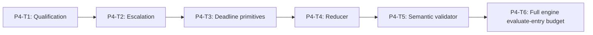

# Phase 4 Qualification and Engine Policy Implementation Plan

> **For agentic workers:** REQUIRED SUB-SKILL: Use
> `superpowers:subagent-driven-development` or `superpowers:executing-plans`,
> plus `superpowers:test-driven-development`. Execute only the assigned task.
>
> This phase plan is self-contained. Do not consult older plan revisions.
>
> **BLOCKED:** Canonical Specs are `DRAFT_REVISED_PENDING_REAPPROVAL`.
> Do not execute until both are reapproved and the user changes active sprint.

**Goal:** Turn normalized detector outputs into deterministic qualified
findings, escalation-only Judge obligations, fail-closed policy decisions, and
a complete bounded `SandboxSecurityEngine` whose normal 5000 ms work budget
starts at `evaluate()` entry **before** internal authority normalization, with
one bounded fail-closed epilogue after exhaustion (not claimed inside the
exhausted work budget).

**Architecture:** Pure modules for qualification, escalation, deadline
primitives, reduction, and semantic validation. Engine composes them; accepts
approved `SandboxSecurityEvaluationRequest`; never accepts pre-normalized
internal branded requests through the public surface.

**Tech Stack:** TypeScript on WSL Linux, injected monotonic scheduler, recording
ports, real tsc typecheck.

---

## Phase Entry Gate

```bash
REPO_ROOT="$(git rev-parse --show-toplevel)"
cd "$REPO_ROOT"
test "$(node -p 'process.platform')" = "linux"
test -f ./frontend/node_modules/typescript/bin/tsc
for cmd in node npm git; do
  path="$(command -v "$cmd")"
  case "$path" in *.exe|*.cmd|*.bat|/mnt/c/*|/mnt/d/*) exit 1;; esac
done

node --experimental-strip-types --test \
  engines/sandbox/tests/sandbox-security-detector.spec.ts \
  engines/sandbox/tests/sandbox-security-policy.spec.ts
npm run test:shared
npm run test:repo
node ./frontend/node_modules/typescript/bin/tsc --noEmit -p shared/tsconfig.json
node ./frontend/node_modules/typescript/bin/tsc --noEmit -p engines/sandbox/tsconfig.json
```

## Task DAG



## Deadline ownership

- **P4-T3:** primitives only (remaining budget, min(slot, remaining), abort,
  generation token, late result, cancellation, anomalies, pure run summaries).
- **P4-T6:** normal 5000 ms work budget from evaluate entry + one bounded fail-closed epilogue; includes internal
  normalization/authority/JCS/hash/sanitizer; post-sync recheck; no double
  external pre-normalize path.

Synchronous semantic: no claim to interrupt in-progress sync work; recheck after
each sync stage; fail closed if exhausted before detectors.

## Production file ownership (this phase only)

| Production file | Sole owner |
| --- | --- |
| `engines/sandbox/src/security/finding-qualification.ts` | P4-T1 |
| `engines/sandbox/src/security/escalation-state.ts` | P4-T2 |
| `engines/sandbox/src/security/runtime-deadline.ts` | P4-T3 |
| `engines/sandbox/src/security/run-ledger.ts` | P4-T3 |
| `engines/sandbox/src/security/policy-reducer.ts` | P4-T4 |
| `engines/sandbox/src/security/semantic-validator.ts` | P4-T5 |
| `engines/sandbox/src/security/engine.ts` | P4-T6 (execution orchestration only) |

No other production file is created or dual-owned in Phase 4.
No `detector-pipeline.ts` in this phase.

Contract ownership is equally strict:
P4-T1 owns DraftFinding, AcceptedSubjectEntity, qualification outputs, token
identity/materialization, and public finding publication;
P4-T2 owns escalation lifecycle, obligation materialization (call-once), and
Judge application;
P4-T3 owns runtime-deadline + RunLedger (`attachPublishedFindings`);
P4-T4 owns reduction;
P4-T5 owns slot evaluation records, complete EvaluationEvidenceLedger, and
semantic recomputation from boundary outcomes (never trusts qualified_evidence
cache);
P4-T6 only sequences those APIs and must not recompute qualification, verify
producer ownership, implement RunLedger transitions, copy Judge coverage, copy
token identity, invent semantic records, or bypass bounded epilogue APIs.

---

## P4-T1: Candidate Qualification and Finding Identity

### Goal / Acceptance

Qualify one slot of normalized candidates/clearances by that slot's profile
thresholds. Emit deterministic finding IDs and exact internal DraftFindings.
Compute canonical `subject_key` without slot ID. Return qualified clearances and
routing-floor risks for escalation (P4-T2); never delete accepted drafts via
clearance. No public Finding exists during qualification. Public tokens and
public findings are materialized exactly once after all rule/local/Judge
qualification via this task's two publication APIs.

### Files

- Create: `engines/sandbox/src/security/finding-qualification.ts`
- Create: `engines/sandbox/tests/sandbox-security-engine.spec.ts`

### Dependencies / frozen inputs

- P3 raw/external normalized results (`SandboxSecurityRawDetectorResult`,
  `SandboxSecurityExternalDetectorResult`).
- P3 slot manifest fields `qualification_threshold` / `routing_floor`.
- Shared finding types, `SandboxSecurityReasonCode`, severity, category.
- P2 JCS helpers for identity hashing.
- P3-T3 `computeSandboxSecuritySubjectKey` and canonical scope helper; P4-T1
  must import them and cannot hash subject identity locally.

### Locked contracts (sole owner: this task)

```ts
export interface SandboxSecurityAcceptedRiskEvidence {
  readonly category: SandboxSecurityRiskCategory;
  readonly subject_key: string;
  readonly source_slot_id: SandboxSecurityDetectorSlotId;
  readonly finding_id: string;
  readonly severity: SandboxSecuritySeverity;
  readonly confidence: number;
  readonly reason_code: SandboxSecurityReasonCode;
  readonly subject_refs: readonly SandboxSecurityCandidateSubjectRef[];
}

export interface SandboxSecurityQualifiedClearance {
  readonly category: SandboxSecurityRiskCategory;
  readonly subject_key: string;
  readonly source_slot_id: SandboxSecurityDetectorSlotId;
  readonly confidence: number;
}

export interface SandboxSecurityRoutingRiskEvidence {
  readonly category: SandboxSecurityRiskCategory;
  readonly subject_key: string;
  readonly source_slot_id: SandboxSecurityDetectorSlotId;
  readonly severity: SandboxSecuritySeverity;
  readonly confidence: number;
  readonly reason_code: SandboxSecurityReasonCode;
  readonly subject_refs: readonly SandboxSecurityCandidateSubjectRef[];
}

/** Exact Engine-internal draft. Never normalized as a public Finding. */
export interface SandboxSecurityDraftFinding {
  readonly finding_id: string;
  readonly detector_id: SandboxSecurityDetectorSlotId;
  readonly detector_version: string;
  readonly category: SandboxSecurityRiskCategory;
  readonly severity: SandboxSecuritySeverity;
  readonly confidence: number;
  readonly reason_code: SandboxSecurityReasonCode;
  readonly subject_key: string;
  readonly subject_refs: readonly SandboxSecurityCandidateSubjectRef[];
}

export interface SandboxSecurityQualifiedSlotEvidence {
  readonly source_slot_id: SandboxSecurityDetectorSlotId;
  readonly accepted_risks: readonly SandboxSecurityAcceptedRiskEvidence[];
  readonly accepted_draft_findings: readonly SandboxSecurityDraftFinding[];
  readonly qualified_clearances: readonly SandboxSecurityQualifiedClearance[];
  readonly routing_risks: readonly SandboxSecurityRoutingRiskEvidence[];
  readonly discarded_count: number;
}

/**
 * Private-handle map only. NO pre-minted public tokens on this map.
 * Qualification never receives external evaluation tokens.
 */
export interface SandboxSecurityQualificationSubjectMap {
  readonly evaluation_nonce: string;
  readonly sources: readonly {
    readonly source_handle: SandboxSecuritySourceHandle;
  }[];
  readonly tool?: Readonly<{
    readonly call_handle: SandboxSecurityCallHandle;
  }>;
}

/**
 * Sole public finding token mint. Called AFTER accepted-risk qualification
 * and BEFORE public findings are finalized for the decision.
 * Grammar (Spec-exact):
 *   source://sandbox/security/<decision-id>/<four-digit-ordinal>
 *   call://sandbox/security/<decision-id>/<four-digit-ordinal>
 * Never reuses external evaluation tokens (etok:*).
 */
export interface SandboxSecurityPublicSubjectTokenMap {
  readonly decision_id: string;
  readonly sources: readonly {
    readonly source_handle: SandboxSecuritySourceHandle;
    readonly public_source_token: string;
  }[];
  readonly tool?: Readonly<{
    readonly call_handle: SandboxSecurityCallHandle;
    readonly public_call_token: string;
  }>;
}

export type SandboxSecurityAcceptedSubjectEntity =
  | {
      readonly kind: "content_source";
      readonly source_handle: SandboxSecuritySourceHandle;
    }
  | {
      readonly kind: "tool_request";
      readonly call_handle: SandboxSecurityCallHandle;
    };

export function materializeSandboxSecurityPublicSubjectTokens(input: {
  readonly decision_id: string;
  readonly accepted_entities: readonly SandboxSecurityAcceptedSubjectEntity[];
}): Readonly<SandboxSecurityPublicSubjectTokenMap>;

/**
 * Rewrites draft finding subject_refs from private handles to Spec public tokens,
 * then sorts and assigns evidence_refs. Draft findings never leave Engine evaluate.
 * Accepts only the separate internal DraftFinding type and constructs a new
 * exact public Finding; no public Finding ever temporarily holds handles.
 */
export function publishSandboxSecurityFindings(input: {
  readonly draft_findings: readonly SandboxSecurityDraftFinding[];
  readonly token_map: Readonly<SandboxSecurityPublicSubjectTokenMap>;
  readonly decision_id: string;
}): readonly SandboxSecurityFinding[];

/**
 * Pure side-effect-free helpers (P4-T1 sole owner).
 * P4-T5 must call these for publication recompute; must not copy the algorithm.
 * They do not commit publication or mutate Engine state.
 */
export function deriveSandboxSecurityExpectedPublication(input: {
  readonly decision_id: string;
  readonly draft_findings:
    readonly SandboxSecurityDraftFinding[];
}): Readonly<{
  token_map: SandboxSecurityPublicSubjectTokenMap;
  findings: readonly SandboxSecurityFinding[];
}>;

export function validateSandboxSecurityPublication(input: {
  readonly decision_id: string;
  readonly draft_findings:
    readonly SandboxSecurityDraftFinding[];
  readonly actual_token_map:
    Readonly<SandboxSecurityPublicSubjectTokenMap>;
  readonly actual_findings:
    readonly SandboxSecurityFinding[];
}): void;


export function qualifySandboxSecuritySlotEvidence(input: {
  slot: Readonly<SandboxSecurityDetectorSlotManifest>;
  /** Always private-handle subjects after raw/external boundary normalize. */
  result: Readonly<SandboxSecurityNormalizedSlotResult>;
  decision_id: string;
  subject_map: Readonly<SandboxSecurityQualificationSubjectMap>;
}): SandboxSecurityQualifiedSlotEvidence;
// accepted_draft_findings use private handles only; no public Finding exists yet
```

Accepted risk evidence (locked):

```text
every accepted DraftFinding has paired accepted risk evidence
accepted evidence uses private subject_key
public finding uses public tokens (after materialize+publish only)
linked by finding_id
accepted evidence never exported to public decision
qualification never receives external evaluation tokens
QualificationSubjectMap carries private handles only (no public tokens)
QualifiedSlotEvidence always includes source_slot_id (even when empty arrays)

Pairing invariant: each AcceptedRiskEvidence maps to exactly one DraftFinding
and exactly one published Finding. Subject key, finding ID, detector ID/version,
category, severity, confidence, reason code, and canonical subject refs agree.
```

### Canonical subject_key (P3-T3-owned helper; no slot ID)

```text
subject_key = sha256_hex(
  JCS({
    category,
    subjects: sorted_canonical_private_subject_scopes
  })
)

scope forms:
  { kind:"content_source", source_handle, locator }
  { kind:"tool_request", call_handle, component, locator? }
```

Slot ID is evidence origin only (`source_slot_id`), never part of `subject_key`
or signal identity.
P4-T1 calls `computeSandboxSecuritySubjectKey`; the formula below is a contract
reference, not a second implementation.

### Confidence bands

```text
confidence >= qualification_threshold
  → accepted DraftFinding (risk candidate)
  → qualified clearance (clearance item)
routing_floor <= confidence < qualification_threshold
  → temporary routing-floor risk evidence (risk candidate only)
  → not returned as public finding
  → clearance in this band is not a qualified clearance
confidence < routing_floor
  → discarded; increments discarded_count; cannot affect verdict/action
```

Severity does not bypass confidence. A critical candidate below threshold is not
accepted; it may become routing-floor evidence when it reaches the floor.

### Qualification rules (locked)

```text
public findings only from accepted risk candidates
clearances never delete accepted DraftFindings
clearances never create escalation signals by themselves
routing_risks are routing-floor risk candidates only
same-slot uniqueness key (invalid if repeated):
  slot ID + category + reason code + sorted engine-private subject refs
cross-slot equivalent evidence remains separate findings
finding_id =
  finding:sha256:<SHA-256 of JCS(decision_id, uniqueness key, severity, confidence)>
grammar: ^finding:sha256:[a-f0-9]{64}$
rule candidate confidences at this boundary: only 0.60 | 0.80 | 1.00
Track1 adapter emits only 0.80 (P5-T2; not this task)
```

Public finding token materialization (locked; P4-T1 sole owner):

```text
1. qualifySandboxSecuritySlotEvidence accepts only private-handle subjects
   via QualificationSubjectMap (NO pre-minted public tokens on the map)
2. determine accepted risk candidates for the slot
3. after ALL rule/local/Judge qualification, collect every accepted DraftFinding
4. extract only underlying entities: source_handle for content_source and
   call_handle for tool_request; ignore locator/component/category/severity/
   reason_code/slot/finding_id for token identity
5. deduplicate by handle before materialization; token-map input rejects any
   duplicate private handle and rejects etok:* values
6. sort by kind then private-handle byte order; source and call entities share
   one global four-digit ordinal sequence starting at 0001
7. source subjects → source://sandbox/security/<decision-id>/<ordinal>
   tool subjects → call://sandbox/security/<decision-id>/<ordinal>
8. materialize the token map exactly once per evaluation
9. publish exactly once after Judge qualification; verify complete token-map
   coverage and decision_id == token_map.decision_id; replace handles while
   preserving locator/component; recursively freeze the exact public Finding array
10. sort final findings (severity desc, category, detector_id, reason_code,
   canonical public subject refs, finding_id)
11. assign exactly one evidence ref per sorted finding, ordinal from 0001:
    evidence://sandbox/security/<decision-id>/<four-digit-ordinal>
12. drafts contain no evidence_refs; detector-supplied evidence refs are rejected
13. routing-only, clearance-only, discarded subjects receive NO public token
14. external etok:* tokens are NEVER reused as public finding tokens
15. same decision_id + same accepted entity set yields identical map; a
    different decision_id yields different public tokens

DraftFinding is a separate exact type, not `Omit<SandboxSecurityFinding, ...>`
and not a type assertion. It has private refs, no public tokens/evidence_refs,
never calls the public Finding normalizer, and never reaches reducer/decision.

qualifySandboxSecuritySlotEvidence returns:
  - accepted_risks (private subject_key)
  - accepted_draft_findings with private-handle subject_refs
  - qualified_clearances + routing_risks + discarded_count + source_slot_id
Engine (P4-T6) after all slots:
  1. finish rule/local/Judge qualification and resolution
  2. collect all drafts and underlying entities
  3. materializeSandboxSecurityPublicSubjectTokens exactly once
  4. publishSandboxSecurityFindings exactly once
```

Rules bullets:

```text
- every accepted DraftFinding has paired accepted risk evidence (private subject_key)
- public finding tokens minted only after accepted-risk qualification via
  materializeSandboxSecurityPublicSubjectTokens (never pre-supplied)
- accepted risk evidence never enters public decision
- clearances never delete accepted DraftFindings
- only routing-floor risks (without accepted same-scope risk) create signals
- below-floor discarded
- qualification never receives external evaluation tokens
- QualifiedSlotEvidence always carries source_slot_id (even when empty arrays)
```

### Step 1: Exact RED test inventory

```ts
test("REQ-SBX-GENERAL-001 qualifies candidates at or above threshold", () => {});
test("REQ-SBX-GENERAL-001 keeps routing-floor evidence out of returned findings", () => {});
test("REQ-SBX-GENERAL-001 discards below routing floor", () => {});
test("REQ-SBX-GENERAL-001 severity does not bypass confidence threshold", () => {});
test("REQ-SBX-GENERAL-001 rejects duplicate candidate uniqueness keys in one slot", () => {});
test("REQ-SBX-GENERAL-001 finding_id matches finding:sha256 64hex grammar", () => {});
test("REQ-SBX-GENERAL-001 finding identity is stable under subject ref sort", () => {});
test("REQ-SBX-GENERAL-001 subject_key excludes slot ID and uses sorted private scopes", () => {});
test("REQ-SBX-GENERAL-001 maps private handles to public source and call tokens", () => {});
test("REQ-SBX-GENERAL-001 assigns evidence refs by decision ordinal only after sort", () => {});
test("REQ-SBX-GENERAL-001 cross-slot equivalent evidence remains separate findings", () => {});
test("REQ-SBX-GENERAL-001 rule confidences accept only 0.60 0.80 1.00 at boundary", () => {});
test("REQ-SBX-GENERAL-001 qualified findings contain no raw content or prose", () => {});
test("REQ-SBX-GENERAL-001 clearances never delete accepted DraftFindings", () => {});
test("REQ-SBX-GENERAL-001 qualifySandboxSecuritySlotEvidence returns QualifiedSlotEvidence shape", () => {});
test("REQ-SBX-GENERAL-001 every accepted DraftFinding has paired AcceptedRiskEvidence", () => {});
test("REQ-SBX-GENERAL-001 rejects AcceptedRisk and DraftFinding subject-ref mismatch", () => {});
test("REQ-SBX-GENERAL-001 DraftFinding carries subject_key from the P3 helper", () => {});
test("REQ-SBX-GENERAL-001 AcceptedRisk DraftFinding and public Finding pair one-to-one", () => {});
test("REQ-SBX-GENERAL-001 accepted risk evidence uses private subject_key not public tokens", () => {});
test("REQ-SBX-GENERAL-001 qualification accepts only NormalizedSlotResult private refs", () => {});
test("REQ-SBX-GENERAL-001 routing_risks exclude accepted same-scope candidates", () => {});
test("REQ-SBX-GENERAL-001 public source tokens use decision-scoped exact grammar", () => {});
test("REQ-SBX-GENERAL-001 public call tokens use decision-scoped exact grammar", () => {});
test("REQ-SBX-GENERAL-001 tokens are minted only after risk qualification", () => {});
test("REQ-SBX-GENERAL-001 canonical entity order determines the global four-digit ordinal", () => {});
test("REQ-SBX-GENERAL-001 same decision and accepted entity set produce identical tokens", () => {});
test("REQ-SBX-GENERAL-001 different decision IDs produce different public tokens", () => {});
test("REQ-SBX-GENERAL-001 discarded and routing-only evidence receives no public token", () => {});
test("REQ-SBX-GENERAL-001 external etok tokens are never reused as public tokens", () => {});
test("REQ-SBX-GENERAL-001 QualificationSubjectMap carries private handles only", () => {});
test("REQ-SBX-GENERAL-001 QualifiedSlotEvidence always includes source_slot_id", () => {});
test("REQ-SBX-GENERAL-001 qualification returns DraftFinding rather than public Finding", () => {});
test("REQ-SBX-GENERAL-001 DraftFinding subject refs use private handles only", () => {});
test("REQ-SBX-GENERAL-001 DraftFinding contains no public tokens or evidence refs", () => {});
test("REQ-SBX-GENERAL-001 publish converts every private handle to a public token", () => {});
test("REQ-SBX-GENERAL-001 deriveSandboxSecurityExpectedPublication matches committed publication", () => {});
test("REQ-SBX-GENERAL-001 validateSandboxSecurityPublication is pure and side-effect free", () => {});
test("REQ-SBX-GENERAL-001 validateSandboxSecurityPublication rejects forged token map", () => {});
test("REQ-SBX-GENERAL-001 validateSandboxSecurityPublication rejects forged finding order", () => {});
test("REQ-SBX-GENERAL-001 publish rejects decision ID different from token map", () => {});
test("REQ-SBX-GENERAL-001 public Finding never exposes source_handle or call_handle", () => {});
test("REQ-SBX-GENERAL-001 public finding normalizer is never used for DraftFinding", () => {});
test("REQ-SBX-GENERAL-001 multiple locators on one source reuse one public source token", () => {});
test("REQ-SBX-GENERAL-001 multiple categories on one source reuse one public source token", () => {});
test("REQ-SBX-GENERAL-001 multiple tool components on one call reuse one public call token", () => {});
test("REQ-SBX-GENERAL-001 locator does not participate in public token identity", () => {});
test("REQ-SBX-GENERAL-001 component does not participate in public token identity", () => {});
test("REQ-SBX-GENERAL-001 source and call entities share one deterministic ordinal sequence", () => {});
test("REQ-SBX-GENERAL-001 token map rejects duplicate private handles", () => {});
test("REQ-SBX-GENERAL-001 published evidence ref uses exact grammar", () => {});
test("REQ-SBX-GENERAL-001 evidence ordinal follows final finding order", () => {});
test("REQ-SBX-GENERAL-001 every published finding has exactly one evidence ref", () => {});
test("REQ-SBX-GENERAL-001 draft finding has no evidence ref", () => {});
test("REQ-SBX-GENERAL-001 detector supplied evidence refs are never preserved", () => {});
```

### Step 2: RED command

```bash
node --experimental-strip-types --test engines/sandbox/tests/sandbox-security-engine.spec.ts
```

### Expected RED failure and why valid

Missing `finding-qualification.ts` or identity/threshold/subject_key assertions
fail for behavioral reasons. Not env/toolchain errors.

### Step 3: Implementation boundary

Create only `finding-qualification.ts`. Implement
`qualifySandboxSecuritySlotEvidence`,
`materializeSandboxSecurityPublicSubjectTokens`,
`publishSandboxSecurityFindings` + types above.

Must not:

- implement escalation state (P4-T2);
- implement reducer (P4-T4) or full evaluate (P4-T6);
- create `escalation-state.ts`, `policy-reducer.ts`, `engine.ts`;
- change profile thresholds (P3-T5 owns; stop for rework if wrong);
- export these types from final public allowlist (engine-private);
- pre-supply public tokens on QualificationSubjectMap;
- reuse external etok:* tokens as public finding tokens.
- use public `SandboxSecurityFinding` as a temporary private-handle container;
- call the shared public Finding normalizer for a DraftFinding.
- implement subject scope canonicalization or subject_key hashing locally.

### Step 4: GREEN command and expected result

```bash
node --experimental-strip-types --test engines/sandbox/tests/sandbox-security-engine.spec.ts
```

Qualification inventory green.

### Step 5: Broader gates

None.

### Step 6: Exact git add paths + commit

```bash
git add engines/sandbox/src/security/finding-qualification.ts \
  engines/sandbox/tests/sandbox-security-engine.spec.ts
git commit -m "feat(sandbox): qualify deterministic security findings"
```

### Stop/report

Stop after commit.

---

## P4-T2: Escalation-Only Judge State

### Goal / Acceptance

Maintain escalation-only Judge routing state. Judge is not a general second
opinion channel. Only routing-floor risks without accepted same-scope create
signals. Clearance from rule/local records disagreement only. Judge clearance
resolves one matched signal and never removes accepted DraftFindings. Judge no-match
leaves signals unresolved.

### Files

- Create: `engines/sandbox/src/security/escalation-state.ts`
- Modify: `engines/sandbox/tests/sandbox-security-engine.spec.ts`

### Dependencies / frozen inputs

- P4-T1 `SandboxSecurityQualifiedSlotEvidence`,
  `SandboxSecurityAcceptedRiskEvidence`,
  `SandboxSecurityRoutingRiskEvidence`, `SandboxSecurityQualifiedClearance`.
- P3 Judge routing_rule `unresolved_escalation_signal`.
- P3-T4 external token registry and obligation-bearing payload types.
- Canonical `subject_key` and private-scope helpers from P3-T3 (no slot ID);
  P4-T1 and P4-T2 only consume them.

### Locked contracts (sole owner: this task)

```ts
export interface SandboxSecurityEscalationSignal {
  readonly category: SandboxSecurityRiskCategory;
  readonly subject_key: string;
  readonly subject_refs:
    readonly SandboxSecurityCandidateSubjectRef[];
  readonly origin_slot_ids: readonly SandboxSecurityDetectorSlotId[];
  readonly severity: SandboxSecuritySeverity;
  readonly confidence: number;
  readonly reason_code: SandboxSecurityReasonCode;
}

/**
 * Resolution ownership lock:
 * LOCKED: define the exact discriminated union in P4-T2 escalation-state.ts
 * (export type SandboxSecurityJudgeResolutionEvidence = ...).
 * P4-T2 applyJudgeOutcome returns that union so P4-T6 does not re-implement
 * obligation/signal matching when building the ledger.
 * P4-T5 imports it from escalation-state.ts and re-exports for local imports
 * (do not redefine loosely).
 */
export type SandboxSecurityJudgeResolutionEvidence =
  | {
      readonly kind: "accepted_risk";
      readonly obligation_id: string;
      readonly category: SandboxSecurityRiskCategory;
      readonly subject_key: string;
      readonly finding_id: string;
    }
  | {
      readonly kind: "qualified_clearance";
      readonly obligation_id: string;
      readonly category: SandboxSecurityRiskCategory;
      readonly subject_key: string;
    }
  | {
      readonly kind: "partial_coverage";
      readonly covered_obligation_ids: readonly string[];
      readonly uncovered_obligation_ids: readonly string[];
    }
  | { readonly kind: "no_match" }
  | {
      readonly kind: "low_confidence_unresolved";
      readonly obligation_id: string;
      readonly category: SandboxSecurityRiskCategory;
      readonly subject_key: string;
    }
  | {
      readonly kind: "invalid_result";
      readonly error_code:
        | "detector_result_invalid"
        | "detector_content_leak";
    };

export type SandboxSecurityNormalizedJudgeOutcome =
  | {
      readonly status: "matched";
      readonly evidence: Readonly<SandboxSecurityQualifiedSlotEvidence>;
      readonly covered_obligation_ids: readonly string[];
    }
  | {
      readonly status: "no_match";
      readonly covered_obligation_ids: readonly [];
    }
  | {
      readonly status: "invalid_result";
      readonly error_code:
        | "detector_result_invalid"
        | "detector_content_leak";
    };

export interface SandboxSecurityJudgeApplicationResult {
  readonly resolution_evidence:
    readonly SandboxSecurityJudgeResolutionEvidence[];
  readonly unresolved_signals:
    readonly SandboxSecurityEscalationSignal[];
  readonly accepted_draft_findings:
    readonly SandboxSecurityDraftFinding[];
  /** Obligation IDs covered by this Judge application; subset of routed set. */
  readonly covered_obligation_ids: readonly string[];
}

export type SandboxSecurityEscalationLifecycle =
  | "collecting"
  | "obligations_materialized"
  | "judge_applied"
  | "closed";

export type SandboxSecurityJudgeTerminationReason =
  | "risk_short_circuit"
  | "detector_unavailable"
  | "external_redaction_failed"
  | "detector_failed"
  | "detector_timeout"
  | "evaluation_terminated";

export interface SandboxSecurityEscalationState {
  lifecycle(): SandboxSecurityEscalationLifecycle;
  /** Rule/local only. Judge evidence is forbidden. */
  addSlotEvidence(evidence: SandboxSecurityQualifiedSlotEvidence): void;
  unresolvedSignals(): readonly SandboxSecurityEscalationSignal[];
  materializeRoutedObligations(input: {
    readonly decision_id: string;
    readonly token_registry:
      Readonly<SandboxSecurityExternalTokenRegistry>;
  }): readonly SandboxSecuritySanitizedJudgeObligation[];
  applyJudgeOutcome(
    outcome: Readonly<SandboxSecurityNormalizedJudgeOutcome>
  ): Readonly<SandboxSecurityJudgeApplicationResult>;
  /**
   * resolution_evidence always []; no judge_terminated evidence kind.
   * Termination is Judge SlotEvaluationRecord + DetectorRun + unresolved signals.
   */
  terminateJudgeAttempt(input: Readonly<{
    reason: SandboxSecurityJudgeTerminationReason;
  }>): Readonly<SandboxSecurityJudgeApplicationResult>;
  closeWithoutJudge(): void;
  close(): void;
}

export function createSandboxSecurityEscalationState():
  SandboxSecurityEscalationState;
```

Lifecycle call-once rules:

```text
collecting:
  allow addSlotEvidence(rule/local only)
  forbid applyJudgeOutcome
  materializeRoutedObligations once -> obligations_materialized
  closeWithoutJudge when no unresolved signals -> closed
  terminateJudgeAttempt once -> closed (signals preserved)

obligations_materialized:
  forbid addSlotEvidence
  applyJudgeOutcome once -> judge_applied
  terminateJudgeAttempt once -> closed (signals preserved)
  Judge cannot create new escalation signals
  covered_obligation_ids only from this evaluation's routed set; no duplicates

judge_applied:
  close once -> closed  (mandatory after applyJudgeOutcome)

closed:
  all mutation fails
  final unresolved signals read only from closed state

Normal path: applyJudgeOutcome -> close -> read final unresolved signals
Failure without NormalizedJudgeOutcome: terminateJudgeAttempt once
```

P4-T2 materializes deterministic obligation IDs from unresolved signals after
P3 external-token issuance. `applyJudgeOutcome` alone creates every accepted,
clearance, partial, no-match, low-confidence, omitted, and invalid resolution
record. Failure paths without a NormalizedJudgeOutcome must call
`terminateJudgeAttempt` once. P4-T6 only forwards outcomes or termination reasons.

### Full behavior matrix (locked)

```text
rule/local accepted risk
  → suppress same category+subject_key routing signal
rule/local routing-floor risk without accepted same-scope
  → create/merge signal by category+subject_key
  → merge origin_slot_ids; keep highest severity/confidence per merge rules
rule/local qualified clearance
  → disagreement only; cannot resolve signal; cannot delete accepted DraftFinding
Judge accepted risk (confidence >= Judge qualification_threshold)
  → resolve only the signal bound to its routed obligation_id
  → preserve accepted DraftFinding for the later global publication pass
Judge qualified clearance (confidence >= Judge qualification_threshold)
  → resolve only its matching routed obligation
  → never remove accepted DraftFinding
Judge partial coverage
  → covered signals may resolve; uncovered remain unresolved
Judge no_match
  → applyJudgeOutcome(); all current signals remain unresolved
Judge low-confidence candidate/clearance (below Judge threshold)
  → not qualified; signals remain unresolved
uncovered escalation signals after partial Judge
  → remain unresolved; fail-closed when still present
stale/wrong-scope / outside routed payload Judge evidence
  → invalid_result path at engine; signals remain unresolved
no voting/averaging across slots
Judge never invents categories outside payload
escalation state is engine-private; not exported on public decision
```

Signal identity:

```text
merge key = category + subject_key
subject_key has no slot ID
origin_slot_ids is evidence provenance only
```

### Step 1: Exact RED test inventory

```ts
test("REQ-SBX-GENERAL-001 escalation routes Judge only for unresolved signals", () => {});
test("REQ-SBX-GENERAL-001 no escalation signal skips Judge", () => {});
test("REQ-SBX-GENERAL-001 accepted same-scope risk suppresses routing signal", () => {});
test("REQ-SBX-GENERAL-001 routing-floor risk creates signal by category and subject_key", () => {});
test("REQ-SBX-GENERAL-001 local clearance cannot resolve escalation signal", () => {});
test("REQ-SBX-GENERAL-001 Judge clearance resolves one escalation signal", () => {});
test("REQ-SBX-GENERAL-001 Judge clearance never removes accepted DraftFindings", () => {});
test("REQ-SBX-GENERAL-001 Judge risk accepts finding and resolves matching signal", () => {});
test("REQ-SBX-GENERAL-001 Judge no-match leaves escalation unresolved", () => {});
test("REQ-SBX-GENERAL-001 Judge partial coverage leaves uncovered signals unresolved", () => {});
test("REQ-SBX-GENERAL-001 uncovered escalation signals remain unresolved", () => {});
test("REQ-SBX-GENERAL-001 partial Judge coverage remains fail-closed when signals remain", () => {});
test("REQ-SBX-GENERAL-001 applyJudgeOutcome accepts qualified evidence not routing risk", () => {});
test("REQ-SBX-GENERAL-001 multiple signals remain independent", () => {});
test("REQ-SBX-GENERAL-001 signal merge key excludes slot ID", () => {});
test("REQ-SBX-GENERAL-001 signal private refs canonicalize to subject_key", () => {});
test("REQ-SBX-GENERAL-001 obligation scope maps signal refs through external registry", () => {});
test("REQ-SBX-GENERAL-001 escalation state is not exported on public decision", () => {});
test("REQ-SBX-GENERAL-001 createSandboxSecurityEscalationState exposes full method matrix", () => {});
test("REQ-SBX-GENERAL-001 obligations use decision-scoped deterministic IDs", () => {});
test("REQ-SBX-GENERAL-001 obligations sort by category and canonical tokenized scope", () => {});
test("REQ-SBX-GENERAL-001 addSlotEvidence rejects Judge evidence", () => {});
test("REQ-SBX-GENERAL-001 applyJudgeOutcome returns all resolution evidence", () => {});
test("REQ-SBX-GENERAL-001 applyJudgeOutcome preserves omitted obligations unresolved", () => {});
test("REQ-SBX-GENERAL-001 no-match and invalid outcome preserve every signal", () => {});
test("REQ-SBX-GENERAL-001 Judge routing risks cannot create new signals", () => {});
test("REQ-SBX-GENERAL-001 obligations may be materialized once", () => {});
test("REQ-SBX-GENERAL-001 slot evidence cannot be added after obligation materialization", () => {});
test("REQ-SBX-GENERAL-001 Judge outcome requires materialized obligations", () => {});
test("REQ-SBX-GENERAL-001 Judge outcome may be applied once", () => {});
test("REQ-SBX-GENERAL-001 Judge cannot create new escalation signal", () => {});
test("REQ-SBX-GENERAL-001 closed escalation state rejects mutation", () => {});
test("REQ-SBX-GENERAL-001 Judge unavailable closes escalation state with signals unresolved", () => {});
test("REQ-SBX-GENERAL-001 sanitizer failure closes escalation state with signals unresolved", () => {});
test("REQ-SBX-GENERAL-001 Judge timeout closes escalation state with signals unresolved", () => {});
test("REQ-SBX-GENERAL-001 budget termination closes obligations_materialized state", () => {});
test("REQ-SBX-GENERAL-001 successful Judge outcome is followed by close", () => {});
test("REQ-SBX-GENERAL-001 rule short-circuit with no signals closes without Judge", async () => {});
test("REQ-SBX-GENERAL-001 rule short-circuit with unrelated signal terminates Judge attempt", async () => {});
test("REQ-SBX-GENERAL-001 short-circuit termination preserves unrelated unresolved signals", async () => {});
test("REQ-SBX-GENERAL-001 short-circuit never materializes routed obligations", async () => {});
test("REQ-SBX-GENERAL-001 short-circuit never calls sanitizer or Judge", async () => {});
test("REQ-SBX-GENERAL-001 short-circuit reads final signals only after escalation closes", async () => {});
test("REQ-SBX-GENERAL-001 short-circuit profile-required slot keeps profile_required + risk_short_circuit", async () => {});
test("REQ-SBX-GENERAL-001 short-circuit optional never-selected uses optional_not_selected + risk_short_circuit", async () => {});
test("REQ-SBX-GENERAL-001 short-circuit never fabricates runtime_required", async () => {});
test("REQ-SBX-GENERAL-001 terminateJudgeAttempt is mutually exclusive with applyJudgeOutcome", () => {});
test("REQ-SBX-GENERAL-001 terminateJudgeAttempt returns empty resolution_evidence", () => {});
test("REQ-SBX-GENERAL-001 terminateJudgeAttempt creates no accepted findings or new signals", () => {});
```

### Step 2: RED command

```bash
node --experimental-strip-types --test engines/sandbox/tests/sandbox-security-engine.spec.ts
```

### Expected RED failure and why valid

Missing `escalation-state.ts` or incorrect Judge routing/resolve conditions.

### Step 3: Implementation boundary

Create only `escalation-state.ts`. Implement
`createSandboxSecurityEscalationState`, obligation materialization, and the
single `applyJudgeOutcome` matrix.

Must not:

- create or modify `detector-pipeline.ts`;
- re-qualify candidates (P4-T1 owns identity);
- implement full engine budget (P4-T6);
- implement reducer (P4-T4);
- export escalation internals on final public index.

### Step 4: GREEN command and expected result

```bash
node --experimental-strip-types --test engines/sandbox/tests/sandbox-security-engine.spec.ts
```

Escalation inventory green.

### Step 5: Broader gates

None.

### Step 6: Exact git add paths + commit

```bash
git add engines/sandbox/src/security/escalation-state.ts \
  engines/sandbox/tests/sandbox-security-engine.spec.ts
git commit -m "feat(sandbox): route escalation-only Judge evidence"
```

### Stop/report

Stop after commit.

---

## P4-T3: Deadline Runtime Primitives

### Goal / Acceptance

Injected monotonic clock, remaining budget, effective timeout, abort generation
tokens, late-result ignore, cancellation, anomaly handling. No evaluate-entry
budget claims in this task. Own the run ledger state machine; no detector
orchestration.

### Files

- Create: `engines/sandbox/src/security/runtime-deadline.ts`
- Create: `engines/sandbox/src/security/run-ledger.ts`
- Modify: `engines/sandbox/tests/sandbox-security-engine.spec.ts`

### Dependencies / frozen inputs

- Spec budget formulas and error codes.
- Master deadline split: primitives only here; evaluate-entry total in P4-T6.

### Locked contracts (sole owner: this task)

```ts
export interface SandboxSecurityRuntimePorts {
  now(): string;
  nextDecisionId(): string;
  monotonicNowMs(): number;
  scheduleTimeout(delayMs: number, callback: () => void): () => void;
}

export interface SandboxSecurityDetectorLease {
  readonly signal: AbortSignal;
  readonly effective_timeout_ms: number;
  readonly termination_reason:
    | "slot_timeout"
    | "work_budget"
    | "caller_cancelled"
    | null;

  closeGeneration(): void;
  isGenerationOpen(): boolean;
  dispose(): void;
}

export interface SandboxSecurityDeadlineController {
  remainingMs(): number;

  createDetectorLease(input: Readonly<{
    slot_timeout_ms: number;
    parent_signal?: AbortSignal;
  }>): SandboxSecurityDetectorLease;
}

export function createSandboxSecurityDeadlineController(input: {
  runtime: SandboxSecurityRuntimePorts;
  normalWorkBudgetMs: number;
  startedAtMs: number;
}): SandboxSecurityDeadlineController;

export type SandboxDetectorFailedRunErrorCode =
  | "detector_unavailable"
  | "detector_failed"
  | "external_redaction_failed"
  | "adapter_unsupported";

export interface SandboxSecurityRunLedger {
  markSkipped(input: Readonly<{
    slot_id: SandboxSecurityDetectorSlotId;
    obligation: SandboxDetectorRunObligation;
    skip_reason: SandboxDetectorSkipReason;
    elapsed_ms: number;
  }>): void;
  markStarted(input: Readonly<{
    slot_id: SandboxSecurityDetectorSlotId;
    obligation: SandboxDetectorRunObligation;
    started_monotonic_ms: number;
  }>): void;
  markMatched(input: Readonly<{slot_id: SandboxSecurityDetectorSlotId; elapsed_ms: number}>): void;
  markNoMatch(input: Readonly<{slot_id: SandboxSecurityDetectorSlotId; elapsed_ms: number}>): void;
  markFailed(input: Readonly<{
    slot_id: SandboxSecurityDetectorSlotId;
    elapsed_ms: number;
    error_code: SandboxDetectorFailedRunErrorCode;
  }>): void;
  markTimeout(input: Readonly<{slot_id: SandboxSecurityDetectorSlotId; elapsed_ms: number}>): void;
  markInvalidResult(input: Readonly<{
    slot_id: SandboxSecurityDetectorSlotId;
    elapsed_ms: number;
    error_code: "detector_result_invalid" | "detector_content_leak";
  }>): void;
  attachPublishedFindings(
    findings: readonly SandboxSecurityFinding[]
  ): void;
  finalize(): readonly SandboxDetectorRun[];
  snapshot(): Readonly<SandboxSecurityRunLedgerSnapshot>;
}

export type SandboxSecurityRunLedgerLifecycle =
  | "open"
  | "findings_attached"
  | "finalized";

export interface SandboxSecurityRunLedgerSlotSnapshot {
  readonly slot_id: SandboxSecurityDetectorSlotId;
  readonly status:
    | "not_started"
    | "skipped"
    | "running"
    | "matched"
    | "no_match"
    | "failed"
    | "timeout"
    | "invalid_result";
  readonly obligation?: SandboxDetectorRunObligation;
  readonly skip_reason?: SandboxDetectorSkipReason;
  readonly error_code?: SandboxDetectorRunErrorCode;
}

export interface SandboxSecurityRunLedgerSnapshot {
  readonly lifecycle: SandboxSecurityRunLedgerLifecycle;
  readonly slots: readonly SandboxSecurityRunLedgerSlotSnapshot[];
}

export function createSandboxSecurityRunLedger(input: Readonly<{
  profile: Readonly<SandboxSecurityPolicyProfileManifest>;
}>): SandboxSecurityRunLedger;

```

```text
effective_timeout_ms = min(slot_timeout_ms, remaining normal work budget)
slot timer abort alone → termination_reason "slot_timeout"
work budget first → termination_reason "work_budget"
when slot timeout and work budget expire at the same monotonic instant →
  termination_reason "work_budget" (work budget wins)
parent signal cancel → termination_reason "caller_cancelled"
  (engine maps to sandbox_security_cancelled; distinct from budget exhaustion)
dispose() cancels timer and parent listener; timer callback after dispose is no-op
closeGeneration() → late results ignored; cannot mutate state
no real sleep; pure tests use fake clocks
no retry
invalid monotonic time → sandbox_security_internal_invalid
invalid scheduler callback/handle → sandbox_security_internal_invalid
primitives make no evaluate-entry ownership claims

run ledger:
  factory prebuilds one not_started entry per profile slot in manifest order
  detector ID/version/kind come only from profile.detector_slots
  every method rejects a slot outside the selected profile
  not_started → skipped | running
  running → matched | no_match | failed | timeout | invalid_result
  terminal status cannot mutate
  attachPublishedFindings once after all slots terminal and after publication
  groups by finding.detector_id; only matched runs may own non-empty IDs
  no_match/failed/timeout/invalid/skipped runs must have no findings
  each finding belongs to exactly one run; finding ID order = global relative order
  rejects unknown detector, foreign slot, duplicates, second attachment
  finalize requires terminal slots + attachment phase, emits manifest order, closes ledger
  selected configured optional local → runtime_required
  unrouted Judge → optional_not_selected/skipped
  routed Judge → runtime_required before availability check
  skip reasons closed set: optional_not_configured | optional_not_selected |
    routing_not_selected | risk_short_circuit | evaluation_terminated
  opaque finding IDs alone never prove producer ownership
  snapshot() is the sole canonical read API for slot status + lifecycle
  Scheme B must not maintain a divergent parallel status table
  after finalize, snapshot is recursively frozen and immutable
```

`SandboxSecurityRuntimePorts` is the exact Spec port (later exported in Master D
via P5-T4). This task owns the type definition location in
`runtime-deadline.ts`.

### Step 1: Exact RED test inventory

```ts
test("REQ-SBX-GENERAL-001 remaining budget decreases with monotonic time", () => {});
test("REQ-SBX-GENERAL-001 detector lease aborts at effective timeout", () => {});
test("REQ-SBX-GENERAL-001 detector lease termination_reason distinguishes slot_timeout and work_budget", () => {});
test("REQ-SBX-GENERAL-001 detector lease termination_reason work_budget wins simultaneous expiry", () => {});
test("REQ-SBX-GENERAL-001 detector lease termination_reason caller_cancelled on parent signal", () => {});
test("REQ-SBX-GENERAL-001 dispose cancels scheduled timeout and parent listener", () => {});
test("REQ-SBX-GENERAL-001 late result after generation close is ignored", () => {});
test("REQ-SBX-GENERAL-001 caller cancellation is distinct from budget exhaustion", () => {});
test("REQ-SBX-GENERAL-001 invalid monotonic time is sandbox_security_internal_invalid", () => {});
test("REQ-SBX-GENERAL-001 invalid scheduler is sandbox_security_internal_invalid", () => {});
test("REQ-SBX-GENERAL-001 pure run summary records timeout without real sleep", () => {});
test("REQ-SBX-GENERAL-001 deadline primitives make no evaluate-entry claims", () => {});
test("REQ-SBX-GENERAL-001 SandboxSecurityRuntimePorts exposes now nextDecisionId monotonicNowMs scheduleTimeout", () => {});
test("REQ-SBX-GENERAL-001 createDetectorLease requires slot_timeout_ms input", () => {});
test("REQ-SBX-GENERAL-001 run ledger covers every legal state transition", () => {});
test("REQ-SBX-GENERAL-001 run ledger factory initializes every manifest slot", () => {});
test("REQ-SBX-GENERAL-001 run ledger attaches findings by finding.detector_id", () => {});
test("REQ-SBX-GENERAL-001 run ledger rejects finding for unknown profile slot", () => {});
test("REQ-SBX-GENERAL-001 run ledger rejects finding attached to non-matched run", () => {});
test("REQ-SBX-GENERAL-001 run ledger rejects duplicate finding IDs", () => {});
test("REQ-SBX-GENERAL-001 each published finding belongs to exactly one run", () => {});
test("REQ-SBX-GENERAL-001 attachPublishedFindings may be called once", () => {});
test("REQ-SBX-GENERAL-001 finalize rejects missing finding attachment phase", () => {});
test("REQ-SBX-GENERAL-001 finalized run ledger is immutable and closed", () => {});
test("REQ-SBX-GENERAL-001 run ledger snapshot reports lifecycle and slot status", () => {});
test("REQ-SBX-GENERAL-001 finalized run ledger snapshot is immutable", () => {});
test("REQ-SBX-GENERAL-001 settled outcome cannot exist for running or timeout slot", () => {});
test("REQ-SBX-GENERAL-001 run ledger rejects slot outside selected profile", () => {});
test("REQ-SBX-GENERAL-001 finalize rejects non-terminal manifest slot", () => {});
test("REQ-SBX-GENERAL-001 finalized runs follow profile manifest order", () => {});
test("REQ-SBX-GENERAL-001 detector version comes from manifest not caller", () => {});
test("REQ-SBX-GENERAL-001 run ledger rejects every terminal mutation", () => {});
test("REQ-SBX-GENERAL-001 run ledger enforces the closed skip reason matrix", () => {});
test("REQ-SBX-GENERAL-001 selected optional local becomes runtime_required", () => {});
test("REQ-SBX-GENERAL-001 routed Judge becomes runtime_required before availability", () => {});
test("REQ-SBX-GENERAL-001 finding IDs attach only after publication to producer run", () => {});
test("REQ-SBX-GENERAL-001 Engine failure never rewrites a successful detector run", () => {});
```

### Step 2: RED command

```bash
node --experimental-strip-types --test engines/sandbox/tests/sandbox-security-engine.spec.ts
```

### Expected RED failure and why valid

Missing deadline/run-ledger modules or incorrect timeout/generation/state
transition behavior.

### Step 3: Implementation boundary

Create only `runtime-deadline.ts` and `run-ledger.ts`. Injected clocks; no real
sleeps; orchestration must use ledger APIs without inventing transitions.

Must not:

- implement full evaluate-entry budget wiring (P4-T6 owns);
- import detectors or call qualify/escalate/reduce;
- claim that primitives start the total evaluate budget;
- create `engine.ts`.

### Step 4: GREEN command and expected result

```bash
node --experimental-strip-types --test engines/sandbox/tests/sandbox-security-engine.spec.ts
```

Primitive inventory green.

### Step 5: Broader gates

None.

### Step 6: Exact git add paths + commit

```bash
git add engines/sandbox/src/security/runtime-deadline.ts \
  engines/sandbox/src/security/run-ledger.ts \
  engines/sandbox/tests/sandbox-security-engine.spec.ts
git commit -m "feat(sandbox): enforce deadlines and run state ledger"
```

### Stop/report

Stop after commit.

---

## P4-T4: Stage-Aware Policy Reducer

### Goal / Acceptance

Reduce accepted findings + unresolved escalation signals + detector runs into
verdict/action/risk per Spec matrix. Fail closed. No content in decision output
fields.

### Files

- Create: `engines/sandbox/src/security/policy-reducer.ts`
- Modify: `engines/sandbox/tests/sandbox-security-policy.spec.ts`
- Modify: `engines/sandbox/tests/sandbox-security-engine.spec.ts`

### Dependencies / frozen inputs

- P3 profile IDs / stages.
- P4-T1 published public findings.
- P4-T2 unresolved escalation signals.
- Shared `SandboxDetectorRun` / action / verdict types.
- Spec reduction table.

### Locked contracts (sole owner: this task)

```ts
export type SandboxSecurityDecisionBearingBudgetPhase =
  | "decision_identity"
  | "detector_execution"
  | "sanitization"
  | "boundary_normalization"
  | "qualification"
  | "judge_resolution"
  | "publication"
  | "run_finalization"
  | "reduction"
  | "decision_materialization"
  | "semantic_validation";

export type SandboxSecurityDecisionBearingEngineFailure =
  | {
      readonly code: "evaluation_budget_exhausted";
      readonly phase: SandboxSecurityDecisionBearingBudgetPhase;
    }
  | {
      readonly code: "semantic_validation_failed";
      readonly phase: "semantic_validation";
    };

export type SandboxSecurityTerminalEngineErrorCode =
  | "decision_identity_invalid"
  | "runtime_clock_invalid"
  | "decision_materialization_invalid"
  | "pre_id_evaluation_budget_exhausted";

export type SandboxSecurityEngineFailureCode =
  | SandboxSecurityDecisionBearingEngineFailure["code"]
  | SandboxSecurityTerminalEngineErrorCode;

export type SandboxSecurityEngineFailurePhase =
  | "normalization"
  | "authority"
  | "input_preparation"
  | "profile_resolution"
  | "trust_derivation"
  | "snapshot_construction"
  | SandboxSecurityDecisionBearingBudgetPhase;

export type SandboxSecurityEngineFailure =
  SandboxSecurityDecisionBearingEngineFailure;

export interface SandboxSecurityPolicyReducerInput {
  readonly stage: SandboxSecurityStage;
  readonly evaluation_mode: "simulation" | "enforcement";
  readonly profile: Readonly<SandboxSecurityPolicyProfileManifest>;
  readonly findings: readonly SandboxSecurityFinding[];
  readonly detector_runs: readonly SandboxDetectorRun[];
  readonly unresolved_escalation_signals:
    readonly SandboxSecurityEscalationSignal[];
  readonly engine_failure: Readonly<SandboxSecurityDecisionBearingEngineFailure> | null;
}

export function reduceSandboxSecurityPolicy(
  input: Readonly<SandboxSecurityPolicyReducerInput>
): {
  verdict: SandboxSecurityVerdict;
  action: SandboxSecurityAction;
  risk_level: "info" | "low" | "medium" | "high" | "critical";
};
```

Exact Engine-failure compatibility matrix:

```text
decision_identity_invalid        -> decision_identity
runtime_clock_invalid            -> decision_materialization
decision_materialization_invalid -> decision_materialization
semantic_validation_failed       -> semantic_validation
evaluation_budget_exhausted      -> DecisionBearingBudgetPhase only
// pre-ID phase budget exhaustion -> pre_id_evaluation_budget_exhausted (terminal)
// terminal codes never enter reducer/ledger
all other code/phase pairs       -> invalid Engine evidence
```

Reducer input is exactly the seven fields above. No raw snapshot, provider,
clearance array, raw candidate, DraftFinding, or alternate unresolved boolean.

### Full Spec reduction matrix (must be fully tested RED)

```text
accepted critical/high:
  balanced user_input|model_output → deny
  balanced tool_request → deny
  strict user_input|model_output → deny
  strict tool_request → deny

accepted medium:
  balanced user_input|model_output → ask
  balanced tool_request → deny
  strict user_input|model_output → deny
  strict tool_request → deny

accepted low:
  balanced user_input|model_output → alert
  balanced tool_request → alert
  strict user_input|model_output → ask
  strict tool_request → deny

no accepted finding AND all obligations resolved
  (no unresolved_escalation_signals; no unresolved required runs):
  allow for all stage/profile pairs above

unresolved profile/runtime-required evidence
  (unresolved_escalation_signals nonempty OR required/runtime-required
   detector_runs failed/timeout/invalid/unavailable):
  balanced/strict user_input|model_output → ask
  balanced/strict tool_request → deny

engine_failure != null:
  verdict → indeterminate
  user_input|model_output → at least ask
  tool_request → deny
  accepted finding action combines by maximum restrictiveness
```

### Additional reduction rules

```text
restrictiveness order: allow < alert < ask < deny
verdict:
  engine_failure present → indeterminate (findings remain attached)
  accepted finding present → risk_detected
  no finding and all obligations resolved → no_detected_risk
  no finding and unresolved obligation → indeterminate
accepted findings + unresolved evidence coexist:
  verdict = risk_detected
  action = more restrictive of finding action and stage fail-closed action
risk_detected never maps to allow
risk_level:
  highest accepted severity when findings present
  info for no_detected_risk
  indeterminate floor: medium (user_input|model_output), high (tool_request)
  when risk + unresolved coexist: higher of accepted severity and indeterminate floor
qualified_clearances never force allow and never erase findings
no content/prose fields in reducer output
```

### Step 1: Exact RED test inventory

```ts
test("REQ-SBX-GENERAL-001 reducer deny for accepted critical high all stages", () => {});
test("REQ-SBX-GENERAL-001 reducer balanced medium ask user-model and deny tool", () => {});
test("REQ-SBX-GENERAL-001 reducer strict medium deny user-model and tool", () => {});
test("REQ-SBX-GENERAL-001 reducer balanced low alert user-model and tool", () => {});
test("REQ-SBX-GENERAL-001 reducer strict low ask user-model and deny tool", () => {});
test("REQ-SBX-GENERAL-001 reducer allow when no findings and all resolved", () => {});
test("REQ-SBX-GENERAL-001 reducer unresolved required asks user-model and denies tool", () => {});
test("REQ-SBX-GENERAL-001 reducer unresolved escalation signals fail closed by stage", () => {});
test("REQ-SBX-GENERAL-001 reducer risk_detected never allows", () => {});
test("REQ-SBX-GENERAL-001 reducer combines accepted findings with unresolved stricter action", () => {});
test("REQ-SBX-GENERAL-001 reducer risk level uses highest accepted severity", () => {});
test("REQ-SBX-GENERAL-001 reducer indeterminate floors medium and high by stage", () => {});
test("REQ-SBX-GENERAL-001 reducer input has no duplicate clearance or boolean fields", () => {});
test("REQ-SBX-GENERAL-001 reducer input exact shape includes mode profile and Engine failure", () => {});
test("REQ-SBX-GENERAL-001 Engine failure always yields indeterminate", () => {});
test("REQ-SBX-GENERAL-001 Engine failure asks user-model and denies tool", () => {});
test("REQ-SBX-GENERAL-001 Engine failure cannot lower accepted risk action", () => {});
test("REQ-SBX-GENERAL-001 successful detector runs do not clear Engine failure", () => {});
test("REQ-SBX-GENERAL-001 evaluation_budget_exhausted accepts only DecisionBearingBudgetPhase", () => {});
test("REQ-SBX-GENERAL-001 evaluation_budget_exhausted rejects pre-ID phases", () => {});
test("REQ-SBX-GENERAL-001 pre-ID phase budget exhaustion is terminal not decision-bearing", () => {});
test("REQ-SBX-GENERAL-001 decision_identity budget phase requires prior successful nextDecisionId", () => {});
test("REQ-SBX-GENERAL-001 semantic_validation_failed requires semantic_validation phase only", () => {});
test("REQ-SBX-GENERAL-001 decision-bearing Engine failure rejects terminal codes", () => {});
test("REQ-SBX-GENERAL-001 Engine failure rejects incompatible code-phase pair", () => {});
test("REQ-SBX-GENERAL-001 reducer output contains no raw content fields", () => {});
test("REQ-SBX-GENERAL-001 reducer property strict never less restrictive than balanced", () => {});
```

### Step 2: RED command

```bash
node --experimental-strip-types --test \
  engines/sandbox/tests/sandbox-security-policy.spec.ts \
  engines/sandbox/tests/sandbox-security-engine.spec.ts
```

### Expected RED failure and why valid

Missing `policy-reducer.ts` or matrix cell mismatches for the exact seven-field
input.

### Step 3: Implementation boundary

Create only `policy-reducer.ts`. Pure reducer only.

Must not:

- implement semantic validator (P4-T5);
- implement engine orchestration (P4-T6);
- change profile manifests (P3-T5);
- accept alternate input shapes with `unresolved_required` boolean;
- read raw snapshot or provider objects.

### Step 4: GREEN command and expected result

```bash
node --experimental-strip-types --test \
  engines/sandbox/tests/sandbox-security-policy.spec.ts \
  engines/sandbox/tests/sandbox-security-engine.spec.ts
```

Full matrix green.

### Step 5: Broader gates

None.

### Step 6: Exact git add paths + commit

```bash
git add engines/sandbox/src/security/policy-reducer.ts \
  engines/sandbox/tests/sandbox-security-policy.spec.ts \
  engines/sandbox/tests/sandbox-security-engine.spec.ts
git commit -m "feat(sandbox): reduce stage-aware security policy"
```

### Stop/report

Stop after commit.

---

## P4-T5: Single-Decision Semantic Validator

### Goal / Acceptance

Validate one frozen decision for internal semantic consistency (not shared
structural normalization). Recompute findings/signals/unresolved/verdict/action/
risk/ordering/IDs from the same evidence flow. Reject forgery before return.

### Files

- Create: `engines/sandbox/src/security/semantic-validator.ts`
- Modify: `engines/sandbox/tests/sandbox-security-engine.spec.ts`
- Modify: `engines/sandbox/tests/sandbox-security-policy.spec.ts`

### Dependencies / frozen inputs

- P4-T1 qualification outputs and finding identity rules.
- P4-T1 public token materialize/publish rules
  (`materializeSandboxSecurityPublicSubjectTokens`,
  `publishSandboxSecurityFindings`,
  `deriveSandboxSecurityExpectedPublication`,
  `validateSandboxSecurityPublication`).
- P4-T2 escalation create/resolve rules.
- P4-T2 `SandboxSecurityJudgeResolutionEvidence` exact discriminated union
  (defined in `escalation-state.ts`; import only — do not redefine loosely).
- P4-T4 reducer outputs and matrix.
- Shared structural decision normalizer (must still pass after semantic pass).

### Locked contracts (sole owner: this task)

```ts
import type {
  SandboxSecurityJudgeResolutionEvidence
} from "./escalation-state.ts";

export type { SandboxSecurityJudgeResolutionEvidence };

export type SandboxSecuritySlotEvaluationRecord =
  | {
      readonly slot_id: SandboxSecurityDetectorSlotId;
      readonly status: "matched";
      readonly normalized_result:
        Readonly<SandboxSecurityNormalizedSlotResult>;
      readonly qualified_evidence:
        Readonly<SandboxSecurityQualifiedSlotEvidence>;
    }
  | {
      readonly slot_id: SandboxSecurityDetectorSlotId;
      readonly status: "no_match";
    }
  | {
      readonly slot_id: SandboxSecurityDetectorSlotId;
      readonly status: "invalid_result";
      readonly error_code:
        | "detector_result_invalid"
        | "detector_content_leak";
    }
  | {
      readonly slot_id: SandboxSecurityDetectorSlotId;
      readonly status: "failed";
      readonly error_code:
        | "detector_unavailable"
        | "detector_failed"
        | "external_redaction_failed"
        | "adapter_unsupported";
    }
  | {
      readonly slot_id: SandboxSecurityDetectorSlotId;
      readonly status: "timeout";
    }
  | {
      readonly slot_id: SandboxSecurityDetectorSlotId;
      readonly status: "skipped";
      readonly skip_reason: SandboxDetectorSkipReason;
    };

export interface SandboxSecurityRoutedObligationRecord
  extends SandboxSecuritySanitizedJudgeObligation {
  readonly signal_subject_key: string;
  readonly signal_category: SandboxSecurityRiskCategory;
}

export interface SandboxSecurityEvaluationEvidenceLedger {
  readonly decision_id: string;
  readonly request_id: string;
  readonly created_at: string;
  readonly evaluation_mode: "simulation" | "enforcement";
  readonly stage: SandboxSecurityStage;
  readonly profile: Readonly<SandboxSecurityPolicyProfileManifest>;
  readonly subject_map: Readonly<SandboxSecurityQualificationSubjectMap>;
  readonly slot_records: readonly SandboxSecuritySlotEvaluationRecord[];
  readonly public_subject_token_map:
    Readonly<SandboxSecurityPublicSubjectTokenMap>;
  readonly routed_obligations:
    readonly SandboxSecurityRoutedObligationRecord[];
  readonly judge_resolution_evidence:
    readonly SandboxSecurityJudgeResolutionEvidence[];
  readonly published_findings: readonly SandboxSecurityFinding[];
  readonly detector_runs: readonly SandboxDetectorRun[];
  readonly unresolved_escalation_signals:
    readonly SandboxSecurityEscalationSignal[];
  readonly engine_failure: Readonly<SandboxSecurityDecisionBearingEngineFailure> | null;
}

export function validateSandboxSecurityDecisionSemantics(
  decision: Readonly<SandboxSecurityDecision>,
  ledger: Readonly<SandboxSecurityEvaluationEvidenceLedger>
): Readonly<SandboxSecurityDecision>;
```

Resolution ownership lock (import the exact P4-T2 type; no redeclaration):

```text
LOCKED: exact discriminated union defined in P4-T2 escalation-state.ts.
P4-T2 applyJudgeOutcome returns that union so P4-T6 does not re-implement
obligation/signal matching when building the ledger.
P4-T5 imports it from escalation-state.ts and re-exports (do not redefine).
```

Validator input is **ledger + candidate decision**. It does not trust a
pre-materialized summary object. Ledger is Engine-internal; never exported;
never durable audit; content-free private scope keys only. It records the
recursively frozen result of P4-T1's sole token materialization/publication
pass. P4-T5 validates that result and must not call either publication function
again.

### Recompute set from ledger (locked)

```text
AUTHORITATIVE INPUTS for matched slots (never trust qualified_evidence cache):
  record.normalized_result + profile thresholds + decision ID + subject map
Non-matched records contribute zero accepted findings
exactly one record per selected manifest slot in profile order

STATUS/REASON CONSISTENCY (required):
record.status === detector_run.status
failed: record.error_code === detector_run.error_code
invalid_result: record.error_code === detector_run.error_code
timeout: detector_run.error_code === detector_timeout
skipped: record.skip_reason === detector_run.skip_reason
matched/no_match: no error_code and no skip_reason

RECOMPUTE:
accepted risks / DraftFindings / qualified clearances / routing-floor risks
discarded_count
subject keys / finding IDs / uniqueness / sort order / evidence_refs
routed signals / Judge resolution / obligation coverage
public tokens / published findings via P4-T1
  validateSandboxSecurityPublication / deriveSandboxSecurityExpectedPublication
  (pure; no committed re-publication; no algorithm copy)
detector finding ownership
reducer result (verdict / action / risk_level / fail-closed floor)
one ordered run per manifest slot and obligation/status consistency
decision-bearing Engine failure (DecisionBearingBudgetPhase only) + engine-0001
stage / profile / evaluation_mode / request_id / created_at equality
directly require candidate decision.decision_id === ledger.decision_id
matched requires normalized_result + qualified_evidence (cache only)
non-matched must not carry normalized_result or qualified_evidence
never accept etok:*
no second authoritative slot_evidence array
```

### Rejects

```text
risk_detected with allow
no_detected_risk with non-empty accepted findings
indeterminate without unresolved evidence or Engine failure
action less restrictive than matrix requires for evidence
finding detector_id not in detector_runs
finding detector_id not in selected profile.detector_slots
duplicate finding_ids
evidence_refs not engine-generated grammar
request_id / evaluation_mode / stage / profile mismatch with ledger authority
decision_id mismatch with ledger authority, with or without findings
forged ordering of findings
forged unresolved set vs escalation evidence
missing source_slot_id on any slot evidence bundle
mismatched slot evidence order vs profile manifest
does not re-run detectors
does not re-normalize shared structural contracts differently
shared-layer detector_id grammar is not a closed-slot authority
```

Cross-profile monotonicity is **not** this validator's job; reducer property
tests own it (P4-T4).

### Step 1: Exact RED test inventory

```ts
test("REQ-SBX-GENERAL-001 semantic validator rejects risk_detected with allow", () => {});
test("REQ-SBX-GENERAL-001 semantic validator rejects no_detected_risk with findings", () => {});
test("REQ-SBX-GENERAL-001 semantic validator rejects under-restrictive action", () => {});
test("REQ-SBX-GENERAL-001 semantic validator rejects finding detector not in runs", () => {});
test("REQ-SBX-GENERAL-001 semantic validator rejects finding detector_id not in selected profile.detector_slots", () => {});
test("REQ-SBX-GENERAL-001 semantic validator does not treat shared detector_id grammar as closed-slot authority", () => {});
test("REQ-SBX-GENERAL-001 semantic validator requires one run per manifest slot in manifest order", () => {});
test("REQ-SBX-GENERAL-001 semantic validator rejects duplicate run detector IDs", () => {});
test("REQ-SBX-GENERAL-001 semantic validator requires run.detector_id equals manifest slot_id", () => {});
test("REQ-SBX-GENERAL-001 semantic validator requires run.detector_version equals manifest version", () => {});
test("REQ-SBX-GENERAL-001 semantic validator requires run.detector_kind equals manifest kind", () => {});
test("REQ-SBX-GENERAL-001 finding detector version matches its producer run and manifest", () => {});
test("REQ-SBX-GENERAL-001 semantic validator rejects duplicate finding IDs", () => {});
test("REQ-SBX-GENERAL-001 semantic validator rejects forged evidence refs", () => {});
test("REQ-SBX-GENERAL-001 semantic validator rejects stage profile mode forgery", () => {});
test("REQ-SBX-GENERAL-001 semantic validator rejects request_id forgery", () => {});
test("REQ-SBX-GENERAL-001 semantic validator rejects evaluation_mode forgery", () => {});
test("REQ-SBX-GENERAL-001 semantic validator rejects created_at forgery or invalid date", () => {});
test("REQ-SBX-GENERAL-001 semantic validator rejects decision_id forgery with findings", () => {});
test("REQ-SBX-GENERAL-001 semantic validator rejects decision_id forgery on clean decision", () => {});
test("REQ-SBX-GENERAL-001 JudgeResolutionEvidence is exact discriminated union", () => {});
test("REQ-SBX-GENERAL-001 semantic validator rejects forged unresolved signal set", () => {});
test("REQ-SBX-GENERAL-001 semantic validator rejects forged finding order", () => {});
test("REQ-SBX-GENERAL-001 semantic validator accepts consistent reduced decision", () => {});
test("REQ-SBX-GENERAL-001 semantic validator does not re-run detectors", () => {});
test("REQ-SBX-GENERAL-001 semantic validator recomputes verdict action risk from ledger", () => {});
test("REQ-SBX-GENERAL-001 semantic validator requires EvaluationEvidenceLedger input", () => {});
test("REQ-SBX-GENERAL-001 semantic validator recomputes finding IDs from accepted risk evidence", () => {});
test("REQ-SBX-GENERAL-001 semantic validator recomputes Judge resolution from ledger", () => {});
test("REQ-SBX-GENERAL-001 semantic validator validates the recorded sole publication without republishing", () => {});
test("REQ-SBX-GENERAL-001 semantic validator accepts valid Engine failure indeterminate", () => {});
test("REQ-SBX-GENERAL-001 semantic validator rejects missing or forged engine-0001 evidence", () => {});
test("REQ-SBX-GENERAL-001 semantic validator checks exact decision evidence flattening", () => {});
test("REQ-SBX-GENERAL-001 semantic validator checks obligation resolution from applyJudgeOutcome", () => {});
test("REQ-SBX-GENERAL-001 semantic validator rejects missing source_slot_id", () => {});
test("REQ-SBX-GENERAL-001 semantic validator rejects mismatched slot evidence order", () => {});
test("REQ-SBX-GENERAL-001 semantic validator rejects omitted above-threshold candidate", () => {});
test("REQ-SBX-GENERAL-001 semantic validator rejects accepted below-threshold candidate", () => {});
test("REQ-SBX-GENERAL-001 semantic validator rejects forged discarded_count", () => {});
test("REQ-SBX-GENERAL-001 semantic validator rejects omitted routing-floor evidence", () => {});
test("REQ-SBX-GENERAL-001 semantic validator rejects misclassified clearance", () => {});
test("REQ-SBX-GENERAL-001 semantic validator rejects slot record and slot manifest mismatch", () => {});
test("REQ-SBX-GENERAL-001 semantic validator recomputes Judge obligation coverage", () => {});
test("REQ-SBX-GENERAL-001 semantic validator requires one slot record per manifest slot", () => {});
test("REQ-SBX-GENERAL-001 semantic validator requires record.status equals detector_run.status", () => {});
test("REQ-SBX-GENERAL-001 semantic validator rejects matched record without normalized_result", () => {});
test("REQ-SBX-GENERAL-001 semantic validator rejects non-matched record with qualified_evidence", () => {});
test("REQ-SBX-GENERAL-001 semantic validator rejects terminal engine failure in ledger", () => {});
test("REQ-SBX-GENERAL-001 semantic validator rejects forged failed error_code mismatch", () => {});
test("REQ-SBX-GENERAL-001 semantic validator rejects forged skip_reason mismatch", () => {});
test("REQ-SBX-GENERAL-001 semantic validator rejects timeout without detector_timeout", () => {});
test("REQ-SBX-GENERAL-001 semantic validator rejects matched record with error_code", () => {});
test("REQ-SBX-GENERAL-001 semantic validator uses P4-T1 publication verify API", () => {});
test("REQ-SBX-GENERAL-001 semantic validator does not commit a second publication", () => {});
```

### Step 2: RED command

```bash
node --experimental-strip-types --test \
  engines/sandbox/tests/sandbox-security-engine.spec.ts \
  engines/sandbox/tests/sandbox-security-policy.spec.ts
```

### Expected RED failure and why valid

Missing `semantic-validator.ts` or forgery cases still accepted.

### Step 3: Implementation boundary

Create only `semantic-validator.ts`. Semantic checks only after reduction.

Must not:

- recompute policy with different rules than P4-T4 reducer;
- implement `evaluate()`;
- re-run detectors;
- export module from final public allowlist (engine-private; P5-T4 never-export);
- modify reducer contracts;
- redefine `SandboxSecurityJudgeResolutionEvidence` loosely (import from
  `escalation-state.ts` only).
- treat DraftFinding as public Finding or pass DraftFinding to the reducer.

### Step 4: GREEN command and expected result

```bash
node --experimental-strip-types --test \
  engines/sandbox/tests/sandbox-security-engine.spec.ts \
  engines/sandbox/tests/sandbox-security-policy.spec.ts
```

Semantic forgery inventory green.

### Step 5: Broader gates

None.

### Step 6: Exact git add paths + commit

```bash
git add engines/sandbox/src/security/semantic-validator.ts \
  engines/sandbox/tests/sandbox-security-engine.spec.ts \
  engines/sandbox/tests/sandbox-security-policy.spec.ts
git commit -m "feat(sandbox): validate security decision semantics"
```

### Stop/report

Stop after commit.

---

## P4-T6: Full Engine Orchestration and Evaluate-Entry Budget

### Goal / Acceptance

Compose full `SandboxSecurityEngine`. Budget starts at evaluate entry before
internal normalize. Authority mismatch → zero detector calls. Content-free
decisions; no raw snapshot retention. Tests use explicit module paths; P5-T4 is
the sole owner that creates the final `security/index.ts` allowlist.

### Files

- Create: `engines/sandbox/src/security/engine.ts`
- Modify: `engines/sandbox/tests/sandbox-security-engine.spec.ts`
- Modify: `docs/progress.md`

### Dependencies / frozen inputs

- P2: `normalizeSandboxSecurityEvaluationRequest`,
  `prepareSandboxSecurityInput`, JCS, fingerprint helpers.
- P3: detector ports, raw/external normalize, sanitizer, profiles,
  `createSandboxSecurityDetectorRegistry`,
  `resolveSandboxSecurityDetectorsForProfile` (engine-internal),
  `validateSandboxSecuritySanitizedJudgePayload` (unknown → frozen payload).
- P4-T1 through P4-T5 modules, including
  `materializeSandboxSecurityPublicSubjectTokens` and
  `publishSandboxSecurityFindings`.
- Approved request type `SandboxSecurityEvaluationRequest`.

### Locked final API (owned here)

```ts
export interface SandboxSecurityEngine {
  evaluate(
    request: Readonly<SandboxSecurityEvaluationRequest>,
    callerSignal?: AbortSignal
  ): Promise<Readonly<SandboxSecurityDecision>>;
}

export function createSandboxSecurityEngine(deps: {
  registry: SandboxSecurityDetectorRegistry;
  sanitizer?: SandboxSecuritySanitizer;
  runtime: SandboxSecurityRuntimePorts;
}): SandboxSecurityEngine;
```

### evaluate algorithm (locked)

```text
1. SandboxSecurityEngine.evaluate(request, callerSignal?)
2. start monotonic normal work budget immediately (normal_work_budget_ms = 5000)
3. internal request normalization + authority validation
   → NormalizedSandboxSecurityEvaluationRequest (branded; never public)
4. prepare authority-bound input without trust_class (limits/JCS/hash)
5. resolve profile from prepared_input.policy_profile_id
6. call createSandboxSecurityRunLedger({profile}) exactly once, then resolve
   detectors for that profile
7. derive trust through profile trust_rules and create frozen raw snapshot
8a. confirm remaining work budget; if exhausted → terminal
    pre_id_evaluation_budget_exhausted
8b. call runtime.nextDecisionId exactly once
8c. validate decision ID grammar; invalid → terminal decision_identity_invalid
8d. immediately re-check remaining work budget; if exhausted →
    decision-bearing evaluation_budget_exhausted phase=decision_identity,
    zero detector calls, enter Scheme B epilogue

9–12. apply the **unified slot branch table only when each slot becomes eligible**
    (do not pre-terminalize later slots before short-circuit / routing):
    1. rule;
    2. evaluate rule short-circuit;
    3. local only when not short-circuited and applicable;
    4. Judge only when routed.
    Before detector call for an eligible slot:
    - profile-required selected → markStarted(profile_required);
    - optional selected → markStarted(runtime_required);
    - optional absent → markSkipped(optional_not_selected,
      optional_not_configured) + skipped SlotEvaluationRecord;
    - configured but routing false → markSkipped(optional_not_selected,
      routing_not_selected) + skipped SlotEvaluationRecord;
    After started attempt (discriminated atomic; only matched qualifies /
    addSlotEvidence):
    - matched: settle matched + store normalized result → qualify → record
      matched SlotEvaluationRecord → addSlotEvidence → only then budget check;
    - no_match: settle no_match → record no_match SlotEvaluationRecord → do not
      qualify → do not call addSlotEvidence → only then budget check;
    - invalid_result: settle invalid_result → record invalid_result
      SlotEvaluationRecord → do not qualify → do not call addSlotEvidence →
      only then budget check;
    - throw/reject: markFailed(detector_failed) + failed record; no qualify;
      immediately re-check normal work budget → exhausted → Scheme B; else
      continue policy;
    - slot timeout: lease termination_reason work_budget → Scheme B (wins
      simultaneous expiry); slot_timeout → markTimeout() + timeout record;
      immediately re-check budget → exhausted → Scheme B; else continue policy;
    Continue policy: rule failed/timeout does not short-circuit and continues to
    applicable local; local failed/timeout preserves rule evidence/signals;
    required failures remain unresolved independently

13. evaluate rule short-circuit (only from accepted matched rule risk)
14. if short-circuited:
    - mark remaining **not-yet-terminal** slots with exact obligations + skipped
      records (never invent runtime_required; never second terminal transition):
        profile-required → profile_required + skipped + risk_short_circuit;
        optional never selected → optional_not_selected + skipped +
          risk_short_circuit;
    - do not materialize routed obligations; do not call sanitizer/Judge
    - while collecting: no signals → closeWithoutJudge();
      unresolved signals → terminateJudgeAttempt({reason:"risk_short_circuit"})
    - read final unresolved signals only from closed state
    - continue to final publication/reduction

15. otherwise complete applicable local via the unified slot branch table only
    when local becomes eligible
16–19. (folded into steps 9–12 / 15 for local)

20. read unresolved escalation signals
21. if none: closeWithoutJudge; terminalize unrouted Judge as skipped
    (optional_not_configured or routing_not_selected) with skipped record;
    call neither sanitizer nor Judge
22. if unresolved signals exist: Judge becomes runtime_required and markStarted
    **before** sanitizer/Judge attempt; derive external token registry; P4-T2
    materializes routed obligations once; run sanitizer with obligations;
    validate payload against registry + snapshot + obligations; then:
    - success: call Judge; **discriminated Judge atomic critical section**:
      matched qualifies and constructs NormalizedJudgeOutcome.evidence;
      no_match/invalid_result construct outcome without qualification;
      applyJudgeOutcome → close(); only then budget check;
    - failure without NormalizedJudgeOutcome:
      unavailable → failed / detector_unavailable + failed record;
      sanitizer absent/failed → failed / external_redaction_failed + failed
        record (zero Judge calls);
      Judge throw/reject → failed / detector_failed + failed record;
      Judge timeout → timeout / detector_timeout + timeout record;
      then terminateJudgeAttempt (signals unresolved); no qualification;
      no applyJudgeOutcome; continue to publication;
    P3 external normalizer never produces QualifiedSlotEvidence; P4-T6 performs
    no matching

23. after ALL slots terminal, one SlotEvaluationRecord per manifest slot
    (Engine-owned precondition; not RunLedger API), and after escalation is
    closed: collect every accepted SandboxSecurityDraftFinding; extract and
    deduplicate accepted underlying source/call entities; materialize the public
    token map exactly once; publish all public findings exactly once
24. attachPublishedFindings then finalize ordered detector runs through P4-T3
    RunLedger once.
    Engine precondition before finalize: one SlotEvaluationRecord per manifest
    slot already exists (P4-T5/P4-T6 ownership; RunLedger does not receive or
    validate records).
    RunLedger.finalize itself validates: all run slots terminal + attachment
    phase completed + ledger transition legality only.
    Discard late results after generation close.
25. reduce exact mode/stage/profile, published findings, finalized runs,
    unresolved signals, and Engine failure; reducer never receives DraftFinding
26. call runtime.now exactly once; validate created_at grammar; build complete
    frozen EvaluationEvidenceLedger with slot_records (not a second slot_evidence
    authority), Judge resolution evidence, routed obligations, frozen token map,
    and published findings from P4-T1's sole publication pass
27. build candidate; normalizeSandboxSecurityDecision(candidate); semantic-validate
    the normalized candidate against ledger (recomputing qualification from
    boundary outcomes), including Engine-failure floor
28. recursively freeze and return the content-free normalized decision
29. drop raw snapshot, token registries, and ephemeral canonical bytes

Work-budget exhaustion:
  before profile/RunLedger/valid decision ID → no Decision; adapter fail closed
  after valid decision ID → at most one Scheme B fail-closed epilogue
    (not claimed inside exhausted 5000 ms work budget)
  active running detector
    → timeout + detector_timeout
    → retain profile_required/runtime_required
  not-started profile-required
    → profile_required + skipped + evaluation_terminated
    → unresolved
  not-started already-selected optional
    → runtime_required + skipped + evaluation_terminated
    → unresolved
  not-started never-selected optional
    → optional_not_selected + skipped + evaluation_terminated
    → no independent effect
```

Judge routing is after rule and applicable local qualification. Judge
qualification is before the one public token materialization/publication pass.
Judge DraftFindings join that global pass. Materialization and publication each
occur exactly once per evaluation.

### Single semantic-recovery path (locked; normal work path only)

```text
initial candidate
  -> normalizeSandboxSecurityDecision
  -> validateSandboxSecurityDecisionSemantics

initial structural normalization failure:
  record decision_materialization_invalid internally
  throw sandbox_security_internal_invalid
  no recovery candidate

initial semantic validation failure AND remaining normal work budget:
  no detector / detector-normalizer / qualification rerun
  no token materialization or finding publication rerun
  no second nextDecisionId or runtime.now call
  recovery_ledger = recursively frozen copy of original ledger with only:
    engine_failure = {
      code: "semantic_validation_failed",
      phase: "semantic_validation"
    }
  call reducer exactly once with recovery ledger's same
    profile/findings/runs/unresolved signals
  build exactly one recovery candidate using the same
    decision_id/request_id/created_at/findings/runs/publication outputs
  append evidence://sandbox/security/<decision-id>/engine-0001
  structurally normalize once
  semantically validate once
  freeze and return only when valid

if normal semantic validation observes work-budget exhaustion:
  enter fail-closed epilogue (no recovery)

recovery steps remain under normal work budget;
  exhaustion during recovery → terminate into epilogue

epilogue minimal semantic validation failure:
  throw sandbox_security_internal_invalid
  epilogue never triggers semantic recovery

recovery normalization or semantic failure:
  throw sandbox_security_internal_invalid
  no recursion, third candidate, or unvalidated Decision
```

### Bounded fail-closed epilogue (Scheme B; locked)

**Settled boundary outcome** (discriminated) exists only after generation open +
full return + boundary normalize success + RunLedger atomic terminal
matched/no_match/invalid_result. Only matched stores an immutable normalized
result and is a **settled normalized result**; no_match/invalid_result never
carry normalized_result.
Normal order (discriminated): return → boundary normalize → settle run;
matched → store normalized outcome → qualify; no_match/invalid_result → record
only (never qualify / never addSlotEvidence).
Running-on-expiry → timeout; never a settled boundary outcome; never
epilogue-qualified.

#### Atomic pure-computation critical sections (locked)

Budget checkpoints are **forbidden** between these steps. If work budget is
observed exhausted, it is observed only at section boundaries (before entry or
after the full section commits).

Only `matched` boundary results carry
`Readonly<SandboxSecurityNormalizedSlotResult>` and may enter
`qualifySandboxSecuritySlotEvidence()` / `addSlotEvidence()`.
`no_match` and `invalid_result` never qualify and never call `addSlotEvidence`.

```text
rule/local matched atomic closure:
  settle matched run + store normalized result
  → qualify
  → record matched SlotEvaluationRecord
  → addSlotEvidence
  → only then check budget

rule/local no_match atomic closure:
  settle no_match run
  → record no_match SlotEvaluationRecord
  → do not qualify
  → do not call addSlotEvidence
  → only then check budget

rule/local invalid_result atomic closure:
  settle invalid_result run
  → record invalid_result SlotEvaluationRecord
  → do not qualify
  → do not call addSlotEvidence
  → only then check budget

Judge external matched atomic closure:
  normalize external result to private handles
  → settle matched run + store normalized result
  → qualify using Judge slot thresholds
  → construct NormalizedJudgeOutcome {
      status: "matched",
      evidence: qualifiedEvidence,
      covered_obligation_ids
    }
  → record matched SlotEvaluationRecord
  → applyJudgeOutcome
  → close()
  → only then check budget

Judge external no_match atomic closure:
  settle no_match run
  → construct no_match NormalizedJudgeOutcome
  → record no_match SlotEvaluationRecord
  → applyJudgeOutcome
  → close()
  → only then check budget

Judge external invalid_result atomic closure:
  settle invalid_result run
  → construct invalid_result NormalizedJudgeOutcome
  → record invalid_result SlotEvaluationRecord
  → applyJudgeOutcome
  → close()
  → only then check budget
```

P3 external normalizer yields matched/no_match/invalid_result boundary shapes
only; it never produces profile-threshold `QualifiedSlotEvidence`. Matched
Judge qualification constructs `NormalizedJudgeOutcome.matched.evidence`.

Therefore Scheme B never observes:
- matched qualified record without addSlotEvidence (rule/local);
- no_match/invalid_result calling qualify or addSlotEvidence;
- Judge record without applyJudgeOutcome;
- settled Judge no_match/invalid_result without applyJudgeOutcome;
- settled Judge no_match/invalid_result routed to terminateJudgeAttempt.

If an implementation still records intermediate progress, it must resume from
that progress; the default locked model is atomic sections above.

#### Closure progress (must resume, never blindly redo)

```ts
interface SandboxSecurityClosureProgress {
  readonly publication:
    | { readonly state: "not_committed" }
    | {
        readonly state: "committed";
        readonly token_map: SandboxSecurityPublicSubjectTokenMap;
        readonly findings: readonly SandboxSecurityFinding[];
      };
  readonly run_ledger_state:
    | "open"
    | "findings_attached"
    | "finalized";
  readonly created_at: string | null;
  readonly complete_ledger:
    Readonly<SandboxSecurityEvaluationEvidenceLedger> | null;
}
```

```text
publication not committed → commit once
publication committed → reuse exact token_map/findings; never republish
findings not attached → attachPublishedFindings once
findings attached → verify/reuse; never attach twice
runs not finalized → finalize once
runs finalized → reuse frozen runs; never reopen
created_at absent → runtime.now once
created_at present → reuse
complete_ledger absent → build once
complete_ledger present → one frozen copy replacing only engine_failure
```

#### Epilogue order (locked)

```text
allowed once after post-ID work-budget exhaustion with profile+RunLedger+ID:
  1. close active lease; reject late results
  2. terminalize incomplete slots (status from RunLedger.snapshot() only;
     no not_started remains; create matching SlotEvaluationRecord each):
       running → timeout / detector_timeout (no settled boundary outcome)
       not_started profile-required
         → profile_required + skipped + evaluation_terminated → unresolved
       not_started already-selected optional
         → runtime_required + skipped + evaluation_terminated → unresolved
       not_started never-selected optional
         → optional_not_selected + skipped + evaluation_terminated
         → no independent effect
  3. complete settled rule/local lacking records (discriminated):
       settled matched → restricted-qualify + matched record + addSlotEvidence
       settled no_match → create no_match record only (never qualify)
       settled invalid_result → create invalid_result record only (never qualify)
  4. while escalation still collecting:
       addSlotEvidence for newly qualified **matched** rule/local evidence only
  5. inspect lifecycle:
       collecting + no signals → closeWithoutJudge
       collecting + unresolved + Judge cannot run → terminateJudgeAttempt
       obligations_materialized + settled Judge matched →
         qualify when not already qualified → record matched when absent →
         applyJudgeOutcome(matched) → close
       obligations_materialized + settled Judge no_match →
         record no_match when absent → applyJudgeOutcome(no_match) → close
       obligations_materialized + settled Judge invalid_result →
         record invalid_result when absent → applyJudgeOutcome(invalid_result)
         → close
       obligations_materialized + no settled Judge outcome →
         terminateJudgeAttempt
       judge_applied → close only (never terminateJudgeAttempt)
       closed → no-op
  6. read final unresolved signals from closed state
  7. complete SlotEvaluationRecords (status/reason match runs via snapshot)
  8. determine DecisionBearingBudgetPhase; create/reuse decision-bearing
     evaluation_budget_exhausted failure  (**before** ledger)
  9. publication via closure progress (commit once or reuse)
  10. RunLedger attach/finalize via snapshot lifecycle + closure progress
  11. reduce using the same engine_failure that will enter the ledger
  12. created_at via closure progress (now once or reuse)
  13. ledger:
        absent → build once with engine_failure already present
        present → frozen copy replacing only engine_failure
  14. candidate from reducer; normalize; semantic validate once
      (publication via P4-T1 pure verify API)
  invariant:
    ledger.engine_failure === reducerInput.engine_failure
    === decision engine-0001 presence
  never claim epilogue completes inside exhausted 5000 ms work budget
  never call nextDecisionId twice; never new detector/sanitizer/Judge calls
  never ordinary/unrestricted qualification or unrestricted republication
  never invent findings; never convert timeout into matched record
  never validate against a null-failure ledger for budget fail-closed
  if complete ledger cannot be built → throw; no Decision
```

Forbidden order:

```text
create raw snapshot → then resolve profile
build complete ledger → then runtime.now
```

```text
no dual full normalization
adapters must not pre-call internal normalizer for evaluate
authority mismatch → zero detector calls
work-budget exhaustion before profile/RunLedger/valid decision ID →
  content-free error; adapter fail closed
work-budget exhaustion after valid decision ID → one fail-closed epilogue
active detector on exhaustion → timeout; successful completed runs unchanged
caller cancel → sandbox_security_cancelled (no decision)
invalid clock/scheduler → sandbox_security_internal_invalid
profile_required|runtime_required + evaluation_terminated → unresolved
skipped is not resolved/unresolved by status alone; use obligation+skip_reason
optional_not_selected + optional_not_configured|optional_not_selected|routing_not_selected → resolved
optional_not_selected + evaluation_terminated → no independent effect
risk_short_circuit → resolved by risk only with validated short-circuit finding

routed unresolved signal → Judge becomes runtime_required; markStarted before
  sanitizer/Judge attempt
Judge unavailable → failed / detector_unavailable + failed record →
  terminateJudgeAttempt → fail closed
Judge throw/reject → failed / detector_failed + failed record →
  terminateJudgeAttempt
Judge timeout → timeout / detector_timeout + timeout record →
  terminateJudgeAttempt

Judge routed + sanitizer absent or failed:
  → Judge slot already runtime-required + markStarted
  → sanitizer failure path
  → detector run failed
  → error_code external_redaction_failed
  → failed SlotEvaluationRecord
  → zero Judge calls
  → terminateJudgeAttempt (signals unresolved)
  → fail closed
  (not Judge no-match; not optional skip; no applyJudgeOutcome)
```

### Call shape in tests

```ts
const decision = await engine.evaluate(
  {
    submission,
    authoritative_context
  },
  callerSignal
);
// object type: SandboxSecurityEvaluationRequest
```

### Pre-index module import rules (this task)

```text
security/index.ts does not exist until P5-T4
Phase 4 tests import engine.ts and prior owning modules by explicit paths
P4-T6 creates no temporary public surface and no re-export module
P5-T4 creates the exact C/D allowlist
never export from the final surface:
  NormalizedSandboxSecurityEvaluationRequest
  sandboxSecurityEvaluationRequestBrand
  normalizeSandboxSecurityEvaluationRequest
  prepareSandboxSecurityInput
  SandboxSecurityPreparedInput
  SandboxSecurityAuthorityBoundContent
  deriveSandboxSecurityTrustClass
  handle brands
  resolveSandboxSecurityDetectorsForProfile
  SandboxSecurityResolvedDetectorRegistry
  SandboxSecurityQualifiedSlotEvidence / EscalationState internals
  SandboxSecurityNormalizedSlotResult / AcceptedRiskEvidence
  SandboxSecurityCanonicalPrivateSubjectScope / subject-scope helpers
  SandboxSecurityDraftFinding
  SandboxSecurityAcceptedSubjectEntity
  SandboxSecurityEvaluationEvidenceLedger
  SandboxSecuritySlotEvaluationRecord / SandboxSecurityJudgeTerminationReason
  SandboxSecurityRoutedObligationRecord
  SandboxSecurityEscalationLifecycle
  SandboxSecurityDecisionBearingEngineFailure / SandboxSecurityEngineFailure / SandboxSecurityRunLedger / SandboxSecurityRunLedgerSnapshot
  createSandboxSecurityRunLedger
  SandboxSecurityNormalizedJudgeOutcome / SandboxSecurityJudgeApplicationResult
  deriveSandboxSecurityExternalTokenRegistry
  validateSandboxSecuritySanitizedJudgePayload
  materializeSandboxSecurityPublicSubjectTokens
  publishSandboxSecurityFindings
  deriveSandboxSecurityExpectedPublication
  validateSandboxSecurityPublication
  SandboxSecurityPublicSubjectTokenMap
  encodeSandboxSecurityCanonicalProjection
  semantic-validator private module as stable public API
P5-T4 owns final never-export enforcement
```

### Step 1: Exact RED test inventory

#### Budget + integration REDs

```ts
test("REQ-SBX-GENERAL-001 work budget starts at evaluate entry", async () => {});
test("REQ-SBX-GENERAL-001 evaluate starts budget before internal request normalization", async () => {});
test("REQ-SBX-GENERAL-001 authority validation occurs inside evaluate", async () => {});
test("REQ-SBX-GENERAL-001 shared normalization consumes normal work budget", async () => {});
test("REQ-SBX-GENERAL-001 authority validation consumes normal work budget", async () => {});
test("REQ-SBX-GENERAL-001 JCS and canonical hashing consume normal work budget", async () => {});
test("REQ-SBX-GENERAL-001 sanitizer consumes Judge slot and normal work budget", async () => {});
test("REQ-SBX-GENERAL-001 budget exhaustion before profile resolution returns no Decision", async () => {});
test("REQ-SBX-GENERAL-001 budget exhaustion before decision ID returns no Decision", async () => {});
test("REQ-SBX-GENERAL-001 pre-ID budget exhaustion prevents detectors and returns no Decision", async () => {});
test("REQ-SBX-GENERAL-001 exhausted deadline after sync stages skips detectors", async () => {});
test("REQ-SBX-GENERAL-001 detectors receive only remaining work budget", async () => {});
test("REQ-SBX-GENERAL-001 budget exhaustion after decision ID enters one fail-closed epilogue", async () => {});
test("REQ-SBX-GENERAL-001 epilogue runs no detector sanitizer or Judge", async () => {});
test("REQ-SBX-GENERAL-001 epilogue performs no ordinary qualification", async () => {});
test("REQ-SBX-GENERAL-001 epilogue qualifies only settled matched results lacking records", async () => {});
test("REQ-SBX-GENERAL-001 epilogue never qualifies partial active or late detector output", async () => {});
test("REQ-SBX-GENERAL-001 epilogue qualifies each settled result at most once", async () => {});
test("REQ-SBX-GENERAL-001 epilogue performs one restricted publication pass", async () => {});
test("REQ-SBX-GENERAL-001 normalized matched outcome is settled and stored before qualification", async () => {});
test("REQ-SBX-GENERAL-001 running result is never treated as settled", async () => {});
test("REQ-SBX-GENERAL-001 epilogue does not convert timeout run into matched slot record", async () => {});
test("REQ-SBX-GENERAL-001 settled run status and slot record status remain identical", async () => {});
test("REQ-SBX-GENERAL-001 late result cannot become a settled epilogue input", async () => {});
test("REQ-SBX-GENERAL-001 active detector becomes timeout on work budget exhaustion", async () => {});
test("REQ-SBX-GENERAL-001 not-started required slot becomes evaluation_terminated", async () => {});
test("REQ-SBX-GENERAL-001 runtime-required Judge not started becomes evaluation_terminated", async () => {});
test("REQ-SBX-GENERAL-001 epilogue decision is indeterminate and stage fail-closed", async () => {});
test("REQ-SBX-GENERAL-001 epilogue uses engine-0001 evidence", async () => {});
test("REQ-SBX-GENERAL-001 epilogue executes at most once", async () => {});
test("REQ-SBX-GENERAL-001 epilogue never calls nextDecisionId or runtime.now twice", async () => {});
test("REQ-SBX-GENERAL-001 epilogue adds restricted rule evidence before closing escalation", async () => {});
test("REQ-SBX-GENERAL-001 epilogue routing-floor evidence remains unresolved", async () => {});
test("REQ-SBX-GENERAL-001 epilogue applies a settled Judge outcome before closing", async () => {});
test("REQ-SBX-GENERAL-001 epilogue Judge accepted finding has matching resolution evidence", async () => {});
test("REQ-SBX-GENERAL-001 epilogue closes judge_applied state without terminateJudgeAttempt", async () => {});
test("REQ-SBX-GENERAL-001 epilogue never mutates a closed escalation state", async () => {});
test("REQ-SBX-GENERAL-001 exhaustion after publication reuses committed publication", async () => {});
test("REQ-SBX-GENERAL-001 exhaustion after attachment does not attach twice", async () => {});
test("REQ-SBX-GENERAL-001 exhaustion after run finalization reuses finalized runs", async () => {});
test("REQ-SBX-GENERAL-001 exhaustion during reduction does not reopen RunLedger", async () => {});
test("REQ-SBX-GENERAL-001 exhaustion after runtime.now reuses created_at", async () => {});
test("REQ-SBX-GENERAL-001 exhaustion during semantic validation reuses complete evidence", async () => {});
test("REQ-SBX-GENERAL-001 budget is checked immediately after valid decision ID issuance", async () => {});
test("REQ-SBX-GENERAL-001 decision ID issuance can consume the remaining work budget", async () => {});
test("REQ-SBX-GENERAL-001 post-ID decision_identity exhaustion causes zero detector calls", async () => {});
test("REQ-SBX-GENERAL-001 pre-ID exhaustion and post-ID decision_identity exhaustion are distinct", async () => {});
test("REQ-SBX-GENERAL-001 epilogue records Engine failure before building ledger", async () => {});
test("REQ-SBX-GENERAL-001 epilogue reducer and ledger use the same Engine failure", async () => {});
test("REQ-SBX-GENERAL-001 existing complete ledger is copied with only Engine failure replaced", async () => {});
test("REQ-SBX-GENERAL-001 epilogue never validates a candidate against a null-failure ledger", async () => {});
test("REQ-SBX-GENERAL-001 engine-0001 exists iff ledger contains decision-bearing failure", async () => {});
test("REQ-SBX-GENERAL-001 Scheme B reads slot status from RunLedger snapshot only", async () => {});
test("REQ-SBX-GENERAL-001 closure progress cannot disagree with RunLedger lifecycle", async () => {});
test("REQ-SBX-GENERAL-001 authority mismatch causes zero detector calls", async () => {});
test("REQ-SBX-GENERAL-001 evaluate does not accept pre-normalized internal branded requests through public surface", async () => {});
```

#### Combination REDs

```ts
test("REQ-SBX-GENERAL-001 high-risk rule short-circuits local and Judge", async () => {});
test("REQ-SBX-GENERAL-001 balanced medium rule finding does not short-circuit configured local", async () => {});
test("REQ-SBX-GENERAL-001 strict medium rule finding short-circuits local and Judge", async () => {});
test("REQ-SBX-GENERAL-001 balanced low rule finding never short-circuits", async () => {});
test("REQ-SBX-GENERAL-001 strict low rule finding never short-circuits", async () => {});
test("REQ-SBX-GENERAL-001 Judge routing occurs only after rule qualification", async () => {});
test("REQ-SBX-GENERAL-001 Judge routing occurs only after applicable local qualification", async () => {});
test("REQ-SBX-GENERAL-001 rule short-circuit prevents local and Judge calls", async () => {});
test("REQ-SBX-GENERAL-001 short-circuit profile-required slot keeps profile_required + risk_short_circuit", async () => {});
test("REQ-SBX-GENERAL-001 short-circuit optional never-selected uses optional_not_selected + risk_short_circuit", async () => {});
test("REQ-SBX-GENERAL-001 short-circuit never fabricates runtime_required", async () => {});
test("REQ-SBX-GENERAL-001 matched rule result is qualified before matched record", async () => {});
test("REQ-SBX-GENERAL-001 no_match rule result is recorded without qualification", async () => {});
test("REQ-SBX-GENERAL-001 invalid rule result is recorded without qualification", async () => {});
test("REQ-SBX-GENERAL-001 no_match never calls addSlotEvidence", async () => {});
test("REQ-SBX-GENERAL-001 invalid_result never calls addSlotEvidence", async () => {});
test("REQ-SBX-GENERAL-001 rule/local matched atomic section qualifies records and addSlotEvidence before budget check", async () => {});
test("REQ-SBX-GENERAL-001 matched Judge result is qualified before Judge outcome construction", async () => {});
test("REQ-SBX-GENERAL-001 Judge qualification is inside the atomic Judge closure", async () => {});
test("REQ-SBX-GENERAL-001 Judge no_match does not invoke qualification", async () => {});
test("REQ-SBX-GENERAL-001 Judge invalid_result does not invoke qualification", async () => {});
test("REQ-SBX-GENERAL-001 matched Judge record and outcome share identical qualified evidence", async () => {});
test("REQ-SBX-GENERAL-001 settled Judge atomic section applies outcome and closes before budget check", async () => {});
test("REQ-SBX-GENERAL-001 no budget checkpoint mid rule/local or Judge atomic section", async () => {});
test("REQ-SBX-GENERAL-001 Scheme B qualifies only settled matched rule/local results", async () => {});
test("REQ-SBX-GENERAL-001 Scheme B records settled no_match without qualification", async () => {});
test("REQ-SBX-GENERAL-001 Scheme B records settled invalid_result without qualification", async () => {});
test("REQ-SBX-GENERAL-001 epilogue applies settled Judge no_match", async () => {});
test("REQ-SBX-GENERAL-001 epilogue applies settled Judge invalid_result", async () => {});
test("REQ-SBX-GENERAL-001 settled Judge no_match is not converted to termination", async () => {});
test("REQ-SBX-GENERAL-001 settled Judge invalid_result is not converted to termination", async () => {});
test("REQ-SBX-GENERAL-001 epilogue present complete_ledger is frozen copy replacing only engine_failure", async () => {});
test("REQ-SBX-GENERAL-001 optional skipped absence is resolved", async () => {});
test("REQ-SBX-GENERAL-001 unrouted optional Judge is resolved", async () => {});
test("REQ-SBX-GENERAL-001 optional evaluation termination before selection has no independent effect", async () => {});
test("REQ-SBX-GENERAL-001 profile-required evaluation termination is unresolved", async () => {});
test("REQ-SBX-GENERAL-001 runtime-required evaluation termination is unresolved", async () => {});
test("REQ-SBX-GENERAL-001 profile-required short-circuit requires a valid short-circuit finding", async () => {});
test("REQ-SBX-GENERAL-001 balanced rule-only no-match may produce no_detected_risk", async () => {});
test("REQ-SBX-GENERAL-001 balanced unconfigured local is skipped and recorded", async () => {});
test("REQ-SBX-GENERAL-001 configured unrouted Judge is routing_not_selected", async () => {});
test("REQ-SBX-GENERAL-001 absent unrouted Judge is optional_not_configured", async () => {});
test("REQ-SBX-GENERAL-001 all normal-path manifest slots are terminal before publication", async () => {});
test("REQ-SBX-GENERAL-001 all normal-path manifest slots have one SlotEvaluationRecord", async () => {});
test("REQ-SBX-GENERAL-001 rule rejection creates failed run and failed record", async () => {});
test("REQ-SBX-GENERAL-001 rule timeout creates timeout run and timeout record", async () => {});
test("REQ-SBX-GENERAL-001 local rejection creates failed run and preserves rule signals", async () => {});
test("REQ-SBX-GENERAL-001 local timeout remains unresolved independently of Judge", async () => {});
test("REQ-SBX-GENERAL-001 rule failure re-checks work budget before continue policy", async () => {});
test("REQ-SBX-GENERAL-001 slot_timeout re-checks work budget before continue policy", async () => {});
test("REQ-SBX-GENERAL-001 simultaneous slot timeout and work budget chooses work_budget", async () => {});
test("REQ-SBX-GENERAL-001 post-ID exhaustion terminalizes never-selected optional slots", async () => {});
test("REQ-SBX-GENERAL-001 never-selected optional termination uses optional_not_selected", async () => {});
test("REQ-SBX-GENERAL-001 never-selected optional termination has no independent unresolved effect", async () => {});
test("REQ-SBX-GENERAL-001 Scheme B leaves no manifest slot in not_started state", async () => {});
test("REQ-SBX-GENERAL-001 Scheme B creates one skipped record for every terminated optional slot", async () => {});
test("REQ-SBX-GENERAL-001 RunLedger finalizes after never-selected optional termination", async () => {});
test("REQ-SBX-GENERAL-001 short-circuit does not pre-terminalize local before SC decision", async () => {});
test("REQ-SBX-GENERAL-001 semantic validator rejects syntactically valid detector outside selected profile", async () => {});
test("REQ-SBX-GENERAL-001 registry construction permits missing local", () => {});
test("REQ-SBX-GENERAL-001 engine construction permits a registry without local", () => {});
test("REQ-SBX-GENERAL-001 balanced evaluation permits rule-only registry", async () => {});
test("REQ-SBX-GENERAL-001 strict evaluation rejects missing local during profile resolution", async () => {});
test("REQ-SBX-GENERAL-001 strict missing local issues no decision ID", async () => {});
test("REQ-SBX-GENERAL-001 strict missing local invokes zero detectors", async () => {});
test("REQ-SBX-GENERAL-001 routed unavailable Judge records detector_unavailable", async () => {});
test("REQ-SBX-GENERAL-001 sanitizer failure records external_redaction_failed", async () => {});
test("REQ-SBX-GENERAL-001 Judge rejection records detector_failed", async () => {});
test("REQ-SBX-GENERAL-001 Judge slot timeout records detector_timeout", async () => {});
test("REQ-SBX-GENERAL-001 Judge failure terminates escalation after run and record commit", async () => {});
test("REQ-SBX-GENERAL-001 no unresolved signal causes zero sanitizer and Judge calls", async () => {});
test("REQ-SBX-GENERAL-001 public tokens are minted only after Judge qualification", async () => {});
test("REQ-SBX-GENERAL-001 Judge accepted draft findings enter the global publication pass", async () => {});
test("REQ-SBX-GENERAL-001 token materialization is called exactly once per evaluation", async () => {});
test("REQ-SBX-GENERAL-001 finding publication is called exactly once per evaluation", async () => {});
test("REQ-SBX-GENERAL-001 reducer receives published findings and never DraftFinding", async () => {});
test("REQ-SBX-GENERAL-001 low-confidence evidence routes sanitizer and Judge risk", async () => {});
test("REQ-SBX-GENERAL-001 Judge clearance resolves one escalation signal", async () => {});
test("REQ-SBX-GENERAL-001 Judge no-match leaves signal unresolved and fails closed", async () => {});
test("REQ-SBX-GENERAL-001 sanitizer failure causes zero Judge calls", async () => {});
test("REQ-SBX-GENERAL-001 routed Judge without sanitizer fails external redaction", async () => {});
test("REQ-SBX-GENERAL-001 missing sanitizer causes zero Judge calls", async () => {});
test("REQ-SBX-GENERAL-001 routed absent Judge yields detector_unavailable fail closed", async () => {});
test("REQ-SBX-GENERAL-001 external result accepts valid partial coverage end to end", async () => {});
test("REQ-SBX-GENERAL-001 uncovered escalation signals remain unresolved after partial Judge", async () => {});
test("REQ-SBX-GENERAL-001 partial Judge coverage remains fail-closed when signals remain", async () => {});
test("REQ-SBX-GENERAL-001 profile is resolved before raw snapshot creation", async () => {});
test("REQ-SBX-GENERAL-001 raw snapshot carries full frozen profile manifest", async () => {});
test("REQ-SBX-GENERAL-001 simulation evaluation remains labelled simulation", async () => {});
test("REQ-SBX-GENERAL-001 enforcement evaluation remains labelled enforcement", async () => {});
test("REQ-SBX-GENERAL-001 accepted finding plus timeout uses the stricter action", async () => {});
test("REQ-SBX-GENERAL-001 engine materializes tool name target and argument findings", async () => {});
test("REQ-SBX-GENERAL-001 resolveSandboxSecurityDetectorsForProfile is used before detector runs", async () => {});
test("REQ-SBX-GENERAL-001 engine creates one run ledger from selected profile", async () => {});
test("REQ-SBX-GENERAL-001 engine never invents run entries outside RunLedger", async () => {});
test("REQ-SBX-GENERAL-001 engine builds EvaluationEvidenceLedger for semantic validation", async () => {});
test("REQ-SBX-GENERAL-001 engine validates sanitized payload before Judge call", async () => {});
test("REQ-SBX-GENERAL-001 free sanitizer tokens never reach Judge", async () => {});
test("REQ-SBX-GENERAL-001 EvaluationEvidenceLedger carries request_id and evaluation_mode", async () => {});
test("REQ-SBX-GENERAL-001 nextDecisionId is called exactly once after snapshot and before detectors", async () => {});
test("REQ-SBX-GENERAL-001 invalid decision ID becomes decision_identity_invalid", async () => {});
test("REQ-SBX-GENERAL-001 runtime now is called exactly once after reduction before complete ledger", async () => {});
test("REQ-SBX-GENERAL-001 invalid created_at records runtime_clock_invalid and returns no Decision", async () => {});
test("REQ-SBX-GENERAL-001 complete ledger is never built before runtime.now", async () => {});
test("REQ-SBX-GENERAL-001 attachPublishedFindings precedes finalize and reduction", async () => {});
test("REQ-SBX-GENERAL-001 decision uses build normalize semantic validate freeze order", async () => {});
test("REQ-SBX-GENERAL-001 semantic mismatch builds one fail-closed recovery candidate", async () => {});
test("REQ-SBX-GENERAL-001 semantic recovery replaces only ledger Engine failure", async () => {});
test("REQ-SBX-GENERAL-001 semantic recovery reruns reducer exactly once", async () => {});
test("REQ-SBX-GENERAL-001 semantic recovery reuses IDs time findings runs and signals", async () => {});
test("REQ-SBX-GENERAL-001 semantic recovery does not rerun detectors qualification tokens or publication", async () => {});
test("REQ-SBX-GENERAL-001 semantic recovery appends exact engine-0001 evidence", async () => {});
test("REQ-SBX-GENERAL-001 decision structural normalization failure has no recovery candidate", async () => {});
test("REQ-SBX-GENERAL-001 invalid recovery candidate returns no unvalidated decision", async () => {});
test("REQ-SBX-GENERAL-001 clean decision evidence refs are empty", async () => {});
test("REQ-SBX-GENERAL-001 Engine failure appends exact engine-0001 evidence", async () => {});
```

#### E2E + raw-retention REDs

```ts
test("REQ-SBX-GENERAL-001 evaluates authoritative user input end to end", async () => {});
test("REQ-SBX-GENERAL-001 evaluates model output and tool subjects", async () => {});
test("REQ-SBX-GENERAL-001 balanced rule-only no-match allows", async () => {});
test("REQ-SBX-GENERAL-001 strict executes required local detector", async () => {});
test("REQ-SBX-GENERAL-001 routed failure asks user-model and denies tool", async () => {});
test("REQ-SBX-GENERAL-001 serialized decision error and runs contain no sentinel", async () => {});
test("REQ-SBX-GENERAL-001 engine retains no raw snapshot after settlement", async () => {});
```

Strengthened raw-retention: unique sentinel values in property names, static
scan of returned objects, dual-eval sentinel, recording fixtures, returned
surfaces, non-physical-memory disclaimer.

Public-surface proof for branded rejection: export/API structure asserts
`evaluate` parameter type is approved `SandboxSecurityEvaluationRequest` and
`NormalizedSandboxSecurityEvaluationRequest` is not constructible from public
index (repository export scan; no need to import internal brand in tests).

### Step 2: RED command

```bash
node --experimental-strip-types --test engines/sandbox/tests/sandbox-security-engine.spec.ts
```

### Expected RED failure and why valid

Missing `engine.ts` orchestration or budget-before-normalize / zero-detector
assertions fail for the right reasons.

### Step 3: Implementation boundary

Create only `engine.ts`. Compose prior modules only; do not create or modify an
index module.

Must not:

- implement monitor/Track1 adapters (P5);
- rename earlier APIs;
- export internal branded request / normalizer / prepare / escalation /
  qualification / semantic-validator as final public API;
- accept pre-normalized branded requests on `evaluate`;
- dual-normalize outside evaluate for production path;
- reimplement P4-T1 token identity or finding publication;
- reimplement P4-T2 signal matching or Judge resolution;
- invent detector run states/transitions instead of calling P4-T3 RunLedger;
- recompute qualification or verify producer ownership;
- copy Judge coverage or invent semantic records;
- bypass bounded epilogue API;
- derive trust outside P3-T5 or subject identity outside P3-T3;
- reimplement P4-T5 semantic recomputation;
- materialize tokens or publish findings more than once;
- create any other production file.

### Step 4: GREEN command and expected result

```bash
node --experimental-strip-types --test \
  engines/sandbox/tests/sandbox-security-authority.spec.ts \
  engines/sandbox/tests/sandbox-security-input.spec.ts \
  engines/sandbox/tests/sandbox-security-detector.spec.ts \
  engines/sandbox/tests/sandbox-security-policy.spec.ts \
  engines/sandbox/tests/sandbox-security-engine.spec.ts
```

All engine inventories green.

### Step 5: Broader gates

```bash
npm run test:shared
npm run test:repo
node ./frontend/node_modules/typescript/bin/tsc --noEmit -p shared/tsconfig.json
node ./frontend/node_modules/typescript/bin/tsc --noEmit -p engines/sandbox/tsconfig.json
git diff --check
git diff --summary
git status --short
```

### Step 6: Exact git add paths + commit

```bash
git add engines/sandbox/src/security/engine.ts \
  engines/sandbox/tests/sandbox-security-engine.spec.ts \
  docs/progress.md
git commit -m "feat(sandbox): orchestrate general security evaluation"
```

### Stop/report

Stop for Phase 4 review.

---

## Phase 4 Exit Gate

```bash
REPO_ROOT="$(git rev-parse --show-toplevel)"
cd "$REPO_ROOT"
test "$(node -p 'process.platform')" = "linux"
test -f ./frontend/node_modules/typescript/bin/tsc
test -f ./engines/sandbox/src/security/run-ledger.ts
for cmd in node npm git; do
  path="$(command -v "$cmd")"
  case "$path" in *.exe|*.cmd|*.bat|/mnt/c/*|/mnt/d/*) exit 1;; esac
done

node --experimental-strip-types --test \
  engines/sandbox/tests/sandbox-security-authority.spec.ts \
  engines/sandbox/tests/sandbox-security-input.spec.ts \
  engines/sandbox/tests/sandbox-security-detector.spec.ts \
  engines/sandbox/tests/sandbox-security-policy.spec.ts \
  engines/sandbox/tests/sandbox-security-engine.spec.ts
npm run test:shared
npm run test:repo
node ./frontend/node_modules/typescript/bin/tsc --noEmit -p shared/tsconfig.json
node ./frontend/node_modules/typescript/bin/tsc --noEmit -p engines/sandbox/tsconfig.json
git diff --check
git diff --summary
git status --short
```

## Phase 4 Report Format

```text
Phase: 4 Qualification and Engine Policy
evaluate(SandboxSecurityEvaluationRequest) locked:
budget starts before internal normalize:
NormalizedSandboxSecurityEvaluationRequest not public:
subject_key imported from P3-T3 and excludes slot ID:
reducer input exact seven fields including Engine failure:
accepted risk evidence + lease/run-ledger API + evidence ledger:
run-ledger factory initializes manifest slots and preserves order:
Engine failure code/phase compatibility matrix:
public tokens via materialize+publish post-qualification:
QualificationSubjectMap private handles only:
source_slot_id always on QualifiedSlotEvidence:
validateSanitizedJudgePayload(unknown) returns frozen payload:
routed absent Judge / missing sanitizer:
profile-before-snapshot:
combination + budget REDs:
typecheck + repo:
termination_reason includes caller_cancelled; work_budget wins ties:
ledger has request_id + evaluation_mode:
JudgeResolutionEvidence exact union from applyJudgeOutcome:
decision ID/time/materialization exact order:
single semantic-recovery path with zero repeated side effects:
post-detector budget uses Engine failure, not run timeout:
pre-Judge validateSandboxSecuritySanitizedJudgePayload:
Current status: PHASE_4_COMPLETE_PENDING_REVIEW
```
