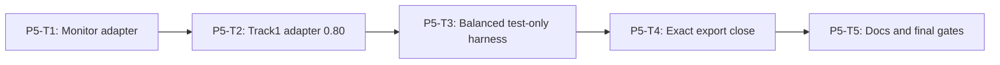

# Phase 5 Compatibility and Requirement Closure Implementation Plan

> **For agentic workers:** REQUIRED SUB-SKILL: Use
> `superpowers:subagent-driven-development` or `superpowers:executing-plans`,
> plus `superpowers:test-driven-development`. Execute only the assigned task.
>
> This phase plan is self-contained. Do not consult older plan revisions.
>
> **APPROVED:** The user reapproved both canonical Specs and the complete plan
> set on `2026-07-13`. Execute only in the exact Master DAG order.

**Goal:** Expose the accepted core through monitor and Track 1 boundaries
without double reduction, preserve legacy gates, enforce exact engine export
allowlists, close GENERAL-001 documentation with deterministic docs REDs.

**Production file unique ownership (this phase):**

| Production file | Sole owner |
| --- | --- |
| `engines/sandbox/src/security/adapters/monitor-decision-provider.ts` | P5-T1 |
| `engines/sandbox/src/security/adapters/track1-rule-matches.ts` | P5-T2 |
| `engines/sandbox/src/security/index.ts` | P5-T4 |

P5-T3 owns a test helper only; P5-T5 owns documentation only. No Phase 5 task
modifies production owned by an earlier task.

**Architecture:** Monitor maps one reduced enforcement decision. Track1 adapter
emits confidence `0.80`. Test-only harness always uses **balanced.v1**. P5-T4
closes exports without renaming frozen APIs.

**Tech Stack:** Existing monitor/base-filter contracts on WSL Linux, `node:test`,
static repository scans, real tsc typecheck.

**New-module RED rule:** A raw module-load, export-link, syntax, or environment
error is not valid RED. For an absent planned production module, tests narrowly
catch only that exact path, substitute a test-local type-compatible inert
fallback, and run the same real input/output assertion used after
implementation. File/export existence is not the behavior; every other load
error is rethrown.

---

## Phase Entry Gate

```bash
REPO_ROOT="$(git rev-parse --show-toplevel)"
cd "$REPO_ROOT"
test "$(node -p 'process.platform')" = "linux"
test -f ./frontend/node_modules/typescript/bin/tsc
for cmd in node npm git; do
  path="$(command -v "$cmd")"
  case "$path" in *.exe|*.cmd|*.bat|/mnt/c/*|/mnt/d/*) exit 1;; esac
done

node --experimental-strip-types --test \
  engines/sandbox/tests/sandbox-security-authority.spec.ts \
  engines/sandbox/tests/sandbox-security-input.spec.ts \
  engines/sandbox/tests/sandbox-security-detector.spec.ts \
  engines/sandbox/tests/sandbox-security-policy.spec.ts \
  engines/sandbox/tests/sandbox-security-engine.spec.ts
npm run test:shared
npm run test:repo
node ./frontend/node_modules/typescript/bin/tsc --noEmit -p shared/tsconfig.json
node ./frontend/node_modules/typescript/bin/tsc --noEmit -p engines/sandbox/tsconfig.json
```

## Task DAG



## Fixed Track 1 confidence

```text
catalog match -> 0.80; no match -> no_match; never 0.60/1.00
```

## Exact export allowlist (Master A/B/C/D/E; P5-T4 enforces C/D/E)

### A Shared runtime

```ts
SANDBOX_SECURITY_STAGES
SANDBOX_SECURITY_CLAIMED_SOURCE_TYPES
SANDBOX_SECURITY_RISK_CATEGORIES
SANDBOX_SECURITY_POLICY_PROFILE_IDS
SANDBOX_SECURITY_SEVERITIES
SANDBOX_SECURITY_VERDICTS
SANDBOX_SECURITY_ACTIONS
SANDBOX_SECURITY_MAX_TEXT_BYTES
SANDBOX_SECURITY_MAX_REQUEST_BYTES
SANDBOX_SECURITY_MAX_CONTENT_ITEMS
SANDBOX_SECURITY_MAX_JSON_DEPTH
SANDBOX_SECURITY_MAX_JSON_NODES
normalizeSandboxSecurityRequest
normalizeSandboxSecurityFinding
normalizeSandboxDetectorRun
normalizeSandboxSecurityDecision
```

### B Shared types

```ts
SandboxSecurityStage
SandboxSecurityClaimedSourceType
SandboxSecurityPolicyProfileId
SandboxSecurityRiskCategory
SandboxSecuritySeverity
SandboxSecurityVerdict
SandboxSecurityAction
SandboxSecurityReasonCode
SandboxSecurityJsonValue
SandboxSecuritySubmittedContentItem
SandboxSecurityToolRequest
SandboxSecurityRequest
SandboxSecurityContentLocator
SandboxSecurityToolLocator
SandboxSecurityFindingSubjectRef
SandboxSecurityFinding
SandboxDetectorRunObligation
SandboxDetectorRunStatus
SandboxDetectorSkipReason
SandboxDetectorRunErrorCode
SandboxDetectorRun
SandboxSecurityDecision
```

Package index must re-export A/B; historical exports remain. Do not freeze whole
`shared/index.ts` history.

### C Engine runtime

```ts
createSandboxSecurityEngine
createSandboxSecurityCanonicalFingerprintService
createSandboxSecurityMonitorDecisionAdapter
createTrack1RuleMatchDetectorAdapter
resolveSandboxSecurityProfile
createSandboxSecurityDetectorRegistry
```

**Not in C:** `normalizeSandboxSecurityEvaluationRequest`,
`prepareSandboxSecurityInput`, `resolveSandboxSecurityDetectorsForProfile`.

### D Engine types

```ts
SandboxSecurityEvaluationRequest
SandboxSecurityAuthoritativeEvaluationContext
AuthenticatedSourceObservation
AuthenticatedToolObservation
SandboxSecurityEngine
SandboxSecurityRuntimePorts
SandboxSecurityCanonicalFingerprintPort
SandboxSecurityCanonicalFingerprintService
SandboxSecurityDetectorRegistry
SandboxSecurityDetectorRegistryInput
RawLocalDetector
SandboxSecuritySanitizer
SanitizedExternalDetector
SandboxSecurityRawDetectorSnapshot
SandboxSecurityRiskCandidate
SandboxSecurityCategoryClearance
SandboxSecurityRawDetectorResult
SandboxSecurityExternalDetectorResult
SandboxSecurityExternalRiskCandidate
SandboxSecurityExternalCategoryClearance
SandboxSecuritySanitizedJudgePayload
SandboxSecuritySanitizedJudgeObligation
SandboxSecurityCandidateSubjectRef
SandboxSecurityExternalCandidateSubjectRef
SandboxSecurityPolicyProfileManifest
SandboxSecurityDetectorSlotManifest
SandboxSecurityDetectorSlotId
SandboxSecurityTrustClass
SandboxSecurityTrustRule
SandboxSecurityActionByStage
SandboxSecurityActionMatrix
```

**Not in D:** `NormalizedSandboxSecurityEvaluationRequest`, brand symbols,
`SandboxSecurityPreparedInput`, `SandboxSecurityAuthorityBoundContent`,
`SandboxSecurityNormalizedContent`, canonical subject helpers, Engine failure,
run ledger, Judge outcome/application internals, raw/external registries.

### E Never-export

```text
normalizeSandboxSecurityEvaluationRequest
NormalizedSandboxSecurityEvaluationRequest
sandboxSecurityEvaluationRequestBrand
prepareSandboxSecurityInput
SandboxSecurityPreparedInput
PreparedInput
deriveSandboxSecurityTrustClass
NormalizedContent
SandboxSecurityNormalizedToolRequest
SandboxSecuritySourceHandle brand / CallHandle brand
SandboxSecurityRawSubjectRegistry
RawSubjectRegistry
SandboxSecurityExternalTokenRegistry
ExternalTokenRegistry
normalizeSandboxSecurityRawDetectorResult
normalizeSandboxSecurityExternalDetectorResult
resolveSandboxSecurityDetectorsForProfile
SandboxSecurityResolvedDetectorRegistry
SandboxSecurityQualifiedSlotEvidence
SandboxSecurityEscalationState
encodeSandboxSecurityCanonicalProjection
deriveSandboxSecurityExternalTokenRegistry
validateSandboxSecuritySanitizedJudgePayload
assertSanitizedJudgePayloadBounds
SandboxSecurityNormalizedSlotResult
SandboxSecurityAcceptedRiskEvidence
SandboxSecurityAuthorityBoundContent
SandboxSecurityNormalizedContent
SandboxSecurityCanonicalPrivateSubjectScope
canonicalizeSandboxSecurityPrivateSubjectScopes
computeSandboxSecuritySubjectKey
SandboxSecurityDraftFinding
SandboxSecurityAcceptedSubjectEntity
SandboxSecurityPublicSubjectTokenMap
materializeSandboxSecurityPublicSubjectTokens
publishSandboxSecurityFindings
SandboxSecurityEvaluationEvidenceLedger
SandboxSecuritySlotEvaluationRecord
SandboxSecurityRoutedObligationRecord
SandboxSecurityEscalationLifecycle
SandboxSecurityJudgeTerminationReason
SandboxSecurityDecisionBearingEngineFailure
SandboxSecurityTerminalEngineErrorCode
validateSandboxSecurityDecisionSemantics
SandboxSecurityEngineFailure
SandboxSecurityEngineFailurePhase
SandboxSecurityRunLedger
createSandboxSecurityRunLedger
SandboxSecurityRunLedgerLifecycle
SandboxSecurityRunLedgerSlotSnapshot
SandboxSecurityRunLedgerSnapshot
SandboxSecurityNormalizedJudgeOutcome
SandboxSecurityJudgeApplicationResult
SandboxSecurityJudgeResolutionEvidence
qualification / semantic-validator private modules as exports
deriveSandboxSecurityExpectedPublication
validateSandboxSecurityPublication
SandboxDetectorFailedRunErrorCode
SandboxSecurityEngineFailureCode
SandboxSecurityDecisionBearingBudgetPhase
SandboxSecurityAdapterUnsupportedError
harness / tests/
```

## Production directory rules

Generic core under `engines/sandbox/src/security/**` is expected.

**Adapters subdirectory only:**

```text
engines/sandbox/src/security/adapters/
  - monitor-decision-provider.ts
  - track1-rule-matches.ts
```

**Whole production security tree:** no harness/oracle/case maps/fixtures.

Harness:

```text
engines/sandbox/tests/helpers/track1-security-regression-harness.ts
```

## Repo monitor contracts (frozen; P5-T1 consumes, never modifies)

From `engines/sandbox/src/monitoring/contract.ts`:

```ts
export type MonitorDecisionStage = "model_output" | "tool_request";

export interface MonitorDecisionInput {
  stage: MonitorDecisionStage;
  session: Readonly<MonitorSessionContext>;
  subject_event_id: string;
  model_input: Readonly<MonitorModelRequest>;
  model_output: Readonly<MonitorModelResponse>;
  tool_request?: Readonly<SimulatedToolRequest>;
}

export interface MonitorDecisionProposal {
  policy_id: string;
  action: SandboxPolicyAction;
  reason_code: string;
  reason: string;
  evidence_refs: string[];
}

export interface MonitorDecisionProvider {
  decide(
    input: Readonly<MonitorDecisionInput>
  ): MonitorDecisionProposal | Promise<MonitorDecisionProposal>;
}
```

---

## P5-T1: Monitor Decision Adapter

### Goal / Acceptance

Create the monitor decision adapter that maps one reduced enforcement decision
to the existing `MonitorDecisionProvider` contract. No double reduction.
Fail closed on simulation and engine error. Content-free proposals only.

### Files

- Create: `engines/sandbox/src/security/adapters/monitor-decision-provider.ts`
- Create: `engines/sandbox/tests/sandbox-security-track1-adapter.spec.ts`

### Dependencies / frozen inputs

- `createSandboxSecurityEngine` / `evaluate` accepting
  `SandboxSecurityEvaluationRequest`.
- Existing monitor contracts in `engines/sandbox/src/monitoring/contract.ts`
  (do **not** modify that tree).
- Approved `SandboxSecurityEvaluationRequest` and
  `SandboxSecurityAuthoritativeEvaluationContext`.

### Locked API (exact factory)

```ts
export function createSandboxSecurityMonitorDecisionAdapter(
  deps: Readonly<{
    engine: SandboxSecurityEngine;
    policy_profile_id: SandboxSecurityPolicyProfileId;
    buildEvaluationRequest: (
      input: Readonly<MonitorDecisionInput>,
      policyProfileId: SandboxSecurityPolicyProfileId
    ) => Readonly<SandboxSecurityEvaluationRequest>;
  }>
): MonitorDecisionProvider;
```

Returns a `MonitorDecisionProvider` whose `decide(MonitorDecisionInput)` yields
`MonitorDecisionProposal | Promise<MonitorDecisionProposal>`.

### Locked behavior

```text
build submission + authoritative context together ONLY via
  deps.buildEvaluationRequest(input, deps.policy_profile_id)
mapper result must be enforcement and match input stage/profile
one engine.evaluate(request) only — no AbortSignal argument
never invent or pass an undefined signal
never pre-call normalizeSandboxSecurityEvaluationRequest
never second reduce of action/verdict
map decision.action → proposal.action
policy_id: "policy://sandbox/security/monitor-adapter/v1"
closed reason mapping (content-free; no raw exception/model/tool text):
  risk_detected:
    reason_code = first final finding.reason_code in finding order
    reason = "Sandbox security risk detected."
    evidence_refs = defensive copy of decision.evidence_refs
    (risk_detected with zero findings is invalid decision)
  no_detected_risk:
    reason_code = "sandbox_security_no_detected_risk"
    reason = "No sandbox security risk was detected."
    evidence_refs = defensive copy of decision.evidence_refs
  indeterminate:
    reason_code = "sandbox_security_evaluation_indeterminate"
    reason = "Sandbox security evaluation was incomplete."
    evidence_refs = defensive copy of decision.evidence_refs
  adapter-caught internal error:
    reason_code = "sandbox_security_internal_invalid"
    reason = "Sandbox security evaluation failed closed."
    evidence_refs = []
    model_output → action "ask"
    tool_request → action "deny"
Monitor contract remains unchanged (reason_code is free non-empty string).
no raw content, provenance, hashes, or handles in proposal
does NOT modify engines/sandbox/src/monitoring/*
```

Call shape (MonitorDecisionProvider.decide has **no** AbortSignal):

```ts
const request = deps.buildEvaluationRequest(input, deps.policy_profile_id);
const decision = await deps.engine.evaluate(request);
return {
  policy_id: "policy://sandbox/security/monitor-adapter/v1",
  action: decision.action,
  reason_code: mapClosedReasonCode(decision), // closed mapping above
  reason: mapClosedReason(decision),          // closed mapping above
  evidence_refs: [...decision.evidence_refs]
};
// on caught error: reason_code sandbox_security_internal_invalid,
// reason fixed string, evidence_refs [], stage fail-closed action
```

### Step 1: Exact RED test inventory

```ts
test("REQ-SBX-GENERAL-001 monitor adapter factory name is createSandboxSecurityMonitorDecisionAdapter", () => {});
test("REQ-SBX-GENERAL-001 monitor adapter returns MonitorDecisionProvider with decide", () => {});
test("REQ-SBX-GENERAL-001 monitor adapter maps model_output stage to engine model_output", async () => {});
test("REQ-SBX-GENERAL-001 monitor adapter maps tool_request stage to engine tool_request", async () => {});
test("REQ-SBX-GENERAL-001 monitor adapter constructs approved SandboxSecurityEvaluationRequest", async () => {});
test("REQ-SBX-GENERAL-001 monitor adapter always sets evaluation_mode enforcement", async () => {});
test("REQ-SBX-GENERAL-001 monitor adapter rejects simulation evaluation mode fail-closed", async () => {});
test("REQ-SBX-GENERAL-001 monitor mapper builds submission and authority together", async () => {});
test("REQ-SBX-GENERAL-001 monitor adapter rejects divergent mapper stage profile or mode", async () => {});
test("REQ-SBX-GENERAL-001 monitor adapter calls engine.evaluate once", async () => {});
test("REQ-SBX-GENERAL-001 monitor adapter does not reference an undefined signal", () => {});
test("REQ-SBX-GENERAL-001 monitor adapter does not pre-call internal normalizer", async () => {});
test("REQ-SBX-GENERAL-001 monitor adapter does not re-reduce action", async () => {});
test("REQ-SBX-GENERAL-001 monitor adapter maps decision.action to proposal.action", async () => {});
test("REQ-SBX-GENERAL-001 monitor adapter never returns Engine decision directly", async () => {});
test("REQ-SBX-GENERAL-001 monitor adapter copies decision evidence refs defensively", async () => {});
test("REQ-SBX-GENERAL-001 monitor adapter policy_id is policy://sandbox/security/monitor-adapter/v1", async () => {});
test("REQ-SBX-GENERAL-001 monitor adapter fail-closed on engine error for model_output asks", async () => {});
test("REQ-SBX-GENERAL-001 monitor adapter fail-closed on engine error for tool_request denies", async () => {});
test("REQ-SBX-GENERAL-001 monitor adapter maps content-free decision fields only", async () => {});
test("REQ-SBX-GENERAL-001 monitor adapter never returns raw content or provenance", async () => {});
test("REQ-SBX-GENERAL-001 monitor adapter never returns hashes or handles in proposal", async () => {});
test("REQ-SBX-GENERAL-001 monitor risk_detected uses first finding reason_code", async () => {});
test("REQ-SBX-GENERAL-001 monitor no_detected_risk uses sandbox_security_no_detected_risk", async () => {});
test("REQ-SBX-GENERAL-001 monitor indeterminate uses sandbox_security_evaluation_indeterminate", async () => {});
test("REQ-SBX-GENERAL-001 monitor caught error uses sandbox_security_internal_invalid and empty evidence", async () => {});
test("REQ-SBX-GENERAL-001 monitor adapter does not modify engines/sandbox/src/monitoring", () => {});
test("REQ-SBX-GENERAL-001 monitor adapter production file is adapters/monitor-decision-provider.ts only", () => {});
```

### Step 2: RED command

```bash
REPO_ROOT="$(git rev-parse --show-toplevel)"
cd "$REPO_ROOT"
test "$(node -p 'process.platform')" = "linux"
node --experimental-strip-types --test engines/sandbox/tests/sandbox-security-track1-adapter.spec.ts
```

### Expected RED failure and why valid

When the exact module is absent, the guarded loader supplies a test-local
monitor adapter whose provider returns an inert legacy decision. The unchanged
provider-surface, double-reduction, pre-normalization, simulation fail-closed,
stage-action, and `policy_id` assertions then fail behaviorally. Raw load,
syntax, export-link, and environment errors are invalid RED.

### Step 3: Implementation boundary

Implement monitor adapter **only** under:

```text
engines/sandbox/src/security/adapters/monitor-decision-provider.ts
```

Do not implement Track1 rule adapter (P5-T2). Do not change engine evaluate
signature. Do not place harness under `src/security/`. Do not modify
`engines/sandbox/src/monitoring/*`. Do not export from final index here
(P5-T4 closes exports).
Do not build submission and authoritative context through separate mappers.

### Step 4: GREEN command and expected result

```bash
node --experimental-strip-types --test engines/sandbox/tests/sandbox-security-track1-adapter.spec.ts
```

Monitor inventory green.

### Step 5: Broader gates

```bash
test "$(node -p 'process.platform')" = "linux"
git diff --check
git status --short
```

### Step 6: Exact git add paths + commit

```bash
git add engines/sandbox/src/security/adapters/monitor-decision-provider.ts \
  engines/sandbox/tests/sandbox-security-track1-adapter.spec.ts
git commit -m "feat(sandbox): adapt security decisions to monitor provider"
```

### Stop/report

Stop after commit. Report: files, RED/GREEN evidence, WSL platform, status.

---

## P5-T2: Track 1 Rule-Match Detector Adapter

### Goal / Acceptance

Emit raw-local candidates from Track 1 rule catalog matches with confidence
exactly `0.80`. Never call legacy final provider
`RuleBasedDecisionProvider.decide`. Map categories per Spec. Create only the
production file `track1-rule-matches.ts`.

### Files

- Create: `engines/sandbox/src/security/adapters/track1-rule-matches.ts`
- Modify: `engines/sandbox/tests/sandbox-security-track1-adapter.spec.ts`

### Dependencies / frozen inputs

- `RawLocalDetector` / raw result shapes from detector contracts.
- Engine-private `SandboxSecurityAdapterUnsupportedError` from detector
  contracts; P4-T6 already maps only an exact instance to the failed-run code
  `adapter_unsupported`.
- Track 1 rule catalog access without calling
  `RuleBasedDecisionProvider.decide()`.
- Spec category maps.

### Locked API

```ts
export function createTrack1RuleMatchDetectorAdapter(): RawLocalDetector;
```

The adapter reads the frozen Track 1 rule catalog already exported by
`engines/sandbox/src/base-filter/` (same catalog `RuleBasedDecisionProvider`
uses). It must **not** call `RuleBasedDecisionProvider.decide()`, must not
import evaluation expected-action maps, and must not accept a catalog override
parameter that could inject oracle case data.


Category map (Spec):

```text
sensitive_data -> sensitive_data_exposure
protected_resource / sensitive_capability -> unsafe_side_effect
other same-name categories where listed
```

Confidence:

```text
catalog match -> 0.80
no match -> no_match (empty candidates/clearances)
never 0.60 or 1.00 from this adapter
```

Representability is fail-closed and distinct from a supported no-match:

```text
user_input stage
missing a rule-condition source required by a matched Track 1 rule
tool_target condition when the authoritative tool has no target
more than eight deduplicated subject refs for one candidate
tool request outside the frozen Track 1 simulated-tool shapes
  → throw exact SandboxSecurityAdapterUnsupportedError
  → Engine failed run error_code adapter_unsupported
  → never synthesize no_match or detector_result_invalid
supported representable input with no catalog match
  → empty candidates/clearances (no_match at the boundary)
```

### Step 1: Exact RED test inventory

```ts
test("REQ-SBX-GENERAL-001 Track1 adapter factory name is createTrack1RuleMatchDetectorAdapter", () => {});
test("REQ-SBX-GENERAL-001 Track1 adapter implements RawLocalDetector", () => {});
test("REQ-SBX-GENERAL-001 Track1 adapter emits confidence 0.80 on catalog match", async () => {});
test("REQ-SBX-GENERAL-001 Track1 adapter never emits 0.60 or 1.00", async () => {});
test("REQ-SBX-GENERAL-001 Track1 adapter no match yields no_match empty result", async () => {});
test("REQ-SBX-GENERAL-001 Track1 adapter maps sensitive_data to sensitive_data_exposure", async () => {});
test("REQ-SBX-GENERAL-001 Track1 adapter maps protected_resource to unsafe_side_effect", async () => {});
test("REQ-SBX-GENERAL-001 Track1 adapter maps sensitive_capability to unsafe_side_effect", async () => {});
test("REQ-SBX-GENERAL-001 Track1 adapter never calls RuleBasedDecisionProvider.decide", async () => {});
test("REQ-SBX-GENERAL-001 Track1 adapter returns exact-key candidates only", async () => {});
test("REQ-SBX-GENERAL-001 Track1 adapter production file is adapters/track1-rule-matches.ts only", () => {});
test("REQ-SBX-GENERAL-001 Track1 adapter user_input is adapter_unsupported", async () => {});
test("REQ-SBX-GENERAL-001 Track1 adapter missing required subject is adapter_unsupported", async () => {});
test("REQ-SBX-GENERAL-001 Track1 adapter absent required target is adapter_unsupported", async () => {});
test("REQ-SBX-GENERAL-001 Track1 adapter over eight subject refs is adapter_unsupported", async () => {});
test("REQ-SBX-GENERAL-001 Track1 adapter non-Track1 tool shape is adapter_unsupported", async () => {});
test("REQ-SBX-GENERAL-001 Track1 unsupported path never synthesizes no_match", async () => {});
test("REQ-SBX-GENERAL-001 Engine records Track1 unsupported path as failed adapter_unsupported", async () => {});
```

### Step 2: RED command

```bash
REPO_ROOT="$(git rev-parse --show-toplevel)"
cd "$REPO_ROOT"
test "$(node -p 'process.platform')" = "linux"
node --experimental-strip-types --test engines/sandbox/tests/sandbox-security-track1-adapter.spec.ts
```

### Expected RED failure and why valid

When the exact module is absent, the guarded loader supplies a test-local Track
1 adapter that returns no match and never throws the private unsupported error.
The unchanged confidence `0.80`, category mapping, unsupported-path identity,
and zero-`RuleBasedDecisionProvider.decide`-call assertions then fail
behaviorally. Raw load, syntax, export-link, and environment errors are invalid
RED.

### Step 3: Implementation boundary

Implement Track1 raw detector adapter **only** in:

```text
engines/sandbox/src/security/adapters/track1-rule-matches.ts
```

Do not implement harness (P5-T3). Do not call legacy final decision provider.
Do not modify monitor adapter. Do not export from final index here (P5-T4).
Throw only the exact engine-private `SandboxSecurityAdapterUnsupportedError`
for the locked unrepresentable cases. Do not use free-form errors or reinterpret
a supported catalog no-match.

### Step 4: GREEN command and expected result

```bash
node --experimental-strip-types --test engines/sandbox/tests/sandbox-security-track1-adapter.spec.ts
```

Track1 adapter inventory green.

### Step 5: Broader gates

```bash
test "$(node -p 'process.platform')" = "linux"
git diff --check
git status --short
```

### Step 6: Exact git add paths + commit

```bash
git add engines/sandbox/src/security/adapters/track1-rule-matches.ts \
  engines/sandbox/tests/sandbox-security-track1-adapter.spec.ts
git commit -m "feat(sandbox): adapt Track 1 rule matches"
```

### Stop/report

Stop after commit. Report: files, RED/GREEN evidence, WSL platform, status.

---

## P5-T3: Test-Only Balanced Legacy Regression Harness

### Goal / Acceptance

Preserve nine Track 1 legacy actions via balanced-only test harness. No
production oracle. Profile fixed to `sandbox-security-balanced.v1`. Anti-oracle
scans prove harness/case maps stay under `tests/helpers` only.

### Files

- Create: `engines/sandbox/tests/helpers/track1-security-regression-harness.ts`
- Modify: `engines/sandbox/tests/sandbox-security-track1-adapter.spec.ts`
- Modify: `tests/repository/sandbox-security-core.spec.ts`

### Dependencies / frozen inputs

- P5-T1 monitor adapter and P5-T2 Track1 rule adapter.
- Engine `createSandboxSecurityEngine` / `evaluate`.
- Approved Track1 nine-case action map (test-only).

### Locked harness configuration

```text
profile: sandbox-security-balanced.v1
rule detector: createTrack1RuleMatchDetectorAdapter
local: not registered
Judge: not registered
catalog match confidence: 0.80
no match: no_match
```

Reason (balanced matrix):

```text
legacy alert -> generic low  -> balanced alert
legacy ask   -> generic medium -> balanced ask
legacy deny  -> generic high -> balanced deny
```

Strict is forbidden for this harness. Profile is not agent/env selectable.
Case IDs / maps only in test-only harness + assertions.

### Nine-case map (test-only constant)

```ts
const APPROVED_TRACK1_ACTION_MAP = {
  "T1-SC-001-C001": "deny",
  "T1-SC-001-C002": "deny",
  "T1-SC-001-C003": "allow",
  "T1-SC-002-C001": "deny",
  "T1-SC-002-C002": "ask",
  "T1-SC-002-C003": "deny",
  "T1-SC-003-C001": "ask",
  "T1-SC-003-C002": "deny",
  "T1-SC-003-C003": "allow"
} as const;
```

This map is **test-only** (harness + assertions). Production security core must
not import case IDs or expected actions.


Harness API:

```ts
export async function runTrack1SecurityCompatibilityHarness(
  ports: SandboxSecurityRuntimePorts
): Promise<
  ReadonlyArray<{
    case_id: string;
    legacy_action: SandboxSecurityAction;
    engine_action: SandboxSecurityAction;
    action_matches: boolean;
    profile_id: "sandbox-security-balanced.v1";
  }>
>;
```

### Step 1: Exact RED test inventory

```ts
test("REQ-SBX-GENERAL-001 compatibility harness uses balanced v1", async () => {});
test("REQ-SBX-GENERAL-001 compatibility harness does not register local or Judge", async () => {});
test("REQ-SBX-GENERAL-001 compatibility harness profile is not agent or env selectable", async () => {});
test("REQ-SBX-GENERAL-001 legacy alert ask deny retain identical generic actions", async () => {});
test("REQ-SBX-GENERAL-001 preserves the nine Track 1 legacy actions", async () => {
  const report = await runTrack1SecurityCompatibilityHarness(ports);
  const actual = Object.fromEntries(
    report.map((row) => [row.case_id, row.legacy_action])
  );
  assert.deepEqual(actual, APPROVED_TRACK1_ACTION_MAP);
  assert.equal(Object.keys(actual).length, 9);
  assert.ok(report.every((row) => row.action_matches));
  assert.ok(
    report.every((row) => row.profile_id === "sandbox-security-balanced.v1")
  );
});
test("REQ-SBX-GENERAL-001 harness lives only under tests/helpers", () => {});
test("REQ-SBX-GENERAL-001 adapters directory allowlists only two production files", () => {});
test("REQ-SBX-GENERAL-001 production security tree has no harness oracle case maps", () => {});
test("REQ-SBX-GENERAL-001 production security tree has no fixture oracle strings", () => {});
```

Anti-oracle scans (repository test):

```text
engines/sandbox/src/security/** must not contain:
  - track1-security-regression-harness
  - APPROVED_TRACK1_ACTION_MAP
  - nine-case oracle tables
  - case_id → action fixture maps for Track1 compatibility
adapters/ must list exactly:
  monitor-decision-provider.ts
  track1-rule-matches.ts
```

### Step 2: RED command

```bash
REPO_ROOT="$(git rev-parse --show-toplevel)"
cd "$REPO_ROOT"
test "$(node -p 'process.platform')" = "linux"
node --experimental-strip-types --test \
  engines/sandbox/tests/sandbox-security-track1-adapter.spec.ts \
  tests/repository/sandbox-security-core.spec.ts
```

### Expected RED failure and why valid

When the exact module is absent, the guarded loader supplies a test-local
harness that returns an inert result for every case. The unchanged nine-case
map, balanced-only profile, and production-oracle placement assertions then
fail behaviorally. Raw load, syntax, export-link, and environment errors are
invalid RED.

### Step 3: Implementation boundary

Test-only harness + repository scans. Do not put harness under
`engines/sandbox/src/security/**`. Do not make profile selectable. Do not change
export allowlists (P5-T4). Do not register local or Judge detectors in harness.

### Step 4: GREEN command and expected result

```bash
npm run test:engine:sandbox
npm run test:repo
```

Nine-case compatibility green; anti-oracle scans green.

### Step 5: Broader gates

```bash
test "$(node -p 'process.platform')" = "linux"
git diff --check
git diff --summary
git status --short
```

### Step 6: Exact git add paths + commit

```bash
git add engines/sandbox/tests/helpers/track1-security-regression-harness.ts \
  engines/sandbox/tests/sandbox-security-track1-adapter.spec.ts \
  tests/repository/sandbox-security-core.spec.ts
git commit -m "test(sandbox): preserve Track 1 security behavior"
```

### Stop/report

Stop after commit. Report: files, nine-case pass, anti-oracle pass, status.

---

## P5-T4: Exact Export Close and Permanent Gates

### Goal / Acceptance

Create `engines/sandbox/src/security/index.ts` with exact Master C/D.
Shared A/B additive. Prove forbidden internal symbols absent (Master E).
**No renames** of APIs frozen by earlier tasks. Export approved
`SandboxSecurityEvaluationRequest`, `SandboxSecurityRawDetectorSnapshot`, and
`SandboxSecurityDetectorRegistryInput`.

### Files

- Create: `engines/sandbox/src/security/index.ts`
- Modify: `tests/repository/sandbox-security-core.spec.ts`
- Modify: `tests/repository/root-test-entry.spec.ts`
- Modify: root `package.json` only if root test scripts do not already register
  the repository focused gates used by this requirement
- Do not modify `engines/sandbox/package.json`

### Dependencies / frozen inputs

- Master A/B/C/D/E allowlists (reproduced below for self-containment).
- All owning-task API names already frozen.

### Expected C (engine runtime — strict equality)

```ts
const EXPECTED_ENGINE_RUNTIME_EXPORTS = [
  "createSandboxSecurityEngine",
  "createSandboxSecurityCanonicalFingerprintService",
  "createSandboxSecurityMonitorDecisionAdapter",
  "createTrack1RuleMatchDetectorAdapter",
  "resolveSandboxSecurityProfile",
  "createSandboxSecurityDetectorRegistry"
] as const;
```

### Expected D (engine types — strict equality)

```ts
const EXPECTED_ENGINE_TYPE_EXPORTS = [
  "SandboxSecurityEvaluationRequest",
  "SandboxSecurityAuthoritativeEvaluationContext",
  "AuthenticatedSourceObservation",
  "AuthenticatedToolObservation",
  "SandboxSecurityEngine",
  "SandboxSecurityRuntimePorts",
  "SandboxSecurityCanonicalFingerprintPort",
  "SandboxSecurityCanonicalFingerprintService",
  "SandboxSecurityDetectorRegistry",
  "SandboxSecurityDetectorRegistryInput",
  "RawLocalDetector",
  "SandboxSecuritySanitizer",
  "SanitizedExternalDetector",
  "SandboxSecurityRawDetectorSnapshot",
  "SandboxSecurityRiskCandidate",
  "SandboxSecurityCategoryClearance",
  "SandboxSecurityRawDetectorResult",
  "SandboxSecurityExternalDetectorResult",
  "SandboxSecurityExternalRiskCandidate",
  "SandboxSecurityExternalCategoryClearance",
  "SandboxSecuritySanitizedJudgePayload",
  "SandboxSecuritySanitizedJudgeObligation",
  "SandboxSecurityCandidateSubjectRef",
  "SandboxSecurityExternalCandidateSubjectRef",
  "SandboxSecurityPolicyProfileManifest",
  "SandboxSecurityDetectorSlotManifest",
  "SandboxSecurityDetectorSlotId",
  "SandboxSecurityTrustClass",
  "SandboxSecurityTrustRule",
  "SandboxSecurityActionByStage",
  "SandboxSecurityActionMatrix"
] as const;
```

Must equal Phase 5 top ### D and Master D (strict equality gate).

### FORBIDDEN engine exports (Master E + close-set)

```ts
const FORBIDDEN_ENGINE_EXPORTS = [
  "normalizeSandboxSecurityEvaluationRequest",
  "NormalizedSandboxSecurityEvaluationRequest",
  "ValidatedSandboxSecurityEvaluationRequest",
  "normalizeAndValidateSandboxSecurityEvaluationRequest",
  "sandboxSecurityEvaluationRequestBrand",
  "prepareSandboxSecurityInput",
  "SandboxSecurityPreparedInput",
  "PreparedInput",
  "SandboxSecurityNormalizedContent",
  "deriveSandboxSecurityTrustClass",
  "NormalizedContent",
  "SandboxSecurityNormalizedToolRequest",
  "SandboxSecurityRawSubjectRegistry",
  "RawSubjectRegistry",
  "SandboxSecurityExternalTokenRegistry",
  "ExternalTokenRegistry",
  "normalizeSandboxSecurityRawDetectorResult",
  "normalizeSandboxSecurityExternalDetectorResult",
  "resolveSandboxSecurityDetectorsForProfile",
  "SandboxSecurityResolvedDetectorRegistry",
  "encodeSandboxSecurityCanonicalProjection",
  "deriveSandboxSecurityExternalTokenRegistry",
  "validateSandboxSecuritySanitizedJudgePayload",
  "assertSanitizedJudgePayloadBounds",
  "SandboxSecurityNormalizedSlotResult",
  "SandboxSecurityAcceptedRiskEvidence",
  "SandboxSecurityAuthorityBoundContent",
  "SandboxSecurityNormalizedContent",
  "SandboxSecurityCanonicalPrivateSubjectScope",
  "canonicalizeSandboxSecurityPrivateSubjectScopes",
  "computeSandboxSecuritySubjectKey",
  "SandboxSecurityQualifiedSlotEvidence",
  "SandboxSecurityDraftFinding",
  "SandboxSecurityAcceptedSubjectEntity",
  "SandboxSecurityPublicSubjectTokenMap",
  "materializeSandboxSecurityPublicSubjectTokens",
  "publishSandboxSecurityFindings",
  "SandboxSecurityEscalationState",
  "SandboxSecurityEscalationLifecycle",
  "SandboxSecurityEvaluationEvidenceLedger",
  "SandboxSecuritySlotEvaluationRecord",
  "SandboxSecurityRoutedObligationRecord",
  "SandboxSecurityJudgeTerminationReason",
  "SandboxSecurityDecisionBearingEngineFailure",
  "validateSandboxSecurityPublication",
  "deriveSandboxSecurityExpectedPublication",
  "SandboxDetectorFailedRunErrorCode",
  "SandboxSecurityEngineFailureCode",
  "SandboxSecurityDecisionBearingBudgetPhase",
  "SandboxSecurityTerminalEngineErrorCode",
  "validateSandboxSecurityDecisionSemantics",
  "SandboxSecurityEngineFailure",
  "SandboxSecurityEngineFailurePhase",
  "SandboxSecurityRunLedger",
  "createSandboxSecurityRunLedger",
  "SandboxSecurityRunLedgerLifecycle",
  "SandboxSecurityRunLedgerSlotSnapshot",
  "SandboxSecurityRunLedgerSnapshot",
  "SandboxSecurityNormalizedJudgeOutcome",
  "SandboxSecurityJudgeApplicationResult",
  "SandboxSecurityJudgeResolutionEvidence",
  "createSandboxSecurityDeadlineController",
  "SandboxSecurityDeadlineController",
  "SandboxSecurityDetectorLease",
  "SandboxSecurityAdapterUnsupportedError"
] as const;
```

Also forbidden: brand symbols, source/call handle brands, harness paths,
qualification/escalation/semantic-validator private modules as public exports.

### Shared package: additive A/B only

```ts
// assert every A/B name is exportable from shared package
// assert SandboxSecurityReasonCode is in B
// assert shared/types/sandbox-security.ts export set matches A∪B for that module
// assert shared/contracts/sandbox-security.ts exports four normalizers
// assert pre-existing shared export still present
// do NOT assert shared/index.ts exports === A/B only
```

Other REDs: focused tests registered; no oracle in production security; no
network/fs/model; type probes not in node scripts; tsconfig includes probes.

### Step 1: Exact RED test inventory

```ts
test("REQ-SBX-GENERAL-001 engine runtime exports equal allowlist C", () => {});
test("REQ-SBX-GENERAL-001 engine type exports equal allowlist D", () => {});
test("REQ-SBX-GENERAL-001 engine exports approved SandboxSecurityEvaluationRequest", () => {});
test("REQ-SBX-GENERAL-001 engine exports SandboxSecurityRawDetectorSnapshot type", () => {});
test("REQ-SBX-GENERAL-001 engine exports SandboxSecurityDetectorRegistryInput type", () => {});
test("REQ-SBX-GENERAL-001 engine exports obligated Judge payload/result types", () => {});
test("REQ-SBX-GENERAL-001 engine does not export NormalizedSandboxSecurityEvaluationRequest", () => {});
test("REQ-SBX-GENERAL-001 engine does not export internal normalizer", () => {});
test("REQ-SBX-GENERAL-001 engine does not export brand symbol", () => {});
test("REQ-SBX-GENERAL-001 engine does not export prepareSandboxSecurityInput", () => {});
test("REQ-SBX-GENERAL-001 engine does not export PreparedInput or NormalizedContent", () => {});
test("REQ-SBX-GENERAL-001 engine does not export RawSubjectRegistry", () => {});
test("REQ-SBX-GENERAL-001 engine does not export ExternalTokenRegistry", () => {});
test("REQ-SBX-GENERAL-001 engine does not export resolveSandboxSecurityDetectorsForProfile", () => {});
test("REQ-SBX-GENERAL-001 engine does not export DraftFinding", () => {});
test("REQ-SBX-GENERAL-001 engine does not export AcceptedSubjectEntity", () => {});
test("REQ-SBX-GENERAL-001 engine does not export PublicSubjectTokenMap", () => {});
test("REQ-SBX-GENERAL-001 engine does not export token materializer", () => {});
test("REQ-SBX-GENERAL-001 engine does not export finding publisher", () => {});
test("REQ-SBX-GENERAL-001 engine does not export AuthorityBoundContent", () => {});
test("REQ-SBX-GENERAL-001 engine does not export trust derivation helper", () => {});
test("REQ-SBX-GENERAL-001 engine does not export canonical subject scope helpers", () => {});
test("REQ-SBX-GENERAL-001 engine does not export EngineFailure", () => {});
test("REQ-SBX-GENERAL-001 engine does not export EngineFailurePhase", () => {});
test("REQ-SBX-GENERAL-001 engine does not export RunLedger", () => {});
test("REQ-SBX-GENERAL-001 engine does not export RunLedger factory", () => {});
test("REQ-SBX-GENERAL-001 engine does not export RunLedgerLifecycle", () => {});
test("REQ-SBX-GENERAL-001 engine does not export RunLedgerSlotSnapshot", () => {});
test("REQ-SBX-GENERAL-001 engine does not export RunLedgerSnapshot", () => {});
test("REQ-SBX-GENERAL-001 engine does not export Judge outcome/application internals", () => {});
test("REQ-SBX-GENERAL-001 engine does not export semantic validator or evidence ledger", () => {});
test("REQ-SBX-GENERAL-001 engine does not export SlotEvaluationRecord", () => {});
test("REQ-SBX-GENERAL-001 engine does not export JudgeTerminationReason", () => {});
test("REQ-SBX-GENERAL-001 engine does not export DecisionBearingEngineFailure", () => {});
test("REQ-SBX-GENERAL-001 engine does not export DecisionBearingBudgetPhase", () => {});
test("REQ-SBX-GENERAL-001 engine does not export TerminalEngineErrorCode", () => {});
test("REQ-SBX-GENERAL-001 engine does not export EngineFailureCode", () => {});
test("REQ-SBX-GENERAL-001 engine does not export FailedRunErrorCode", () => {});
test("REQ-SBX-GENERAL-001 engine does not export publication pure verify APIs", () => {});
test("REQ-SBX-GENERAL-001 engine does not export RoutedObligationRecord", () => {});
test("REQ-SBX-GENERAL-001 engine does not export EscalationLifecycle", () => {});
test("REQ-SBX-GENERAL-001 engine does not export NormalizedSlotResult", () => {});
test("REQ-SBX-GENERAL-001 shared package exports SandboxSecurityReasonCode", () => {});
test("REQ-SBX-GENERAL-001 shared package exports all Master A and B symbols", () => {});
test("REQ-SBX-GENERAL-001 shared package retains historical non-GENERAL-001 exports", () => {});
test("REQ-SBX-GENERAL-001 production security has no oracle harness exports", () => {});
test("REQ-SBX-GENERAL-001 production security module set matches Core ownership structure", () => {});
test("REQ-SBX-GENERAL-001 production security has no contract detector-pipeline or harness module", () => {});
test("REQ-SBX-GENERAL-001 type probes are not node test entrypoints", () => {});
test("REQ-SBX-GENERAL-001 export close does not rename frozen APIs", () => {});
test("REQ-SBX-GENERAL-001 public index resolves the balanced profile", () => {
  assert.equal(
    resolveSandboxSecurityProfile("sandbox-security-balanced.v1")?.profile_id,
    "sandbox-security-balanced.v1"
  );
});
```

### Step 2: RED command

```bash
REPO_ROOT="$(git rev-parse --show-toplevel)"
cd "$REPO_ROOT"
test "$(node -p 'process.platform')" = "linux"
node --experimental-strip-types --test \
  tests/repository/sandbox-security-core.spec.ts \
  tests/repository/root-test-entry.spec.ts
```

### Expected RED failure and why valid

When the exact module is absent, the guarded loader supplies a test-local
`resolveSandboxSecurityProfile` fallback that returns `null`. The unchanged
public-index profile assertion then fails on the required balanced profile.
This behavior assertion is the RED evidence. C runtime namespace checks, D
source/typecheck contract checks (`SandboxSecurityEvaluationRequest`,
`SandboxSecurityRawDetectorSnapshot`, `SandboxSecurityDetectorRegistryInput`,
and profile/trust/action matrix types), forbidden-export checks, and frozen-name
checks remain permanent acceptance gates but are not RED evidence. Raw load,
syntax, export-link, and environment errors are invalid RED.

### Step 3: Implementation boundary

Close exports only. **No renames.** If an earlier-phase API name is wrong, stop
and report owning task rework—do not silently rename here. Do not invent public
`*Input` request types. Do not export normalizer/brand/PreparedInput/registries.

### Step 4: GREEN command and expected result

```bash
node --experimental-strip-types --test \
  tests/repository/sandbox-security-core.spec.ts \
  tests/repository/root-test-entry.spec.ts
node ./frontend/node_modules/typescript/bin/tsc --noEmit -p shared/tsconfig.json
node ./frontend/node_modules/typescript/bin/tsc --noEmit -p engines/sandbox/tsconfig.json
```

Export equality green; typecheck green.

### Step 5: Broader gates

```bash
test "$(node -p 'process.platform')" = "linux"
npm run test:shared
npm run test:engine:sandbox
npm run test:repo
git diff --check
git diff --summary
git status --short
```

### Step 6: Exact git add paths + commit

```bash
git add engines/sandbox/src/security/index.ts \
  tests/repository/sandbox-security-core.spec.ts \
  tests/repository/root-test-entry.spec.ts
# stage package.json only if actually modified
git commit -m "test(sandbox): register general security core gates"
```

(Only stage `package.json` if actually modified.)

### Stop/report

Stop after commit. Report: C/D equality, FORBIDDEN absent, typecheck, status.

---

## P5-T5: Documentation and Requirement Exit

### Goal / Acceptance

Final docs markers and sprint status. Deterministic docs RED must fail before
docs edit. `docs/api-contract.md` must mention
`SandboxSecurityEvaluationRequest` and must **not** mention
`SandboxSecurityEvaluationRequestInput` or other public `*Input` request types.

### Files

- Modify: `README.md`
- Modify: `docs/architecture.md`
- Modify: `docs/api-contract.md`
- Modify: `docs/progress.md`
- Modify: `docs/sprint-current.md`
- Modify: `tests/repository/sandbox-security-core.spec.ts`

### Dependencies / frozen inputs

- P5-T4 export close complete.
- User has switched active sprint to `REQ-SBX-GENERAL-001` before
  implementation started.

### Deterministic documentation RED (must fail before docs edit)

Do **not** use broad `/COMPLETE_PENDING_REVIEW/` or mere Requirement ID presence.

```ts
test("REQ-SBX-GENERAL-001 sprint is at final review state", () => {
  const text = readText("docs/sprint-current.md");
  assert.match(
    text,
    /## Requirement ID\s*\n\s*\nREQ-SBX-GENERAL-001\b/
  );
  assert.match(
    text,
    /## Status\s*\n\s*\nCOMPLETE_PENDING_REVIEW\b/
  );
  assert.doesNotMatch(
    text,
    /## Status\s*\n\s*\nPHASE_\d+_COMPLETE_PENDING_REVIEW\b/
  );
});

test("REQ-SBX-GENERAL-001 durable docs expose final core boundary", () => {
  assert.match(readText("README.md"), /sandbox-security-decision\.v1/);
  assert.match(
    readText("docs/architecture.md"),
    /sandbox-security-balanced\.v1/
  );
  assert.match(
    readText("docs/api-contract.md"),
    /createSandboxSecurityEngine/
  );
  assert.match(
    readText("docs/api-contract.md"),
    /SandboxSecurityEvaluationRequest\b/
  );
  assert.doesNotMatch(
    readText("docs/api-contract.md"),
    /SandboxSecurityEvaluationRequestInput\b/
  );
  assert.doesNotMatch(
    readText("docs/api-contract.md"),
    /SandboxSecurityEvaluationInput\b/
  );
});
```

If `docs/sprint-current.md` uses a slightly different Status heading after user
activation of GENERAL-001, keep the same two-level structure:
`## Requirement ID` + `## Status` with exact values above. Early phase progress
entries like `PHASE_4_COMPLETE_PENDING_REVIEW` must not satisfy Status.

### Step 1: Exact RED test inventory

```ts
// the two tests above, added first
test("REQ-SBX-GENERAL-001 docs mention evaluate entry budget and authority model", () => {});
test("REQ-SBX-GENERAL-001 Core project structure matches Master unique ownership", () => {});
test("REQ-SBX-GENERAL-001 progress records GENERAL-001 complete pending review", () => {});
test("REQ-SBX-GENERAL-001 api-contract documents MonitorDecisionProvider adapter factory", () => {});
test("REQ-SBX-GENERAL-001 api-contract documents Track1 confidence 0.80", () => {});
test("REQ-SBX-GENERAL-001 docs do not advertise public *Input evaluation request types", () => {});
```

### Step 2: RED command (before docs edit)

```bash
REPO_ROOT="$(git rev-parse --show-toplevel)"
cd "$REPO_ROOT"
test "$(node -p 'process.platform')" = "linux"
node --experimental-strip-types --test tests/repository/sandbox-security-core.spec.ts
```

### Expected RED failure and why valid

Final markers/status missing from sprint/docs; api-contract missing
`SandboxSecurityEvaluationRequest` or still advertising `*Input` request types.

### Step 3: Implementation boundary

1. Add repository tests first.
2. Run → prove final markers/status missing.
3. Update docs + sprint final Status.
4. GREEN.
5. Final gates.

Docs only; no production behavior changes. api-contract must name
`SandboxSecurityEvaluationRequest` (not `*Input`).

### Step 4: GREEN command and expected result

```bash
node --experimental-strip-types --test tests/repository/sandbox-security-core.spec.ts
```

Docs RED inventory green.

### Step 5: Broader gates (requirement exit)

```bash
REPO_ROOT="$(git rev-parse --show-toplevel)"
cd "$REPO_ROOT"
test "$(node -p 'process.platform')" = "linux"
test -f ./frontend/node_modules/typescript/bin/tsc
test -f ./engines/sandbox/src/security/index.ts

npm run test:shared
npm run test:engine:sandbox
npm run test:repo
node ./frontend/node_modules/typescript/bin/tsc --noEmit -p shared/tsconfig.json
node ./frontend/node_modules/typescript/bin/tsc --noEmit -p engines/sandbox/tsconfig.json
git diff --check
git diff --summary
git status --short
```

### Step 6: Exact git add paths + commit

```bash
git add README.md docs/architecture.md docs/api-contract.md \
  docs/progress.md docs/sprint-current.md \
  tests/repository/sandbox-security-core.spec.ts
git commit -m "docs(sandbox): complete general security core"
```

### Stop/report

Stop. Do not enter GENERAL-002.

---

## Phase 5 / Requirement Exit Gate

```bash
REPO_ROOT="$(git rev-parse --show-toplevel)"
cd "$REPO_ROOT"
test "$(node -p 'process.platform')" = "linux"
test -f ./frontend/node_modules/typescript/bin/tsc
test -f ./engines/sandbox/src/security/index.ts
npm run test:shared
npm run test:engine:sandbox
npm run test:repo
node ./frontend/node_modules/typescript/bin/tsc --noEmit -p shared/tsconfig.json
node ./frontend/node_modules/typescript/bin/tsc --noEmit -p engines/sandbox/tsconfig.json
git diff --check
git diff --summary
git status --short
```

## Final Report Format

```text
Requirement: REQ-SBX-GENERAL-001
WSL process.platform:
evaluate(SandboxSecurityEvaluationRequest) + internal normalize + budget:
Engine C/D exact exports (approved request exported; internal brand not):
Shared A/B additive (incl. SandboxSecurityReasonCode):
Monitor adapter factory createSandboxSecurityMonitorDecisionAdapter:
Monitor evaluate(request) only (no undefined signal):
D includes profile manifest types:
Track1 confidence 0.80 (never RuleBasedDecisionProvider.decide):
Balanced harness profile sandbox-security-balanced.v1:
Nine-case map + anti-oracle:
Docs final markers (api-contract SandboxSecurityEvaluationRequest not *Input):
Top D == P5-T4 EXPECTED_ENGINE_TYPE_EXPORTS == Master D:
test:shared / engine:sandbox / repo / typecheck:
git diff --check / --summary:
Current status: COMPLETE_PENDING_REVIEW
```
