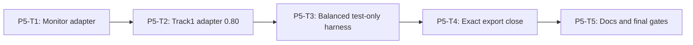

# Phase 5 Compatibility and Requirement Closure Implementation Plan

> **For agentic workers:** REQUIRED SUB-SKILL: Use
> `superpowers:subagent-driven-development` or `superpowers:executing-plans`,
> plus `superpowers:test-driven-development`. Execute only the assigned task.

**Goal:** Expose the accepted core through monitor and Track 1 boundaries
without double reduction, preserve legacy gates, enforce exact engine export
allowlists, close GENERAL-001 documentation with deterministic docs REDs.

**Architecture:** Monitor maps one reduced enforcement decision. Track1 adapter
emits confidence `0.80`. Test-only harness always uses **balanced.v1**. P5-T4
closes exports without renaming frozen APIs.

**Tech Stack:** Existing monitor/base-filter contracts on WSL Linux, `node:test`,
static repository scans, real tsc typecheck.

---

## Phase Entry Gate

```bash
REPO_ROOT="$(git rev-parse --show-toplevel)"
cd "$REPO_ROOT"
test "$(node -p 'process.platform')" = "linux"
test -f ./frontend/node_modules/typescript/bin/tsc
for cmd in node npm git; do
  path="$(command -v "$cmd")"
  case "$path" in *.exe|*.cmd|*.bat|/mnt/c/*|/mnt/d/*) exit 1;; esac
done

node --experimental-strip-types --test \
  engines/sandbox/tests/sandbox-security-authority.spec.ts \
  engines/sandbox/tests/sandbox-security-input.spec.ts \
  engines/sandbox/tests/sandbox-security-detector.spec.ts \
  engines/sandbox/tests/sandbox-security-policy.spec.ts \
  engines/sandbox/tests/sandbox-security-engine.spec.ts
npm run test:shared
npm run test:repo
node ./frontend/node_modules/typescript/bin/tsc --noEmit -p shared/tsconfig.json
node ./frontend/node_modules/typescript/bin/tsc --noEmit -p engines/sandbox/tsconfig.json
```

## Task DAG



## Fixed Track 1 confidence

```text
catalog match -> 0.80; no match -> no_match; never 0.60/1.00
```

## Exact export allowlist (same as Master; P5-T4 enforces only)

### A/B Shared — module-level exactness (not whole shared/index history)

See Master A/B. Package index must re-export A/B; historical exports remain.

### C Engine runtime

```ts
createSandboxSecurityEngine
createSandboxSecurityCanonicalFingerprintService
createSandboxSecurityMonitorDecisionAdapter
createTrack1RuleMatchDetectorAdapter
resolveSandboxSecurityProfile
createSandboxSecurityDetectorRegistry
```

**Not in C:** `normalizeSandboxSecurityEvaluationRequest`.

### D Engine types

```ts
SandboxSecurityEvaluationRequestInput
SandboxSecurityAuthoritativeEvaluationContextInput
AuthenticatedSourceObservationInput
AuthenticatedToolObservationInput
SandboxSecurityEngine
SandboxSecurityRuntimePorts
SandboxSecurityCanonicalFingerprintPort
SandboxSecurityCanonicalFingerprintService
SandboxSecurityDetectorRegistry
RawLocalDetector
SandboxSecuritySanitizer
SanitizedExternalDetector
SandboxSecurityRiskCandidate
SandboxSecurityCategoryClearance
SandboxSecurityRawDetectorResult
SandboxSecurityExternalDetectorResult
SandboxSecuritySanitizedJudgePayload
SandboxSecurityCandidateSubjectRef
SandboxSecurityExternalCandidateSubjectRef
```

**Not in D:** branded `SandboxSecurityEvaluationRequest`.

### E Never-export

Internal normalizer value export; branded evaluation request type; brand symbol;
raw snapshot concrete types; canonical bytes; qualification/escalation/token
registry/semantic validator internals; harness; tests paths.

## Production directory rules

Generic core under `engines/sandbox/src/security/**` is expected.

**Adapters subdirectory only:**

```text
engines/sandbox/src/security/adapters/
  - monitor-decision-provider.ts
  - track1-rule-matches.ts
```

**Whole production security tree:** no harness/oracle/case maps/fixtures.

Harness:

```text
engines/sandbox/tests/helpers/track1-security-regression-harness.ts
```

## P5-T1: Monitor Decision Adapter

**Files:**

- Create: `engines/sandbox/src/security/adapters/monitor-decision-provider.ts`
- Create: `engines/sandbox/tests/sandbox-security-track1-adapter.spec.ts`

**Locked:** `createSandboxSecurityMonitorDecisionAdapter`.

Calls:

```ts
engine.evaluate({ submission, authoritative_context }, signal)
```

Never pre-normalizes branded requests; never reduces action twice; enforcement
only; fail-closed on simulation/engine error.

REDs as previously specified. Commit:
`feat(sandbox): adapt security decisions to monitor provider`.

## P5-T2: Track 1 Rule-Match Detector Adapter

**Files:** `track1-rule-matches.ts` + adapter specs.

**Locked:** `createTrack1RuleMatchDetectorAdapter`.

Confidence REDs require exactly `0.80`. Category/severity maps from Spec.
Never calls legacy final provider.

Commit: `feat(sandbox): adapt Track 1 rule matches`.

## P5-T3: Test-Only Balanced Legacy Regression Harness

**Files:**

- Create: `engines/sandbox/tests/helpers/track1-security-regression-harness.ts`
- Modify: adapter + repository specs

### Locked harness configuration

```text
profile: sandbox-security-balanced.v1
rule detector: createTrack1RuleMatchDetectorAdapter
local: not registered
Judge: not registered
catalog match confidence: 0.80
no match: no_match
```

Reason written in harness comments and plan:

```text
legacy alert -> generic low  -> balanced alert
legacy ask   -> generic medium -> balanced ask
legacy deny  -> generic high -> balanced deny
```

Strict is forbidden for this harness. Profile is not agent/env selectable.

### REDs

```ts
test("REQ-SBX-GENERAL-001 compatibility harness uses balanced v1", async () => {});
test("REQ-SBX-GENERAL-001 legacy alert ask deny retain identical generic actions", async () => {});
test("REQ-SBX-GENERAL-001 preserves the nine Track 1 legacy actions", async () => {
  const report = await runTrack1SecurityCompatibilityHarness(ports);
  const actual = Object.fromEntries(
    report.map((row) => [row.case_id, row.legacy_action])
  );
  assert.deepEqual(actual, APPROVED_TRACK1_ACTION_MAP);
  assert.ok(report.every((row) => row.action_matches));
});
```

Case IDs / maps only in test-only harness + assertions.

### Repository scans

1. adapters/ allowlist only two files;
2. entire `src/security/**` has no oracle/harness;
3. harness exists only under `tests/helpers/`.

```bash
npm run test:engine:sandbox
npm run test:repo
git commit -m "test(sandbox): preserve Track 1 security behavior"
```

## P5-T4: Exact Export Close and Permanent Gates

**Files:** finalize `engines/sandbox/src/security/index.ts`, package test
registration, repository tests. May adjust `shared/index.ts` only if A/B
re-exports incomplete—never delete historical exports.

### Engine index: strict equality to C/D

```ts
const EXPECTED_ENGINE_RUNTIME_EXPORTS = [
  "createSandboxSecurityEngine",
  "createSandboxSecurityCanonicalFingerprintService",
  "createSandboxSecurityMonitorDecisionAdapter",
  "createTrack1RuleMatchDetectorAdapter",
  "resolveSandboxSecurityProfile",
  "createSandboxSecurityDetectorRegistry"
] as const;
// + type-only export name checks for D
```

Must prove **absent**:

- `normalizeSandboxSecurityEvaluationRequest`
- `SandboxSecurityEvaluationRequest` (branded)

### Shared package: additive A/B only

```ts
// assert every A/B name is exportable from shared package
// assert shared/types/sandbox-security.ts export set matches A∪B for that module
// assert shared/contracts/sandbox-security.ts exports four normalizers
// assert pre-existing shared export still present (e.g. normalizeBaseResult path)
// do NOT assert shared/index.ts exports === A/B only
```

Other REDs: focused tests registered; no oracle in production security; no
network/fs/model; type probes not in node scripts; tsconfig includes probes.

```bash
node --experimental-strip-types --test \
  tests/repository/sandbox-security-core.spec.ts \
  tests/repository/root-test-entry.spec.ts
node ./frontend/node_modules/typescript/bin/tsc --noEmit -p shared/tsconfig.json
node ./frontend/node_modules/typescript/bin/tsc --noEmit -p engines/sandbox/tsconfig.json
git commit -m "test(sandbox): register general security core gates"
```

## P5-T5: Documentation and Requirement Exit

**Files:** `README.md`, `docs/architecture.md`, `docs/api-contract.md`,
`docs/progress.md`, `docs/sprint-current.md`.

### Deterministic documentation RED (must fail before docs edit)

Do **not** use broad `/COMPLETE_PENDING_REVIEW/` or mere Requirement ID presence.

```ts
test("REQ-SBX-GENERAL-001 sprint is at final review state", () => {
  const text = readText("docs/sprint-current.md");
  // Requirement ID section exact
  assert.match(
    text,
    /## Requirement ID\s*\n\s*\nREQ-SBX-GENERAL-001\b/
  );
  // Final requirement status field — must not match PHASE_*_COMPLETE_PENDING_REVIEW
  assert.match(
    text,
    /## Status\s*\n\s*\nCOMPLETE_PENDING_REVIEW\b/
  );
  assert.doesNotMatch(
    text,
    /## Status\s*\n\s*\nPHASE_\d+_COMPLETE_PENDING_REVIEW\b/
  );
});

test("REQ-SBX-GENERAL-001 durable docs expose final core boundary", () => {
  assert.match(readText("README.md"), /sandbox-security-decision\.v1/);
  assert.match(
    readText("docs/architecture.md"),
    /sandbox-security-balanced\.v1/
  );
  assert.match(
    readText("docs/api-contract.md"),
    /createSandboxSecurityEngine/
  );
  assert.match(
    readText("docs/api-contract.md"),
    /SandboxSecurityEvaluationRequestInput/
  );
});
```

If `docs/sprint-current.md` uses a slightly different Status heading after user
activation of GENERAL-001, keep the same two-level structure:
`## Requirement ID` + `## Status` with exact values above. Early phase progress
entries like `PHASE_4_COMPLETE_PENDING_REVIEW` must not satisfy Status.

### RED order

1. Add repository tests above first.
2. Run → prove final markers/status missing.
3. Update docs + sprint final Status.
4. GREEN.
5. Final gates.

### Final gates

```bash
REPO_ROOT="$(git rev-parse --show-toplevel)"
cd "$REPO_ROOT"
test "$(node -p 'process.platform')" = "linux"
test -f ./frontend/node_modules/typescript/bin/tsc

npm run test:shared
npm run test:engine:sandbox
npm run test:repo
node ./frontend/node_modules/typescript/bin/tsc --noEmit -p shared/tsconfig.json
node ./frontend/node_modules/typescript/bin/tsc --noEmit -p engines/sandbox/tsconfig.json
git diff --check
git diff --summary
git status --short
```

```bash
git add README.md docs/architecture.md docs/api-contract.md \
  docs/progress.md docs/sprint-current.md \
  tests/repository/sandbox-security-core.spec.ts
git commit -m "docs(sandbox): complete general security core"
```

Stop. Do not enter GENERAL-002.

## Phase 5 / Requirement Exit Gate

Same as final gates above.

## Final Report Format

```text
Requirement: REQ-SBX-GENERAL-001
WSL process.platform:
evaluate(input) + internal normalize + budget:
Engine C/D exact exports (no branded request / no internal normalizer):
Shared A/B additive:
Balanced harness profile:
Track1 confidence 0.80:
Docs final markers:
test:shared / engine:sandbox / repo / typecheck:
git diff --check / --summary:
Current status: COMPLETE_PENDING_REVIEW
```
