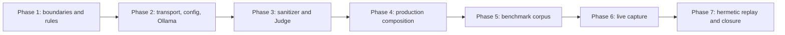

# REQ-SBX-GENERAL-002 Master Implementation Plan

> **For agentic workers:** REQUIRED SUB-SKILL: Use
> `superpowers:subagent-driven-development` (recommended) or
> `superpowers:executing-plans`, plus `superpowers:test-driven-development`.
> Execute exactly one assigned task, complete its independent review and
> re-review loop, update status evidence, commit only listed paths, then stop.
>
> **Canonical plan set:** This Master plus the seven Phase plans are the only
> implementation authority for REQ-SBX-GENERAL-002 after explicit user
> approval. Do not implement from chat summaries or an older plan revision.
>
> **APPROVAL GATE PASSED:** The Spec and complete plan set were independently
> reviewed and explicitly approved by the user. Execute the ordered task and
> review loops below; stop only after the full GENERAL-002 plan set is closed
> or a real external blocker is recorded.

**Goal:** Add production rule, Ollama, sanitizer, and OpenAI Judge adapters to
the frozen GENERAL-001 sandbox security core, then curate and seal a fixed
300-input public benchmark with truth-blind live capture and mandatory hermetic
replay.

**Architecture:** GENERAL-002 lives under the sibling
`engines/sandbox/src/security-production/` tree and depends only on the final
GENERAL-001 security index, except for the sanitizer's single approved token
registry helper deep import. Provider traffic is closed behind one default Node
HTTP transport; public composition accepts runtime ports and a mode only.
Benchmark code remains outside production, separates input/capture/truth
capabilities by process, and replays anonymous content-free provider outcomes
through the same Engine path.

**Tech Stack:** Node.js `>=22.19.0`, TypeScript ESM with native type stripping,
`node:test`, `node:assert/strict`, repository-local TypeScript compiler,
Node `http`/`https`, Node permission model, Linux `unshare --net`, SHA-256,
JSON Schema data, no new production dependency.

---

## Document Status

- Requirement: `REQ-SBX-GENERAL-002`
- Status: `IMPLEMENTATION_IN_PROGRESS`
- Date: `2026-07-16`
- Spec:
  `docs/superpowers/specs/2026-07-16-sandbox-security-production-detectors-spec.md`
- Depends on frozen GENERAL-001 at HEAD ancestry including `4ef08de`
- Implementation authorization: approved by the user on `2026-07-17`

## Plan Review Record

- first independent Plan Review: `CHANGES_REQUIRED`
- accepted blocking findings: seven; all corrected in the Master, Phase plans,
  and permanent semantic plan gate
- focused re-review: `APPROVED`
- new findings: none
- user implementation approval: explicit and current

## Execution Environment

Run every task from the repository root on Linux:

```bash
REPO_ROOT="$(git rev-parse --show-toplevel)"
cd "$REPO_ROOT"
test "$(node -p 'process.platform')" = "linux"
node --version
npm --version
git branch --show-current
git status --short
test -f ./frontend/node_modules/typescript/bin/tsc
command -v unshare
node --help | rg -- '--permission'
```

Expected: Node `>=22.19.0`, `unshare` available, current branch known, existing
user/agent changes preserved. Do not install dependencies, alter lockfiles,
switch branches, reset, clean, or change global Git/line-ending configuration.

The current planning environment does not have an Ollama listener at
`127.0.0.1:11434`, an installed `ollama` CLI, or the two required local-model
environment values. That does not block plan approval, but Phase 6 live
qualification cannot become `VERIFIED` until the operator supplies:

```text
SANDBOX_SECURITY_OLLAMA_MODEL_DIGEST=sha256:<64 lowercase hex>
OPENAI_API_KEY=<nonempty secret>
SANDBOX_SECURITY_ENABLE_OPENAI_JUDGE=1
```

and runs the exact `qwen3:8b` digest on loopback. There is no fake, skipped, or
offline substitute for the acceptance capture.

Node file permissions enforce truth unreadability. Node's permission model does
not block network or environment reads, so hermetic replay additionally runs
inside `unshare --net`; inability to create that network namespace is a real
CI/environment blocker, not a reason to weaken the no-network gate.

## Canonical Inputs

- `AGENTS.md`
- `metadata.md`
- `docs/sprint-current.md`
- `docs/superpowers/specs/2026-07-10-sandbox-general-security-design.md`
- `docs/superpowers/specs/2026-07-10-sandbox-security-core-spec.md`
- `docs/superpowers/specs/2026-07-16-sandbox-security-production-detectors-spec.md`
- `docs/superpowers/plans/2026-07-11-sandbox-security-core-001-master.md`
- `engines/sandbox/src/security/index.ts`
- `engines/sandbox/src/security/detector-contract.ts`
- `engines/sandbox/src/security/engine.ts`
- `tests/repository/sandbox-security-core.spec.ts`

When this plan conflicts with the approved GENERAL-002 Spec or a frozen
GENERAL-001 contract/profile/reducer/state machine, the Spec/core wins. Stop and
return to the owning plan document; do not patch the core to fit an adapter.

## Locked Public Surface

`engines/sandbox/src/security-production/index.ts` eventually exports exactly:

```ts
export function createSandboxSecurityProductionRuleDetector(): RawLocalDetector;

export function createSandboxSecurityDeterministicSanitizer():
  SandboxSecuritySanitizer;

export function createSandboxSecurityProductionEngine(input: Readonly<{
  runtime: SandboxSecurityRuntimePorts;
  mode: "rule_only" | "local" | "local_and_judge";
}>): Promise<SandboxSecurityEngine>;
```

It exports no transport, endpoint, credential, environment loader,
qualification proof, provider parser, benchmark type, replay type, or new
shared DTO. The public composition accepts no environment object or transport.

The only benchmark reverse-direction entrypoints are direct imports from
`security-production/benchmark-composition.ts` by their matching scripts and
repository tests:

```ts
createSandboxSecurityLiveCaptureEngine({ runtime, capture_sink });
createSandboxSecurityHermeticReplayEngine({
  runtime,
  replay_transport,
  sealed_config
});
```

## Frozen Core Boundary

No GENERAL-001 production file is modified. GENERAL-002 imports runtime
factories and types through `engines/sandbox/src/security/index.ts` only, except:

```ts
import {
  deriveSandboxSecurityExternalTokenRegistry
} from "../security/sanitized-boundary.ts";
```

That one deep import may appear only in
`security-production/deterministic-sanitizer.ts`. The core never imports
`security-production`.

## Global TDD Rules

1. No production behavior before a named failing test.
2. A raw missing-module, export-link, syntax, or environment error is invalid
   RED. For a new module, narrowly detect only absence of the exact path,
   provide a test-local inert implementation, and fail the real behavioral
   assertion.
3. Every boundary test includes normal, error, boundary, missing-field,
   unknown-key, inherited/accessor, abort, and raw-sentinel cases where
   applicable.
4. Provider tests use injected internal test ports; production composition has
   no endpoint or transport override.
5. No test deletes, skips, weakens, snapshots opaque provider bodies, or expands
   tolerated input to become green.
6. Data/document/config tasks use deterministic validation RED gates; they do
   not pretend curated data is production business logic.
7. Every task runs focused GREEN, affected integration/static tests, sandbox
   TypeScript, frontend production build, and `git diff --check` before review.
8. Every task receives two ordered implementer-independent review passes. The
   first is a Specification Compliance Review; accepted findings get a new RED,
   root-cause fix, and full task rerun. Only then does a separate Code Quality/
   Security Review inspect correctness, safety, resources, maintainability, and
   tests; its accepted findings receive the same fix/rerun loop. A final
   independent re-review closes findings from both passes.
9. A task is `VERIFIED` only after re-review is `APPROVED`, status evidence is
   synchronized, and its exact files are committed.
10. One task at a time. Never continue to the next task without closing the
    current review loop.

## Required Evidence Per Task

```text
Task ID / branch / HEAD / dirty paths / exact files / design boundary /
RED command + intended AssertionError / implementation summary /
focused GREEN / static check / integration or contract test /
sandbox TypeScript / frontend build / git diff --check /
Specification Compliance Review conclusion + issues/fixes/regression /
Code Quality/Security Review conclusion + issues/fixes/regression /
re-review status for both review sets / docs-status update / exact commit
```

The expected build command for every task is:

```bash
npm run build --prefix frontend
```

The repository has no separate sandbox artifact build script. The real sandbox
compile gate is:

```bash
node ./frontend/node_modules/typescript/bin/tsc \
  --noEmit -p engines/sandbox/tsconfig.json
```

No lint script is configured; do not invent one. Static checks are TypeScript,
repository AST/capability tests, corpus validators, and `git diff --check`.
From P5-T1 onward, every task also runs:

```bash
npm run typecheck:benchmark:sandbox-security
```

## Independent Review Protocol

For every task, dispatch reviewer contexts that did not implement it. The
Specification Compliance Review reads the approved Spec, Master, current Phase
plan, actual diff, source, tests, and command evidence, and checks complete
requirement/contract/acceptance coverage. Resolve and rerun its accepted
findings before starting the Code Quality/Security Review. That second review
starts from the corrected diff and independently inspects error handling,
security/capability boundaries, concurrency/resources, compatibility,
maintainability, tests, docs, and downstream blockers.

Each review pass has its own required conclusion:

```text
P0/P1/P2/P3 findings with file, trigger, impact, fix, blocking status
APPROVED | APPROVED_WITH_NON_BLOCKING_COMMENTS | CHANGES_REQUIRED
```

After both review passes and their fixes, the same or another independent
reviewer returns a combined re-review:

```text
Original issue 1: RESOLVED | PARTIALLY_RESOLVED | NOT_RESOLVED
New issues: none | listed findings
Final conclusion: APPROVED | CHANGES_REQUIRED
```

Do not commit or begin another task until the final conclusion is `APPROVED`.

## Production File Unique Ownership

| File | Sole create/modify owner |
| --- | --- |
| `engines/sandbox/src/security-production/.gitkeep` | P1-T1 |
| `engines/sandbox/src/security-production/rule-catalog.ts` | P1-T2 |
| `engines/sandbox/src/security-production/rule-detector.ts` | P1-T3 |
| `engines/sandbox/tsconfig.json` | P1-T4 (GENERAL-002 include only) |
| `engines/sandbox/src/security-production/provider-outcomes.ts` | P2-T1 |
| `engines/sandbox/src/security-production/http-transport.ts` | P2-T2 |
| `engines/sandbox/src/security-production/production-config.ts` | P2-T3 |
| `engines/sandbox/src/security-production/ollama-contract.ts` | P2-T4 |
| `engines/sandbox/src/security-production/ollama-local-detector.ts` | P2-T5 |
| `engines/sandbox/src/security-production/deterministic-sanitizer.ts` | P3-T1 |
| `engines/sandbox/src/security-production/openai-judge-contract.ts` | P3-T2 |
| `engines/sandbox/src/security-production/openai-judge-detector.ts` | P3-T3 |
| `engines/sandbox/src/security-production/external-pipeline.ts` | P3-T4 |
| `engines/sandbox/src/security-production/composition.ts` | P4-T1 |
| `engines/sandbox/src/security-production/index.ts` | P4-T2 |
| `engines/sandbox/src/security-production/benchmark-composition.ts` | P4-T3 |

Split modules `provider-outcomes.ts`, `ollama-contract.ts`,
`openai-judge-contract.ts`, and `external-pipeline.ts` are explicitly justified
by the Spec's permission to split planned modules: each isolates one closed
schema/parser or the sanitizer/Judge pairing from network and Engine
orchestration. No other production module is added without Spec/plan amendment
and independent review.

## Benchmark and Script Unique Ownership

| File or tree | Sole create/modify owner |
| --- | --- |
| `scripts/benchmark/sandbox-security/contracts.ts` | P5-T1 |
| `scripts/benchmark/sandbox-security/tsconfig.json` | P5-T1 |
| `scripts/benchmark/sandbox-security/import-sources.ts` | P5-T2 |
| `samples/sandbox-security-benchmark/v1/sources.lock.json` | P5-T2 |
| `samples/sandbox-security-benchmark/v1/ATTRIBUTION.md` | P5-T2 |
| `scripts/benchmark/sandbox-security/validate-corpus.ts` | P5-T3 |
| `samples/sandbox-security-benchmark/v1/inputs/` | P5-T3 |
| `samples/sandbox-security-benchmark/v1/truth/` | P5-T3 |
| `samples/sandbox-security-benchmark/v1/manifest.json` | P5-T3 |
| `scripts/benchmark/sandbox-security/prepare-capture-bundle.ts` | P5-T4 |
| `scripts/benchmark/sandbox-security/capture-sink.ts` | P6-T1 |
| `scripts/benchmark/sandbox-security/capture-live.ts` | P6-T2 |
| `scripts/benchmark/sandbox-security/evaluate.ts` | P6-T3 |
| `scripts/benchmark/sandbox-security/seal.ts` | P6-T4 |
| `samples/sandbox-security-benchmark/v1/capture.json` | P6-T4 |
| `samples/sandbox-security-benchmark/v1/replay/` | P6-T4 |
| `samples/sandbox-security-benchmark/v1/seal.json` | P6-T4 |
| `scripts/benchmark/sandbox-security/replay-transport.ts` | P7-T1 |
| `scripts/benchmark/sandbox-security/replay-hermetic.ts` | P7-T2 |
| `package.json` | P4-T4 production test script, P5-T1 benchmark typecheck, then P7-T3 disjoint benchmark/test:all keys |
| `README.md`, `docs/architecture.md`, `docs/api-contract.md` | P7-T4 |

Tests may be extended only by tasks that list them. Production and durable data
ownership is singular. Later defects return to the owning task instead of
silently patching an earlier file.

The P6-T4 seal script is a deliberate capability split: the truth-aware
evaluator can emit only a bounded aggregate acceptance report, while the
truth-blind sealer can copy/hash the complete candidate cassette but cannot
read truth or select outcomes by label.

## Test File Ownership

| Test file | Owner |
| --- | --- |
| `tests/repository/sandbox-security-production.spec.ts` | P1-T1 |
| `tests/repository/sandbox-security-core.spec.ts` (GENERAL-002 tsconfig expectation only) | P1-T4 |
| `engines/sandbox/tests/sandbox-security-production-rule-catalog.spec.ts` | P1-T2 |
| `engines/sandbox/tests/sandbox-security-production-rule-detector.spec.ts` | P1-T3 |
| `engines/sandbox/tests/types/sandbox-security-production-typecheck-anchor.ts` | P1-T4 |
| `engines/sandbox/tests/sandbox-security-production-provider-outcomes.spec.ts` | P2-T1 |
| `engines/sandbox/tests/sandbox-security-production-http-transport.spec.ts` | P2-T2 |
| `engines/sandbox/tests/sandbox-security-production-config.spec.ts` | P2-T3 |
| `engines/sandbox/tests/sandbox-security-production-ollama-contract.spec.ts` | P2-T4 |
| `engines/sandbox/tests/sandbox-security-production-ollama-detector.spec.ts` | P2-T5 |
| `engines/sandbox/tests/sandbox-security-production-sanitizer.spec.ts` | P3-T1 |
| `engines/sandbox/tests/sandbox-security-production-openai-contract.spec.ts` | P3-T2 |
| `engines/sandbox/tests/sandbox-security-production-openai-detector.spec.ts` | P3-T3 |
| `engines/sandbox/tests/sandbox-security-production-external-pipeline.spec.ts` | P3-T4 |
| `engines/sandbox/tests/sandbox-security-production-composition.spec.ts` | P4-T1 |
| `engines/sandbox/tests/sandbox-security-production-index.spec.ts` | P4-T2 |
| `engines/sandbox/tests/sandbox-security-production-benchmark-composition.spec.ts` | P4-T3 |
| `engines/sandbox/tests/sandbox-security-production-integration.spec.ts` | P4-T4 |
| `tests/benchmark/sandbox-security-contracts.spec.ts` | P5-T1 |
| `tests/benchmark/sandbox-security-source-admission.spec.ts` | P5-T2 |
| `tests/benchmark/sandbox-security-corpus.spec.ts` | P5-T3 |
| `tests/benchmark/sandbox-security-isolation.spec.ts` | P5-T4 |
| `tests/benchmark/sandbox-security-capture-sink.spec.ts` | P6-T1 |
| `tests/benchmark/sandbox-security-capture-live.spec.ts` | P6-T2 |
| `tests/benchmark/sandbox-security-evaluate.spec.ts` | P6-T3 |
| `tests/benchmark/sandbox-security-live-evidence.spec.ts` | P6-T4 |
| `tests/benchmark/sandbox-security-replay-transport.spec.ts` | P7-T1 |
| `tests/benchmark/sandbox-security-replay-hermetic.spec.ts` | P7-T2 |
| `tests/repository/sandbox-security-benchmark.spec.ts` base anti-oracle gate P7-T3; final docs assertions P7-T4 |

## Phase DAG



Exact task count: `4 + 5 + 4 + 4 + 4 + 4 + 4 = 29`.

No Phase may start until every task in the preceding Phase is `VERIFIED`, its
Phase review/fix/re-review is approved, and its status record is committed.

## Phase Plan Index

1. [Phase 1 boundaries and rules](./2026-07-16-sandbox-security-production-002-phase-1-boundaries-rules.md)
2. [Phase 2 transport and local model](./2026-07-16-sandbox-security-production-002-phase-2-transport-local.md)
3. [Phase 3 sanitizer and Judge](./2026-07-16-sandbox-security-production-002-phase-3-sanitizer-judge.md)
4. [Phase 4 production composition](./2026-07-16-sandbox-security-production-002-phase-4-production-composition.md)
5. [Phase 5 benchmark corpus](./2026-07-16-sandbox-security-production-002-phase-5-benchmark-corpus.md)
6. [Phase 6 live capture](./2026-07-16-sandbox-security-production-002-phase-6-live-capture.md)
7. [Phase 7 hermetic closure](./2026-07-16-sandbox-security-production-002-phase-7-hermetic-closure.md)

## Workstream Separation Required by Spec

| Minimum workstream | Owner |
| --- | --- |
| production ownership and capability gates | P1-T1 |
| rule catalog and detector | P1-T2, P1-T3 |
| HTTP transport and production config | P2-T2, P2-T3 |
| Ollama adapter | P2-T4, P2-T5 |
| deterministic sanitizer | P3-T1 |
| OpenAI Judge adapter | P3-T2, P3-T3 |
| production composition | P4-T1, P4-T2 |
| source lock and corpus contracts | P5-T1, P5-T2 |
| sealed input and truth curation | P5-T3 |
| live capture and evaluator | P6-T1 through P6-T4 |
| hermetic replay and anti-oracle gates | P7-T1 through P7-T3 |
| documentation, full regression, and global review | P7-T4 |

## Spec Coverage Matrix

| Spec area | Task owner |
| --- | --- |
| sibling production tree and capability graph | P1-T1 |
| closed rule descriptor/operators/freeze | P1-T2 |
| deterministic matching and subject mapping | P1-T3 |
| TypeScript inclusion and no core change | P1-T4 |
| content-free provider outcome schemas | P2-T1 |
| fixed endpoint transport, cleanup, digest side channel | P2-T2 |
| three-variable private config | P2-T3 |
| exact Ollama prompt/body/envelope/schema mapping | P2-T4 |
| digest qualification, WeakMap proof, prewarm, adapter | P2-T5 |
| NFKC structured sanitizer and sole deep import | P3-T1 |
| exact Responses request/strict response parser | P3-T2 |
| obligation-bound external detector | P3-T3 |
| sanitizer failure zero Judge and Engine integration | P3-T4 |
| mode composition and no fallback policy | P4-T1 |
| exact public export allowlist | P4-T2 |
| live/replay benchmark-only composition seams | P4-T3 |
| full production Engine and Track 1 regression | P4-T4 |
| exact benchmark schemas and normalizers | P5-T1 |
| immutable reviewed source admission/attribution | P5-T2 |
| 300 input/truth matrix and provenance | P5-T3 |
| truth-blind permission bundle | P5-T4 |
| anonymous capture lifecycle and not_called slots | P6-T1 |
| Ollama/OpenAI readiness and live runner | P6-T2 |
| frozen metrics and evaluator process | P6-T3 |
| accepted credentialed capture and seal | P6-T4 |
| qualification/input replay state machine | P7-T1 |
| network-free complete Engine replay | P7-T2 |
| anti-oracle/leak/static/package gates | P7-T3 |
| docs, full regression, final global review | P7-T4 |

## Cross-Phase Contract Freeze

- Phase 1 freezes production ownership and deterministic rule result behavior.
- Phase 2 freezes provider outcome, transport, config, Ollama request/response,
  qualification, and prewarm contracts.
- Phase 3 freezes sanitizer and OpenAI Judge mapping.
- Phase 4 freezes the three public factories and benchmark composition seams.
- Phase 5 freezes source lock, corpus schemas, exact 300-input matrix, and input
  bundle hashes before providers see any benchmark input.
- Phase 6 freezes accepted live decisions, provider outcomes, metrics, and seal.
- Phase 7 may only replay/validate/close; it cannot alter production adapters,
  corpus truth, accepted live metrics, or provider cassettes.

## Required Permanent Scripts at Exit

```json
{
  "test:engine:sandbox:production": "node --experimental-strip-types --experimental-test-isolation=none --test engines/sandbox/tests/sandbox-security-production-*.spec.ts",
  "test:repo:sandbox-security-production": "node --experimental-strip-types --experimental-test-isolation=none --test tests/repository/sandbox-security-production.spec.ts tests/repository/sandbox-security-benchmark.spec.ts",
  "typecheck:benchmark:sandbox-security": "node ./frontend/node_modules/typescript/bin/tsc --noEmit -p scripts/benchmark/sandbox-security/tsconfig.json",
  "benchmark:sandbox-security:validate": "node --experimental-strip-types scripts/benchmark/sandbox-security/validate-corpus.ts",
  "benchmark:sandbox-security:replay": "env -u OPENAI_API_KEY -u SANDBOX_SECURITY_OLLAMA_MODEL_DIGEST -u SANDBOX_SECURITY_ENABLE_OPENAI_JUDGE unshare --net node --experimental-strip-types scripts/benchmark/sandbox-security/replay-hermetic.ts",
  "benchmark:sandbox-security:qualify:live": "node --experimental-strip-types scripts/benchmark/sandbox-security/prepare-capture-bundle.ts"
}
```

`test:all` includes production, repository-static, benchmark typecheck, corpus
validation, and hermetic replay. It never includes the credentialed live
command.

## Plan Review Checklist

- [ ] All 29 tasks have exact files, failing test, RED command, implementation
      boundary, GREEN/broader/build gates, independent review, fix, re-review,
      status update, exact git add, and commit.
- [ ] No task changes a GENERAL-001 production file.
- [ ] No public factory accepts transport, environment, credential, endpoint,
      prompt, schema, model, or benchmark metadata.
- [ ] Rule/local/Judge modules cannot import benchmark or Track 1 data.
- [ ] Only default transport has network capability; only production config
      reads environment.
- [ ] Ollama chat revalidates digest immediately before raw-content POST under
      the same Engine signal and lease.
- [ ] Qualification proof is one-use transport-bound WeakMap identity.
- [ ] Sanitizer uses only the approved deep import and leaves exact inherited
      bounds to the frozen core validator.
- [ ] Judge copies category/scope from routed obligations and treats omission as
      the only partial coverage.
- [ ] Benchmark source records have compatible license evidence and immutable
      record hashes; excluded datasets never enter v1.
- [ ] Inputs and truth are separate; capture process has no truth path/read
      permission; evaluator has no provider/network/production detector graph.
- [ ] Live capture has anonymous per-input two-slot boundaries and records
      explicit `not_called`.
- [ ] Replay qualification is inventory then prewarm, input units are ordered,
      and signal termination waits for the actual Engine signal.
- [ ] Hermetic replay runs in a Linux network namespace with credentials unset.
- [ ] All final docs distinguish installed, configured, live-qualified, and
      hermetically replayed state.

## Requirement Exit Gate

After P7-T4 fixes and final re-review, run from a clean expected worktree:

```bash
npm run test:shared
npm run test:engine:sandbox
npm run test:engine:sandbox:production
npm run test:repo
npm run test:repo:sandbox-security-production
npm run typecheck:benchmark:sandbox-security
npm run benchmark:sandbox-security:validate
npm run benchmark:sandbox-security:replay
node ./frontend/node_modules/typescript/bin/tsc --noEmit -p shared/tsconfig.json
node ./frontend/node_modules/typescript/bin/tsc --noEmit -p engines/sandbox/tsconfig.json
npm run build --prefix frontend
git diff --check
git diff --summary
git status --short
```

Then verify accepted live evidence matches current model digest, OpenAI model,
prompt/schema/catalog/sanitizer versions, corpus revision, capture hashes, and
seal. Final global review must be `APPROVED`; update requirement status to
`COMPLETE_PENDING_REVIEW`; stop before GENERAL-003.
