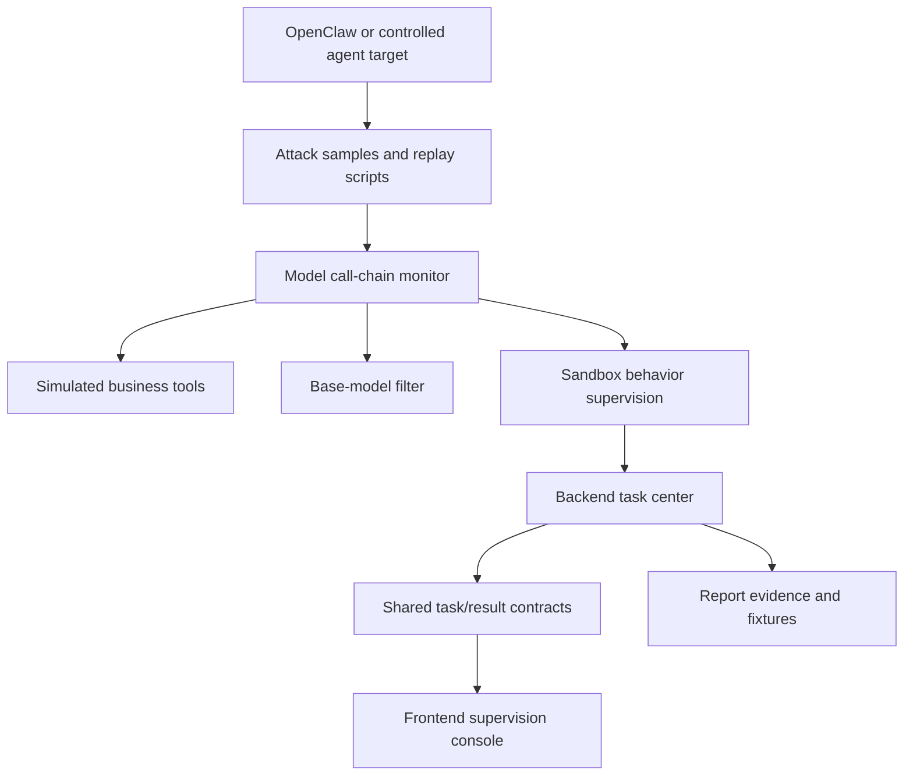

# Spec: Track 1 Agent Security Direction

## Objective

This spec turns the repository toward Track 1: security research for large models and intelligent applications. The goal is not to create a separate contest demo, but to shape the existing `agent-security-platform` into a deliverable that matches the Track 1 expected outcome:

- a security risk analysis report with at least three attack scenarios
- adversarial and jailbreak test case sets for each scenario
- agent attack scripts for each scenario
- a behavior supervision prototype that intercepts agent/tool interactions
- OpenClaw or an equivalent open-source intelligent application as the primary demo target
- simulated business tools such as email, file access, and API calls
- a model call-chain monitoring plugin
- a base-model detection or filtering prototype
- a supervision console that displays real-time alerts or blocking records

Success means the final project can be evaluated directly against the contest wording while still following the repository baseline: React + TypeScript frontend, Node.js + TypeScript backend, NestJS-style module boundaries, shared contracts, TDD-first implementation, and the existing three-engine model.

## Assumptions

- OpenClaw is the primary open-source intelligent application target for Track 1 alignment.
- The first delivery strategy is outcome-loop-first: build the shortest controlled loop from attack scenario to test case, script, monitored tool interaction, alert or blocking record, and report evidence.
- The project keeps `asset_scan`, `static_analysis`, and `sandbox_run` as the three platform task lanes. No fourth engine is introduced for the first Track 1 phase.
- Attack scripts and adversarial samples are controlled research fixtures. They must not target third-party systems or encourage real abuse.
- The current work is specification and requirement convergence only. It is a documentation exception to full RED/GREEN TDD and does not change production behavior.

## Existing Capabilities To Reuse

| Track 1 need | Existing repository capability | Reuse level |
| --- | --- | --- |
| Open-source intelligent application target | `asset_scan` already models `openclaw`, `mcp`, `ollama`, `agent_application`, and related fingerprints | High |
| Unified platform workflow | Existing `POST /api/tasks`, task detail, result, and risk summary contracts | High |
| Runtime supervision shell | Existing `sandbox_run` task type, `blocked` status, `alerts`, `blocked`, and `event_count` fields | High |
| Supervision UI entry | Existing `/results/sandbox`, task detail sandbox branch, and `SandboxAlertSection` placeholder | High |
| Static risky capability detection | Existing `static_analysis`, `skills-static`, rule hits, sensitive capabilities, and Semgrep/mock provider shape | Medium |
| Report and evidence path | Existing `docs/`, `samples/`, `tests/`, task fixtures, and progress log conventions | Medium |
| Adversarial cases and attack scripts | Only the directory/testing style is reusable; contents need to be created | Low |
| Simulated business tools | Must be newly introduced behind clear contracts | Low |
| Model filtering and call-chain plugin | Must be newly introduced, but should reuse the task/engine contract style | Low |

## Requirement Model

The work is split into two layers.

### Outcome Layer

These outcomes map to the contest expected deliverables:

1. `OUTCOME-T1-REPORT`: security risk analysis report.
2. `OUTCOME-T1-CASESET`: adversarial and jailbreak test case sets.
3. `OUTCOME-T1-ATTACK-SCRIPTS`: agent attack scripts.
4. `OUTCOME-T1-SUPERVISION-PROTOTYPE`: behavior supervision prototype.
5. `OUTCOME-T1-DEMO-TARGETS`: OpenClaw target plus simulated business tools.
6. `OUTCOME-T1-MONITORING`: model call-chain monitor plus base-model filter prototype.
7. `OUTCOME-T1-REALTIME-UI`: supervision console showing alerts and blocking records.

### Repository Requirement Layer

Implementation should proceed one requirement at a time:

1. `REQ-T1-SPEC-001`: Track 1 direction design document.
2. `REQ-T1-SCENARIO-002`: three attack scenarios and acceptance matrix.
3. `REQ-T1-CASESET-003`: adversarial and jailbreak case set schema and fixtures.
4. `REQ-T1-MOCK-TOOLS-004`: simulated business tool contract for email, file, and API operations.
5. `REQ-T1-SANDBOX-CONTRACT-005`: typed behavior supervision events and policy decisions.
6. `REQ-T1-ATTACK-REPLAY-006`: controlled attack script replay into sandbox event streams.
7. `REQ-T1-MONITOR-PLUGIN-007`: model call-chain monitoring plugin.
8. `REQ-T1-BASE-FILTER-008`: base-model detection or filtering prototype.
9. `REQ-T1-SUPERVISION-UI-009`: supervision console upgrade for timelines, alerts, and blocking records.
10. `REQ-T1-DEMO-010`: OpenClaw-oriented end-to-end demo and report evidence pack.

## Initial Attack Scenarios

The first scenario set must cover at least these three classes:

| Scenario | Research intent | Expected monitored actions |
| --- | --- | --- |
| Prompt injection and jailbreak | The model is induced to ignore policy, reveal sensitive context, or request unsafe tool use | suspicious prompt, model output risk, blocked or asked tool request |
| Tool-call hijacking | User or retrieved content steers an agent into invoking a business tool with attacker-chosen parameters | email send, file read/write, external API call |
| Context or memory poisoning | Persistent or retrieved context changes later model behavior and causes risky downstream tool use | memory write/read, prompt context mutation, delayed risky call |

Each scenario must eventually include adversarial prompt samples, jailbreak or misuse cases, expected model behavior, an agent attack script entrypoint, required simulated tools, expected policy action, and report evidence.

## Architecture

The Track 1 direction keeps the current platform shape:



The backend remains the only platform API for the frontend. Engines remain independent. Shared contracts remain the source of truth for cross-boundary task and result data.

## Components

### Asset Scan Lane

`asset_scan` provides the application and exposure context. It should be used to represent OpenClaw, MCP, Ollama, and related agent application surfaces. It should not become responsible for runtime behavior supervision.

### Static Analysis Lane

`static_analysis` provides skill, script, and tool-capability inspection. It should identify sensitive capabilities such as command execution, network access, file operations, API calls, and credential access when those appear in skills or attack scripts.

### Sandbox Lane

`sandbox_run` is the primary Track 1 behavior supervision lane. It should receive monitored events from replay scripts, the call-chain monitor, and simulated business tools. It should produce typed alerts, policy decisions, blocking records, and risk summaries.

### Simulated Business Tools

The first tool set should include:

- `send_email`: demonstrates exfiltration or unauthorized action risk.
- `read_file`: demonstrates sensitive file access risk.
- `write_file`: demonstrates persistence or tampering risk.
- `call_api`: demonstrates external API abuse risk.

These tools are test fixtures and local controlled components, not real production integrations.

### Model Call-Chain Monitor

The monitor sits between agent/model output and tool execution. It records prompt/input reference, model output summary, requested tool and arguments, filter result, sandbox policy decision, final action, and evidence reference.

### Base-Model Filter

The first filter should be rule-based. It should detect jailbreak intent, dangerous tool intent, sensitive data requests, and policy-bypass language. A model-based detector can be considered later only after the rule-based prototype is measurable.

### Supervision Console

The frontend should evolve from the current sandbox placeholder into an operator-facing view that shows session status, event timeline, policy decisions, alerts and blocking records, scenario label, tool call evidence, and summary counts used by the report.

## Data Flow

1. A Track 1 attack case defines prompt samples, expected behavior, and script metadata.
2. A replay script drives a controlled agent or mock agent interaction.
3. The call-chain monitor captures prompt, model output, tool request, and filter result.
4. Simulated tools emit structured interaction events.
5. The sandbox supervision layer applies policy and emits alerts or blocking records.
6. The backend stores the result through the existing task/result shell.
7. The frontend displays the supervision state and evidence.
8. The report links scenario, case set, script, policy decision, and UI/result evidence.

## Error Handling

- Missing attack fixture: fail the relevant test or script with a clear fixture-not-found message.
- Unsafe external target: reject by default unless the scenario explicitly uses a controlled local or approved target.
- Unknown tool action: convert to an `ask` or `alert` decision instead of silently allowing.
- Invalid sandbox event shape: reject at contract normalization and keep raw details out of frontend-facing results.
- Filter/runtime failure: produce a failed task or internal diagnostic event without leaking raw provider internals into public API contracts.

## Tech Stack

- Frontend: React + TypeScript, Ant Design console style.
- Backend: Node.js + TypeScript, NestJS-style module organization.
- Shared contracts: TypeScript types and runtime normalizers under `shared/`.
- Engines: `engines/asset-scan`, `engines/skills-static`, `engines/sandbox`.
- Package manager: `pnpm@10.0.0`.
- Node.js baseline: `>=22.17.0`.

## Commands

Use these commands from the repository root:

```powershell
npm run test
npm run test:repo
npm run test:shared
npm run test:backend
npm run test:frontend
```

Known current baseline in `codex/track1-requirements-spec`:

- `test:repo` passes.
- `test:shared` passes.
- `test:frontend` passes.
- The local Semgrep provider path passes after installing its required `protobuf>=5,<7` Python dependency.
- `test:backend` still has one pre-existing baseline failure unrelated to this spec: an asset-scan expectation drift in `task-engine.service.spec.ts`.

## Project Structure

Proposed durable locations:

```text
docs/superpowers/specs/
  2026-06-27-track1-agent-security-design.md

docs/
  sprint-current.md
  progress.md
  track1-risk-analysis-report.md          # later requirement

samples/track1/
  cases/                                  # adversarial and jailbreak cases
  attack-scripts/                         # controlled replay scripts
  sandbox-events/                         # expected event fixtures

engines/sandbox/
  src/                                    # event processing and policy evaluation
  policies/                               # allow/deny/ask/alert policy definitions
  tests/

backend/src/modules/task-center/
  adapters/sandbox.adapter.ts             # existing handoff point

frontend/src/
  pages/SandboxAlertsPage.tsx
  components/task-detail/SandboxAlertSection.tsx
```

Exact paths for new source files must be confirmed during each individual requirement.

## Code Style

Cross-boundary values should stay explicit, typed, and snake_case at API boundaries. Example target shape for later sandbox events:

```typescript
export interface SandboxPolicyDecision {
  decision_id: string;
  policy_id: string;
  action: "allow" | "deny" | "ask" | "alert";
  reason: string;
  evidence_refs: string[];
}
```

Keep engine-private fields out of frontend-facing contracts. Put only shared task/result types in `shared/`.

## Testing Strategy

Track 1 implementation requirements must use TDD:

1. Shared contract tests for new event, case, and policy types.
2. Backend unit tests for normalization, policy decision mapping, and task result derivation.
3. Backend integration tests for task creation and result readback.
4. Frontend component tests for sandbox alert and timeline rendering.
5. Repository-level tests for fixture schemas and report evidence consistency.

Doc-only requirements, including `REQ-T1-SPEC-001`, are an allowed exception to full RED/GREEN because they do not change production behavior.

## Boundaries

Always:

- Keep one active requirement in `docs/sprint-current.md`.
- Update `docs/progress.md` when a requirement completes.
- Reuse existing task/result/risk-summary contracts where possible.
- Keep frontend access through backend APIs only.
- Keep attack samples and scripts controlled, local, and research-oriented.

Ask first:

- Adding a fourth engine or new top-level package.
- Adding new public API routes outside the task center.
- Introducing a database or persistent storage architecture.
- Introducing external model providers, hosted services, or networked targets.
- Replacing the existing task/result contract.

Never:

- Target unapproved third-party systems.
- Commit secrets, real credentials, or live tokens.
- Hide unsafe behavior behind mock success.
- Expose raw engine-private exceptions or debug fields to frontend contracts.
- Collapse contest reporting into code-only implementation without evidence artifacts.

## Success Criteria

This spec is accepted when:

- It maps every Track 1 expected outcome to repository requirements.
- It states how existing `asset_scan`, `static_analysis`, and `sandbox_run` capabilities will be reused.
- It defines the initial three attack scenarios.
- It chooses an implementation order that produces a minimal outcome loop first.
- It records explicit boundaries for safe research fixtures and controlled replay.
- The user approves it as the basis for implementation planning.

The full Track 1 direction is complete only when:

- At least three attack scenarios have cases, scripts, and report evidence.
- The behavior supervision prototype emits policy decisions and blocking records.
- The UI displays alerts or blocking records from sandbox results.
- OpenClaw or an approved equivalent appears in the end-to-end demo target story.
- The risk report can cite the case set, scripts, events, and UI/result evidence.

## Open Questions

- Should OpenClaw be mandatory for the first executable demo, or can the first replay use a local mock agent while keeping OpenClaw as the named target?
- Should model filtering stay entirely rule-based for the contest prototype, or should a lightweight classifier be planned after the first loop?
- Should real-time UI mean polling in the first implementation, or should SSE/WebSocket be introduced later?
- Should attack scripts live under `samples/track1/attack-scripts/` or under `scripts/dev/track1/`?

## Recommended Next Step

Proceed with `REQ-T1-SPEC-001` as the active requirement. After the user approves this written spec, create an implementation plan for `REQ-T1-SCENARIO-002` so the first executable artifact is the three-scenario acceptance matrix and case-set structure.
