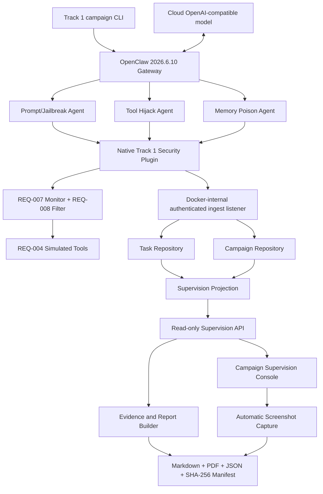

# Spec: REQ-T1-DEMO-010 OpenClaw End-to-End Demo and Evidence Pack

## Document Status

- Requirement: `REQ-T1-DEMO-010`
- Name: OpenClaw-oriented end-to-end demo and report evidence pack
- Status: implemented through Phase 7 automation; credentialed acceptance pending
- Date: `2026-06-30`
- Previous requirement: `REQ-T1-SUPERVISION-UI-009` (accepted)
- Implementation state: Phases 1-6 implemented; Phase 7 T1-T3 implemented;
  T4-T6 blocked at the human credential, cost, and Docker execution gate
- Workflow: `Design -> Test (RED) -> Implement (GREEN) -> Document -> Stop and report`

## Objective

REQ-010 closes the Track 1 outcome loop with a real OpenClaw runtime:

```text
controlled attack case
  -> real OpenClaw agent and cloud model
  -> native security plugin
  -> monitored simulated tool interaction
  -> allow / deny / ask / alert
  -> normalized campaign and session evidence
  -> campaign supervision console
  -> Chinese risk report, bilingual abstract, PDF, screenshots, and JSON manifest
```

The target user is a competition evaluator or security researcher who needs to
verify, without reading engine internals, that:

1. three attack classes are represented by complete adversarial and jailbreak
   case sets;
2. all nine fixed cases run through a real open-source intelligent application;
3. model and tool boundaries are intercepted before simulated side effects;
4. three OpenClaw agents are supervised as one campaign;
5. alerts, questions, and blocks are visible in the platform;
6. the report can be traced back to cases, scripts, policy decisions, sessions,
   screenshots, and cryptographic artifact hashes.

## Track 1 Outcome Alignment

| Contest outcome | REQ-010 evidence |
| --- | --- |
| At least three attack scenarios | `T1-SC-001`, `T1-SC-002`, `T1-SC-003` |
| Adversarial and jailbreak test case sets | all nine files under `samples/track1/cases/`, reproduced in the report appendix |
| Agent attack scripts | existing scenario scripts plus the real OpenClaw campaign runner |
| Open-source intelligent application | exact-version real OpenClaw Gateway |
| Simulated business tools | `send_email`, `read_file`, `write_file`, `call_api` native plugin tools |
| Model call-chain monitoring plugin | native OpenClaw hooks adapted to the REQ-007 monitor boundary |
| Base-model detection/filter prototype | REQ-008 rule provider executing inside the plugin |
| Agent-cluster supervision | three scenario agents correlated by one `campaign_id` |
| Real-time warning/block display | existing polling console extended with campaign summary and agent grouping |
| Security risk analysis report | Chinese Markdown and PDF, bilingual abstract, JSON evidence manifest, screenshots |

## Approved Decisions

The following decisions were confirmed during requirement convergence:

1. The executable target is real OpenClaw only. A compatibility adapter does
   not satisfy REQ-010.
2. The model backend is a configurable cloud OpenAI-compatible service.
3. The integration is a native OpenClaw plugin.
4. All nine existing cases run through the real OpenClaw chain.
5. The campaign contains three scenario agents, one per attack class. There is
   no coordinator agent.
6. Delivery uses Docker Compose and pins OpenClaw to exact version
   `2026.6.10`. Floating tags such as `latest` are prohibited.
7. The operator starts a campaign through a repository CLI. No public API or
   frontend control may start attack execution.
8. The supervision console remains read-only and adds a campaign mode inside
   `/results/sandbox`.
9. Session snapshots enter the backend through an authenticated Docker-internal
   ingest listener that cannot start a campaign, model, agent, or tool.
10. Every case may have at most one audited retry. Both attempts remain in the
    evidence record.
11. Final acceptance requires all nine cases to produce their expected policy
    actions.
12. The report is Chinese with Chinese and English abstracts.
13. The evidence pack contains Markdown, PDF, normalized JSON, SHA-256
    manifest entries, and automatic supervision-console screenshots.
14. One accepted, sanitized baseline evidence pack is committed. Ordinary run
    artifacts are ignored.
15. Fixed research fixtures may appear in full in the report appendix.
    Runtime model outputs, tool values, credentials, and transcripts may not.
16. Testing has two gates:
    - ordinary CI loads the real pinned OpenClaw runtime and plugin without a
      cloud model call;
    - credentialed acceptance executes all nine cases against the cloud model.
17. The OpenClaw plugin executes the existing monitor, rule filter, and
    simulated-tool boundary in process. No policy sidecar is introduced.

## Assumptions

- Docker Engine and Docker Compose v2 are available for the real demo.
- The evaluator supplies an OpenAI-compatible HTTPS endpoint, model ID, and
  API key through environment variables.
- The selected cloud provider accepts the OpenAI-compatible request shape
  supported by OpenClaw `2026.6.10`.
- OpenClaw plugin hooks required by this design are verified at container
  startup before any case executes.
- The backend and frontend remain the existing Node.js and React applications.
- The campaign is an ephemeral evaluation run. Database durability is not
  introduced.
- The fixed nine-case catalog remains the policy oracle. It is not passed into
  the decision provider.
- This specification and requirement switch are documentation exceptions to
  full TDD. All production implementation remains RED-first.

## Existing Assets Reused

| Capability | Existing source | REQ-010 use |
| --- | --- | --- |
| Three scenario definitions | `samples/track1/scenarios/track1-scenarios.v1.json` | agent assignment and report sections |
| Nine fixed cases | `samples/track1/cases/T1-SC-*/` | real OpenClaw prompts/context and appendix |
| Attack scripts | `samples/track1/attack-scripts/T1-SC-*/replay.ts` | controlled reference behavior and report links |
| Simulated tools | `engines/sandbox/src/simulated-tools/` | native OpenClaw tool execution backend |
| Monitor session | `engines/sandbox/src/monitoring/` | model/tool event lifecycle and normalized result |
| Rule filter | `engines/sandbox/src/base-filter/` | real policy decision provider |
| Sandbox contract | `shared/types/sandbox.ts`, `shared/contracts/sandbox.ts` | strict session result validation |
| Supervision read model | `shared/types/supervision.ts`, `shared/contracts/supervision.ts` | existing session views and evidence |
| Supervision backend | `backend/src/modules/supervision/` | session projection and new campaign projection |
| Supervision console | `frontend/src/pages/SandboxAlertsPage.tsx` | campaign mode, grouping, and evidence capture |

REQ-010 must extend these capabilities. It must not replace their established
contracts or create a parallel security engine.

## Architecture



### Ownership

- `integrations/openclaw/` owns OpenClaw-specific manifests, hooks, adapters,
  agent profiles, and campaign orchestration.
- `engines/sandbox/` continues to own monitoring, filtering, simulated tools,
  normalization, and policy behavior.
- `shared/` owns campaign read DTOs and strict public normalizers.
- `backend/supervision` owns ingest validation, campaign storage, projection,
  and read APIs. It does not choose policy actions.
- `frontend/` consumes only public shared DTOs.
- `scripts/` owns operator CLI entrypoints.
- `docs/track1/` and `artifacts/track1/` own report source and generated
  evidence respectively.

### Dependency Direction

```text
OpenClaw plugin -> sandbox engine ports -> shared result contracts
backend -> shared result/campaign contracts
frontend -> shared campaign/session read contracts
report builder -> public normalized API + fixed case catalog
```

Forbidden directions:

```text
frontend -> engines
backend policy logic -> OpenClaw SDK
sandbox engine -> frontend/backend
decision provider -> expected_action or report oracle
```

## Runtime Topology

Docker Compose adds a `track1` profile with these services:

| Service | Responsibility | Published to host |
| --- | --- | --- |
| `openclaw-gateway` | pinned real OpenClaw runtime, three agents, native plugin | no |
| `campaign-runner` | one-shot fixed-manifest campaign orchestration | no |
| `backend` | public read API on `3000`, internal ingest listener on `3001` | `3000` only |
| `frontend` | existing operator console | frontend development/preview port |
| `evidence-capture` | fixed-viewport browser screenshots | no |
| `report-builder` | deterministic Markdown/PDF/manifest generation | no |

The internal ingest port is exposed only on the Compose network. It is not
mapped to the host and is not registered in the public router.

### OpenClaw Version Pin

- Runtime package: `openclaw@2026.6.10`
- Container build must use an exact base-image digest.
- The npm package integrity and resolved OpenClaw package version must be
  recorded in the lockfile and evidence manifest.
- Startup rejects any version other than `2026.6.10`.
- Updating OpenClaw requires a new requirement or an explicit approved spec
  amendment, hook compatibility tests, and a regenerated baseline pack.

## OpenClaw Agent Cluster

The campaign has exactly three configured agents:

| Agent ID | Scenario | Cases |
| --- | --- | --- |
| `agent:track1:prompt-injection` | `T1-SC-001` | `T1-SC-001-C001..C003` |
| `agent:track1:tool-hijack` | `T1-SC-002` | `T1-SC-002-C001..C003` |
| `agent:track1:memory-poison` | `T1-SC-003` | `T1-SC-003-C001..C003` |

The agents share only:

- the immutable campaign manifest hash;
- the native security plugin package;
- the backend ingest endpoint;
- the campaign correlation ID.

They do not share mutable simulated-tool state or raw model transcripts.
Simulated state is isolated by `campaign_id + agent_id + attempt_id`.

### OpenClaw Safety Profile

Each agent profile must:

- allow only the four plugin-registered simulated tools;
- deny built-in shell, process, filesystem write, browser, node, messaging, MCP,
  channel, skill-install, and network tools;
- disable third-party skills and marketplace discovery;
- use an ephemeral tmpfs workspace and session store;
- disable debug transcript logging;
- enable sensitive tool-log redaction;
- accept prompts only from the campaign runner;
- use no external messaging channel.

The only permitted external network destination is the configured cloud model
endpoint. The only permitted internal destination is `backend:3001`.

## Native Security Plugin

The plugin ID is fixed:

```text
agent-security-track1
```

The plugin must register:

- four native tools: `send_email`, `read_file`, `write_file`, `call_api`;
- model input/output hooks;
- `before_tool_call` for synchronous policy evaluation and blocking;
- `after_tool_call` for safe result observation;
- agent/session lifecycle hooks required for campaign correlation.

The implementation must use the supported typed plugin API. Internal
`registerHook` compatibility surfaces are not an acceptable replacement when a
typed runtime hook exists.

### Startup Capability Probe

Before the first model request, the campaign runner requires a runtime probe
that proves:

1. the plugin manifest loads under OpenClaw `2026.6.10`;
2. all four tools are registered exactly once;
3. every required hook is registered;
4. `before_tool_call` can block a probe tool invocation;
5. `after_tool_call` observes an allowed probe invocation;
6. plugin context exposes enough stable correlation data to bind the call to
   the campaign session;
7. OpenClaw reports no duplicate tool owner or plugin diagnostic.

If any probe fails, no attack case runs and the campaign is `failed`.

### Monitor Adaptation

OpenClaw owns model execution, while REQ-007 currently owns callback-oriented
model/tool invocation. REQ-010 therefore adds an engine-private observation
adapter adjacent to `MonitoredSession`.

The adapter must:

- reuse the existing content-boundary, decision-provider, event, result-builder,
  and lifecycle invariants;
- leave existing `MonitoredSession.invokeModel`, `invokeTool`, replay demos, and
  byte-stable outputs unchanged;
- accept split OpenClaw observations for model input/output and tool
  before/after hooks;
- preserve one canonical session event stream;
- reject duplicate, missing, reordered, or cross-session hook observations;
- pass only the existing `MonitorDecisionInput` to the rule provider;
- never pass `expected_action`, attempt outcome, fixture path, or report
  metadata into policy evaluation.

### Tool Decision Sequence

For every tool request:

```text
OpenClaw before_tool_call
  -> normalize safe request context
  -> evaluate REQ-008 policy
  -> append tool_request and policy_decision
  -> ingest acknowledged safe snapshot
  -> deny/ask: block before execution
  -> allow/alert: execute simulated tool
  -> observe safe tool result
  -> ingest next safe snapshot
```

If policy evaluation or pre-execution ingest acknowledgement fails, the plugin
must block the tool and fail the attempt. It may not continue optimistically.

### Simulated Tool Boundary

The native OpenClaw tools are thin adapters over
`engines/sandbox/src/simulated-tools/`.

- `send_email` writes only to an in-memory outbox.
- `read_file` reads only from a campaign-local virtual filesystem.
- `write_file` writes only to that virtual filesystem.
- `call_api` resolves only fixed mock routes.

No adapter may import host filesystem write APIs, email SDKs, generic HTTP
clients, child processes, shell execution, browser automation, or arbitrary
dynamic modules.

Scenario 3 uses plugin-owned ephemeral context/memory state. Its controlled
memory write/read observations map to the existing `memory_write` and
`memory_read` event contracts. No user or host memory store is modified.

## Campaign Manifest

Add one immutable manifest:

```text
samples/track1/openclaw/campaign.v1.json
```

It contains exactly:

- schema version;
- three fixed agent IDs;
- nine fixed scenario/case assignments;
- canonical case file references and SHA-256 hashes;
- expected final policy action for report evaluation;
- maximum attempt count `2`;
- required simulated tools;
- required evidence categories.

The manifest is loaded separately by the campaign runner, backend campaign
validator, and report evaluator. The plugin decision provider receives neither
the manifest nor its expected actions.

Before model invocation, the runner verifies the canonical case hash and
compiles an input-only envelope containing safe correlation IDs plus
`user_prompt`, `retrieved_content`, `memory_entries`, and
`proposed_tool_call`. The complete case document, `expected_outcome`, expected
action, safety oracle, report metadata, and retry history are never passed to
OpenClaw, the cloud model, or the decision provider. The native plugin binds
the envelope's agent/session IDs to the hook context and maps controlled memory
entries to content-free `memory_write` and `memory_read` events.

## Identifiers

All identifiers use closed ASCII grammars and are generated by the campaign
runner, never by the model:

| Field | Grammar |
| --- | --- |
| `campaign_id` | `campaign:t1:<32 lowercase hex>` |
| `agent_id` | one of the three fixed IDs |
| `attempt_id` | `attempt:<case-id-lowercase>:<1|2>` |
| `session_id` | `session:<32 lowercase hex>` |
| `task_id` | `task:<32 lowercase hex>` |
| `snapshot_id` | `snapshot:<32 lowercase hex>` |

Campaign, session, task, and snapshot suffixes are generated with canonical
SHA-256-based primitives. Attempt IDs are the fixed case ID plus attempt index
and are scoped by campaign correlation. No ID may contain model output, fixture
content, provider request IDs, timestamps, or secrets.

## Campaign State Model

```text
created -> validating -> running -> collecting -> completed
                    \-> failed
running ------------\-> failed
collecting ---------\-> failed
```

Terminal states are immutable.

### Completion Invariants

A campaign is `completed` only when:

- exactly three known agents exist;
- exactly nine known cases have a final attempt;
- each case has one or two attempts;
- every final attempt has a terminal normalized sandbox result;
- each final result's derived action equals the manifest oracle;
- all deny decisions correlate to blocked records;
- all alert decisions correlate to alert records;
- all expected tool requests were intercepted;
- no real-side-effect detector fired;
- campaign detail and all nine session evidence exports normalize.

Any invariant failure makes the campaign `failed`. A failed campaign can
produce a diagnostic manifest but cannot produce or overwrite the accepted
report.

Report generation is a separate post-completion pipeline. A completed campaign
remains completed if artifact generation later fails, but
`evidence_available` remains `false`, the campaign command exits non-zero, and
REQ-010 acceptance fails. Successful evidence registration is append-only and
does not mutate the terminal campaign result.

### Retry Semantics

- Maximum attempts per case: `2`.
- Retry is allowed only after provider transport failure, invalid model
  protocol/output, missing expected tool request, or derived action mismatch.
- Retry occurs with a fresh OpenClaw session and fresh simulated state.
- Attempt 1 is never deleted, replaced, hidden, or reclassified.
- The report identifies retry count and both attempt outcomes.
- The final case result comes from the last valid attempt only.
- A second failure is terminal for the campaign.

## Internal Ingest Contract

### Listener

```text
http://backend:3001
```

The listener is available only on the Docker network.

### Authentication

- `Authorization: Bearer <TRACK1_INGEST_TOKEN>`
- token length: at least 32 random bytes;
- constant-time comparison;
- token is never returned, logged, hashed into evidence, or written to reports;
- missing or invalid credentials return a fixed `401` response.

### Endpoints

```text
POST /internal/track1/campaigns
PUT  /internal/track1/campaigns/:campaignId/snapshots/:sequence
POST /internal/track1/campaigns/:campaignId/finalize
POST /internal/track1/campaigns/:campaignId/evidence
```

These routes ingest lifecycle and result evidence only. They cannot launch or
retry agents, invoke models, execute tools, install plugins, or mutate policy.
The evidence endpoint accepts only a normalized artifact manifest hash and
safe artifact references after the campaign is completed. It cannot change
case, attempt, session, decision, or campaign status records.

### Snapshot Envelope

```ts
interface Track1CampaignSnapshotEnvelope {
  schema_version: "track1-campaign-snapshot.v1";
  campaign_id: string;
  campaign_manifest_sha256: string;
  agent_id: string;
  scenario_id: string;
  case_id: string;
  attempt_id: string;
  attempt_index: 1 | 2;
  sequence: number;
  previous_snapshot_sha256: string | null;
  snapshot_sha256: string;
  observed_at: string;
  result: BaseResult<SandboxRunResultDetails>;
}
```

Runtime normalization must enforce:

- exact object keys;
- exact schema version;
- canonical IDs and known campaign assignments;
- real calendar timestamps;
- non-negative strictly increasing sequence;
- matching prior hash;
- canonical JSON SHA-256 recomputation, where `snapshot_sha256` is calculated
  over the exact normalized envelope with the `snapshot_sha256` field omitted;
- snapshot body limit of 2 MiB and lifecycle/evidence body limit of 256 KiB;
- idempotent duplicate acceptance only for byte-identical snapshots;
- rejection of unknown fields and content-bearing keys;
- `normalizeBaseResult` and sandbox contract success;
- task, session, scenario, case, agent, attempt, and campaign correlation;
- monotonic lifecycle and event growth;
- no mutation of an already terminal attempt.

The backend constructs task and risk-summary records from normalized input. It
does not accept client-supplied risk counters or campaign aggregate metrics.

## Campaign Storage and Projection

Add an in-memory `CampaignRepository` separate from `TaskRepository`.

- `TaskRepository` continues to store normalized task/result/risk records.
- `CampaignRepository` stores campaign lifecycle, fixed associations, attempt
  references, sequence/hash heads, and safe aggregate counters.
- Neither repository stores raw prompts, model outputs, tool values, memory
  values, credentials, or provider errors.
- Backend restart loses active campaign state. Durable campaign execution is
  outside this requirement.

Campaign projection recomputes all counts from stored normalized attempts. It
must reject partial or conflicting records instead of returning a best-effort
view.

## Shared Campaign Read Contracts

Existing session DTOs remain unchanged.

Add strict, exact-key campaign DTOs:

- `Track1CampaignSummary`
- `Track1CampaignAgentSummary`
- `Track1CampaignCaseSummary`
- `Track1CampaignAttemptSummary`
- `Track1CampaignSessionRef`
- `Track1CampaignDetail`
- `Track1CampaignEvidenceExport`

Minimum summary fields:

```ts
interface Track1CampaignSummary {
  schema_version: "track1-campaign-read.v1";
  campaign_id: string;
  status: "created" | "validating" | "running" | "collecting" | "completed" | "failed";
  started_at: string;
  updated_at: string;
  completed_at?: string;
  agent_count: 3;
  case_count: 9;
  passed_case_count: number;
  failed_case_count: number;
  retry_count: number;
  alert_count: number;
  blocked_count: number;
  ask_count: number;
  evidence_available: boolean;
}
```

The detail groups cases by fixed agent order and exposes only session IDs and
safe summaries. It does not embed raw OpenClaw transcripts.

## Public Read API

Add these read-only supervision routes on the public listener:

```text
GET /api/supervision/campaigns
GET /api/supervision/campaigns/:campaignId
GET /api/supervision/campaigns/:campaignId/evidence
```

Rules:

- list order is `updated_at desc`, then `campaign_id asc`;
- list default and maximum are both 50 campaigns;
- supported list filters are exactly `q`, `status`, `scenario_id`, and
  `agent_id`, serialized in that order;
- unknown filters are rejected;
- malformed identifiers are rejected;
- incomplete or invalid stored records return a stable error, not partial data;
- evidence output has exact keys and deterministic ordering;
- campaign evidence returns `409 CAMPAIGN_EVIDENCE_NOT_READY` until a
  completed campaign has registered a valid artifact manifest;
- the public listener returns `404` for every `/internal/track1/*` path.

Existing session routes remain backward compatible.

## Supervision Console Campaign Mode

The existing `/results/sandbox` route remains the single supervision
workbench.

### URL State

Add:

```text
campaign_id=<safe-id>
agent_id=<fixed-agent-id>
```

Existing `session_id` and filter parameters remain supported.

### Layout

When `campaign_id` is present:

1. show campaign status and 9-case progress in the existing header band;
2. show aggregate alert, block, ask, retry, and completion counts;
3. group the session list into the three fixed agents;
4. show each agent's three cases and attempt state;
5. keep the existing session inspector and seven-event timeline;
6. preserve deep links to a selected session;
7. display stale and retry-read behavior consistently with REQ-009;
8. remain read-only.

No start, retry, approve, reject, cancel, policy-edit, or acknowledge command is
added to the frontend.

### Responsive Behavior

- Wide desktop: campaign summary, grouped list, and inspector remain visible.
- Narrow desktop/tablet: grouped list and inspector use the existing
  one-panel-at-a-time behavior.
- Mobile: campaign summary is compact, text wraps, and the back button
  preserves `campaign_id`, `agent_id`, and `session_id`.
- No page or panel may horizontally overflow at 390, 1024, or 1440 pixels.

## Campaign Runner

The operator entrypoint is:

```text
npm run demo:track1:openclaw
```

The runner:

1. validates Docker, environment, OpenClaw version, plugin probe, backend
   health, and manifest hashes;
2. creates one campaign record;
3. executes three agents in fixed scenario order;
4. executes each agent's cases in fixed case-ID order;
5. applies the one-retry policy;
6. waits for normalized snapshot acknowledgement;
7. finalizes the campaign;
8. triggers evidence capture and report generation only after successful
   completion;
9. registers the normalized evidence manifest;
10. prints only safe progress and final artifact references.

The runner accepts no arbitrary case path, plugin path, model URL, tool target,
report output path, or shell command argument. Environment configuration is
validated before execution.

## Cloud Model Configuration

Required environment variables:

```text
OPENCLAW_MODEL_BASE_URL
OPENCLAW_MODEL_API_KEY
OPENCLAW_MODEL_ID
TRACK1_INGEST_TOKEN
```

Rules:

- base URL must be HTTPS and must not contain credentials;
- model ID uses a closed safe string grammar;
- API key and ingest token are required for the real demo command and the
  credentialed E2E gate;
- `.env`, `.env.local`, credential files, and generated OpenClaw state are
  ignored;
- errors use stable codes and must not include response bodies, headers, URLs
  with query strings, or provider exception messages;
- there is no local or fake model fallback in the real campaign command.

## Content Boundary

### Allowed Full Content

The report appendix may reproduce only canonical controlled fixture content
already committed under:

```text
samples/track1/cases/
```

This is required to prove delivery of adversarial samples and jailbreak test
cases.

### Runtime Content Rules

Raw runtime values may exist only transiently in memory or tmpfs while
OpenClaw and the plugin process a call.

The following must never enter backend storage, public APIs, logs,
screenshots, JSON evidence, manifests, or generated report sections outside
the canonical fixture appendix:

- cloud model raw input/output;
- chain-of-thought or reasoning;
- tool argument values and tool result values;
- memory content;
- provider response bodies;
- credentials, tokens, cookies, or authorization headers;
- arbitrary exception messages;
- host-persisted or exported OpenClaw transcripts.

Only approved hashes, safe references, event types, policy actions, stable
summaries, counts, and correlation IDs cross the plugin boundary.

## Evidence Pack

### Runtime Output

Ordinary generated artifacts live under:

```text
artifacts/track1/<campaign-id>/
```

This directory is ignored by git.

### Committed Baseline

One accepted baseline is committed under:

```text
docs/track1/evidence/openclaw-baseline/
  security-risk-analysis.md
  security-risk-analysis.pdf
  manifest.json
  campaign.json
  screenshots/
    campaign-running.png
    campaign-overview.png
    scenario-1-prompt-injection.png
    scenario-2-tool-hijack.png
    scenario-3-memory-poisoning.png
```

### Manifest

The manifest contains exact keys for:

- schema version;
- campaign ID and manifest hash;
- OpenClaw version and package integrity;
- model reference without credentials;
- three-agent and nine-case coverage;
- final expected/actual action matrix;
- all attempt outcomes and retry count;
- artifact path, media type, byte length, and SHA-256;
- report generation version;
- campaign completion timestamp.

All metrics are recomputed from normalized evidence. Caller-provided counts are
not trusted.

### Screenshots

Screenshot capture:

- captures one running-state checkpoint after the first accepted case;
- captures the terminal overview and scenario inspections after completion;
- uses fixed viewport, locale, timezone, route, and data snapshot;
- captures one representative inspected session for each scenario;
- waits for explicit fresh/complete UI state rather than fixed sleeps;
- fails if stale, mock, fallback, loading, or error banners are visible;
- verifies no horizontal overflow and no raw-content sentinel;
- writes PNG files before manifest hashing.

## Security Risk Report

The report source is generated Markdown. PDF is produced from that source by a
pinned report-builder container with fixed fonts and reproducible metadata.

Required sections:

1. Chinese abstract
2. English abstract
3. scope, authorization, and safe research boundary
4. system architecture and OpenClaw integration
5. threat model
6. methodology and campaign environment
7. Scenario 1: prompt injection and jailbreak
8. Scenario 2: tool-call hijacking
9. Scenario 3: context and memory poisoning
10. nine-case expected/actual action matrix
11. per-scenario findings and screenshots
12. retry and failure analysis
13. behavior-supervision prototype evaluation
14. base-filter evaluation
15. limitations and residual risks
16. reproduction commands
17. artifact manifest references
18. appendix with all nine canonical fixture cases and script references

The builder refuses to issue a passing report for incomplete or failed
campaigns.

Given byte-identical normalized inputs and screenshots, Markdown, canonical
JSON, and PDF outputs must be byte-identical. PDF metadata uses the campaign
completion timestamp rather than the current clock.

## Commands

The planned command surface is:

```powershell
# Install repository dependencies
corepack pnpm install --frozen-lockfile

# Build the pinned Track 1 environment
docker compose -f deploy/track1/compose.track1.yml --profile track1 build

# Start real OpenClaw, backend, and frontend
docker compose -f deploy/track1/compose.track1.yml --profile track1 `
  up -d openclaw-gateway backend frontend

# Verify the native plugin in the real runtime
docker compose -f deploy/track1/compose.track1.yml --profile track1 `
  run --rm openclaw-gateway `
  openclaw plugins inspect agent-security-track1 --runtime --json

# Run the nine-case credentialed campaign
npm run demo:track1:openclaw

# Rebuild a report for one normalized completed campaign
npm run report:track1 -- --campaign-id campaign:t1:<32-lowercase-hex>

# Ordinary offline gates
npm run test:track1:openclaw
npm run test:repo
npm run test:shared
npm run test:engine:sandbox
npm run test:backend
npm run test:frontend

# Credentialed real OpenClaw/cloud-model gate
npm run test:track1:openclaw:e2e
```

The implementation plan may add command wrappers, but it may not weaken the
exact-version, fixed-manifest, safe-argument, or credential boundaries.

## Planned Project Structure

```text
integrations/openclaw/
  package.json
  openclaw.plugin.json
  src/
    index.ts
    plugin.ts
    campaign-context.ts
    monitoring-adapter.ts
    tool-adapters.ts
    ingest-client.ts
  config/
    agents.json5
    openclaw.json5
  tests/
    plugin-contract.spec.ts
    plugin-runtime.spec.ts
    plugin-tool-boundary.spec.ts

samples/track1/openclaw/
  campaign.v1.json

backend/src/modules/supervision/
  campaign-ingest.controller.ts
  campaign-ingest.service.ts
  campaign-projector.ts
  repositories/
    campaign.repository.ts
    in-memory-campaign.repository.ts

shared/types/
  campaign-supervision.ts
shared/contracts/
  campaign-supervision.ts

frontend/src/components/supervision/
  CampaignOverviewHeader.tsx
  CampaignAgentGroup.tsx
frontend/src/services/
  campaign-supervision-service.ts

scripts/track1/
  run-openclaw-campaign.ts
  capture-openclaw-evidence.ts
  build-security-risk-report.ts

deploy/track1/
  Dockerfile.openclaw
  Dockerfile.report
  compose.track1.yml

docs/track1/
  security-risk-analysis-template.md
  evidence/openclaw-baseline/

package.json
pnpm-workspace.yaml
.gitignore
```

The final implementation plan must keep each task to a focused file set and
may refine filenames while preserving ownership. `pnpm-workspace.yaml` must
add the OpenClaw integration package without changing existing workspace
membership. Root scripts and generated-artifact ignore rules are updated in
`package.json` and `.gitignore`.

## Code Style

Contracts use explicit discriminants, exact-key runtime normalizers, and
defensive copies.

> **Implementation note (Phase 1 contracts rework):** The original spec
> referenced `Track1CampaignSessionRef` with `task_status: TaskStatus` and
> `risk_level: RiskLevel`. These types did not exist in the shared type layer.
> The implementation replaces `Track1CampaignSessionRef` with
> `Track1CampaignAttemptSummary`, which carries `status:
> Track1CampaignCaseStatus`, `task_id`, `started_at`, and `updated_at` instead.
> This avoids introducing unused `TaskStatus`/`RiskLevel` enums and aligns the
> session-level record with the existing case/attempt status hierarchy. The
> normalizer is `normalizeTrack1CampaignAttempt` (private, called from
> `normalizeTrack1CampaignCaseDetail`).

```ts
export interface Track1CampaignAttemptSummary {
  campaign_id: string;
  agent_id: Track1CampaignAgentId;
  scenario_id: Track1ScenarioId;
  case_id: Track1CaseId;
  attempt_id: string;
  attempt_index: 1 | 2;
  session_id: string;
  task_id: string;
  status: Track1CampaignCaseStatus;
  actual_action: SandboxPolicyAction | null;
  started_at: string;
  updated_at: string;
}
```

Rules:

- public types use repository naming conventions and closed unions;
- runtime code never uses `any` at trust boundaries;
- switch statements over event/record discriminants are exhaustive;
- errors expose stable codes and fixed safe summaries;
- comments explain non-obvious security invariants only;
- no generic object renderer or serializer is used for user-visible evidence;
- no policy decision is based on case ID or expected action.

## Testing Strategy

Implementation follows strict TDD for every production behavior.

### Shared Contract Tests

Prove:

- exact campaign DTO key sets;
- closed identifiers and enums;
- real calendar timestamps;
- defensive copies and recursive freezing where required;
- count and association invariants;
- attempt limits and terminal-state rules;
- rejection of raw-content and unknown-field sentinels;
- deterministic campaign evidence normalization.

### Plugin Tests

Prove:

- manifest identity and OpenClaw version pin;
- plugin loads in the real OpenClaw `2026.6.10` runtime;
- four and only four simulated tools register;
- required hooks fire;
- `before_tool_call` blocks before execution;
- allowed/alert tool requests reach only simulated state;
- ask/deny tool requests produce no tool side effect;
- model/tool content does not survive serialization;
- hook reordering, duplication, missing correlation, and cross-session data fail
  closed;
- policy provider never sees oracle fields;
- existing REQ-007 and REQ-008 demos remain byte-identical.

### Ingest Tests

Prove:

- public listener cannot access internal routes;
- authentication and body limits;
- exact snapshot normalizer;
- hash-chain, sequence, and idempotency behavior;
- cross-campaign/agent/case/attempt conflicts are rejected;
- terminal snapshots are immutable;
- repository updates are atomic;
- malformed or content-bearing snapshots do not create partial records;
- aggregate counters are recomputed.

### Campaign Runner Tests

Prove:

- fixed three-agent/nine-case order;
- preflight stops before any model call on failure;
- no more than one retry;
- first-attempt evidence remains visible;
- second failure terminates the campaign;
- report generation does not run for failed campaigns;
- logs and stderr contain no injected sentinel;
- arbitrary paths, cases, endpoints, and commands are rejected.

### Frontend Tests

Prove:

- campaign query state and deep links;
- three agent groups and nine case rows;
- aggregate counts and retry display;
- reuse of existing session inspector;
- stale, error, loading, empty, failed, and completed states;
- read-only behavior;
- mobile panel switching and URL preservation;
- keyboard access;
- no raw-content rendering;
- no layout overflow at required viewports.

### Report and Evidence Tests

Prove:

- failed/incomplete campaign rejection;
- exact metrics derived from normalized evidence;
- exact fixture appendix coverage;
- required Chinese and English abstracts;
- five screenshot presence and hashes;
- manifest exact keys, stable order, byte lengths, and SHA-256;
- no secrets or runtime raw content;
- deterministic Markdown, JSON, and PDF for fixed inputs.

### Repository Gates

Add permanent checks for:

- exact OpenClaw version and immutable container pins;
- no `latest` tag;
- no real email/filesystem/network/process implementation in plugin tools;
- no frontend engine import;
- no public campaign-start endpoint;
- no internal ingest route on the public listener;
- no credential files or generated OpenClaw state;
- registered test scripts and root gate coverage;
- baseline evidence pack completeness and hash consistency.

### Credentialed E2E Gate

The real acceptance gate must:

1. start Docker Compose from a clean state;
2. verify OpenClaw and plugin runtime probes;
3. execute all nine cases against the configured cloud model;
4. permit at most one retry per case;
5. require final exact-action accuracy `9/9`;
6. verify three agents and all correlation links;
7. verify no real side effects;
8. capture the running checkpoint and four terminal screenshots;
9. generate and normalize the report pack;
10. verify every manifest hash;
11. run a raw-content and secret sentinel scan whose only raw-fixture allowlist
    is the exact canonical report appendix generated from the nine committed
    case files;
12. exit non-zero on any deviation.

The credentialed gate is not silently skipped when explicitly invoked.

## Documentation Updates Required After Implementation

At completion, inspect and update:

- `README.md`
- `metadata.md` if the new integration package changes stable project metadata
- `docs/architecture.md`
- `docs/api-contract.md`
- `docs/progress.md`
- `docs/track1/security-risk-analysis-template.md`
- OpenClaw setup and safe credential instructions
- baseline evidence pack provenance

Documentation must distinguish planned, tested, credentialed, and baseline
evidence. It must not describe mock-only checks as real OpenClaw execution.

## Boundaries

### Always

- use real pinned OpenClaw for plugin runtime and E2E evidence;
- use the existing engine contracts and policy provider;
- validate at every trust boundary;
- block before simulated side effects;
- preserve all attempts;
- recompute metrics;
- keep public evidence content-free;
- record exact commands and versions;
- use TDD;
- stop after REQ-010.

### Ask First

- change the pinned OpenClaw version;
- add another model provider protocol;
- add another agent or scenario;
- add a database;
- expose internal ingest outside the Compose network;
- add a public write API;
- change case or expected-action oracles;
- permit any new OpenClaw tool.

### Never

- target a third-party system;
- send real email;
- read or write host user files;
- call a real business API from simulated tools;
- expose credentials or raw runtime content;
- enable shell, browser, MCP, external channels, or marketplace skills for the
  campaign agents;
- retry more than once;
- delete failed-attempt evidence;
- mark a partial campaign complete;
- let the model select case IDs, report paths, endpoints, or policy oracles;
- let frontend or backend choose policy actions;
- use a compatibility adapter as proof of real OpenClaw execution.

## Explicit Non-Goals

- production multi-tenant OpenClaw hosting;
- durable campaign persistence;
- arbitrary user-authored attacks;
- policy or rule editing;
- alert acknowledgement or approval workflow;
- remote campaign start;
- live external email, filesystem, browser, shell, MCP, or API integrations;
- SSE, WebSocket, message queue, or distributed tracing backend;
- coordinator-agent orchestration;
- more than three agents or nine cases;
- model quality benchmarking beyond expected policy-action outcomes;
- automatic submission to a competition portal;
- OpenClaw upgrade support beyond the pinned version.

## Risks and Mitigations

| Risk | Mitigation |
| --- | --- |
| OpenClaw hook behavior drifts | exact version pin, startup capability probe, runtime gate |
| Cloud model is nondeterministic | fixed cases, closed oracle, one audited retry, 9/9 final requirement |
| Plugin hook observes data too late | require blocking `before_tool_call`; reject unsupported runtime |
| Cloud/model content leaks through logs | tmpfs state, no debug transcripts, sensitive logging redaction, sentinel scans |
| Ingest endpoint becomes an execution surface | separate internal listener, ingest-only DTOs, no execution ports |
| Snapshot replay or reordering corrupts evidence | sequence, hash chain, idempotency, terminal immutability |
| Agent states contaminate one another | state keyed by campaign/agent/attempt and reset per attempt |
| Report trusts caller metrics | recompute all metrics from normalized records |
| Failed retry disappears | append-only attempt references and report disclosure |
| Screenshots show fallback/mock data | capture gate rejects stale, mock, loading, or error states |
| Committed PDF cannot be reproduced | pinned builder, fixed fonts, canonical inputs, `SOURCE_DATE_EPOCH` semantics |
| Docker environment can reach unwanted services | deny OpenClaw tools, fixed model endpoint, no generic network client in plugin |
| Existing contracts regress | focused tests plus full shared, sandbox, backend, frontend, and repository gates |

## Success Criteria

REQ-010 is complete only when all conditions are true:

1. OpenClaw `2026.6.10` starts from the pinned Docker build.
2. The native plugin passes its runtime capability probe.
3. Three fixed OpenClaw agents are correlated under one campaign.
4. All nine fixed cases execute through the real cloud-model/OpenClaw chain.
5. Every tool request is intercepted before simulated execution.
6. No real business side effect occurs.
7. Final expected/actual policy actions match for all nine cases.
8. No case uses more than two attempts.
9. Every failed first attempt remains visible and reportable.
10. Backend ingest rejects malformed, unauthenticated, reordered,
    cross-correlated, duplicate-conflicting, and content-bearing snapshots.
11. Existing single-session supervision APIs remain compatible.
12. Campaign read DTOs and APIs are strict, deterministic, and content-free.
13. `/results/sandbox` displays campaign progress, three agent groups, nine
    cases, retries, alerts, asks, blocks, and selected session timelines.
14. The frontend remains read-only and responsive.
15. Automatic capture produces one running campaign checkpoint, the terminal
    campaign overview, and three scenario screenshots from fresh API data.
16. The Chinese Markdown report, bilingual abstracts, PDF, JSON evidence, and
    manifest are generated successfully.
17. The appendix includes all nine controlled test fixtures and script
    references.
18. Every committed baseline artifact matches its manifest SHA-256 and byte
    length.
19. Runtime outputs, APIs, screenshots, report evidence, logs, and errors
    contain no credentials or prohibited raw runtime content.
20. Ordinary offline gates and credentialed real E2E gates pass.
21. Required documentation is updated.
22. Implementation stops and reports; no new requirement begins.

## Open Questions

None. Product, architecture, runtime, model, plugin, campaign, retry, ingest,
UI, report, evidence, security, and test-gate decisions are fixed by this
specification.

## References

- [OpenClaw documentation](https://docs.openclaw.ai/)
- [OpenClaw plugin documentation](https://docs.openclaw.ai/plugins)
- [OpenClaw plugin hooks](https://docs.openclaw.ai/plugins/hooks)
- [OpenClaw Docker installation](https://docs.openclaw.ai/install/docker)
- [OpenClaw security guidance](https://docs.openclaw.ai/gateway/security)
- [OpenClaw npm package 2026.6.10](https://www.npmjs.com/package/openclaw/v/2026.6.10)
