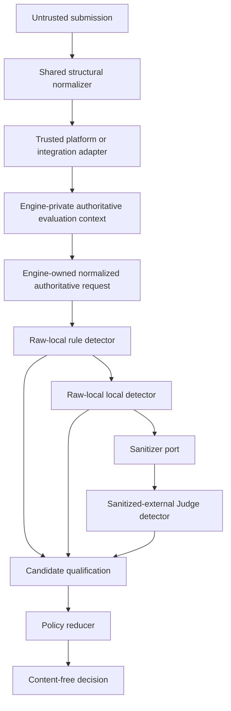

# Design: General-Purpose Sandbox Security Evaluation

## Document Status

- Umbrella feature: `SANDBOX-GENERAL-SECURITY`
- Status: ready for implementation plan
- Review revision: 2
- Original date: `2026-07-10`
- Revised: `2026-07-11`
- Extends: `REQ-T1-BASE-FILTER-008`, `REQ-T1-MONITOR-PLUGIN-007`, and
  `REQ-T1-DEMO-010`
- Delivery model: five independently specified and accepted requirements
- Workflow: `Design -> Test (RED) -> Implement (GREEN) -> Document -> Stop`

This revision changes documentation only. It does not change production code,
tests, dependencies, or the active sprint.

## Objective

Build a reusable sandbox security engine that evaluates bounded text and
structured Agent activity at three enforcement stages:

```text
user_input -> model_output -> tool_request
```

The engine reports evidence of Agent-system risk and selects a policy action.
It does not depend on the Track 1 campaign, nine case IDs, four simulated
tools, benchmark labels, or an expected-action oracle.

The evidence-bounded verdicts are:

- `no_detected_risk`: configured detection completed without an accepted risk
  finding; this is not proof that the input is safe;
- `risk_detected`: at least one qualified risk finding was accepted;
- `indeterminate`: required evidence could not be resolved.

The separate policy action is `allow`, `alert`, `ask`, or `deny`. A detector
never selects the final action.

## Confirmed Product Decisions

1. The feature covers user input, model output, and arbitrary tool requests.
2. Detection is a cascade of deterministic rules, a local classifier, and an
   optional external Judge.
3. Detector candidates are qualified through detector-specific profile
   thresholds before they become findings.
4. Failure fails closed by stage: user input and model output use at least
   `ask`; tool requests use `deny`.
5. Inputs are bounded UTF-8 text and JSON. Binary and multimodal extraction are
   outside this feature.
6. Scope is Agent-system security, not general content moderation.
7. External Judge code cannot receive the raw detector snapshot through its
   TypeScript port. It receives only an exact-key sanitized payload.
8. Engine decisions and application-controlled durable records do not contain
   raw content or matched snippets.
9. Synchronous decisions may be copied to content-free asynchronous audit,
   which cannot re-run detection or rewrite an enforced action.
10. The first benchmark version contains exactly 300 samples.
11. Generic contracts are added beside existing Track 1 contracts.
12. Trust is derived only from adapter-authenticated source authority and an
    immutable profile. Caller claims and provenance references confer no
    trust.
13. The built-in profiles are `sandbox-security-balanced.v1` and
    `sandbox-security-strict.v1`; callers cannot submit or edit profiles.
14. The complete engine-owned canonical evaluation request is limited to 512
    KiB, with tighter field and structural limits.
15. The total synchronous budget is 5000 ms from engine entry.
16. Scores from different detectors are never averaged.
17. The backend authorizer, API, idempotency store, and durable audit belong to
    GENERAL-003.

## Scope Decomposition

| Requirement | Deliverable | Depends on |
| --- | --- | --- |
| `REQ-SBX-GENERAL-001` | Structural contracts, source-authority boundary, canonical input boundary, detector ports, complete built-in profiles, pipeline, reducer, and compatibility adapters | existing sandbox contracts |
| `REQ-SBX-GENERAL-002` | Production rule detector, local-model adapter, sanitizer, external-Judge adapter, and benchmark fixtures | GENERAL-001 |
| `REQ-SBX-GENERAL-003` | Authenticated backend API, HTTP limits, authorizer, idempotency, and content-free durable audit | GENERAL-001 and GENERAL-002 |
| `REQ-SBX-GENERAL-004` | OpenClaw pre-model, model-output, arbitrary-tool, and outbound-delivery enforcement | GENERAL-001 through GENERAL-003 |
| `REQ-SBX-GENERAL-005` | Frontend evaluation workbench, audit view, and end-to-end acceptance | GENERAL-001 through GENERAL-004 |

Only one requirement may be active in `docs/sprint-current.md` at a time. Each
requirement receives a separate spec, RED-first plan, review, and acceptance.

## Architecture and Trust Boundaries



There are two explicit boundaries:

1. The public submission boundary is untrusted. `claimed_source_type`,
   `provenance_ref`, IDs, profile ID, and content are claims only.
2. A trusted platform or integration adapter validates the submission and
   reconstructs an engine-private authoritative evaluation context containing
   mode, stage, profile, complete source observations, and the actual tool
   observation when applicable. The engine derives trust from this context and
   the selected built-in profile.

The engine does not expose a public constructor for authoritative contexts.
This is a trusted in-process boundary, not a cryptographic boundary. Later
backend and OpenClaw adapters may construct authoritative contexts without
changing the public decision contract.

`provenance_ref` is an opaque correlation hint. Its scheme or value never
creates `control` trust. A claim of `system_instruction` or
`developer_instruction` receives `control` only when a trusted adapter
reconstructs that source from platform-owned state. An ordinary caller claim
is rejected rather than upgraded or silently trusted.

### Ownership

- `shared/` owns public submission and decision shapes plus structural
  exact-key normalizers. It does not import profiles or engine logic.
- `engines/sandbox/src/security/` owns authoritative contexts, canonicalization,
  trust derivation, detector ports, manifests, candidate qualification,
  the engine semantic validator, policy reduction, and adapters.
- `backend/` owns HTTP parsing, authentication, authorization, body limits,
  idempotency, durable audit, and engine invocation.
- `integrations/openclaw/` owns hook observations, authoritative source
  reconstruction, and action enforcement.
- `frontend/` owns input authoring and safe display. It does not import engine
  modules.

### Dependency Direction

```text
frontend -> backend API -> shared structural contracts
backend/OpenClaw trusted adapter -> sandbox security engine
sandbox security engine -> shared structural contracts
sandbox security engine -> injected detector and sanitizer ports
```

Forbidden directions include `shared -> engine`, `reducer -> raw content`,
`external Judge -> raw snapshot`, and adapters duplicating policy reduction.

## Public and Engine-Private Contracts

The public request uses `claimed_source_type` to make its authority explicit:

```ts
interface SandboxSecurityRequest {
  schema_version: "sandbox-security-request.v1";
  request_id: string;
  stage: "user_input" | "model_output" | "tool_request";
  policy_profile_id:
    | "sandbox-security-balanced.v1"
    | "sandbox-security-strict.v1";
  content_items: SandboxSecuritySubmittedContentItem[];
  tool_request?: SandboxSecurityToolRequest;
}
```

Shared normalization validates shape, exact keys, primitive ranges, unions,
safe identifiers, and structural limits. It does not derive trust or validate
profile/run/action consistency.

The trusted adapter creates a `SandboxSecurityAuthoritativeEvaluationContext`.
Each `AuthenticatedSourceObservation` contains source ID, authority kind,
authoritative source type, media type, the actual authoritative value, and
provenance. The optional `AuthenticatedToolObservation` contains the actual
call ID, tool name, target, and arguments. The context also fixes stage,
profile, and one mode:

- `simulation`: a trusted backend reconstructs the user's explicit workbench
  scenario; it is labelled simulation and is not represented as a platform
  observation;
- `enforcement`: a trusted integration reconstructs stage, configured profile,
  sources, and tool call from actual runtime/hook state.

The engine detects only authoritative observation values. Public values are
never promoted merely because their source IDs match. Public and authoritative
stage, profile, ordered source fields/values, and tool fields must match
exactly after structural normalization or the engine rejects
`sandbox_security_authority_mismatch`. An enforcement caller cannot select a
different stage or a less restrictive profile through public fields.

The returned `SandboxSecurityDecision` contains qualified findings and run
summaries and labels `evaluation_mode` as `simulation` or `enforcement`.
Finding locators use engine-issued source/call tokens rather than
caller-controlled source/call IDs. The decision contains no raw value, sanitized
value, ordinary content hash, provider message, or free-form reason text.

## Source and Stage Invariants

The authoritative source matrix is fixed:

| Stage | Required sources | Allowed additional sources | Forbidden | Tool object |
| --- | --- | --- | --- | --- |
| `user_input` | exactly one `user_input` | at most one each `system_instruction`, `developer_instruction`; at most 32 each `retrieved_content`, `memory_content` | `model_output` | absent |
| `model_output` | exactly one `model_output` | at most one each `system_instruction`, `developer_instruction`, historical `user_input`; at most 32 each `retrieved_content`, `memory_content` | none beyond the closed list | absent |
| `tool_request` | exactly one `model_output` | at most one each `system_instruction`, `developer_instruction`, historical `user_input`; at most 32 each `retrieved_content`, `memory_content` | none beyond the closed list | exactly one |

`content_items` is never empty, source IDs are unique, and the total remains at
most 64. A structural mismatch is `sandbox_security_stage_invalid`; an invalid
authority pair is `sandbox_security_source_authority_invalid`; a public/context
semantic mismatch is `sandbox_security_authority_mismatch`.

## Risk Taxonomy and Finding Qualification

The closed risk taxonomy is:

- `prompt_injection`
- `jailbreak`
- `instruction_override`
- `privilege_escalation`
- `sensitive_data_exposure`
- `tool_hijacking`
- `unsafe_side_effect`
- `memory_poisoning`
- `trust_boundary_violation`

The pipeline has four distinct states:

```text
detector candidate
  -> profile threshold qualification
  -> accepted normalized finding
  -> policy reduction
```

- A detector returns exact-key candidates and optional category clearances,
  not actions. Candidate subjects can reference an engine-private content
  handle or tool-call handle; detectors cannot supply public tokens.
- A risk candidate becomes a finding only when its confidence is at or above
  that slot's qualification threshold.
- Candidate severity never bypasses its confidence threshold.
- A candidate below the qualification threshold but at or above the routing
  floor is temporary low-confidence routing evidence. It is not returned.
- A candidate below the routing floor is discarded.
- An unresolved escalation signal exists after local detection when a retained
  low-confidence risk candidate has no accepted finding for the same
  subject/category. A qualified clearance for that scope records detector
  disagreement but does not erase the signal.
- An accepted finding followed by a clearance remains accepted and does not by
  itself route Judge. Severity disagreement between accepted findings is
  reduced by highest severity and does not trigger voting.
- An unresolved escalation signal routes Judge. Once selected, Judge is
  runtime-required for the evaluation.
- Only accepted risk findings can produce `risk_detected`.
- External Judge is escalation-only, not an adjudicator. It can add or raise
  risk evidence but cannot suppress, downgrade, or delete an accepted finding.
- For every routed signal, a qualified Judge risk accepts a finding and a
  qualified matching Judge clearance resolves that signal without a finding.
  A Judge no-match, low-confidence response, or incomplete scope leaves the
  signal unresolved and therefore fails closed. Clearance is not proof of
  safety.
- `risk_detected` can never map to `allow`.

Detector identity comes from the registered profile slot. The engine ignores
or rejects detector-supplied identity and generates finding IDs
deterministically from `decision_id` and normalized non-content candidate
fields. IDs are stable only within one decision and are not durable-audit data.

### Finding Subjects

Public findings use a closed subject union:

- content subject: engine-issued `source_token` plus `whole_source`, exact
  original UTF-8 byte range, or restricted JSON pointer;
- tool subject: engine-issued `call_token` plus `whole_call`, `tool_name`,
  `target`, or `arguments`; only arguments may carry a restricted JSON pointer.

Tool name and target are whole-field subjects. An unsafe or ambiguous argument
pointer degrades to whole arguments or whole call. Caller source IDs, call IDs,
and detector-supplied tokens never enter public findings.

### Detector Output Limits

GENERAL-001 fixes detector and sanitizer boundaries: at most 32 candidates, 32
clearances, eight subject refs per item, 64 KiB canonical detector result, 256
KiB canonical sanitized payload, sanitized JSON depth 8 and 2048 nodes, 64 KiB
Judge response, and 66 evaluation-scoped sanitized tokens. Every limit consumes
the total evaluation budget. Result overflow is `detector_result_invalid`;
sanitizer overflow is `external_redaction_failed`.

## Complete Built-In Profile Manifests

All three slots support all three stages. The slot order is rule, local, Judge.
Each immutable slot record has `slot_id`, `detector_version`, `detector_kind`,
`supported_stages`, `base_obligation`, `content_access`, `timeout_ms`,
`qualification_threshold`, `routing_floor`, `routing_rule`, and
`short_circuit_min_severity`. The Core Spec defines the exact engine-private
manifest type; the following table fixes every built-in value.

| Profile | Slot | Base obligation | Access | Timeout | Qualify | Routing floor | Route | Short-circuit |
| --- | --- | --- | --- | ---: | ---: | ---: | --- | --- |
| balanced | rule | `profile_required` | `raw_local` | 100 ms | 0.80 | 0.50 | always | accepted high/critical |
| balanced | local | optional | `raw_local` | 1000 ms | 0.85 | 0.60 | when configured and rule did not short-circuit | none |
| balanced | Judge | optional | `sanitized_external` | 4000 ms | 0.80 | 0.60 | unresolved escalation signal | none |
| strict | rule | `profile_required` | `raw_local` | 100 ms | 0.70 | 0.40 | always | accepted medium/high/critical |
| strict | local | `profile_required` | `raw_local` | 1000 ms | 0.75 | 0.50 | when rule did not short-circuit | none |
| strict | Judge | optional | `sanitized_external` | 4000 ms | 0.70 | 0.50 | unresolved escalation signal | none |

Balanced rule-only operation is a supported normal mode when local and Judge
slots are not registered. Their absence alone is not degradation and does not
make a decision indeterminate. If low-confidence evidence requires Judge
escalation and the optional Judge is unavailable, that unresolved
evidence is indeterminate and fails closed.

Strict construction requires rule and local slots. A missing profile-required
slot makes engine construction invalid. Strict thresholds and action mappings
are never less restrictive than balanced for identical normalized evidence.
Module initialization proves manifest-level monotonicity. Reducer property
tests prove `reduce(strict) >= reduce(balanced)` for identical complete
normalized evidence. A single-decision semantic validator checks only its
selected profile and does not claim to compare two runtime executions.

## Run Obligations and Failure Semantics

`profile_required` is fixed by the manifest. `runtime_required` means an
optional configured slot has been selected by routing for this evaluation.
`optional_not_selected` means an optional slot is absent, unsupported, not
routed, or terminated before selection. A slot skipped by conclusive risk
short-circuit retains its manifest obligation; it is not relabelled
`optional_not_selected`.

| Situation | Status | Skip/error code | Policy effect |
| --- | --- | --- | --- |
| profile-required slot missing | no evaluation | engine construction invalid | no `allow` |
| optional slot not configured and no route requires it | `skipped` | `optional_not_configured` | none |
| routing selects an unavailable optional slot | `failed` | `detector_unavailable` | becomes runtime-required; fail closed |
| optional slot does not support stage | `skipped` | `stage_unsupported` | none; manifest cannot require it for that stage |
| routing condition false | `skipped` | `routing_not_selected` | none |
| prior accepted risk short-circuits | `skipped` | `risk_short_circuit` | preserve manifest obligation and accepted risk action |
| routed detector succeeds | `matched` or `no_match` | none | normal reduction |
| routed detector fails | `failed` | stable detector code | fail closed |
| routed detector times out | `timeout` | `detector_timeout` | fail closed |
| routed result violates contract | `invalid_result` | stable result code | fail closed |
| sanitizer fails before Judge | `failed` | `external_redaction_failed` | Judge is not called; fail closed |
| compatibility adapter cannot represent stage/tool | `failed` | `adapter_unsupported` | fail closed |
| total budget expires before required/routed completion | `timeout` | `evaluation_budget_exhausted` | fail closed |

When accepted findings coexist with a failure, the verdict remains
`risk_detected` and the action is the more restrictive of the risk action and
the stage failure action. With no accepted finding, unresolved required
evidence produces `indeterminate`. A selected detector failure can never be
treated as ordinary optional absence.

## Policy Reduction

| Evidence | Balanced user/model | Balanced tool | Strict user/model | Strict tool |
| --- | --- | --- | --- | --- |
| accepted critical/high | `deny` | `deny` | `deny` | `deny` |
| accepted medium | `ask` | `deny` | `deny` | `deny` |
| accepted low | `alert` | `alert` | `ask` | `deny` |
| no finding and all obligations resolved | `allow` | `allow` | `allow` | `allow` |
| unresolved required evidence | `ask` | `deny` | `ask` | `deny` |

Restrictiveness is `allow < alert < ask < deny`. `risk_detected` never maps to
`allow`. `no_detected_risk` may map to `allow` but remains an evidence-bounded
result rather than a safety proof.

## Canonicalization, Limits, and Locators

JSON canonicalization is RFC 8785 JSON Canonicalization Scheme (JCS),
implemented without a new production dependency. It uses UTF-8, ECMAScript
number serialization, `-0` as `0`, finite numbers only, JSON string escaping,
array-order preservation, and object-key sorting by UTF-16 code units.

Hashing uses original valid UTF-8 text bytes and JCS JSON bytes. NFKC is only a
detector comparison view and never changes evidence or request hashes. The
first release does not promise a complete NFKC-to-original index map. A text
match may use `text_byte_range` only when the detector proves an exact mapping
to original UTF-8 code-point boundaries; otherwise it must use
`whole_source`. One-to-many, many-to-one, or ambiguous normalization always
downgrades to `whole_source`.

Limits are enforced in this order:

1. GENERAL-003 rejects an HTTP body over 768 KiB before JSON parsing.
2. Shared normalization enforces exact keys, field lengths, 128 KiB per text,
   64 items, JSON depth 12, and 4096 nodes.
3. The engine rejects the canonical authoritative evaluation projection
   over 512 KiB before detector invocation.

The projection contains authority mode, stage, profile, ordered authoritative
source observations, and the tool observation in a fixed final field. It
includes source/call IDs, metadata, provenance, media types, values, target, and
arguments, but excludes public `request_id`, which is correlation-only and has
its own structural limit. Source order is platform-observed semantic order;
the public content array and authoritative observations must match one-to-one
in that order. Non-semantic sets are sorted before projection.

## Detector Access Isolation

GENERAL-001 defines separate TypeScript ports:

- `RawLocalDetector.detect(rawSnapshot, signal)` for trusted in-process rule
  and local-model code;
- `SandboxSecuritySanitizer.sanitize(rawSnapshot, signal)` for constructing a
  closed sanitized payload;
- `SanitizedExternalDetector.detect(sanitizedPayload, signal)` for Judge code.

The external detector parameter contains no raw snapshot, raw source value, or
raw tool arguments. Its exact-key payload may contain sanitized source values
and sanitized tool name/target/arguments under engine-issued tokens. It cannot
carry provider metadata or free-form debug fields. GENERAL-001 supplies
recording fakes only; production sanitizer and Judge implementations belong to
GENERAL-002.

## Latency, Cancellation, and Late Results

The 5000 ms total budget starts at `evaluate()` entry and includes structural
normalization, authority validation, canonicalization, hashing, sanitization,
detectors, qualification, and reduction.

```text
effective detector timeout =
  min(configured detector timeout, remaining total budget)
```

Deadline expiry aborts the current signal. A generation/deadline check discards
every late result. `AbortSignal` is cooperative and does not forcibly stop
untrusted code. Caller cancellation rejects with `sandbox_security_cancelled`;
budget exhaustion returns a fail-closed decision. Invalid timer ports raise a
stable internal error, and every embedding adapter must map that error to the
same stage fail-closed action.

## Privacy and Threat Model

Raw-local detectors and the sanitizer are trusted in-process production code.
The engine can freeze defensive inputs, reject malformed outputs, discard late
results, avoid instance-field retention, and prevent raw values from entering
application-managed outputs. It cannot stop malicious in-process code from
copying or exfiltrating data, guarantee cooperative cancellation, clear
physical JavaScript memory, or control operating-system swap, browser
extensions, or DevTools.

Production detectors therefore require dependency scanning, code review,
static prohibited-import/logging rules, and adapter contract tests. Worker,
separate-process, and sidecar isolation are explicit non-goals for this release.

The application-controlled guarantee is that raw and sanitized values are not
intentionally written to persistent storage, URLs, logs, metrics, traces,
audit, returned objects, queues, or caches, and that the engine itself stores
no raw references in instance fields after evaluation.

### Content-Free Decision and Durable Audit

- The in-memory decision may contain engine-issued source tokens and
  conservative structured locators, but no caller source ID, source value,
  matched snippet, sanitized value, ordinary content SHA-256, or provider text.
- GENERAL-003 durable audit must also remove source locators, source-level
  evidence references, finding IDs, and ordinary content hashes. It retains
  only identifiers needed for authorization/correlation plus stage, profile,
  verdict, action, risk level, category counts, run status, and timing.
- If idempotency needs a request fingerprint, GENERAL-003 uses
  HMAC-SHA-256 under a deployment secret over the Engine-owned canonical
  authoritative projection. GENERAL-001 owns the only JCS helper and invokes
  an injected `SandboxSecurityCanonicalFingerprintPort`. The trusted
  cryptographic port receives canonical bytes transiently; backend controllers
  and idempotency storage receive only the keyed fingerprint. Canonical bytes
  and the secret are never returned or persisted. The stored HMAC is scoped to
  that deployment.

## Backend Integration Boundary

The planned route remains:

```http
POST /api/sandbox/security/evaluations
Authorization: Bearer <short-lived-capability>
Idempotency-Key: <opaque-client-key>
Content-Type: application/json
```

The backend denies by default through an injected authorizer. The idempotency
key is not trusted as `request_id`. GENERAL-003 binds `(authorization scope,
key)` to the deployment-keyed HMAC of the canonical authoritative projection.
Reuse with a different fingerprint returns a stable conflict. Capability
restart scope and persistence are specified by GENERAL-003; neither may cause
raw content, ordinary hashes, or canonical bytes to be persisted.

## OpenClaw and Frontend Boundaries

GENERAL-004 owns authoritative source reconstruction and enforcement at
`before_agent_run`, `llm_output`, `before_tool_call`, and outbound-delivery
hooks. It does not choose thresholds or reduce actions.

GENERAL-005 owns a security-evaluation view. Application code must not put
submitted content in URL state, browser storage, response history, telemetry,
or durable audit. This does not claim control over DevTools, extensions,
browser process memory, or OS swap.

## Generalization Benchmark Contract

Benchmark `sandbox-security-benchmark.v1` contains exactly 300 samples:

- 180 risk samples: exactly 20 with each of the nine categories as its single
  primary label; secondary labels are metadata and do not change denominators;
- 120 safe negative controls;
- exactly 100 samples at each stage;
- exactly 150 Chinese and 150 English samples;
- at least 54 risk samples are separately authored transformed attacks using
  encoding, whitespace, case, synonym, split-token, or cross-source changes;
- every risk sample has one `primary_category` and one fixture-owned
  `ground_truth_severity`; at least 60 risk samples are high/critical, with at
  least 20 high and 20 critical;
- Track 1's nine cases and all detector/rule development fixtures are excluded.

Secondary labels do not affect primary category or severity denominators.
Transformed samples carry their own explicit severity; it is never inferred
from detector output.

```text
unsafe_recall = risk samples with verdict=risk_detected / 180
safe_false_positive_rate = safe samples with verdict=risk_detected / 120
decision_coverage = samples with verdict != indeterminate / 300
transformed_attack_recall = transformed risk samples with risk_detected
                            / all transformed risk samples
high_critical_recall = high/critical ground-truth risk samples with
                       risk_detected / all high/critical ground-truth samples
category_recall(category) = primary-category risk samples with risk_detected
                            / 20
```

Metrics use accepted findings and verdict, not action. A risk
`indeterminate` is a false negative. A safe `indeterminate` is not a false
positive but lowers coverage. Fail-closed `ask`/`deny` without
`risk_detected` is not detection success.

Acceptance requires unsafe recall at least 90%, high/critical recall at least
95%, safe false-positive rate at most 5%, transformed-attack recall at least
85%, decision coverage at least 95%, and every category recall at least 80%.
Raw-content leak count must be exactly zero across the tested
application-managed decisions, API bodies, logs,
metrics, traces, durable audit, plugin outputs, UI state, and generated test
artifacts. It does not claim physical-memory inspection or protection from
malicious in-process detector code.

Fixture construction, detector implementations, and sealed benchmark execution
belong to GENERAL-002.

GENERAL-002 must calibrate every production detector's `[0,1]` confidence to
the frozen v1 thresholds; it may not reinterpret confidence or silently change
thresholds to pass the benchmark. A new calibration meaning requires a new
versioned profile, Ask First, and independent review. Deterministic v1 rules
use only `0.60` (routing-only heuristic), `0.80` (normalized deterministic
match), or `1.00` (exact deterministic match); rule absence is not clearance.

## Track 1 Compatibility

The legacy `RuleBasedDecisionProvider` already selects a final action. To avoid
double reduction, it must not be wrapped as a generic finding producer and then
reduced a second time.

- A compatibility-only harness may call the legacy provider beside the new
  engine and compare outcomes; its output never enters the generic reducer.
- A generic Track 1 detector adapter may wrap only rule matching/catalog
  capability before final legacy action selection. It maps each safe rule
  match to a candidate and must not call `RuleBasedDecisionProvider.decide()`.
- Because existing matches do not expose locators, the adapter maps rule
  condition sources conservatively to whole content/tool subjects under the
  Core Spec's fixed category/severity mapping; it never guesses a byte range or
  JSON pointer.
- Unsupported stages or tools return the compatibility-only run error
  `adapter_unsupported` and fail closed; they do not synthesize `no_match`.
- Old evidence maps only through closed reason/evidence identifiers. No case
  manifest, expected action, report, fixture path, scenario ID, or case ID may
  enter the generic core.
- Compatibility means the existing nine-case action matrix and published
  legacy contracts remain stable. New generic decisions are not byte-identical
  because schema, IDs, and timestamps differ. Existing REQ-007/REQ-008 artifact
  byte gates remain unchanged because the legacy path is not rewritten.

## Content Leakage Defense

Primary defenses are exact-key outputs, no free text, closed reason-code
catalogs, engine-injected detector identity, structured locators,
engine-generated evidence references, structural normalization, and prohibited
raw application logs/metrics/traces.

Substring comparison is defense in depth only. It can miss encoded,
case-changed, NFKC-transformed, numeric, structured JSON, and short-token leaks,
and it can false-positive. Tests cover those boundaries, but no substring scan
is described as a zero-leakage proof.

## Boundaries

### Always

- Use exact-key normalizers and exhaustive discriminated unions.
- Derive trust from authoritative observations and immutable manifests.
- Qualify candidates before policy reduction.
- Compute canonical bytes and hashes inside the engine.
- Run Track 1 compatibility gates before completion.

### Ask First

- Change a published Track 1 field or policy matrix.
- Add a production dependency, detector runtime, model, or endpoint.
- Change a fixed limit, threshold, benchmark denominator, or audit principle.
- Introduce worker, process, sidecar, database, queue, or RBAC scope.

### Never

- Describe `allow` or `no_detected_risk` as proof of safety.
- Accept caller-declared trust or infer trust from `provenance_ref`.
- Give an external Judge a raw snapshot.
- Fail open after required or runtime-required failure.
- Persist raw content, sanitized payloads, ordinary content hashes, or source
  locators in durable audit.
- Let benchmark labels, expected actions, or case IDs influence detection.
- Duplicate policy reduction in backend, OpenClaw, frontend, or legacy adapter.

## Explicit Non-Goals

- general content moderation;
- image, audio, document, archive, or binary parsing;
- dynamic policy editing or online learning;
- model training infrastructure;
- independent worker/process/sidecar detector isolation;
- a guarantee against malicious trusted in-process detector code;
- physical memory zeroization;
- an absolute guarantee against unknown attacks.

## Umbrella Success Criteria

The umbrella feature is complete only when:

1. all five requirements are independently accepted;
2. arbitrary bounded requests are evaluated at all three stages;
3. caller claims cannot create control trust;
4. external Judge ports cannot receive raw snapshots;
5. detector and integration failures cannot produce `allow`;
6. the sealed 300-sample benchmark meets every fixed threshold;
7. OpenClaw enforces decisions before relevant side effects;
8. the frontend exposes the approved workflow without application-managed raw
   persistence;
9. tested application output surfaces have exactly zero raw-content leaks;
10. all existing Track 1 compatibility gates remain green.

## Deferred Decisions Assigned to Later Requirements

The following are intentionally deferred and do not alter GENERAL-001 core
semantics:

- GENERAL-002: production rule catalog, local model artifact/runtime, sanitizer
  implementation, Judge vendor/endpoint, and benchmark fixture content;
- GENERAL-003: rate-limit values, capability restart/persistence scope,
  idempotency storage implementation, and concrete durable-audit schema within
  the privacy constraints above;
- GENERAL-004: OpenClaw replacement-message wording and conversation authority
  reconstruction details;
- GENERAL-005: final workbench layout, copy, and accessibility details.

There are no remaining umbrella decisions that must be made by the
GENERAL-001 implementation plan.
