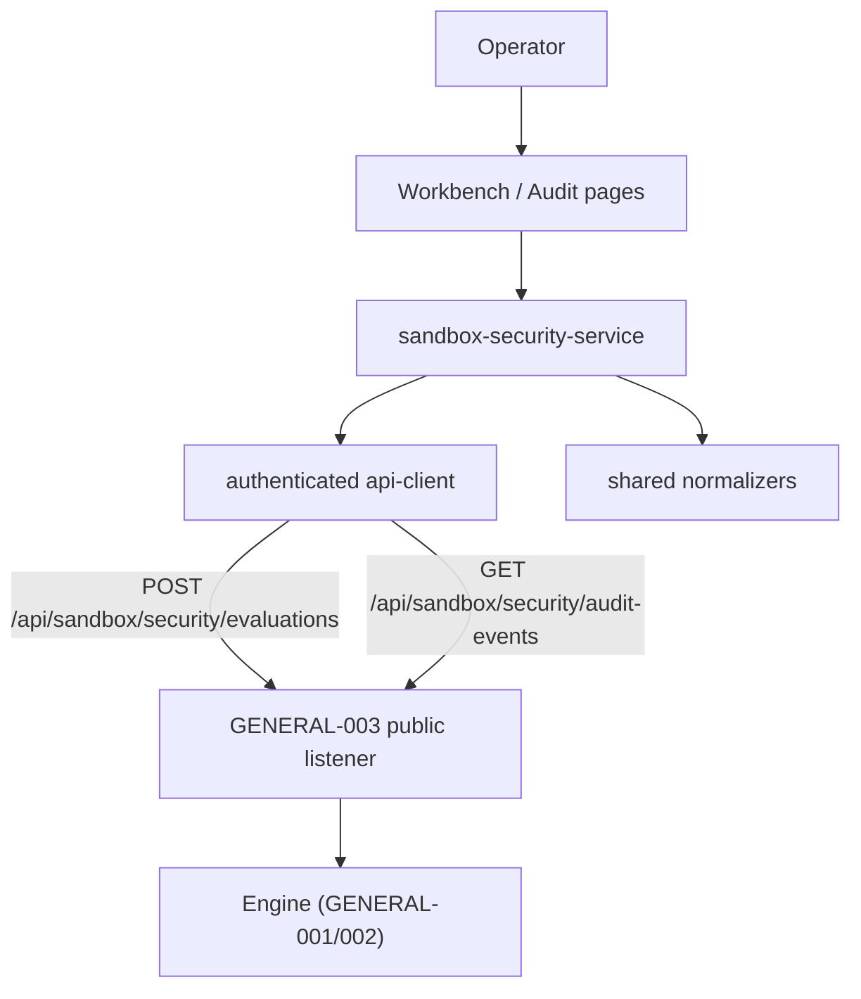

# Spec: REQ-SBX-GENERAL-005 Sandbox Security Frontend Workbench

## Document Status

- Requirement: `REQ-SBX-GENERAL-005`
- Umbrella feature: `SANDBOX-GENERAL-SECURITY`
- Date: `2026-08-07`
- Status: `DRAFT_PENDING_REVIEW`
- Review revision: 1
- Canonical umbrella design:
  `docs/superpowers/specs/2026-07-10-sandbox-general-security-design.md`
- Workflow: `Design -> Test (RED) -> Implement (GREEN) -> Document -> Stop`
- Delivery posture: this document is the Design-phase artifact only. It changes
  no production code, tests, or dependencies. Authoring it is a
  documentation exception to full TDD under `AGENTS.md` and `metadata.md`.

### Predecessor Status

GENERAL-005 depends on GENERAL-001 through GENERAL-004. At authoring time:

- GENERAL-001: complete.
- GENERAL-002: `PROVISIONAL_ACCEPTED_PENDING_P6_RECAPTURE`.
- GENERAL-003: `IMPLEMENTED_PENDING_GLOBAL_P6_GATE`; all five HTTP routes exist.
- GENERAL-004: `IMPLEMENTATION_IN_PROGRESS`, currently at P2-T3 with Phases 3-5
  unstarted.

`docs/sprint-current.md` therefore remains `REQ-SBX-GENERAL-004`. This spec must
not cause the active requirement to rotate, and no GENERAL-005 implementation
task may begin until GENERAL-004 closes and the user explicitly approves the
transition. The user confirmed this documentation-only boundary on 2026-08-07.

Maximum status GENERAL-005 may reach before its predecessors close:
`SPEC_DRAFTED_PENDING_PREDECESSORS`.

## Canonical Inputs

- `AGENTS.md`
- `metadata.md`
- `docs/sprint-current.md`
- `docs/architecture.md`
- `docs/api-contract.md`
- `.github/instructions/frontend.instructions.md`
- `.github/instructions/docs.instructions.md`
- `docs/superpowers/specs/2026-07-10-sandbox-general-security-design.md`
- `docs/superpowers/specs/2026-07-10-sandbox-security-core-spec.md`
- `docs/superpowers/specs/2026-08-05-sandbox-security-backend-api-design.md`
- `shared/types/sandbox-security.ts`
- `shared/types/sandbox-security-api.ts`
- `shared/contracts/sandbox-security.ts`
- `shared/contracts/sandbox-security-api.ts`
- `frontend/src/app/AppProviders.tsx`
- `frontend/src/app/navigation.tsx`
- `frontend/src/app/routes.tsx`
- `frontend/src/layouts/ConsoleLayout.tsx`
- `frontend/src/services/api-client.ts`
- `frontend/src/styles/app.css`

The umbrella design and Core Spec win if wording differs.

## Goal

Give an operator a first-class console surface for the sandbox security Engine:

1. Submit a bounded simulation evaluation at any of the three stages and read
   the returned verdict, action, risk level, findings, and detector runs.
2. Page through the content-free durable audit projection.
3. Present both inside a cybersecurity-console visual language that is dark,
   information-dense, and WCAG AA compliant.

The frontend is a presentation and submission surface only. It selects no
threshold, reduces no action, and derives no trust. Every semantic value it
renders is produced by the Engine and normalized by `shared/`.

## Scope

### In Scope

- A shared dark console theme layer applied once at `ConfigProvider`, plus the
  CSS custom-property redefinition that backs it.
- One evaluation workbench route and one audit-events route.
- A capability session model that holds an operator-pasted bearer token in
  memory only.
- An authenticated request path (POST with `Authorization` and
  `Idempotency-Key`; GET with `Authorization` and cursor paging).
- Client-side pre-submission validation against the shared structural limits.
- A stable mapping from the fifteen GENERAL-003 `error_code` values to
  user-facing copy.
- Accessibility details deferred to GENERAL-005 by the Core Spec and umbrella
  design: contrast, focus, keyboard order, reduced motion, and live regions.
- End-to-end acceptance across the theme layer, both routes, and the privacy
  rules.

### Out of Scope

- Any change to Engine semantics, detector behavior, policy reduction, or
  decision validation.
- Any change to GENERAL-003 public v1 DTO meaning, the five-route surface, or
  the GENERAL-004 private enforcement audit route.
- A new backend route of any kind, including a capability-brokering route.
- Enforcement-mode evaluation. The public route returns
  `evaluation_mode: "simulation"` and the workbench is labelled accordingly.
- A cross-cutting frontend auth/authz model. `metadata.md` lists the
  project auth/authz approach as an open Pending Decision and gates it behind
  explicit confirmation; this requirement deliberately does not resolve it.
- Restyling that changes DOM structure, accessible names, or routing of any
  existing Track 1 page.
- Rewriting existing page markup. Track 1 pages inherit the theme through
  tokens only.
- Persisting anything to `localStorage`, `sessionStorage`, IndexedDB, or cookies.
- A "load example request" JSON affordance populated from the benchmark corpus.
  The benchmark is sealed and excluded from development fixtures; reusing it
  would be a contract violation. Authored fixture examples are deferred to a
  future iteration.
- A client-side subject filter on the audit view. The route accepts only
  `cursor` and `limit`; any filter would apply over a single 100-row page and
  could mislead an operator into treating it as authoritative server-side
  filtering.

## Approved Decisions

These six were confirmed by the user on 2026-08-07 before drafting.

1. **Documentation-only.** Produce the spec and a RED-first plan group. The
   sprint stays on GENERAL-004; no production file changes in this requirement's
   Design phase.
2. **Shared theme layer plus new pages.** Apply the console theme once at
   `AppProviders`/`app.css` so every route inherits it. Build the two new pages
   natively in the new language. Do not rewrite existing page markup.
3. **Dark slate with a restrained accent.** Background `#0d1520`, ink
   `#e4edf5`, single accent `#22d3ee`. Prose in a UI sans; monospace reserved
   for identifiers, digests, and cursors.
4. **Operator-pasted capability, memory-only.** No new backend route. The token
   lives in React state, is never persisted, and is never placed in a URL.
5. **Specs and plans in English**, matching every existing document in
   `docs/superpowers/` that cross-references them.
6. **UI copy in Chinese, enum values in English.** Labels, help text, and errors
   are Chinese. Contract values (`risk_detected`, `deny`, `prompt_injection`,
   detector IDs, stage and profile IDs) render verbatim in English, because they
   are contract identifiers an operator must be able to match against logs and
   the audit page.

Decision 6 is consistent with `metadata.md`: "Source code identifiers should
use English. Documentation may use Chinese or bilingual wording."

## Architecture

### Layer Boundary



The frontend consumes only the two public platform routes. It never touches an
internal route, an engine-private module, or an engine payload shape. This
follows `metadata.md` ("The backend is the only platform entry for the
frontend") and `frontend.instructions.md` ("Frontend code must consume platform
APIs only").

### Ownership

- `shared/` owns every sandbox-security type, catalog, limit, and normalizer.
  GENERAL-005 adds no sandbox-security type and duplicates no enum locally.
- The service layer owns request construction, header assembly, normalization,
  and error classification.
- Page components own layout, state, and accessibility.
- Presentational components stay free of data fetching, per `metadata.md`
  ("Keep presentational components separate from platform data integration
  concerns").

### Reused Contracts

All imported from `shared/` with the established extensionless deep-relative
pattern already used across `frontend/src`. These files carry no `node:`
builtin, so they resolve in the browser exactly as `shared/contracts/supervision`
already does today.

| Import | Use |
| --- | --- |
| `SandboxSecurityRequest` | submission body |
| `SandboxSecuritySubmittedContentItem` | content item rows |
| `SandboxSecurityToolRequest` | tool-request stage fields |
| `SandboxSecurityDecision` | result panel |
| `SandboxSecurityFinding` | findings table |
| `SandboxDetectorRun` | detector-run table |
| `SandboxSecurityAuditEvent` | audit rows |
| `SandboxSecurityAuditPage` | audit paging |
| `normalizeSandboxSecurityRequest` | pre-submission structural check |
| `normalizeSandboxSecurityDecision` | response validation |
| `normalizeSandboxSecurityAuditPage` | audit response validation |
| `SANDBOX_SECURITY_STAGES` | stage selector, 3 values |
| `SANDBOX_SECURITY_CLAIMED_SOURCE_TYPES` | source-type selector, 6 values |
| `SANDBOX_SECURITY_POLICY_PROFILE_IDS` | profile selector, 2 values |
| `SANDBOX_SECURITY_RISK_CATEGORIES` | category rendering, 9 values |
| `SANDBOX_SECURITY_SEVERITIES` | severity rendering, 4 values |
| `SANDBOX_SECURITY_VERDICTS` | verdict rendering, 3 values |
| `SANDBOX_SECURITY_ACTIONS` | action rendering, 4 values |
| `SANDBOX_SECURITY_MAX_TEXT_BYTES` | 131072 |
| `SANDBOX_SECURITY_MAX_REQUEST_BYTES` | 524288 |
| `SANDBOX_SECURITY_MAX_CONTENT_ITEMS` | 64 |
| `SANDBOX_SECURITY_MAX_JSON_DEPTH` | 12 |
| `SANDBOX_SECURITY_MAX_JSON_NODES` | 4096 |

No selector may hard-code a catalog. Each renders by mapping its shared
constant, so a catalog change cannot silently desynchronize the UI.

## Console Theme Layer

### Why Token-Driven

`antd@6.3.4` ships both `theme.darkAlgorithm` and `theme.compactAlgorithm`
(verified present in the installed package). Driving the theme through seed
tokens at `ConfigProvider` means:

- Every existing page inherits the dark console without markup edits.
- No stylesheet has to fight antd's light defaults.
- `compactAlgorithm` directly serves the information-dense mandate in
  `metadata.md` and `frontend.instructions.md`.

Hand-rolled CSS overrides are prohibited where a token exists.

### Seed Tokens

```ts
// frontend/src/styles/console-theme.ts  (single source of truth)
export const consoleThemeTokens = {
  colorPrimary: "#22d3ee",
  colorInfo: "#38bdf8",
  colorSuccess: "#34d399",
  colorWarning: "#fbbf24",
  colorError: "#f87171",
  colorBgBase: "#0d1520",
  colorTextBase: "#e4edf5",
  colorBorder: "#1f2d3d",
  borderRadius: 6,
  fontFamily:
    "'Inter', 'Segoe UI Variable Text', 'Segoe UI', system-ui, sans-serif",
  fontFamilyCode:
    "'JetBrains Mono', 'Cascadia Code', ui-monospace, monospace"
} as const;
```

`AppProviders` composes
`algorithm: [theme.darkAlgorithm, theme.compactAlgorithm]` with these tokens,
and sets `color-scheme: dark`. `borderRadius` drops from 16 to 6 because a
console reads as panels and rows, not cards.

### CSS Custom Properties

`app.css` keeps every existing variable *name*, so no rule that already reads a
custom property needs editing; only the `:root` values change, and new
variables are additive.

That alone is not sufficient. An audit of the committed sources found the
following, and Phase 1 is scoped against these exact numbers.

`app.css` holds 12 hex literals and 25 `rgba()` literals, and most `rgba()`
values are written **inline inside rules** rather than behind a variable — for
example `.console-sider.ant-layout-sider { background: rgba(245, 250, 249,
0.88); }`. Inverting `:root` alone would leave those rules light. Phase 1 must
re-point every inline literal at a custom property:

- 19 of 25 are light-surface, light-border, or legacy-teal-accent values that
  must become `var(--console-*)` references;
- the remaining 6 are dark grid overlays (`rgba(16, 42, 45, 0.03)`) and the
  panel shadow, which stay dark-on-dark and must be re-tuned to a light
  low-alpha overlay to stay visible.

`app.css` also holds 12 hex literals, of which only 5 sit inside `:root`. The
other 7 are inline in rules and need action, not a value swap: the 3-stop body
gradient (`#eef5f4`, `#f7faf9`, `#f1f6f5`) is a white page at 16.6–17.5:1 and is
replaced by `var(--console-bg)`; the brand-mark gradient's first stop `#146c72`
measures **2.98:1** against `#0d1520` and therefore **fails** WCAG 1.4.11's 3:1
non-text floor, so it is replaced by `--console-accent-soft` →
`--console-accent-strong` (`#0e7490`, 3.42:1); and the two
`var(--console-accent, #1677ff)` fallbacks are dropped, since `--console-accent`
is always defined and the fallback exists only to defeat the literal gate.

Separately, 12 hex literals exist in `frontend/src` TSX across three files. Five
are the light seed tokens in `AppProviders.tsx` (`#146c72` ×2, `#f3f7f6`,
`#102a2d`, `#d7e3e2`), replaced wholesale by `consoleThemeTokens`. The other
seven:

| File | Literals | Measured effect on `#0d1520` | Action |
| --- | --- | --- | --- |
| `StaticAnalysisResultSection.tsx` | `#f5f5f5` on a `<pre>` with no explicit text color | inherited ink `#e4edf5` on `#f5f5f5` = **1.09:1**, effectively invisible | **Defect.** Repoint to `--console-surface-raised` (`#16222f`), giving 13.60:1 |
| `SupervisionSessionList.tsx` | 6 status icon colors | 4.47–9.65:1, all clear the 3:1 WCAG 1.4.11 non-text floor | Not a compliance defect. Tokenize for palette consistency only; `#1677ff` is a legacy antd light blue |

The `SupervisionSessionList` values carry `role="img"` with an `aria-label`, so
they are non-text content and the 3:1 threshold applies, not 4.5:1. The
`<pre>` case is the only true contrast regression the theme introduces.

After Phase 1, no color literal may remain outside `:root` and
`console-theme.ts`.

| Variable | Value | Role |
| --- | --- | --- |
| `--console-bg` | `#0d1520` | page base |
| `--console-surface` | `#121c28` | panel |
| `--console-surface-raised` | `#16222f` | nested row, non-text |
| `--console-ink` | `#e4edf5` | primary text |
| `--console-muted` | `#8fa3b8` | secondary text |
| `--console-muted-dim` | `#7d92a8` | tertiary text |
| `--console-accent` | `#22d3ee` | accent, focus ring |
| `--console-accent-soft` | `#0f2a35` | accent fill |
| `--console-accent-strong` | `#0e7490` | brand-mark fill, deep accent |
| `--console-border` | `#1f2d3d` | decorative separator |
| `--console-border-strong` | `#2c3e52` | panel edge |
| `--console-border-interactive` | `#51708f` | input/control edge |
| `--console-mono` | JetBrains Mono stack | IDs, digests, cursors |

Semantic value colors, applied by contract value and never by ad-hoc choice:

| Domain | Value | Color |
| --- | --- | --- |
| severity | `critical` | `#f87171` |
| severity | `high` | `#fb923c` |
| severity | `medium` | `#fbbf24` |
| severity | `low` | `#38bdf8` |
| severity | `info` | `#94a3b8` |
| action | `allow` | `#34d399` |
| action | `alert` | `#fbbf24` |
| action | `ask` | `#38bdf8` |
| action | `deny` | `#f87171` |
| verdict | `no_detected_risk` | `#34d399` |
| verdict | `risk_detected` | `#f87171` |
| verdict | `indeterminate` | `#fbbf24` |

`no_detected_risk` renders in the success color but its copy must never assert
safety. Per the umbrella design it means "configured detection completed without
an accepted risk finding; this is not proof that the input is safe." Required
Chinese copy: `未检出风险（不等于安全）`.

### Verified Contrast

Measured against `--console-bg` `#0d1520` and `--console-surface` `#121c28`.
Every text token clears WCAG AA 4.5:1 on both.

| Token | Ratio vs bg | Ratio vs surface | Result |
| --- | --- | --- | --- |
| ink `#e4edf5` | 15.48 | 14.50 | AA text |
| muted `#8fa3b8` | 7.07 | 6.63 | AA text |
| muted-dim `#7d92a8` | 5.72 | 5.36 | AA text |
| accent `#22d3ee` | 10.15 | 9.51 | AA text |
| critical `#f87171` | 6.63 | 6.21 | AA text |
| high `#fb923c` | 8.10 | 7.59 | AA text |
| medium `#fbbf24` | 10.98 | 10.29 | AA text |
| low `#38bdf8` | 8.56 | 8.02 | AA text |
| info `#94a3b8` | 7.15 | 6.70 | AA text |
| allow `#34d399` | 9.54 | 8.94 | AA text |
| border-interactive `#51708f` | 3.55 | 3.32 | AA 1.4.11 |
| accent on accent-soft | 8.28 | n/a | AA text |

Two values were corrected during design rather than shipped: an earlier
tertiary text color reached only 4.44 (AA-large, failing AA text) and was
raised to `#7d92a8`; `border-strong` at 1.67 is decorative only, so a separate
`--console-border-interactive` at 3.55 was introduced to satisfy WCAG 1.4.11
for input and control boundaries.

Any future token added to this layer must be accompanied by its measured ratio.

## Route and Navigation Surface

Two additive routes. No existing path changes.

| Path | Page | Purpose |
| --- | --- | --- |
| `/sandbox-security/workbench` | `SandboxSecurityWorkbenchPage` | submit and read one simulation evaluation |
| `/sandbox-security/audit` | `SandboxSecurityAuditPage` | page the content-free audit projection |

`navigation.tsx` gains one group appended after `results`:

```
沙箱安全  (key: sandbox-security)
  ├── 评估工作台   /sandbox-security/workbench
  └── 审计事件     /sandbox-security/audit
```

`getSelectedNavigationKey` already resolves any exact known path, so both keys
select correctly with no change to its logic.

`defaultOpenKeys` is a different matter and requires one authorized line of
change. `ConsoleLayout.tsx:61` hardcodes `defaultOpenKeys={["results"]}`; it is
not derived from `consoleNavigation`. rc-menu renders inline submenu children
through `CSSMotion`, which returns `null` while the group has never been
opened, so a collapsed group's links are absent from the DOM entirely — not
merely hidden. A test that queries the audit link by role would therefore fail
for a structural reason unrelated to the route wiring.

GENERAL-005 is consequently authorized to make exactly one edit to
`ConsoleLayout.tsx`: `defaultOpenKeys={["results", "sandbox-security"]}`. No
other line of that file may change, and its two existing specs
(`console-menu.spec.tsx`, `app-shell.spec.tsx`) must remain unedited and green,
which they do because `results` stays present.

## UI Component Skeleton

```
pages/
  SandboxSecurityWorkbenchPage.tsx     route + state + submission orchestration
  SandboxSecurityAuditPage.tsx         route + cursor paging state
components/sandbox-security/
  CapabilitySessionPanel.tsx           token paste, clear, status
  EvaluationRequestForm.tsx            stage, profile, content items, tool request
  ContentItemRow.tsx                   one submitted content item
  ToolRequestFields.tsx                tool_request stage fields
  RequestLimitMeter.tsx                live byte/item/depth/node budget
  DecisionSummaryPanel.tsx             verdict, action, risk_level, ids, timing
  FindingsTable.tsx                    findings incl. subject_refs locators
  DetectorRunTable.tsx                 detector runs, all three status variants
  AuditEventTable.tsx                  eight audit event variants
  AuditCursorPager.tsx                 limit + next_cursor paging
  SandboxSecurityValueTag.tsx          verdict/action/severity/category tag
```

`SandboxSecurityValueTag` is the single place a contract value maps to a color,
so the semantic table above has exactly one implementation.

## Frontend Service Signatures

```ts
// frontend/src/services/sandbox-security-service.ts

export interface CapabilitySession {
  readonly bearerToken: string;   // memory only, never persisted
}

export type SandboxSecurityCallResult<T> =
  | { kind: "ok"; data: T }
  | { kind: "error"; errorCode: string | null;
      httpStatus: number; retryAfterSeconds: number | null }
  | { kind: "invalid" }           // response failed shared normalization
  | { kind: "unavailable" };      // transport failure

// Discriminant is `kind` (not `status`). `httpStatus` is always present on the
// error branch — the transport layer derives it from the HTTP response before
// returning, so it is never null. These choices are enforced by the Phase 2 and
// Phase 4 test suites.

// Function names match the Phase 2 plan test imports (authoritative RED tests).
export async function evaluateSandboxSecurityRequest(input: {
  capabilityToken: string;
  idempotencyKey: string;
  requestId: string;
  stage: SandboxSecurityStage;
  policyProfileId: SandboxSecurityPolicyProfileId;
  contentItems: SandboxSecuritySubmittedContentItem[];
  toolRequest?: SandboxSecurityToolRequest;
  options?: ApiClientOptions;
}): Promise<SandboxSecurityCallResult<SandboxSecurityDecision>>;

export async function readSandboxSecurityAuditPage(input: {
  capabilityToken: string;
  limit: number;                  // clamped to 1..100
  cursor?: string | null;
  options?: ApiClientOptions;
}): Promise<SandboxSecurityCallResult<SandboxSecurityAuditPage>>;
```

Both normalize through `shared/` before returning and return `invalid` rather
than a partially trusted object, matching the existing supervision-service
convention.

`api-client.ts` currently supports only unauthenticated GET with
`accept: application/json`. It gains an authenticated request path carrying
`Authorization`, `Idempotency-Key`, and `Content-Type` for POST. The existing
`requestApiData` / `requestApiDataWithStatus` signatures and their
`api-preferred` / `mock-only` modes are preserved unchanged so no Track 1
service is affected.

There is deliberately no mock fallback for either route. A security verdict must
never be simulated by fixture data. On failure the pages show an explicit
failure state, consistent with the Track 1 campaign rule already recorded in
`docs/api-contract.md` ("Failure boundary and no-mock-fallback rule").

## Capability Session Model

Capabilities are issued only by `POST /internal/sandbox/security/capabilities`
with the bootstrap administrator token. That route is on the internal listener
and is unreachable from a browser by design. GENERAL-005 adds no public
brokering route, so the operator supplies the token directly.

Rules:

1. The token is held in React state for the lifetime of the page instance.
2. It is never written to `localStorage`, `sessionStorage`, IndexedDB, a cookie,
   a URL path, query, or hash, telemetry, or any log.
3. It is never rendered back. The field is `type="password"`, and the
   presentational panel receives only `hasToken: boolean`, never the value.
   There is no reveal control and no masked fingerprint, because both would
   require the raw token inside a rendered component.
4. It is cleared on explicit operator clear and on page unmount.
5. It is opaque to the frontend. No expiry countdown is shown, because decoding
   is not permitted. Expiry surfaces as a `401` and the copy asks for a fresh
   token.
6. Reloading the page requires re-pasting. This is intentional.

The audit route additionally requires the `sandbox_security:audit:read` scope
and the evaluation route requires `sandbox_security:evaluate` plus a granted
stage and profile. A token lacking the needed grant returns `403`
`SANDBOX_SECURITY_FORBIDDEN`, and the copy must name which of scope, stage, or
profile to widen without echoing the token.

### Idempotency Key Lifecycle

`Idempotency-Key` is generated with `crypto.randomUUID()` at the moment the
operator submits, and is bound to that exact form state.

- A retry of an unchanged payload reuses the key, so the backend replays the
  stored decision instead of re-evaluating.
- Any edit to the form invalidates the key; the next submit generates a new one.
- `409 SANDBOX_SECURITY_IDEMPOTENCY_IN_PROGRESS` is retried after
  `Retry-After`, reusing the same key.
- `409 SANDBOX_SECURITY_IDEMPOTENCY_CONFLICT` is terminal for that key and the
  copy explains that the key was already used with a different payload.

`request_id` is separate, client-generated, and correlation-only. The Core Spec
states the public `request_id` confers no authority, so the UI must not present
it as an identity or trust claim.

## Client Validation and Limits

Validated before any network call, so an over-limit request is never sent:

| Rule | Limit | Source |
| --- | --- | --- |
| content items | 1..64 | `SANDBOX_SECURITY_MAX_CONTENT_ITEMS` |
| text value bytes | 131072 | `SANDBOX_SECURITY_MAX_TEXT_BYTES` |
| whole request bytes | 524288 | `SANDBOX_SECURITY_MAX_REQUEST_BYTES` |
| JSON depth | 12 | `SANDBOX_SECURITY_MAX_JSON_DEPTH` |
| JSON nodes | 4096 | `SANDBOX_SECURITY_MAX_JSON_NODES` |

Byte length is measured with `TextEncoder`, never `String.length`, so multi-byte
Chinese input is counted correctly. Note the route's HTTP body cap is 786432
bytes while the canonical request cap is 524288; the UI enforces the tighter
canonical limit.

`RequestLimitMeter` shows live consumption and warns at 90 percent.
`tool_request` fields are required when and only when `stage` is `tool_request`.
Final structural confirmation runs through
`normalizeSandboxSecurityRequest`; a `null` result blocks submission and is
reported as a local validation failure, not a server error.

## Error Mapping

Every one of the fifteen documented `error_code` values maps to Chinese copy,
plus the transport and normalization cases. The table lives beside the service
and is exercised by test. Representative rows:

| `error_code` | HTTP | Copy intent | Retryable |
| --- | --- | --- | --- |
| `SANDBOX_SECURITY_UNAUTHORIZED` | 401 | capability missing/expired/revoked; paste a fresh token | after re-paste |
| `SANDBOX_SECURITY_FORBIDDEN` | 403 | scope, stage, or profile not granted | no |
| `SANDBOX_SECURITY_IDEMPOTENCY_CONFLICT` | 409 | key reused with a different payload | no |
| `SANDBOX_SECURITY_IDEMPOTENCY_IN_PROGRESS` | 409 | identical request executing | yes, `Retry-After` |
| `SANDBOX_SECURITY_CONCURRENCY_LIMITED` | 429 | all four Engine slots busy | yes, `Retry-After` |
| `SANDBOX_SECURITY_RATE_LIMITED` | 429 | token bucket rejected | yes, `Retry-After` 1..60 |
| `SANDBOX_SECURITY_BODY_TOO_LARGE` | 413 | exceeded raw body limit | no |
| `SANDBOX_SECURITY_REQUEST_TIMEOUT` | 408 | body exceeded 5000 ms | yes |
| `SANDBOX_SECURITY_STORAGE_UNAVAILABLE` | 503 | degraded persistence | yes, `Retry-After` 60 |
| `SANDBOX_SECURITY_AUDIT_CURSOR_INVALID` | 400 | cursor tampered or wrong scope; reset paging | reset |
| `SANDBOX_SECURITY_INTERNAL_ERROR` | 500 | internal failure | yes |

Two of the fifteen codes arise only on the internal listener and are unreachable
from a browser: `SANDBOX_SECURITY_ADMIN_UNAUTHORIZED` (bootstrap administrator
credential, `POST /internal/…/capabilities`) and
`SANDBOX_SECURITY_CAPABILITY_NOT_FOUND` (revoke target, same internal route).
The copy catalog must include both for completeness and to keep the
hard length-15 assertion in Phase 2 accurate, but these two are annotated
as internal-listener-only so a worker does not wire them to a UI flow.

An unrecognized `error_code` renders a generic failure and never crashes the
page. Because GENERAL-003 guarantees error bodies carry no token, content,
fingerprint, or diagnostics, the UI may show `error_code` verbatim.

## Privacy Rules

The umbrella design binds GENERAL-005 directly: "Application code must not put
submitted content in URL state, browser storage, response history, telemetry, or
durable audit."

Enforced rules:

1. No submitted content in any URL path, query, or hash. Route state carries no
   content, so deep links and the browser history entry are content-free.
2. No submitted content in `localStorage`, `sessionStorage`, IndexedDB, or a
   cookie.
3. No response history. Only the current decision is held; there is no
   client-side archive of prior submissions or their content.
4. No `console` or telemetry emission of content, token, or `Idempotency-Key`.
5. The audit view is content-free by contract and must render only the closed
   fields of the eight event variants. It must not attempt to correlate an audit
   row back to submitted content.
6. `finding.subject_refs` locators (`text_byte_range`, `json_pointer`,
   `whole_source`) are positions, not content, and are safe to render. They must
   be shown as positions and must not be used to reconstruct or echo a matched
   snippet. `evidence_refs` are opaque and render verbatim.

Explicitly not claimed, per the umbrella design: control over DevTools,
extensions, browser process memory, or OS swap.

The workbench renders `evaluation_mode` verbatim and carries a persistent
`SIMULATION / 仿真` badge. Copy must state that a simulation decision cannot be
used by an enforcement adapter.

## Accessibility

The Core Spec and umbrella design both assign final accessibility details here.

- Contrast: the verified table above; AA for all text, 1.4.11 for controls.
- Focus: a visible `2px` `--console-accent` ring at `10.15:1`, never
  `outline: none`. The existing `:focus-visible` pattern in `app.css` is the
  precedent.
- Keyboard: every control reachable and operable; logical tab order through
  capability, form, submit, result.
- Live regions: the decision summary is an `aria-live="polite"` region so a
  screen reader announces a returned verdict; validation errors are
  programmatically associated with their field.
- Tables: real header semantics, so verdicts are not conveyed by color alone.
  Every semantic color pairs with its English contract value as text. This is
  required, not optional.
- Reduced motion: the existing
  `@media (prefers-reduced-motion: no-preference)` guard is retained and no new
  unguarded animation is added.
- Color scheme: `color-scheme: dark` set at `:root`, replacing `light`.

Per repository rule, full WCAG conformance still requires manual assistive-
technology testing and expert review; this spec claims verified contrast and
implemented semantics, not certified conformance.

## Compatibility

Measured baseline on 2026-08-07, run inside WSL from the repository root:
**15 spec files, 221 tests, all passing**, 139.7 s. That is the regression gate.

Two verified facts make the shared theme layer safe:

1. No existing frontend spec asserts a literal color or an inline style.
   Class-name queries do exist — `sandbox-alerts.page.spec.tsx` selects
   `.supervision-session-list-wrapper`, `.supervision-inspector`,
   `.supervision-workbench`, and `.campaign-overview-header__passed`, and
   `campaign-components.spec.tsx:591` asserts the antd-internal `.ant-card` is
   absent. All are structural, and Phase 1's no-rename rule preserves them.
2. `renderAppAtRoute` in `frontend/src/test/app-test-harness.tsx` already wraps
   `AppProviders`, so a token change at that provider reaches every routed test
   without editing a single assertion.

A token-driven theme changes computed style only. It alters no DOM structure and
no accessible name. Therefore all 221 tests must still pass with zero assertion
edits, and any required assertion edit is a signal that the change exceeded the
theme layer and must be re-scoped.

One known risk the plan must close: an existing page may carry a hard-coded
light-mode color in an inline style or a bespoke CSS rule, which a dark
background would leave unreadable. That is a contrast defect, not a test
failure, so tests cannot catch it. The plan therefore opens with an explicit
audit task that enumerates every hard-coded color in `frontend/src` and either
replaces it with a token or records why it is already safe.

Pre-existing and out of scope: `antd@6` deprecation warnings for
`Alert.message` and `List`, observed in the baseline run.

## TDD Strategy

`AGENTS.md` prefers backend unit, then backend API, then frontend. This
requirement is frontend-only, so the order is adapted and the reason recorded:
there is no backend change to test.

Test order:

1. Repository gate: spec and plan-group files exist, are ordered, and status
   strings are consistent.
2. Theme layer: token values, algorithm composition, `color-scheme`, and the
   contrast assertions computed from the token table.
3. Service layer: header assembly, idempotency lifecycle, normalization,
   error-code mapping, cursor handling.
4. Presentational components: catalog-driven rendering for all 3 stages,
   6 source types, 2 profiles, 9 categories, 4 severities, 3 verdicts,
   4 actions, 6 detector statuses, and all 8 audit event variants.
5. Pages: submission flow, result rendering, paging, failure states.
6. Privacy assertions: no storage write, no content in URL, no content in
   history, no content or token in console output.
7. Regression: the full 221-test suite stays green.

Every test must fail first for the intended reason. A test that passes on
authoring is not covering new behavior and must be corrected before
implementation, per the TDD iron rule.

### Required Privacy Test

A dedicated leak sentinel, modelled on the GENERAL-003 leak sentinel, submits a
distinctive sentinel string as content and then asserts that the sentinel
appears in no `localStorage` or `sessionStorage` entry, no cookie, no
`location.href`, no history entry, and no `console` call. The same sentinel test
covers the bearer token and `Idempotency-Key`.

## Planned Implementation Surface

Exact paths, for the plan group to distribute across phases.

Create:

```
frontend/src/styles/console-theme.ts
frontend/src/pages/SandboxSecurityWorkbenchPage.tsx
frontend/src/pages/SandboxSecurityAuditPage.tsx
frontend/src/components/sandbox-security/CapabilitySessionPanel.tsx
frontend/src/components/sandbox-security/EvaluationRequestForm.tsx
frontend/src/components/sandbox-security/ContentItemRow.tsx
frontend/src/components/sandbox-security/ToolRequestFields.tsx
frontend/src/components/sandbox-security/RequestLimitMeter.tsx
frontend/src/components/sandbox-security/DecisionSummaryPanel.tsx
frontend/src/components/sandbox-security/FindingsTable.tsx
frontend/src/components/sandbox-security/DetectorRunTable.tsx
frontend/src/components/sandbox-security/AuditEventTable.tsx
frontend/src/components/sandbox-security/AuditCursorPager.tsx
frontend/src/components/sandbox-security/SandboxSecurityValueTag.tsx
frontend/src/services/sandbox-security-service.ts
frontend/src/utils/sandbox-security-limits.ts
frontend/src/content/sandbox-security-copy.ts
```

Modify:

```
frontend/src/app/AppProviders.tsx        dark + compact algorithm, seed tokens
frontend/src/app/navigation.tsx          one nav group, two children
frontend/src/app/routes.tsx              two routes
frontend/src/styles/app.css              token values, new variables, dark scheme,
                                         inline rgba() literals repointed to vars
frontend/src/services/api-client.ts      authenticated POST/GET path
frontend/src/layouts/ConsoleLayout.tsx   defaultOpenKeys gains the new group key
package.json                             register new repository gates in test:repo

frontend/src/components/task-detail/StaticAnalysisResultSection.tsx
                                         theme defect: <pre> background #f5f5f5
                                         yields 1.09:1 against inherited dark
                                         ink; repoint to
                                         --console-surface-raised
frontend/src/components/supervision/SupervisionSessionList.tsx
                                         tokenize 6 status icon colors for
                                         palette consistency; no contrast
                                         defect (all clear the 3:1 non-text
                                         floor)
```

Tests created:

```
tests/repository/sandbox-security-frontend-spec.spec.ts
tests/repository/frontend-console-theme-literals.spec.ts
frontend/src/styles/console-theme.spec.ts
frontend/src/styles/console-theme.provider.spec.tsx
frontend/src/services/api-client-authenticated.spec.ts
frontend/src/services/sandbox-security-service.spec.ts
frontend/src/utils/sandbox-security-limits.spec.ts
frontend/src/content/sandbox-security-copy.spec.ts
frontend/src/components/sandbox-security/sandbox-security-value-tag.spec.tsx
frontend/src/components/sandbox-security/capability-session-panel.spec.tsx
frontend/src/components/sandbox-security/evaluation-request-form.spec.tsx
frontend/src/components/sandbox-security/decision-rendering.spec.tsx
frontend/src/components/sandbox-security/audit-rendering.spec.tsx
frontend/src/pages/sandbox-security-workbench.page.spec.tsx
frontend/src/pages/sandbox-security-audit.page.spec.tsx
frontend/src/pages/sandbox-security-navigation.spec.tsx
frontend/src/pages/sandbox-security-privacy.spec.tsx
```

Documentation updated at close: `README.md`, `docs/architecture.md`
(frontend layer and route list in section 2.1), `docs/api-contract.md`
(a GENERAL-005 frontend contract section), `docs/progress.md`.

Verify unchanged: every existing page, component, hook, service, mock, and spec
under `frontend/src` **except the nine files enumerated in the Modify list
above**, plus all `shared/` sandbox-security files.

In particular, no existing `*.spec.ts` or `*.spec.tsx` file is edited, and no
existing assertion is weakened, retargeted, or deleted. The theme layer is
required to be assertion-neutral: it changes computed style only, never DOM
structure, accessible role, accessible name, or rendered text. This is
achievable because no existing spec asserts a literal color, inline style, or
class name, and because `renderAppAtRoute` already wraps `AppProviders`, so the
token change reaches all 221 tests without touching one of them.

GENERAL-005 adds no shared contract, no backend file, and no engine file.

## Acceptance Criteria

1. `docs/sprint-current.md` still names GENERAL-004 for the entire Design phase.
2. The theme layer is token-driven at `ConfigProvider`; no hand-rolled override
   exists where an antd token applies.
3. Every token in the contrast table is implemented at its specified value, and
   a test asserts each measured ratio.
4. Both routes render, are reachable from the nav group, and are keyboard
   operable.
5. Every catalog that has a shared runtime constant renders from it; no local
   enum duplicate exists anywhere in the new code. The two type-only catalogs
   (`SandboxDetectorRunStatus`, `SandboxSecurityAuditEventType`) have no runtime
   array in `shared/`, and GENERAL-005 adds no shared contract, so their
   exhaustiveness is enforced by a `switch` with a `never` guard instead. A
   literal array of either is permitted only inside a test, to drive iteration.
6. All fifteen `error_code` values plus transport and normalization failures map
   to distinct handled states.
7. The leak sentinel passes for content, bearer token, and `Idempotency-Key`.
8. No `localStorage`, `sessionStorage`, IndexedDB, or cookie write occurs.
9. The workbench labels every decision `simulation` and never presents it as
   enforcement.
10. `no_detected_risk` copy never asserts safety.
11. The full frontend suite passes with at least 221 tests and zero edits to a
    pre-existing assertion.
12. No backend, engine, shared-contract, or OpenClaw file changes.

## Documentation And Stop Rule

The plan group ends at Document. After the final phase closes, update the four
canonical documents, report the five-item output contract from `metadata.md`
(files, tests, pass state, completion, suggested commit message), and stop.
Do not begin any adjacent requirement.

## Open Questions

None blocking the plan group. Two items are recorded as explicitly deferred:

1. **Capability brokering.** A future requirement may add an authenticated
   public brokering route so an operator no longer pastes a token. That needs a
   GENERAL-003 amendment, because GENERAL-003 fixes the public listener at
   exactly five routes, and it needs the project-wide auth/authz Pending
   Decision in `metadata.md` to be resolved first. Out of scope here.
2. **Track 1 page visual polish.** Existing pages inherit the theme but keep
   their current layout. Any bespoke redesign of a Track 1 page is separate
   work, since it would alter markup those pages' specs assert against.
